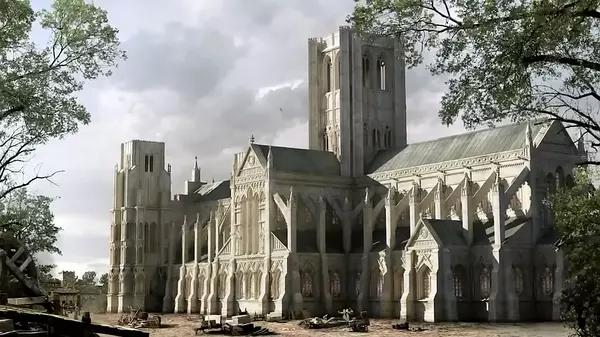
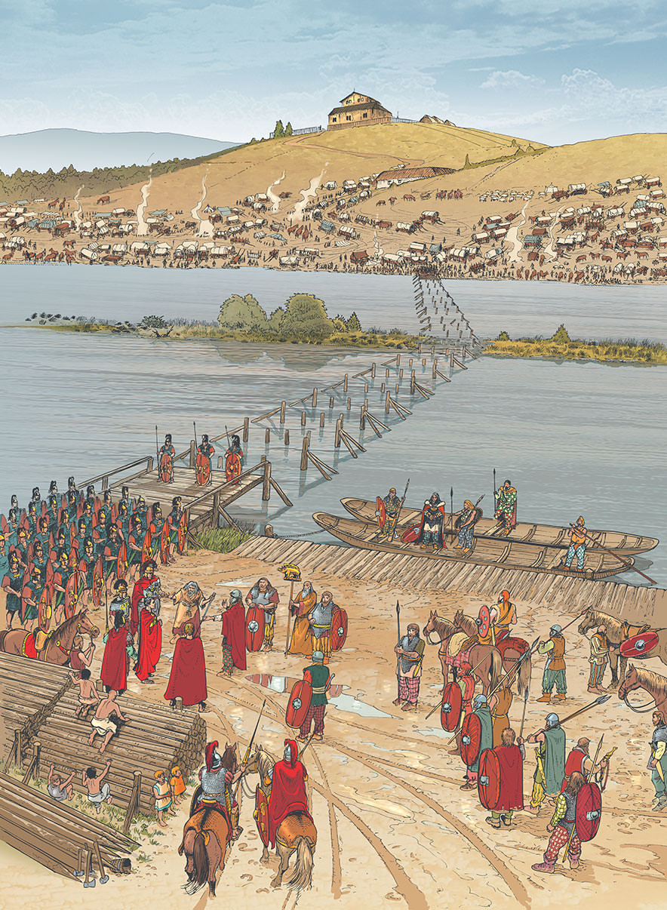
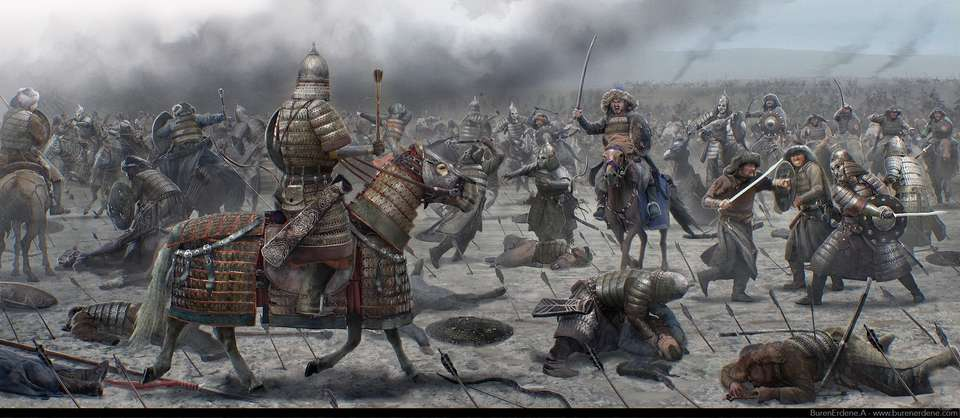

# 艾尔文往事：格温内德之乱与玛塔尔的兴衰

## 格温内德之乱与玛塔尔的兴衰

讲述人：罗莱·德穆兰

大地分崩离析青绿之地化为焦土，黑石巨人呕血而终，留给大地与后人无尽的伤痛。

古老的格温内德王国被一场远古大火烧尽，将格温内德境内的大部分富饶的平原化为焦土，只留下南方那贫瘠的山脉和高原。古老的格温内德人并没有在大火中全部被烧死，他们在这剩下的稀薄土地上建立起新的家园，但是她还是从南方第一强国变成了一个不入流的二流王国。不止国家衰弱，连生活方式都发生了改变。

青绿之地虽然化为火海，但是北方那些“野蛮人”当然，他们也叫我们“蛮族”。他们并没有因为大火而放弃对格温内德的进犯，他们控制了我们古代君王的坟墓——“炎王山”，现在被他们称为黑石山。他们在青绿之地的废墟上建立起了新的城镇和城市。对于北方敌人的扩张，格温内德人虽然能够把他们挡在“天父之墙”，但是却无力再打过去。随之而来的则是和平的贸易往来，马匹、陶器、战车、丝绸、染料和建筑学进入了格温内德，格温内德的生活方式从此发生改变。

### 白月人

大火烧毁古老的青绿之地后，格温内德的遗民们大举迁往南格温内德地区，大火在“天父之墙”停下脚步，但是白月城以西全部变成了草原和稀树草原再有就是一些气候恶劣的丘陵地区，白月城往南虽然富饶，但是止水湖的对岸却是格兰王国的控制范围，两国关系相对冷淡，有太大的外交期望，再者，白月城是古格温内德王国最后的一座富饶的城市，经济条件和地理优势使得继业者选择以白月城为首都建立新的格温内德王国。

新格温内德王国的统治者将富饶的土地分给那些亲信的氏族，那些不受他喜欢的人则被发配到丘陵或贫瘠的地方；随着与北方“蛮族”王国的交往频繁，住在白月地区的人开始效仿北方“蛮族”的生活方式，科林斯柱、密涅瓦盔、锥头盆盔、战车、宫殿、学院、以及手持巨大圆盾的重装长枪兵都进入了白月地区人们的生活中，这一时期的文明被学者叫做奥达曼式古典时代用于区别上古精灵的古典时代。

新格温内德的文化在这一时期如喷发式的高速发展，新格温内德的统治者开始变得傲慢，在与侵略的阿拉索人接触过后，更是将自己从王国的称呼改叫帝国，他们自称白月帝国，而不是格温内德帝国。可笑的是，这个帝国在阿拉索大军抵达鹰门城时候，明明有天险可守，但是却投降阿拉索人，成为了阿拉索帝国的附庸“帝国”。

帝国人常见名字：（受北方“蛮族”化同时保留传统姓名）尼基弗鲁斯、尼克、马可斯、巴西尔、德米特里斯、阿莱克修斯、希拉克略、尼尔、奥拉夫、拉格纳、艾格尼斯、爱尔伯塔、安德烈亚、安妮、艾琳娜、塔玛丽......

领袖：巴西尔二世

城市：白月城

<figure><figcaption></figcaption></figure>

<figure><figcaption></figcaption></figure>

### 草原人

格温内德的贫瘠高原很适合养马，住在高原的格温内德农夫开始养马、吃马肉、喝马奶，住在大荒野中，养着畜生放牧且居无定所，我们叫他们“草原人”。马匹和本地小马不一样，它们是来自希尔斯布莱德的冷血大马和阿拉希草原的草原马。岁月的变迁，草原人的男人为了方便骑马，头发也不再留着，取而代之的发型及其丑陋，一个大脑袋上只留一两撮毛，及其可笑，他们的女战士会在两侧的眼角下方的脸颊上会刻上三个苜蓿图案代表和男人一样的拥有骑马打仗的权力，不纹苜蓿的女战士一旦嫁人就不可再从戎。服装上，他们穿着皮袄子和皮靴，头戴着一种尖尖的帽子，腰间挎着弓与箭。虽然没有马镫，但是他们的腿部开始变得罗圈，能够更好的夹住马的肚子。在这炎热的气候中，他们发明了用羊角与木头符合的角弓，比艾尔文的紫衫木长弓杀伤力更大，更为方便在马背上使用。在盔甲方便，草原人不再铸造大片的铜板胸甲，而是不着甲只穿锁子甲或札甲，但是偶尔能够看见他们浇筑一些长胡子的男人脸面具的尖角盔（当然这时候还是古典时代的草原人）。草原人虽然不着甲，但是他们从北方敌人那里学到了镰剑技术，使他们成为南方第一批骑在马背上的战士。不过草原人大多为散户，且相互仇杀严重，同时他们也还信奉者古老的德鲁斯安教，所以在文化上还是倾向着一住在城市中的格温内人，也因此被城中人所管辖和征税。

草原人常见的姓名有：帖木儿、也速该、扎木合、窝阔台、朱达、八儿胡真、吾拉什、吾鲁、伯颜、乌苏丽雅、孛儿帖、忽兰、也速干、托米丽司、乌丽雅......

领袖：忽儿牙

城市：黄水城

<figure><figcaption></figcaption></figure>

<figure><figcaption></figcaption></figure>

<figure><figcaption></figcaption></figure>

### 冷山人

冷山人是古格温内德遗民中被白月“皇帝”所流放的人，与草原人相处较多，唯一不同于草原人的是他们定居，也不太特别擅长骑射，但是他们拥有整个格温内德最富饶的矿产；虽然土地贫瘠，但他们依然顽强的进行农业生产。但是到冬天，他们将会面临最恐惧的时刻——草原人的抢劫；草原人在冬天会在一个或多个可汗带领下袭击山区，白月却对这件事睁一只眼闭一只眼，冷山人对帝国十分憎恶，无奈冷山人马匹稀少，也不擅长骑马作战；因此冷山人用铁冶炼出铁矛和月刃斧来组成阵列，在步兵后方的短角弓射手抛射十分精准对敌人是巨大威胁，不过因为步兵和骑兵是短板，冷山人少有在草原人的攻击下取胜，帝国也因此对冷山人有着牢牢的控制。

冷山人保留了传统的格温内德文化服装，和所有艾尔文人一样，短褐一直覆盖整个大腿直到膝盖的位置，腰间系上皮带用于挂小包和匕首、短剑。打绑腿且不穿靴子，头戴一个圆形皮毛帽子。著名的特兰迪山德鲁斯安教圣殿（白塔学院前身）就在冷山人生活的地方。

冷山人常见姓名：奥拉夫、拉格纳、伊万、弗拉基米尔、罗格涅达、玛蒂尔达、马尔蒂斯、伊莉娜、叶妮卡、葛雷莎

领袖：叶尼塞

城市：终炉城

<figure><figcaption>
冷山人驱逐帝国军官
</figcaption></figure>

### 玛塔尔人

玛塔尔人并非是格温内德一开始就有的族群，玛塔尔人是一群被流放的古格温内德氏族，他们族长因政治上的错误抉择导致全族被流放出白月，同时没有像冷山人那样分得任何的土地；他们只带着一些白月的精良铁器和装备成为大草原上的一支部族。德穆兰族长带领族人在舍瓦胡边建立起草原上的第一个定居点，取名为玛塔尔，那里的人被叫做玛塔尔人。玛塔尔为古语“晨星”之意，它夜晚的火光倒影在碧蓝的舍瓦胡中如星海一般美丽。特兰迪山塞拉河的冷水流入舍瓦湖，再流向白狮瀑布最终汇入止水湖，玛塔尔人占据着那最肥美的草场，牧马和农业并行，使得他们不断壮大。

玛塔尔人保留着白月的精锐装备，他们也是草原上唯一的重骑兵；本该称霸一方的玛塔尔人却依然尊重着草原的规矩，尊重可汗和共主，直到忽儿牙可汗被毒害，草原军阀互攻的时代。玛塔尔人是一个坚毅且乱宽容的民族，若没有一个软弱的皇帝卖国，玛塔尔人将会世代守护古格温内德的后代。

玛塔尔在服装上保留格温内德式的传统，同时又受草原严酷生活的所迫，使得他们拥有着多样性；不过玛塔尔人分为草原·玛塔尔人和河湖·玛塔尔；草原·玛塔尔人虽然也有着精良装备，但是风格上偏向于草原人的服装。河湖·玛塔尔人更偏向于格温内德传统的服装，还有一些与冷山人相似。虽然玛塔尔一分为二，但是草原游牧的人和定居农耕的人相处十分融洽。

玛塔尔人的军事力量以精锐甲胄骑兵为主力军，但没有马镫，所以通常都是先由骑射手进攻，弓箭对敌人造成大量损伤时再发动主力军冲锋。这一甲胄骑兵也是后来教会的铁甲圣骑兵的蓝本和原型。

玛塔尔人姓名：罗兰、罗德、罗德里斯、呼尔朵、江达尔、格尔萨、奥尔夫、罗莱、艾尔、呼兰......

城市：玛塔尔、扎德合林

领袖：河流·玛塔尔人德穆兰 草原·玛塔尔人夏莱德斯

<figure><figcaption>
河湖玛塔尔人
</figcaption></figure>

<figure><figcaption>
草原玛塔尔人
</figcaption></figure>

### 大湖的阿拉索人

大湖的阿拉索人，这个称呼你们觉得奇怪？这没什么难以理解的，你就理解是“住在湖边的阿拉索人”。

阿拉索人为什么来大湖居住？他们不是住在隔着世界八百英里的峡海对面吗？是的，我也好奇阿拉索人千里迢迢来我们国家做什么？他们怎么知道峡海以南还有土地？他们是怎么从“炎王山”来到格温内德的？你想继续求证问题答案？找大学士去，我可还要讲大湖的阿拉索人的故事。

阿拉索人第一次出现在格温内德隘口时，所有格温内德境内的人都震惊，世界上居然有着如此的神兵降临，头戴像是科林斯矮人盔的巴布塔铁盔，留着一样的红色鬃毛；他们手中持有巨大的红色盾牌和一种短小的帝国剑；身穿亮白的银色盔甲。不只是一个士兵穿着这样的装备，是成百上千的士兵。如果我们的皇帝够聪明，他就会在阿拉索人进入隘口时就堵截他们。可是我们的皇帝不知是喝了什么迷魂药，说那北格温内德打败“蛮族”的兄弟归来，竟然将我们的土地拱手送给外人，把止水湖送给了那些敌人。当阿拉索人摧毁格温内德的德鲁斯安神像说是清除异端时，白月的皇帝却默不作声；当阿拉索人要求皇帝亲吻圣光的十字架并皈依圣光信仰时，皇帝竟然同意了，还要求全国放弃德鲁斯安信仰。

阿拉索人在止水湖站稳脚后阿拉索的军人源源不断的来到格温内德，土地越来越不够外来者瓜分，皇帝居然怂恿着阿拉索人一起消灭艾尔文诸国，有着这样一个卖国者的帮助，艾尔文的至高王也被阿拉索人所杀死，整个古老的艾尔文被改名为南阿拉希，同时摧毁掉了所有德鲁斯安信仰，他们在这里的占据了长达一代人的时间。

城市：湖畔城、石堡

领袖：洛萨

<figure><figcaption></figcaption></figure>

<figure><figcaption></figcaption></figure>

<figure><figcaption></figcaption></figure>

## 格温内德之乱

讲述人：罗莱·德穆兰

### 大湖的阿拉索人

阿拉索人来到天父之墙时，从未想到青绿之地的古老传说是真的，大火在高墙停息，绿草树林再次出现在眼里。阿拉索人早已得知这里有人，但是他们经过漫长的跋涉，并没有能力抵御任何一次攻击，如果皇帝在这时候下令攻击，他们只能灰溜溜的回家。可惜啊，那个卖国贼出卖了人民，他主动派遣使者去接见阿拉索人，还将物产最富饶的止水湖拱手相让，简直是引狼入室。若是这头狼能为皇帝所用，那他们只是一条为格温内德扩张的鹰犬；不过皇帝没能控制这些狗，还让这些狗威胁；人被狗管的服服帖帖。哼，阿拉索人告诉皇帝，要他效命阿拉索帝国，否则就将白月屠城；皇帝居然答应投降成为附庸。

### 破坏神像运动

阿拉索人来到只是让我们换了一个主子，我们其实并不在意；以前就是交税交税，现在也是交税，只要交了税就能够安享太平。

阿拉索人除了让我们赋税外的举动侮辱了整个格温内德和我们的祖先。他们破坏德鲁斯安神殿，捣毁“阿诗玲”的神像，在神殿的遗址上建立起圣光的圣堂，并且要求我们的人都得皈依圣光，若是不皈依就砍掉脑袋。整个湖边的居民都是软蛋，他们居然背叛了祖先；但是更让我们惊讶的是皇帝也背叛了祖先，他否认自己是“阿诗玲”的子孙，谴责格温内德的拉格纳罗斯王；他下令拆除了白月的所有德鲁斯安神殿，甚至他第一个拎着战锤砸碎了“阿诗玲”的神像，不仅仅他自己皈依了，他还要求每个格温内德都该皈依圣光。这是格温内德人不可原谅的侮辱和背叛。

<figure><figcaption>
不幸者都被钉死十字架
</figcaption></figure>

### 止水城与南阿拉希

源源不断的敌人从峡海对岸、翻越雪山、跨过地狱的业火来到格温内德，漫长的路线有着被奴役的先民维护，让帝国大道不断的对阿拉索人所谓的“南阿拉希”输血，阿拉索的工匠和商人都来到这个未知的殖民地希望有一番作为；教士们也来到这里，希望吧圣光的福音传遍南国。随着这些人的来到，阿拉索人修建了一座没有城墙的城市——止水城。

止水城初期只是在止水湖畔的一个小渔村，当白月皇帝巴西尔将这里赠与阿拉索人后，阿拉索人在这里大兴土木，修建成为一个阿拉索城镇，教堂和市政广场都拔地而起，湖边的码头也变成整个贸易的中心，但是他们当时并没有跨越大湖，也没有修建连通南北的大桥。

<figure><figcaption></figcaption></figure>

湖对岸出现的繁荣宁格兰王国感到害怕，但他发现这些阿拉索人也许是一个机遇，当时格兰王国正在与暮色森林那野蛮的克罗姆信徒交战，战况对格兰王国十分不利。格兰王康马克·图彼德派遣使者到湖边与阿拉索人达成协议：开放贸易路线、允许在大湖上修建桥梁、允许教士进入格兰传教而阿拉索人则必须帮助格兰王国摧毁野蛮的布莱克伍德人。

<figure><figcaption></figcaption></figure>

<figure><figcaption></figcaption></figure>

康马克王虽然借阿拉索人之手消灭了敌人，但是康马克王开了个坏头，全艾尔文诸小国都开始效仿康马克王邀请阿拉索人打击敌人那样，邀请自己能够邀请到的人来打击自己的敌人。就这样，阿拉索人在短短的10年里面消灭了数十个小王国。这时艾尔文人才觉醒过来，知道自己引狼入室了；所有部族集结在康马克王的旗下，与阿拉索人大战七次，最终康马克王战死，整个艾尔文诸国献降，阿拉索人将艾尔文统一，并命名为“南阿拉希之地”。

### 艾尔文人大起义

艾尔文人在受到阿拉索人80年间，艾尔文人后再也无法忍受阿拉索的暴政，他们开始陆续造反、袭击戍边要塞、城市中暴动....

月溪人在月溪节那天因阿拉索百夫长朝月溪人的无酵饼里吐口水，引发月溪人暴动，月溪境内的城市中人朝士兵扔石头或是有预谋的伏击；南阿拉希总督不得不调驻艾尔文十一军团前往月溪地区平叛。第二个月溪节来临前，阿拉索人决定放弃月溪，在西泉地区设立边戍要塞彻底放弃对月溪的控制，月溪人得到了独立。

<figure><figcaption>
月溪人起义
</figcaption></figure>

风暴地，住在山区的艾尔文人口中是苦难的开始，他们口中声称风暴地的王国和居民都并非是真正的艾尔文人；他们全是大海上来的。玛纳诺、神王沃登、布伦希尔德这些风暴地神话人物几乎都不像艾尔文人的本土姓名；但是不管他们从哪里而来，风暴地的尚武传统和能够招来海外战士的能力，是不会轻易屈服于阿拉索人的。阿拉索人只是趁乱消灭了风暴地王国的内乱，风暴地人并不会屈服于阿拉索人的统治，在统治的这段时间内，风暴地是阿拉索帝国最为头疼的土地，这里的人不惧怕死亡，还会吃毒蘑菇成为力大无穷的狂战士。随着月溪人赶走阿拉索人起，风暴地的叛乱日渐严重，最终风暴地诸侯的巨大压力下让阿拉索人再一次放弃对风暴地的控制权。

<figure><figcaption>
风暴地战士
</figcaption></figure>

溪谷人，古老而骄傲的民族，他们分为山间人和溪谷人；山间人住在溪流源头的高山上；溪谷人住在溪流山谷的中央平原中。阿拉索人并不愿意征服山区，那些山区并不肥沃，刮不到油水外，还会遭到野蛮的山民袭击，溪谷的统治持续了很长时间，但山间却没有受到过帝国的管辖。狠毒的阿拉索人为了让溪谷与山间仇杀，故意设立一个傀儡国王，离间着溪谷与群山的关系。很遗憾，溪谷没能自我独立，直到三艾尔文联军围攻溪谷傀儡王国时，溪谷才脱离阿拉索人统治。

黑森林的布莱克伍德人，一群住在白天犹如黑夜的布莱克伍德森林的居民，他们是否形成国家？是否形成政府？无人知晓，七国对它的影响都是凶恶人野蛮人。格兰王邀请阿拉索人消灭布莱克伍德人时，阿拉索人深入布莱克伍德森林，屠杀了大量精装年男性，让那里的人屈服。在乌鸦岭处，布莱克伍德人已经是强弩之末，阿拉索人本该斩草除根时，他们没有这么做，而是把他们当做奴隶罢了。布莱克伍德的威胁没有解除，但是阿拉索人认为结束了，在乌鸦岭和三叉路口建立夜色镇。但是诡异的事情发生了，经常有阿拉索士兵或者居民消失，有时候还有一些士兵巡夜时被不知名的毒蛇咬伤，无药可治。在一天夜里，夜色镇和乌鸦岭的阿拉索人一夜间人间蒸发。阿拉索人决定放弃对布莱克伍德的控制。

<figure><figcaption>
黑森林人
</figcaption></figure>

格兰人曾经的至高王叫康马克·图彼德，他是第一个引狼入室拉阿拉索人打击对手的艾尔文先民国王，但是他也是第一个集结大军反抗阿拉索人入侵的英雄，可惜最终他被“斟酒人帕林”所出卖，康马克战死，而帕林却成为了阿拉索在格兰地区的世袭总督；他的背叛是格兰人永远不会忘记的，人民一直在忍耐，直到拜伦布鲁·图彼德揭竿起义；这个60岁的老头被一切独立的省份推举为“艾尔文高王”意为艾尔文联盟的盟主；在他带领下，格兰全景得到解放；在9月围攻溪谷省份中彻底消灭阿拉索在艾尔文地区的一切势力。在石堡会战中，拜伦布鲁高王彻底打败了阿拉索在“南阿拉希”卫戍军团，不幸的是拜伦布鲁被阿拉索的骑士袭击大营中被杀，艾尔文联军开始为权力而内斗。使得阿拉索军团剩余的幸存者依然占据大湖。

<figure><figcaption>
拜伦布鲁战前鼓舞士兵
</figcaption></figure>

### 草原之鹰

忽儿牙可汗带领下的大草原人依然按时给白月上缴赋税，提供兵役。人们会质疑德穆兰也会质疑夏德莱斯，但是没人会质疑忽儿牙可汗对帝国的忠诚。这样一位忠心耿耿的封臣无欲无求，连宗教依返时他都第一个受洗成为草原第一个圣光信徒，可是因为他没有按照皇帝要求强迫百姓皈依圣光教，对异教神像没有捣毁，引发皇帝愤怒，被皇帝一杯毒酒赐死。巴西尔皇帝如果聪明就会发现，有的草原人的忠诚仅仅只是忽儿牙可汗一个人的威信罢了；可汗一死，帝国派遣总督接管草原，想要效仿阿拉索制度，但是他不知道的是，整个格温内德的草原都开始骚动起来。

<figure><figcaption>
忽儿牙可汗
</figcaption></figure>

### 草原之乱

忽儿牙可汗一死，整个草原分裂出九个封国和汗国；有的效忠帝国，有的想趁机崛起，而有的居然还是圣光信徒想要讨伐异端的“圣战”。当然，玛塔尔公国就是要反判封君了。

草原人的互相攻杀都无法彻底的打败一个对手或者被对手打败，毕竟草原人自己人口并不是很多，两玛塔尔在一起也是人口稀少，找到一个盟友是必要的选择，否则势力单薄的玛塔尔无法统一草原。

<figure><figcaption>
混乱的草原
</figcaption></figure>

### 冷山之盟

帝国对冷山的压迫日益剧增，冷山人的反抗越来越强烈；正因为此，冷山人的玛塔尔最有可能争取到的盟友。冷山人的首领叶尼塞正值此时妻子和孩子都在帝国军官劫掠冷山时被帝国人所杀，玛塔尔的德穆兰立刻抛出橄榄枝，并把女儿嫁给了叶尼塞，许诺与他一同向帝国复仇。在特兰迪的圆环石阵神殿中，德穆兰与叶尼塞在瓦孔神的注视下结为血亲，发誓一同消灭帝国。

### 玛塔尔的崛起

冷山人加入玛塔尔后，玛塔尔的控制领域、人口、补给都大幅度增长。有了玛塔尔保护，草原再也无法袭击冷山。此时帝国加入了对草原地区的镇压叛乱，帝国不傻自然也注意到玛塔尔的叛乱；帝国人开始拉拢草原人，煽动那些信奉圣光的人去攻打容纳异端的玛塔尔-冷山联合公国。帝国一度占据上风，对冷山地区造成了巨大压力，但是玛塔尔击溃了大草原的一切敌对势力。

<figure><figcaption></figcaption></figure>

没有被彻底消灭的都和帝国退回了白月地区。玛塔尔此时已经成为格温内德最大的军事力量。德穆兰公爵开始称王，玛塔尔汗国成立；德穆兰也给叶尼塞册封为冷山国王，这时起帝国的灭亡只是时间问题。

<figure><figcaption>
叶尼塞国王
</figcaption></figure>

### 帝国的黄昏

玛塔尔汗国在春季的最后一个月跨越白狮河进军白月地区；巴西尔二世已经年过花甲，开始花白的头发并没有阻碍他的骄傲，他决定御驾亲征，让叛徒的脑袋全部插在白月城的凯旋门之上。

<figure><figcaption>
巴西尔二世
</figcaption></figure>

巴西尔皇帝带了500卷刃战车、2000甲胄重装骑兵、5000草原辅助军、以及三以1500人的步战军团、加上大湖阿拉索派出援助的500李德骑士；在白月的瓦萨兰河边与玛塔尔的大军决战，这场战役史称为瓦萨兰河会战。瓦萨兰河后方一百里就是帝国首都白月城，帝国在这格温内德少有的平原上发动会战，还在都城附近，势必是孤注一掷了。

<figure><figcaption>
白月城
</figcaption></figure>

德穆兰王汗带领的甲胄骑士只有1200名甲胄骑士、4500名草原骑射手、8000冷山人。局势和装备及其不对等，但是这一战是最后的决战，无论怎么样都不能输。

大战开始，巴西尔皇帝驾驭华丽的战车在三军面前出现，他的出现帝国人士气高涨，卷刃战车发动了冲锋。玛塔尔人纹丝不动，当卷刃战车在靠近时，箭雨从天而降，使战车上的盾手不得和长矛手一起把盾牌盖在头顶；战车的速度也开始慢下来，有的战车马死了或者是马受惊翻了。但无论如何卷刃战车的刀刃再也对玛塔尔人没有威胁性了。

战车离着玛塔尔军还有三分之一的距离，玛塔尔的骑射手开始出动。草原骑手们拿着手中的复合弓环绕的战车射箭，绝对不靠近战车；战车上的盾牌盖不住全身的防御，驭手和贵族战士们一个又一个的死去，直到最后格温内德的皇家龙旗倒下.......玛塔尔人赢得了第一次战斗。

暴怒的皇帝下令派出重装骑兵和辅助军团以及李德骑士；重装骑兵直线冲锋，辅助军团两侧朝着对方投射远程武器冲锋。面对这样的情况，骑兵必须只能搏一搏；玛塔尔的所有骑兵也发动了冲锋......

玛塔尔的甲胄骑兵没有马镫，夹着马肚子，双手举着长枪朝对方刺去，却被有马镫的白月甲胄骑兵的长枪捅得人仰马翻；标枪和弓箭在空中如同野蜂一样在天空乱舞随后扎入人的躯体、尸体和鲜血使大地一片狼藉，这一场战斗堪比艾尔文人和阿拉索人在石堡的决战，当步兵上去时，士兵为了活着或者更好的杀敌，都把尸体堆成一些小尸墙；战争陷入白热化，皇帝只能不断的把身边的卫队派到前线去弥补人数的空缺，皇帝也认为胜券在握了。

<figure><figcaption></figcaption></figure>

<figure><figcaption></figcaption></figure>

皇帝好大喜功，认为自己应该亲手杀了叛徒，便换掉了仪仗甲后，加入战斗中；皇帝成功击溃了冷山人组成的军队，并且将叶尼塞国王所杀，他的头颅被插在王旗上那一刻，活着的玛塔尔军队士气大跌并开始溃败逃跑。平叛是板上钉钉的事情了，也许是圣光显灵，注定要德穆兰当王，一个正要逃跑的士兵转身射了一支箭，这一支箭改变了整个战场的局势；它不偏不倚的射中了皇帝的眼睛——那是唯一没有盔甲保护的地方。

<figure><figcaption>
皇帝之死
</figcaption></figure>

皇帝倒下马后，身边的骑兵全部停下来，并开始把皇帝抬走。整个白月的军队全部退回了首都之中。而玛塔尔人却趁机开始了攻城战；玛塔尔人建立了无数的攻城塔攻击城墙，但是都被守军成功烧毁无数的攻城塔，战斗持续了三天。白月皇帝因那支箭上涂了粪便导致感染死去，巴西尔二世之子亚美里斯登基是巴西尔皇帝老来得子的孩子，还未成年，元老和贵族们商议后决定开城投降，条件是白月愿意放弃皇位、并向德穆兰效忠，而德穆兰必须留白月所有人的性命、白月也将永远是白月王族的封地、且德穆兰必须皈依圣光教。

<figure><figcaption></figcaption></figure>

当德穆兰同意了这一切后白月城打开了大门，在白月城内的巴斯特兰大教堂内，巴斯特兰主教（地区宗主教地位低于教皇）为德穆兰戴上了格温内德王冠。当人们亲德穆兰皇帝居住在白月城时，他拒绝了，反而回到基础设施不完善的玛塔尔城。同时德穆兰皇帝放弃了格温内德帝国或是白月帝国的国号，改国名为玛塔尔王国，自称为玛塔尔王，仅仅因为他厌恶阿拉索。

噢，对了。那500个阿拉索李德骑士都被火烧死了，特兰迪神殿最终也被拆除、在基址上修建了白塔城堡，德鲁斯安教在玛塔尔也算是灭亡了。

<figure><figcaption>
德穆兰皇帝
</figcaption></figure>

## 玛塔尔的兴衰

讲述人：拉斐尔·帕林修士

在阿拉索人败退后，留在止水湖的阿拉索人成为艾尔文地区的“孤狼”虽然艾尔文人开始内战，但是阿拉索人知道，迟早有一天艾尔文人会清算他们。他们开始向老盟友格温内德发出橄榄枝，但是格温内德的局势变化出现了新的王朝，一个仇视阿拉索人的王朝；阿拉索人不得不重新选择一个保护者。

拜伦布鲁虽然死了，但其子芬恩·图彼德却要求继承“高王”，遭到其他部族人反对，因此芬恩对其他部族发动了战争；芬恩正是一个适合阿拉索人投靠的对象。阿拉索人对芬恩发出邀请，芬恩一到止水城阿拉索人就效忠了他，成为了他的“李德骑士”。李德骑士是对抗其他部族的一个有力军队，同时也不费一兵得到南格温内德的土地。

<figure><figcaption>
玛塔尔骑士与李德骑士
</figcaption></figure>

阿拉索人投靠芬恩宁玛塔尔王愤怒，玛塔尔王支持艾尔文各部反抗芬恩，因此玛塔尔与格兰的关系恶化。玛塔尔王的骑兵不断袭击赤脊山脉的谷地，格兰王芬恩一面要对抗咄咄逼人的玛塔尔，又得镇压艾尔文人的独立。很不幸，月溪、风暴地、溪谷、黑森林都成功独立，因为格兰的士兵没能及时赶到那里镇压，他们都被困在北止水城抵抗那咄咄逼人的玛塔尔骑兵。德穆兰王是一个军事天才，他假意玛塔尔人败退回到“天父之墙”，宁平叛心切的芬恩王腾出手把大军开到到阿祖拉要塞准备平叛但是玛塔尔大军突袭了止水城，即使留守止水城的人想要破坏止水大桥，也最终失败，整个止水湖全部沦陷，芬恩王不得不跟玛塔尔人和谈，最终把赤脊山脉让给了玛塔尔人，不过居民全部迁回格兰，包括大部分阿拉索人遗民。

<figure><figcaption></figcaption></figure>

玛塔尔此时也元气大伤，开始休养生息数年，艾尔文的局势则不容乐观，几乎回到了阿拉索人入侵以前的样子、战争不断、王国不停的覆灭、复兴、再覆灭；这一个黑暗的流血世纪里，玛塔尔只有几次小战役——格兰人对赤脊山的争夺。玛塔尔人都把他们打了回去。

一个世纪后北国的阿拉索发生了巨变，帝国分崩离析，法迪尔·洛萨皇帝——那个阿拉索“雄狮”的后代成为了阿拉索的皇帝；他分析了北国局势后把眼光放向南国，他发现大部分南方诸国都恨阿拉索人，只有风暴地的暴风王国对阿拉索人没有太大的敌意，法迪尔皇帝把女儿嫁给了当时的暴风王乌瑞恩，并协助女婿一同打败其他艾尔文王国。直到乌瑞恩王战死，留下了一个遗腹子；孤儿寡母的王国最容易被人欺辱，洛萨皇帝便开始将风暴地作为自己的登陆点，诛灭了奥斯伯特家族后，风暴地再也没有人敢反对洛萨皇帝摄政；洛萨开始扩张，他击败了溪谷人后再击败月溪人，随后黑森林人被征服，疆土一直扩张到了荆棘谷地区。

格兰的至高王布赖恩·图彼德和玛塔尔的骑士王希伯兰德·德穆兰决定联手一起在格伦马尔德村会战阿拉索皇帝法迪尔·洛萨。阿拉索人带来了全身板甲手持骑枪的新式骑士与配备巴布塔盔（长得很像古典科林斯盔）的步兵，而格兰王和骑士王的古典老式骑兵显得苍白无力了许多。双方骑兵的交战中，古典骑士的冲击力比新式骑士小了许多，切陈旧的战术宁这两个国王丢了性命。

<figure><figcaption>
希伯兰德王
</figcaption></figure>

<figure><figcaption>
布赖恩王
</figcaption></figure>

<figure><figcaption></figcaption></figure>

阿拉索的形式骑士单手夹着一根3米长的巨大彩色棍子、棍子前端是一个叶型矛头，另一只手配备盾牌，马匹和古典骑士一样披着战甲。当他们冲刺起来，会用一个三角形的楔形阵队形，如刀子一样刺入并排冲刺的古典骑士中。当他们的骑枪刺入对方身体后，骑枪就会在巨大的冲击下折断，骑枪断裂后就拔出链锤或者十字护手的手半剑作战。古典骑兵虽然有了马镫，但是在冲刺时候的双手举枪，骑枪刺入敌人的身体后就会被卡住，或被对方抓住长枪；李德骑士更是不堪入目，他们沿用着古阿拉索的辅助骑兵作战方式，骑枪在手中如标枪一样的拿法，只能从上往下刺。

战斗结束后，格兰王和骑士王都死在了阿拉索人的马蹄下，整个南国再也没有反抗势力；好不容易赶走的阿拉索人再次胜利。不过北方阿拉索帝国本土不容乐观，国土不断的丧失到只剩下索拉丁之墙，古典时代的激流城也多次遭到洗劫，法迪尔下令，将激流城改建为要塞城市，大部分阿拉索人全部强制南迁到“南阿拉希”，将托尔贝恩家族封为阿拉希公爵，永远镇守北方国土和索拉丁“长城”。阿拉索帝国的举国南迁，在止水湖畔的古阿拉索城市止水城定位首都。

乌瑞恩家族与洛萨家族因为王位还是发生过战争，最终乌瑞恩胜利；为了得到艾尔文人支持，乌瑞恩继承的是至高王头衔，没有继承皇帝头衔；即使是这样，玛塔尔人也并没有屈服乌瑞恩家族统治、并多次反叛。这个“刺头”有天险可守，宁止水城的乌瑞恩王朝十分头疼，一次又一次杀死德穆兰王，总有继位者跳出来。这个情况一直持续到黑暗之门打开后的兽人战争。兽人虽然没有打入玛塔尔，但至少让这个“刺头”消停了下来。兽人战争中，他们协助安度因·洛萨摄政王征战兽人，玛塔尔对一个国家的认同感总算是建立起来，战争结束后再也没有爆发过战争，同时他们愿意担当抵挡占据黑石山霍德玛尔城的兽人，保卫“天父之墙”隘口的重任。

战争结束后最后一代玛塔尔“伪王”海因希里·德穆兰建立玛塔尔骑士团，用于吸纳全国的精英青年来当侠义骑士，骑士团成为一个培养保卫国家治安骑士的机构。海因希里去世后，剩下两个孩子，一个叫罗德一个叫罗莱，两个孩子分别在前往海外探险的途中失踪。白月城公爵召开了玛塔尔会议，为防止内战的爆发，元老们决议委任光明大教堂的教皇担任玛塔尔公国的大公，使玛塔尔的土地与教会扯上关系，让任何野心家都无可奈何。教皇控制下的玛塔尔也并没有多做任何举动和干涉。不过教皇与封建制扯上了关系，对国王是一个严峻的考验，也是对教会的纯洁性的一个考验。

当外人或修士们赞美我们教会拥有自己的土地，能培养教会武装保护自己时。我却时常叹息，愿教会不会陷入权力的腐化中......
