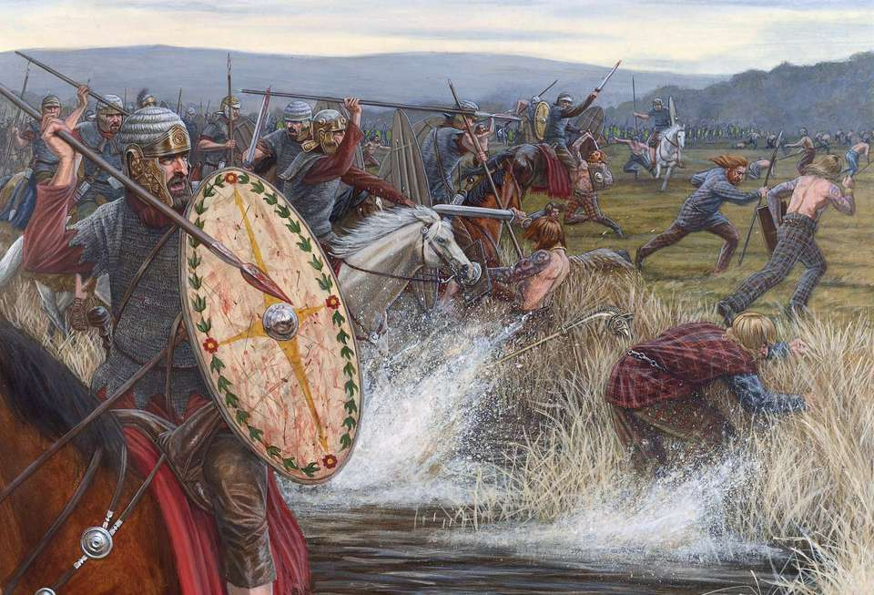

# 艾尔文往事：李德骑士

讲述人：戈莱伯爵

王国内几乎没有一支部队能在气势和骑士精神上与玛塔尔的骑士相抗衡，毕竟他们是七国内天生的骑手，每个孩子从生下来到死亡都是在马背上。但是，唯有格兰谷地的“李德骑士”能够与之一战，他们是王国内第一批真正的骑士。

“李德”一词在古语中为“男爵”之意，男爵一词并非来自于古老的先民，而是现代通用语中，也就是阿拉希-洛丹伦语。

“李德骑士”原先是阿拉索帝国征服南方诸国时带来的阿拉希-洛丹伦骑士，一个在数百年前统一人类诸国的大帝国，也是入侵南方七国的北方国度。

阿拉希-洛丹伦与南方七国隔了萨多尔海峡，各有卡兹莫丹山脉等地形。两个毫不相干的世界，阿拉索人却将南方视为理想中的新家园，这是一片与世隔绝的肥沃土地，群山环绕。而守护它的先民诸国，人口分布稀疏且隔离，各自为战，被阿拉索的士兵一一击破。

先民手中只有青铜制的武器和盔甲，远远无法与阿拉希的马匹和钢制武器相匹敌，但是先民在兵器上的落后造就了他们的生猛。最终先民在至高王康马克·图彼德的带领下团结起来；先民在一次又一次的战斗中歼灭阿拉索人的军队，宣示着要把北方的入侵者赶回群山和海峡那边的老巢。

阿拉索人集结在他们领袖的身后团结起来，这个人不是世袭贵族，也不是皇帝，而只是一位凭借自己能力爬上高台的骑士——法里恩·洛萨爵士，人称高地雄狮。

先民和阿拉索人的军队在格兰山巅下兵戎相见，以此决定南方诸国的命运。法里恩·洛萨爵士的骑兵和步兵与至高王康马克·图彼德相比不相上下，但是先民偏爱步战，况且这个地形下，先民无法驾驭卷刃战车；先民把守住了高地，在队列前先挖好战壕，并在里面插满木尖刺做拒马，在上面涂满粪便。阿拉索人的骑兵没有马镫，不敢贸然进攻，只得派步兵上前；六次进攻，被先民六次击退；阿拉索的士兵士气大跌，先民开始越过壕沟对其发起总攻。但是这一次进攻，先民中出了叛徒，他高喊着：“艾尔文败了！”随着这一句谣言，整个先民队伍开始摇摆不定，从“艾尔文败了！”开始，阿拉索的部队开始乘势而上。接下来整个先民队伍中都在谣传着：“艾尔文败了！至高王死了！”——先民败退了；阿拉索的骑兵开始追猎着这些先民，如同砍一颗颗萝卜一样。这是一边倒的屠杀，被屠杀的人成千上万人挤人，却没有敢于反抗的，只是一个劲的往后跑，谁也不想受死。

<figure><figcaption></figcaption></figure>

先民败了，艾尔文联军败了。诗人想为这位至高王写一首诗歌，彰显他的英勇事迹，但是他死的却毫不光荣。

至高王康马克身穿铜甲，

手持达努神之矛，

斩杀无数身披钢甲的阿拉索骑士。

......

至高王康马克被那逃跑的士兵所推倒，被几万人从身上踏过去，当战斗结束时，只能从哪被踩扁的王冠中才能认出那是至高王康马克。而先民最后一批精锐部队，全部被消灭，再也无法对阿拉索人造成威胁了。自此以后，阿拉索人获得了这一块得天独厚的富饶土地，这里被冠名为“南阿拉希之地”。

洛萨爵士把那先民的叛徒册封为格兰总督，成为阿拉索在南方的代理人，格兰的土地被封给每一个参战的骑士，他们都成为了古老土地上新的贵族。

当阿拉索本土发生内斗之时，先民们再次拿起武器，不过这一次拿起的是钢剑，推翻了阿拉索人的统治，那些曾经的阿拉索骑士本该被全部处死，但是至高王的战死，宁整个南方诸国出现权力真空，曾经的王国再次拔地而起，为了打击对手，这些阿拉索的骑士效忠了格兰的图彼德王，成为了“李德骑士”。

这些“李德骑士”都是贵族，他们拥有固定的财产，能够为自己和马匹供应价格高昂的铠甲，几乎没有正面部队能够扛住他们的一次冲锋，是重骑兵中的典范。

现在，王国常年对外作战、王国内部各地内战不断，李德骑士们都跟着他们的封君阿兰迪尔·图彼德响应国王的号召。当他们经历战斗疲软回来时，他们将会大吃一惊。格兰充满着无限的机遇，我会好好“使用”的。
