# 艾尔文往事：圣瓦尔古兰山城堡

讲述人：格里高利主教

血与火铸造的钢铁，就如国王们制造的奴仆一般；带去死亡和暴力，留下的只有伤痛。

兽人战争已经过去很久，依然有不少兽人盘踞与黑石山。那些兽人都生性异常残暴，能与魔龙与之相提并论。兽人从沼泽地开始出发，一直往北进发，沿途摧毁一切人类村镇，从澡泽地一直到赤脊山脉，兽人的劫掠者无处不在，原本的王都——从阿拉索时代开始建立、富饶而美丽、盛产上好威士忌的止水城被付之一炬；莱恩王不得不坚守风暴地的暴风要塞；兽人无法攻下那高耸百年的暴风要塞，只好出计谋刺杀了莱恩王，导致暴风要塞和老镇的沦陷。

兽人战争最终结束，安度因·洛萨摄政王和洛丹伦王一同把兽人部队撕裂成两部分——黑石山和今日的诅咒之地。但是摄政王安度因·洛萨并没有把握彻底把兽人击败，因此决定修建两座坚固的城堡用于围困和监事兽人；一座由联盟诸国出资，一座由达拉然出资建立。达拉然法师出资建立的城堡叫做守望堡，城堡规模和险要的地势都相对可以，但是若是和另一座城堡比较，那简直不值一提。

早在洛萨摄政王下令修建城堡的数百年里，修士们在瓦尔古兰山上建立了修道院，人们已经聚在这里朝拜，战争时期在这里避难。一个名为帕特里克的阿拉索人传教士在此第建造起了第一个教堂。传闻中他受圣光的指引，来到这个像从附近平地上拔地而起的平台一样，上面拥有湖泊、森林和肥沃的土地，而四周都是垂直的断崖，只有最勇敢的人才能爬上去。帕特里克受神的指引，在这里建立了教堂，数干年后成为隐修士们的修道院；即使是和平年代很少有人知道，在兽人战争时候更是躲过了兽人的肆虐。正因这样，摄政王洛萨才选定这里为建造城堡的位置。

<figure>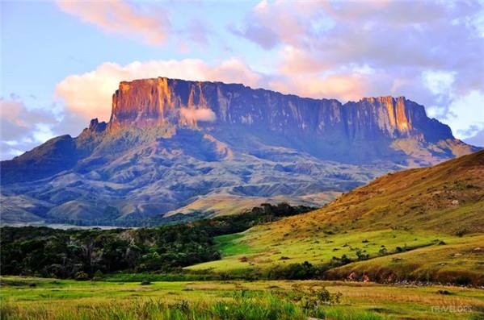<figcaption></figcaption></figure>

<figure>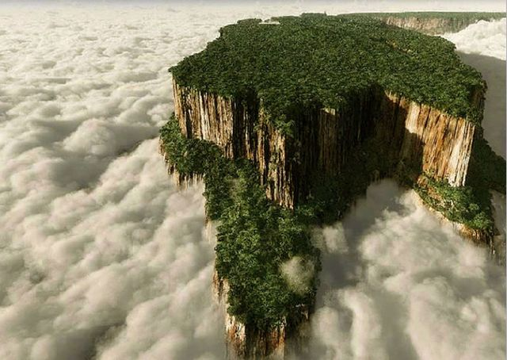<figcaption></figcaption></figure>

<figure>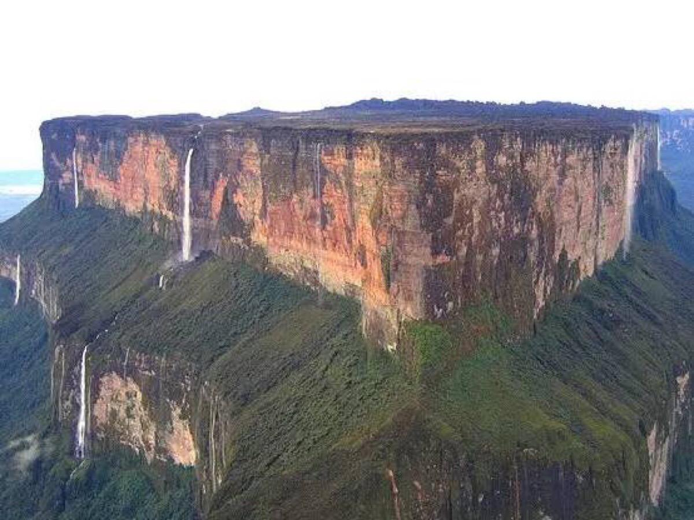<figcaption></figcaption></figure>

<figure>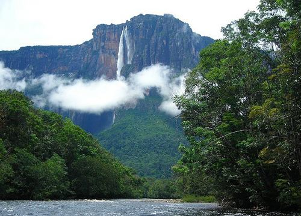<figcaption></figcaption></figure>

守望堡的进度很快，石料和钢铁从守望堡山下矿洞取得，木料从黑色隘口另一边的澡泽地获取，很快守望堡完工；可是瓦尔古兰山那边却迟迟没有开工，洛丹伦的贵族们认为一座类似守望堡那样的拉丁式城堡就可以了，那样还很便宜；而“我”和诸多艾泽拉斯贵族们认为应该修一座和暴风要塞那样的坚固的罗曼巴西利卡式的十字型城堡；工匠和设计师们也为图纸吵得不可开交。但是洛萨大人有更高明的想法，他希望打造一个坚不可摧的堡垒，能够流传千世万代，地面一切部队都无法攻陷的城堡外，还得是艾泽拉斯王国的精神图腾和圣地。虽然洛萨大人没有看见城堡完工那一天，就离开了这里前往燃尽之地讨伐黑石山，但是他再也没回来。

瓦尔古兰山的山壁如直线一样笔直，就像是天然的城墙，宁矮人工匠都惊讶的合不拢嘴；他们恨安威玛尔王没能打败拉格纳王，夺取这格温内德境内巧夺天工的“天父之墙”来建立比铁炉堡更宏伟的城市。矮人工匠的嫉妒使他们对这“神迹”之地更加的用尽拥有的智慧来造就“她”。在悬崖上，他们修建了城墙，但是那城墙下面连接着岩体凿出的岩体石墙，每一段墙体内都埋有有着一条空着的缝隙，能让湖泊的水泉运输到每一个驻守士兵的城墙内；城墙沿着悬崖那一面，石窗开的很大，能够容纳十字弩炮和蝎子弩的安防，还不用担心对方的投石称车扔到上面来，视野和采光极好，也十分舒适和凉爽；岩体内海凿有很多房间，最高可以容纳5万士兵同时驻扎在城墙内，岩体石墙上还衍生出许多由花岗岩所砌出罗曼式的碉楼和瞭望台，每一个衍生建筑下方都有着一套完整的排水系统，使卫生条件永远保持干净。

<figure>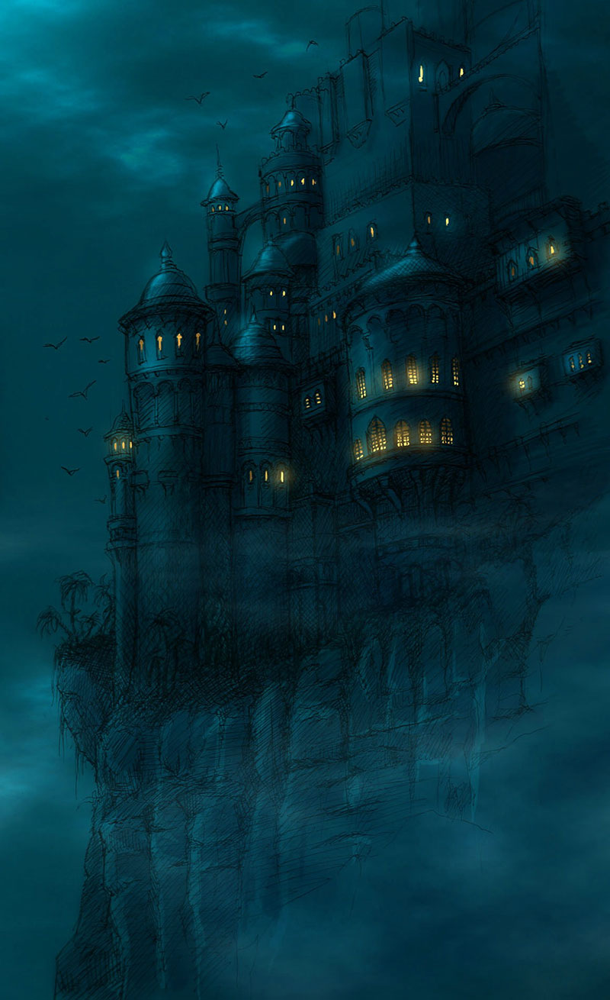<figcaption></figcaption></figure>

城堡大门则在石墙下的40米处，有两座吊桥连接大门；吊桥的两侧深不见底，进入吊桥后是一段细长的峡道，大规模部队无法同时行军，只能整齐的次序前进。城门是一个拱门，如大多数城堡一样低矮，但是也能让成年大象通过这个门，平淡无奇的大门旁边两个哥特式箭塔和一些保卫城门的城墙。当进入第一道大门后，恐惧吞没来访者的内心，高耸的拱门高达数十米，环绕的箭塔也深入云霄，杀人洞和弩炮都对着那一条不足10米的台阶桥，那台阶桥下方一片漆黑，不知有何事物。

<figure>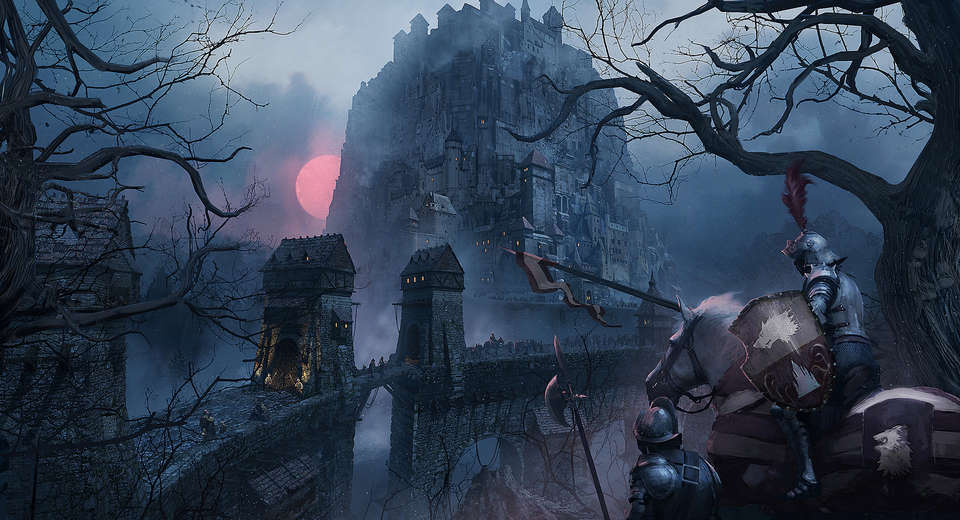<figcaption></figcaption></figure>

<figure>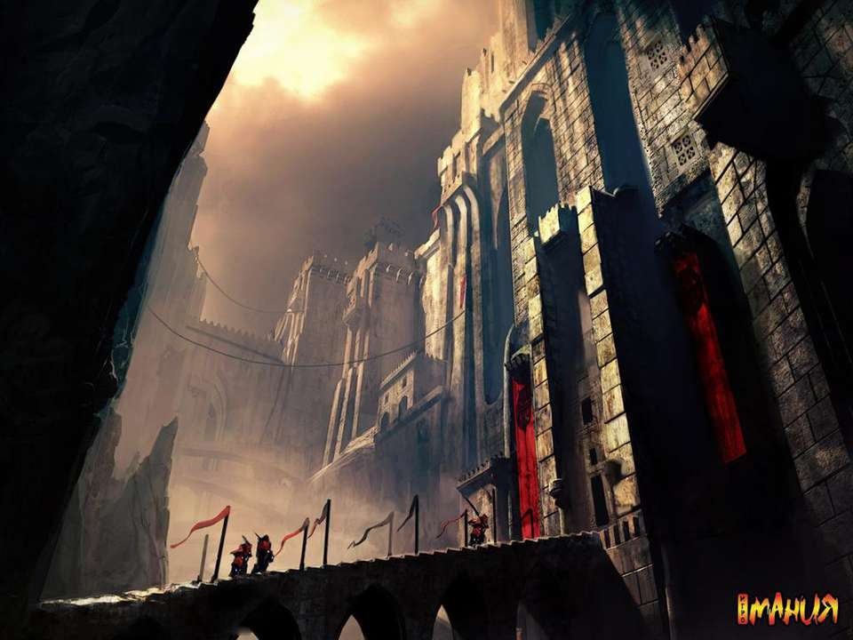<figcaption></figcaption></figure>

沿着大门进入，城堡内空虚的宁人害怕，吊灯和烛台离人的距离遥不可及，门厅两侧的墙上还有无数的杀人洞；走到门厅的尽头，有三个拱门，三个拱门都能够走到城堡的顶端，却是一个能够让人走到崩溃的巨型回廊，中途许多房间，通往城墙的各处；一直沿着回廊走，回廊的最高处将走上山顶，这时将会看见城墙包围着一整座山头；在山头的瞭望台上可以看见瓦尔古兰山的中央有一个凸起的山丘，山丘上是一个哥特式的大教堂，但是又像个城堡，这就是瓦尔古兰山的核心区域——圣三一城堡。

圣三一城堡是一座山丘削成的，在山顶上有三座大教堂，一座是罗曼式教堂——圣帕特里克大教堂；中间的是一座哥特大教堂——圣尼苛德摩大教堂；最末的一座教堂是一座古阿拉索风格的教堂——圣科伦巴努大教堂。南方的三位圣人本该是圣帕特里克、圣科伦巴努、圣布里吉塔，但是女人之名不当给教堂冠名，因此圣尼苛德摩成为了瓦尔古兰山上的圣三之一。

三座教堂有着哥特式的一切，华丽的飞扶壁，精美的石雕艺术，还有着华丽的小尖塔，每一个这样的塔楼，都得耗费无数的白银与黄金。这时人们并不是在想把“她”盖成防御性要塞，而是一个万世千秋的圣地，并且想把这里作为全世界的圣光信仰的中心。与同时期的光明大教堂相比，简直是奇观。这里完成之时，整个七国出现过财政困难，不过这些事情和修建神圣的圣山相比简直不值一提。这里成为了我们弗塔根家族的封地，我们世代守护“她”和圣光信仰。

三座教堂由城墙围绕，一直到山顶，就如同一个城堡那样坚不可摧；如果认为这就是教堂那就太可悲了，瓦尔古兰山中央的圣弥厄尔之丘是还拥有着足够的森林，如同国王的御林一般，仅仅为瓦尔古兰山的主教，也就是“我”的家族以及修士使用；用来冥想、探讨、教学、以及食物生产。“我”不是一个吝啬之人，因此“我”把圣弥厄尔之丘公开给所有人使用，有着无数的道路并不需要经过城墙区域就能够从城下的市镇中走到山上的大教堂内，也正是因为如此，我才能够从那“异教徒”“魔鬼”的手中逃脱，来告诉我的兄弟们。

<figure>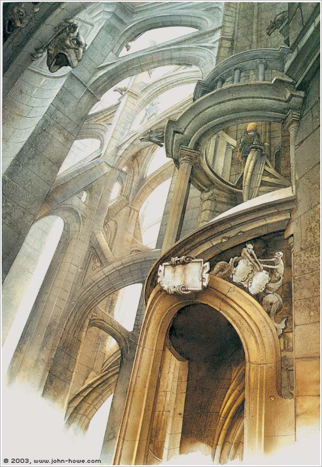<figcaption></figcaption></figure>

<figure>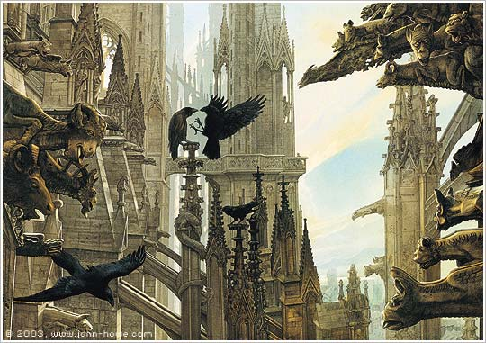<figcaption></figcaption></figure>

 

<figure>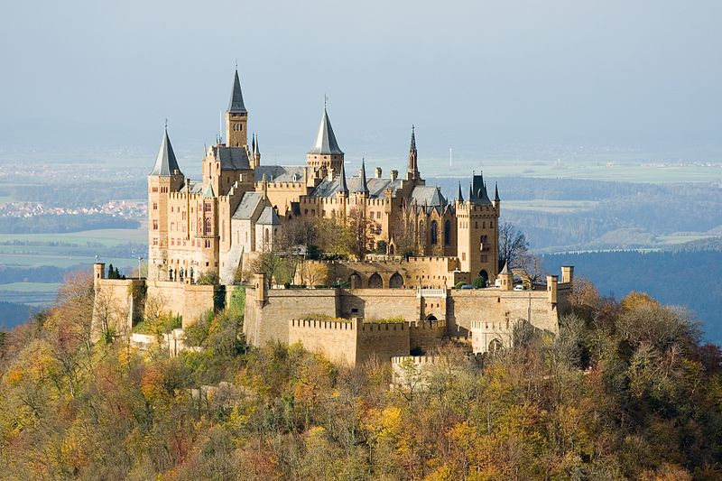<figcaption></figcaption></figure>

 

<figure>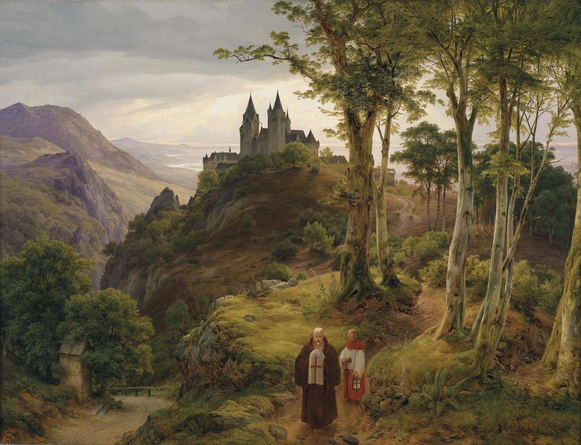<figcaption></figcaption></figure>

异教徒们已经攻陷那神圣的圣山，我不得不逃离这里，逃离我居住了多年的家。我的侄儿和侄女都已经离去，我的侄孙女也下落不明。只剩下我这个老人独守空巢，可现在真是连家都没了。我只能祈求着圣光，祈求着我的老友，能够原谅我的过错......
