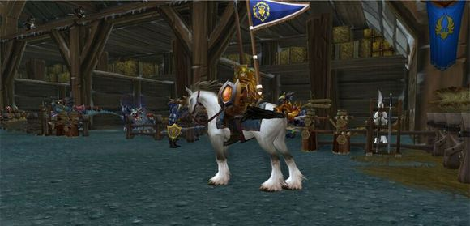
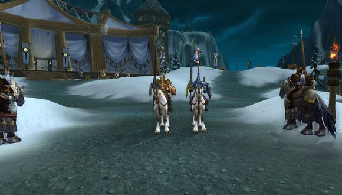

# 冬幕比武大会

“秋风撩动湖面的端庄，凋落的枫叶荡漾血红的波浪。”

丰收的金黄已然消逝，大地只剩下死寂，冬日的雪花悄然落下，唯有冬青和雪松毅然坚挺在这寒风之中。

旧的一年里，我们经历了许多伤痛；无尽的战火吞噬着年轻的生命，多少母亲再也见不到孩子，多少妻儿再也无法与丈夫团聚......因国王的英明领导，与王国战士们的热血奋战，才使我们的世界能够得到安宁。你我一起，高举酒杯——敬王国的将士们!

冬幕节是旧的一年最后一个节日，也是新年前的最后一个节气。我们在旧的一年里经历的一切伤痛，都应当在时节中将它抛开，好让我们心身洁净的迎来新的一年。战争结束了，再也不会有战争的伤痛了！

我们将要举办一场规模前所未有的枪骑术比武大会，庆祝战争的结束。为了国王的荣耀！为了圣光！为了艾泽拉斯的和平！

此次比武大会全体联盟成员国的公民皆可参加，荣耀、奖品、世人的青睐，在等待诸位勇士！

此布告，通知

艾泽拉斯诸国全体臣民

<figure><figcaption></figcaption></figure>

### 活动时间：

12月22日晚7点30分

### 地点：

银色北伐军营地

### 参赛报名：

骑士们于12月22日前通过游戏中写信方式，写信方式将报名信息发给贤者尼苛德摩。

也可12月22日当天比武大会开始前（8点以前），前来十字军演武场（北伐军营地）。

### 参赛要求：

骑士们必须符合以下几项要求才能顺利参赛

准备一套全副武装的护甲（盔甲嘛，越好看越好，这样就是全场最靓的仔）

骑士们尽量以马为坐骑（我猜你和我一样没其他的冠军成就）

附：参赛盔甲图示例：

<figure><figcaption></figcaption></figure>

<figure><figcaption></figcaption></figure>

### 场地介绍：

1.马匹领取处

<figure><figcaption></figcaption></figure>

2.骑枪领取处

<figure><figcaption></figcaption></figure>

3.比武场地

<figure><figcaption></figcaption></figure>

### 比赛流程：

1.预备参赛

每轮比赛开始前，比赛的选手从观台跳到马棚，进行准备

<figure><figcaption></figcaption></figure>

必须装备骑枪才可以骑上马

<figure><figcaption></figcaption></figure>

准备完毕后，勇敢地奔向赛场，还有那荣耀吧！

<figure><figcaption></figcaption></figure>

2.进入会场

两位骑手在赛场入口前会合，依次进入赛场

<figure><figcaption></figcaption></figure>

在女箭手雕像前驻马

<figure><figcaption></figcaption></figure>

面向观众鞠躬致礼

<figure><figcaption></figcaption></figure>

等待裁判员发号施令

<figure><figcaption></figcaption></figure>

两位骑手在场地中央对齐位置，进行插旗挑战

<figure><figcaption></figcaption></figure>

骑手开始武装护甲，当双方护甲值均为3时，裁判进行倒数计时开始

<figure><figcaption></figcaption></figure>

为了荣誉战斗！

<figure><figcaption></figcaption></figure>

3\. 单场比武结束

当一方被挑下马时比赛结束

<figure><figcaption></figcaption></figure>

比武场的所有观众将见证二人的胜利与失败

<figure><figcaption></figcaption></figure>

结束比赛的骑手们离场

<figure><figcaption></figcaption></figure>

4\. 失败者淘汰，胜利者将晋级，等待至中级赛。

5\. 对于比赛中途前来的挑战者，迎战与不迎战都不算作比赛记录中。

模式规则：&#x20;

比武中只有4种技能可以使用：

<figure><figcaption></figcaption></figure>

1 刺击

<figure><figcaption></figcaption></figure>

近距离攻击

<figure><figcaption></figcaption></figure>

2 碎盾

<figure><figcaption></figcaption></figure>

在远处投掷一根投矛减少对方的护甲值，近处无法使用

<figure><figcaption></figcaption></figure>

3 冲刺

<figure><figcaption></figcaption></figure>

以高速冲刺对对手造成巨大伤害并破坏一层护甲值，需要在一定距离才可释放

<figure><figcaption></figcaption></figure>

4 护盾

<figure><figcaption></figcaption></figure>

增加一层护盾，每次减少30%伤害，最高3层，持续60秒，3秒冷却

附：具体技能伤害\
无盾  1层护甲 2层护甲  3层护甲&#x20;

刺击  3250  2275     1300      325&#x20;

碎盾  2000  1400     800       200&#x20;

冲锋  8500  5950     3400      850

### 今年新推出弄臣表演节目：

于比武大会比赛开始前演出，用于等候比武参赛者的到齐。

节目表如下：

1\. 耍火炬

2\. 喷火人

3\. 芭蕾舞剧——枭兽湖

4\. 芭蕾舞剧——四小鱼人之舞

5\. 熊猫人相扑

6\. 秦唐单口相声

7\. 生吞蛤蟆

8\. 吟游诗人金曲

9\. 合不上的马儿

10\. 西部荒野男高音四重唱

11\. 舞龙

12\. 火鸡快跑

13\. 大河之舞

14\. 恶搞系列——部落都是废物

15\. 恶搞系列——时代变了

附注：给第一次参加比武的骑士的小指南\
您是位来自偏远地区的骑士，不知道我们的比赛场所在地？您虽是本国人，但第一次参加如此盛大的比武盛事，不知如何获得参赛资格及免费的骑枪和赛马？\
请您前往冰冠冰川银色比武场，在银色北伐军的大帐门口找到裁决者玛蕾尔·图哈特，她会详细的告诉你上述的一切！

<figure><figcaption></figcaption></figure>
