# 凛冬比武大会回顾

<figure>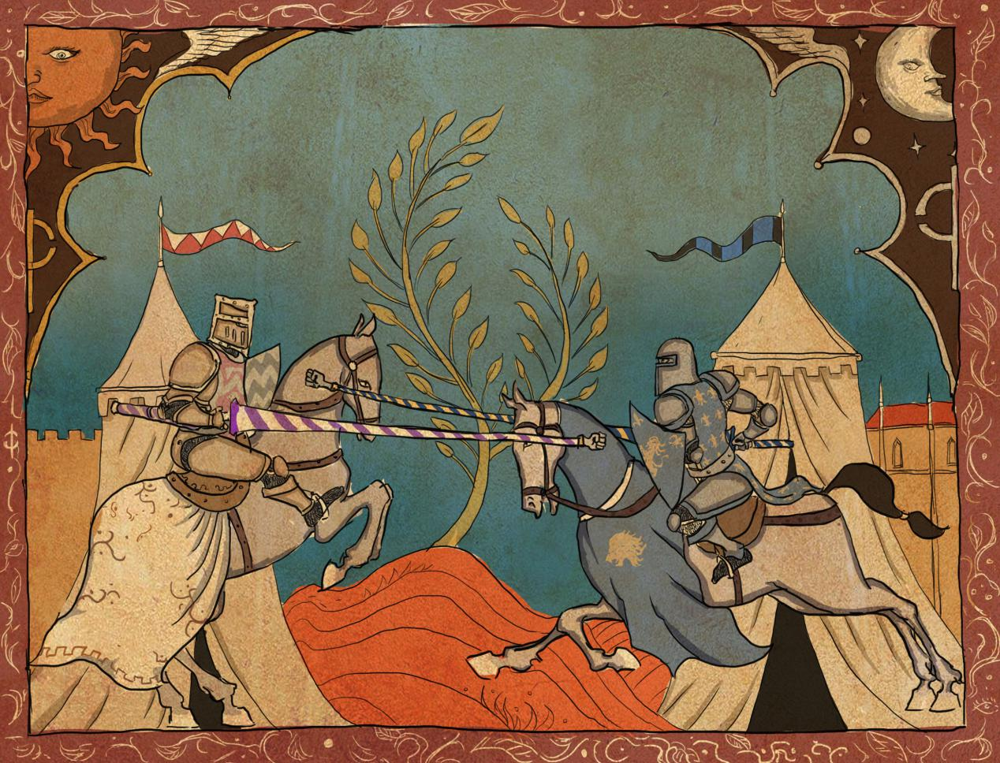<figcaption></figcaption></figure>

“圣光赐福，冬幕白霜，金戈铁马，响彻寒冬。”

艾泽拉斯一年中的最后一个季节，在许多文化中被认为是变化的一个季节。矮人和牛头人都在这个白雪覆盖大地的时候传颂着一个古老传说故事，并欢庆着一个辞旧迎新的时刻。而冬幕节并不是牛头人和矮人的专属节日，艾泽拉斯的其他种族也会庆祝这一节日。

比如:我们最熟知的地精<烟林牧场>和给孩子礼物的冬天爷爷，以及抢走礼物的格林奇；他们都是地精蹭节日的商业活动。

<figure>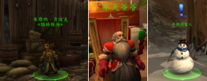<figcaption></figcaption></figure>

而今天容我向各位介绍另一个不一样的冬幕节——人类王国的传统冬幕节庆典：骑士比武大会。

历史：

在遥远的黑暗时代，人类在这个莽荒的世界里挣扎求生，大小部族四散在大陆上，人类向着外界不断扩张，而人类文明的第一个大敌，便是身强体壮的巨魔——阿曼尼部族。在旷日持久的战争中，广袤的希尔斯布莱德丘陵和阿拉希的草原提供了马这种生灵优秀的生存环境，而越过高耸的奥特盘踞的群山，战争首领洛丹恩的土地上，则生活着更加高大强壮的品种。

<figure>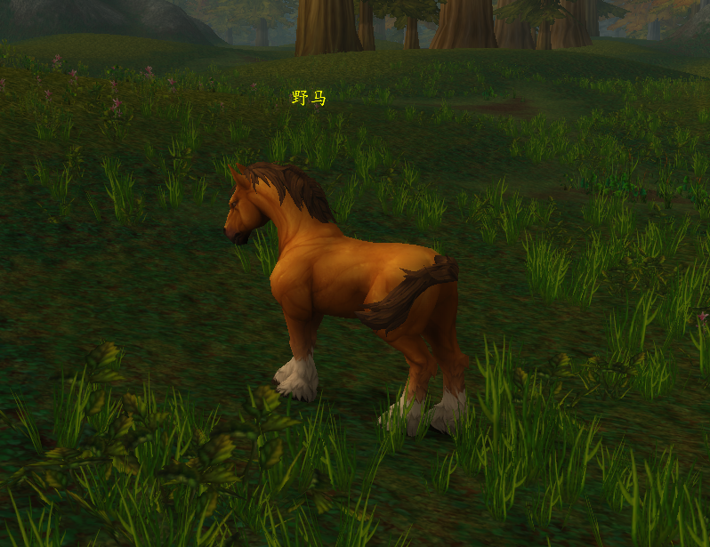<figcaption></figcaption></figure>

人类通过驯服马匹，并骑乘它们以获取了更快的动员能力和移动距离。同时驯服马匹也是改变战争进程和世界格局的一项重大举措。战争除了在精灵的协助和魔法的帮助下，人类的骑兵排山倒海式的冲向被魔法火焰灼烧的巨魔，巨魔大军才得以灰飞烟灭。人类王国迎来了历史的曙光，伟大的功绩将从此开展。“骑士”这个词第一次出现在羊皮纸卷上。

“当日，国王陛下率家眷，护卫，如长龙一样进入国都，长长的胜利旗帜飘舞在我们高大的城墙之中，‘骑士’们皆骑行于后。”

——《往年纪事》 提瑞斯法祭司卡斯卡记录于斯托姆加德城

在那场属于人类王国的第一场对外战争的胜利庆典中，发挥了巨大作用的骑兵们乘骑着他们的战马围绕着城镇广场骑行了一圈，他们高大的身姿和战马兴奋的嘶鸣让他们获得了数倍于他们的欢呼声和掌声，这是他们的第一次表演。居高位的骑士们从一开始的庆典中象征性巡回的方式变为了骑着战马，手持长枪互相刺击的比赛——在人类王国漫长而和平的年代里，保持战斗力的方式就是不断的训练，甚至在庆典中也将训练作为庆典的一部分。而这样的庆典中，参赛骑士们追寻着其中的战斗智慧，浪漫的献礼，以及奢华的奖励，这就是骑枪比武大会，一个属于不乏勇敢与睿智的骑士崭露头角的机会，一个属于贵族们互相结识的机会，一个属于少年寻找爱情的机会，一个属于姑娘们等待心上人的机会，一个属于所有人的庆典。（游戏中设定历史结束）

第一次游戏中正式的比武大会（银色竞标赛）也是《魔兽世界》的第一个正式特色资料片成就，发生在3.22巫妖王之怒时期，银色北伐军在进攻冰冠堡垒前鼓舞联盟与部落士气的一次嘉年华庆典。在《魔兽世界：巫妖王之怒》的3.22版本《十字军的试炼》中，将骑马作战这一概念第一次出现在整个电子游戏中，在随后的电子游戏历史中才出现向《骑马与砍杀》这样在马背上作战的一系列游戏。当3.22《十字军的试炼》结束后，银色比武场永远的留了下来，那开创时代性的骑马作战模式保留了下来。历史的尘埃是无法抹去“金子”的光辉，因此一群在金色平原的角色扮演玩家（rp玩家），将这个地图和模式发掘出来，制定规则，传承那早年的版本的特色。

<figure><figcaption></figcaption></figure>

规则：

在游戏中想参加和体验这一模式需要前往冰冠冰川银色比武场，在银色北伐军的大帐门口找到裁决者玛蕾尔·图哈特，来完成一系列任务，将可以解锁银色锦标赛的骑马模式。

<figure>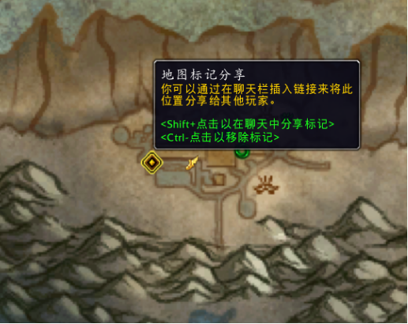<figcaption></figcaption></figure>

<figure><figcaption></figcaption></figure>

骑马需知：你需要手上装备：联盟/部落长枪 ，才能够在骑上特定的坐骑（联盟：奎尔多雷战马；部落：夺日者的陆行鸟）。武器和坐骑拾取位置如下图。

<figure>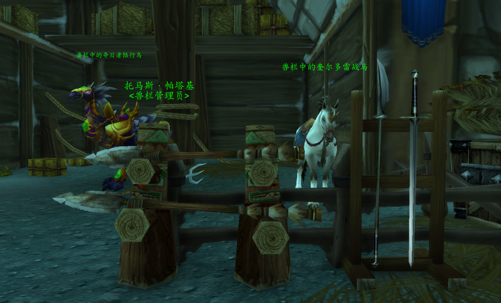<figcaption></figcaption></figure>

作战技能：

当骑上该模式下的坐骑后，技能栏会转变为6个技能，分别技能为1刺击、2碎盾、3冲锋、4防御、5治疗坐骑、6决斗。

1.刺击 无距离 1.5秒冷却

（近距离对对方造成一定量伤害）

2.碎盾 25码距离使用 1.5秒冷却

（在远处投掷一根投矛减少对方的护甲值，近处无法使用）

3.冲锋 25码距离使用 4.5秒冷却

（以高速冲刺对对手造成巨大伤害并破坏一层护甲值，需要在一定距离才可释放）

4.防御 无距离 3秒冷却

（增加一层护盾，每次减少30%伤害，最高3层，持续60秒，3秒冷却）

5.治疗 1分钟冷却

（脱离战斗才能使用）

6.决斗 10码距离 1秒冷却

（需要和另一名玩家在10码距离内）

<figure>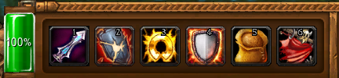<figcaption></figcaption></figure>

附：具体技能伤害

0盾 1盾 2盾 3盾

刺击 3250 2275 1300 325&#x20;

碎盾 2000 1400 800 200&#x20;

冲锋 8500 5950 3400 850

坐骑血量3209

## 2020年12月20日《凛冬骑士比武大会》活动

今年本应如往年一般，秋收过后，就该在火炉边坐下享受温暖的牛奶和新鲜小麦磨成粉做的面包；然后静静等待冬幕节，这一年最后的节日庆典。可是穷凶极恶的天灾军团却失去了控制，它们发疯似的攻击城镇无辜的居民。

该死！巫妖王不是已经被消灭了吗？为什么会有这些凶恶的天灾渣滓出现在我们的城市中？究竟出了什么问题？不过银色十字军们再一次向世界伸出援手，我们一同在圣光的旗帜下，击退了那些怪物——特此，大主教图拉扬下达谕令:为庆祝碾碎旧时的敌人，银色十字军同南国教会将要举办一场规模前所未有的枪骑术比武大会，庆祝战胜死亡的伟大胜利。日子就定在了冬幕节的中间时刻——12月20日。

比赛当天，比武场上简直人山人海、水泄不通，小贩们也带着自己的货物来到比武场的附近叫卖，但更让人们心血沸腾的是那些来自五湖四海的参赛者要来到这里进行武艺的较量；他们身着华丽的珠宝衣物、用丝绸和珍珠制作的华丽绶带、身披着代表各自阵营和组织的纹章战袍、以及手持着那比武的长枪和战旗。看台上也站满了观众，他们早已对骑士还不开始比赛而烦恼。

<figure>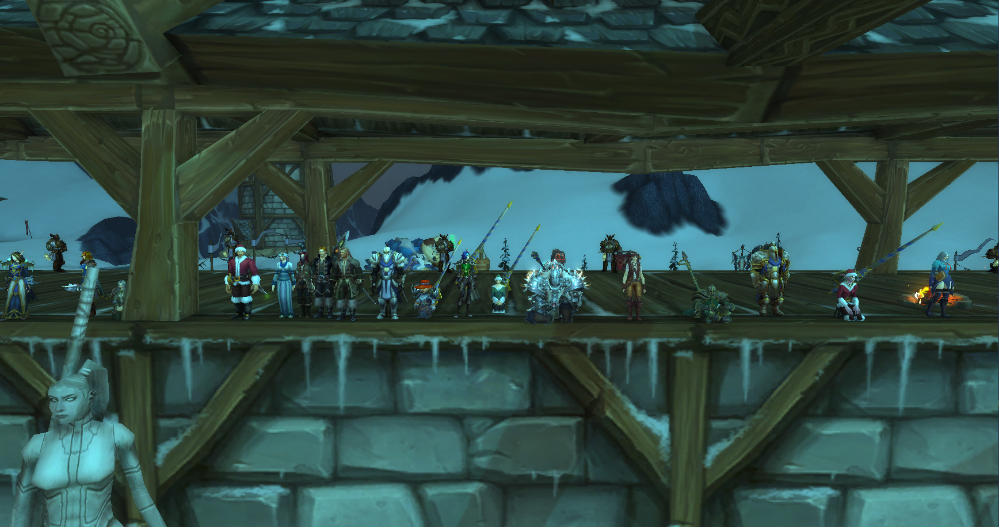<figcaption></figcaption></figure>

<figure>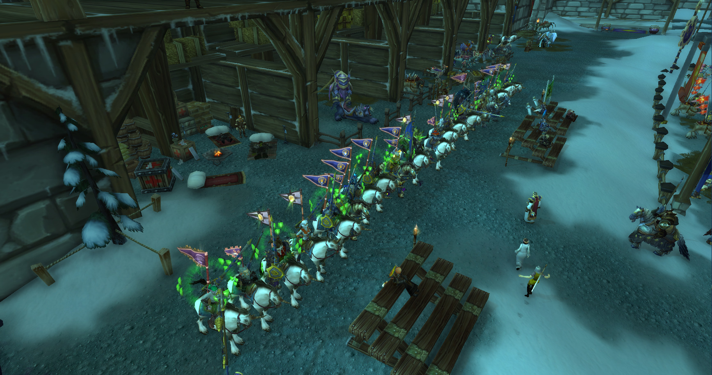<figcaption></figcaption></figure>

当8点钟声响起时，最后的参赛选手也穿戴好了盔甲安顿好了战马。年事已高的大主教格林威治出现在人们的眼前；他虽然白发苍苍但是没有人不尊敬这样一位老骑士，人们纷纷给他让出道；老主教骑着象征骑士荣耀的战马走在最前方，紧随着另一位副主教，然后骑士们一个接一个的跟随着他，效仿着当年的阿拉索骑士一般，要在比武场走上一圈，宣告神圣而公正的比武大会开始。

<figure>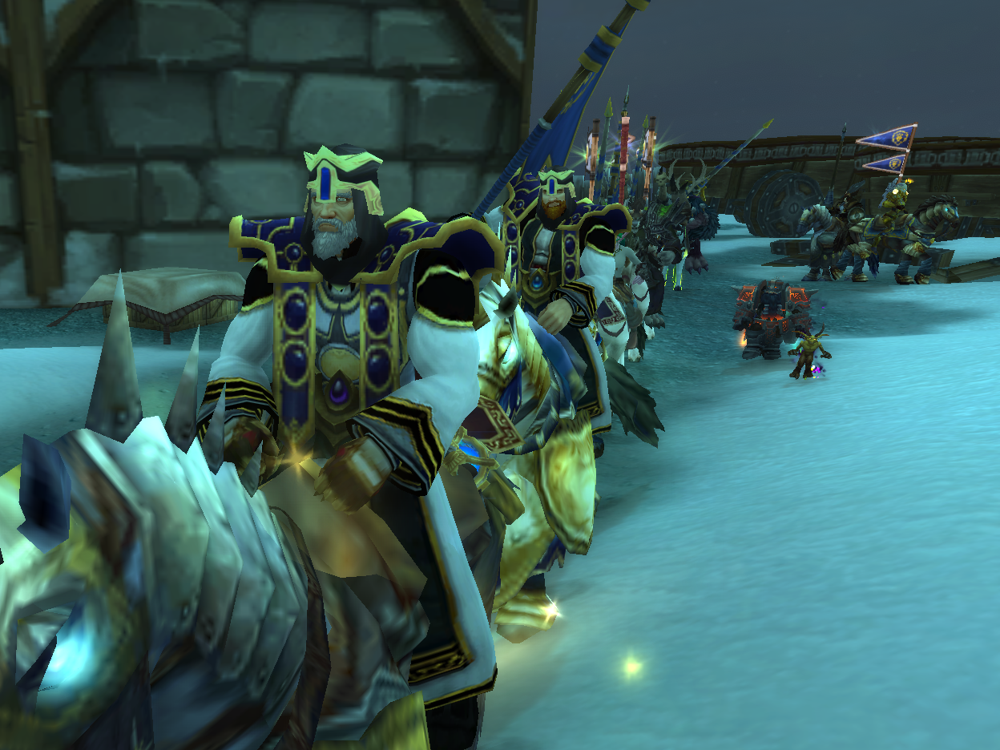<figcaption></figcaption></figure>

<figure>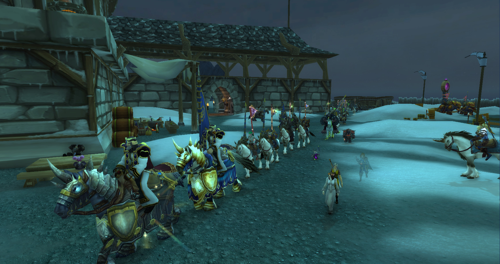<figcaption></figcaption></figure>

<figure>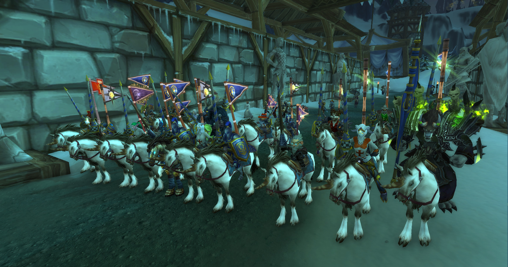<figcaption></figcaption></figure>

骑士们慢慢走进比武场地，两旁的观众们激动的开始为心仪的骑士们喝彩和抛鲜花。

参赛选手全部各就各位后，比赛就正式开始。那速度与荣耀的战斗开始了！

<figure>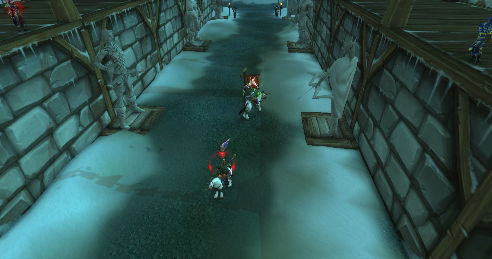<figcaption></figcaption></figure>

<figure>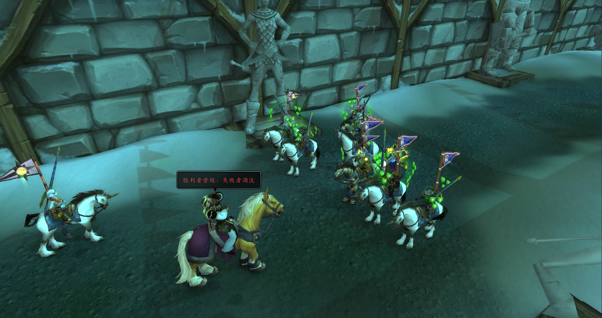<figcaption></figcaption></figure>

随着号角声吹响，冠军被选拔出来，那些武艺精湛的勇士获得了胜利的王冠以及那15万的金币和金鬃骏马。而那些失败的参赛选手也获得了大主教赠予的25000枚金币作为安慰金，而冠亚军们将被世人关注。

随着夜间的来到，比武大会正式的结束了，一年的最终节气也到此结束了，祝各位冬幕节快乐！

<figure>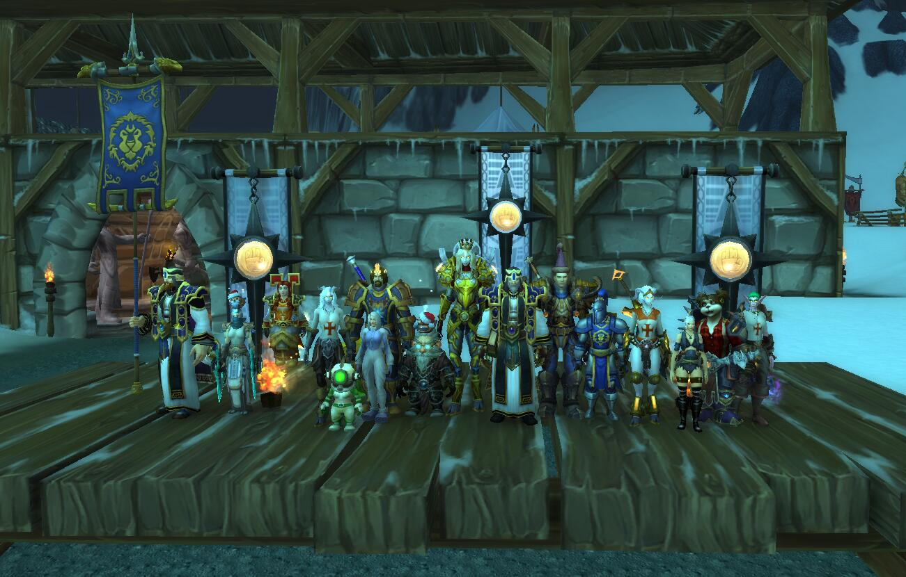<figcaption></figcaption></figure>
