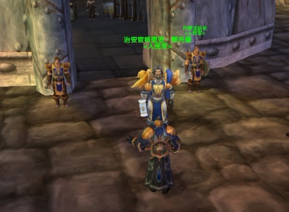

# 【给画中人的一封信】——兹彼希科

画中人：

你好，请原谅我如此冒昧写信给你。

也许，我们在一起的时间，比你想象中的多。

从梅林白银盾为我洗礼，到艾琳小姐悄悄推上酒馆的门。

从起誓与范克里夫为敌，到哑女多罗与爱玛的邂逅。

我喜欢在暗处注目于你，

瞧，昨天老佣兵传授谢尔文功课..

今天，里维埃又一个人静静发呆。

我不愿贸然出现在你面前，

因为我清楚，不是所有人都能成为朋友。

也不是性格相投之人，都能有缘相识，相处。

我与你一样，讨厌内心丑恶，却总有理由刁难他人之辈。

但他永不是水火不容之敌，只是一个因为厌恶，而不能成为吾友之人。

不需要致他于死地，来获得扭曲的快感。

我有时也会想！“哈~扮演不过是逗你们玩儿~”

可我看见，荒野之光，照进了我的生活。

在最困难的时候，我祈求它赐福于现实中的战锤。

让它无坚不摧，胜过锋利的毒刃！

在这里六年的时间里，我并不一帆风顺，

导师的背叛，让我不愿意多说一句话，

因被强权指责，而负气出走。

当年的我，

像一颗软硬不吃的铜豌豆，

从不屈服，因我无求于你。

然而今天，

我看到“那些敌人”已经被埋葬在时光中。

时间带给我那时渴求的“胜利”，

可“敌人”们喃? 他们现在哪里？

是否有为言行不一的自扇耳光而心存一丝丝愧疚和羞耻？

画中人，每次我看见你，都认为你是真实存在着的。

尊重你，并考虑你是否愿意结交我这样的人。

扮演，仅此而已。

在昨天，感谢我的女友能一直在“希科”身边。

当我们半年前，再次复合时，

我发了一张游戏截图，

对她说，

“瞧，多罗的猎豹，像不像我们家的猫？”

这句话是金色平原送给我，最好的礼物。

——兹彼希科

2012.4.15

