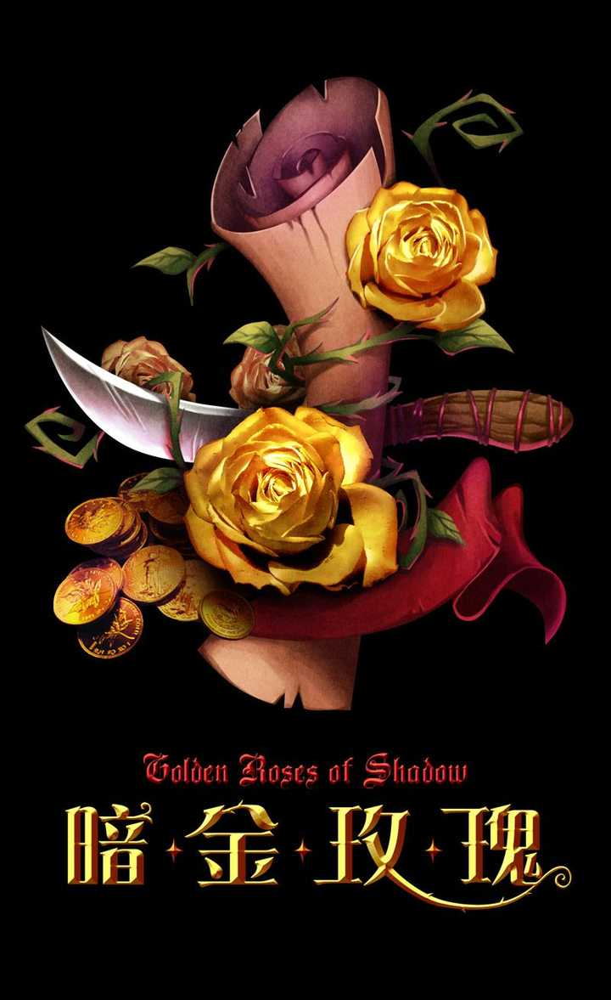

# 与炙热之心骑士团创立同期的公会

## 雷姆洛斯神殿守卫者

### 第一章：雷姆洛斯神殿守卫者的来历

关于这些神秘的守护者曾经都是伟大的森林之王——半神塞纳留斯的随从，当森林之王被兽人战歌氏族的酋长——格罗姆•地狱咆哮杀害之后，他们现侍奉月光林地的新主人，半神之子——雷姆洛斯。当然，作为半神的随从，他们或许还守护着一些不为人知的秘密。在各种邪恶势力不断逼近月光林地的现在，守护者们仍然坚守着自己的岗位，以保证半神之子的安全以及那个被封印的秘密。

如今，为了及时准确的掌握世界新的动态，一些守护者们开始走出月光林地，他们穿梭于整个世界，从卡利姆多到东部王国，以及如今瘟疫蔓延的洛丹仑王国故土。当这些守护者们发现新的邪恶时，他们将会在第一时间把情报通过自然之灵传达到月光林地的雷姆洛斯神殿。

出于对格罗姆•地狱咆哮杀害半神塞纳留斯的历史和主要成员为暗夜精灵的原因，组织更倾向于联盟阵营，当看见有雷姆洛斯神殿守卫者在各个战区出现在联盟战斗的第一线一点也不奇怪。但是组织在对待牛头人德鲁伊时是完全友好的，这种朋友间的关系完全继承了塞纳里奥议会的传统，跨种族的信任甚至远超过组织对联盟内魔法使用者的信任。

虽然这是一个神秘的组织，但他们都把自己看成是<塞纳里奥议会>的一份子。由于邪恶势力的不断滋生，他们也会招募新的守护者，当然，只有那些通过自然之灵认可的暗夜精灵才有资格加入这神圣而伟大的事业。而这些守护者们都是天生的采药师或者炼金师，也有一些人掌握着祖传的制皮工艺，以及新的技能。

### 第二章：神殿组织架构

首领——雷姆洛斯\
（伟大的森林之王的儿子，世界的守护者）

神殿祭司——五名\
（处理组织中一切事务，如有争议，以三票通过即可。当发生具备影响世界性的事件时，才会向上报雷姆洛斯）

神殿守护者——？？\
（合格的守护者，经验丰富的自然战士）

神殿信仰者——？？\
（新加入的守护者，试练中的自然战士）

冥想者——？？\
（当作出违背神殿守卫者宗旨的事件后，将由神殿祭司带入冥想之地进行忏悔）

说明下神殿信仰者和神殿守护者的区别：

神殿信仰者：为刚起步的德鲁伊教徒，而不是说加入组织的早晚，由于没有足够的能力穿梭与月光林地和身处位置之间，没有办法直接参与到守卫行动当中，所以称为信仰者。

神殿守护者：是指可以及时回到月光林地参加组织活动和守卫行动的成员，一般在10级以上，已经得到巨熊之灵的启示，并拥有坚定的信念。

另外对组织成员的最大考察阶段是加入组织之前，所以组织内不存在学徒之类学习原住民行为规范的阶段，如果有加入后发生问题并屡教不改，将作为冥想者进行反思，甚至会被驱逐出组织。

### 第三章：活跃区域

月光林地：作为德鲁伊的圣地成为了雷姆洛斯神殿守卫者主要活动的区域，而一切重大的仪式都将在月光林地的雷姆洛斯神殿举行，另外守卫者们还将保持月神湖的纯净和怒风兽穴的安宁。以及保证还处于沉睡状态中的大德鲁伊——玛法里奥大师的安全。

海加尔山：作为曾经的精灵的圣地，现在的海加尔山依稀可以看见以前神圣美丽的影子，但是由于暗语峡谷黑暗势力不断的增强，海加尔山变得难以出入，雷姆洛斯神殿守卫者偶尔会避开恶魔，悄悄潜入那里，察看整个地区自然恢复的情况，但是最近的一些现象让守卫者们觉得不安，经过雷姆洛斯的同意，部分守卫者开始为长期进驻海加尔山做着准备。

冬泉谷：由于地精城市的存在，冬泉谷的自然状况也不理想，工业污染威胁着美丽的冰封大地，一些高等级的守卫者时常会出没在那里，监视地精们可能出现的更进一步的破坏举动。另外那里的暗语峡谷也成为守卫者重视的地区，恶魔的力量不断在那里增强，进一步危险到月光林地乃至整个卡立姆多大陆的安全。

木喉要塞：由于和德鲁伊们和熊怪的渊源，守卫者们为一些熊怪部落的堕落而痛心。所以努力扶持着还保持理性的最后的熊怪部落木喉族，同时木喉要塞作为月光林地的入口，已经足以引起守卫者们的关注，因此经常会看见守护者们出现在木喉要塞里并为引导过往的行人远离月光林地。

费伍德森林：由于另一个塞纳里奥议会的分支翡翠议会的存在，雷姆洛斯神殿守卫者把净化的任务完全交给了翡翠议会，但2个组织之间关系还是非常的紧密。

灰谷及黑海岸：那里是年轻的暗夜精灵们学习与自然接触或者锻炼技能的主要场所，由于地理上的位置，这个狭长地带成了达纳苏斯和月光林地的战略缓冲地，因此每当有小规模的冲突，或异样的事情发生，雷姆洛斯神殿守卫者都会出现在那里，观察局势的变化并在适当的时候进行行动。

其他西部大陆的地区：雷姆洛斯神殿守卫者经常会为特殊的任务或目的涉足到这些地方，由于战争原因，守卫者们来去得都比较隐秘，在那里基本很少有人知道他们的存在。

东部大陆：雷姆洛斯神殿守卫者很少涉足东部大陆，可能是地理位置太遥远，也可能是很多精灵不习惯长距离的坐船或游泳，更可能是东部大陆对德鲁伊教的排斥和恶劣的政治环境。但仍然会有一些守卫者潜伏在那，特别是阿拉希高地一带。他们将随时监控那里的亡灵势力。

### 第四章：荣耀的成员徽章

守护者们身穿白色的组织战袍，因为白色在德鲁伊教中象征纯洁与神圣。胸前的熊爪则象征着巨熊之灵。守护者们相信巨熊之灵会给他们带来无尽的力量与勇气。因此当看见一位身着白色战袍的守护者，你就能肯定他已经是一名优秀的守护者，一名无所畏惧的自然战士。

第五章：各势力声望以及各职业基础声望

各势力声望

暴风城：友善\
塞拉莫：尊敬\
铁炉堡：友善\
暗夜精灵：崇拜\
高等精灵：冷淡\
侏儒：中立\
蛮锤：中立\
银色黎明：崇敬\
德莱尼人：中立\
地精：中立\
赞达拉巨魔：冷淡\
海达希亚水元素：中立\
塞纳利奥议会：崇拜\
瑟音兄弟会：中立\
木喉熊怪：崇拜\
巨龙：中立\
暗月马戏团：中立\
兽人：仇恨\
巨魔：敌对\
牛头人：崇拜\
被遗忘者：仇恨\
血精灵：敌对\
血色十字军：中立\
半人马：中立\
血帆海盗：中立\
黑龙：仇恨

职业基础声望

战士：友善\
圣骑士：友善\
猎人：友善\
法师：冷淡\
牧师：友善\
盗贼：中立\
术士：冷淡\
德鲁伊：崇拜\
萨满：中立

### 第六章：成员守则

1．所有德鲁伊都应该是雷姆洛斯神殿守卫者的朋友，在遇见原住民德鲁伊时必须予以发自内心的热情问候，即使是牛头人，也应该用动作表示问候。当发现联盟的德鲁伊兄弟姐妹们遇到危险或需要帮助，应该及时伸出援手；对待部落德鲁伊，除非在战场内，否则不得主动攻击。

2．组织原则上向所有原住民德鲁伊开放，而且不限制成员的公会间流动（必须是原住民公会）和私人活动（比如大型的地下城冒险），但是一旦加入或曾经加入组织的成员，都应该将守护雷姆洛斯和月光林地作为己任，积极相应雷姆洛斯神殿守卫者组织的活动。

3．在艾泽拉斯大陆上不得使用和借住任何未知的邪恶力量——任何恶意破坏游戏平衡的第三方软件。

4\. 所有成员不得擅自于联盟内部公会间挑起争端，不得卷入私斗或公会间寻仇，在清楚缘由并经双方许可前提下可以进行适度调停，事后要对经过及结果需向神殿祭司汇报。

5.不得伤害所有平民，包括部落方无主动攻击行为的NPC。

6.分享战利品时按照相应规章执行。比如投掷乱数；按职业需求分配；，若 神殿守护者 没有按照原则执行被在外人士投诉，一经核实直接清理出组织。

7\. 所有<雷姆洛斯神殿守卫者>成员应当尊重并配合游戏管理者工作，严禁于游戏内外谩骂或嘲讽游戏管理者。

8.至于RP语言规范：\
A．无论任何频道，用词必须符合一名原住民的语言，允许现实中突发事件OOC。\
B．关于私聊，为了更明确的向对方表达自己的观点，在与对方达成一致后，可随意。

## 维伦之拳

### 背景设定

从血精灵手中夺回埃索达后，我们离开了遥远的德拉诺大陆，逃离了那片血腥和破碎的世界。不知道航行了多久，我们望见了一块模糊而葱绿的陆地。飞船着陆的一刹那，疲惫的同胞默默的祷告着，思绪悬浮在希望与绝望之间，那一秒似乎永无止境……

飞船着陆的同时发生了大爆炸，许多同胞在祈祷中再也无法醒来

“为什么活下来的是我们而不是他们。”悲伤的眼神留给故土，幸存的德莱尼人踏上了这片坚实的土地，在伟大的领袖先知维伦领导下重建自己的家园，然而让我们意想不到的是，尾随而来大量的血精灵部队重重包围了秘血岛，妄图刺杀先知维伦，并灭绝我们的族人。

满是伤痕的战士毅然拿起武器组织成了坚实的壁垒——“维伦之盾”诞生了。但在最新的调查中，发现炎鹰部队在秘血岛用魔法打开了太阳之门，甚至不顾一切的召唤恶魔来到这个世界，同胞的命运岌岌可危；“我们必须立即采取行动！绝对不能让这个世界成为又一个遍布创痍的德拉诺！”守护在领袖维伦身边的精锐战士在圣裁者纳弗烈的号召下组成了新的战斗部队——“维伦之拳” 披坚执锐，随时给予那些危害家园的敌人迎头痛击。

“我们试图联手抗击燃烧军团，首先需要与这个世界的盟友和平共处。”先知维伦的教诲无时不刻的萦绕在耳边，我们得知，过去的族人，那些化身为恶魔的艾瑞达人，曾给盟友和这个世界带来了怎样的痛苦和伤害，无数的联盟将士在与燃烧军团的战斗中长眠于此，怀着对族人所犯下罪孽的救赎之心和对联盟英雄的钦佩之情，并在塞拉摩统治者吉安娜女士的引荐下，我们加入了联盟。并时刻准备为盟友的信任贡献出自己的力量。

“我们的一生都在躲避燃烧军团疯狂的进攻，欣慰的是，我们不用再逃了，我们有了值得信赖的盟友，我们找到了我们的家，我们时刻准备战斗到生命的最后一刻！前进吧，纳鲁之子，同胞的命运等待着我们，回到外域，找到他们，带他们回家……”

### 组织结构

维伦的守护者（会长）

组织的领导者

这个人将守护着维伦，守护着维伦之拳，直至下一个接班人继承其使命

愤怒之心

武器狂暴战士、增强萨满、惩戒骑士以及死亡骑士的光荣称号

幸运之吻

继任者的光荣称号

璀璨之辰

法师的光荣称号

繁叶之影

猎人 暗影牧师的光荣称号

风暴之眼

元素萨满的光荣称号

纳鲁之盾

防护战士、骑士的光荣称号

灵魂之歌

非暗影牧师、神圣骑士以及恢复萨满的光荣称号

纳鲁的信徒

带着崇高的信仰，初来组织的同胞

除维伦的守护者（管理者）与纳鲁的信徒（见习成员）之外，其余称号不分前后与顺序，各个组织应紧密团结在一起，犹如澄净无暇的阿塔玛水晶所带来的光明与温暖，犹如捍卫家园与同胞紧握的正义之拳！

称号的由来：七块阿塔玛水晶

强大的阿塔玛水晶曾是纳鲁赠予古艾瑞达人的礼物，一直被艾瑞达人当做最神圣的宝物供奉者，在得知阿克蒙德和基尔加丹投靠燃烧军团之后，伟大的领袖维伦带着它离开了阿古斯世界，它分裂成了赤橙黄绿青靛紫七块，并在浩劫中遗失在世界的角落

他们分别是：

> 　　愤怒之心 璀璨之辰 幸运之吻 风暴之眼 繁叶之影 纳鲁之盾 灵魂之歌
>
> 愤怒之心 被阿卡玛夺回，送还阿达尔手里。可大幅度提升部队的战斗力和士气
>
> 璀璨之辰 辗转落入大领主莫格莱尼手里。成为灰烬使者。 可强化施法者的施法专注
>
> 幸运之吻 被黑铁皇帝索瑞森获得，之后又归于火焰之王拉格纳罗斯，并被放置于隐秘的元素位面里
>
> 风暴之眼 在遥远的诺森德山岭之中，风暴巨人将其放置于风暴圣殿中供奉
>
> 繁叶之影 在图拉扬将军和他妻子艾雷利亚。风行者手上。 它可以扭曲光线的通路，隐藏身形，甚至将整座城市藏匿起来。
>
> 纳鲁之盾 位于萨格拉斯所落入的深渊中，.它现在的主人是被称为弑神者的骑士，在那个时代唯一能让5个上古之神闻风丧胆的人。
>
> 灵魂之歌 已被节点亲王哈拉迈德夺回，并交还阿达尔的手中。

于是，找到它们，使其不落入恶魔手中，成了值得每一位德莱尼人为之奋斗一生的的神圣使命，看着水晶的影象，仿佛又看到了堕落的族人得到救赎，看到了光明与希望降临阿古斯世界的那一天

### 阵营与宗旨

1.阵营：守序善良，守序中立

2.宗旨：保卫家园，联合盟友，对抗燃烧军团，拯救被俘虏的纳鲁和迷失中的同胞

寻找遗失的阿塔玛水晶

3.战呼：为纳鲁而战！为圣光而战！为阿古斯而战！

### 组织规定

1.热爱角色扮演，并严格规范自己的言行

2.不得做出任何违反阵营以及邪恶的行为，违反者将受到约束与制裁

若发现以切磋之名做出对同胞恶意的攻击行为，将接受严重处罚

3.为了组织的宗旨而甘愿牺牲一切

4.与人为善，无论何时何地，公正，诚实，友善的对待盟友，并心存感激与怜悯

5.当盟友遭遇挫折与困难，第一时间伸出援手，尽己所能

6.团结并救助迷失的同胞，宣扬纳鲁的道义

7.不得借助非艾泽拉斯的外部力量进行冒险

其他有违准则的行为，可经讨论加入与补充

### 各势力关系（暂定）

各势力基础声望

暴风城：尊敬

塞拉莫：崇敬

铁炉堡：尊敬

暗夜精灵：尊敬

高等精灵：中立

侏儒：尊敬

蛮锤：尊敬

银色黎明：尊敬

地精：中立

赞达拉巨魔：中立

海达希亚水元素：中立

塞纳利奥议会：中立

瑟银兄弟会：冷淡

木喉熊怪：尊敬

暗月马戏团：中立

兽人：仇恨

巨魔：仇恨

牛头人：冷淡

被遗忘者：仇恨

血精灵：仇恨

血色十字军：中立

血帆海盗：敌对

工会晋升任务

……

入会进阶仪式

……

招收对象

限于德莱尼人

愿意加入的同胞，或者有好建议的朋友就跟帖吧

## 明焰骑士团

明焰骑士团，又称明焰军团，是在奎尔萨拉斯摄政王洛瑟玛.塞隆授意下重建的正规军团之一，其来历可追溯至远征外域之初，在一次次波折和坎坷的洗礼下几近瓦解，但最终迎来了重生。

新生的明焰骑士团旨在团结可以团结的力量，以保卫奎尔萨拉斯的人民。所有愿意为这个目标而奉献的勇士，不论出身背景资历如何，都能在骑士团中得到极高的尊重和施展才能的绝佳机会。

### 历史

当被捕获的纳鲁送回银月城后，血精灵们借此研发出了奥术圣光的灌注技术，由此创造出了一个全新的兵种：血骑士。它的产生颠覆了以往艾泽拉斯人们对于“圣光”的看法，形成了一支全新的军事力量。志愿接受圣光灌注的血精灵日益增加，摄政王洛瑟玛意识到：必须建立一套行为准则，来规范这些获得新力量的精灵们。 于是，血精灵历史上第一个以“骑士团”命名的军团——明焰骑士团奉命建立。同时，明焰骑士团还肩负着守护太阳井化身安薇娜的秘密使命。

明焰骑士团正式成立之际，第一任大领主柏文.黎明之刃收到了一件珍贵的礼物——一把仿佛拥有生命的利剑，如海潮般澎湃的法力随着包裹剑刃的金色火焰涌动不停。这把被称作“雅夏.永恒之刃”的利剑由银月城最好的工匠们精心打造，而银月城的魔导师们也各自在剑刃上铭刻下了代表自己魔力的法术符文。当领主柏文接过剑时，也收到了魔导师们带来的预言：“阋墙之下，永恒无存。”这把剑从此作为明焰骑士团的象征，由每一任领主佩戴、使用。

然而在征战外域的一系列战斗中，因为所选择效忠领袖的不同，明焰骑士团遭受了惨痛的大分裂——同胞兄弟姐妹被迫站在不同的阵营拔剑相向，不得不在战场上相互致对方于死地。效忠凯尔萨斯的成员宣布脱离骑士团，并作为对抗骑士团的主力，在战斗中给予明焰骑士团重创，酿成了一出出令人叹息的惨剧。

其中直接造成明焰骑士团几乎瓦解的事件，则是大领主伊卡洛斯在率领骑士团作战中，遭到前明焰骑士团指挥官率领的日怒军团的袭击，伊卡洛斯手中的“雅夏.永恒之刃”在这场同胞相残的战斗中不幸折断。领主战死、宝剑断折，即使银月城没有取消明焰番号，明焰骑士团本身已然名存实亡。

奎尔丹纳斯战役的结束标志着血精灵在燃烧远征的内战终于落下帷幕。明焰骑士团的幸存者将伊卡洛斯战死时手中持有的一部分断剑保存并隐藏了起来，希望埋藏历史的同时也能埋藏心中的痛苦。当然最令他们遗憾的是，断剑剩下的一块碎片一直无法寻回。

经历内战磨难的血精灵痛定思痛并修生养息，之后无论是北伐诺森德以及对抗暮光的战争中，血精灵的精锐都分散至部落的部队中，低调地行动。

然而战争就如同一头永远饥饿的猛兽，无时无刻不在寻找下一个受害者。塞拉摩之战以及其后引发的一系列冲突，让希望独善其身的血精灵深深感到，联盟和部落之间激荡的冲突随时可能给自己带来致命的危险，奎尔萨拉斯的力量需要空前地团结，才有机会平安度过这次危险的动荡。就在此时，“雅夏.永恒之刃”遗落的最后一块碎片被送到了明焰骑士团前领导层成员——“太阳祭司”米尔薇女士手里。

米尔薇相信，碎片在这个时刻回归是一个有力的预示。她呈请摄政王洛瑟玛，请求摄政王允许她重建明焰骑士团，以整合、巩固奎尔萨拉斯的力量。洛瑟玛最初只是摇头否定并问道：“任何军团都可以完成你所述的目标，为何一定要恢复已经不存在的明焰骑士团？”

米尔薇直言不讳地向摄政王陈述着辛多雷的现状：“吾族早已遗忘了曾经的志存高远，放弃了必须的自律自省，抛弃了真正令我们辉煌的根基。沉醉于享乐、满足于私欲、渴求占有而不思回报，手足之间貌合神离更相互敌视。如若如此，吾族永远无法寻回我们曾拥有的真正力量。”

“明焰骑士团会怎么做？”

米尔薇女士向摄政王做了一个比喻：“如同守卫奎尔萨拉斯的魔法符石从太阳井中获得力量，我们成员的力量将来自于人民的支持；他们会像符石不断自我调整魔力流动一般，通过自我反省和思考将其力量为奎尔萨拉斯所用；他们最终也会如同符石，将各自的力量真正地连接并融合，形成坚不可摧的屏障。”

“而明焰骑士团将植根在每位成员心中的信念”，米尔薇女士继续说明，“则是让这每一份力量的拥有者明了自己的使命，让这坚不可摧的屏障不会重蹈从内部崩坏的历史覆辙。”

摄政王最终同意了米尔薇女士的请求，命令她重铸断剑、重整军队为奎尔萨拉斯效力。米尔薇女士召集回了她所知的幸存的明焰骑士团旧部，并以此为根基开始了重建的进程。

### 意愿和准则

意愿就是明焰骑士团的终极目标：“捍卫人民。”明焰骑士团不保卫砖瓦、不保卫私人财产、不保卫个人权力，保卫的是奎尔萨拉斯人民的生命和自由。

明焰骑士团并没有采用繁复的规章制度来规范骑士团成员生活中的一言一行，而是将其归纳成了四项准则：“忠诚、勇气、风度、荣誉”，用以督促所有骑士团成员朝意愿而奋战。这也正是明焰骑士团当初以“骑士团”命名的初衷。

明焰骑士团一切裁决所依循的原则，都延伸自这四项准则。

忠诚——

对上级忠诚：军人以服从命令为天职。这是骑士团运作的根基，让骑士团的行动最有效率的保证。

对人民忠诚：我们的天性是追寻自由，我们则以遵守秩序来为同胞赢得寻求更多自由的权利。

勇气——

勇气不是莽撞。牢记你的职责是捍卫，而非掠夺。

勇气不仅是直面敌人永不退缩，更重要的是勇于直面自己的私欲、软弱和错误。

风度——

尊重同胞，你将没有顾虑，勇往直前。

尊重盟友，你将不断学习、完善自我。

尊重敌人，你将不会轻敌，战无不胜。

荣誉——

我们有着高贵的名字——辛多雷，为自己感到骄傲，并让言行符合自己高贵的身份。

不掠夺、不破坏、不强奸、不滥杀无辜、不欺凌弱小，我们不是无法控制自己的弱者，我们的生命不应如此卑微。

我们正在致力一项有意义的事业，这让我们的生命有着无上的价值。

### 任务和职责

明焰骑士团除了承担正规军团必须的职责外，还有肩负着其他特殊的使命。

1、奎尔萨拉斯的保卫者。作为奎尔萨拉斯的正规军团，明焰骑士团的首要任务是守卫奎尔萨拉斯国土不受侵犯以及奎尔萨拉斯人民的生命安全和自由，并根据部落以及摄政王的命令完成外出征战的任务。

2、太阳井的守卫者。守护太阳井是明焰骑士团自最早建立起就已承担的重要任务——太阳井是奎尔萨拉斯的心脏、吾族力量的源泉与人民精神的寄托。明焰骑士团将全力保卫吾族灵魂之所在。

3、辛多雷力量的整合者。辛多雷需要空前的团结才能度过当前的危机，而明焰的重建将是一个良好的契机，可让我们将奎尔萨拉斯正规军之外的辛多雷力量重新集合到统一的旗帜下。占星者、夺日者、银白十字军、甚至愿意回归的高等精灵等等，其中的志士都是我们募集的目标，我们需要他们的力量。

4、神圣遗物学会的支持者。神圣遗物学会承担着寻找失落知识的重要工作，明焰骑士团将向其提供武装支援，必要时会帮助其夺取需要的资源；骑士团还将配合他们挖掘和研究工作，专门指派学者或魔导师将挖掘回的知识和秘密进行研究，并在实战中合理使用。

5、盟友的援助者。当前联盟显示出明显而积极的的进攻态势，援助部落盟友也是保卫自己的一种方式，因此，明焰骑士团将会担负起救援所接触到的陷于危难中的部落盟友的义务。不过因为战力的宝贵，救援行为仅限于拯救、护送、掩护、协同作战等防御倾向的任务，不包括突袭、破坏、刺杀等攻击倾向任务。

### 骑士团结构

作为正规军团，明焰骑士团拥有清晰且严格的上下级关系，其最高原则是——下级可以质疑甚至反对上级的决策，但必须执行上级的命令。

下级必须服从上级，以保证骑士团日常运作的快速有效。正式场合中下级必须称呼上级为“长官”或相应尊称，并维护上级的权威。

上级有指引、指导、帮助下级的义务，并必须对下级的安全负责。

注意：上下级关系只是为最有效率的行动服务，骑士团每位成员之间是绝对平等的，并且鼓励成员之间发展友好关系——发展成为恋人、夫妻等关系在骑士团都是许可的。

骑士团结构划分如下：

<一>管理层（领主——评议会——指挥官）

领主：明焰骑士团的最高领导者。

评议会：明焰骑士团的最高决策部，由高阶军官担任评议会议员，以民主方式进行决策。领主同属评议会一员，其权力和义务与其他评议会议员相同。

指挥官：具体负责某项任务而特别任命的指挥人员。任务包括：地下城探险领队和指挥、战场战役指挥等。

<二>精锐（血袭者——驭光者——唱魔者）

精锐军士：拥有非常出众的战斗才能、或立下赫赫战功的骑士团精英。包含血袭者、驭光者、唱魔者三个荣誉称号。三者属于相同级别，只是名称和作战方式上进行区分。

血袭者——包含精于战斗的战士、骑士、死亡骑士、游侠、刺客等，他们是战场上最锋利最致命的利剑。

驭光者——由驾驭圣光力量对队友进行保护和支援的牧师和骑士担任，同时负责骑士团内部秩序的维持。

唱魔者——法师、术士、暗影牧师可以成为唱魔者，他们的作战任务则是通过强大的魔法压制并摧毁敌人。他们同时还要负责知识的收集和研究工作。

<三>中级（顾问——骑士）

中级：随团顾问和骑士同属中级阶层，是明焰骑士团的中坚力量和主要战力，两者的差别只在于分工的不同。

随团顾问——承担外交、信息收集、知识整理、技艺研发等各项非战斗任务，是处理各项文职事务的重要人员。

骑士——骑士团的主要战斗力量，是骑士团战力的中坚。每一位骑士都是通过了严酷试炼、拥有精湛技艺和坚定意志的佼佼者。

<四>新兵：尚未完成导师指派任务，以及还未进行或还未通过试炼的新加入成员。

<五>禁闭：因违背骑士团意愿和准则而受到严厉处分的骑士团成员（含失踪人口）。

### 加入、试炼和晋升

任何奎尔萨拉斯公民都有权利申请并加入明焰骑士团。

加入之前，申请人必须完全了解、并愿意以实际的行动，以支持、服从和发扬明焰骑士团所信奉的意愿和准则。

加入骑士团后的人员将成为明焰骑士团的新兵。每一位新兵将会指派给一位任意阶级的正式骑士作为其侍从，而这名正式成员将成为这名新兵的导师。导师会教导侍从在骑士团中所遵循的规范，指派给侍从日常事务，并指引侍从在骑士团中的晋升。当导师认为侍从在行动上和心理上都做好准备后，可向评议会提出申请，让这位侍从晋升为正式的明焰骑士团骑士。

所有侍从晋升自骑士时，必须经历一个由评议会设计的试炼，通过试炼才能获得晋升。试炼的主题通常集中在该成员能否完全地接受并服从明焰骑士团的意愿和准则，是否有坚定的决心和毅力去致力于意愿的实现。试炼的方式可能是讯问，可能是经历一次幻象，也可能是必须完成某些任务。试炼会非常严酷，但能通过试炼的骑士其肉体和心灵上都将坚不可摧。

通过试炼的骑士将会在骑士团总部参加晋升仪式。仪式的核心部分是武器的授予与祝祷，其他内容亦有封印信物、训诫忏悔、发誓愿、一定时间的守夜、佩戴公会徽章、决斗表演等，依照导师建议和议会评定决定采用何种仪式方案。其中的非战斗人员则加入顾问团任职。

任何立有卓著功勋的成员都有机会通过申请或提拔成为明焰骑士团的高级人员。任何将要被晋升为高级人员的骑士团成员，都必须通过评议会的审核。审核内容包含对其忠诚度的测试和对其服役生涯的检视。

指挥官将在高级成员中产生。骑士团评议会将在一项行动之前，从高级成员中任命一位最合适的人选担任此次行动的指挥官。指挥官在不违背意愿和准则的前提下，其行动不受评议会的限制。

所有高级成员都有进入评议会的资格。但评议会的席位有限，想进入评议会必须等评议会产生空缺。

评议会席位因意外产生时（包括自然死亡、战场死亡、辞去职务），角逐者必须在骑士团会议上声明自己参与评议会席位的角逐。评议会其他成员将逐一审核角逐者资格，并最终组织全体骑士投票选取。

评议会空缺也可以由人为方式制造，即高级成员直接替换掉一位评议会成员。此行为在骑士团中会受到鼓励。要想替换某位评议会成员，角逐者必须证明自己有着至少与被替换者相当的指挥和领导才能以及相应的功绩。

比武不被作为取得评议会资格的方式，评议会成员需要的是统筹全局和引领团队的能力，而并非血勇之气。

通过谋杀评议会成员制造空缺违背骑士团所遵循的准则，将面临死刑的惩罚。

### 外族成员

明焰骑士团是隶属奎尔萨拉斯的军队，但同时也是部落军队的一部分。任何部落成员在愿意服从、遵守并执行明焰骑士团意愿和准则的前提下，也可以加入到明焰骑士团中。外族部落成员加入到明焰骑士团的方式包括并不限于以下两种：

1、军事顾问。

血精灵的优雅精巧的战术战法和部落粗犷奔放的战斗模式之间存在差异，因此双方都需要军事顾问相互指点和学习，将双方的战斗模式有效地结合。部落其他种族中富有丰富作战经验的军人可以通过正式渠道，成为明焰骑士团的军事顾问，提供与部落战争机器之间相互配合方式的方法和建议。

2、新兵交流。

任何部落新兵可以在得到本种族领袖许可后，加入明焰骑士团，以熟悉血精灵的作战方式，以期在将来可以协助部落军队更好地分配血精灵的作战任务，提高部落战力。

任何加入到明焰骑士团中的外族成员享有和血精灵成员同等的权利和义务，并可以依照正常方式进行晋升，直至高阶精锐成员。

原则上，外族成员不能担任明焰骑士团管理层人员。除非这名部落成员向奎尔萨拉斯宣誓效忠。

### 补充

Ｑ：好吧，我愿意加入你们。我该怎么做？\
Ａ：首先，你要有一个血精灵人物。我们在五区ＲＰ服——金色平原。建立一个人物，并为他（她）命名，这个名字必须符合ＲＰ规范。建议：名字＋姓氏，或称号＋名字。\
然后，进入游戏，说“/join rp”，这样，一般你就可以和我们联系上了。

Ｑ：你说建立一个人物，我可以建立一个“人妖”号么？\
Ａ：你要保证你的言行举止象个异性。这不是经常发嗲，在每句话后加一个“嘛”或“～”就算了的。你的人物的思维方式也要异性化，至少不要让我们感觉到，你是人妖。如果你可以做到以上，可以很好的扮演一个异性角色，那么，可以。

Ｑ：貌似我需要一篇人物志？\
Ａ：我们更喜欢在日常交往中逐渐了解你。但是，如果你写了一篇完善的人物志，就可以为你的角色确定他的过去，他的性格，他的原则。这对你的扮演很有好处。所以，你应该准备一篇人物志（或者说，扮演计划），写给自己看。

Ｑ：我在骑士团里很久了，为什么得不到提升！\
Ａ：你渴望成为一名领导者或管理者？那你在你的上级面前表现出你的进取心，但不要过分，要有风度。权利和责任是相对应的，主动负担起一些责任，多和同伴们沟通，那么当官员不在时，大家可能会默认你是他们的领袖。如果你表现出色，可能会成为官员的继任者。但是如果你急于得到权力，可能适得其反。

Ｑ：我们并不是圣骑士，为什么要遵守风度荣誉这些看起来像骑士精神的玩意？\
Ａ：我们是所有种族中的贵族，不是暴徒。我们的祖先——上层精灵，是暗夜精灵中优秀的群体组成。我希望骑士团的成员能成为血精灵社会中道德的典范，优雅的化身，从而带领大家夺回真正的荣耀。\
附：我们和其他典型组织的区别：\
为圣光而战　　奉行骑士精神　　典型组织\
骑士　　　　　否　　　　　　是　　　　　　明焰\
圣骑士　　　　是　　　　　　是　　　　　  白银之手\
十字军　　　　是　　　　　　否　　　　　　血色\
暴徒　　　　　否　　　　　　否　　　　　　迪菲亚

可见，我们不同于暴徒之处，就在于我们有骑士精神来规范我们的言行。

明焰骑士团成员可以说谎、偷窃甚至暗杀，当然这些行为的前提必须是能够协助意愿的实现，并非为了自己的利益、私欲或是情绪失控而做。

所以请仔细阅读并领会明焰骑士团的四项准则。

Ｑ：作为血精灵，我们该怎么看待其他种族、组织？\
Ａ：仔细阅读和领回骑士团的准则，相信你会找到答案。

Ｑ：我为凯尔萨斯陛下效力过，我要给那个占星者好看！/我曾在占星者服役，凯尔萨斯的支持者胆敢在我面前出现？！ ……\
Ａ：无论是凯尔萨斯、洛瑟玛或是沃雷塔尔，都呕心沥血地为辛多雷的生存和崛起寻找出路。换言之，他们奉行的大义都是“为奎尔萨拉斯的人民而战”。你是因为服从这样的大义而为领袖效忠，而不是因为服从领袖而服从大义。即使领袖逝去，效忠者也要为领袖一生所追寻的目标与大义而战斗，这才是真正的效忠。

在这困难非常的时期，辛多雷的子民们抛却成见携手并肩，才能重振奎尔萨拉斯的荣光——而这样的景象，才是逝去的英灵们所期望看到的辛多雷的未来。

明焰骑士团尊重每一名成员的政治倾向和思想价值观，每名成员都有自由表达自己的观点和主张的权利，但绝不可要求或强迫别人接受和赞同。

最后，请严守明焰骑士团“尊重”的准则，尊重其他成员的体会和感受、观念和主张，不可过度鼓吹自己的观点而引起其他成员的不快。

Ｑ：我们之中为什么会术士和死亡骑士？他们使用的是邪恶的力量啊！\
Ａ：能量本身没有善恶之分，只有使用力量的个体才有正邪之别。我们不在乎“怎样使用力量”，在乎的是“为什么使用力量”。术士使用的“魔能”归根到底只是能量的一种，只有最精于奥术并且拥有坚强心智的人才能自如地操控魔能。而死亡骑士则是被迫获得了现有力量。只要这位术士或死亡骑士向我们证明了他拥有的高贵品格和坚定心智，证明他的目标是使用力量来守护奎尔萨拉斯的人民，他就将是明焰骑士团最值得尊敬的成员之一。

Ｑ：我怎样知道从谁那里获得我所需要的商品或服务？\
Ａ：每位成员加入后应说明自己的生活技能并添加到附注中。你还可以在ＲＰ频道和这里寻找你所需要的工匠。\
我们是贵族，不代表我们可以吃饭不给钱。相反，你有义务向为你提供服务的朋友给予合适的报酬，并有风度的向他致谢。

旧背景设定

自从血精灵们研发了圣光灌注技术后，血精灵中出现了一种全新的职业：血骑士。它的产生颠覆了以往艾则拉斯人民对于“圣光”的看法，产生了一支全新的军事力量，以及使血精灵社会中出现了新兴骑士阶层。志愿接受圣光灌注的血精灵日益增加，摄政王洛尔瑟玛意识到，必须建立一套行为准则，来规范这些获得新力量的精灵们。于是洛尔瑟玛委托忠诚的火叶家族和明翼家族建立血精灵历史上第一支骑士团，奉行“忠诚、诚实、勇气、风度”，并由没落贵族出身的柏文·拂晓之刃担任首位“大领主”。经过火叶家族和明翼家族的协商，最终命名为“明焰骑士团”。和血骑士团不同，明焰骑士团效忠的对象是摄政王洛尔瑟玛。

就在明焰骑士团成立后不久，有很多并非骑士的血精灵要求加入。他们大多是为了像“远行者”们一样，为了保卫家园，重拾荣耀而战。他们如愿成为了明焰的一员，并在洛尔瑟玛面前宣誓效忠。很快，洛尔瑟玛又将前银月城情报机构“血袭者”并入明焰骑士团，它的成员都是有效率的游侠和刺客。明焰骑士团声望日增，在民众眼中，明焰成了“忠诚、诚实、勇气、风度”的代名词。

然而，表面上明焰是洛尔瑟玛的精锐部队，实际上洛尔瑟玛所建立的，是一支旨在保卫安维娜的亲信武装。只有少数人知道这个秘密。洛尔瑟玛和柏文同样担心，如果王子发现了安维娜并要对她不利，明焰骑士团是否就会成为“叛军”，和手足同胞兵戎相向。尽管哈杜伦·明翼表示愿意保卫安维娜，届时远行者是否会站在明焰一边？又有多少人会离开明焰？明焰骑士团只能作好最坏打算的同时，祈祷这一切不会发生。

### 旧组织结构

领主\
↓\
骑士团长＝＝＝＝＝＝＝＝主教＝＝＝＝＝＝＝＝＝游侠首领\
↓　　　　　　　　　　↓　　　　　　　　　　　↓\
骑士（血骑士）　　军士（法师牧师术士）　　　血袭者（猎人盗贼）

### 一些前辈的讨论

summue：我和麦德三世聊了下，她的意见是，游侠和血骑士相互之间是敌对的，并且作为游侠的组织，远行者正在策划对于血骑士的清洗。你们的设定里注意一下吧，实在不愿意分开，那么在游侠首领人物志上下功夫，现在虽然不排除有游离于远行者组织之外的游侠，但是一般来说就像圣骑士和术士，双方还是不太兼容的。

柏文：关于游侠…本身的设定是:血袭者是独立于远行者的游侠组织,专门处理一些”脏活”.在明焰成立之前就是银月城的一支势力,和明焰合并,一方面是由于管理上的方便,再有就是血袭者们工作以外的时间,也是有身份和名誉需要的.

官方的远行者设定,其成员无论心志还是体质,技巧都是血精灵中的精锐,进入门槛很高,

许多没有魔法天分,又不够格加入远行者的血精灵们,通过灌注圣光来实现梦想,成为血骑士

你可以想象,他们只要通过一个简单的仪式就能获得强大的力量,之后压抑很久他们的作为必定很嚣张.

这就是为什么,需要明焰这样的”绅士同盟”来约束他们.

柏文：”军士”我也觉得不舒服

但是…我暂时没想到更好的称谓.”修士”?

斯维达：要是叫“修士”恐怕法师和术士都不会答应，血袭者，血骑士，血魔导士？

毕竟术士法师牧师基本上都算施法者，再联系下血精灵的特点，和魔法沾点边的，大家都想想，我黔驴了。。。。

明焰怎么说也是个玩家的组织吧，和官方设定的血精灵的组织有点冲突和不符应该也没关系。即使游侠和血精灵不对付，诺大个种族里总会有些特立独行的人哈。

一楼献给我们挚爱的奎尔萨拉斯和一同成长的明焰骑士团

战歌嚣兮疲奔忙 疲奔忙兮不胜惶 惶然措兮归故乡 归故乡兮桑圃荒 狼藉纷兮图我昌 图昌扬兮入呈堂 驻明焰兮笃佐上 终菲菲兮抚剑藏 祭逐日兮长歌扬 长歌扬兮定浩琅 乐欣欣兮血民强 吾族强兮展铿锵

二楼献给祭司 安大 谣郡主 花园教师 熊局和薇喵们\
你们不管怎么样都是美的 因为你们实在是太美了

这是位于明焰骑士团军营一块安静的区域

他位于【公共休息大厅】和【医疗休养室】的中间

房间除了书桌和座椅装饰花卉外一眼望去全是陈列书籍的档案柜

其间不少资料业已发黄破损满是记载了血泪和欢笑沉淀的典籍在奥术亲和的陪伴下

夜夜对我们呢喃细语

在一个寂静的角落一只书架伴着奥术能量轻轻的旋转上面的书册光亮如新打开最大最厚那一册时你发现扉页上写着

“从不忘记轻轻想起

防线告破时你对我笑语

——不要害怕

我的倒下

是为了你能将坍塌的再次立起

同欢共难之情

血之子民

愿与你握剑击敌

直到

向着家园一同归去”

翻过扉页 这一页是一个骑士团徽记 红色的徽记镶边被奥术加持从而隐隐放光

事件：东瘟疫之战誓师大会\
内容：明焰骑士团代表方阵\
简述：东瘟疫之战 根据会盟讨论的结果 我明焰骑士团负责扼守三月之门 为战事进行后方稳定 防止间谍渗透等战时事物 这是随指挥官索拉（喵\~）阁下出席会盟的骑士团成员在西瘟疫之地的剪影\
\

事件：灰谷行动计划\
内容：灰谷行动每周例行小结\
简述：应神圣遗物学会要求 明焰骑士团成立了【神圣遗物学会探险队】 深入灰谷地区进行调查分析和研究并找寻部分神圣遗物 探险队历时月余 对灰谷地区自然地理 生物变异 资源储量等进行了详细的调查 并形成科考报告存入骑士团内部档案 为现今骑士团在奥格瑞玛附近区域的一系列行动提供巨大的了参考性支撑\
\

事件：【明焰骑士团内务部成员关系科特别报告】\
内容：【骑士】血谣·风歌与一陌生女子发生口角并拳脚相向\
简述： 根据骑士团内务部成员关系科探员齐亚妮·炎夜的密报记录显示 在某次例训结束后 骑士团【骑士】血谣·风歌被一名陌生女子相约在骑士团休息室见面 但在短暂的交流后迅速演变为争吵和互搏 事发当时骑士团成员瀞婧·蜜酒全程在现场 但蜜酒表示当时已经用幽灵狼出窍去采集酿酒材料 没有了解到争斗的起因 据齐亚妮探员追访当时路过的红发游侠时获悉的信息 两人的争斗不排除有因一名男子而起的龉龌 争风吃醋？抑或是其他不得而知的原因？目前探员齐亚妮·炎夜尚在进一步调查中\
\
\
【特别报告】的后一页被不知道谁插入了一幅涂鸦

齐亚妮·炎夜：是谁？！我的报告没有这么写 该死！\
【齐亚妮探员把这幅涂鸦揉作一团 扔向书桌旁一只睡得正香的猫】\
齐亚妮·炎夜：你！这只懒猫！这里进进出出的人你最清楚了 快告诉我是谁干的！你这只蠢猫！\
【索里奥·霜痕进入档案室】\
索里奥·霜痕：齐亚妮 你在为难索拉阁下的宠物？\
齐亚妮·炎夜： 噢 没有的事儿··· 您瞧 我在教它接球 不愧是索拉阁下的宠物 不是金丝的球它看都懒得看呢 嘿嘿 真是大气的猫啊\
【齐亚妮一边说一边悻悻的离开了档案室】\
\

这是一片没有任何详细描述的影像资料\
仅仅在图片下用奥术波纹留下了\
【你问我这都是谁？答案就在不远处——猜中有奖!】 的字样

\
\
事件：【内务部成员关系科关于血谣·风歌与陌生女子争斗事件的调查报告】\
内容：调查结果得出确切可靠关于该事件的结论\
描述：【齐亚妮·炎夜报告视角】在被不知名涂鸦者彻底掩盖事件真相之前 我走访了当日值守位于逐日岛骑士团休息室的城市卫兵 并对城市卫兵对陌生女子的外形描述进行了抽丝剥茧的分析 下附卫兵对于场景描述的模拟还原图

请结合陌生女子身着的盔甲进行分析 特此呈上卫兵进行细节描述的模拟还原

结合陌生女子肩上的\[晨钢肩甲]以及所佩的\[卡利姆多的复仇]这两项卫兵进行了重点描述的特征可以得出结论 在明焰骑士团全部成员中只属于一个人 不 或许应该进行重新遣词·····一头？

所以 最终定论可以确认为本次事件只是骑士团【骑士】\[漫步者易海兰]以及【骑士】\[血谣·风歌]两人在集训结束后又在休息室内及室外又进行了一次关于徒手搏击项目的切磋而已。\
本次事件不关乎骑士团成员内部以及对外关系

明焰骑士团内务部成员关系科\
探员 齐亚妮·炎夜\
特此呈报

\
\
翻过【内务部成员关系科关于血谣·风歌与陌生女子争斗事件的调查报告】后一页\
这一页只留下了3张奥术影像以及寥寥数语\
图片来自：[索里奥丶霜痕的百度相册](http://jump.bdimg.com/safecheck/index?url=x+Z5mMbGPAs6STQlwEA0OC941mwgc1i+hganh2xZUhgMoS+dNxst5v7THYeoCy+JPgl8wqttOvr/rhojP7yIGiI3Cw12BArWBD9mRp12vfHWu9dIXvLLlV/FjOfar71isAIZulPHjo+pMZNieoDPDj/WSHt4V8+FoGrWKDMpG0g6saFRXbXi3WBLAfbuJR01lSmarGnIypfekNm43Sh+klPSyOAgib7OMDxm7iZ2BjQ=)

诗人艾丽丝 ·晴风 血谣·风歌 约里希娅·黎明之光\
哈 那个傻瓜 你都猜对了吗

这是一次骑士团成员们在逐日王庭前偶尔并举行了一次短暂而愉快的小聚

聚会其间【色艺双绝】的花园女教师【诗人·艾丽丝】还唱起了一首轻快的小曲 注意看她双手微张 摇摇晃晃的动作！像极了在教小孩子！

画外音- 艾舍尔·日落 :什么？！逐日者先王在上！ 同窗数载 竟然没发现艾丽丝这么可爱！不知道她的点唱率能不能超过祭司大人的《永歌森林永远是夏天》？\
\
\
翻过聚会的奥术影像 你发现了····\
咳 或许是诗人艾丽丝女士为了表达对艾舍尔·日落先生的些许···信息回馈\
艾丽丝女士在这一页留下了····\
图片来自：[索里奥丶霜痕的百度相册](http://jump.bdimg.com/safecheck/index?url=x+Z5mMbGPAs6STQlwEA0OC941mwgc1i+hganh2xZUhgMoS+dNxst5v7THYeoCy+JPgl8wqttOvr/rhojP7yIGiI3Cw12BArWBD9mRp12vfHWu9dIXvLLlV/FjOfar71isAIZulPHjo+pMZNieoDPDj/WSHt4V8+FoGrWKDMpG0g6saFRXbXi3WBLAfbuJR01lSmarGnIypfekNm43Sh+klPSyOAgib7OMDxm7iZ2BjQ=)\
【悬赏：谁能猜出这个马路求爱者又厚颜的在追求城里哪个女孩子 ！】\
\
\
（米尔薇 偷偷 把新冲洗好的两张照片塞进档案簿里）(づ￣3￣)づ

听说外域将要被卷进时空漩涡中了，\
以后有空就要去看看据说当时米祭司很高昂得唱起歌来：“部落旗帜迎风飘扬，胜利歌声多么嘹亮，一个联盟都没出现，白骨荒原就被拿下o(≥口≤)o ”\
战斗后到天涯旅馆聊天喝酒，\
牛头人酋长乐队突然开唱给了三人很大的惊喜，两位血精灵女士一直向吉他手抛媚眼，咳咳。。。

## 暗金玫瑰

暗金玫瑰公会的故事。

### 暗金玫瑰历史

（献给所有为这份历史作出贡献的人，或者侏儒，或者精灵，或者。。。感谢编撰者，曾经的玫瑰女士之一，琳达费舍尔）

关于暗金玫瑰的由来\
随着时间的流逝已经渐渐模糊，流传的版本也许不同，不过开始一部分都是“她的最初的创始人是三位女孩……”\
\
\
在这张褪色的书卷旁边有一张纸条上面写着：\
“发现自矮人区湖中的废墟“——XXXXXX（这一行字有些看不清了）

“暗金玫瑰和沉重的钱袋”——艾琳·瓦伦斯的暗金玫瑰宣传册\
说起暗金玫瑰，就不得不提“沉重的钱袋”。甚至可以说暗金玫瑰的历史就是“沉重的钱袋的历史”。你问什么是“沉重的钱袋”？说来话长，拿的是从约翰·费雷尔花光了他老爸所有的积蓄，买了一座矮人区的酒馆开始……\
总之，自那以后，这座酒馆就成了舞女、酒馆、海盗的天堂。暗金众给她取了个有趣的名字“沉重的钱袋”。\
在那段酒馆热闹的日子里，每周暗金众都会定期到酒馆机会。各种各种样的人，各式各样的活动，在这里举行。自由酒会、吟游诗会、喝酒大赛，当然还有刺激的暗金小赌场，只要你来到了酒馆，就请放松心情。尽情畅饮和高歌吧。

好一个标致的姑娘哟\
你的\*\*柔嫩绽放蜜奶的郁香\
华润的双腿又只有长跳起舞来眼看花\
小小门楣插满山楂枝今夜你心归谁

好一个娇艳的姑娘哟\
你的丰臀圆滚触感柔软又温热\
纤细的柳腰摇有晃真让人想怀抱\
我愿线上最肥美的山楂枝今夜与我渡春宵\
——摘自四月二日酒馆老板的日记本

劫难过后，关于过去，完整的记录能找到的记录，大约只有一份署名达斯特宾的羊皮纸。

暗金玫瑰历任会长简介—一作者：达斯特宾

他们是一束怒放的玫瑰，他们美艳动人的表象之下暗藏着凶猛带毒的尖刺，永远不要把对他们的第一印象保存太久，因为那不过是他们伪装自己的另外一种方式。与他们接触时，你要注意的不仅是自己的钱袋，更多时候是自己的生命。

暗金玫瑰创始人：艾琳瓦伦斯

第一任会长

人民军的建立让所有的原住民认识到我们总算可以脱离守护者联盟里的一群飞扬跋扈的贵族，真正将联盟的安危和对抗燃烧军团的重任持续的进行下去，艾琳瓦伦斯为人民军的建立立下了不可磨灭的功劳。随后，人民军逐渐壮大，随着守护者联盟内部逐步的分裂，越来越多的人加入到了人民军的大潮中来。但逐渐，艾琳瓦伦斯感受到了孤单，作为一位女性，她更渴望有一个自己的家，大家能像家人一样感受到欢乐与温暖，强势的艾琳在寂寞与孤独中将人民军改造为了一个接受一切对联盟有用的人手，无论职业与身份的组织，这样一朵带刺的玫瑰真正把联盟的每一份力量揽到了自己的麾下，无论是海盗、流氓、强盗、囚犯，还是落魄的贵族、失魂的术士、高尚的圣骑士或是英勇的战士，都把暗金玫瑰当做自己的家。在这里，他们抛弃了从前所有的身份，从现在开始，他们是长在同一个花园里的玫瑰，五颜六色的玫瑰，带刺的玫瑰。

艾琳瓦伦斯把快乐和温暖带给了大家，为所有人提供了一个美丽的家园，而她自己却常常个人偷饮自己留下的苦泪，没有人知道她内心的苦闷，直到托雷克男爵的出现。托雷克并不像其他暴风城的贵族一样张狂、轻佻，他仿佛是艾琳瓦伦斯的双胞胎哥哥，能够洞悉艾琳瓦伦斯的每寸内心，正是这样的体贴俘获了这位暗金玫瑰的芳心。当他们的婚礼在大教堂门口举行之后，他们幸福的生活在了暴风城的花园里。

暗金评议会创始人：拇指布莱克

第二任会长。

罗迪斯·布莱克出生在达隆郡，幼年便看够了天灾军团对自己家园的残害，他的双亲、朋友以及所有认识的人都在对抗天灾军团时和白银之手骑士团一起牺牲了，或许正是如此，罗迪斯布莱克才建立起了错误的观念：白银之手骑士团的无能让达隆郡遭到了毁灭，而雷德帕斯被死亡骑士控制进而屠杀百姓的事实又让他见证了人类圣骑士意志上的软弱。

罗迪斯逐渐封闭的内心与对圣骑士错误的认识将他推向了毁灭的边缘，行走在阴影与背叛之中，他却更为感到自在。当他在希尔斯布莱德与阿拉希的海域做起海盗时，他的内心正在被这种孤僻所吞噬烧杀抢掠的生活并没有让他忘记过去，却更加沉沦于负罪感之中。值得庆幸的是，拇指布莱克在洛克莫丹遇到了矮人疯厨子——本克莱厨刀，当这个矮人送给他的亡灵腐肉汤被他喝下之后，剧毒几乎夺去了他的生命，但同时也拿走了他的心灵创伤和他的一根拇指。恢复健康之后的罗迪斯获得了新生，他从此改名叫做拇指布莱克，为了纪念这一次转生，他的拇指被厨刀锻造的瑟银锭所代替。

随后，拇指布莱克和托雷克男爵结识，托雷克发现了拇指内心深处属于暗金玫瑰的特质，在更进一步的了解过后，艾琳瓦伦斯大胆地将“暗金玫瑰”这个最高荣誉授予了拇指布莱克，并亲手把暗金玫瑰的象征：红玫瑰和黑玫瑰交给了拇指布莱克但拇指布莱克依旧改不了懒散和酗酒的毛病，为了不让暗金玫瑰毁于自己的懒惰，拇指布莱克创立了暗金评议会，所有的日常事务全权由暗金评议会代理，从人事任免、高层选拔到日常活动、行为规范制定全部由暗金评议会所代理。暗金评议会仅有三名成员，苏菲梅尔达、诺贝尔·铜丝和托雷克男爵。他们分别代表着秩序、中立和混乱，这样的平衡最终让暗金玫瑰达到了一个鼎盛时期。

混乱终结者：芙蕾雅黑米

代理会长

然而谁也没想到，拇指布莱克不仅沉醉于懒惰和美酒，对女人的热情也从来没有减退过。当他从黄金狮子奧菲手中抢到了许·梦魇之后，暗金的生活开始变得黑暗起来，或许正是因为这位迷人的女术士用暗影的力量控制了拇指布莱克的心智，虽然最终托雷克男爵杀死了许，但是暗金的日常工作已经陷入瘫痪，而拇指布莱克在失去妻子的悲痛中再次沉沦，对暗金的生死置之度外。

此时的暗金评议会经过商讨，任命芙蕾雅黑米这位暗夜精灵女牧师担任代理会长，由她全权代理拇指布莱克的位置，但拇指布莱克仍旧保留有“暗金攻瑰”的称号。暗夜精灵的耐心让她有足够的时间打理暗金玫瑰的各项拖延的事务，已接近两千岁的年龄也让她比任何人都要成熟，使得她的心境更能够不被打扰，当所有人已经沉睡在自己的暖床上时，芙蕾雅黑米仍旧在签署暗金的一系列公文，起草暗金的计划书，打理暗金的物资，和暗金评议会一道制定新的制度。不可否认，芙蕾雅黑米的能力甚至超越了艾琳瓦伦斯，如果说艾琳瓦伦斯给了大家一个家，那么芙蕾雅黑米则把这个家打扮的温暖明亮、井井有条、美丽动人。

随后芙蕾雅黑米和暗金玫瑰的厨娘莱斯一道，买下了位于矮人区的地皮，修建了“沉重的钱袋”作为暗金玫瑰的酒馆企业，长期在这里为联盟的勇士和旅者们提供一杯饮料和热气騰騰的菜肴，而这里也成为了除开刺杀和雇佣委托之外，暗金玫瑰的主要收入来源。而间或举行的酒会和舞会又为原住民们提供了大量的娱乐氛围，这个家庭的温暖与和谐氛围与日俱增。

当拇指布莱克从堕落中回归之后，厨娘莱斯这位女术士又吸引住了他的目光，当他向莱斯求婚之后，他主动辞去了暗金玫瑰会长的职务。而在这时，黑米也辞去了代理会长职务，此刻的暗金玫瑰仓库空前绝后的整洁，各职业物品，暗金玫瑰的象征——一黑玫瑰和红玫瑰，药水、合剂、草药、布匹、附魔材料、武器装甲全都分门别类，而物品详单也被张贴在了仓库旁，黑米为暗金的贡献由此可见一斑。（这时的WOW版本还没有公会仓库功能）

时代的变迁：雪莱

玛丽莎·雪莱是一名暗夜精灵女盗贼，从她的名字你完全看不出她是一位精灵，这也不奇怪这只是她的人类名字，她居住在暴风城的花园，平日里她依靠她的画作来维持生计。玛丽莎·雪莱的画作在整个艾泽拉斯都非常著名，无论是人物还是风景，在她的画笔下都显露出活灵活现的生气，她在绘画上的细腻与激情被暗金评议会发现，经过商讨，玛丽莎·雪菜获得了暗金玫瑰的殊荣，成为了暗金玫瑰的第三任会长，接过了本来就充满艺术气息的红玫瑰和黑玫瑰。雪莱寄情于情感，与瓦伦斯·星尘之间的爱情被她自己的画笔所记录，成为了她终日幻想的题目，这也让暗金玫瑰和雷姆诺斯神殿守卫者的关系日益深厚。

而其他人的爱情故事也终究逃不过她的眼睛，在长久的艺术气息之中，暗金发生了天翻地覆的变化雪莱解散了暗金评议会，在她看来，这样的设置没有浪漫的气息可言，只能为暗金埋下古板的伏笔，她大胆任命伊文多斯·枭喙为弄臣，整日为她排解无聊的日子，而对于暗金日常工作的打理也逐渐落入伊文多斯之手。当暗金评议会取缔之后，大权的旁落让所有人对暗金玫瑰的未来感到惴惴不安。

最初的日子里，雪莱仍旧能够关心日常事务，并且为暗金加上了艺术的气息，这吸引了更多人的对暗金的神秘感产生了兴趣。但没过多久雪莱便又回归到了纯粹勺艺术之中，终日不出面主持暗金的日常会议，伊文多斯趁机揽下大权，把拇指布莱克时代和炙热之心骑士团的矛盾发展到了极致，甚至骑士团的领主——帕拉斯剑圣公开发表声明，要求所有骑士团成员对暗金的一切呼声置之不理，并开始策划将暗金玫瑰吞并，化为炙热之心骑士团的一项收入来源。

当所有的矛盾激化到最为热烈的时候，暗金玫瑰的元老却逐渐开始隐居起来，即使是前暗金评议会成员也无法找到雪莱的下落，连雪莱的宠臣伊文多斯也不愿透露她的去向。暗金玫瑰上下陷入一片混乱。对于暗金玫瑰>的未来，所有人都不抱有乐观的想法，甚至有人开始公开讨论，暗金玫瑰将成为下一个守护者联盟，并与守护者联盟一道走向死亡的泥沼。

充满争议的领导者：达斯特宾

第四任会长。

瑞阿比西·因达斯特宾绝对不是他的真名，而至于他的真名是什么，达斯自己也不知道，他是一名孤儿，他还不记事的时候就被父母遗弃在了北郡修道院的垃圾桶里，克里斯托弗修士也就用“垃圾桶中的垃圾”为他命名。

幼年的瑞阿比西·因·达斯特宾没有体会到任何一点来自于外界的爱，他完全不懂得家庭的概念，终日与他为伍的，只有北郡修道院里的图书和每周末来修道院祷告的人们。看到带着孩子前来祷告的人们，达斯认识到自己的不同，这种不同让他的内心如同刺猬一样包裹起来，抵抗着任何来自外来的关注，他终日一个人看书学习，

研习魔法。当英雄们的赞歌在耳畔高唱时，他通常都会燃起一种信念，正是这种信念，让他还未成年便决定离开北郡，闯荡世界。然而残酷的现实夺走了他的一切——财产和魔法，所幸，骑士团领主帕拉斯对他伸出了援助之手，不过这并不足以打开他封闭的内心。直到他在暴风城的魔法区遇到了另外一朵玫瑰——一多洛雷斯·黑兹。

这位女盗贼眼神里透露出来的自我保护的神色仿佛让达斯特宾看到了自己，这一个夜晚，这位年轻的法师第一次饮酒，为了一位女士，而达斯特宾优雅又得体的举止与充满礼貌的行为让多洛雷斯感到很惊讶，暗金玫瑰最不具备的就是高贵、礼仪和谦逊。两人的爱情随着时间的推移如同玫瑰一样开始绽放，又如同美酒一般逐渐香醇。

他们一同参与过黑暗之门的战役，在那里，柔弱的达斯为了保护美丽的多洛雷斯险些丧命;一同在荆棘谷和部落厮杀，每一次多洛雷斯陷入险境，达斯都会从虚空中出现和盗贼一道赶走敌人;一同在达纳苏斯的大树上讲述自己不幸的身世，达斯看来，多洛雷斯的苦楚比自己强烈百倍。

达斯最终学会了打开心灵，这种包容与爱的心态让他不得不挺身而出为暗金玫瑰的未来而奋斗，正是暗金玫瑰和暗金玫瑰的成员让他感受到了温暖的爱，他决心把这份爱重新回报给所有人。没有艾琳瓦伦斯的凝聚力、没有拇指布莱克的威慑力、没有芙蕾雅黑米的执行力、也没有雪莱的艺术气息，达斯特宾只有依靠聪明的才智。作为唯一一位不是盗贼的暗金玫瑰（芙蕾雅黑米只是代理会长），他重新召开暗金评议会，人员增加到四位：\
戴伦·坦格利安，负责暗金玫瑰的对外作战安排部署以及与军情七处的合作;

卡夏雷罗，负责暗金日常活动安排和制定;毁灭秩序达克，负责暗金的经济恢复与商业活动;\
诺贝尔·铜丝，负责暗金的人事及杂务管理和对外宣传。而他自己则负责与其他所有的原住民组织取得联系并重开“沉重的钱袋”酒馆，将热忱的态度带给所有人，增设大使职位，让其他原住民走进暗金，重新将暗金玫瑰的欢乐与家庭的爱的理念传达出去。但正当达斯特宾领导的暗金玫瑰开始恢复气色的时候，军情七处官方发表布告，经线人提供的证据，控告达斯特宾杀害了自己的妻子与儿子，并且与部落血精灵勾结，企图毁灭整个暗金玫瑰,这样的罪状足够让军情七处立即将达斯特宾逮捕。

虽然诺贝尔·铜丝组织起了暗金玫瑰的大批成员在暴风城游行抗议，但军情七处仍旧不予理睬，目前达斯特宾和军情七处都无法提供足够的证据来进一步化解这场灾难。达斯特宾在押期间，暗金玫瑰的仓库又被洗劫，雪上加霜的状况让暗金玫瑰举步维艰。

临危受命：辛缇娅蒂

第五任会长。

瑞阿比西·因·达斯特宾深知事态的严重，目前妻子多洛雷斯·黑兹和儿子凯兰·黑兹下落不明，可能已经遭遇不测，无法出面为他作证，而艾琳瓦伦斯告老还乡、拇指布莱克神秘死亡、雪莱不知在何方、芙蕾雅黑米还在周游世界，达斯特宾在危机的情况下秘密将红黑玫瑰交给了芙蕾雅黑米的妹妹辛缇娅蒂，另外一位女性暗夜精灵盜贼，并让她全面主持暗金玫瑰的工作，在他洗脱罪名之前辛缇娅蒂正为了暗金玫瑰的未来献出自己的良方和力量。

大灾变的奏鸣曲

序言

暮星已暗，晨曦破晓

时过境迁，突如其来大灾变改变的所有人的生活轨迹，昔日的自得其乐的一群人也不得不开始重新思考自己在新的时间点所扮演的角色。

许多成员的离去，使得盛放一时的暗金玫瑰渐入了冰期。随着沉重的钱袋的消失，这群人开始意识到自己的弱小以及无助，有的开始寻求其他的庇护所，有的走向了隐居生活，另一些则选择了重建建家园，但是这群人会走向何方，没有人知道。

琴弦上的第一个音符——“侏儒的玫瑰”

震天吼声不一定来巨人，小小的影子也能投射出巨人的身姿

“我太老了以，至于开始忘却一切，花朵的芬芳或是食物的多汁，一切似乎已经还是远离了我的生活，但是有些事情，永远不能忘记”

某一天，平常的一天，同每一个平常的一天，一个侏儒回到的暴风城，当他静立在水塘旁，记忆如同激流翻滚，头脑开始飞快的旋转，面对曾经的一切已经不复存在的现实，他握紧了拳头。他，诺贝尔铜丝，暗金评议会的一员，必须做一点什么，一个这样的念头涌上了心头。

他开始写信，一封、两封、三封……将告示从狮王之傲帖到血鸦旅店……一个细小轻快的声音在提醒一个古老的契约……

“对所有暗金玫瑰成员，及欠过暗金玫瑰人情的人，各位老伙计，当你拿到了这朵玫瑰的时候，相信你已经明白，是到了该履行”契约“的时候了！我知道，这么多年来，自由自在惯了的你，已经在黑暗里数够了金币。玫瑰的契约似乎已经完全忘记。本来，我也不想破坏这份“宁静”但是，暴风城的贵族们似乎真的以为这个世界，只有他们说了算。当‘沉重的钱袋’被他们强制拆迁时，他们就已经跨过了曾经约定的界限。那么，我们还有什么好说的呢？不共戴天！我，诺贝尔铜丝，暗金议会为数不多的‘活人’，第一次发出‘玫瑰’，召集所有暗金玫瑰者。请大家做好准备！我们不是迪菲亚，我们要让那些吸血鬼们知道，我们“不是”迪菲亚！。”

显然侏儒声音并没有吸引到足够的听众，更多的是还是昔日的债主，如果第一秒你看到诺贝尔没有带着他的兜帽在酒馆里出现，那么接下来的几秒，你听到的便是“铜丝还债”了……如同提桶掷进了水塘，只有“咚”的一声闷响，然后便陷入了沉寂，长久的沉寂……在他开始彻底失望之前，这些信件开始陆陆续续有了回音。首先回应的是两个新人，一个是叫做乔恩吉尔尼斯人，另一个是自称温妲的琳达费舍尔。他们开始着手调查酒馆被毁事件，线索不多，一波三折，不过他们还是有所搜获，并且在无意中发现的暮光教徒已经开始渗透进了暴风城，当调查开始渐入佳境的时候，突然传来噩耗传来噩耗，乔恩被杀死在了闪金镇，至此调查陷入的死胡同，所有的线索都似乎在一夜之间蒸发了……这件事似乎并不单纯，不过也只能走到这里了，就像喋喋不休修士的经常说的“你只可到这里，不可越过”……

浴火之乐章——流离酒花

第一部分

不惧来日，莫悲往昔

真相也许如同水潭的底泥一样，永久的被掩埋了……不过事情尚未结束，侏儒的也没有就此停止努力，踏出了第一步，第二步便紧随其后，现在，时候考虑一下未来了。

事实上，把侏儒的声音比作砸入池塘的水桶并不公正，不仅仅是因为音调，是的，一定程度上来说，他的奔走开始让更多的人注意到了这个神秘的组织，同时更多的成员也开始回应诺贝尔的召唤。其中有辛德拉法师索恩·风歌，游侠谢尔文，伊莱丝星光长耳朵，见习法师格雷斯·艾特……开始新生活的戴维·莫林也表示会给与帮助。

> 　　小插曲——凶杀案调查
>
> 在乔恩死后的几天，索恩委托了他的一位朋友——一位经验丰富的暗夜精灵进行调查，同时温妲也在闪金镇希望了解乔恩的死因。在几天的调查中，精灵推断出凶手可能是一个亡灵，不过在手法和现场还原上，温妲跟精灵意见相左……不过，因为整个案件缺少最关键的证据尸体，这次事件也成了无头公案。

对于饥饿的人，他需要的是面包，对于现在的暗金玫瑰来说，购置一块新的地产重新开始经营则如同是一块面包，于是众人各自开始物色选址。最先传来捷报的是温妲，她在铁炉堡找到两间房子，一间是在大锻炉区的废弃酒馆，另一间则是在秘法区的老房子；卖家是两个矮人，一个是商人因为货船在风暴中沉没而急于需要一笔钱来还债，另一个则希望能通过一些手腕在仕途上有所斩获，他的要求则是两片龙鳞。经过商讨，温妲负责搞定第一个，而索恩则负责第二个。对于两手空空的一群家伙，实现这些要求简直是天方夜谭……

第二部分

苦痛备尝必有怒兽藏心

暗夜精灵经常给人留下古板的印象，这个叫做索恩的也不例外，他是埃雷萨拉斯大图书馆的学徒，是随着辛德拉一同回归的精灵之一，因为在学徒时期的笨拙而饱受欺凌，获得了声望的索恩野心开始膨胀，对力量与地位的追求，让索恩开始不择手段的打击竞争者，如日中天之时因为导师死亡而彻底改变了人生轨迹。

在大家开始为购置新的地产而奔走的时候，索恩开始了他的计划，他召集了一些“嗅觉敏感”成员开始收集情报，而他也开始了情报经纪人的生活，在仕途上的摸爬滚打让他对于交涉和辞令轻车熟路，在与提尔之光十字军的你来我往中，索恩得到这一份不错的买卖，这笔买卖的报酬则是我们所需的龙鳞。

> 　　小花边——水晶的偏执
>
> 作为奥术使用者，每个人都有相应的专长和偏好，索恩的偏好则是——奥术水晶，即便现在他也仍旧与辛德拉们保持了学术上的联系，而关于水晶的极限实验往往会带来不可预知的后果，因此他也经常奥术的能量波动带到奇异的地方。
>
> 一个谣传黑段子
>
> “水晶的太厚了给我做薄！”“奥术通透性要提升2倍！”“快点给我干活！”
>
> 索恩叫嚣着，而他的学徒们则忐忑的闷声工作……
>
> “是的，就是这样，完美的奥术水晶！他是如此的美丽，如此的动人，如此的……”
>
> 索恩的话音未落便被卷入了奥术的漩涡之中……

第三部分

万象无常，东风过后亦有小雨

说起空手套白狼这个词，不知道你是怎么理解的， “海盗的掠夺”呢？这便是温妲的计划。“完美无瑕，邪恶透顶！”

在索恩有条不紊的经营者情报生意的同时，温妲则来到的藏宝海湾，这里，海盗、财富、朗姆酒——坏孩子的天堂，早在抵达的几天前，温妲便打听到血帆海盗近期将会有三艘满载战利品的舰船在荆棘谷荒蛮海岸停泊补给。温妲制定了一个叫做“食人魔的午餐会的计划”，趁海盗在晚上消遣的时候摸上船去借点东西，当然还必须有一群人去制造些动静，在那之后，季风和海潮会把战利品送到岸边。之所以叫做“食人魔的午餐会”是因为，制造动静的家伙将会打扮成食人魔，像他们一样歌唱，也像他们一样“打人”。这是一次大作做，这也意味着，需要准备的不仅仅是伪装，还有其他的装备，药剂，爆炸品，障眼法，戏剧效果一个都不能少，当然最重要的还有——活人。温妲，给所有可以联系到的成员都发出了邀请，并且很多都做出了积极的回应。当一切准备就绪，剩下的就是等待——等待合适的时间，等待季风和海潮，以及夜幕降临。

“山巅的野钢花还是山谷的梦叶草？”“湖边的金棘藻。”一张张熟悉或陌生的面孔说出了同样的答案，是的，当咸湿的海风拂过两颊，这个千载难逢的时机终于来了——“月亮照耀着山谷”。从藏宝海湾的南面下水，顺着蜿蜒海床，一行人摸到的血帆海盗的泊船处，于是“午餐时间”开始！必须说，计划永远没有变化快，当食人魔们在岸上顺利的狂欢的时候，另一头则遇到了不小的阻力， 在一段短暂白刃相接以后，他们也顺利的发出快递，在撤退的时候格雷斯被藏在船舱角落里的海盗偷袭重伤，幸运的是，最终，没有人被落下。总的来说，这次行动，算是比较成功，虽然有人受伤，虽然最终的收获没有预期的多，至少它足够买下酒馆。

（书页里夹着一张褪色的羊皮纸，看起来是一份名单，不过很多字迹难以辨认）

> 　　\[一张被海水亲跑过的羊皮纸]
>
> …… …… ……
>
> …… …… ……
>
> 食…魔…戴维•莫林、卡迪南斯、索恩•风歌、诺贝尔•铜丝、谢尔文……
>
> 鱼人……小…伊莱斯•星光、卡雷儿•西蒙、格雷斯•艾特、温妲•贾希瑞、艾蕾娜茜…
>
> …… …… ……
>
> 小花边——破碎岭食人魔行军歌
>
> 实际上“食人魔们”所唱的战歌并不是来自荆棘谷本地，而是在旧货市场淘到旧书里所记载的，破碎岭食人魔行军歌，不过，你能听得出来他们在唱什么？“尔……啊啊……嗷嗷嗷……欧欧……霍霍……”

温妲掸了掸板凳上的尘土，眯缝着眼睛，目光顺着结满蜘蛛网的棋盘向前延伸。

“时间可过的真快。虽然这里的一切好像和几年前并不二致……”

她摆弄了几下棋子，然后沿着橱柜细细打量。

“啊，你还在这里……你也是……你却不在了，还有它……还有它……还有……”

“说起来，还真叫人意外，这个地方这么多年也没改变一下陈设，甚至连铭牌都没有换。我满心以为两位精灵作为新主人会让这里变得更加，‘自然气息’一些，也许更诡异……你知道的，摆满奇怪的盆栽植物，也许再来几笼林地生物，铺陈些奇怪的木雕，也许再挂上一个……呃……鹿头？……我不知道……”

“不过，事实上作为‘玫瑰女士’为她的会客厅选择装饰和命名是一项特权，就像墙上这快木板上所写的‘这里是玫瑰女士私人会客厅，以她的名义命名，按她的意愿陈设。每一项重要的事宜都让她知晓并存档于此，每一枝发出的玫瑰皆授意于她与评议会。’或许，他们更喜欢户外活动吧……对于我来说，这里是‘象棋厅’——一个让人倍感头疼的地方，也是一个让人能把一切抛之脑后一边幻想一边摆弄棋盘的地方。是的，我喜欢简单实用的风格，当然我更喜欢‘象棋’这个游戏，一直都是如此，这个得益于莱恩国王与兽人战斗的灵感创造的游戏总能让人徜徉在一种骑士情怀和英雄主义的云雾里，也许再加上一些，阴谋元素，一场精心策划的谋杀？无论如何，这个方寸之间的小游戏伴着我度过了很多糟糕的岁月，用这个名字来纪念这个‘朋友’再合适不过了。”

“说到名字，原来的酒馆的备选名字选择不止一个，比如‘猩红的钱袋’‘ 闪耀的金币’‘滚烫的酒捅 ’，河树的‘匕首湾’‘永生之酿’这种硬派名字，还有我想到的‘巨龙之赐’‘盛放玫瑰’‘倒吊酒桶’等等。说实话，比起‘琉璃酒花’我更喜欢‘血笼酒吧’，传统，经典，没有故弄玄虚的异域风情。不过既然是大家最后一致的选择，我想它或许或多或少带有些特别的吸引力吧。试想一下，在塞满矮人的铁炉堡，在炙热的大锻炉旁，一个名字有些让人摸不着头脑的招牌必然是十分亮眼的，事实或许也是如此。尤其是在那之后我在潘达利亚的黑市商人那里见到这种釉彩装点的奇异宝石，我开始觉得这个名字别有一番风韵了。目光交接，杯盏交错，朦胧双眼，杯中酒花，当你凝视着酒杯中的倒影的时候，一切仿佛凝滞在色彩鲜亮的宝石中一样。或许这就是那个执念于奥术水晶的精灵所看到的场景吧，谁知道呢……”

### 蓝色隐士的玫瑰之夜

现存于[Eisenphil](http://tieba.baidu.com/p/1353206183)。2007年4月9日，这是暗金玫瑰的第一次聚会。

恩，想必艾琳会有更多现场照片，萨拉辛整场聚会都只是躲在小角落里发呆，还被卡米灌了好几杯酒，迅速就喝醉了，所以几乎没有任何表现。唯一一次试图在楼梯上大跳艳舞，还被某人以神殿声誉为名劝退= =!.虽然我不擅长在人多的场合出现，但看到那么多奔放的家伙还是很兴奋。

当天的记忆，似乎是认识了一位叫什么男爵的暗金玫瑰的朋友（馆长：托雷克男爵），还和卡米以及雪莱再度见了面，由于萨拉辛都闷头在人少的地方躲着，所以出镜的人不多，事实上当天人多得酒馆的楼梯都被踩的直掉灰尘了。还有一些不方便拍摄下来的镜头，比如格里奥和吉尔的热烈拥抱，布莱克对着热舞中的艾琳大叫”脱掉脱掉”,只能各位自己想象了。

另：大叔当天的衣服灰常华丽，简直怀疑是故意穿成这样抢风头去的。

艾琳的舞姿真是太香艳！布莱克看呆掉了吧——

小雪莱穿着的是今年的流行款，好多酒馆的女孩子都穿，请特别注意角落里那个歪嘴的萨伦斯兄弟，整晚他都在扮演聋哑精灵。

聚会的另一大乐趣，当然就是偷听别人的谈话——

/艾琳在巴台上跳着疯狂的热舞，嘴里胡乱地唱着从卡门那儿学来的《山楂姑娘》

好一个标致的姑娘哟

你的\*\*柔嫩绽放蜜奶的郁香

滑润双腿直又长跳起舞来眼看花

小小门楣插满山楂枝今夜你心归谁

好一个娇艳的姑娘哟

你的丰臀圆滚触感柔软又温热

纤细柳腰摇又晃真让人想环腰抱

我愿献上最肥美的山楂枝今夜与我渡春宵

室外雅座也名流荟萃 在蓝色隐士的室外雅座，来自各大公会的各界名流们轻松愉快地交谈着，炫耀着各自的时髦服饰和美丽珠宝——

嗖——嘭——啪——

夜空中绽放着阿尔德夏制作的大焰火，也照亮了各位贵宾的脸颊。

### 诺贝尔铜丝的回忆录

本文作者：诺贝尔铜丝，现存于[金色平原](http://tieba.baidu.com/p/1284394028?pn=1)。

乘着还没有老年痴呆，写下那些难忘的记忆，献给我自己和带给我欢乐的朋友们——诺贝尔·铜丝

暗金玫瑰

（一）

回忆的第一幕很自然的就出现在了赤脊山，时间是联盟远征外域前的某一年。那时候的我还是个菜鸟法师学徒，对于魔法好奇大于了解。

对于一个原住民来说，那是一个最坏的年代，也是一个最好的年代。这种完全相悖的结论将会在以下的故事中体现出来。

在一个风和日丽的春天，从变羊术里获得自信的我在湖畔镇的镇长那里接到了几个“有点难度”的委托。虽然镇长大叔极力夸奖我是他这么久以来少见到的“睿智法师”，但是刚出镇子口就被2个黑皮肤的兽人以迅雷不及掩耳盗铃之势碾压在了尘土里的残酷事实让我顿悟，真正的睿智法师也许根本就不会接这几个委托。

金币还是小命，这是个问题。

犹豫不决中，一个人类女子的声音从我背后冒了出来：“小家伙，是不是遇到麻烦了？”

“你是谁？在哪里？”我下的蹦了起来，赶紧向后看，却什么也没发现

“不要浪费精力了，你是看不到我的。告诉我，你是不是遇到了麻烦？”

作为睿智的法师，我有理由相信她是因为害怕我把她变羊才不敢出现。

“是的，我遇到了麻烦，你能帮助我吗？”

“呵呵，严格来说，我是不会帮助你的，这有违我的风格。别生气，我虽然不会帮助你，但我可以看在金币的份上去找那些兽人的晦气。”声音飘渺，就像风一般

“请问，需要多少金币呢？”我试探的问道

“唉，谁叫我今天心情不好想找人麻烦呢？2个金币就可以！”

“我最多只能出1个金币……哦，不对，85个银币！我发誓，我真的只有这么多钱了”

“哈哈！”一阵云雀般的笑声中，一个人类女性的身影在我眼前浮现出来，“好吧，看在你诚实的份上，我只收你80枚银币”

短发，红色面罩上一对狡黠的眼眸，修长苗条的体型，纤细的手将一个袋子一下下的惦着

那是……我的钱包！

“对了，我叫艾琳，艾琳瓦伦斯。以后受欺负了，记得报上我的名字。”

题外话：这是我在金色第一次进行RP。没有编剧，没有预演，完全自由发挥。艾琳成为了我在金色平原遇到的第一个RPER，也是最优秀的RPER之一。我一直很庆幸能在赤脊山就碰到这样一位如此光芒四射的盗贼。这件事情对我有着深远的影响

那时候，暗金玫瑰还在筹划中，暗金三巨头中那个每次战斗都举着大剑露着腋毛的人类女战士，那个举止优雅的人类女牧师以及其他优秀的RPER们，都将随着艾琳的脚步，进入到我的视野。

（那次扮演我自认是非常经典的，从她主动接触我，到我们去石塔完成委托，到她飘然离去。持续了大约1个小时。整个过程流畅自然，个性鲜明。我们彼此都印象深刻。这个过程是如此的开心，让我至今都回味无穷。这此相遇也使得我下决定留在了金色平原。原来，原住民还是存在的。对了，忘记说了。原住民这个词那时候我还不知道）

（二）

“喂！喂——我说，你个女贼……女盗贼阁下，刚才我被两个兽人围殴的时候，你为什么不帮忙？难道守信不是你的原则之一吗？”

“我只答应帮你完成委托，干掉他们的首领。80枚银币做到这一步，你已经该感谢你们的螺丝神了。”

“首先，我们没有螺丝神；其次，就算是路过，你也该帮忙啊！”我愤愤不平的说道

“兽人打侏儒可是难得一见的消遣。”艾琳仿佛自言自语般，眼睛放空的望过我的头顶方向“刚才似乎有人在说话？哪呢？哪呢？”

…

一路磕磕碰碰，鼻青脸肿的我来到了兽人据点的山坡下。艾琳始终没有现身，但我知道她一直在我身旁，因为每次我遇险时，敌人都会在关键时刻出差错，或者摔倒，或者被东西碰到，或者干脆直接挂掉。

“好了，小家伙，接下来的情况比较麻烦，你就在这里等我”，艾琳的声音再次在我耳边响起，听习惯后，还蛮动听的

“别怕，我和你一起去解决这个麻烦”

“就是因为有了你，才会比较麻烦。”

今天的天气真的不错，暖洋洋的太阳让我昏昏欲睡

“碰——”

“什么！”我惊的跳了起来，发现眼前多了一个向外滴着红色液体的圆形包裹

“战利品，我们两清了”不知何时艾琳站在了我面前

“那个，今后我可以在哪里找你呢？”此刻不抱大腿，更待何时

“我有预感，我们会很快再见面的”艾琳并没有直接回答，然后，转身消失

“去暴风城，找一个叫守护者联盟的组织，那里能够庇护你！”

声音渐渐远去。

### 暗金玫瑰往日设定

> 　暗金玫瑰——那些旧城区沉重的钱袋的舞女和混混们。

往日的设定

看到酒馆的告示牌了吗？笨蛋！这里可不适合头脑顽固、喜欢打肿脸充胖子，滥做好人的愣头骑士。

暗金玫瑰是个以盗贼为主的组织，当然也包括其他喜欢用黑暗作掩护的人，不管他们出于什么目的。

黑暗、金币、玫瑰，是暗金玫瑰的三个主旋律。

因为……黑暗意味着安全；金币暗示着财富；而玫瑰代表着契约。

当然，暗金玫瑰还不仅仅是这些，因为她的最初的创始人是三位女孩，她们还想在这个组织中体现出一些美丽和优雅，（微笑）当然是带刺的那种……

阵营：混乱善良、混乱中立或混乱邪恶

职业：盗贼、术士、战士、法师、牧师…

性别：没有限制

暗金玫瑰虽然是一个优秀成员的组织，但她并不像骑士团那种严密而死板的组织。一般来说，暗金成员们都是些不爱受拘束的家伙，因自己的利益驱动而行动，只要利益相同就会成为朋友，利益冲突则成为敌人。他们中有些不太坏的，喜欢做一些小恶作剧，通常被称为“小混混”；而一些比较专业的，则被称为“刺客”；偶尔也有几个低水准的，被叫做“强盗”……

暗金的成员们愿意向他们的委托人提供一些帮助，当然，委托得符合她们的标准… 委托的佣金则根据其难易度来衡量。

哈哈，有很多人在反对了；也有一些在蠢蠢欲动；Come! Join the Guild of dark-golden Rose

暗金玫瑰章程

暗金玫瑰公会成员守则

公会存在的目的

1、坚持角色扮演的初衷，体会真正的艾泽拉斯之旅。

2、团结一切可以团结的力量，吸收更多有相同志向的朋友。

3、为工会成员提供一个人享受不到的机会和乐趣。

公会存在的性质

以角色扮演为主，让成员在一个轻松愉快的环境下享受艾择拉斯世界的生活。

公会存在的意义

暗金玫瑰是一个RP公会，遵守RP规则、吸引、发掘和留住RPER资源是和其他RP工会一样的共同任务。除此以外，我们还应该成为一个具有自己的RP特点的公会，以区别于守护者联盟和其他RP公会，为整个RP世界的多样化做出贡献。

公会内的禁止行为

禁止一切针对其他成员的侮辱行为。\
禁止使用拼音缩写来寻找队伍或表达某个地点，或某个事物\
禁止公会成员参与不正当交易，例如骗取金币\
禁止将我们本不该知道的东西，在公会内部讨论。具体指那些，可以参照官方RP服务器的规则。\
禁止在公会频道内反复刷屏。

公会外的禁止行为

禁止在外域玩家面前，损坏公会RP形象。其中包括语言，行为。\
禁止挂机战场，刷战场的行为出现。

对违规者的处罚：

1次警告。2次禁言。3次降低会阶到见习。4次开除公会。

受允许的例外情况

允许少量的英文或是拼音的出现，将视为通用语之外的语言。\
允许OOC的出现，但是不要太频繁。OOC的意思为角色扮演之外的话，就是脱离角色扮演的行为\
允许大家讨论一切关于公会前途，魔兽历史等有带入感的话题。\
允许新进成员，也就是见习会阶的人员在角色扮演方面犯错，大家要给与帮助。

补充说明：

1，如果短时间内连续ooc不听劝阻的，或者使用ooc讨论一些非必要话题的，视为违规，官员可以按照警告-禁言的顺序处理。\
2，新进成员犯错，导师应该先私下以友善的语气提醒他注意，必要的时候对他说明一些RP基本常识，如果不听劝阻一意孤行，再按照警告-拔舌的顺序处理。

名词解释

1、RP: Role Play，即角色扮演，是金色平原的初始设定\
2、Pper: Role Player，即角色扮演玩家\
3、外域：对所有非角色扮演的人、事物或行为的统称。很遗憾，现在成了金色平原的主流。\
3、ooc：Out of Character，当不得不脱离所扮演的人物，从事一些与角色扮演无关的事情时所做的补充说明。\
4、Raid：主要指以装备为目的，反复的副本冒险。虽然和严格的RP有冲突，但由于魔兽世界中Raid几乎不可避免，因此被适度地允许，但前提必须遵守RP规则。

暗金玫瑰 往日的组织结构

一、这次公会会阶修改的主要目的：

1、为了使会阶名称更加符合暗金玫瑰的RP背景设定。\
2、兼顾各位成员的职业特点，尽量采用了一些较为中性的名称。\
3、为了晋升任务、声望系统更容易实施。

二、公会会阶的主要层次：

1、见习会员\
2、普通会员\
3、官员\
4、会长

同时，除了以上4个层次，还分为普通会阶和特殊会阶两种。

三、会阶内容说明：

见习会员\
会阶名称：问路的旅人\
等级：无限制\
说明：刚加入公会、未经考核的会员。

晋升条件：无\
权限：收听公会频道；公会频道发言

普通会员\
会阶名称：平民\
等级：1级——39级\
说明：等级较低的正式会员

晋升条件：完成“平民任务”，或声望达到20以上，或官员推荐经3位以上官员同意。\
权限：收听公会频道；公会频道发言；收听官员频道

会阶名称：冒险者\
等级：40级——60级\
说明：等级较高的正式会员

晋升条件：完成“平民任务”，或声望达到20以上，或官员推荐经3位以上官员同意。\
权限：收听公会频道；公会频道发言；收听官员频道

会阶名称：暗金精英\
等级：60级\
说明：暗金玫瑰高端会员，今后Raid团的主要力量

晋升条件：完成“精英任务”，或声望达到40以上，或官员推荐经3位以上官员同意。\
权限：收听公会频道；公会频道发言；收听官员频道；官员频道发言；查看官员注释

官员\
会阶名称：暗金评议会\
等级：10级以上\
说明：热心公会管理，具有一定声望，下界会长的候选人。负责公会的新人招募、晋升任务、声望统计、活动策划组织、公会重大决议；正式对外联系等等

晋升条件：必须是平民以上会阶；声望排名前5位；必须在公会论坛报到\
权限：收听公会频道；公会频道发言；邀请加入；设定每日信息；收听官员频道；官员频道发言；提升；降阶；查看官员注释；编辑官员注释；开除会员

会阶名称：大使

等级：10级以上\
说明：由其他原住民公会或势力派来的正式代表。热心原住民事业，具有较高声望。参与公会重大决议，活动策划组织，外交联系，人员推荐等等。

晋升条件：其他原住民公会的推荐信\
权限：收听公会频道；公会频道发言；邀请加入；设定每日信息；收听官员频道；官员频道发言；查看官员注释

会长

会阶名称：暗金玫瑰\
等级：40级以上\
说明：暗金玫瑰的会长；公会组织者；论坛管理员

晋升条件：必须是官员；选举后产生；在各大原住民联盟公会拥有尊敬以上声望；热爱金色平原；善于沟通协调\
权限：拥有公会控制的所有权限

暗金玫瑰 大事记

2006年 暗金玫瑰之约\
2007年 2月18日 暗金玫瑰正式成立\
2007年 2月22日 玫瑰之家建立 [http://wowrose.70bb.com/](http://wowrose.70bb.com/)\
2007年 2月24日 暗金玫瑰培育计划启动，暗金玫瑰得到了守护者联盟的帮助\
2007年 3月20日 玫瑰之家搬家 [http://darkrose.duniu.com/](http://darkrose.duniu.com/)\
2007年 3月22日 暗金玫瑰组织结构确立\
2007年 3月24日 暗金玫瑰任务晋升系统开始实施\
2007年 4月 1日 暗金玫瑰定期聚会开始\
2007年 4月27日 暗金玫瑰注册会员人数突破100人\
……\
2011年 沉寂多日的酒馆重新开张，侏儒魔法师诺贝尔·铜丝成为了新的头儿\
Untill the future

暗金玫瑰 同盟公会

守护者联盟：友善\
雷姆洛斯神殿守护者：尊敬\
华莱士庄园：友善\
风之旅：冷淡\
佣兵团：中立\
炙热之心骑士团：友善

### 流离酒花与“坏蛋庇护所”—-浴火重生的暗金玫瑰（旧）

流离酒花与“坏蛋庇护所”—-浴火重生的暗金玫瑰

新的暗金玫瑰是一个松散而又团结的组织，松散是因为这里的伙计们大多热爱自由，不受拘束，团结是因为大家有爱

我是一个盗贼/混混/隐士/无家可归的流民…我游手好闲/饱尝疾苦/不被认可，恩哼，没有关系，你是不是经常不得不面对那些道貌岸然/头脑顽固/俗不可耐的贵族老爷或者优秀市民的白眼和蔑视？你渴望自由？渴望安宁？渴望被认可？渴望一个温暖的家？很好，暗金玫瑰可以给你，做个普通人，如果还有哪些魂淡敢用异样的眼神看我们，我不介意抠掉他的眼珠子…因为我们知道，我们大多不过是一群可怜人，我们身不由己，我们只是为了在这战争与灾难的夹缝中苟延残喘，为了生存…谁能不渴望平静与幸福的生活呢…

当然，如果有人认同暗金梦想并愿意为之付出…我们也欢迎这样的“好人”的加入

玫瑰是个以盗贼为主的组织，当然也包括其他喜欢用黑暗作掩护的人，不管他们出于什么目的。

黑暗、金币、玫瑰，是暗金玫瑰的三个主旋律。

因为……黑暗意味着安全；金币暗示着财富；而玫瑰代表着契约。

安全是基本要求，我们不能把自己，盟友，伙伴，以及暗金的兄弟们置于危险之地

金币是我们的目的，表达的是对美好生活的向往，代表伟大的暗金梦想

契约是秩序，意味着言行必须有准则和底线，暗金玫瑰也有自己的原则

关于暗金梦想：我们致力于给所有阴影中生存的人一个相对光明的未来，给他们提供庇护，良好的环境，正当的职业，创造一个乐园，一个温暖的家，有其所，得其乐，一起相亲相爱，团结，和谐，快乐，让我们重新抬起头站在阳光下，堂堂正正！嗯，我们称之为：暗金梦想

\[我们是一群平常人]

夜空的繁星，或明或暗，每一个时代都有追逐它的目光；这里便是一群，他们并不是大人物，也并非英雄，平常的不能再平常，有些是街巷的混混，有些被称做江湖骗士，或者是他人口中的奸商，有的喜欢妙手空空，当然还有些神秘的家伙……平常也好，神秘也罢，一个共同的愿景将他们编织在了一起。

\[暗金玫瑰是散而聚的大家庭]

这是一群无拘无束的人，一群渴望自由的人，一群追求美好生活的人，他们齐聚一起只因为一个梦想，一个誓约，三个原则。

黑暗：这意味着安全，对于你也对于你的朋友，如同一袭斗篷，里面是安适和静谧，无论外界是暴风骤雨，还是炙炎狂沙。

金色：这意味着财富，美好的生活，海盗口中的闪闪金牙，指尖翻飞的一块金板，游廊之上的纷繁的纹饰，华丽舞动的裙摆，被炉火映的通红的镶花玻璃……金色的空气里，梦都是甜的。

玫瑰：意味着契约，无拘无束，亦然准则和底线，如同链接形形色色的你我的一枝藤蔓，编织着繁盛的花墙。

\[小心的你的钱袋]

看了上面的叙述，你也许认为，这里是翡翠梦境里的后花园，在这里我必须提醒你一句，一句人们口耳相传的忠告——“小心你的钱袋”。无论玫瑰是如何美丽，她总是带刺的。暗金玫瑰是一个以盗贼为主的公会（或者说行为方式一致或类似）——一群生活在阴影中的人儿，因此你必须时刻打起精神来，也许他们的目的是美好的，不过途径缺并非都是那么的光鲜，尔虞我诈，恶魔邪法，又或者是匪夷所思的炼金配方，精巧编织的谎言，包裹在糖衣里的刀锋……啊，当然，还有，黑暗的小手

\[浴火玫瑰——流离酒花与议事厅]

暗金玫瑰的历史永远伴随的酒馆的起落，“沉重的钱袋”曾经暗金玫瑰的象征之一，如今伴着死亡之翼的鼻息化为废墟，也许事有蹊跷，谁知道呢，当然这件事还在调查之中。

在火焰中分崩，也从火焰中重生，谁都没有想到这样的结果，嗯……正所谓世事无常吧。在大锻炉的石火间，故事揭开了崭新的一页——“流离酒花”一个全新的开始，和之前名字比，现在的名字多了几分厚重，正如同此时此刻的艾泽拉斯一般。

说起“流离酒花”，嗯，一个从破产的商人手里买下的酒馆，坐落在铁炉堡大锻炉的东面，至于具体过程嘛……哈？你刚才说什么？嘿，要来个樱桃馅饼么？啊……我说道哪儿了，啊对了，从此以后，天堂回来啦——

既然提到了“流离酒花”就不得不提到她的双子星姐妹——议事厅，暗金玫瑰的另一处地产，魔法区的西北角的一间小屋，至于她的名字，由时任“暗金玫瑰”决定，作为会客厅和会议厅，她是属于时任“暗金玫瑰”和“暗金评议会”所有，用于商议日常事务，机要，已经任务委托事宜等等。现在的议事厅的名字是“象棋厅”。

以上：索恩与琳达费舍尔。赞美我们的玫瑰花

暗金成员扮演指北

暗金玫瑰高于一切，它将是你的信仰与生命，热爱它。

接受玫瑰花的那一刻起，你就属于暗金玫瑰了你收过十个金币是吧。想走的话。得交还一百个，至于理由，我们是暗金玫瑰

暗金梦想是美好的…但盗贼和混混终究是盗贼和混混，你完全可以死性不改，劣习难训但是，这些你得偷偷地干别被发现了

关于邪恶阵营：暗金玫瑰是个以盗贼为主的组织，当然也包括其他喜欢用黑暗作掩护的人，不管他们出于什么目的，所以，暗金玫瑰不会拒绝邪恶阵营的兄弟，你可以慢慢接受暗金梦想，也可以我行我素。不过你的行为会被严密监视并且做好经常受处分的准备…邪恶阵营是暗金玫瑰不可缺少的一部分，是暗金内部冲突，发展剧情的重要调味料

关于圣骑士：我们仍然难以接受这个特殊职业的加入，即使他们像瓦罗尔一样，也不行。除非你写出十万字的申请书来表达你对暗金玫瑰的向往…好吧，你真的向往暗金玫瑰？

关于流离酒花，流离无所是大多数暗金成员的生存状态，美酒和鲜花代表我们未来的美好生活，所有新来的小喽啰都得学会做好一个酒馆伙计…这是一个盗贼或者混混走出阴影的第一步

关于行为方式：即使有再崇高的理想，再光明正大的理由，暗金玫瑰的行事方式依然具有“暗金特色”（就像替天行道的梁山好汉，怎么干都还是土匪）只要暗金玫瑰一天没有脱离混乱阵营，那么我们一直都是“坏蛋庇护所”，那么什么时候不是呢，暗金梦想实现，天下大同，好吧，这是个遥远的梦……

## 守护者联盟

### 1:远古时代&#x20;

2006年1月1日金色平原开放，大量对着RP有着独特憧憬的玩家早已等候不及排队涌入想一探RP游戏方式的究竟。

结果，他们却发现他们面对着比他们还多数倍的开荒玩家， 在北郡上空无数嘲笑RP玩家为“SB”的声音中， 大量的RP玩家感觉很失望..感觉这似乎并非他们所向往的乐土并且永远的离开了这里。 虽然他们不知道他们一走，那些不知所谓的嘲笑RP玩家的人就被GM给禁言，警告， 并且同样离开了这里。

在玩家大量流失，尤其是RP玩家更大量流失的这个时代，剩下为数不多的一些RP玩家开始分分成立自己的组织，自己的公会以求自己的一片天地。 此时成立的RP公会有艾尔文魔法协会，黎明之光，冒险家协会，皇家佣兵团，逐风者猎手大厅，丹莫罗的手艺人，血色兄弟会，蒂尔的信徒和旅歌者等等。 基本上这些公会都保持着高度RP化，但是在线不多只有1-5人的特点。

而那些开荒玩家此时成立了更大型的公会，比如当年的“聚义堂”，号称要建立服务器最大的公会，争取进度第一，装备第一，并且因此开始组织刷战场。 后来此公会在RP玩家大量投诉之下被强制解散，后改称“索兰尼亚骑士团”， 这个事件对我们来说是一大鼓舞，让我们对官方，和自己保留了一线希望。

### 2:征战时代&#x20;

距离金色平原开放一个月之后，RP玩家偏少，开荒玩家压倒性多数的格局已经完全形成， 这时候，RP玩家们抱着对代理商的最后一些希望，开展了大量的与开荒玩家对抗的活动。 RP玩家中不少人打入刷子的公会之中，不停的举报，找证据，再举报。 还有就是举报几乎看到的一切不合心目中RP规则的名字，让其强制改名。 “聚义堂”的解散就是在此时促成，这也给了留下的RP玩家以一些信心。

但是，就在此时，大概是由于“聚义堂”解散事件带来盲目的信心， 部落的RP玩家里面做出了现在看来是错误的决定，他们成立了一个叫做“金色平原护卫军”的组织。

这个组织进行了几次大型的在公共地图大面积举报开荒玩家的肃清行动， 最终激起了大量的开荒玩家的抵制，在一个MMORPG中缺乏外界交流小型群体是难以生存的， 金色平原护卫军在遭到部落玩家集体抵制不久之后解散，大量的部落RP玩家失望离开， 部分玩家得知联盟环境稍好便转投联盟，几乎只有几个人零散的留了下来，独立与任何组织自己游荡。

同时联盟的RP玩家也被这个事件所影响，悲观情绪开始蔓延， 加上金色平原长时间4位数的排队进入队伍，部分玩家陆续离开。 整个平原的RP游戏氛围进入低谷。

在此情况下，面对人员的流失，几个小型RP公会的领导者们在深水旅馆聚会， 并且最后决定：合并成立守护者联盟。

### 4:议会时代&#x20;

随着罗兰获得守护者的领导权，他和他志在结束当年守护者混乱局面的议会迅速建立。 他们迅速的给守护者制定了RP的基本准则，呼吁大家在满足基本准则的基础上包容别人的RP理解。

于是，当年曾经黄金时间只有3-10人在线，面临崩溃的守护者在线人数开始慢慢回升， 守护者也开始接受那些当年为了开荒而来，现在却对RP开始感兴趣的玩家， 同时因为这时的GM已经停止了给玩家更名的服务，所以也就是这时开始， 公会里面开始出现了一些大家看起来“不那么RP”的名字，但是后来的实践证明， 其中一些人还是不错的RP演员。

随着人数的慢慢提升，大家等级的慢慢提高，守护着组织了几次RP的聚会，活动，还举办了一次RP玩家之间的婚礼， 这在NGA也留下记录，RP活动进入了恢复的时期。

同时,我们开始认真面对那个长久以来困扰我们的问题 ： RP玩家平时应该做些什么？大量的时间只单单是钓鱼喝酒吗？ 因为反对过累游戏而抵制RAID就叫RP吗？进入地下城，打败怪物，获得宝物就一定是不RP的吗？

在无数次的辩论，唇枪舌战之后，守护者做了一个改变守护者历史的决定： 我们要提供给RP玩家别人能玩到的游戏内容，还要提供给RP玩家别人玩不到的游戏内容， 我们要组织我们自己的RAID团队，并且将之与RP相结合。

部分硬性RP玩家感到对此难以接受，于是他们脱离了守护者， 建立了另一个叫作“人民军”的小型RP公会。 对于他们，守护者直到今天还以友好公会与之互相往来。

回到守护者，虽然决定做了下来，但是没有任何这方面经验， 得不到任何援助的守护者要达到这个目标谈何容易。

最初，守护者平时只有10-15人在线，到了周末能有15-20人，其中还有很多是不满60级的玩家。 我们只能在周末组织10多人进入祖尔格拉布（废墟还不敢去）探险， 在大家装备普遍落后，没有很多作战经验，特别是没有RAID和RP相结合的经验的情况下， 我们跌跌撞撞的打败了前几个首领，虽然那个时候的RAID中并没有能保持很多的RP， 为了指挥ADD，OT，DPS等词语我们紧急情况也会使用，但是还是累计到了不少的经验， 并且找到了一些RP指挥的方式。

虽然有了进步，但是在大公会进度的压力和守护者自身RP门槛的限制下， 那个时代的守护者还是发展的十分缓慢，公会成员进进出出，人数增加并不明显。

就在这时，守护者的领导者罗兰塞克因为生活的原因在举办了一次自己游戏中的婚礼之后暂时离开了游戏， 守护者的领导权交到了当时经验不多但是干劲十足的女孩美狄嘉手上，而这个交接， 让守护者走到下面的那个时代-----新时代。

### Q\&A

Q:从RP来说，你们为什么要去RAID？ A:就算MC，其实暴雪也是设置了剧情的，比如水元素军团和火元素军团的战争， 我们在剧情上就是设定去帮助水元素军团。所以，RAID和按照剧情RP并没有本质上的冲突， 这就和我们下死亡矿井等等其它地下城一样，只不过队员更多些。

Q：你们如何把RP和RAID相结合？RAID中有什么规定？ A：最简单的说，就是RAID中也不能违反RP规则，不说不做不讨论这个世界没有的事情。 具体的说，在大型团队冒险中（我们以此称呼RAID）中，我们要保持RP的设定， 除了指挥官讨论战术，用声望竞争战利品的环节和紧急情况之外，我们都使用/S说话。 在冒险中保持着战斗精神，比如什么“速度死”“死了复活出去”这样的事情是不做的。 要听从团长的安排，遵守团队的纪律，当然你可以保持你的个性， 但是你的个性不能是看着你的队友被火元素烧成焦炭而就是不治疗那样的。 在每次冒险活动开始之前，我们会先到与目的地最近的酒馆集中出发， 在冒险有突破后，我们会去酒馆庆祝。

Q：那么战利品你们怎么分配？对了，你们的声望是怎么回事？ A：战利品我们使用声望（DKP系统）分配，在团队频道明拍， 声望的活的来自于冒险活动的出勤，扮演活动的出勤，对于公会管理的贡献，对于扮演活动的贡献。 声望会决定你可以申请的战利品，还有一些公会的会阶分配。

Q：你们怎么加入新人？对人员怎么管理？我不RP，可以去你们那里蹭装备么？ A：很遗憾，最后一个问题的答案是否定的。只要你愿意参与，随时都可以联系我们的官员进入我们公会， 但是，刚刚进入公会的“学徒”会阶的会员是不能参与大型团队冒险活动的。 必须要参加每周6晚上6点开始的入会仪式，并且把自己职业导师的推荐信交于主持人才能通过仪式成为正式会员， 至于推荐信，可不是想要就能拿得到的哦，除了你要会RP之外， 满足一些职业导师小小的职业任务也是必要的，比如盗贼的职业导师就可能会让你上交一个垃圾箱什么的。

### 附录：金色平原一些RP公会的公会志，部分是由罗尔老板代笔的，这里感谢他

#### 艾尔文魔法协会&#x20;

艾尔文魔法协会成立于天灾入侵的后期，即达拉然毁灭之后不久。 这些居住在南部艾尔文森林的达拉然法师后裔听到达拉然毁灭这个噩耗之时，便集结了起来！ 惊慌和愤怒填埋了法师们心灵。惊慌是因为对天灾实力的低估；愤怒是因为联盟皇室的无所作为。 在接下来的几个月里，法师们同骑士们一样被大众们冷眼相待。 所以，他们准备自己出发去复仇，去挽回自己的尊严。 他们的目的简单而明确——收复失地，重建达拉然！ 而在这个时候，暴风城皇室却禁止了大规模的非正规军队北上。

艾尔文魔法协会与守护者联盟&#x20;

作为一个同阵营的友好邻邦， 艾尔文魔法协会的某些成员以大使的身份加入了守护者联盟。 他们希望这个联盟中其他的盟友能够帮助他们重铸秩序与辉煌。

#### 黎明之光&#x20;

黎明之光，一个骑士团。他们成立于海加尔战役之后。 他们成立的目的是北征收复失地。 在皇室的禁令下，他们找到了皇家北征军的领袖迦里瑟斯大元帅，并要求加入。 而迦里瑟斯断然拒绝了他们的请求，并嘲笑他们是二流骑士团，没有资格加入正规军。 在皇家禁令之前的几个月，黎明之光的骑士们已经前往洛丹伦大陆展开了与亡灵天灾们的对抗。 他们的几次突袭取得了成功，从而奠定了迦里瑟斯的所谓“正规军”在银松森林的几次小胜利。

黎明之光与阵营和睦&#x20;

黎明之光在这一方面显出了它不可或缺的本质——他们并不歧视任何人， 即使是与恶魔沟通的术士，或者是暗算他人的盗贼。 他们正努力使整个阵营团结起来抵抗那些外来的入侵者。 这也是他们加入守护者联盟的理由之一。

#### 冒险家协会&#x20;

这是一个由冒险家组成的组织，他们的目的十分清晰而简单——将足迹遍布艾泽拉斯。 他们的成员从爱好自然的暗夜精灵德鲁伊到爱好啤酒的矮人战士都有。 同冒险一样，他们也喜欢在酒吧里畅饮闲聊，向周围的人讲述自己的故事，虽然故事的水分很多。 他们喜欢平静的生活，一旦有人搅乱平静，他们便会竭尽一切来使搅乱者偿还。 冒险家们将聚会的地点选在了闪金镇的一个普通酒馆。 他们每周都会到此聚会，并交流自己的经历。

冒险家协会与部落 随着近些年联盟与部落盟约的崩裂，越来越多的冲突与战争在这个世界发生了。 因此，冒险家们无法正常的探索那些向往的事物——部落不断的侵扰他们。 他们希望通过加入守护者联盟来寻求一个保护，以换来曾经往昔的平静。

#### 皇家佣兵团&#x20;

皇家佣兵团成立于黎明之光相同的时期，加入的人可能是因为皇家的奖金，也可能是因为英雄的名号。 但是很快，他们的梦想就破灭了——皇家从根本上否决了他们的存在，过去的契约荡然无存。 “皇家”从此成为了虚无缥缈的名号。随后，大规模的人员流失曾使得这个公会差点一蹶不振。 在被皇家冷漠之后，佣兵团的少数成员被故意调往了铁炉堡。 他们在那里结识了许多矮人和侏儒。 但这些似乎对他们的目的没有任何促进作用。

皇家佣兵团与荣耀&#x20;

现在，那些渴求真正荣耀的人们选择加入了守护者联盟。 他们希望通过这一途径重新向暴风城皇室证明自己的价值。

#### 逐风者猎手大厅&#x20;

逐风者猎手大厅是近些年成立的一个猎人与德鲁伊的组织。 他们享受着天地间自然的祝福。并试图让更多人尊重和理解自然。 在早些时期，逐风者猎手大厅的成员仅限于暗夜精灵们。 但当他们加入联盟之后，他们在铁炉堡找到了一些喜欢喝酒与闲谈的朋友——矮人。 尽管精灵有着无尽的寿命，但他们常常以“珍惜时间”的理由来拒绝无意义的饮酒和闲聊。

逐风者猎手大厅与联盟 作为一个新进加入的种族，他们迫切希望对过去的联盟有着更深的了解。
