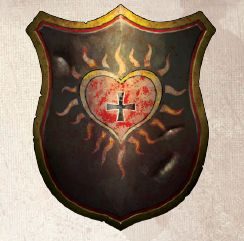
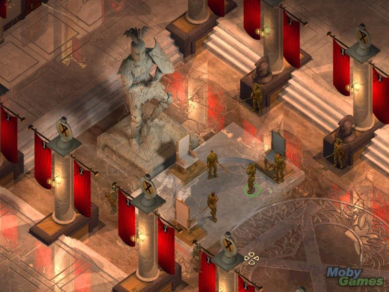
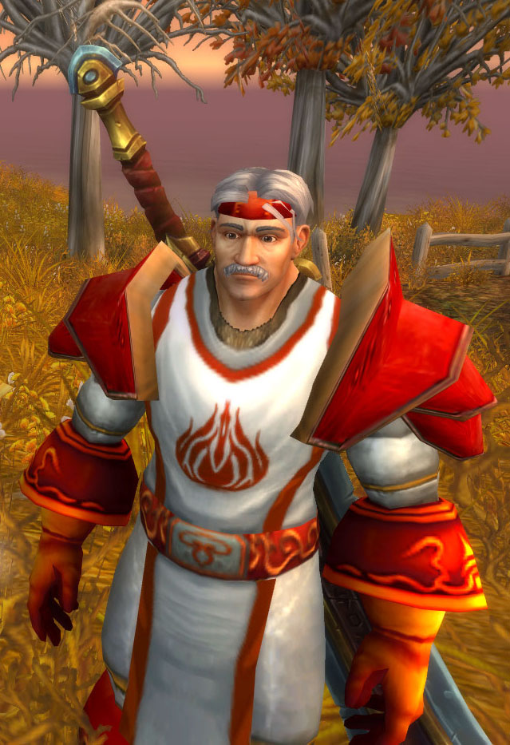

# 炙热之心骑士团出处

炙热之心骑士团在其它位面中同样存在。这份手稿或许由位面旅行者吉薇艾儿带到你手中。它包含了不同位面中炙热之心骑士团骑士团的知识。

战锤：燃烧之心骑士团\
THE KNIGHTS OF THE FLERY HEART
------------------------------

燃烧之心骑士团是驻扎在西格玛大教堂的骑士团，还担任总主教的私人卫队，他们致力于消灭哥布林。骑士团有着悠久辉煌的历史，可以追溯到塔拉贝克兰大公国迫害西格玛教派内战。著名的成员有哥特里克和菲利克斯（人类+矮人的一组探险搭档）。

燃烧之心在奥特多夫以西格玛的狂热宗教骑士而闻名，除了保护大教堂和总主教，骑士们有仿效西格玛去帮助矮人，许多骑士都在失落的矮人要塞阵亡。凶猛狂热憎恨绿皮帮助矮人是帝国人民对他们的印象，骑士团大师是西格玛教派首席牧师阿德里安霍芬。

他们穿着白色盔甲骑着白马甲战马，携带白色绘有红心和黑色西格玛语录缠绕的盾牌。

被遗忘的国度：至热之心骑士团\
ORDER OF THE RADIANT HEART
--------------------------

“至热之心骑士团是安姆的秩序之源。遭遇恶事就求助于他们。”——酒馆传说

至热之心骑士团是费伦大陆上守序善良的圣骑士和牧师的兄弟会，其成员献身于斩除邪恶，匡扶正义，维持律法。骑士团信仰不同的善神，但主要追随托姆，提尔和海姆。骑士团的信条是：“一人之勇可改变多人命运。”

### 尊崇分翼

这是骑士团的高阶分翼，由四十岁以上的圣骑士和牧师组成。这分翼的成员被各方贵族尊敬，其成员可被视为政要。分翼人数限定为25人。只在旧成员去世或让位时允许新成员加入。

### 加入至热之心骑士团

欲成为至热之心骑士团的正式成员，申请者必须极其虔诚，并至少四十岁。年轻成员能加入至热之心预备军。圣骑士申请者必须有两位引荐人：一名他来自他家乡的皇族，和一名骑士团的活跃成员。至热之心骑士团不但尊敬为其献身的人，也尊敬——或许这对于圣骑士来说是最难成为的了——长者。

### 著名成员

凯东·费尔康（Keldorn Firecam）

阵营：守序善良

职业：圣武士类-审判者

初遇地点：神殿区下水道

亲人：〖小女儿〗维斯帕Vesper〖大女儿〗李欧那 Leona〖妻子〗玛利雅Maria

玩家昵称：凯叔

> 　　当被问起他的过去时，凯东叹了口气，稍作停歇努力回想他在至热之心骑士团已经当了多少年服侍托姆的圣武士。他参与过保护弱小的战斗，也经历过打击奸邪的激战，次数已经多到连他自己也记不清楚。身上的伤疤验证了他饱受历练的光荣战绩，但他也会渴望地谈起退休的念头，希望能够有机会和家人多聚聚。然而才一提到他们家人，凯东的态度马上变得认真。骑士团还需要他，他严厉地轻声说道，责任比个人的情感更重要。

以上个人简介引自游戏文本。

第一次在游戏中见到这位老圣骑士，阴沉的面庞、在玩家看来略显迂腐的言行、以及游戏剧情展开的地点——“金钱之都”的歪风邪气，也许还要加上远古时代游戏攻略带来的误导，让人对他很是不齿，但是又不得不因为大叔极强的职业特性以及圣剑带上他，大概对于中立邪恶的玩家来说，带一个自己不喜欢的圣骑士和带上一个腹黑的埃德温没什么区别吧。

只有到了带着凯叔一步一步走下去，经历了游戏中各种凯叔可能参与互动的剧情，玩家才会发现，凯东才是真正的圣骑士，不仅仅比玩家要标准，而且也比游戏中骑士团的其他圣骑士更加标准，其实他的言行也远不像游戏前辈们所说的那么迂腐。他与查内姆，以及与其他队友的对话，无一不透露出这位老圣骑士久经世事的睿智、坚守信仰的高尚、同情弱小的悲悯。当玩家做出有违正义之道的事情时，他会努力劝诫玩家，当玩家执迷不悟时，他会毅然执行正义。或许很多玩家会因此讨厌他，但是从另一个角度来说，在没有任何规则可以约束玩家的游戏世界里，凯东就是玩家的良心。

凯东的个人任务是关于他的家庭和情感危机的，但是从对话中更能可以看出，忙碌于公务的凯东对家人的深爱。也许，在这个任务的最后，玩家把他留在家中与家人团圆才是最好的选择。可是无论从游戏的设计还是从凯东个人性格的刻画，我们都可以看到，这位把一生献给神和正义的圣骑士，弥补了和家人久别的遗憾以后，很快就又整装准备继续自己未尽的使命了。这个时候，忍不住会去想，凯东这样的模范骑士，到底是让他与家人团聚，还是带上他让他走完自己英雄的一生迎来荣耀的个人结局更适合他？或者对于这么一位高尚、热心、公正、仁慈的圣骑士，即使玩家不带他看个人结局，恐怕他的一生依然不会在病榻上结束，那英雄宿命般的结局恐怕还是要到来的吧？

附：游戏通关后凯东个人结局

凯东认为他与主角的冒险旅程是他职业生涯中的最后一次活动，不仅是指冒险，也是对骑士团的最后一次服务。在阿斯卡特拉退休后，他希望自己能像一个退役的老战士一样能安享平静的晚年，但是没过几年，凯东不得不接受他这一生最后的一次任务——安姆受到巨人的围攻。在他60岁这年的冬天，凯东和另外五位骑士拼死战斗——为了守护一条战略要道——直到安姆的主力到达，他们赢得了战斗，但是凯东叔叔的伤势却异常严重，这位年事已高的圣骑士终于倒在了战场上。而此时骑士团的众多骑士清楚地看到，守护神托姆的手从天而降，来到了凯东的身旁，当这只手离去以后，凯东也去逝了。从那天起，凯东他那强健的身躯就如影随形般守护在托姆神的身边。

#### 凯东与主角及队员之间的对话　　来自已沉没的科拉克斯堡

★★与主角的对话★★

【行政区，暴民要烧死维康妮亚】\
狂徒：那就烧死这个黑暗精灵！围过来，我的朋友们，见识贝莎巴女神的意志战胜邪恶！\
凯东：一名黑暗精灵？在这里？叫人不仅要怀疑这些黑暗精灵究竟又有什么样的诡计。看来正义似乎就要获得伸张……愿它黑暗邪恶的心全烧作灰烬！

【行政区，任由暴民烧死维康妮亚】\
凯东：正义已经伸张。如果所有的邪恶都面临如此的命运，也许公正将重回世界。我以托姆之名起誓，一定要致力达成此一目标。

【维康妮亚要求加入队伍】\
维康妮亚：，加入你的队伍不仅是我的荣幸，更是一种荣耀。你觉得我的提议如何？\
凯东：别听这黑暗精灵的话，。你已经救了她，但不需为她负责。我告诉你，她是邪恶的！我们这里没有她的容身之处！\
维康妮亚：你的位置又在哪里？站到前头来对我指控？我早已见识过比你更自以为是的瑞为尔，所造成的伤害也远少过他们！

【萨拉诸许城，妓女和你搭讪】\
凯东：街上充满尸体……少女兜售罪恶……这是什么样的城啊？

凯东：嗯，我并不很欣赏寇根的心直口快。但是，天啊，没有人可以否认他的勇敢！\
选1：凯东阁下，你的意思是说，即使是邪恶之物在世上也有职责与用途？–>凯东：这想法的确令我畏怯，但是——是的，，就这样吧，但是我现在辞不达意啊。\
选2：凯东，请不要因为离开冈位而感到不耐，这会使我们变弱。–>凯东：是的，啊，请接受我最深的歉意。\
选3：看来我们要渐渐适应它了。–>凯东：是啊，我不想依赖他，——

凯东：你必将过著坚苦的生活，吾友——战争与烦恼总是压迫著你，但这不会发生在圣殿。我真的很怀念圣殿，除了家与骑士团外，没多少东西值得怀念。\
：凯东，没有什么比得上圣殿，我以前在烛堡时就瞭解了。

凯东：我知道，我曾——听过你说——某些东西使你感到分裂，是吗——你因心中的矛盾而生气，如同你的灵魂天性在你内心交战——这是你想说的吗？\
选1：凯东，我的灵魂天性是我的私事，不要再问这种事。–>凯东：呃，我想好好运用我的能力。我可以帮助很多穷人——我也可以帮助的 任务。\
选2：胡说八道。凯东，你把我看得太复杂了。–>凯东：我说的是我看到的事实，啊——如果不为你自己著想，也多为我多著想一点——\
选3：我的父亲是黑暗众神之一。就算我有些许矛盾也是可原谅的吧？–>凯东：我已经想了很久。我们不能选择我们的现状，但我们能够选择我们的未来。矛盾所带来的危机只是暂时。当你堕落时，，我祈祷你是堕往光明——\
选4：我是巴尔的子嗣之一，我必须要承担这个污名。大家能与我同行就是在帮助我了。–>凯东：我的确老了，但在我剩余的日子里，我会尽全力维护你灵魂的圣洁——单独一人，我也无法战胜邪神，但这就是须要信仰的原因，不是吗？来吧，朋友，让我们为世界打造一条光明的道路吧。

凯东：能占用你一点时间吗？我想讨论些非常重要的事。\
：好的，凯东。什么事让你困扰？\
凯东：看起来你的命运也许比你最初所可能猜想的还要重大得多。巨大的力量等著你，我不禁想起你的血管里流著巴尔的血。我不为此责备你，——·成为谋杀之王的后裔并非你的选择。然而事实如此，你的体内有邪恶存在。我不能无视它。\
：我们体内都有邪恶，凯东。即使是你。\
凯东：你说的是事实，。我们每个人都必须对抗我们自身的恶魔。但是我不得不相信你的——·跟大多数相比之下——·更强壮。我担心你，——·并且我同样也畏惧你。当你照著真理与正义走的时候我会站在你身边。并且我会协助你对抗你体内的邪恶。\
：我感谢你的支持，凯东。\
凯东：我将为你念祷文，，并请求海姆指引我们的脚步沿著你的命运之途走。

【码头区】条件：主角是男性\
艾赛亚：哈啰，绅士们。我的名字是艾西利亚，你们或许想找个人陪伴吧，嗯？\
：是的，当然，我对美丽的女人总是很感兴趣。\
凯东：只要我在场就不会让这种事情发生。这个年轻的妇人将不会像牲口一样被卖来卖去！。

【大桥区】\
（和小偷交易）\
凯东：（叹气） 这是真的吗，——没有更合法的地方可以让你去进行你的交易吗？

快速跳转：与主角的对话

★★与队友的对话★★

【码头区】\
盗匪（矮人）：哈！我敢说你会在一小时之内，就在码头区被抢，然后大喊。一定的！\
攸旭摩：亲爱的先生，你根本不知道你在说些什么。最好先检查一下你的口袋，然后再决定谁才是码头区真正的受害者，好吗？\
凯东：攸旭摩，这样的行为虽然并不是违反正义，但是这种戏法有违一个英雄该做的事。将来请把你的偷窃能力只用到该偷的人身上。

【贫民区伊尔玛特神庙】\
乞丐：求求你，……你愿意施舍几枚钱币给有难的罪人吗？求求你……只要一枚钱币就可以！\
：没问题，拿一枚金币去吧。\
乞丐：伊尔玛特祝福你，！\
娜里亚：那是件好事，。虽然我相信你可以再多拿一点出来……你存钱做什么？造黄金剑？\
凯东：你对这种仁慈也会质疑吗，娜里亚女士？你应该要多想想你自己说的话。

【铜冠旅店，奴隶牢房】\
：我并不反对奴隶制度，你得继续待在牢里等死，除非还有其他人愿意出现救你。\
韩达克：你——·你这么样的有能耐——·可是却不肯伸出手援助我们？去死吧！愿地狱吞噬你的灵魂！\
阿诺门：，还好你不相信这个下层贱民。他和他的同伙不值得信任，我们也没有时间可浪费在他们身上。\
凯东：阿诺门，你对弱者一点同情心也没有吗？我觉得这种作为非常不荣誉——让我嘴里留下一股黑暗的懊悔滋味。\
阿诺门：他们是走投无路的罪犯，即使可能性甚低，他们仍可能在真正被释放后改而袭击我们。有权这么做。

【幽暗地狱，变为黑暗精灵形态之后，再来到灰矮人营地】\
芬德利格：我不认识你，我以为我认得附近巡逻队的每个人。\
：我们新成立的，只是出来熟悉附近的环境而已。\
芬德利格：我明白了，请原谅我无理的发问。我不打扰您熟悉这片——您所出生的区域——·晚安。\
寇根：笨蛋，门都没有！跟俺说话的时候给俺放尊重些，否则你睡觉的时候就会比平常低六呎。听懂了吗？\
凯东：我明白我们的举止必须要和黑暗精灵的外型相符，可是我开始怀疑你是否正在享受这些恶行。\
寇根：什么？喔，是啊，黑暗精灵。随便啦。\
艾德温：爱炫耀的笨蛋。

【鲨化鱼人城】\
皇家大祭司塞尼提依里：我族越来越稀少，我们的血脉越来越淡薄。我们必须收回我们失去的族人，放逐者的领袖维尔里那提王子就是我们的最后希望。\
凯东：我们管这些生物的命运那么多干嘛？他们全都是邪恶的。既然命运就是如此，我说乾脆就让他们因自己的愚蠢而灭亡吧。\
贾希拉：我从没见过你如此快就下定论，圣武士。你该不会把所有的鲨化鱼人都贴上这种标签吧？倘若你就这么诅咒他们全都得下地狱，那么你似乎也没有比他们圣洁多少。\
艾黎：凯东！我我没听过你是如此的冷酷！海人族并没有那么坏若你将它们全都判处死刑，这会使你自己不比你所描述的海人族好到哪里去！\
玛兹：圣武士，我并不喜欢这群野人。不过我觉得你似乎不像你所说的那么恨他们——你一定不觉得他们全都是邪恶的吧？\
凯东：女人，你的话无法动摇我。我很清楚明白，我并没有看错这些生物。而且要是状况不一样的话，我相信他们对我们一定也有什么不良的企图。

凯东：年轻的阿诺门啊，看来你离开教会有一段时间了，或许这是一个延续你课程的好时机。\
阿诺门：我向你保证，可敬的凯东，我很清楚骑士团的规矩与规范。\
凯东：我可不这么认为，不过，或许该是让你重新想起骑士美德与诚实的时候了。\
阿诺门：我知道你就在附近，凯东。让我来操心训练的事，你只要操心自己的事就行了。\
凯东：我可是很认真地教育侍从，你最好听听前辈的智慧。\
阿诺门：我会采取我觉得适当的途径，凯东爵士。我并没有去烦你，所以你来烦我是很无礼的举动。\
凯东：很好，我认为你还没准备学习。

凯东：侍从阿诺门，此时此刻我有良言相赠。我必须说，你的行为总是不像一个骑士团侍从所该做的。你必须学著如何去服从你的领袖与前辈。\
阿诺门：凯东爵士，我认为上次你提起这件事的时候，我就已经说得很清楚了，我不需要再继续学习——特别是跟你学。我已经快取得骑士资格了。\
凯东：阿诺门，你太冲动了，如果你能学著如何悬崖勒马，你应该会是一名出色的骑士。没错，你既勇敢又强壮，但别笨得相信你已经学到所有事，人生就是一门课。\
阿诺门：如果事情是这样，那我就没有必要奉你为导师了。生活本身就可代替你。\
凯东：你错了，我并不须要做你的导师。在你该学时学习，如果不学，未来就不会如你所期望。

（阿诺门成为骑士）\
凯东：阿诺门，这是你的命运之时，你已不再是一名侍从，而开始成为一名骑士了。年轻人，做得好。\
阿诺门：万分感谢，凯东爵士。你真是个荣誉与骑士精神的典范。我必须为先前的无礼向你道歉。就像你说过的，这只是年轻人一时的鲁莽。\
凯东：年轻的骑士啊，无须担心。现在，你在正义的旅途上做得很好。托姆已经原谅一切。

（阿诺门的试炼失败）\
凯东：阿诺门，别因为被骑士团除名而影响了你的决定。你可以从中学到一些教训。\
阿诺门：闭嘴，畜生！我已经听了你一辈子的吹牛说教，并没有给我任何助益。自以为是的说教者！你这辈子从来没过过一天苦日子，你却自认为什么都知道！你这该死的凯东！\
凯东：它已经开始了。阿诺门，我是站在你这边的。我希望成为你的朋友，并且帮助你改变人生。当你需要时请接受我的协助。\
阿诺门：我的人生都是被你这类家伙害的！你居然用对小孩的方式对待我，我真应该杀了你！\
凯东：你会了解你的行为有多么幼稚，孩子。\
阿诺门：你说的话对我一点意义也没有。在我想把它们塞回你的喉咙里之前住嘴吧。

（阿诺门的试炼失败）\
凯东：冷静一下，阿诺门。我的话对你有益，你正在背弃海姆神，也正堕往邪恶之道，我不能让你这样下去。忠言逆耳啊。\
阿诺门：你真可怜，凯东。你是个伪善者跟骗子。我为什么要相信你说的？我也许会在你脸上吐口水，但你根本没资格给我吐。\
凯东：阿诺门，你已经太过份了，回头觉悟吧，不然就太迟了。\
阿诺门：你那该死的骑士团，已经把我像没用的垃圾一样丢掉了。来打一场吧，蛆虫！我已经被逼到极限了！\
凯东：阿诺门，不要这样做。\
阿诺门：死吧，你这个混蛋！\
（阿诺门攻击凯东）

凯东：人必须要维持戒律与四个美德信条——这是我的座右铭，也是永远的责任。\
姚恩：美德吗？小武士？\
凯东：的确，小鬼。这样称呼我并不雅。\
姚恩：又一个搞不清楚状况的人。我告诉你，凯弟，我老妈可是写过一本关于美德的书喔。\
凯东：是这样吗？\
姚恩：是啊。一本关于性爱的美德的书，叫做“血肉魔像之罪”。听说很多圣武士都有买喔。\
凯东：姚恩，这是一个很不适当的笑话，你应该感到惭愧。\
姚恩：我没开玩笑啊。下次我送你一本，说不定你老婆早就买了呢。\
凯东：侏儒，你最好别提及我的妻子。我可不希望你口出劣言。\
姚恩：是啊，是啊。就像“那种东西”。\
凯东：我想你没有资格来评断我，你必须学习尊重你的领队。\
姚恩：我当然尊重领队，但这跟我们的话题无关吧。你让我想到描写圣武士初次跟血肉魔像翻云覆雨那段。太精彩了。\
凯东：侏儒，快走开，不然我会为了维持名誉做出令你后悔的事。\
姚恩：那圣武士说：“我的小甜肉”。魔像回答说：“我在这，宝贝”——·

凯东：诗人啊，我发现你的音乐天份让战斗更有效率，请继续吧。\
海尔达利：当然，你尽管冲到最前线吧，我的猎犬。我只想在后面多晃一会儿。\
凯东：海尔达利，很难想像会看到你如此胆怯。\
海尔达利：是无聊而不是胆怯，凯东阁下。有你那把亮闪闪的剑在前面挥舞，我也没什么事好做。\
凯东：不，好心的人，他们不是因我的剑芒而逃，是因为你拙劣的音乐而逃走！\
海尔达利：哈！我想最好听的音乐应该就是把我的琴砸在你头上的声音吧，我的老猎犬。用你那把剑砍点别的东西，好吗？

（在码头区竖琴手基地）\
凯东：这就是你们神秘竖琴手同盟的家吗？\
贾希拉：凯东大人，您的审视越来越清晰。如果我能选择，请留我自己处理这里的事。\
凯东：感谢众神，还好你不常下决定。你的决策经常过于仓促。\
贾希拉：凯东，我是竖琴手的人，必要时我会躲起来。我有个更——有效率的法子，所以可以请你别再出主意吗？\
凯东：是啊——是——是的，女士。

凯东：我强烈要求你重新考虑是否要包容这个黑暗精灵！我们的任务再怎么危险，也比不过包容像她这样的恶魔！\
维康妮亚：我不能在这里吗，男人？\
凯东：是啊，黑暗精灵。只要你还在这个队伍里，我就应该为大家做一件好事，就是宰了你。\
维康妮亚：我期待著你的突袭，并准备反击。

凯东：黑暗精灵，你死期到了。我已经警告过你了。\
维康妮亚：多么高贵——又多么愚蠢啊。\
（凯东与维康妮亚发生冲突）

凯东：瓦里格，我发现你是一名优秀的战士。你难道不想在生命中追求一些更重要的东西吗？\
瓦里格：更重要？你是说？\
凯东：还有更重要的——像是加入圣骑士团，或者在军中谋得一职，为你的主人或神祇服务。\
瓦里格：我曾待过部队，当斥候。那也不是为了我自己。\
凯东：那么，你信奉的是哪位神祇？\
瓦里格：但我不信神，圣武士。我该侍奉谁？\
凯东：你没有信仰？！你说的是真的？怎么有人能够缺乏信仰而活？\
瓦里格：依照我的心行事。我为自然对抗非自然，对我来说，这样就够了。\
凯东：瓦里格，说得好。虽然不信神，但你确实是个善良的人，我可没有恶意。\
瓦里格：没关系，凯东。愿所有人的目的都像你一样真诚。

（次元球任务结束）\
凯东：瓦里格，我祝贺你。\
瓦里格：为什么祝贺？\
凯东：你完成了家族的誓约。吾友，能够实现诺言是很可贵的，更何况是一个五百年前的诺言。\
瓦里格：我知道。我家族誓言杀死拉渥克。但——·和我想的有些差距。\
凯东：为什么？你的家族应该为你而骄傲。\
是吗？我想我的家族甚至连誓约都不记得。我确定他们都不认识拉渥克。\
凯东：我想那几乎没有关系。死灵法师是邪恶的，就算他死前为邪恶而忏悔，他还是得赎罪。\
瓦里格：我不确定，凯东。我还没有把他当成绝对邪恶的心理准备，而那也是我不安的原因。我想，事情没有绝对的对错。\
凯东：瓦里格，或许你是对的。

凯东：瓦里格，我不希望冒犯你，但是我再也不能保持沉默了。你是一个伟大的战士以及道德与是非的真正守护者——·\
瓦里格：为何那会冒犯我，凯东？\
凯东：我想你在开玩笑，瓦里格——·虽然我从不确定你是。那些话当然不会有冒犯。但这些可能会：我再度思考了你的无神论信念。\
瓦里格：凯东，不用浪费力气想要让这异教徒改变信仰。我尊重你所拥护的，但是我不需要去服侍一个神——·即使是像海姆一般值得尊敬的。\
凯东：你的言行不一。你就像任何骑士团的骑士一样高尚地捍卫公理正义。也许你服侍了海姆的意愿，虽然你所声明的恰恰相反。\
瓦里格：我会把你的话当成赞美，凯东——·而不是当成在对我自己信念的高度谴责。如果相信我不经意地服侍了海姆会让你觉得安慰，我不会反对的。\
凯东：既然否认你的服务能让你舒服——虽然你的行为是另一套——我不会再让它困扰我，瓦里格朋友。我很高兴我们曾有这段讨论。\
瓦里格：我也是，凯东。我也是。

凯东：瑟恩，如果可以的话，我想问你一个问题。你看起来像个好人。然而你却拒绝遵循律法——·我发现这个矛盾相当令人费解。\
瑟恩：美与自然不受刚硬的法律所约束，我忠实的朋友。你视混乱与困惑为你的敌人，但他们是自然秩序的一部分。你必须学习拥抱他们，就跟你拥抱秩序一样。\
凯东：你没办法使我去信你那些原野森林的道理，瑟恩。虽然通常不容易做到，但法律与秩序的道路才是真正美德的路。\
瑟恩：拒绝承认秩序与混沌之间均衡的必要性，你只是使你的生命更加艰难了，凯东。你坚守的信仰系统真是荒谬不实际！\
凯东：你在嘲笑我的价值观吗？你敢轻蔑我一直坚持的信念和我这半生的努力？别当个这样的蠢货，瑟恩。\
瑟恩：呃——·圣武士可以被允许说“蠢货”吗？\
凯东：我的荣耀守则规范我的行为，瑟恩。它没有规范我的言语。但我不会再对你说一句话了 – 即使是“蠢货”。\
瑟恩：原谅我，凯东。我只是问问，因为身为一个德鲁依，我被限制使用诸如“番茄（俚语：妓女）”的字眼——·我想也许你也有类似的限制。\
凯东：什么？你连蔬菜的名字也不能说？\
瑟恩：嗯，你看，你已经触到了关键所在。毕竟，番茄是水果。\
凯东：那真荒谬。\
瑟恩：也许。但我们必须要小心这个词语是指蔬菜还是某些黄色的暗示。我亲爱的圣武士。\
凯东：够了。我说过我不再对你说任何话了，德鲁依，现在我加倍地肯定了。\
瓦里格：如你所愿。我完全想不到与你谈论水果也会引发争论。也许与瓦里格讨论这个比较合适。滚开，德鲁依。我今天没心情听你的暗讽。\
瑟恩：不得了，不得了。今天每个人都好敏感喔。

凯东：玛兹，我的女孩，你是最有超凡勇气的半身人！我很荣幸在你身边服侍！\
玛兹：凯东爵士，自从我还是小女孩的时候，我就已经崇拜你了！听到你那样子说，你不知道这对我的意义有多么大！\
凯东：你真体贴但是不要谢我。你值得所有的赞扬，这是你赢来的！

凯东：爱蒙！你干嘛又——·拍我一下？你以为我没有注意到吗？你想要扒我的东西，对不对？！\
爱蒙：呃，不——·我只是——·\
凯东：只是怎样？离我远点，女孩。我可不希望队上的成员偷我的东西。\
爱蒙：不，不，才不是那样呢！我——·我只是——·我只是想检查看看你甲胄下的身材是不是像外表看起来一样有料。\
凯东：呃？你想干嘛？\
爱蒙：喔，我知道你已经结婚了，凯东——·不过你知道你有多——么——帅气吗？我——·我情不自禁，整天都想碰碰你呢！\
凯东：爱蒙！我——·我已经有了一个像你这么大的女儿了呀！\
爱蒙：我不知道为什么会这样，凯东——·说不定是因为我体内的巴尔本性的关系。我只想要让我的手指穿过你的发梢，然后轻轻地咬著你的耳轮！喔，凯东，你让我变得如此狂野啊！\
凯东：奉托姆之名，别这样！这太可怕了！我——·我不知道我会对你有这种影响——·\
爱蒙：喔，你已经镇定下来了吧，凯东！嘘——咯咯！你的戒指还你。我不会再犯的啦，我保证。

凯东：沙洛佛克，我不认为你会在乎我说些什么——·不过你有没有考虑过把这段新生命当成是你的第二次机会呢？\
沙洛佛克：你说的对，圣武士。我完全不在乎你要说什么。\
凯东：如果你高兴，尽管向我发火吧！不过考虑一下，第一次你就是因为自己的阴谋诡计而丧命的。要是你没有从中学到教训的话，你一定会重蹈覆辙而死得毫无意义可言。\
沙洛佛克：死亡毫无意义可言，笨蛋。那只是运气问题，根本不是什么神的审判。在其他状况下，我也许可以轻易地取得胜利。\
凯东：那么你没有从死亡的经验中学到任何东西？生命是多么地短暂而珍贵，执著于财富权力这些东西是完全没有用处的啊！沙洛佛克，他们在深渊魔狱中到底给了你什么？\
沙洛佛克：在深渊魔狱中我不需要别的，只要有我的意志与渴望就很够了。\
凯东：我认识过许多善良、正直的人，他们都有著强大的意志力。而且我知道当他们去世时，他们不会被送到深渊魔狱去。\
沙洛佛克：笨老头，我——·不在乎我是否会回到深渊魔狱。反正我死都死了，还有什么好在乎的？\
凯东：我虽然老，可是不笨。我不相信你真的这么想。\
沙洛佛克：我——·走开，老头。省省你的传教演说吧，说给那些还有救的人听去。对我，已经太迟了。

【来到马戏团】\
艾黎：回到这里的感觉很奇怪，凯东。我有时觉得很快乐，下一刻却变得很悲伤。\
凯东：他们说回家就像这样。\
你呢，你有……家可以回吗？\
凯东：我的信仰就是我的家——而在托姆的意志之下，我将信仰带到我所往之处——\
艾黎：海姆？\
凯东：是的，神的仆人要随时准备牺牲奉献。我许久没有与家人相聚，托姆需要我们全家人作点牺牲。

艾黎：凯东，你……有空吗？\
凯东：当然了，艾黎，有事吗？\
艾黎：我——奎里教我马戏团的事——可是我对世界所知不多——他教我敬拜野行者贝文，这是一个侏儒之神——\
凯东：野行者贝文又称为覆面叶，是侏儒之神。我听说过，但并不是很了解，我是遵从人类之神而修行。\
艾黎：我不太记得精灵之神——喔，太久了。现在我的信仰既不是精灵，也不是侏儒，也不是人类，只是——一个大杂烩——我这样错了吗，凯东？\
凯东：错了？不，对你们而言这太理想了，你必须以各种形式对教会做出奉献，包括最纯正的形式，也就是你的真心。\
艾黎：我的心？\
凯东：我们都有区分众神的倾向，我们容易向给予好处的神祈祷，忽略其他神——艾黎，你的人生并不是那么如意，但你的人生也教导你不少事物。\
艾黎：喔，谢谢你，凯东……你一定要好好教我你所说的这些。\
凯东：艾黎，或许是你我啊……

艾德温：啊，凯东，你这邪神的门徒。在这充满了谎言和颠覆的神秘历史中，你有没有找到一点心灵的慰藉啊？就像你教会那些羔羊一样啊？\
凯东：法师，你只是暂时延缓你的死刑！\
艾德温：看你气成那样，凯东，我只是逗逗你而已。\
凯东：艾德温，汝之审判必将迅速纯正。你的行径证明残忍是弱者的行为，只有强者与正义才能持久。\
艾德温：如果这能让你睡得安心的话，圣武士。（我巴不得吃了你的眼珠，懦夫）

艾德温：让开，你这马屁精。\
凯东：法师，你在想什么？我可没惹你。\
艾德温：我可不想等你用那正义的匕首来背刺我，武士。我受够你的有毒思想了。（粗野、肮脏，粗野、肮脏。）\
凯东：艾德温，全都是因为你搞鬼！以神之名，我应该对你当头棒喝，结束你的作为！\
艾德温：我会让你尝尝真正的痛苦，武士。\
（二人发生冲突）

阿诺门：我很想谢谢你，导师——感谢你以前给我的帮助。我以前好像没跟你说过这类话，凯东。\
凯东：现在是老师了？\
阿诺门：是的，凯东——人们说最好的教师，就是有耐心教导笨学生的老师——我知道我并不是最好教的学生。\
凯东：虽然我不是最有智慧的导师，但我们必须尽全力维护和平。\
阿诺门：那是事实。谢谢——感谢你所做的一切。

阿诺门：凯东爵士，作为一个骑士团的一员，我听说过很多你的胆量与勇气。有一次，卡休斯爵士谈到你在巨人平原的英雄行为。他突然地停了下来，然后带著一股阴沉的样子，就不再说下去了。那里发生了什么事？\
凯东：他说英雄行为？卡休斯太过奖我了。在巨人平原上的那些日子是阴沉的，执行的行为更加阴沉。在被太尔嘉公爵背叛之后，我们在一场突袭之中被狞笑瑞斯抓到。当我们在布满浮木的河中找路带著马匹通过的时候，瑞斯跟他那一伙人抓到了我们。弓箭手们迅速地射倒我们的马匹，并且几乎干掉了我们半数以上的兄弟。穿著全身铠甲被在浮木中窒碍难行，我们毫无机会逃跑。瑞斯把我们衣服扒光，不管是死的还是活的。有一支箭把我的肩膀穿过。他的食人魔们真是够亲切了，在“舞蹈”之前把箭硬拔出来，连同一大块肉一起扯下。我到现在还在痛。\
阿诺门：死亡之舞？\
凯东：死亡之舞是狞笑瑞斯的注册商标。每个活的骑士都跟一个死的同伴头跟头，手跟手，脚跟脚绑在一起。他用药迷昏我们，把我们带到空旷的平地上，然后把我们绑起来，让我们不能离开不跟死人跳舞。我们在那里躺在炽热的阳光底下，当我们的朋友开始腐烂，我的人就开始死于曝晒。我用突出在地上的石头成功地解开了我一只手的束缚。我救了那些还有救的人，也包括卡休斯。其中一些人在死亡之舞的过程中死了，还有一些人在当他们朋友的血肉在阳光下溶化之时，变得精神错乱。我追踪瑞斯，潜入他的营帐，而且还杀了他和所有参与这暴行的人。没有英雄主义，阿诺门，只有缓慢残暴的死亡与残忍的行为。我们不要再谈这个了。

瑟恩：呀，天啊。凯东，看看这座城，学习吧。不用砖瓦灰泥，也不用切割打磨的大理石建造的神殿。只有阿斯卡特拉做得到，我不该如此蔑视它。\
凯东：如果阿斯卡特拉变成这样子，我们可能得用原始的方法才能做出一只锤子。瑟恩，少来了，我可不是像你这样的野蛮人。\
瑟恩：你不瞭解吗？你所谓的文明其实是一种癌，像尸体上的菌类般扩张。那是一个失去平衡的世界，只会带来退化。你所谓的野蛮其实是一种和谐。人类、野兽、植物，和土地都拥有。并未矛盾。\
凯东：德鲁伊啊，真神们让我们管辖这里，而爱欧神在大地上安置了可能成长茁壮的种族，这一切都是命。文明是一种权利、一种殊荣，也是一种义务。只有透过文明与宗教的洗礼，我们才能超越过去残忍的蛮荒。\
瑟恩：呃，你至少证明了一点。\
凯东：那是什么？\
瑟恩：再也没有和神学家辩论更恼人的事了。

海尔达利：凯东，我忠实的猎犬。你到底是怎么变成一个圣武士的啊？\
凯东：我必须说，只是实际如此。我的母亲是贵族出身，而我的父亲是有位阶的牧师，我必须跟随他的教诲，但成为圣武士较有吸引力。\
海尔达利：啊，他们说得对，‘天性是改变不了的’。你英勇的向前，祖先的血液在你体内沸腾，他们的命运就在你的手中实现！天啊，为什么当我需要纸笔的时候总是找不到？\
凯东：呵，海尔达利，你的诗文使我倍感尊荣。我不过是个下了决心的凡人，在这片土地上走出我的路罢了。如果你想要写我，请写下我希望被人们记住的事迹。\
海尔达利：当然啦，否则我的诗要写在哪里，好武士？呃，好吧，看来已经有点不耐烦了。我们告一段落吧。

海尔达利：我伟大而高贵的猎犬啊，我感觉到你的精神状况相当沈重。究竟是什么事居然可以让那强壮的圣武士感到困扰呢？\
凯东：你的观察相当敏锐啊，好诗人。我的确正为我们现在的目的而困扰著。\
海尔达利：但是你这闪亮的样版不是正指引著我们走向正确的道路吗？凯东爵士？\
凯东：我并不是队上的领导者——·不过就算我是，我也不知道会不会有什么差别。不管选的是哪一条路，恐怕都是一段血流成河的旅程啊！\
海尔达利：好吧，我们不过是在这出悲剧中演出的角色，依照那残忍又沈重的脚本逐行念出台词。不过我依然期盼著会有一个美好的结局。\
凯东：我也一样。尽管生命并非总在模仿艺术，但我想这一次应该是吧！我不想再说了——·我可不希望弄得让别人跟我一样沮丧。

（贾希拉HP小于15）\
贾希拉：我的伤更重了，必须马上治疗。不过这很值得，因为我们已经把不少没用的家伙送进冥间了，毫不留情，不是吗？圣武士凯东？\
凯东：你对敌人怜悯，所以批评我？\
贾希拉：一点也不！虽然我也乐于想像他们并非完全无可救药。\
凯东：或许理论上如此，但我并没有看到你在战斗时有所犹豫。既然你也一样，为何批评我？\
贾希拉：别在战斗中。不过我猜你那正邪分明的头脑，不会明白有灰色地带的存在。\
凯东：灰色？灰并不是一个颜色，它是其它颜色的污点。灰代表优柔寡断，我不想因为它浪费时间。

贾希拉：凯东？你看起来有点忧郁。你还好吗？\
凯东：我很好，贾希拉，尽管我们的情境给我停顿的理由。\
贾希拉：嗯嗯。我最近也想了很多。很难描绘出那一条划分“一边代表平衡，另一边则否”的中界线。\
凯东：平衡？这平衡就是我们最担心的事。\
贾希拉：嗯。对分辨是非黑白感到困惑？\
凯东：这真是保守的说法。我非常确定前方有什么邪恶，但我发现难以找出“善良”之道。\
贾希拉：我不确定该说什么。机会一出现我们就尽己所能。\
凯东：那就是我唯一想要的。托姆会引导我们，我们需要祂的智慧。

（将姚恩复活）\
姚恩：大家好。抱歉我忘了带纪念品给你们，下次一定补送。对了！凯弟，诸神拜托我跟你打招呼，还叫你要多洗内裤。每个人都准备好了吗？出发吧。\
凯东：姚恩大师，你没有发现我们情势危急吗？！\
姚恩：是啊——·了解——·就像萝卜枯萎症一样，好可怕的病。凯东，你有没有想过去帮萝卜治病啊？你一定比现在还出名的，相信我。\
凯东：我的信仰和能力并不是用来卖艺，尤其不是卖给像呆头鹅一样的家伙！\
姚恩：你让我想到我曾叔父在我小时后做给我的玩具。只要扭一下然后放开，它就会在地上抖个不停。我们要出发了吗？\
凯东：喔，别在意，我会站到别的地方去，免得因为听你啰唆而睡著。

姚恩：那么，凯东，当我们讨论成人纸尿布这话题的时候，你已经使用多年了，不是吗？\
凯东：你到底在说些什么鬼话啊，姚恩？我们不是在谈这个主题！\
姚恩：呃，只不过臭叔叔在大约你这年纪的时候，他很容易得到严重的尿布疹。我想，你可能是用你高贵的骑士精神默默忍受同样的问题。没有一个男人应该独自面对尿布疹。\
凯东：“臭叔叔？”（叹气）我猜他是因为尿片的关系才被这样称呼吧？\
姚恩：不，是鱼头让他赢得那个绰号的。真名是罗克塔还是史罗比或是别的名字。我想不起来了。为什么呢，如同老爸常说的，“如果你不能加入他们，那就抬起你的脚丫然后–\
凯东：（天啊！），我对你来说是不是像个笨蛋一样？\
：你为什么要问呢？\
凯东：我持续地被那侏儒的话所打击。他还在说话不是吗？\
：是的。\
姚恩：——·那就是为什么我弄了头驴子的真正原因。祝你的尿布疹赶快好！

寇根：对一个愚蠢的高个儿来说，凯东，你的剑上功夫还不坏。\
凯东：寇根啊，跟你一样。但刀刃对于身材矮小的人来说可能太长了点。\
寇根：我可不想用细细的铁条戳敌人。一斧开山才过瘾。如果有必要的话，连队友都可以砍了。\
凯东：你的斧头希望能够离你近一点，我可不想再有超越你的冲动。\
寇根：这不是暴力，而是力量。你必须要选择一个大小适中的敌手。战场是无情的。\
凯东：寇根，我们都是这样的。我们的主让这个世界成了充满泪与悲的溪谷，而且啊，只有少部分的人能够被救赎，其它无穷无尽的人被打入地狱。

（战斗结束时若明斯克仍处于狂暴状态）\
明斯克：没有任何东西能阻挡明斯克跟小布的力量！到处都是邪恶！所有的一切都——·啊啊啊啊！！\
凯东：冷静点！明斯克！\
明斯克：我要打架！明斯克出手，邪恶必败！！\
凯东：你的确是个优秀的战士，但是战斗已经获胜了！明斯克，停止愤怒吧。\
明斯克：我要——·我——·凯东？\
凯东：做的好，明斯克。你发出了正义的怒火，但别让它蒙蔽了你。

（战斗结束时若明斯克仍处于狂暴状态）\
明斯克：啊啊啊！！小布说，杀啊！明斯克也说，杀啊！\
凯东：让怒火退去吧，明斯克！战争已胜利，而我们还活著，别让你的愤怒盖过你的理智！\
明斯克：啊！啊——·明斯克——·明斯克——·好多了。我们说话的时候，小布也冷静了。谢谢你，圣武士。\
凯东：正义有时必须以残酷的方法降临，但别让它从内心摧残你。在需要战斗时战斗，在该结束时结束。\
明斯克：明斯克冷静了。小布冷静了。你说的话很有智慧，也很会打架。你愿意听小布的赞美吗？我不太会说话。

（战斗结束时若明斯克仍处于狂暴状态）\
明斯克：想宰明斯克的就来吧！谁？！我要杀光邪恶！四处都是敌人！\
凯东：明斯克，平息愤怒！战争已经结束了！让你的朋友安抚你！\
明斯克：我的朋友——·我的朋友们——·\
凯东：敌人已败亡，是该反省的时候了。恶徒该来时就会来，不需要为已知的恐惧做准备。\
明斯克：明斯克冷静了——·你说得对——·谢谢你，凯东。你给我好多——·启发。\
凯东：效法楷模才能辨明是非。

明斯克：你身上的伤疤真漂亮，凯东。像你这样的战士在我的故乡罗西曼一定很受人尊敬。\
凯东：我并不因伤痕而骄傲，只为战胜而感到光荣。为正义献身是我的职责，这与我的希望无关。最好的楷模在与邪恶作战时仍能保持善良，我不会在意身上的伤痕。\
明斯克：这，小布，这是传说中的英雄！明斯克很荣幸能跟你一起作战，凯东！\
凯东：别因为与我并肩作战而感到光荣，你应该为善良作战而感到光荣，这才是我力量的来源。

（明斯克HP15）\
明斯克：又有更多伤疤可以显示明斯克的英勇了！所有伟大的战士都有漂亮的伤疤！凯东，你一定也有许多像勋章一样伟大的伤疤！你是不是以他们为荣呢，就像我一样？\
凯东：我都毫发无伤地战胜，这是我最大的骄傲。当我为正义付出而没有受伤，我便知道这是为了至高无上的善良，而非只是因为个人的愚昧而战。\
明斯克：我可不这么想，伤疤是我誓死对抗邪恶的证明。我的敌人一看到就会害怕。\
凯东：邪恶必定不知其敌人来自何方，只知敌人将至。如果一名恶棍怀疑我的意图，那他对我举剑相向时已处不利。\
明斯克：我尊重你的想法，但我宁愿大剌剌的走向我的敌人，让他们觉得束手无策。

（明斯克HP20）\
明斯克：啊！小布，你在哪里，小布？告诉骑士们我撞到头了。\
凯东：明斯克，支援到了，撑著点！\
明斯克：不，小布。我说的是骑士——·不是那些讨厌的小鸟——·\
凯东：我的天啊，照顾这可爱的疯子吧，你可能——\
明斯克：明斯克没有生气，明斯克不会生气——·不，好吧，明斯克生气了——·

（若凯东阵亡）\
明斯克：不！一个战士不该就这样倒在这里！我不想说了！让他们都尝尝我靴子的味道吧！

（复活凯东）\
明斯克：你没死！你又跟我们在一起了！喔，小布高兴的要命！我不会再让邪恶带走你了！\
凯东：如果我在战场上输了，无须伤悲。胜固可喜，但我的牺牲若能带给他人鼓舞，那也值得。失去朋友的愤怒将带领你前进，不是吗？\
明斯克：我不认为那些逝去的伙伴已经不存在了。我虽然不常提到他们。但我每一次挥剑都是在为他们复仇！\
凯东：这是应该的，如果我能促成这事，那只是牺牲我一个人。

（复活明斯克）\
明斯克：明斯克——· 明斯克可以呼吸了！小布，小布在哪儿？啊，你在这里，你没有离开我。真是个奇迹啊！\
凯东：这就对了，明斯克，别浪费你的生命，重生是种被授与的特权，而非权力。你知道要为战斗搏命，但我认为除了战斗外还有别的选择。\
明斯克：小布永远跟我在一起！明斯克还活著，小心点，邪恶！

明斯克：凯东，你狠狠地打击我们频频遇到的大坏蛋们，小布跟我又一次对你感到敬畏啊！\
凯东：一如既往，明斯克，你带著许多骑士才有的正义的力量与邪恶对抗。\
明斯克：还有仓鼠！我们别忘记小布跟他毛毛的愤怒。

（来到至热之心骑士团大厅）\
娜里亚：这不是有名的至热之心骑士团吗？\
凯东：有名？娜里亚小姐，我们至热之心骑士团的神职者，能为黑暗的世界带来一点光明而感到骄傲。只有最光明磊落、最正直的骑士才能够获得这项殊荣。\
娜里亚：凯东，是像你自己一样吗？\
凯东：遵旨。\
娜里亚：而骑士团为你的地产付钱吗？\
凯东：娜里亚小姐，请你瞭解，不管是任何社会阶层或性别，只要加入骑士团就能拥有纯净的心灵。——不像那些自己招惹批评的人，我们可不是生来就穿金戴银。\
娜里亚：然而这些厅堂与神圣的誓言却只为了我们人类——仅管相信你要的谎言吧，凯东，它们是不会成真的。

娜里亚：凯东——·告诉我，你已经在骑士团中服务很久了，你是否仍然真的相信他们的所作所为都是正当的？都是值得的？\
凯东：我当然相信是这样的。如果我不再衷心相信是这样子的，我就没有办法在骑士团服务了。为什么你会这样子问呢？\
娜里亚：这——·对我来说毫无意义啊。我无意冒犯，可是好像不管消灭了多少邪恶，世界上还是有那么多可怕的事存在著，一点起色也没有。\
凯东：是啊，孩子，有的时候光是想到，就够让人心力交瘁的了！\
娜里亚：而且有些最糟糕的恶行是由那些根本不被认为是邪恶的人所犯下的。比如说，贵族或是神职人员——·无数的不义之行欺压著那些甚至没有懂的比较多的人民。\
凯东：没错。骑士团只能做能力范围之事，娜里亚。我们试过，而且或许就我们尝试去做不放弃这一点来说，就跟真的有达成目的一样重要。\
娜里亚：我——·我想是的。有些时候局势实在让人绝望，就好像都不会有什么改变似的。\
凯东：这不过是年轻人缺乏耐性罢了，娜里亚。世事无常，但是希望真正善良的人不要彻底绝望与放弃，比如说你。这世界需要你的勇气啊！\
娜里亚：谢 – 谢谢你，凯东。我想我的确需要你这些宝贵的意见。

（完成次元球任务之前）\
瓦里格：你真是镇定，凯东。队伍里动不动就有人施法，你是如何保持冷静的？我光看就坐立不安了。\
凯东：嗯——我知道你并非总是将魔法用来服侍邪神，或用来规避善良势力。\
瓦里格：我实在很难相信，和巫术或拉渥克的死灵法术扯上关系有什么好处。\
凯东：但我们不是延长了生命，甚至以虔诚的咒文让死者重生吗？魔法、神或其它的事物不过是工具，滥用的人须要受制裁。

维康妮亚：灰色荒原的女王只是空有虚名而已。仇恨无法忽略，凯东，就像要勉强原谅也是不可能的事。痛苦只是被隐藏起来，我想你已经发现了。你忠诚组织的命令不过是欺骗和诡计，我想你们那帮圣人的伪装真是凄惨，是吗？\
凯东：莎儿是堕落的邪魔种族。她的信徒与邪恶共处，她是阴险可悲的女巫。再敢轻蔑骑士团，你就无法活著瞭解这一切。明白了吗？我可不会再说一次。\
维康妮亚：收回你的敌意，圣武士，我不想与你或你的同伴起冲突。我发现了你的士官。我镇重向你道歉，苏力斯。
