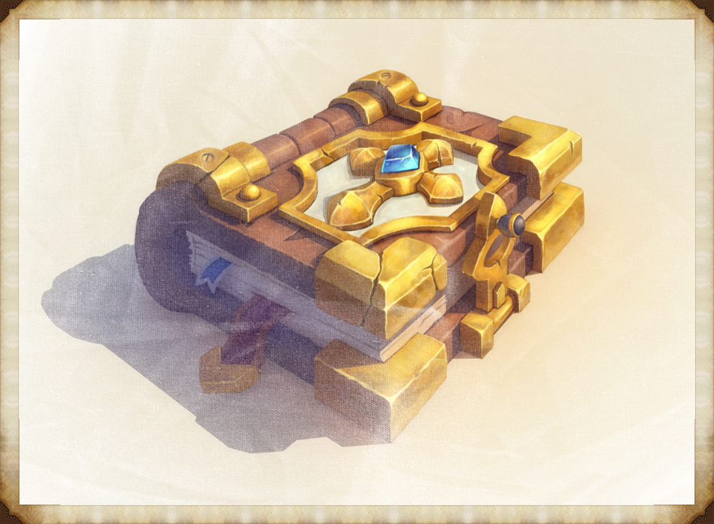
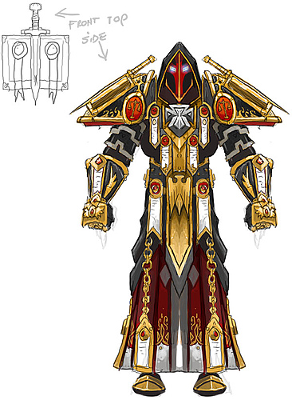
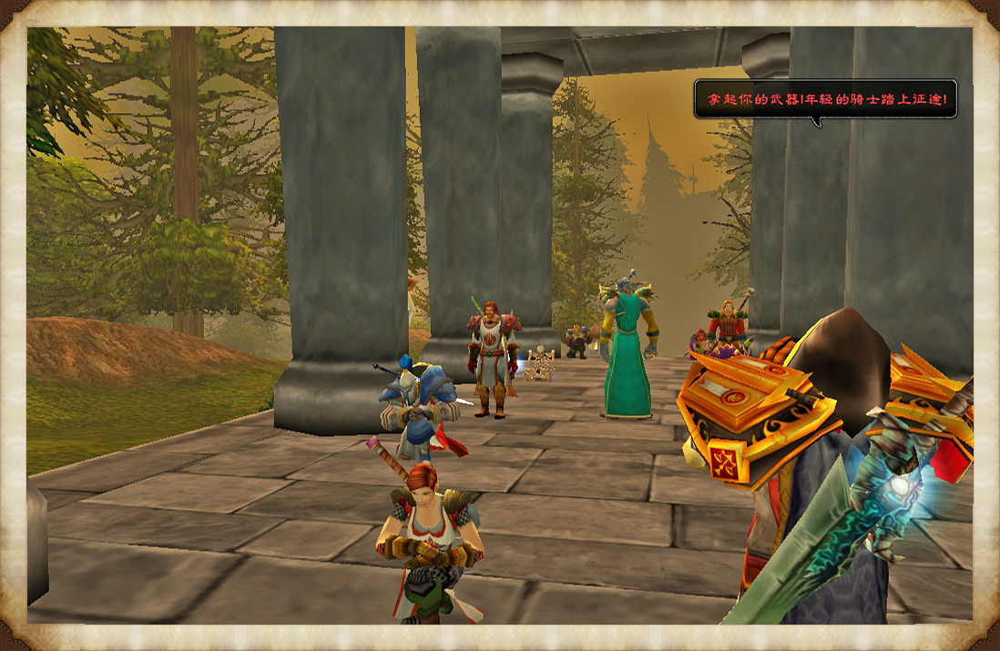
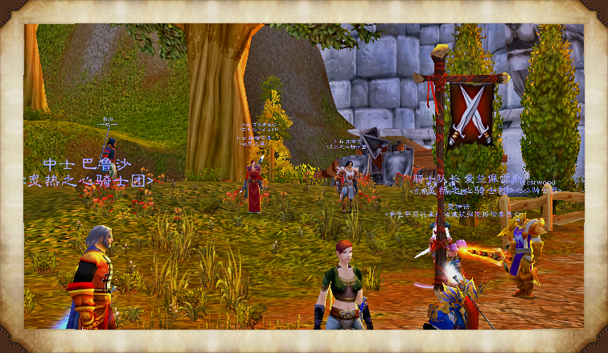
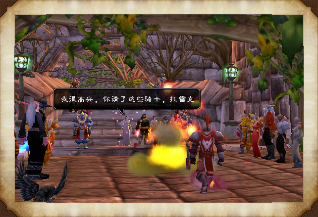
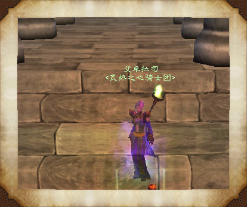
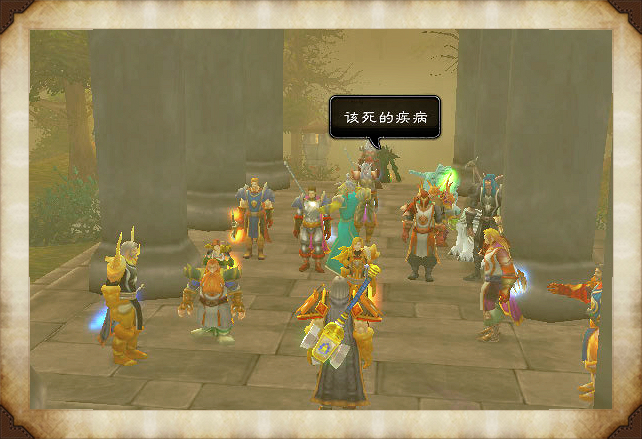
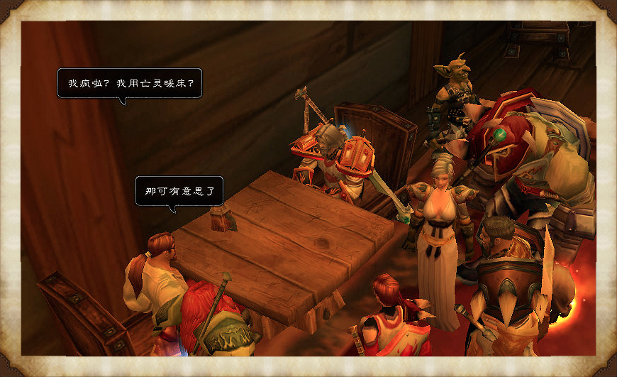
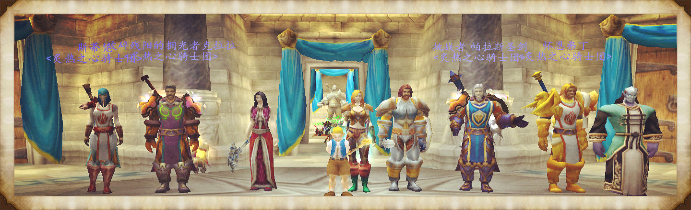

# 炙热之心骑士团法典

## 炙热之心骑士团法典

> “炙热之心骑士团是艾泽拉斯的秩序之源。遭遇恶事就求助于他们。”——酒馆传说

炙热之心骑士团的法典经过至少十次修订，现已十分之厚，如果不是“十分冗长”。法典融合了洛丹伦白银之手骑士团，暴风城的圣光教会，甚至血色十字军的法典。见习骑士在晋升成为光明骑士时，需学习炙热之心骑士团法典。法典涵盖了一个圣骑士生活、战斗的方方面面，事无巨细，以致有人认为正是因为它的教条化……导致了炙热之心骑士团的覆灭。黑暗之门33年，法瑞雅重铸炙热之心骑士团。她在暴风城光明大教堂的地下室中取回了这本法典。

法典并非圣骑士战斗时手持的圣契，上面也没有圣印祷文，它甚至让一些圣骑士感到害怕。一方面他们害怕法典让他们的组织变得官僚而守旧，另一方面法典被骑士评议会用作审判的依据，又是骑士团纪律和圣光威严的象征。任何一个不再信仰圣光、蓄意犯恶或违背誓言与行为守则的炙热之心骑士团骑士，将会失去所有神术。这些行为一旦被查到发生在某个骑士身上，他或她将面对骑士评议会的审判，轻则被剥夺圣骑士神术，从骑士团除名，重则会判其以剑自刎。骑士团虽然名义上允许误入歧途的圣骑士赎罪，但赎罪的条件十分苛刻（被人诟病），在炙热之心骑士团的历史上从来没有骑士能活着通过。

据说炙热之心骑士团法典的目的在于界定什么是正义。正义到底是什么？是简洁有力的惩恶、扶弱？是贵族化的尊重、坚毅与怜悯？还是排除一切道德分歧，最终净化洛丹伦的土地？大多数炙热之心骑士团的圣骑士来自死去的洛丹伦。他们看着黑色的土地感染瘟疫，化为血红色的尘土。因此在他们的法典里，并非每一条律令都关于怜悯，有的甚至沾上了洗不尽的疯狂。然而他们并不是血色十字军……或许正是对正义的疑问让他们内心平和，一如拥光者克拉拉手中的盾牌，平静而坚韧。

如今这本法典被放在炙热之心骑士团的战旗室中，如果你通过试炼成为见习骑士，你会被赠予一本由侏儒影像翻录的法典。冒险间隙中你有时会翻阅它，试着找到圣光的密录，或者解答那恼人的问题——“什么是正义？”然而让你更烦恼的是，它读来如此琐碎，让你毫无头绪……有的书页甚至在战斗中遗失了……

欲加入炙热之心骑士团，请写信给：法瑞雅

> 法典中有一节提到各式正式称谓。

## 炙热之心骑士团位阶

### 大团长

大团长是炙热之心骑士团的首领，拥有开战、停战最终决定权，骑士团位阶最终任命权，同时是骑士评议会的审判者，骑士团墓园的守灵者。如果说一个人成为圣骑士是因为“被感召”，那么成为炙热之心骑士团的大团长则是命运。

相传这是一个被诅咒的职位。

圣骑士们相信圣光，但他们不相信“命运”，也不惧怕“诅咒”，毕竟没有比圣光更净化的能量。沐浴在圣光之中，阴影无所遁形。

然而这个诅咒仍然被记录了下来，骑士们从不在正式场合中提到它，但每一任大团长在宣誓之前，都或多或少地感觉到他们被一双眼睛盯上。这双眼睛据说曾经纠缠过帕拉斯·圣剑，所以这个诅咒也被称为帕拉斯的诅咒。

> 月亮照耀着山谷
>
> 执圣剑者必死于剑下
>
> 愿你的心灵永不安宁

有的骑士认为这个诅咒只是邪恶的许梦魇的一个玩笑，有的认为这实际上是克劳德天行者的残念，还有的人质疑炙热之心骑士团掩盖了每一任大团长都会发疯，或者都死于非命的事实——不过他们忽略了另一个事实，那就是拥光者克拉拉在卸任大团长后，仍坚持圣骑士的理想，至今奋战于前线。

“你们的大团长都在哪，那些为他们立的石像在哪，为他们所作的歌谣，传奇在哪？”

骑士们啊，你们知道英雄不存在于石像之中。正义苍白却在你们心中，或许那些歌谣也在那。

### 圣剑骑士

> 圣剑之名，象征高贵。
>
> ——《炙热之心骑士团旧制》

黑暗之门21-27年。圣剑骑士曾是炙热之心骑士团的唯一领袖。作为骑士团的领袖，圣剑骑士有开战和战略攻击和撤退的最终决定权，以及无可避免的，签订和平条约的最终决定权，亦是骑士评议会的审判者。此时期的圣剑骑士代表整个骑士团，他的一言一行都在塑造骑士团“闪闪发亮”或是“鲁莽好战”的形象。炙热之心骑士团旧制更要求圣剑骑士必须拥有贵族甚至皇族血统。“只有鲜血象征高贵，以圣剑之名。”——洛丹伦的《七圣古卷》中如是说。这份古卷出自艾泽拉斯大陆人类未形成圣光信仰之前。

然而，纯粹以血统定义的高贵与圣光教义不符。如今的骑士团却仍挣扎在如何打破血统论的争论中。

**重铸后的炙热之心骑士团仍有圣剑骑士一职。圣剑骑士是炙热之心骑士团的忏悔者，象征公正之镜，沉默的守护者。**圣剑骑士不再是最终审判者（这个权力现在属于大团长）。圣剑骑士既神秘，又属于炙热之心骑士团的最高文职。地位略高于天威主教。

圣剑骑士行使公正之镜权力时，应绝对公正，如黑镜一般指出骑士团任何阴影之处。圣剑骑士的公正之镜权力尤其针对大团长，他或她必须每天监督大团长的行为，如果大团长有任何不公正之处，圣剑骑士就是那沉默又坚毅的明镜。

如今要成为圣剑骑士，并不需要七大王国的贵族血统，但必须是曾经拥有天威骑士头衔的骑士。虽然骑士团已经废除了对圣剑骑士的血统要求，圣剑骑士必须是骑士团中最有“灵性”的骑士。所有圣光的信徒都能理解“灵魂化”的感受，然而对“圣光灵感”的追求并非毫无副作用。让人吃惊的是，最有“灵性”的骑士往往灵魂上有一定虚弱之处，容易受到精神魔法攻击，或者感染瘟疫脑疾，所以往往不能继续担任征战指挥官。

> “你知道光明的代价吗？”本尼迪塔斯·法奥曾问巴鲁沙。
>
> 儒雅的骑士苦笑，手中的圣光火花优雅地上升，巴鲁沙的笑容舒缓下来，“随和好脾气？”
>
> 法奥主教嘴角上扬，他认识巴鲁沙许多年了。巴鲁沙对圣光术的掌握，优雅得让光明大主教本人都望尘莫及。为此法奥曾暗自庆幸巴鲁沙没有选择走上牧师之路，不然他可能会又多一个政敌。光明的代价是盲目。盲目得纯粹，也因此获得绝对感知的灵性，就像炙热之心骑士团的圣剑骑士。
>
> 但巴鲁沙不是圣剑骑士，这或许是巴鲁沙的智慧之处。他与圣光总保持不远不近的距离，因此圣光馈赠于他。

成为圣剑骑士之前，圣骑士必须通过“神圣干涉”试炼。试炼的内容为对天威主教使用神圣干涉祷文，准圣剑骑士死亡后，天威主教通过救赎祷文尝试召回准圣剑骑士的灵魂……神圣干涉祷文是艾泽拉斯已知最强大的守护祷文，圣骑士牺牲自己，保护队友免受任何伤害，甚至能将队友转移到安全之地。

> “人死不能复生，”炙热之心骑士团的天威主教艾卓拉斯是第一个质疑这项古代仪式的。仪式中的疯狂让她不安，“教条”早已不足以形容这仪式，应该用“嗜血”。
>
> “你相信圣光吗？”帕拉斯质问。
>
> “这是疯狂！这和诅咒教徒何异？况且，我们不是血色十字军……我的领主。”
>
> “不要质疑血色十字军的决心。”
>
> 艾卓拉斯刚要反驳，随即被笼罩在圣光之中。圣光温暖，光辉却第一次让她盲目，她下意识地抬手遮住眼睛。领主倒下时盔甲与大理石地面发出刺耳的碰撞声，艾卓拉斯用法杖敲打神圣干涉的金色结界，但没有力量能破坏神圣干涉的守护，无论从外面还是里头……那一刻，圣骑士的生命就是圣光本身。
>
> 没有人知道帕拉斯经历了什么。

### 天威骑士

> 天威之名，象征威严。
>
> ——《炙热之心骑士团旧制》

天威骑士是骑士评议会的重要组成。同一时期炙热之心骑士团必须有三位天威骑士。天威骑士负责管理骑士团的战斗和训练。他们也是炙热之心骑士团的高阶指挥官，拥有进入骑士团战旗室的钥匙。担任光明骑士的导师则是天威骑士们的日常事务。

与圣剑骑士注重灵性不同，天威骑士更注重实战——而且他们往往经验丰富。作为骑士团最经验丰富的指挥官们，天威骑士们遇到的挑战往往是忠诚。是的，威严的天威骑士们太了解骑士团了，也太具备指挥官应有的能力。他们对于联盟各国，各跨联盟组织，甚至各贵族的私人武装而言，都是争取的对象。

是的，他们从不缺委托。

所以炙热之心骑士团的天威骑士们在摘下天威骑士徽章后，有的离开了骑士团，成为联盟军队中的指挥官。

> 天威骑士，骑士团最后的盾牌，拥光者克拉拉站在甲板上，极北之地的寒风拂过他的褐发。炙热之心骑士团远征诺森德的蒸汽船即将靠岸。
>
> 克拉拉若无其事地开始戴手套。他的手套总是右手带有板甲护片，左手则是亚麻质地。他的左手是用来握盾的，毫不起眼的亚麻手套能让他握得稳。他在船长室的衣箱里，除了这样的手套，还有纹章不同的战袍。
>
> 没有人怀疑克拉拉的忠诚，因为他只忠于圣光和他的塔盾。

欲成为天威骑士，准天威骑士必须获得大团长以及天威主教的支持。他或她必须已指挥过至少一场战役，有战功，已作为导师指导一名见习骑士晋升成为光明骑士。由于天威骑士已经通过光明骑士的试炼，他们无需再通过试炼证明自己的圣骑士信仰，但他们必须证明自己的战役或战场指挥能力。

炙热之心骑士团重铸前的前天威骑士包括：拥光者克拉拉、巴鲁沙、塞拉夫夜愿、斯蒂凡、法瑞、大胡子彼得等。

### 天威主教

天威主教是炙热之心骑士团的大主教，简称主教，在骑士团中的地位仅次于圣剑骑士，与三位天威骑士同级。圣剑骑士虽然是骑士团中名义上的第一文职，但是由于其灵性的不稳定，有时不能担当长官骑士团内务管理的职能。此时这个重担就落到主教身上了。

在所有内务之中，恐怕没有比财务更重要了。

按照骑士团的制度，炙热之心骑士团的财富由天威主教管理和经营。暴风城的圣光教会不止一次深陷财务丑闻之中，传闻暴风城的大主教本尼迪塔斯·法奥本人私下享有的奢华生活……不但有损教会之名，更引起过托雷克男爵的嫉妒。因此与玫瑰女士艾琳·瓦伦丝婚后，托雷克男爵曾使用过暗金玫瑰的网络私自调查过圣光教会的各种收入来源。

其中最令托雷克羡慕的，恐怕是教会的“逝者募捐”了。“逝者募捐”的条约是你愿意在死后将遗产留给圣光教会——这当然不会确保你的灵魂到达圣光秘境，或者远离冥狱深渊，但你的名字会被刻在教堂地下室的石砖上，直到永远。

天灾之战开始后，签约者大量死去……光明大教堂甚至没有支付去刻这些名字的石匠工会工资。

你会说这是圣光教会的行径，与炙热之心骑士团何干？目前没有人知道炙热之心骑士团拥有多少财富，也没有人完全掌握骑士团的收入来源。几任大主教认为一旦骑士团的财富被知晓，定会引起暴风城圣光教会的嫉妒。但是他们所打造的让不同骑士行走于艾泽拉斯各处的银行网络，或许已经引起……另一个更为难缠的圣光组织——白银之手骑士团的注意。

天威主教另一项重要事务是组织骑士团的告解——你有需要忏悔的事吗？

> 告解秘密，绝不外泄。

如果主教违反这条律令，即使因为告解者罪大恶极，而主教违反律令是为了去阻止恶行发生——主教也会因此被逐出骑士团。当然，主教可以在得知恶行将要发生后，通过不泄露告解秘密的方式，来阻止恶行发生。圣光的智慧就在于此。

“我有要忏悔的事，”大胡子彼得坐在石椅上，对主教艾卓拉斯说。他是今天唯一要忏悔的骑士，但他脸上没有有罪之人的神色。

> 艾卓拉斯试着保持严肃，但她耸了耸肩。
>
> “我从来不想参军，我只想活着，”彼得说道，他的盔甲早已擦得光亮，他那西部荒野口音并不显得粗鄙，“我……我只是想有召一日穿着漂亮的盔甲吸引女孩们的目光。”
>
> 彼得是骑士团里经验丰富的老兵了，说的话却像一个刚入伍的小伙。艾卓拉斯不禁笑出声，或许因为，这些年彼得一直没变吧。
>
> “当然，不是在我的葬礼上穿它，”彼得的肩膀耷拉下来，他终于有点“有罪”的模样了。
>
> 然而这是我们所有人的命运，艾卓拉斯心想，死在自己的盔甲里。“不，你需要在你的婚礼上穿它，”她接过这个玩笑。

### 光明骑士

> 光明之名，象征信仰。
>
> ——《炙热之心骑士团旧制》

光明骑士是炙热之心骑士团的骨干力量。只有表现优秀的见习骑士才能被光明骑士接纳，并最终成为其中的一员——他或她必须展现良好的德行，并严格遵守规章和信条。他或她必须在证人的监督下完成以下任务：

> 路程不低于500英里，时间不低于30天的旅行
>
> 弥补一项过失
>
> 一次有关智慧的试炼
>
> 一次与邪恶的公平对决
>
> 一项能体现出正义的举动

他或她认为时机恰当时，可以在骑士评议会上讲述自己的事迹，若得到出席者中最高阶的骑士认可，则可以成功进阶光明骑士。

光明骑士的进阶有时不一定会遵循以上试炼，尤其在战时，为了弥补人数空缺……炙热之心骑士团的指挥官们有时会临时册封大量光明骑士。这类举动既被人诟病，又被认为是必须的——如果被临时册封的光明骑士能在战役中活下来的话，或许他具备了成为光明骑士的基本素质……“活下来，成为长者”这是许多骑士梦寐以求，却不敢奢望的。

> 西部荒野的大地在灾变中开裂，龙卷风从地隙中升起，收割傀儡与憎恨它们的农场一道毁灭。
>
> “达妮斯，”塞斯克站不稳，但他扶起摔倒的达妮斯，看着她的眼睛说，“你，达妮斯追逐者，是否宣誓接受炙热之心骑士团的荣誉与规章？”
>
> 达妮斯呆住了，她惊讶，因为她已经无数次听别人对其他骑士重复这句话……她知道这意味着什么。但她的四肢都在发抖，眼前的灾变，和当年毁灭她的家的灾难如出一辙，大地的裂变——无情的浩劫。但如果你问她是否感到恐惧。不，她四肢发抖，但她一点也不害怕。
>
> “我们没有时间了，我们必须帮那些走不动的人撤离，”塞斯克不知道达妮斯为何犹豫，但在他们差点被飞沙走石砸中时，达妮斯随手就用盾牌将它们挡开。
>
> “我愿意，”她说，她一点也不害怕。

成为光明骑士后，圣骑士就加入了骑士团。炙热之心骑士团的光明骑士们献身于斩除邪恶，匡扶正义，维持律法……维护圣光的道义。无论人们认为这是“过于迂腐”还是值得敬畏，光明骑士是终身之职。一个圣骑士可以效忠于艾泽拉斯上不同的组织，有的组织甚至能让他或者她成为高贵的玫瑰骑士——但如果他是炙热之心骑士团的光明骑士，退休几乎只能是一个念头。

不难观察，许多炙热之心骑士团的老骑士们都没有家庭。成为一个光明骑士，为圣光献出一生，然后终有一天能卸下盔甲，到镶金玫瑰打（昆特）牌，或者到冬泉谷每天泡温泉，在灰白丘陵搭个小木屋……不，炙热之心骑士团梦想、甚至妄想恢复洛丹伦的荣耀——或许等到洛丹米尔湖的落日不再忧伤，斯坦索姆的逝者安息，艾泽拉斯不再有征战，会有一个老骑士与你坐在城墙下，笑谈往事。

### 紫罗兰法师

炙热之心骑士团的战斗法师组织由爱兰佩雷斯创建。许多圣骑士对奥术一窍不通，许多法师，则对如何用法杖砸碎术士的鼻子一无所知。因此，炙热之心骑士团编制中的法师都必须接受战地训练，绝不只是象牙塔里的学究派。他或她必须经过格斗训练，能与骑士团一同行军作战，当然在信仰上……不允许学习、使用任何阴影法术。

如果你是一名见习法师，加入骑士团的理由很简单，你要学会如何握一把剑然后不割到自己，这或许是你在面对一名比你强大的施法者时的活命机会——在他能念出咒语前给他一剑。

令人吃惊的是，骑士团里通常由法师而不是骑士组织比武竞技。

> 光铸利刃又一次架到爱兰佩雷斯的脖子前，“该死！”金发的法师不禁咒骂。他无论是借着冰流的滑动，还是奥术闪烁，还是快不过这光头骑士的剑。想不到光头那么灵活……爱兰心想。他正和塞拉夫·夜愿一起准备明天的比武竞技。而他——打败了许多人从未失手的少校，绝对不能在人前输给任何一个骑士。
>
> “这……是个秘密，”塞拉夫收剑入鞘，他的动作几乎像精灵一样优雅，灵敏，就连他的圣光术，也有时绽放出不一样的纹路……但无论如何，塞拉夫并不想提及这些，他说，“你太急了，爱兰。”
>
> “所以，你认为我应该更慢些？”
>
> “你为了赶在我前面，闪烁法术甚至读少了两个音节。耐心即是快。”
>
> “该死，”爱兰快翻白眼了，他有时真受不了这些铁皮罐头骑士们的说教，但他欣赏塞拉夫的细心。
>
> “哈哈，”光头骑士笑起来胡子都裂开，“我们继续。”

### 见习骑士

这是炙热之心骑士团的预备役。你要读圣光祷文……一万遍……一万遍（你怀疑这页到底是不是原文）。

> 法典中有不只一页记载了宫廷礼仪。

## 宫廷礼仪

记住，你成为一名圣骑士并不是为了去喝贵妇人的洗脚水的。宫廷礼仪是法典里唯一几乎被所有人遗忘的一节。无论如何，一个骑士应该彬彬有礼，如果他或者她被邀请到正式场合。炙热之心骑士团在战争中去除血统论后，有许多骑士出身平民，而且习惯军旅生活。因此视宫廷礼仪为无聊的繁文缛节。所以法典里的这一节，估计是由某个浪漫派的骑士撰写，梦想有一天战争结束时，骑士们或许能再参加一次有二十道菜的宴会。

无论久别重逢，还是素未谋面，一个标准的军礼足矣。

### 见面礼

男子左手扶右胸，右手脱帽，身体微微前躬同时点头。女子双腿略微屈膝，手提裙摆两侧，点头致意。

骑士即使遇见贵族，也无需下马或者脱去盔甲行礼，只点头即可。行礼时武器尖头指向地面。

### 吻手礼

晋见国王、女王或者王后时单膝跪下，低头吻其手背表示崇敬。暴风王国国王并不要求这种礼仪。

### 晚宴礼仪

主人先入坐，而且主人必须喝第一杯酒。除非拥有圣骑士头衔，主人或者客人都不允许身穿铠甲入坐。如果你一定要做一个彬彬有礼的骑士，应至少脱去铁手套。

黑暗之门27年托雷克男爵和艾琳瓦伦斯于激流堡举行婚礼。富裕的男爵邀请了炙热之心骑士团的所有骑士——去护送新娘和新郎进入激流堡，当然他为了华丽的场面里要有闪闪发亮的盔甲——并不在乎骑士们对贵族礼仪不太上心。

> 法典里有75页记载了如何正确地给马上鞍。
>
> 法典反对阻挠另一位骑士完成他或她的职责，无论你比这位骑士高阶与否。
>
> 法典认为应该以学识最高的骑士为领袖，无论位阶，除非高阶的骑士智慧过人。
>
> 根据法典记载，和平以伸正义，非血刃所能。

## 公平的战斗

战斗从不公平。骑士们对公平的战斗的追求，是否会酿成迂腐的惨剧？比如说，在本已劣势的战斗中死战不退，导致所有参战骑士死亡，只是为了“战斗至最后一刻”的荣誉？所幸这种愚蠢在炙热之心骑士团的历史上从未发生，并不是因为骑士们熟稔正义撤退祷文，而是骑士团并不以无谓的伤亡为荣。

那么如果为了正义的目的，是否可以进行不公平的战斗，以获取最终胜利？有人或许会说，正义本来就充满争议，而且经常被用作残忍杀戮的借口——如果无法确定正义的准则，如何回答这个问题？在骑士团古老的法典之中，即使为了正义的目的，不公平的战斗也是不允许的。或许古老的法典信任骑士们的智慧，相信他们即使严守规章，仍能取胜。

对于能否出于正义的目的进行不公平的战斗，炙热之心骑士团现有法典规定，如果一名骑士选择这么做，并以此获得胜利，那么他或她必须接受审判。骑士评议会将根据具体情况判断每一个案件。

### 不得在战斗中逃跑

骑士不得在战斗中逃跑，除非指挥官下达撤退的命令。指挥官如果已经下达撤退命令，而骑士不撤退，属于抗命，并有可能因为这种抗命行为危害其它骑士的生命。这种情况下，严重的抗命行为是死罪。在战斗中逃跑的骑士会被开除出骑士团，剥夺圣骑士称号和神术。正义撤退祷文是不允许的。

更为严重的情况，则是逃兵。逃兵会被判处以剑自刎。

> 当然，要分清逃跑和撤退的区别。无谓的牺牲是愚蠢的，骑士不是蛮夫，我们在勇敢和热情的同时，也要考虑战术。为了最后能达成愿景，暂时的退避是可以被接受的。但是，撤退必须是上级的命令，或者同伴的共识，对于丢下同伴独自逃跑的骑士，骑士团绝对会对其进行处罚！ ——《炙热之心骑士团旧战斗守则》

### 不得与敌人串通

即使在军事演习中，骑士团成员也不能和敌人串通。通敌的行为属于背叛骑士誓言。骑士团绝不容忍背叛。

### 不得进行不公平的决斗

即使在与部落的战斗中，骑士团成员也不可以进行不公平的决斗。不公平的决斗包括但不限于攻击手无寸铁的敌人。这种战斗在骑士团中普遍被认为毫无荣誉可言。然而一个骑士必须明白，对于敌人，即使其手无寸铁，也不应掉以轻心。应该以适合的方式将其制服，并使其处于监管之下，不能使其有机会对其他骑士造成伤害。

### 不得杀死无攻击意愿或能力的平民

杀死部落平民是一种没有荣誉感的行为，不符合炙热之心骑士团的信条。杀死平民以获得战利品，或者战胜敌手的感觉，是一种懦弱的行为。有这种行为的骑士，会被认为是背离了善良准则——成为“堕落者”。堕落是一个圣骑士最为恐惧的。

圣光对堕落者没有怜悯，而堕落者由于曾经为圣光而战，堕落后会落入阴影使徒手中。阴影信徒通常会抓住这个机会，惩罚原本的圣光战士。堕落的圣骑士遭受的命运远不止被人唾弃……有的圣骑士甚至会同情堕落者，为他们提供庇护，或者杀死他们，以保护他们免受折磨。

### 不得使用暗影魔法

使用阴影魔法被视为堕落者的行径。炙热之心骑士团不允许修士或法师学习任何阴影法术。

在炙热之心骑士团的历史中，主教艾卓拉斯的堕落最不为人知。艾卓拉斯并非因为杀死平民堕入阴影，而是出于……对力量的渴望。艾卓拉斯并未因此被逐出骑士团，与此相反，有数位骑士掩盖了她曾经堕落的事实。他们用尽一切神术洗去艾卓拉斯身上的阴影。

> “希望你还认识我，”艾卓拉斯忧伤地说，乌瑟尔之墓的大理石阶只让她觉得冷。
>
> 法瑞被话语中的哀伤吓怕，她认识艾卓拉斯，当然认识。她的银发，她的微笑，她的圣光术就像一支舞蹈。“当然，”法瑞说。
>
> “这个样子呢？”
>
> 艾卓拉斯的指尖泛黑，黑暗很快吞咽了她的双手，墨染她的长袍，黑浪翻转，直到她灰色的双眼变为死黑。
>
> “暗影之力，”法瑞低声说。她没有拔剑。这是艾卓，骑士知道，无论如何。
>
> “哈哈哈哈我居然会屈从这种力量，我永远回不了大教堂了也许。也许我有一天会变成那些肮脏的被遗忘者，我感到很沮丧，”艾卓拉斯无助地跪下，像是在乞求法瑞什么，“痛苦……”
>
> 法瑞随手邀来一道圣光落在艾卓身上，她别过头去，毫不犹豫地说，“现在还没多少人知道。”

### 不得私吞或占有自己不应得的战利品

如果一个骑士穷得连自己的盔甲都无法配备，那么他或她还是一个骑士吗？一整套结实并打磨光亮的板甲——够一户西部荒野的人家半年生活了。如果盔甲上有魔化晶石等魔法附着，有秘银做的内衬链衫，加上皇血草墨汁抄写的圣契……就像一个移动的钱袋了。艾泽拉斯上有的劫匪甚至会埋伏杀死盔甲昂贵的圣骑士，以抢走圣骑士的盔甲。

由此可见，在地下城探索中寻得的一些古代魔法盔甲，对骑士有大诱惑力。然而除了在扔骰子决定盔甲分配时向圣光祈祷，骑士守则不允许别的了。

### 不得主动攻击低阶且未有挑衅举动的部落成员

这条规则不包括被遗忘者。炙热之心骑士团将自己视为洛丹伦遗民组织。不要向骑士团的骑士们提起亡者对洛丹伦做的事……

### 除非有任务在身，不得主动攻击斯坦索姆城以外的血色十字军成员

没有人知道炙热之心骑士团内有多少前血色十字军成员。对此，白银之手骑士团曾经派出过信使，想要就此事进行交涉，但被帕拉斯·圣剑拒绝了。黑暗之门27年后血色十字军被视为邪恶的堕落者，圣光的背弃者，被联盟——尤其是白银之手骑士团仇视。此时炙热之心骑士团的大团长帕拉斯·圣剑为了与血色十字军“划清界限”，曾下令更改骑士团的纹章。

炙热之心骑士团的纹章原本是白色罩袍上的血红火焰。没有人知道这其实是血色十字军的早期纹章，在血色十字军尚未采用血色枫叶作为徽记时，他们已经使用过鲜红的火焰。除了血色十字军的几个高阶军官，已经没有人记得这件事。亦或是，记得的人都死了。

血色十字军覆灭时期，炙热之心骑士团成员被要求使用一件蓝色的战袍，以免与血色有任何牵连。所有支持血色十字军的指挥官也被罢免。法瑞的西瘟疫之地指挥官一职被撤除，由雷蒙德黑剑接替。为了防止她以任何方式联系，甚至叛逃回血色十字军，她被软禁在镶金玫瑰。

“许多人因此走错了路，抛弃掉了自己心中的感情，这样就会成为两种人，一是为了力量不择手段的死亡骑士，一是为了正义屠戮无辜的血色十字军。”雷蒙德黑剑写信给法瑞，安慰她，警告她。但他不知道——帕拉斯·圣剑曾经是血色高阶指挥官，而法瑞，曾是臭名昭著的十字军审讯者詹姆·韦沙斯的副手。

骑士团里的其他旧血色十字军成员：黄金狮子奥菲、尤瑞沃、斯达潘……这份名单当然已被烧毁。他们都是洛丹伦遗民——炙热之心骑士团，却站在一旁，眼看血色十字军尽数战死。或许骑士团本身就沾满鲜血，或许他们只是为了保护自己，或许他们发誓与血色分道扬镳。但即便在今天，走进骑士团的战旗室，火焰之心的纹章下仍刻着“为了失落的洛丹伦的荣耀”。

> 帕拉斯疑惑的回过头去，吃惊的看见了令他终生难忘的一幕。就在士兵们愤怒的喧嚣声中，主教面前忽然出现了一道金色的光芒—–
>
> 那是圣光。骑士们吃惊的看见圣光凝聚成一个形状，一个他们一辈子都不会忘记的形状。
>
> 那是洛丹伦之印的形状。金色的洛丹伦之印悬在半空，散发出无尽的光明和温暖……骑士们纷纷惊叹着向圣光祈祷。
>
> 真是圣光的奇迹。
>
> 阿斯卡维亚。韦斯温挣扎着想要起来，他发出悲惨的嘶吼声，试图抓住那个洛丹伦之印。那是他为之奋斗和努力的东西……圣光和洛丹伦。
>
> ——《血色之路》
>
> 法典中记载，骑士之间不允蓄意侮辱。

## 善待其它冒险者

艾泽拉斯的争端从未停息。在古语中，守护者联盟创立了“原住民”和“外域人”的区别，这一说法也被后来的提尔之光十字军所延续。然而就如同炙热之心骑士团曾用过的洛丹伦古制，这些古代记录里的血统之争，有时会让冒险者们不适。在目前的争端中，“外域人”被视为歧视用语。骑士团并不想争论这类用词。

根据洛丹伦《星云传说之卷》，冒险者可以各势力获得星云降落徽记，甚至能以此徽记召唤星云使者。拥有星云降落徽记者到达一个世界，是为了让这个世界活过来。我们的世界被称为艾泽拉斯——金色平原之幕。在此的所有冒险者都被询问过是否接受星云降落徽记（或许这就是现已成半禁语的“原住民”）。有的历史学家认为，这种徽记实际上只存在于金色平原之幕中。

获得徽记的人约定必须遵守徽记上的守则——即完全活在艾泽拉斯之中，甚至忘记任何关于其它世界的记忆。

又有传说那拥有星云降落徽记的人最终都会疯掉，甚至仇恨艾泽拉斯。

如果这些传说可信，那么炙热之心骑士团中的拥光者克拉拉是其中一位拥有其它世界记忆的骑士。他曾效忠海姆。

> 克拉娜翻下床走到窗边，皎洁月光透过玻璃映照出克拉娜健美的女性身姿。她转过头环视房间最后将目光定格在盔甲架上，那套盔甲记录着她的冒险旅程。她走到盔甲边拿起头盔慢慢抚摸着上面徽记，徽记是描绘的是一只镶有眼睛的手臂，代表着她原来信仰——海姆的圣骑士。——《拥光者克拉拉的变化》

“圣光的异端！”梅林白银盾——炙热之心骑士团的传奇圣光燃烧者——肯定会这么说。但骑士团既尊重天威骑士拥光者克拉拉的信仰，又为梅林而战。圣光的宽容就在此。

尽管如此，骑士团仍规定，骑士不可介入艾泽拉斯生活是否“严禁”或者“泛”的讨论之中，也不允许与其它冒险者恶意争执。如果其他冒险者蓄意对骑士团成员进行而已攻击，骑士团有可能会将这些冒险者视为敌人。骑士团的成员生活在艾泽拉斯里，这点毋庸置疑，也是金色平原之幕里历史悠久的一员，尊重艾泽拉斯上的生灵（不包括被遗忘者）的生活方式，为骑士守则之一。

炙热之心骑士团是一个古老而荣耀的兄弟会。申请入团者除了必须遵守誓言和规章，更应思想骑士生活是否适合自己。成为一个骑士在人的一言一行中，在许多人眼里，这一言一行都透着迂腐守旧的气息，闷不可言。但对于许多骑士而言，这是他们唯一理解的生活方式。

> 法典禁止违抗上级命令，骑士应以言行支持高阶骑士。

## 听从指挥

在外冒险，和有着共同目标的冒险者组成冒险团是完成很多任务的必须途径，在这些团队里面，各位骑士可能是领导者，可能是被领导者。作为领导者，我希望，各位能够把队友的利益放在首位，把团队的目标放在首位，带领信任你的队友取得胜利。如果是被领导者，那我希望各位能够听从队长/团长的指挥，如果有意见可以私下交流，但是不要破坏团队和谐，更不要引发争吵，既然加入了团队，就绝对信任你的队长/团长。

对于原住民联合的冒险团，我们的态度是不强迫，不干涉，除了纳克萨玛斯的天灾是骑士团的目标敌人，其他比如拉格纳罗斯，耐法利安，克苏恩，都是威胁世界的邪恶力量。所以各位骑士要参与讨伐他们的战斗，骑士团没有意见，况且获得的战利品或许对我们打击天灾的战斗有帮助。但是我们需要强调的是，如果你不喜欢这个团队，或者你不愿意去进攻某次的目标敌人，那就不要参加；

但是如果参加了，就请拿出一个骑士最好的状态和最大的诚意去配合你的队友，既然进入了团队，就要严守纪律，服从命令，像一个骑士那样的战斗！对每一个战友的生命负责！如果一直在联合战斗中消极懈怠，骑士团会将其等同于对于骑士团命令的违背和对于骑士精神的亵渎，根据冒险团团长的评价，高阶评议会将会将这些表现记录下来作为档案，甚至勒令其不得继续参加联合团队，我想没有一个骑士愿意在自己光荣的生涯里留下污点吧。

——《炙热之心骑士团旧战斗守则》

> 法典上摘录：骑士应当行走于阳光之下，自信地抬起头。

## 职业

### 战士

如同白银之手，战士是骑士团最重要的组成部分之一，很多勇敢的战士们献身于这正义的事业，追求光明与希望，在圣光精神的指引下百折不挠。炙热之心骑士团的第一任大团长塞斯克本人就是一名战士。

> 由于帕拉斯突然宣布独立，导致新生的骑士团与势力强大的守护者之间关系非常紧张，基层成员冲突不断。为了不在联盟的内耗中消耗实力，守护者的领导人，包括罗兰、玫尔、莉亚拉、克劳德等秘密与骑士团的高层开始接触，以期化解双方的矛盾。
>
> 后经罗兰提议，由于帕拉斯的身份敏感，由塞斯克暂时代为行使圣剑骑士的职务。数月后，在某次守护者联盟在黑翼之巢的战斗陷入困境之时，莉亚拉悄悄地向骑士团求援，帕拉斯带领一批骑士团的精英前去助战，化解了危机，双方才开始逐渐相互接受。但是部分的守护者成员仍然对帕拉斯过去的背叛耿耿于怀，不过已经不是主流。
>
> ——《塞斯克回忆骑士团的创立》

### 牧师

在骑士团中，牧师担负着很重要的任务，他们是圣光精神的倡导者，与骑士精神的传播和鼓舞者。在骑士团的组织中，主教必须由牧师担任。另外在称谓上。“光明骑士”位阶的牧师被称呼为“光明修士”。骑士团中只接受人类和矮人牧师。暗夜精灵牧师由于信仰月神，不能加入骑士团。

骑士团的牧师不允许学习和使用暗影法术。牧师一旦使用暗影法术会被逐出骑士团。

对于一个年轻的牧师是否能加入骑士团，测试其对圣光的虔诚。骑士团的主教和修士负责组织告解和圣光知识讲会。

> “我将永远感谢您，我的父亲。是您赐予了我生命，又在最危险的时刻用生命拯救了我。”每次作完例行的祷告后，斯维特拉娜都会再加上上面那一小段祷词。如果没有这位伟大的父亲，现在的她也许只是个在铁炉堡的探险者大厅里翻阅资料的学者。
>
> 通过书本来想象战争的残酷，眼看着人民生活在疾苦之中却无能为力。是他促使斯维特拉娜走上了追寻圣光的道路，现在无论面对何种困难，她都不会忘记父亲对她的教诲：“当人们受到伤害时，我就在你们的身后；当人们内心痛苦时，我就在你们的身后；当人们感到恐慌时，我就在你们的身后；当人们失去信仰时，我就在你们的身后。手握圣光的牧师行走在艾泽拉斯世界上，为人们带来平和与希望（最后一句被划掉）”

### 法师

在肯瑞托议会的鼎盛时代，就有很多法师加入了白银之手与勇者们一起战斗。在骑士团中，法师同样拥有自己的地位，他们只是看作从事不同工作的骑士，与其他人不同的是，由于他们所从事工作的特殊性，他们可以拥有自己的研究室，来作为研究法术的场所，在骑士团中，他们受到与战士同等的尊重。

骑士团中的法师都必须学习基本格斗技能，以及适应行军生活。他们有时被称为战斗法师。

### 潜行者

这个职业在骑士团中并不存在，因为他的职业特性决定了他无法实践骑士精神，同样，也很少有这种类型的人，对骑士团感兴趣。然而，还是有不少盗贼作为秘密成员，存在于其他各地，为骑士团提供着情报。骑士团到底和暴风王国军情七处有何联系，这恐怕也是一个迷。

与白银之手骑士团不同，军情七处并没有调查炙热之心骑士团的血色背景的意愿。有人认为这是因为骑士团中有军情七处想保护的线人，更有阴谋论认为，骑士团已经被军情七处渗透。马迪亚斯·肖尔本人对此无可奉告。

### 术士

在目前为止，骑士团内部不存在这个职业，即使一个术士宣称自己信仰圣光，然而抽取灵魂碎片的行为，是无论如何无法和圣光联系在一起的。大部分骑士团成员对术士是冷淡态度，但也有极少数术士得到了尊敬，但这并不意味着他们可以加入。

### 圣骑士

骑士团最重要的组成部分。他们大部分来自于已毁灭的洛丹伦，也有部分南方暴风城人士加入，然而，也并非所有的圣骑士都适合这个骑士团。炙热之心骑士团曾经不允许埃索达的圣骑士加入。法瑞在于黑暗之门33年重铸骑士团时，在埃索达的圣光之心中救出德莱尼圣骑士伊琳娜嘉尔。

伊琳娜嘉尔成为了骑士团中第一位，或许是唯一一位德莱尼圣骑士。

### 德鲁伊

骑士团中不存在德鲁伊。

### 萨满祭司

骑士团中不存在萨满祭司。

### 武僧

骑士团中不存在武僧。除非他信仰圣光。

> 法典规定对敌人知己知彼，绝不姑息。

## 与各势力关系

暴风城：崇敬

塞拉摩：尊敬

铁炉堡：崇敬

暗夜精灵：尊敬

堕夜精灵：友善

高等精灵：冷淡

侏儒：尊敬

蛮锤：尊敬

银色黎明：冷淡

德莱尼人：中立

地精：冷淡

赞达拉巨魔：冷淡

海达希亚水元素：中立

塞纳利奥议会：中立

瑟银兄弟会：冷淡

木喉熊怪：尊敬

巨龙：中立

暗月马戏团：中立

兽人：仇恨

巨魔：仇恨

牛头人：冷淡

被遗忘者：仇恨

血精灵：仇恨

血色十字军：中立

半人马：中立

血帆海盗：敌对

黑龙：仇恨

## 圣光燃烧者

“我们不是血色十字军，”天威骑士巴鲁沙如是说。他说得对，炙热之心骑士团本质上不狂热。“不能合适地控制自己的情绪，不知道什么时候该做什么，是无法成为一名优秀的骑士的。”

骑士团的事业里涉及太多正义边界之事，如果我们不懂节制与谦卑，必会陷入疯狂。法典规定，只允许对恶魔通灵者和古神崇拜者使用火刑。对于亡灵，可以使用圣光攻击，尽管对于亡灵而言，圣光就像灼烧。但骑士团不允许对亡灵进行过度审讯。

骑士团中曾有两位著名的骑士被称为圣光燃烧者——梅林白银盾和雷蒙德黑剑。主教艾卓拉斯战死在西瘟疫之地后，骑士团为她举行了葬礼。葬礼当天，一位血精灵骑士——后来我们得知他的名叫索拉黎明之刃——他出现在现场，站立着，沉默地表示忧伤。

梅林白银盾攻击了血精灵。

仅仅因为对方是一名血精灵。

骑士评议会判决梅林违反誓言，降级为侍从，背负“负罪者”的名。

> “放开我，”梅林白银盾喊道，“放开我！”审判庭上的几位骑士已将他按跪在地，他仍挣扎，要扑向古格·火须。古格是一个矮人，他开了一间叫海龟宝石的酒馆，来往的冒险者多了，他也见多识广。矮人不喜欢暴躁的骑士，就像他不喜欢酒馆里惹事的醉鬼。
>
> 古格今日为何出现在审判现场——也是一个迷，潜行者的多年训练，让他感知到周围还有一个人，潜伏在黑暗中观察着这场审判。不可否认的是，是酒馆里近期的风声让矮人来到这。
>
> 梅林冷静下来。他的一身老骨头毕竟无法挣脱，尤其是他的肩胛骨，像要散落了一样。老骑士知道葬礼上的血骑士是一个军官，这是血精灵的傲慢，不是哀悼。
>
> ——《梅林的审判》

血精灵拂晓神剑索拉当天并非无故出现在葬礼现场。索拉早已得知血骑士团对炙热之心骑士团的攻击预谋……他们的目标是圣剑骑士。帕拉斯·圣剑一行后来被骗至布瑞尔，遭遇伏击时，“负罪者”梅林也因此无法赶到。帕拉斯被砍下头颅。

骑士团为这次判决付出了惨重代价。生存还是死亡，这是一个问题。用烈火净化那些不洁者，那些异端，那些与我们相异者——梅林白银盾建议骑士团这么做。他从来不向非人类行礼，也对圣光的正义毫不怀疑，他是一个圣光燃烧者。

然而为了战胜异者，必须了解异者。当你对一个人足够了解，你就会爱上她。

> 为了调查圣剑骑士的死亡，并取回其头颅，法瑞和塞斯克深入提瑞斯法林地。他们被同一位血骑士远远地跟上。血精灵越离越近，隔着瘟疫晨雾，他就像一个幽灵。这位名叫索拉的精灵背上有一把长长的符文剑，上面蚀刻着象征破晓曙光的印记。他的名是晨光炎日，他嘴角的冷笑是精灵独有的高傲。\
> “Shindu fallah. Shorel’aran!”精灵说，他没有拔剑。他右手拇指握向食指，无声地警告两位骑士。
>
> “我们被包围了，”法瑞轻声对塞斯克说，她的左手下意识地握上剑柄。
>
> 血骑士利骑行在前，不给她靠近的机会，但示意俩骑士跟上。他护送他们离开部落的领地，几天前，也是他嘲笑他们领主的死。
>
> ——《帕拉斯的救赎》

年轻的骑士们，愿你们的双眸明晰，愿你们心存怜悯。

> 法典明令战时不允许哀悼，不允许荣誉比试。
>
> 法典规定见习骑士晋升光明骑士前夜，应独处静思、祈祷从日落到日出。

## 光明骑士晋升仪式

骑士团对晋升仪式的规定并不划一，这是为了让每一个骑士都有独一无二的晋升仪式，让他们永远记住那一天。在炙热之心骑士团旧制中，晋升仪式由圣剑骑士主持。如今仪式由高阶骑士主持。仪式中包括各种你能想象到的骑士仪式，涂圣油，喊口号，圣光光耀……

为纪念白银之手骑士团，光明骑士的晋升仪式通常在乌瑟尔之墓举行。如果战况不允许，有时也会在大教堂中举行晋升仪式。

瘟疫之地“该死的疾病”与光辉闪耀的大教堂完全不同。这是一个提醒，一个警告，一个未尽的梦境。

每一场晋升仪式都是独一无二的，以下仪式仅供仪式主礼者参考。

### 光明骑士晋升仪式应邀请者

战斗牧师——不少战斗牧师来自暴风王国的北郡。炙热之心骑士团的圣骑士们。光明骑士本人所在国的贵族——当然他们不一定愿意忍受舟马劳顿。光明骑士的导师。骑士评议会。以及对光明骑士重要的人。

### 圣诗仪式

“在圣光的感召下，我们齐聚在此，

让神圣力量在我们的兄弟身上流淌。

在光之辉的照耀下，他将获得新生。

在光之力量的支持下，他将指引他的人民。

在光之勇气的武装下，他将与阴影战斗。

以及，在光之智慧的召唤下，他将领导他的同胞们去分享天堂中永恒的荣耀。”

### 修士祝圣

“北郡的牧师们，如果你们认为这个人值得尊敬，请施与你们的祝福，”仪式主持者说。然后修士们上前为光明骑士戴上受过祝福的披风，涂抹圣油。

“在圣光的恩赐下，愿你的同胞们免受伤痛之苦。”牧师主持要说。这句圣语通常由骑士团的天威主教说出。

### 骑士祝圣

“炙热之心骑士团的骑士们，如果你们认为这个人值得尊敬，请施与你们的祝福。”

骑士们可能会赠予光明骑士一件武器，然后说，“在圣光的力量下，愿你的敌人们永久毁灭。”

### 骑士誓言

“你，达妮斯追逐者，是否宣誓接受炙热之心骑士团的荣誉与规章？”

“我宣誓。”

“你发誓会感召圣光的恩惠，并将其智慧在你的追随者之中传颂吗？”

“我发誓。”

“你发誓，不论在何时何地，只要发现邪恶的存在，你就会毫不犹豫将之粉碎，用你的每一滴血去保护弱小和无辜吗？”

“以我的鲜血和荣誉，我发誓。”

### 那么站起来吧

“那么站起来吧——洛丹伦王国的光明骑士，欢迎加入炙热之心骑士团。”仪式主持会说。这象征光明骑士被骑士团所接纳。这句后光明骑士才可以站起来。

许多骑士回忆说，当他们被允许站起来时，听到了圣光的低语。那一刻改变了他们的一生，确定了他们的命运。命运已定后，他们就获得了安宁和平静。他们不再迷茫或者痛苦了。炙热之心骑士团不焚烧任何有致幻作用的香料，事实上，骑士团的仪式里从不焚烧香料。所以这并不是幻觉。

什么？你到如今都想不明白为什么要加入骑士团这种……难以续命的组织？你需要圣光洗脑奥义：

> “追求至善的热情、维护法律的意志、击退邪恶的力量，是圣骑士拥有的三种武器。”正因为如此，骑士团命名为炙热之心，既是为了纪念曾经的血色十字军，同时，也象征着圣骑士拥有的热情与决心。
>
> 骑士团将对抗瘟疫之地的亡灵，与收复洛丹伦的故土作为其主要目标。而与此同时，在其成员的生活中的一点一滴，也同时在实践着圣光的精神。
>
> 每一位加入炙热之心骑士团的骑士必须全身心地献身于圣光的事业。在乌瑟尔之墓接受洗礼，在成功晋升“光明骑士”位阶后，必须在大教堂宣誓忠于骑士团，忠于 骑士精神与忠于圣光的教义。所有骑士团成员，在除了满足一个艾泽拉斯原住民的基本要求的基础上，同时还要遵守前面所叙述的各项。在这里，大家拥有相同的目标，就是消灭瘟疫之地的亡灵，与净化整个洛丹伦。这不是一个“休闲组织”。而是一个充满了责任心与荣誉感的组织，我们不同于佣兵团，我们不接受任何人的雇 佣。但是，不反对任何人参与讨罚其他邪恶势力的行动，因为它同样有助于圣光之道的传播。
>
> 骑士团的成员主要为人类和矮人。伴随有少量的侏儒存在其中，因为让侏儒明白“圣光”与“骑士”和“工程产品XL型”不是件容易的事。当然，如同白银之手，也有不少侏儒献身于这光荣的行列。暗夜精灵在这个组织中几乎不存在，因为他们很少信仰月神以外的其他信仰。
>
> ——《炙热之心骑士团旧制》
>
> 法典禁止蓄奴。
>
> 法典第16卷第22页第三章写道，骑士必须接受挑战，守护骑士团的荣耀。

## 外交

骑士团与联盟各著名组织均有外交关系——守护者联盟、暗金玫瑰、维纶之拳、雷姆洛斯神殿的守护者、提尔之光十字军、阿拉索的太阳、人民军……有人认为骑士团其实和暴风王国的军情七处有理不清的关系。除此之外部落的明焰骑士团据说也和炙热之心骑士团存在隐秘的外交关系。其中的爱恨情仇，不输于吟游诗人的传唱。

据称，炙热之心骑士团在与和他们宗旨不同的组织的交涉中，被不少人说成是“正义感过度”、“顽固的死罐头”、“需要开罐器”。

“我认为，”帕拉斯圣剑说，他坐在酒桌的末端，他讨厌藏宝海湾酒馆里莫名的海腥味，“我们出于对圣光的信仰，应联合起来，对抗入侵外域的燃烧军团。你们……”这些酒馆混混，他顿了一下，没有说漏嘴，“会获得骑士团的协助。”

> “杀人就是杀人，别找那么多借口……嗝儿！”拇指布莱克喷了骑士一脸酒气。
>
> “那是你的行为准则。”主教艾卓拉斯皱眉，她从来都认为摄入过量酒精——会对人的智慧造成不可逆转的损伤。她说，“我们不会干涉。”
>
> “啥？干涉？”名叫本克莱厨刀的矮人说，“我只会炖了他们。”
>
> 不要吃厨刀递给你的任何东西，每一个骑士都知道。
>
> “我不喜欢多说话，这是我的性格，”拥光者克拉拉冷不防地插进这句，酒馆里的空气都凉了。
>
> “亡灵必须被马上消灭，”艾卓拉斯严厉地说，她也知道这次会谈如今真是各家自说自话。
>
> 厨刀马上响亮地吹了一声口哨。拇指布莱克捶桌大笑，说道，“我疯啦？我用亡灵暖床？”
>
> ……
>
> 一晚后他们终于达成基本协议。
>
> “血精灵炖汤。”
>
> “随便你们了，俘虏你们看着办，亡灵我们会就地解决。”

除此之外，有少量女士对盔甲闪亮的圣骑士有偏爱。

> 法典禁止惊扰死者。

这句话触动了你。你甚至吓得将法典猛地合上。你的内心深处知道炙热之心骑士团并未死去。你曾经读过《炙热之心骑士团的挽歌》，你也看过这幅名叫《最后的骑士》的奥术影像。

画中的骑士们整装待发，他们要去哪？骑向末日的黄昏，亦或是没有任何征兆的战败？他们消失了。
