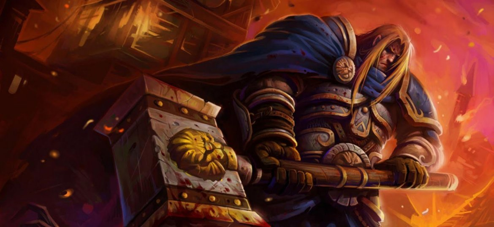

# 炙热之心骑士团旧功勋值系统

这篇功勋值系统同样来自骑士团刚创立的年代，由帕拉斯圣剑所写，已失效。

## 炙热之心骑士团功勋值系统（初定）

从刚刚加入的见习骑士开始，每一个骑士将拥有自己的功勋值，从0开始，没有上限。刚刚加入的见习骑士功勋值为0，当他不断参加骑士团的活动，或者出现其他能够获得功勋值的行为，他的功勋值将上升，一直到100，就可以申请晋升光明骑士的任务，任务因人而异，并且同样会获得功勋值。完成任务之后，就可以晋升成为光明骑士。然后当他的功勋值继续增加，直到500，可以要求晋升徽记骑士的任务，同样，完成后可以晋升为徽记骑士。

继续增长再到达1000一定数之后（1000？，可以获得骑士团授予的唯一称号。在建立的时候就通过成立仪式成为光明骑士的成员，功勋值起始为80，之后再进来的，从0开始。功勋值记录在官员备注里面，同时，扣去功勋值，也是骑士团处罚的一个手段，当一名骑士的功勋值被扣超过位阶的临界点的时候，则将被降阶。

暂时列出的可以增加功勋值的行为和相应的增加值如下：

1.在酒馆内公告的骑士团官方组织的活动，每次活动将随活动公告给出相应的功勋值，一般每周的活动参与的功勋值为5，如有表现出色的（比如内部训练优胜，战斗表现突出）可以附加10。

2.参与联合冒险团的首次首领击杀，每个首领获得10，天灾首领15。

3.参与完成骑士团官方接受的原住民委托，骑士团在接受委托的时候也会同时给出这个委托的功勋值，其功勋值大约等同于骑士团组织的活动。

4.参加竞技等活动为骑士团赢得荣誉（比如原住民的比武大会），或者参与原住民联合的各类团体并做出贡献（比如艾泽拉斯戏剧表演团），每次的荣誉值大约为10。

5.给骑士团提出好的建议和创意，策划活动，以及各种对骑士团发展有益的建议，酌情增加1-5。（以上可以在酒馆完成）

6.其他表现突出，体现了骑士精神，为骑士团赢的荣耀的特殊事件，也可酌情增加功勋值1-5。（比如在冒险团战斗中表现出色，收到团长的表扬信；或者热心帮助其他原住民冒险和委托，体现骑士精神）

7.对于违反骑士守则的骑士，评议会也会经过商议通过扣除功勋值来作为处罚。
