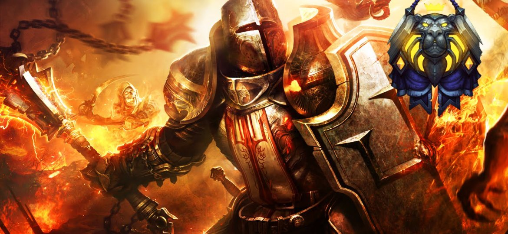

# 炙热之心骑士团旧战斗守则

这篇战斗守则至少能追溯到2007年，由帕拉斯圣剑公布，在骑士团内传阅。

## 炙热之心骑士团战斗守则

战斗是一个骑士生命中不可缺少的一部分，但是作为有特殊阵营和纪律约束的骑士，在战斗中我们应该对自己有更高的要求。不管是骑士团的战斗，还是和骑士团之外的冒险者一起的战斗，抑或自己单独的战斗，时刻要记住自己骑士的身份。

下面列出我们暂定的守则，希望大家认真阅读，有则改之，无则加勉。每一次的战斗，我们代表的都是骑士团，所以让每一次战斗，都成为荣耀之战吧！！

### 1.战斗中不得逃跑，退却。

当然，要分清逃跑和撤退的区别。无谓的牺牲是愚蠢的，骑士不是蛮夫，我们在勇敢和热情的同时，也要考虑战术。为了最后能达成愿景，暂时的退避是可以被接受的。但是，撤退必须是上级的命令，或者同伴的共识，对于丢下同伴独自逃跑的骑士，骑士团绝对会对其进行处罚！当然，如果有更加重要不得不做（不管哪个世界里）的事情，征得队友的谅解，可能的话，找到替代者，这才是一个骑士的所作所为。

### 2.不得获取自己不应得的战利品。

这点不用多说，即使不是骑士，这也是在艾泽拉斯生存的冒险者最基本的道德。如果这个都违反的话，直接被开除都有可能。当然，或许会有失手拿错的时候，如果是这种情况，做出必要的赔偿并征得队友的谅解，骑士团会减轻或者免予处罚，但是不希望这样的事情发生。

### 3.严格听从指挥，为队友着想。

在外冒险，和有着共同目标的冒险者组成冒险团是完成很多任务的必须途径，在这些团对里面，各位骑士可能是领导者，可能是被领导者。作为领导者，我希望，各位能够把队友的利益放在首位，把团队的目标放在首位，带领信任你的队友取得胜利。如果是被领导者，那我希望各位能够听从队长/团长的指挥，如果有意见可以私下交流，但是不要破坏团队和谐，更不要引发争吵，既然加入了团队，就绝对信任你的队长/团长。

对于原住民联合的冒险团，我们的态度是不强迫，不干涉，除了纳克萨玛斯的天灾是骑士团的目标敌人，其他比如拉格纳罗斯，耐法利安，克苏恩，都是威胁世界的邪恶力量。所以各位骑士要参与讨伐他们的战斗，骑士团没有意见，况且获得的战利品或许对我们打击天灾的战斗有帮助。但是我们需要强调的是，如果你不喜欢这个团队，或者你不愿意去进攻某次的目标敌人，那就不要参加；

但是如果参加了，就请拿出一个骑士最好的状态和最大的诚意去配合你的队友，既然进入了团队，就要严守纪律，服从命令，像一个骑士那样的战斗！对每一个战友的生命负责！如果一直在联合战斗中消极懈怠，骑士团会将其等同于对于骑士团命令的违背和对于骑士精神的亵渎，根据冒险团团长的评价，高阶评议会将会将这些表现记录下来作为档案，甚至勒令其不得继续参加联合团队，我想没有一个骑士愿意在自己光荣的生涯里留下污点吧。
