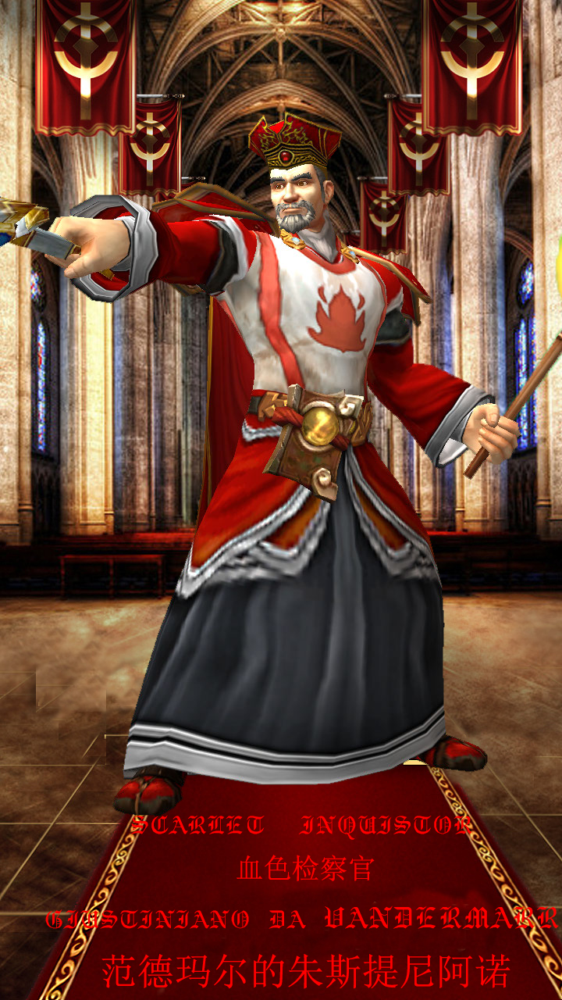
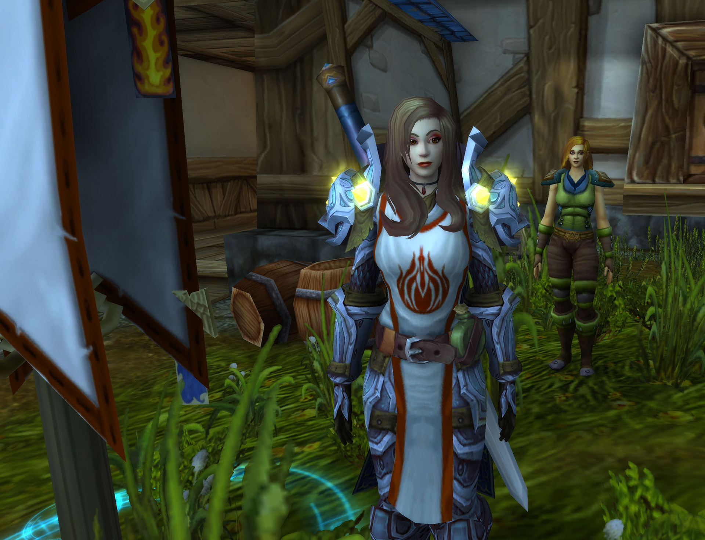
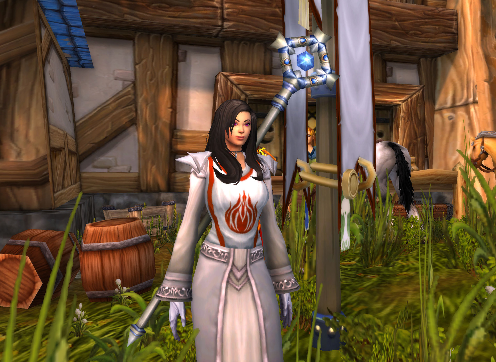
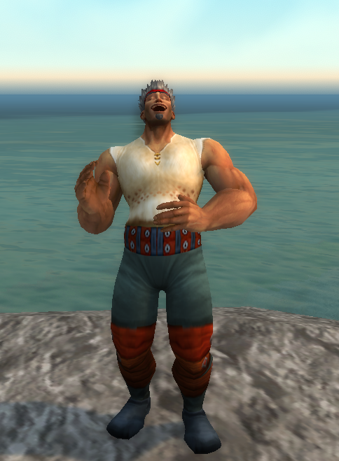

# 第四次战争之后加入的成员

## 朱斯提尼阿诺

姓名：朱斯提尼阿诺

出生地：洛丹伦—提瑞斯法 —范德玛尔

称号：范德玛尔的朱斯提尼阿诺

阵营：守序邪恶

多年以后，当朱斯提尼阿诺再一次站在范德玛尔镇大门前，准会回想起黑门28年被遗忘者占领范德玛尔的那个夏天。

我又一次从噩梦中惊醒。在梦中，那个戴着检察官帽的高大男人握着圣典站在市政厅门口对着他们演讲；我与书记员只是象征性地站在一边。

“圣光，亡灵侵入了你的遗产，亵渎了你的圣殿，使洛丹伦覆颠”

远处大树上挂着被检察官怀疑是诅咒教徒的镇民，他们的尸体在空中随风摇曳。

“他们晚上归来，狂吠如犬；他们环绕城池，四周围转。”

他们或许真的只是想活下去而已。

我们被远甚于我们十倍的被遗忘者围困在这个绝望的小镇里，第五天的时候，镇民里已经出现人吃人的现象，而我却无能为力。

“莱利镇长，萨逊家已经闭门三天没有出现过了，今天早上我们打开他们家门的时候....”

“说下去，书记员先生”

“萨逊先生和萨逊夫人将自己身上的肉割下来给他们唯一的女儿做了最后一顿炖烩....但是那个小女孩还是饿死了...”

我什么也做不了，是的，黑门26年之后那个检察官就以血色十字军的名义接管了整个小镇的行政和物资调配权，从那以后我只是一个橡皮图章而已。

我看着那些红衣战士们在朱斯提尼阿诺检察官的命令下集结，当这股红色汇成一股洪流之后，我明白了，他们想要最后一搏。

“那是天国福音的诰铃悲歌，是心海沉沦里炙热滚烫、扑不灭的命中火”

他的战前演讲依旧是如此激动人心，让狂热瞬间充斥着所有人的眼睛。

那是一次短暂的胜利，我在城头上看见，我看见那股红色洪流高喊着“为了洛丹伦！”与对面的黑色方阵撞在一起；令我诧异的是，对面那群亡灵也同样高喊着“为了洛丹伦！”，两种颜色冲撞在了一起，相同的口号也重叠在了一起。很快，胜利的成果就化为乌有，那些战士用生命打开的缺口立即就被更多的被遗忘者给堵上。

日暮黄昏，当太阳的最后一缕光芒洒在大地时，我看见的是那些孤单疲惫，拖着沉重步伐的身影；与离开时的豪气万丈不同，与狂喜热情欢迎他们归来的朋友亲人不同，他们保持着死一般的沉寂；我看见欢喜的人群中，母亲徒劳地呼唤着那早已离开这世界的孩子的乳名，白发苍苍的父亲颤颤巍巍地从军官那端走了他儿子的枪。

朱斯提尼阿诺找到了我，他们决定离开了。六年了，我认识这里的一草一木；作为这座小镇名义上的主人，我想我应该和她一起化为灰烬。

我还能记得洛丹米尔河岸的茭白月色，吉尔尼斯雾霭中古钢琴演奏的湖上天鹅。

“洛丹伦是我们的了，黑暗女王万岁！”听着外面传来的欢呼声，是啊，洛丹伦是我们的，至少我的生命最后一刻还和她在一起。

“范德玛尔镇长，莱利丶克罗恩；我在这里以黑暗女王之名判处你死刑！”

## 佐伊·莱诺林

1、角色的父母是谁？角色是否由他们抚养成人？如果不是的话是因为什么原因？如果不是的话又是由谁抚养的？

我从小同我的祖父凯洛斯·莱诺琳扶养长大。他是一名很好的神官，正是她的教导让我走上了圣光的道路。而我，也从不后悔这一点。

2、角色有从小时候就是死党的好友吗？有兄弟姐妹吗？他们现在在哪里？角色和他们还有联系吗？还是已经分开了？

与我同学的，有两个人，一个是天生的牧师，他叫做里德尔。另一位则是一个农户家的女儿，很擅长使用弓箭，据说可以百米射鹰，当然，我没见过。我在破碎海滩见过里德尔，那时的他已经是个出色的圣光教派的牧师了。至于艾雅——噢，就是我刚刚提到过的农户的女儿——我已经有段时间没有见到她了，我只是听说她去了黑海岸。希望她一切安好。

3、角色的童年是什么样的？平静宁和还是动荡不安深受创伤？

我的过去说不上颠沛流离，但是也差不了多少。我本不是暴风城人，因为我在吉尔尼斯出生。不过听我祖父说他出生在洛丹伦。正是因为圣光告诉了他，才让他逃开了一次又一次的灾祸：比如第一次大战（听说那个时候他就有了南迁的想法），又比如后来的洛丹伦沦陷，以及吉尔尼斯的狼患。

４、角色有什么钦佩的偶像吗？如果有，是什么样的？

阿兹艾尔，我的剑术老师，骑士长。他看起来很严肃因为他总是板着脸，不过实际上他很温和——似乎每个圣光的信徒都很温和。他很喜欢笑，当然，是微笑。他的年龄很大了，以至于头发和胡子都白了。不过他在教导我的时候似乎依然是年轻人一样保持着绝对的热枕。最后，也是他推荐我加入骑士团。不过可惜的是，在燃烧军团入侵之前，他与世长辞，但是万幸的是得以善终。

５、在这个故事开始之前，角色是干什么的？是谁训练了角色学会现在在做的工作？

我以前是个牧师，虽然我实际上已经加入了白银之手骑士团。但是我觉得我似乎永远也没有资格成为一名真正的大骑士。就像我刚才说的一样，是阿兹艾尔，我的老师。他教会了我现有的一切。

６、角色的道德观和宗教信仰是什么样的？为了维护他的信仰，他会做出多大的努力？是谁或什么事情教会了角色接受这种道德观念和信仰？

啊……这是一个比较深的问题了，老实说，我并不知道我该如何回答。悍不畏死？不，我不能撒谎，不是么？但是我知道我不会背叛圣光而叛逃至暗影麾下——值得一提的是，我虽然信仰圣光，但是我不歧视我们教派中研习暗影法术的践行者。另外，如果非要说的话，我的祖父凯洛斯·莱诺琳和阿兹艾尔修士的共同作用，导致了我如今的样子。我的骑士同僚们和同行者牧师们共同导致了我现有的道德观。

７、角色有什么不同寻常的爱好或者体格特征吗？旁人一般对此有何反应？

嗯……我喜欢吃肉和我学不会用20分钟的时间对付一只苹果算不算？万幸的是我不是一个贵族小姐，而我的同僚们也没有因此歧视我——因为我们都一样。

８、别的角色对你的角色的态度如何？从你的角色的观点来看，他们为何会有这种反应？

我的朋友不多，但大多是过命的交情，因为很多都是在战争中结识的。

９、角色能杀人吗？他/她为什么会做出杀戮的行为？他/她有什么敌人吗？角色能杀他们吗？

惩戒除恶，是我们的职责所在，不是么？

10、现在角色的人际关系如何？他/她有什么亲密的朋友吗？或是仇敌吗？如果有的话是谁？原因是什么？

我孤身一人来到暴风城，远离我的骑士同僚们。我想迄今为止应当没有惹恼一部分人，并使之成为我的仇敌吧？

11、角色在精神心理上有麻烦吗？有什么恐惧症的对象吗？如果有的话是什么？是因为什么原因？

我还很年轻不是么？意思是我并没有多少的麻烦事，不过……我在夜晚睡的并不安生，总是容易翻来覆去的做梦，只有依靠宁神花的药效才能安然入睡。我想这是因为我早先同恶魔们战斗的原因所导致的——听说他们很喜欢玩弄灵魂，或许我就中了某一种魔法，而我却毫不知情。

12、角色平素是怎么对待别人的？他/她容易相信别人吗？还是特别不容易相信别人？

我仍记得前不久有两个士兵邀请我去酒馆的事情，我很惭愧的拒绝了他们。不过那个时候我刚刚来到这里，担心多少是有的……不过我想大多数人应该不会凭空害人……吧?

13、角色看起来是什么样子？他/她有什么伤疤或是纹身吗？如果有的话是因为什么原因？

“她有着金色的头发，穿着银色的盔甲。她持着斩敌的利剑，负着卫戍的坚盾。那一刻我便知道，她是我的天使。”

他们说我像个公主或者金发的天使，当然了，我知道我并不是。这仅仅是因为我有一头金发罢了。

14、角色的日常生活是什么样的？如果这种规律的生活因为不同的原因被打断了他会有什么不同的反应？

我刚刚结束一期圣骑士们的训练，我来到了艾尔文森林休假，时不时的，我还会前往暮色森林放松（或是做一些力所能及的事情）。我很期待有什么事情可以让我打破这一循环。

15、角色曾经历过这个世界上的什么重大事件吗？他/她的经历对角色有何影响？

我只经历过燃烧军团入侵的战役，我跟随大部队踏上了破碎海滩。后期我跟随我的战斗小队成员们一 同踏上了阿古斯，并参加了安托鲁斯战役——虽然我只在外围任职。如果说对我有什么影响……我很高兴我们能终结恶魔们的邪恶计划。当然，最重要的是，让我明白了这个世界并非是非黑即白。

16、角色有任何声名狼藉或是名声显赫的祖先吗？他/她做了什么？当人们知道了角色有这样的祖先后他们会有何反应？角色的行为是为了提升这种声誉，降低声誉，还是忽视之？

我并没有什么声名显赫的祖先，我们一家都很平凡，当然我希望我可以凭借我的努力获得一个爵位以求光宗耀祖。

17、角色的理想或者说人生目标是什么？

我现在很迷茫，或许就这样平凡的渡过一生就很不错。我并不奢望自己成为名声显赫的大领主，或是骑士团大团长。我只求问心无愧，便足以了。

18、他/她是怎样追寻目标的？故事中描述的冒险经历对完成这种梦想有何作用？

我只想认识一个又一个的朋友，而又因为我的身份，希望我可以远离那些阴谋诡计……至于别的，我只能说将心比心。

19、角色有过建立家庭的想法吗？如果有的话，他/她心目中理想的伴侣是哪种类型的？

真是一个好问题……谁的心里能没有一个白马王子呢？或许有一天我也会嫁为人妻，或许会生个可爱的女儿。至于他……我很希望他能够对于自己人彬彬有礼，但是对付敌人时却毫不留情——就好像我队伍里的那名狼人一样。

或者就像里德尔。

20、角色考虑过他/她死亡的可能性吗？他/她有什么未了的心愿吗？

我们当兵的，怎么会没有想过死亡的可能性呢？事实上我已经多次同死亡擦肩而过了，第一次是我很‘幸运’的没有作为第一批次登岛部队登录破碎海滩，第二次是我在一个燃烧的吉尔尼斯村庄直面一只地狱火，第三次是我面对一只恶魔卫兵——原谅我分不清恶魔的种类。

至于别的……或许见见我的朋友们，见见我的战友们，见见我的家人们，以及……来一场热恋？好啦，开玩笑的。事实上我也不知道我究竟有没有什么心愿，老实说我从未考虑过这种问题，我都是走一步看一步的。

再见。

## 米丝蒂·黎明玫瑰

姓名：米丝蒂·黎明玫瑰

种族：高等精灵

出生地：晨风村，奎尔丹纳斯岛

职业：牧师

信仰：圣光

阵营：守序善良

黑门20年

湿冷的海风拍击着房间里的窗户发出令人焦虑的嘭嘭声，米丝蒂背好自己的法杖，一只手提着行李，一只手拿着一个红色烫金信封走出房间。高等精灵看了看阴云密布的天空，快步走向洛丹伦港。

“报告长官，奎尔萨拉斯的船只已经停靠完毕。”

“通知港口管理员立即开始登船，港口守卫部队保持高度警戒，确保盟友的安全撤离。”

在士兵和军官身后，码头上停靠了数艘精美华丽的高等精灵船舰，高等精灵们排成一字长龙，无一例外地拿着一个红色信封，或焦急或冷静地等待着登船。

“黎明玫瑰女士，能和您并肩作战是我的荣幸，现在，快去排队登船吧。”

“爵士阁下，这也是我的荣——”

还没等米丝蒂说完，不远处传来盔甲剧烈抖动的声音和脚步声。

“报，报告长官，天灾军团攻过来了！”一个士兵大喊着跑来。

在片刻窒息般的沉静之后，远处一大群平民从港口的入口涌向码头，而他们身后，臭名昭著的亡灵怪物们正残暴地斩杀着落在后面的无辜民众。

“放一个口子让平民进来！”军官用洪亮的声音高喊着自己的命令。

这是天灾的惯用战术，驱赶平民做进攻的前锋，以逼迫人类指挥官破坏自己的防守阵型。战术非常奏效，天灾轻松地攻破了第一道防线，第一梯队的防御部队正在溃败。

看到这样的状况，港口内侧的大量高等精灵开始慌乱，想方设法地快速登船，原先的队形变得乱七八糟。而米丝蒂的心神也被同胞们这样浓烈的焦虑情绪而影响，是抛弃医生的职责，跟着同胞们撤回奎尔萨拉斯，还是留在这里和联盟的战友们共进退？

就在米丝蒂恍惚犹豫的时候，在逃向码头的人群中，一个哭喊奔跑着的人类小女孩撞在了米丝蒂的腿上，摔倒在地。米丝蒂立马回过神来，温柔地扶起小女孩，擦掉了她脸上的泪痕。

看着这些无辜的洛丹伦民众，一个温暖的声音在米丝蒂的耳边响起：“聆听你内心的声音。”

米丝蒂的眼神变得坚毅，她将装有安纳斯特里亚·逐日者签发的撤离指令的红色信封撕成两半，握紧自己的法杖，向战火纷飞的前线跑去。

## 朱丝缇娅·温特

姓名：朱丝缇娅·温特

出生地：洛丹伦—希尔斯布莱德 —南海镇

阵营：混乱善良

生平

**出生及童年**

纪元-1年，一个繁星闪烁的夜晚，朱丝缇娅降生在希尔斯布莱德的南海镇。她有一位兄长，维耳戈。她的父亲是迪奥，母亲则是厄俄斯。厄俄斯是一位来自安多哈尔的法师，而迪奥则是土生土长的南海镇人。

朱丝缇娅出生的时候，她父母住在南海镇的农场边，住所旁便是从凯尔达隆湖一直流淌下来的河流，途径辛特兰和奥特兰克，贯穿了希尔斯布莱德。同年，被萨格拉斯控制住的麦迪文杀害并毁灭提瑞斯法议会，许多提瑞斯法议会的成员在短时间内相继神秘死去，其中就包括了她的母亲厄俄斯。

此后朱丝缇娅一天天长大，她的父亲也未曾对她提起过母亲的死因，或许这个农民也不知道自己妻子的真正死因吧。暴风王国战败于奥格瑞姆控制的部落，越来越多的暴风城难民北上洛丹伦度难，与此同时，人类大主教阿隆索斯·法奥筹组白银之手骑士团，乌瑟尔、提里奥·弗丁、图拉扬等人为第一代人类圣骑士，朱丝缇娅因为小小年纪被发现的魔法天赋，被送去紫罗兰学习魔法，但是她对白银之手骑士团的诸位则有一种不知名的亲切感。

**达拉然**

在那里，她有幸接受了阿雷拉斯·火叶的指导，阿雷拉斯·火叶是未来血色十字军的高级巫师。

**寻找白银之手骑士团**

纪元20年，不知名的瘟疫在洛丹伦境内出现，朱丝缇娅自行前往调查瘟疫来源，并在安多哈尔参加了第一次与亡灵的战斗，随后，她加入了白银之手骑士团，为净化瘟疫寻求解决办法。

**分裂**

疯狂的亡灵在阿尔萨斯的带领下席卷了洛丹伦，此后希尔瓦娜斯在洛丹伦重铸了秩序，纪元22年，战败逃走的恶魔巴纳扎尔杀死圣骑士赛丹·达索汉，开始从白银之手的内部腐化整个骑士团。起初朱丝缇娅跟随阿雷拉斯·火叶的教义，但是她发现自己的某些同胞越来越疯狂，朱丝缇娅无法认同她疯狂同胞的想法。这时候白银之手骑士团因为理念问题分裂成狂热的血色十字军和公正的银色黎明，朱丝缇娅毫不犹豫的放弃追随阿雷拉斯·火叶，加入了银色黎明。

**最终归宿**

纪元27年，圣光之愿礼拜堂一战后，朱丝缇娅加入银色北伐军。知道自己将要远征，她写信给自己的父兄，希望他们早日离开南海镇，去往南方避难，奈何父兄并未听从她的建议。纪元30-31年，希尔瓦娜斯攻陷南海镇，在圣光之愿礼拜堂的朱丝缇娅逃过一劫，但是失去父兄，也令朱丝缇娅产生了复仇的想法，她去往南方，寻求新的道路。纪元33年，朱丝缇娅加入炙热之心骑士团，身为银色北伐军和银色黎明的她，会和骑士团内的血色十字军擦出什么样的火花呢....

## 雷曼·库伯

赤脊山的红土地，粗糙，干硬，板结。

雷曼·库伯躺在苦工监牢中，无处不在的小石子硌得他的背生疼，他咧了咧嘴，右手抚上腰间，轻轻的按压着，不远处，看守士兵矗立在营地门口，身边趴着一条凶狠的狼犬，嘴角不停的流着哈喇子，要不是有一根精铁链子牢牢地拴住它，恐怕狼犬会立刻发狂，撕碎一切它看到的东西。营地大门上的火把烧的噼啪作响，跳动的火焰将士兵和狼犬的影子扭曲的映在地上，显得诡异又可怖。一个月前，雷曼·库伯还将王国士兵视为自己的守护神，可没想到，如今只是看到他们的影子，就忍不住瑟瑟发抖。

夜色渐浓，周围漆黑一片，营地里静悄悄的，巡逻士兵的钢靴踩在地上的声音传出去老远，“瓿、瓿”，夹杂着几声小石子被钢靴碾碎的沉闷声。雷曼听着士兵的脚步声，一下一下按着腰间，朦胧中，他似乎又回到了西部荒野的农场...

“嗨，雷曼，你个癞皮狗，我好心给你按摩，你倒好，睡得跟个死猪似的！”一个棕色头发，浓眉大眼的小伙子用力锤了一下雷曼·库伯的背：“让你昨天逞能，都说了你抬不起那根木头，你非要跟别人打赌，这下好了，输了5个银币，还把腰扭伤了，真是个蠢蛋！”

雷曼·库伯惺惺地搓了搓脸，打着哈欠说到：“嘘！艾利克斯，小点声，不要让姑妈听到，否则我就死定了。”艾利克斯一脸坏笑：“想要我保密，嘿嘿，那你......”

“快下来！你们两个懒虫，地里的秋葵都要被那些该死的青虫吃完了，你们再不去干活，我们就得饿死了！”，楼下突然传来一个尖利的声音。

“快！”，雷曼和艾利克斯对视了一眼，连忙穿上外套，飞一般的下楼去。走到楼梯拐角，雷曼看见姑妈正在打扫壁炉，趁她不注意，顺手从桌上的篮子里拿了一块甜面包，没等姑妈回过神来，雷曼和艾利克斯就已经溜的没影了。

雷曼和艾利克斯叼着面包大步走在路上，雷曼边吃边说道：“艾利克斯，我去考斯曼大叔家里借一下喷水器，你先去镇上买点驱虫药水，咱们赶在午饭之前到地里汇合，怎么样？”艾利克斯嘟囔一句：“唔，又让我跑这么远，这次该你去镇上配药水了。”雷曼嘻嘻一笑，连忙向岔路口走去。艾利克斯见他如此，只好向右去往镇上，末了还不忘向雷曼比了个中指。

雷曼对着艾利克斯做了个鬼脸，一溜烟似的沿着小路向北快步走去，西部荒野的海风清凉无比，其中还夹杂着各种野花的香气，雷曼不由自主的深吸了一口气：“呼！ 西部荒野的天气，总是那么清新，呦吼！”

“站住，小子！”突然三个红巾蒙面大汉出现在雷曼眼前，“今天算你运气不好，嘿嘿，老老实实跟我们走，快点，把他捆起来，嘴塞上，眼睛也蒙上！”

没等雷曼弄清楚什么事，他就已经被绑的严严实实，嘴上也堵了一块不知道从哪找来的臭抹布，熏得他透不过气来，脑袋一阵阵发晕，雷曼拼命挣扎，可是越挣扎越没力气，脑袋一阵阵发晕，慢慢的昏了过去。

再次醒来时，雷曼不知自己身在何处，只感觉周围挤挤囊囊有很多人，空气中弥漫着一股屎尿骚味，让他直想吐。

这时一个低沉的声音响起：“五十个人，差不多了，立即开始行动，敌人已经开始有动作了，我们不能继续等下去。”

话音刚落，雷曼就感觉自己被人群推挟着往前走，慢慢的，走变成了跑，先是小跑，后来越跑越快，快的雷曼都喘不上气了，忽然前面有人大喊：“前面就是哨兵岭，我们马上就要得救了！”

雷曼听到这话，精神一振，即使早已疲惫不堪，他还是拼尽全力迈开双腿，向着前方狂奔而去，这时手上的绳子不知怎么地就松了，雷曼大喜，一面奔跑，一面挣脱绳子，接着摘下蒙眼布和嘴里的抹布，映入眼帘的正是哨兵岭的大门，他刚要大声呼救，却听见大门方向传来一阵高呼：“士兵们，维持阵型。进攻！进攻！”

雷曼拼了命的向前挤去，只希望快点进入哨兵岭，快点躲在士兵的身后，终于，他看到了那熟悉无比的暴风城狮鹫徽记，不过令雷曼惊诧的是，那徽记在眼前竟然变得越来越大，最后砰的一声重重地拍在了他的脸上，雷曼当即晕了过去。

又不知过了多久，迷迷糊糊中，雷曼隐约听到有人在说什么。

“长官，这些俘虏怎么办？”

“迪菲亚对西部荒野的渗透已经超出了我们的想象，这些人不能留在这里。”

“可暴风城的监狱最近也不太平，他们肯定不愿意接收这批囚犯。”

“那就把他们送到赤脊山去！”

“前线？可是...”

“不用多说，我们还有一大堆事情要做，先送他们去那边，等我们这里的事情处理完了，才有精力去一个个审查他们。”

“但他们中间说不定有无辜的...”

“执行命令！中士！”

“是！”

话音未落，雷曼就再次昏了过去。

“吁~”车子突然停了，马儿的嘶吼声惊醒了囚笼中的雷曼。

“啪！”一记皮鞭在马车上炸响，一位魁梧的军士打开了车门，大喝道：“下车，叛徒，动作快！”

雷曼看到眼前的军士，大喜：“长官大人，我叫雷曼·库伯，我在西部荒野被绑架了，您快送我回家吧！”

“哈哈哈！”眼前的军士仰起头一阵大笑，雷曼心中一讪，猛地，军士低下头，瞪着眼睛对雷曼恶狠狠的说到：“回家？ 回！家！  你这个叛徒，狗杂种，从今往后，这里就是你，永~远~的~家~！” 说完一鞭子打在了雷曼的脸上。

雷曼愣了一下，又是一鞭子抽了过来，这时他才感觉到脸上火辣辣的疼，哭着大喊：“长官，您是不是搞错了，我被人绑架了，我真的不知道我...” 话音未毕，军士披头盖脸的一顿鞭子抽过来，雷曼一边哭诉一边抱头逃窜，可军士的鞭子就像海上的狂风，丝毫没有给雷曼喘息之机，最终雷曼倒在了马车轮子边上，军士停下了鞭笞，狠狠的往雷曼肚子上踢了几脚，转头招呼着身后的士兵：“来人，把这个狗杂种，拖到苦工监牢里去，训好他，要是下次我再从他嘴里听到“回家”这两个字，我就扒了你们的皮。” 士兵们忠实的执行着军士的命令，拉着雷曼的两条腿，像拖着一条死狗一般把雷曼拖向苦工营，雷曼的脸上伤痕遍布，地上的石子相互摩擦弹跳着打在他的脸上，殷红的血液顺着鞭挞的痕迹一丝丝渗出，如同一条条盘踞在脸上的蜈蚣，密密麻麻，恶心又令人生畏。

随后的一个星期里，雷曼才渐渐从其他苦工和士兵们的闲言碎语中知道自己是被发配到了赤脊山前线，理由竟然是“雷曼·库伯参与了迪菲亚兄弟会袭击哨兵岭的恐怖活动，是暴风王国的叛徒。”

听到这个的时候，雷曼惊呆了，不敢相信自己的耳朵，但是军士的鞭打，士兵的讥讽，周围苦工的疏远，让雷曼逐渐认识到了这一点，这让雷曼感到无比沮丧。

虽然雷曼知道自己是无辜的，有着满腹冤屈，但是无人肯听他说话，在军士的“特殊照顾”下，每次一张嘴，换来的不是皮鞭就是棍棒，渐渐的，雷曼便不再言语，仿佛成了一个哑巴，军士看到他被“驯服”的这么听话，逐渐对雷曼失去了兴趣，看守的士兵见雷曼变得“乖巧”起来，也放松了对他的警惕，也不再折磨他。要知道，刚开始的那一段时间，士兵们可是每天都要来“教育”一下雷曼的。

但雷曼并没有就此消沉下去，他在心中暗暗发誓，一定要想尽办法证明自己的清白，无论付出什么代价。

沉默变成了雷曼最好的保护伞，他在沉默中静静等待，等待一个机会，一个能让他逃出生天的好机会。

雷曼有预感，这一天不会太远。

