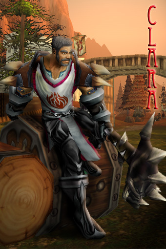
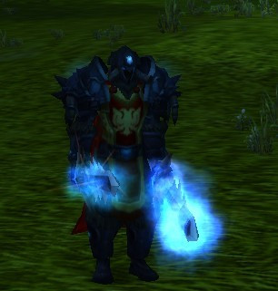
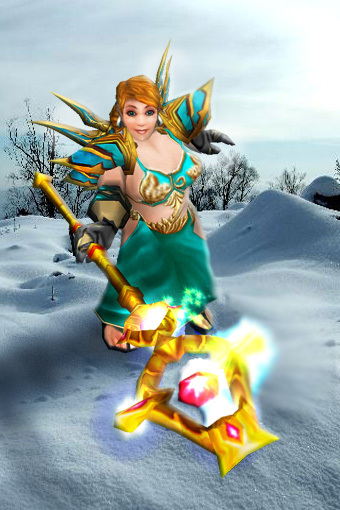
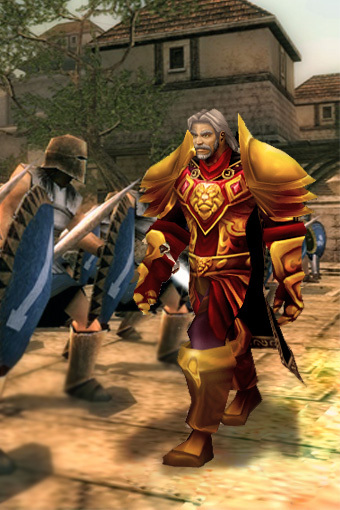
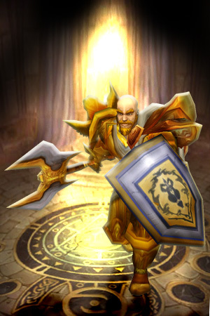
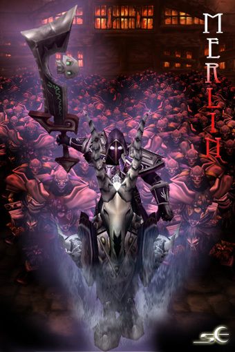
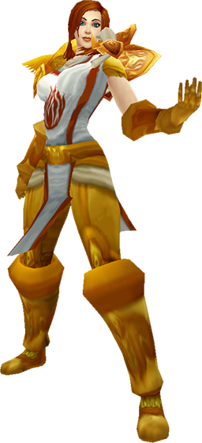

# 炙热之心骑士团旧日骑士

这里是曾经以及现在加入炙热之心骑士团的名册档案。

## 炙热之心骑士团历任大团长

塞斯克

帕拉斯圣剑

拥光者克拉拉

斯蒂凡

法瑞

## 爱兰佩雷斯

> 你像是天使，当人们在等待天使降临的时候，你却告诉我，你就是一位天使。——《爱兰佩雷斯诗集》

魔镜啊魔镜，拥有艾泽拉斯拥有星云降临徽记的法师中，谁是最厉害的？谁从未失手，谁是比武竞技中的常胜将军？连人民军的老书记兹彼希科都甘拜下风。少校军衔对他而言不过是小小的浪漫。

但只有爱兰佩雷斯的密友们知道，他其实是一个诗人。别人都以为他是地下搏击俱乐部的拳手。没有人见过爱兰卸下军装的样子，连听诗的法瑞也没见过。他是一个战斗法师，最厉害的那个。战斗，冰枪与火焰，奥术闪烁，而不是手执玫瑰的优雅。

我们都认识爱兰，与他并肩作战的从人民军的书记，炙热之心骑士团的圣剑骑士，到提尔之光十字军的灵魂安娜……到阿拉索的太阳——说书人索尔昂·温都会告诉你爱兰是最厉害的法师。但听那风中的歌谣——

告诉海伦娜  
我醒来见不到她，忧惧忧伤  
独自躺仰，我思念她  
难以置信，她抱紧我  
那一刻奇迹生发  
她的心铁定知晓  
告诉她，告诉她  
如果你看见海伦娜  
告诉她我醉于她的微笑  
无她我亦难独活  
我爱她，我爱她

我们都见过他用法杖，用冰霜刺穿敌人的心，但我们从未听过如此忧伤的歌谣。爱兰是个孤儿，战斗法师维吉尔收养了他。维吉尔隶属暴风王国西泉要塞第八分队，他死了。

所以爱兰佩雷斯不可能成为一个诗人，即使他是最浪漫的法师。他的生命属于战场，这是早就确定了的。命运本是一首最残酷的歌谣。维吉尔是一个简朴的人，他的长袍补了又补，而他只是默默地守护着西泉要塞。没有人知道老法师的法术如此高强，他将自己知道的一切同样默默地传授给爱兰。为了忘记维吉尔的死，忘却即纪念——爱兰强迫自己变得与维吉尔完全不同。爱兰有闪亮的金发，穿着最张扬的军装，再每一次战斗中都要证明自己是最厉害的。

因为他无法成为一名诗人，这是早就确定了的。爱兰为暴风王国而战，为炙热之心骑士团而战，最终拿起阿拉索的太阳徽记。

第四百五十二次听见集结的号角声时，爱兰突然跪下。就在他膝盖碰上地面的一刻，他用寒冰屏障了自己——没有人可以看见他柔软的心。他在冰幕中嘶喊，但没有人听见。维吉尔死的那天，也有一声集合的号角，然后他再也没有回来。爱兰曾经躲在帷幕之后，以为老法师会像生父一样再次抛弃他——那是他还是孤儿时最害怕的事。

后来的爱兰佩雷斯不再高调，因为岁月教会了他，现在他不再急躁而是沉稳，他从来不接入纠纷，而是躲开。不，他没有隐居，他在默默观察。年轻人总是话很多。年长沉稳的人总在聆听。

爱兰佩雷斯和法瑞

## 拥光者克拉拉

姓名：克拉娜·莱因哈特/克拉拉·莱茵哈特（变性前）

称号：拥光者克拉娜

外号：“苹果”

职业：圣骑士

阵营：守序善良

影月谷的细雨敲打在旅店的窗台上惊醒了正在熟睡的克拉娜，她慵懒的翻过身准备再睡会，在地狱火堡垒之战后她还没有享受这么长时间的闲暇时光。“滴滴！滴滴！滴滴！”侏儒计时器尖锐的铃声却彻底打搅克拉娜的好梦，她从枕头下抽出一把匕首丢了出去，匕首准确的扎中计时器铃声终于停了。

克拉娜翻下床走到窗边，皎洁月光透过玻璃映照出克拉娜健美的女性身姿。她转过头环视房间最后将目光定格在盔甲架上，那套盔甲记录着她的冒险旅程。她走到盔甲边拿起头盔慢慢抚摸着上面徽记，徽记是描绘的是一只镶有眼睛的手臂，代表着她原来信仰—-海姆的圣骑士。

她放下头盔自己看了看盔甲其他的部分，这唤醒了久违的记忆：在炽热的熔火之心挑战拉格纳罗斯的统治；在幽深黑暗神庙里追踪伊利丹的身影；跟随着大领主弗丁对抗阿尔萨斯的不死军团；协助萨尔和巨龙们一起抵挡死亡之翼的目光审判；以及在潘达利亚追寻魔古的宝藏…

“魔古！”，克拉娜愤怒的从嘴中吐出这个两个字，因为在那里她遭遇了生命中最大的危机。

她为了追查魔古人进攻熊猫人的计划只身一人潜入了魔古人的墓室，在那里她不幸触发一个古代机关。在巨大魔法能量的包裹下，她发现了自己的身体发生巨大的变化，由曾经的“他”变成了现在的“她”！由于接受不了这巨大的变化，她离开曾经为之付出巨大牺牲的骑士团，改变自己的身份隐藏在守护者联盟公会中。

“不！”克拉娜摇了摇头，不愿意再去回忆那些往事。她迅速穿戴好装备，迅速走下旅店的楼梯。旅店大厅里早已聚集了大批人，他们是计划返回艾泽拉斯的冒险者，在获得了德莱尼人巨大报酬后这些人显得异常开心。

“你好，莱因哈特女士！”侍者彼得问道，“请问你需要来点什么？”

“请给我来杯‘雷象之颈’吧。”克拉娜回答道，现在她已经习惯了现在的身份。

“好的，女士请稍等。”

克拉娜看着这些冒险者，听着他们之间的闲谈。

“嗨！伙计！你知道吗？据说暴风城里出现了一些奇怪的人散布末日谣言！”

“哦，当年死亡之翼来的时候不也是有这样的人出现么？结果呢，死亡之翼不是也被我们消灭了！”

“这次可不一定哦，据说暴风城堡里也有异变，据说狼王格雷迈恩突然失踪了！不会有什么大阴谋吧？”

“管它呢，先喝这一杯再说！干杯！”

“好！干杯！”冒险者们又继续喝起来。

“女士，您的酒来了。”彼得的话打断了克拉娜的注意力。

“哦，谢谢你！”克拉娜接过酒慢慢品尝起来，酒精刺激顿时让她思维变的清晰起来。“看来我的旅程还没有结束。”她一口气喝完啤酒，直奔狮鹫管理员。她需要立刻返回暴风城，她知道那里一有什么在等着她。

## 帕拉斯圣剑

这篇是帕拉斯圣剑在改名后的人物卡，发布于2008年，现存于艾泽拉斯国家地理。

图片：希尔柯月影

巴纳斯·圣剑

种族：人类

职业：圣骑士

年龄：40岁

身份：银色先锋军驻暴风城特使兼管招募

简介：旧白银之手成员。并曾经加入过血色十字军，新白银之手。在“新阿瓦隆之战”中曾经与死亡骑士领主阿拉斯托尔战斗。

通晓萨拉斯语和矮人语。现作为银色先锋军特使派驻暴风城。

### 暴风城

“尊敬的瓦里安国王，银色先锋军的特使，巴纳斯·圣剑，向您献上弗丁大领主的问候。”

“感谢这位令人尊敬的人物。我们联盟愿意为抵抗即将到来的袭击，做好准备”

“谢谢您的慷慨，国王陛下，那么我们需要招募更多的兵员，以及依靠我们的盟友，获取这场胜利。愿圣光与我们同在“

“愿圣光与我们同在。”

### 血色挽歌

“这趟旅程真够遥远的。”巴纳斯。圣剑抱怨着。裹起他的黑斗蓬继续前行。

“这也是没有办法的事，大人，也只有你能接受这个任务。”一名随从的低阶士兵回应道。

“我现在还不知道他们是否欢迎我呢。”巴纳斯圣剑拂了拂胸前的联盟徽章。缓缓地戴上了斗蓬。

作为一名前血色十字军的军官，现今的白银之手成员。圣骑士不能确定这趟旅程是否成功，与他随行的人中既有银色黎明的几个成员，也有玛尔兰指挥官的几名随从，他们奉命前往新阿瓦隆协助作战与传递消息。

“前面就是新阿瓦隆了。我们的目的地到了。”一名随从的十字军战士兴奋地说道。

巴纳斯·圣剑已经到达了新阿瓦隆血色十字军的驻扎地。他揭下斗蓬。让身边一位血色十字军随从前往通报。

“新白银之手骑士团的巴纳斯·圣剑，请带我去见你们的首领。“

经过引见，巴纳斯·圣剑及其随从被几个十字军卫兵“送”（其实是半看押）到了农田附近，在这里，泰瑞斯·晨风正在执行巡逻任务。

巴纳斯·圣剑脱下黑斗蓬的兜帽，对游侠队长行了个礼：“我是白银之手的巴纳斯·圣剑指挥官，请带我去见你们的首领，我此行有着重要事务，带我去见你们的检察官。”

巴纳斯。圣剑带着随行的几个人马不停蹄地赶到了农场附近。

“来自白银之手的支援者巴纳斯。圣剑。”他问道。”目前有什么需要帮忙的吗？在解决完这场战斗后，我必须很快到新阿瓦隆去见你们的指挥官。”

圣骑士看了看周围的情况。几个疲惫的士兵和破落不堪的农场。”战况看起来对我们不利。”圣骑士皱了皱眉头。

“我建议我们暂时不要继续追击了。”

圣骑士对与阿斯卡维亚的重逢感到有些意外的惊喜。但如同他那张一直以来从来没有露出过笑容的脸一样。他一点也没有表现出热情或者激动。

“阿斯卡维亚，很高兴与你的重逢。圣光与我们同在。”他不紧不慢地说道。”我现在重新戴上了白银之手的徽章。此行来，我也不是为了专程看望你，事实上，我根本没想过会遇到你。”他耸了耸肩”大领主派来的援助不久就会赶到了。而我，”

“我是自愿来到此地的，我不是’特使’,是志愿者。”他抚了抚腰间的圣契。低声地祈祷着”ESARUS THAR NO’DARADOR.为联盟的荣耀而战。”

巴纳斯·圣剑说道“阿比迪斯将军，我很荣幸曾经作为您的下属。不过现在不是讨论我们的分歧的时候。为了联盟的荣耀和天灾军团的毁灭，我们必须一起面对同样的威胁。”圣骑士一回头，看见了刚刚到达门口的霍华德和整个补给队，微笑地对自己的同僚打了声招呼。“很荣幸与你并肩战斗，兄弟。”

巴纳斯·圣剑以其惯有的表情看了看死亡骑士。嘲笑似地说道“你一个人来到这里真是有勇气啊，为什么不带着你的玩具兵一起出场呢？”

圣骑士从背上取下了双手巨剑。举起剑向他的敌人致敬。而与此同时，剑身上燃起了火红的光芒，就象被点燃了一样。

出乎死亡骑士的意料，圣骑士并没有取出腰间的圣契，连身边的血色十字军士兵和银色黎明的卫士们也被惊呆了，他的手掌中央似乎燃烧了起来，那股不灭的火焰自他的身体内喷涌而出，随着剑身地划过，整个白骨护盾象玻璃一样碎得粉碎。

“我也曾经是血色十字军的一员。”巴纳斯盯着满脸惊异的死亡骑士说道。

巴纳斯。圣剑与阴暗守护带着突围而出的银色黎明，白银之手士兵以及少量的血色幸存者逃出了新阿瓦隆。

“现在情况紧急，天灾军团的大军即将涌向圣光之愿礼拜堂。阿斯卡维亚，你带着你的手下离开这里，拿着这个。”巴纳斯取下一个银色黎明的臂章交给检察官。”这里的一切，由我们来应付。”

“可是……”

“愿圣光与你同在，牧师。”

“铭记洛丹伦。阿斯卡维亚，我们会再见的。”巴纳斯送走了那几个血色十字军的幸存者。在他们的身后，已经出现了几名死亡骑士以及他们所带领的不死生物。

“ESARUS THAR NO’DARADOR.”圣骑士举起他手中的剑，剑身反射着阳光，似乎就象他本身一样，燃烧了起来。

“不要畏惧死亡，因为你们的名字将被记入传说。”巴纳斯的盔甲闪亮出夺目的光芒，在他的身后似乎出现了刺目的光翼。

士兵们无所畏惧地冲向了敌人，破骨头的断裂声和亡灵令人作呕的惨叫声此起彼伏。巴纳斯。圣剑更是挥舞着手中的利刃，在他们当中旋风似的舞动着，似乎不知疲倦。

“结束了……”圣骑士喃喃道，似乎那些事就象是发生在昨天。

“阿拉斯托尔死了。”霍华德说道。“你可以好好地睡一觉了。”

“我想也是”巴纳斯坐起身来，看了看镜子中的自己，满头的银丝中又生出了金发。

“阿斯卡维亚怎么样了？”巴纳斯关切地问道。

“那个可恶的血色十字军检察官？他走了。再也没有回来。”霍华德漫不经心地说道。

“也许吧，但愿这场噩梦终究能结束。”

圣骑士站起身，抚了抚靠在墙角的战锤。说出了一句很久没有用过的战呼。

“以洛丹伦的名义，为了联盟，灰烬使者将指引我们走向胜利”

（完）

### 小故事

来自斯蒂凡

年少的艾蒙不习惯深夜，礼拜堂的深夜除外。

无数个深夜，艾蒙因不安和恐惧无法入睡；他不得不绕进礼拜堂，在闪烁不定的烛光中穿过长椅之间长长的行廊，走上低低的台阶，独自来到祭台前，为自己白日的过失或者某个念头长久忏悔。

“哥哥不会像我这般痛苦，即使和我跪在同样的地方。”艾蒙默默走向祭台。

“艾蒙！”巴纳斯回过头，看着弟弟。

“伯努瓦修士允许哥哥说话吗？”

“不允许进食。”巴纳斯转头望向祭台上的烛火。

艾蒙跪在巴纳斯旁边，低下头。

“带了食物？”

“嗯。”艾蒙拿出一个银质的方盒子，盒子的右下角镶嵌着一株蓝宝石雕刻的梦叶草。

“这是你自己的那份，我猜得到，”巴纳斯朝着弟弟微笑，“不如在这里用晚餐，我看着你。”

“这里？”

“圣光决不至憎恨兄弟之情——看着你用餐，我也会觉得满足。”

艾蒙低头打开盒子。

“哥哥，我知道你的虔诚，你训练太劳累，才会在礼拜时困倦。为何不向伯努瓦修士解释？”

“贝戈老师安排我近日勤修剑术，他必已知晓。”巴纳斯回答。

“明天一早还要训练，为何不请求减轻处罚？”

“我不能违背指导修士的安排。”

艾蒙点点头，不再言语。

“艾蒙霍特普！”伯努瓦修士声音严厉，“你竟与巴纳斯一起违抗你们的指导修士吗？”

艾蒙急忙起身行礼：“原谅我，伯努瓦修士。”

“巴纳斯，站起来看着我！告诉我礼拜堂里为什么会有食物的气味！”

“伯努瓦修士，”巴纳斯站起来转向修士，“请允许我为我的弟弟稍作辨白。艾蒙将自己的晚餐留给我，是出于兄弟友爱，对于您的指令，他毫不知情。”

“艾蒙向来无可挑剔，你呢？巴纳斯！你也不知情吗？”

“我整日粒米未进。”

“住口！你叫艾蒙替你作伪证吗？巴纳斯，你行事如此，将来怎能实现你父亲的期望，怎能担负圣剑之责，怎能为圣光而战！”

“我心中坦荡光明。”

“明天夜里你继续跪在这里！不得离开一步！”修士命令，“至于你，艾蒙，明天夜里不要让我看见你出现在礼拜堂！”

“是。”艾蒙躬身行礼表示服从。昏暗的礼拜堂里，他听见自己剧烈的心跳。

### 维萨里奥黯刃

帕拉斯圣剑死亡后……成为了维萨里奥黯刃，加入提尔之光十字军

角色名：维萨里奥黯刃

种族：人类\(亡灵）

国籍：洛丹伦

职业：死亡骑士

简介：“冰冷的铁拳，扫荡一切。没有光芒，没有阴影，只有力量！只有身为亡者的我们，才能真正洞察这世间的真理：迎来我们的死，或者敌人的灭亡！”——提尔之手十字军,“赎罪者”维萨里奥

我，白银之手圣骑士巴纳斯·圣剑在参加过奎尔丹纳斯岛屿的战斗后，最终独自回到了瘟疫之地。经历了这一切变迁，我显得沧桑了很多。只有战斗，无尽的战斗，每当一个亡灵倒下，洛丹伦的天空便更加明媚，直到，迎来自己的归宿。

这结局是必然的。在倒下的那一刻，我将自己的命运交给了巫妖王。没有惋惜，没有哀伤，没有自责。

在作为巫妖王的仆人时，我将自己称为维萨里奥，为了纪念我的战友，她是一条冰龙，曾经是我的虚空龙坐骑。死在我突袭新阿瓦隆的战斗中。

我等到了这个时刻，而现在，我是力量的主人。我终于明白了，无论我信仰的是圣光，还是别的什么，那不重要。重要的是，我要知道我为何而来。

在跟随莫格莱尼大人进军冰冠冰川，彻底埋葬巫妖王以后。我以为我的使命已经结束了。伊萨耶夫中尉同志，在我再次见到他时，那是在吉尔尼斯。我看到了远比巫妖王还要使我感到恶毒的存在：邪恶的女妖希尔瓦纳斯将瓦格里派上了战场。

我的洛丹伦家乡在召唤我。如今，我还得为她而战，也为我自己而战，我的符文剑渴望鲜血。

提尔之手十字军，我来了。我不为“赎罪”而来。是的，如今我不再受到任何教条的束缚了。我要让我的敌人尝到他们对那些无辜者所做的一切。布道者女士，我不关心，你们到底怎么看我，我也不为我的亡灵之躯感到羞愧。我从我的诅咒中得到了力量！与盟友们并肩战斗，终有一天，洛丹伦的国歌将会重新唱响在王城的废墟。

有些时候我就在想，如果没有那些绿皮和他们邪恶的女巫盟友，这个世界将有多么美好。

冰蓝色的盔甲将一具人类躯体包裹其中，大部分时候，维萨里奥黯刃手持两把符文剑，他将这两把剑称为“亡灵杀手”。其中镶嵌了冰霜的符文，可以冻结敌人的躯体，乃至灵魂。

维萨里奥在通常的战斗中，倾向于用急速的武器打击，以及冰霜的力量摧毁对手。\(冰霜死亡骑士），在危急的时候，他将会使用镶嵌了晦暗力量的符文剑“圣光克星”（高等精灵所打造，外形很像奎尔德拉，此时是邪恶死亡骑士），召唤亡灵之力对抗对手。

维萨里奥对道德的争辩不厌其烦。他不在乎别人怎么看待，他只在乎是否有益于他的目标。但这并不是说他是一个阴谋家或者野心家。他对于单纯的“力量”毫无兴趣，匹夫之勇不足挂齿。除非这有助于他向他的敌人复仇；他不愿使用阴谋击败对方。因为他认为简单，快速，效率的方式更加的爽快。

他也许有朋友，但是朋友不多。对于他来说，无论是他帮助别人，或者别人帮助他，他并非会为此感到感激，或者要求别人回报。对他来说，这完全是出于他的自愿。

“懦弱，恐惧，冲动，是我们最大的敌人。压抑你的仇恨，让它在适当的时候爆发吧！”

“邪恶女妖的追随者们，当你们在残害联盟的公民，在散布你们那可怕的毒素的时候，没有人比我们，更能够对付你们那些邪恶的阴谋。”——黯刃

仇恨的风在心头咆哮怒吼，  
敌人势力在向我们下毒手。  
快集结起来与敌人决一死战，  
也不要问有什么在前头。  
愤怒地起来，坚定地起来。  
要为了洛丹伦的事业而战斗。  
高高地举起复仇的旗帜，  
为洛丹伦解放，人人自由。  
残酷的战斗，复仇的战斗，挺起了胸膛快向前走！  
残酷的战斗，复仇的战斗，挺起了胸膛快向前走！

今天我们有多少人死于阴谋，难道我们还能够不开口？  
在战斗中战友冰冷的眼睛，难道面对恶魔会颤抖？  
为最终的信念，光荣的战斗。  
在战斗中我们将摧枯拉朽！  
我们的意志随冰冷的符文剑，  
无情地印在敌人的心头！  
残酷的战斗，复仇的战斗，挺起了胸膛快向前走！  
残酷的战斗，复仇的战斗，挺起了胸膛快向前走！

和部落我们是不共戴天。  
来盟友们我们今天一起要报血仇！  
咆哮的灵魂围满了邪恶女妖的王座，  
也将吞噬她罪恶的心！  
要消灭侵略者，要消灭部落。  
要粉碎阴谋家，卑劣侵略者。  
要将敌人从世界上彻底抹消。  
看胜利日，洛丹伦凯歌鸣奏！  
残酷的战斗，复仇的战斗，挺起了胸膛快向前走！  
残酷的战斗，复仇的战斗，挺起了胸膛快向前走！

人物志更新，维萨里奥黯刃从巫妖王的控制中解救了他的冰龙坐骑维萨里昂娜，并且用兽人的血混合血精灵的血将他的盔甲和冰龙坐骑都染成了暗红色。

更新，已改回本名巴纳斯……顺便插句嘴，最近我也要写文了……各位灰烬之手的兄弟姐妹们赶紧放人物志吧。

后续会有灰烬卫士列传（也有其他十字军成员出场……）以系列短篇形式连载（就像我以前在海龟宝石的故事集）。目测这是一个巨大的坑……

## 斯维特拉娜

2006年守护者联盟，2007年炙热之心骑士团的第一任主教斯维特拉娜

图片：希尔柯月影

“我将永远感谢您，我的父亲。是您赐予了我生命，又在最危险的时刻用生命拯救了我。”每次作完例行的祷告后，斯维特拉娜都会再加上上面那一小段祷词。如果没有这位伟大的父亲，现在的她也许只是个在铁炉堡的探险者大厅里翻阅资料的学者。

通过书本来想象战争的残酷，眼看着人民生活在疾苦之中却无能为力。是他促使斯维特拉娜走上了追寻圣光的道路，现在无论面对何种困难，她都不会忘记父亲对她的教诲：“当人们受到伤害时，我就在你们的身后；当人们内心痛苦时，我就在你们的身后；当人们感到恐慌时，我就在你们的身后；当人们失去信仰时，我就在你们的身后。手握圣光的牧师行走在艾泽拉斯世界上，为人们带来平和与希望；也会用暗影的力量惩罚和毁灭他们的敌人。”

## 塞斯克

2006年守护者联盟，2007年炙热之心骑士团的塞斯克

姓名：塞斯克·法尔布斯

种族：人类

出生地：闪金镇

年龄：20

职业：战士

偏好武器：巨大的双手剑和斧头

信仰：无

偶像：安度因·洛萨

理想：恪守谦卑荣誉牺牲英勇怜悯精神诚实公正的骑士精神，成为像洛萨爵士那样受人景仰的英雄。

阵营：中立善良

个人简历：

塞斯克·法尔布斯生于闪金镇一个贫穷的农民家里，父母在他4岁那年就被迪菲亚兄弟会的人杀死了。从此，小塞斯克就寄居在了狮王之傲旅店里帮忙打工。一天一个吟游诗人路过闪金镇，教会了塞斯克弹琴唱歌，于是，每天晚上在狮王之傲个客人们唱上一曲，成了他主要的收入来源。而旅店里来来往往的冒险者口中那些稀奇古怪故事，则给了他很多写歌的灵感，虽然他自己根本不知道那些什么巫妖王，安其拉之类的是些什么东西。

就这样一直到了１５岁那年，塞斯克去到了北郡修道院，白天在那里的教会学校念书，晚上还是弹琴唱歌赚生活费。在修道院期间，他从书本上了解了艾泽拉斯的历史，慢慢地，那些旅店里冒险者口中的故事被串了起来，塞斯克认识了历史上一个个的英雄人物，而最让他心驰神往的，就是安度因。洛萨爵士。

于是，他立志要成为像公爵那样光荣的战士，为此，他放弃了修道院里的学业，加入了守护者联盟，开始成为一名冒险者。

终于有一天，他在藏宝海湾无意中听到一个人提到了当年迪菲亚在艾尔文森林袭击平民的事情，但是当他要抓住那个人问问清楚的时候，被一群海盗阻止了。于是塞斯克在朋友，也是老海盗，拇指布莱克，本莱克厨刀的帮助下，混进了黑水海盗，想去调查清楚杀害他父母的凶手。

〔日志〕

１月２１日晴

第一天开始冒险，很高兴加入了一个优秀的集体，守护者联盟。修道院里碰到了圣骑士训练师，看到我就说我很有当圣骑士的潜质，让我和他学圣光法术。结果旁边的战士训练师不高兴了，两个人提议公开决斗，谁赢了我跟谁学。结果么，呵呵，看我现在当了战士就知道啦。不过听修道院里的人说他们两个经常为了学生决斗的，而且基本上胜负各半，我还听到圣骑士训练师说了一句：“当初收帕拉斯的时候怎么就没输给他，那个笨骑士真是难教阿。”

然后在闪金镇，我收到了一个神秘法师的委托，要５根蜡烛。哎，法师真是让人猜不透的一群人。当然，为了赏金，我才不管他要蜡烛做什么，反正５根蜡烛烧不掉暴风城，给他就给他咯。１块金币到手，哈哈。

在狮王之傲的时候碰到了传说中的笨骑士帕拉斯，与他同行的还有另外一个圣骑士，名字忘了，都是守护者联盟的。其他没什么印象，就是觉得他们两个带着面具，像两只大蟑螂。

学了些打铁的技术，在暴风城打完几件装备之后，碰到了我的导师，莱帕德。恩，希望在他的指导之下，我可以快点强大起来，今天好几次有人要去什么黑石塔阿，厄运之锤阿，我说要去他们都不带我去……修行不够吧，我现在这样自己都不能保护，怎么去保护队友呢？

今天写得多了，早点睡吧，明天还有其他的任务等着我呢。

——与镶金玫瑰旅店

1月22日晴

昨晚收到了导师莱帕德的推荐信，哈哈，通过拉，开心。没什么意外的话这周六就能拿到公会徽章了，继续努力继续努力。

今天除了又杀了几个迪菲亚小毛贼之外，到矮人的地盘跑了一堂，第一次坐地铁，第一次到铁炉堡，什么都很新奇阿。后来因为好奇，去爬了铁炉堡的后山，想看看山上到底还会有什么，听说是个联盟的飞机场。

上去之后果然，一排整齐的飞机，恩，非常佩服侏儒的智慧。下山的时候出了点小意外，坠崖了，只好找了神仙姐姐，哎，看来还是要多小心啊。

最后因为得到一把不错的双手剑，为了学习使用者把剑，我还是用狮王之傲老板的传送法术回到了闪金镇，然后去暴风城找了吴平大师学习用剑。以后要多加练习阿，呵呵。

——于狮王之傲旅店

1月23日晴

今天终于去了西部荒野，去之前顺便干掉了一个叫霍格的豺狼人，拿了件不错的奖励。矮人托我做的前线的装备今天也交货了，作为回报，得到一个图纸。当然，今天最多数的时间都去打西部荒野的碎尸鸟了，因为我和一个叫罗奇的法师作了一笔交易（法师总是要写稀奇古怪的东西），用20根轻羽毛换3个符纹布背包，现在手里那两个小包实在是装不下东西。20根轻羽毛打到吐血终于完成了，希望包包快点寄过来阿。

要大书特书的昨天晚上的那条龙，昨天本来趁着夜色想去看看水晶湖的，结果路上居然看到一条巨大的龙飞向了暴风城。名字叫吞噬者特雷姆斯，好像是被两个猎人引过来的，于是我跟着龙一路跑，更令我奇怪的是，经过英雄谷的时候，乔纳森将军居然对这条龙视而不见，任由它一路飞进了暴风要塞。当它开始和公爵以及皇家卫队交手起来的时候，我也拿着手里练习用的木剑冲了上去，当然，一下子就挂了。再等我找到灵魂医者回来的时候，黑龙已经躺在了地上。哎，看来世界上强大的生物还有好多，我的力量实在是太小了，多加练习多加练习阿。

1月24日

今天做的最大的一件事情就是给所罗门镇长送信，几次送信下来让我看到了人类王国的危机。为什么暴风城对湖畔，西部荒野，夜色这些地方的危机都视而不见？如果洛萨爵士在的话一定不会这样的，暴风城里肯定有什么问题。

好吧，那我就尽我自己的力量，帮助这些地方的人。

从西部荒野开始。

1月27日

前两天都在西部荒野，那里的物资实在是匮乏，连支完整的笔都找不到，日记都没有写。两天里面发生了很多事情，自从和罗奇做了那个交易，我发现轻羽毛实在是很好卖的东西，所以我收集了好多，挂在了拍卖行，看来买装备的钱有了。昨天拿到一张藏宝图，跑了大半个西部荒野才找到了宝藏，是一个船长的衬衣，腰带什么的，看来这个船长也挺穷的。不过有人说听说他是个可怜的人，我拿走了他最后的财产。是么？那看来我应该还给他，不过他人在哪里呢？箱子已经被我打开，再放进去也没有意义了，还是先寄存在我这里吧，如果他有后人我一定会把这些东西交给他们。

今天是个值得纪念的日子，在光明大教堂我接受大家的祝福，正式加入了守护者，完成了从学徒到平原守护者的仪式，和我一起参加仪式的还有法师达斯特宾和圣骑士米勒。

别的不多说了，发点照片吧。

1月30日

今天护送了一个迪菲亚兄弟会的叛徒，带我去范克里夫的藏身之处，大概最近人民军的战斗比较成功一路上没碰到几个挡路的。跟随他的指引，我找到了那个所谓的“谷仓”，于是马上回到了暴风城，在酒馆里面找到了4个冒险者和我一起去取范克里夫的人头。一路上边走边聊，有一个术士居然还试图挑战过克苏恩……虽然我不太喜欢那些使用黑暗力量的家伙，不过他能跑来帮助人民军一起对付范克里夫我还是挺佩服他的，尤其是他还那么厉害。

提着范克里夫的人头回哨兵岭，斯托曼将军让西部荒野最好的铁匠打造了些东西东西犒劳我们，对于成天在外冒险的冒险者来说，一件好的装备当然是最好的奖励。解决了死亡矿井里的威胁，我告别了西部荒野，接下来一站是湖畔镇，那里我还有一个战士的试炼，希望自己能够顺利通过。早点睡了，明天就要起程去赤脊山。

—于西部荒野

2月1日小雨

今天下了点雨，不过手头的委托太多，我还是要出去做任务。

黑石兽人的高塔今天去进攻了一次，2个战士1个法师，结果大败而回，看来湖畔镇周围的兽人势力确实不小，我可能还要在这里再多留一段时间，帮助他们清除一些兽人，虽然只能控制一下局面，不过大概我也只能做到这些了。

昨天去了趟精灵的地盘，那里给我的第一印象就是好漂亮，到处都透露出高贵的神秘。当然，我去那里不是为了看异种族的风情去的，一个叫弗伦的家伙给了我一张清单，让我去收集些奇奇怪怪的东西，说会给我做一件胸甲。这次到那里不过是去探个路，好像我的能力还不足已进入弗伦说的焦炭谷那些地方，还是先回暴风城再锻炼一段时间吧。

还有在石爪山我第一次碰见了部落，一个亡灵法师，显然他的力量比我强得多，一个大火球过来我就没了知觉，好在那里的德鲁伊把我救下并且给我疗伤，德鲁伊的法术真是奇妙。

好了，写了那么多，是时候睡觉了，希望明天好运吧。

2月7日晴

好几天没有提笔写日记了，最近没什么心情，外面的事情跑完了回旅店就想睡觉。

前几天被一个鬼魂召唤接受了一笔不小的遗产，准备用作新手冒险者的基金，死人的东西自己独吞？不吉利阿，哈哈。

弗伦的委托做得差不多了，还差一个燃素，要去剃刀沼泽，有机会找上几个人一起去，很期待那件衣服呢。今天到了夜色镇，那里的气氛怪怪的，什么乱七八糟的邪恶生物都有，亡灵阿，狼人啊，估计我在那里还要呆上好一段时间，把那些东西都扫干净了再离开（俄，好像凭我一个人不太可能，尽力吧）。

今天先写到这里，晚上去墓地看看，还有些委托没有完成，希望一切顺利。

## 巴鲁沙

2006年守护者联盟的巴鲁沙，2007年炙热之心骑士团。传闻巴老仍健在。

图片：希尔柯月影

他总是对人彬彬有礼，即使偶尔和朋友开开玩笑，也从来不带恶意。

也许是因为他的随和和好脾气，平时朋友们总是亲切的叫他“巴老”。虽然起初他并不喜欢这个称呼，因为听起来像乡巴佬，但现在，他似乎很乐意别人这么叫他。而他自己却从不叫别人的外号。

不像其他圣骑士都骑着金光闪闪的战马，他至今仍骑着他那匹军马。照他的说法，是舍不得这个跟随他多年的老朋友。

当然，他并不是一直这么和气。有人曾看见他在一打食尸鬼的包围中愤怒的挥舞着战锤，金色的光铸铠甲上沾满了血污。

他就是巴鲁沙，暴风城的圣骑士，守护者联盟中的一员。

他也许不是个狂热的信徒，但绝对是个忠诚的战士；

他会随时为他的信仰而战，为他所珍爱的事物献出生命。

## 塞拉夫·夜愿

2006年守护者联盟，2007年炙热之心骑士团的塞拉夫·夜愿

图片：希尔柯月影

随着白银之手的消散，越来越多的骑士彷徨而失去了自己的目标，狂热的一些加入了血色十字军，冷静的投向银色黎明，自暴自弃的一些卸甲归田每天在狮王之傲喝闷酒，还有一些回到暴风儅上了贵族，或者上了战场与部落继续战争。

塞拉夫选择了儅一位旅行者，以自己的力量来帮助能看得到的人，再观察这个残破的世界。事实是残酷的，在无数人向迪菲亚盗贼们挥刀的时候他了解了实情背后的黑暗，在从战场上退下来之后他知道了联盟现实的危机其实不是部落。在人们对着血精灵的骑士砸出手中一切可以砸的东西的时候，他亲身前往奎尔萨拉斯，映入他严重的是天灾过后的残破，肆虐的亡灵和渴求魔法的精灵们，但是幸存者们不屈不挠的精神打动了他，他停留了下来，试图了解血精灵们对于圣光能力的使用与充当血精灵们与联盟方面联络的中间人。这会是一个苦差事，没有什么回报，还会招来无尽的非议与讥笑打击，但是他记着弗丁先生的话：种族不能説明一切，我见过最高尚的兽人，也见过最无耻的人类。能为这个残破的世界做一点补救，而不是杀戮和进一步的破坏，也算是贯彻自己的信仰吧。

## 大胡子彼得

这篇07年的人物志属于炙热之心骑士团的大胡子彼得。

### 彼得从军记

大胡子彼得——当你听到这个名子的时侯一定会任为这是某个乡下农夫或着卑劣的强盗的外号，或许会嘲笑它一番。当然如果你出现在我的面前我一定会很很的踢你一脚对你吐口水，然后圣盾·炉石……

彼得，这是个在乡下人中间很普通的名子……在我有记忆的时侯我便知道我没有父母，好心的克斯特先生收留了我，他是本镇的穷教士。因为没钱，我上不起学，只能和老克斯特先生学他那本破烂的圣经\(WOW的世界有圣经吗?…\)你说社么?…可能我是锣锁了一些，没有人愿意听一个可怜的穷孩子的诉苦是吗?

事情的转机是在十几年以后的一天。那天，镇里来了些衣着华丽的绅士。真是气派极了，就连披在马身上的装饰都是用最上等的布做的。他们以国王的名义要求本镇派出10名年轻的男性加入到国王的军队当中.。如果是几年前，这等荣耀的事情必定会令小伙子们激动异常，光看那些充当护卫举着骑枪的骑士是如何讨女孩们的爱慕就能知道。但是如果你还知道几年中派出去的人都是有去无回那就令当别论了。领主贝尔福特勋爵决定从那些贫民的孩子中挑选，也就是说，我就是那些不幸的’幸运儿’的一员。老克斯特先生希望我能成为一名战地牧师，因为那样也许能容易些在战场上存活。而我则盯上了那些护卫们身上漂亮的铠甲……

“孩子，喜欢这些盔甲吗？看上去你很强壮……恩……你是个当战士的料子。”征兵官不知几时出现在了我的边上。

“哦……是，是这样的。我也能穿上吗？”

“当然，只要你能加入国王的军队。”他说到，“我们正缺大量的战士……”

我当然知道为社么会缺……因为他们都死了……

“可是我，我想活着。是的活着。”我只是想有召一日穿着漂亮的盔甲吸引女孩们的目光……当然，而不是在我的葬礼上穿它。

“哦……？我知道，事实上我很情楚你的想法……你这样的人太多见了，走把，乡巴姥。我们出发了。跟你认得的人道别。”

“或着说永别，”他小声的说到……

## 梅林·白银盾

威廉与梅林白银盾一起号召和组织了守护者联盟，这个对抗外来入侵者的大型阵地。

但是联盟成立不久之后突生变故---梅林白银盾在一次作战中失踪，有目击者报告说他是在追踪他成为了被遗忘者的哥哥时不见了踪迹。最后为了不分散守护者的战力，威廉风行者决定独自去寻找这个昔日战友的下落。

## 法瑞

常用名：法瑞  
全名：法瑞雅·图尔加斯（Farilla Tulkas）  
家乡：洛丹伦的壁炉谷  
所属组织：炙热之心骑士团  
职业：圣骑士

### 宁神花

詹姆·韦沙斯脱去深红手套，手没入铜水盆，阳光透过彩窗投进壁炉谷要塞。这是他的早晨，入夜时他到地下室审问亡灵，早晨再锁上门出来，摘下血色纹章，洗手。窗外壁炉谷逐渐醒来，水泼出去的声音，打铁声，面包师汉克的笑声，鸟叫声嘀咕咿啦串成珍珠——十五年前摧毁整个洛丹伦的亡灵天灾没有越过壁炉谷的城墙，同一年城垛上的白银之手骑士的战旗落下，换上留守者们的最后徽记……血红的洛丹伦，血色十字军，他们叫自己。

但这是詹姆的早晨。他走进鹿厅，坐到长餐桌边。他看见法瑞已经坐在木桌旁，穿着新洗的亚麻色罩袍。她和他在同一个地下室工作，她必定也在那待了一整夜。詹姆打招呼说，“早晨，天气好。”

“是的，我希望我不用待在室内，”她回答，“躺在洛丹米尔湖的沙滩上，或者骑马到林地里。”

“我也是。对了南茜答应了，我都不能相信，她真的答应。昨天我刚收到她的信，用厚羊皮纸写的，她一定过得好。我不能相信她答应，一年前我向她求婚，她说天灾正在她门前，没有空。半年前我问她，她说天灾不重要，洛丹米尔的湖龟都爬走了。现在她答应……”詹姆说，他说不完，因为你把话对法瑞说。你对詹姆·韦沙斯尖叫，你把话对法瑞说，连地下室里的亡灵都知道。

“这真好，”她回答，“真好，婚礼会在什么时候？”

“等秋天一到，到洛丹米尔湖边，”詹姆声音尖细，嘴角抽动，“到那时她就不用出门了，我们锁上房门，反复九次……你一定要去我的婚礼，姊妹，没有婚礼能少了你。但也有糟糕的事，我手头上没有一只戒指。我必须给南茜戒指。”

去年南茜到壁炉谷时法瑞见过她，她皮肤黑得像珍珠，但有热心肠。法瑞喝完杯里的麦芽酒，说，“我很肯定南茜不会介意，别担心。”

“婚礼怎么能没有戒指。我不需要三颗给国王的戒指，七颗戒指只能被埋在山里，也不用九颗，那会让我发疯。一颗戒指就够了，送给南茜。最好是金色的戒指，她会喜欢。但我不知道去哪找，你说我能买到吗？”

“詹姆，”法瑞看进他的眼睛，“别担心。南茜会住过来吗？堡里的城墙能撑很久，死人进不了。”

“这很难，你知道规则。”

“我去和伊锡利恩说。”

“不，吃早餐。我们不谈这个，”詹姆打断她。他低头祈祷，“感谢圣光，赐予我们每日食粮；宽恕我们的罪过，如同我们宽恕别人。起初如何，今日亦然，直到永远。愿圣光与我们同在。”

“同在，”法瑞应和道。她看着詹姆十指扣合，手肘支在桌面。他读完祷文就将扣合的手靠近唇边，吻了食指的指节。但她听见他的吸气声，她知道他在闻自己的手。

一天从清晨到黄昏，直到月色渗进壁炉谷。谷里没有血尘雾，银月白色女士的光画出石墙轮廓，他们说那是艾露恩本人，又是大地母亲的左眼。蓝月隐藏在树梢间，注视着，或许还在听。这个夜晚同许多夜晚一样，法瑞走下楼梯，戴上手套关铁门，坐在一个亡灵身边听。她是十字军里的审讯者，詹姆·韦沙斯的副手，他们从亡者嘴里听情报。但你对詹姆·韦沙斯尖叫，你把话对法瑞说，连地下室里的亡灵都知道。

“我恨他！”那亡灵说，“我恨他到骨头里。”

“你为什么恨他？”法瑞冷淡地说，她把纸卷移到蜡烛前，看这个亡者的名。那上面写着，沃瑞尔·森加斯，拒不忏悔，异教徒和叛徒。她把纸卷烧掉，抚平胸前的血色徽章，重新坐下。她不着急，他们都会说，到最后他们都会对她说。

“我是个独立的亡灵，但我的生命力量没有了，没有了。我如何再为黑暗女王服务？都是他做的，韦沙斯。他是个兽人，野兽，他说告诉我……告诉我一切。我不会告诉他，不说一个字，就算索多里尔河干涸，就算泰瑞纳斯国王醒来。”

“你为什么恨他？”

“几周了，”沃瑞尔喘息着说，“他说圣光是尊重，坚毅与怜悯，其中怜悯最重要。我们的心因此变得温柔。他说爱是恒久忍耐，又有温柔的心……你是他的副手吗，你该是，现在轮到你。他说你和他不同，他说他等着你离开。但我不相信。”

“这不是你恨他的原因。”

“他说圣光爱我们……”沃瑞尔停了很久，“我有一个爱人。”

“告诉我，我不会写下她的名。”

“莫妮卡。你们找不到她，她在很远的地方，你们永远找不到她。我认识她很久了，从生到死，她喂过我的海龟，我死在她怀里。她把头靠在我肩膀上，用手捂住我肚上的洞，我抱着她。你们永远不会明白。”

“或许。你们结婚了？”

“我正要把戒指送给她，但韦沙斯，他切掉了我的手。他抢走我的戒指。”

“我很肯定莫妮卡不会介意，别担心，”她说了同一句话，毕竟那只是一个戒指。很久以前，一个叫索拉斯的年轻人，在斯托姆加德北山的洞里看见一架古代木马。木马里装了财宝，和一只戒指。这只戒指让他隐身，他以此靠近皇后，在皇后的帮助下杀死国王。后来索拉斯就成了激流堡的主人，一个新的国王。

沃瑞尔两天后就死了。

詹姆每次用膳前都脱去深红手套，洗干净手，然后祈祷，“感谢圣光，在颓丧的地方，忆取希望；在忧伤的地方，照出喜悦。起初如何，今日亦然，直到永远。愿圣光与我们同在。”法瑞看着他边祈祷边闻自己的手。

后来詹姆染了瘟疫。他知道壁炉谷城墙里没有瘟疫，有瘟疫的不是生者。十字军会询问并处死死者，这是规则。但他相信法瑞不同，法瑞会原谅他。他说：

“我快要死了，我知道，他们会把我关进去。我看着他们，我就看见了我自己，我不想死在我自己手里。你明白吗。但他们会的，我会的。圣光啊，我只想再见到南茜，把戒指给她。杀了我，很快地杀了我。”

她犹豫了，她全身都在发抖。那只是害怕，像鱼人害怕海怪纳迦，亡者惧怕光。但她看着他，他像死者一样弱小，她想。为此她叫来卫兵，他们把不再挣扎的詹姆拖走。后来法瑞接替詹姆成为首席审问者，她不用詹姆用过的房间和工具。因为她不是他，她对自己说，她又向圣光祈祷。

壁炉谷的生活安静，早晨她从地下室走出，在晨光中入睡，到了夜晚又回去。每一天都如此，堡里的时间像是静止了，任墙外洛丹伦覆灭。她会写一首诗——洛丹伦，洛丹伦，山海之间，洛丹伦；啦啦哩哩罗，啊啦啦，古老的洛丹伦。

她戴上了索拉斯的戒指，藏在壁炉谷。

半年后的早晨，阳光透过彩窗投进壁炉谷要塞，窗上画了图拉杨与他的守狱人父亲道别。法瑞·图尔加斯脱去深红手套，把双手没进铜水盆。水盆中飘有几片白色花瓣，那是宁神花，它们在凉水里就会有香气。用浸泡了宁神花的水洗手，则能洗去手上的瘟疫。因此詹姆·韦沙斯从前叫人在训练场边种满宁神花。

她洗去手上的污物，用亚麻布擦干，才穿过走廊到鹿厅。这是她的早晨，她听见场地里木剑相碰，有鸟叫穿过树林，还有山谷里的马蹄声。她坐到餐桌旁，和南茜打招呼，然后低头祈祷，感谢圣光赐予每日食粮。

“……愿圣光与我们同在，”她说完，忍不住闻了自己的手。

她闻自己的手以确定上面只有宁神花的气味。宁神花的香气很淡，有时无法掩盖血腥味。她必须确保自己闻不到血，她想，她看了韦沙斯这么做十五年了。

韦沙斯……法瑞猛把手抽开，右手一顿一顿地藏到桌底。她呕吐进自己的木盘。

他们看见我呕吐了，他们看见我呕吐了，逃出鹿厅时她无法抑制地对自己重复，他们看见我呕吐了……她逃出壁炉谷，爬上去南方的船。

## 圣塞巴斯蒂安

初章：深红色的血泊

生 日：黑门前8年，1月20日，

出生地：斯坦索姆

在一个较为殷实的家庭环境中，小塞巴斯蒂安和其他斯坦索姆的孩子一样的快乐的成长。父亲是一名久经沙场的军人，深刻的意识到只会勇往直前的冲锋和单纯战斗技巧，并不能在战场上安全的生存下去。还必须要有必要的自救能力和崇高的信仰，不然很容易将自己迷失在深红的血泊之中。因此，在他很小的时候就被父亲送到洛丹伦的皇城跟乌瑟尔学习圣光武学。可是身在斯坦索姆的母亲十分想念赛巴斯蒂安，并且认为他是一个音乐天赋极高的孩子，就送给他一支烈焰短笛，让他每当想起母亲和家乡的时候，就吹起这只短笛。所以那些年洛丹伦的上空往往飘出的的优美而纯净的笛声，而非辛多雷的挽歌。

赛巴斯蒂安由于十分勤奋，越发的精通防御战法，很快便进入了洛丹伦皇家禁卫军服役，当泰瑞纳斯国王亲自把洛丹伦皇家盾颁发给塞巴斯蒂安的时候，国王温暖而坚毅的眼神让他明白了禁卫军的使命将是与这座皇城共存亡。在多次出征兽人的战役中，塞巴斯蒂安总能完成一些十分困难的任务，即使是深陷敌阵也能救战友们于危难之中。慢慢的，战友们越来越喜欢和这位年轻的圣骑士一起出征，这是一种信任与安全感。让士兵们敢于把后背留给最亲密的战友来保护。

由于战功卓著，他从一名普通的士兵逐渐的走到了禁卫军队长一职。一方面负责训练和部署整个洛丹伦皇城的禁卫军，另一方面深受泰瑞纳斯国王信任，保护阿尔萨斯王子的战时安全。由于年龄与王子相仿，从小又同在乌瑟尔门下学习，王子主修惩戒进攻，正好与塞巴斯蒂安的圣光防御在日常的学习中形成了对练。连穆拉丁铜须都称赞他们将来一定会成为“洛丹伦之剑”和“洛丹伦之盾。”这样经历使塞巴斯蒂安与王子的感情更胜于一般的战友。可是随着瘟疫的到来，美好的未来也随之打破。

瘟疫在安哈多尔蔓延时，塞巴斯蒂安就已经感到了某种不安。由于战事的需要他并没有回到斯坦索姆看望母亲。但随着情况越来越遭，当他与王子一起来到斯坦索姆时……发现已经晚了。王子宣布屠城，塞巴斯蒂安顾不得阻止王子和争论，遍疯了一样的冲进城市中，一改往日的沉着冷静。他不忍将刀剑伸向自己曾经的朋友、长辈和市民，此时更重要的是要寻找他的母亲。可是大火的燃烧的速度，远比他的战马还快，僵尸们熟悉的面庞更是放缓了他的步伐。当搜寻了城市中每一个地方都没又发现母亲后，他静静的站在广场中央。似乎周围的大火、喊杀声都与他无关，沾满绿紫色粘液的皇家盾也从手中滑落……僵尸们的围过来了，在即将将他淹没的时候。在不远处的一道圣光炸裂开来，这圣光并不是塞巴斯蒂安的，而是王子的。他为了追杀玛尔甘尼斯过程中，偶然之间发现了即将被僵尸吞没了的赛巴斯蒂安。两人对视后沉默不语……因为他们彼此太熟悉了。萨巴斯蒂安也明白，想要控制住大规模的瘟疫唯有隔离和屠城，从战略上讲没有错……王子也没有按军法处理塞巴斯蒂安，因为他知道在这座城市中有他战友的母亲。但他们两人这样的毫无人性和擅自脱离战队行为，却在友谊的层面上第一次出现了裂痕。但精疲力尽塞巴斯蒂安此时却注意到光明使者乌瑟尔不在。也许乌瑟尔带着其他士兵在在这个城市的其他区域作战吧……

塞巴斯蒂安被士兵们抬到了前线营地养伤，他不知道自己是昏迷还是沉睡。当再次恢复意识时，已经是第三天的上午。天空依旧是灰蒙蒙的，这并不是阴天，而是斯塔索姆的烟尘。空气也里弥漫着烟熏火燎和烤肉夹杂的味道。而塞巴斯蒂安明白这烤肉味，可不是平时在宴会厅中所散发出来的……他向营地中的帐篷走去，听到了王子要进军北方的计划。王子看到塞巴斯蒂安进来，停止了部署。王子说：给，你的盾。塞巴斯蒂安接过一尘不然的盾牌，说了句：带上我。就离开了营房。塞巴斯蒂安后来在去诺森德的路上听说了乌瑟尔“叛国了”。很多士兵都议论纷纷，只有塞巴斯蒂安停顿了两步，之后又一语不发的仍旧前行。渐渐的朋友们开始疏远这位圣骑士，认为这位来自斯坦索姆的战士，因为残酷的现实而备受打击已经疯了。

在行军的路上，暗淡脏污的盔甲与王子为他擦出来明亮的盾牌形成了鲜明的对比，使得很多人大老远就能找到他。突然有一天传令兵跑到他跟前说：长官你的信（士兵嘟囔了一句，队长的头发和胡子什么时候已经这么长了）。他看到来自洛丹伦的邮戳，信封上是父亲的署名，信纸上却只有“照看好你的朋友。”而“看”字写的很大，而从笔体上却认出乌瑟尔的，落款处却是老泰瑞。这样一封特殊信，包含在三位“父亲们”对孩子们的关怀、导师的任务与国王的信任。他不知道此时应该是喜是悲。塞巴斯蒂安立刻明白了这封信的用意，用严苛的语言示意传令兵，不要把来信的事向第三个人透露出去。接下来的日子了往来的信并不多，但都言简意赅的汇报的向乌瑟尔直接汇报登陆作战的情况。

偶然的一次巡逻中，塞巴斯蒂安发现王子似乎和当地的佣兵有些往来，禁卫军队长似乎感觉有些不妥。但出于战斗的考虑，需要当地的向导和扩充军队的需要，便没有多问。可是一件事，却让两人的关系彻底的决裂。在一个凌冽寒风的早上，王子命令所有部队离开营地，并且不留一人，向北拓展50公里进行防御和军事演习。塞巴斯蒂安明显认为这样做是一个错误的安排，遍借机偷偷的留在了登陆舰厨房的柜子里。等大军开拔以后，他发现沿着东海岸来了一堆人马，手里都举着火把，车上还有柴草和牦牛油。塞巴斯蒂安认出了为首的人就是那天与王子接洽的雇佣兵。塞巴斯蒂安很不客气的问：你们来干什么？！雇佣兵咧着嘴说道：你们的主子说要给你们的士兵用火焰涨涨士气。士兵们，把这个不知死活的骑士绑起来，一起烧了。很快雇佣兵按照提前的安排的分散开来，拿着火把和柴草向各条战船跑去。而塞巴斯蒂安也和佣兵头子还有十多个手下打在了一起。刚开始队长并没有吃亏，甚至还打死几个佣兵，可在间隙之间他看到山坡上一个熟悉的身影，胯下是那匹独一无二的战马！王子的身边也聚集着一队士兵。他明白了……一切都明白了……这原来是王子一手设计的圈套。此时战船已经燃起了熊熊大火，王子和士兵们向着佣兵头子疾驰而来，佣兵头子嘴角刚刚露出笑意，却被反手一锤。把脑袋凿开了花，鲜血和脑浆溅了塞巴斯蒂安一身。禁卫队长冲着王子喊道：这个混蛋！可是随着脑后一疼，塞巴斯蒂晕了过去。醒来时，已经被五花大绑在王子的面前，忍着头痛大吼道：你这个背信弃义的叛徒，你居然忘记了圣光的教诲，洛丹伦的士兵将要无谓的牺牲。王子说：够了……把他的嘴塞上！你私通敌人燃烧战船，在斯坦索姆战役中临阵脱逃，与叛国者乌瑟尔私自泄露军事情报。（这时塞巴斯蒂安看向王子身边的传令兵和手中信件）判处你死刑，立即执行。传令兵窃喜到：我来砍了他。话音未落，传令兵的胸口已经被王子砸穿。（塞巴斯蒂安愣住了，他知道王子的心已经彻底迷失在深红色的血泊之中，必将走入黑暗深渊）王子说：把塞巴斯蒂安拉出去，用弓弩射死……准一点。默默说了句：我的战锤永远也伤不了塞巴斯蒂安的圣盾。随着弩机的嗖嗖声……塞巴斯蒂安的世界渐渐的暗了下来，一切安静了。

过了很多天塞巴斯蒂在一个满是金黄色落叶和优雅建筑的小岛上醒了过来……身上纯白色的绷带上显出点点鲜红。

## 巡林人亨特

有些人出身高贵，有些人出身卑贱。

坐上王位被人仰慕的人不一定是冠军。

只不过他有个尺寸正好的屁股罢了。

就像亨特的哥哥巴鲁，出生便是一头金发的美男子，能说会道，无数姑娘为他倾倒。

据说他射出去的箭能击中一公里外的一棵树上的蚂蚁，而且只伤了它的腿。

听起来就是在扯淡，是的，他的确有当游侠的底子，但却从未刻苦训练过甚至没找过老师。

但亨特，伽纳•亨特，他是父亲跟贵妇一夜激情的产物。父亲瞧不起他，哥哥瞧不起他，就连两个母亲也不愿接受这个儿子，更别说那个圣洁的骑士叔叔了。

被骂 “婊子养的”都是实话，七八个小孩将他按进粪坑里揍也是日常。

长大以后，虽是以锻炼和挣钱为由父亲安排他去夜色镇当巡林猎人，可就连傻子也知道，那林子里不是残暴狼人就是游荡的死者。

若没有受过正规的训练有着坚固的盔甲与决心进入森林无异于送死。但亨特自己的生命此时在他心中已经分文不值，或许横死于灌木丛之中也是身为私生子的他一个不错的结局。

恐狼们看着绝望的年轻人跪在草地上，它们兴奋地嚎叫着冲向这新鲜的第一顿晚餐。

突然，一阵狂风吹过，紧接着那群饥渴野兽的头颅便被风捎过羽箭贯穿。

“若是不想成为狼群的晚餐，就站起来离开这”。

精灵们是优秀的游侠，若眼前是一个暗夜精灵，他丝毫不会感到意外，但这个救了自己一命的人，竟是个血精灵，一个正统的女性血精灵。

“血精灵？在这？夜色镇？？真是稀奇，我只在书上认识到你们…你浪费了你的箭矢，美丽的游侠，若是刚才能把箭矢射入我的胸膛，我会更感激你的。”

“这番话你应该跟那些牧师说，想死的话就继续在这坐着吧。”

她没再理会亨特，转身便离开。

亨特坐在原地愣了半晌，他看着自己周围野兽的尸体，想起了那个自大的兄长，看着她即将消失的背影。

他选择起身追了上去。

他有很多问题要问她，比如一个血精灵为何会来到遥远的东部王国，为何会在暮色森林出现，她是否效力于部落，她的箭术能否传授给自己。

而最后一个问题对于亨特来说十分重要。

没人知道亨特消失在森林之后发生了什么，当他再次回到人们的视野中时，此时的亨特，已是一个身法敏捷，百发百中的森林游侠。当人们问起他的一身功夫是谁教的时候，他都会提到那个精灵，而当人们问他为何不带那个精灵一起出来时，他就会变得沉默寡言，有时会买上一瓶酒，坐在狮王之傲酒馆后面的湖边发呆，有时则会去往遥远的西瘟疫之地的某个墓地的一个荒凉墓碑前痛哭流涕。

或许他的身世和过去不堪回首，或许他曾饱受折磨与欺凌，但他乐观到过分的心态从未改变。这也是他存活至今的缘由。如今的他正寻找着新的家，新的归宿，以及各种奇珍异兽 来满足他的好奇心与探险欲望。而与他成为朋友，会是一个十分不错的选择。

## 胆小的莱恩

莱恩孩时就开始接受成为骑士的必须训练，也是湖畔镇最年轻的小骑士，更是当时湖畔镇唯一的骑士，后来黑石兽人入侵，外加豺狼人的掠夺，暴风城并没有派遣大量卫兵增援，于是湖畔镇就只好自行组建守军。

可留在镇子上的除了老人妇孺和一部分瘦弱的人，其他人全都出去了，镇子上只有小莱恩略知一些军事知识，于是人们让小莱恩来指挥领导他们，防卫战胜利了，虽然牺牲了不少人但人们依然为小莱恩欢呼着，可莱恩明白，当时的战斗哪怕有一位正规骑士在场，都能减少伤亡，所以长大后，莱恩没有加入白银之手骑士团也没有加入任何军队，而是以独立的侠义骑士身份帮助需要帮助的地区和组织。

