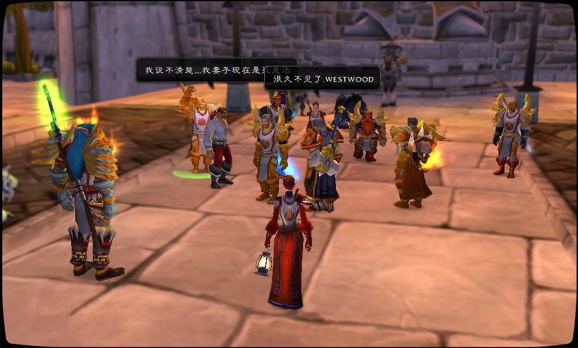

# \[110]炙热之心骑士团的复兴

## 序

自狮王之傲时代建立的炙热之心骑士团如今已解散6年了，老去的骑士们失落在艾泽拉斯，抑或是不知名的世界。他们再也不会在狮王之傲举杯相聚，盾牌不再被擦亮，剑暗淡了。然而燃烧军团再临，瓦里安的意外战死……继任的年轻君王下令重铸骑士团。

“很久不见了，老朋友们。”法瑞拂过这张古老的奥术影像。那一天他们盔甲闪亮，那一天他们在夕阳下相聚。圣剑骑士仍不可一世，克拉拉的骨盾喷火吐息，巴鲁沙一如既往地在盔甲底下露出黑色衬衣……就连西木头，他们的西木老少校也如约而至。这群铁皮罐头可不能拥抱在一起，精灵阿卡斯想——他是骑士团的斥候。阿卡斯总带着精灵的严肃，毕竟他见过许多个千年在眼前如烟而逝。但今天，精灵的嘴角露出笑容，这是最美好的时光——一千年之中又能有几日？

\[110]是这个任务所需人物等级。骑士团经常会发布这种带等级的任务，所以我们的剧情不是封闭的，而是邀请所有原住民参与其中。我们的角色扮演通常是半即兴的，因为我们认为这是最有趣的一种角色扮演之一。半即兴的扮演要求参与者有较高的剧情推动能力，如果你也喜欢，就参与到其中来吧！

欲加入炙热之心骑士团，请写信给：伊琳娜嘉尔或法瑞雅，请优先写信或用侏儒通讯器联系伊琳娜嘉尔。

再次说明\[110]炙热之心骑士团的复兴不是一个公会内部剧情活动。

它没有写好的剧本，你，或许会改变所有人的命运。
