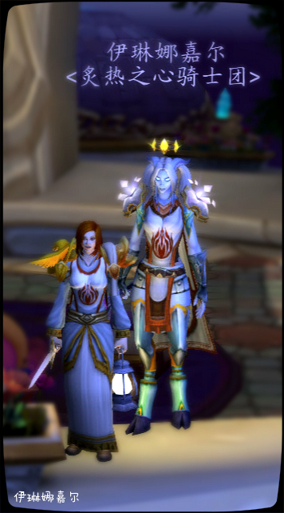

# 第二章 圣光的救赎和疑惑

本章作者 伊琳娜·嘉尔

.jpg>)

## 第二章 圣光的救赎和疑惑

1、相遇

这是我们的方舟，埃索达，永远的家园！

此刻的伊琳娜嘉尔蜷缩在一家杂货店的柜台后面，外面刺鼻的硫磺味和邪能散发出的腐败气息，让她感觉到全身都在颤抖。仅仅在一天前，她才骄傲地从长官手中接过了水晶锤，成为了一名阿古斯之拳的见习战士，可是这场突如其来的军团侵袭，却让一切都发生了变化。

伊琳娜曾经无比相信圣光的力量，在她眼中，圣光的力量被阿塔斯克长官运用得如此纯熟，这个世界不会有比这种力量更加强悍的存在了。

“离开，快跑！”这是阿塔克斯留在伊琳娜耳边回荡的最后声音。就在军团恶魔源源不断从突然升起的传送门里冲出来后，阿塔克斯带领着新晋级的战士们抵挡了数波攻势，可即便骁勇如他，最终也难以抵挡这些恶魔。

伊琳娜在那场战斗中失魂落魄般本能地丢弃了手上的水晶锤，在平民的人群中，失去了方向。

她蜷缩在这里，感觉自己的内心已经死了。也许还有一种声音在鼓励她站起来，和外面的恶魔拼个你死我活，但她的手是冰凉了，几乎没有任何力气。

突然，一道圣光照进了杂货店，一名恶魔卫士轰然倒在了店里。

“有人吗？我奉先知之名，寻找幸存者。”一个清脆但坚定的声音响了起来，伊琳娜下意识地把头抬了起来。一名身穿白色长袍，手持利剑的人类女子出现在她的眼帘中。

“你就是幸存者？你受伤了吗？我可以用圣光治愈你。”女子微笑着过来扶起伊琳娜，伊琳娜发现女子的眼神是那么清澈，她娇小的身躯和刚才打倒恶魔卫士的力量完全不成正比。

“我没想到圣光的力量人类能够运用如此纯熟”伊琳娜看着人类女子使用圣疗术为自己治疗，不禁感叹。

“我是炙热之心骑士团的一名成员，放心，我们运用圣光之力已经很多年了，我从小就接受这种训练。”人类女子坚定地说道。

“我叫伊琳娜，我一名见习骑士，可现在，我也只是一名难民而已。”伊琳娜黯然道。

“很好！我叫法瑞雅，我需要你的力量，我们要破坏那些传送门，还要挽救更多你的同胞，放心，这次还有白银之手的骑士们来救援你们，你们并非孤立无援。”

看着法瑞雅坚定的目光，伊琳娜再次感觉到了一股力量在行踪升腾。

在随后的战斗中，伊琳娜和法瑞雅，一起毁灭了数座恶魔传送器，并拯救了大量的平民。法瑞雅在战斗中的沉着和坚定信念，让伊琳娜再次感觉到阿塔克斯长官的信念。

“活下去，为了埃索达，为了我们的家园。”

2、加入

“不，你们走吧，告诉卡德加，圣光已死，修理好飞船！我们要回家”

先知维纶抱起一名死去的艾瑞达人，目光冷漠地从伊琳娜等战士身边走过去。

“先知！我们应该在艾泽拉斯战斗！”伊琳娜的呼喊，没有得到任何回应。先知身边的阿古斯之拳骑士们都感到更加的茫然。

“让他冷静一下，也许他会缓过来的。”法瑞雅站在伊琳娜身后低声说道。

在科塞拉的大厅里，人渐渐散去，只剩下伊琳娜和法瑞雅。

“一场败仗，我们失去了科塞拉，失去了先知，我们还有希望吗？”伊琳娜一脸沮丧。

“相信我，当然有，我会带着圣光之心回达拉然，请记住，永远不要放弃希望。“法瑞雅拿起圣光之心说道。

“你们不会明白，我们这些失去家园的德莱尼的痛苦和无助，我们的战斗意志就快被消磨了。”

“不，我很明白！”法瑞雅转过身，手中拿起了炙热之心骑士团的勋章。

“我们曾经是丹洛伦的人民，可我们的家乡现在遍地都是亡灵和天灾，我们早已经失去了土地和国家，但我们不愿意放弃属于故乡的荣耀，所以才会有我们炙热之心骑士团的存在。”

法瑞雅把丹洛伦和炙热之心骑士团的事陆续说了出来，这让伊琳娜行踪感到一股羞愧和昂扬交织在一起的复杂情绪。

“我真没想到，还有你们这样坚强的人民，如果可以我愿意跟随你们出去，帮助你们重新找回那些荣耀”伊琳娜激动地说。

法瑞雅看着眼前这名热心的德莱尼，心中感慨万千。

“不，我们的骑士团必须保存纯洁！”她的耳边仿佛回想起了梅林白银之盾，固执的声音。

“只要信仰圣光者，都是我们的兄弟！”还有艾卓拉斯那温和而又坚定的口吻。

甚至还有斯帝凡那天使般美丽的笑容。炙热之心骑士团还应该遵循以往的旧俗吗？还是他的复兴需要更多新鲜的血液。

思绪在法瑞雅心中翻滚，她仍然同意了伊琳娜和她一起回到达拉然，帮助完成圣光之心的护送。

在随后的破碎群岛冒险中，两人结伴完成了很多危险的任务。伊琳娜对圣光的信仰，和对战斗技能高超的领悟能力，给了法瑞雅深刻的印象。

最终，在月神挡住光芒的一个夜晚，法瑞雅将炙热之心骑士团的勋章交到了伊琳娜手中。“你是我们骑士团第一名德莱尼骑士，你也是我们复兴骑士团的第一缕光明。”

跪在血色之火焰状的圣旗下，伊琳娜感到自己的人生再一次获得了一次全新的机遇，也许有一天炙热之心骑士团的勇士们可以重返丹洛伦，而她也可以和自己的人民追寻那些属于德莱尼真正的荣耀。

（第二章完）
