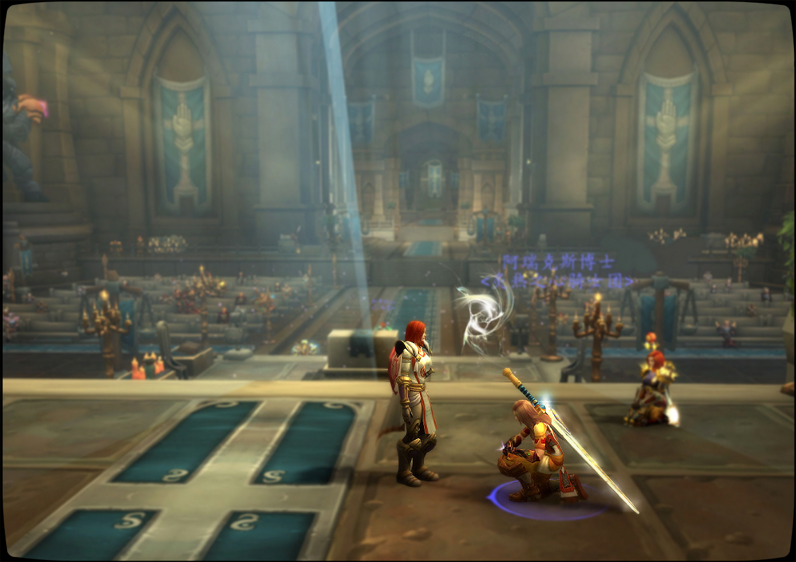
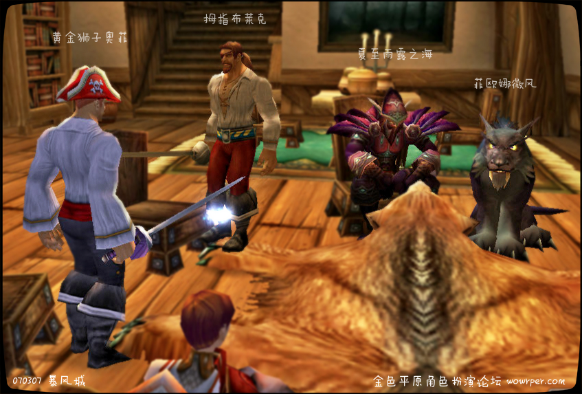

# 第三章 命运之剑

“当心间谍。”

法瑞看了手中的信件，信上没有署名。就在她正要走向祈祷室时，圣光密殿中的侍从佩里刚将这封加急信件递给她。等会她要主持见习骑士阿瑞克斯博士的祝圣礼，博学的阿瑞克斯是第一位在重铸时期加入骑士团的见习骑士——这封不详的信却出现在圣礼前。

部落的维维尔商会和影牙——如今对联盟的星辰降落徽记持有者进行大规模猎杀。但这并非最危险……法瑞知道这封信真正要她警惕的并非这些暴徒，而是她身边的人。“你相信你的战友，并愿意为他们而死吗？”法瑞想起这句骑士誓言。你愿意为一个间谍而死吗？

“我的领主？”阿瑞克斯打断了法瑞的疑思。阿瑞克斯从圣光密殿石墓静修室里走出，她已经祈祷了一整夜，但她并不疲惫。阿瑞克斯有一头淡金色的长发，身穿尽可能灵巧的板甲，背着一柄少校的巨剑。巨剑似乎和她修长的双手不相配，但她有着博学者独特的优雅——和信心。她是一名神圣骑士，修习圣光的学识，因此被称为圣光博学者。拥有学识和智慧，而非仅有蛮力，人就能掌握，甚至改变自己的命运吗？

两位骑士走过圣光秘境的大殿。大殿位于东洛丹伦圣光之愿礼拜堂地下，有着地底的寒风。尽管如此大殿尽头的雕花天窗漏进阳光，阳光透过三叶飘窗上缠绕的绿腾，直落在铺了深蓝天鹅绒的祭坛上。大殿实际上是一座地底教堂，每一扇彩纹玻璃窗边都立着一位圣骑士的雕像。他们都死了，成了雕像。

“你来自暴风王国的北郡，对吗？”法瑞带领阿瑞克斯走向祭坛。

“是的，”阿瑞克斯回答。这是她第一次来到洛丹伦，她只在书上读过洛丹伦的兴起和死亡。但最让阿瑞克斯不解的，是洛丹伦人身上的疯狂。“疯狂”——她只能用这个词，疯狂得足以让自己的王子毁掉一个国家，让整片土地变为亡灵瘟疫之地，又疯狂得去净化中洛丹伦的树木、田野和河流，让洛丹伦重新活过来。有一天这种疯狂会让他们回家。

“联盟七国的命运从未分离。我们曾并肩作战，”法瑞试着找到阿瑞克斯和骑士团的联系，尽管博学者本人并非洛丹伦人。

“很多事情发生了。暗夜精灵们也失去了永恒的生命。”

很多事情发生了，法瑞心想，圣剑骑士也失去了永恒的生命。炙热之心骑士团的第五任大团长杀死了第二任大团长，这是洛丹伦人的疯狂。

法瑞低头说，“艾泽拉斯的其他冒险者信任我们，在他们需要寻求圣光帮助时。或者需要看到闪亮亮的盔甲时。但无论如何，这就是他们口中的“那个骑士团”。所以……如果你要加入我们，你必须能承载，并执行这份荣耀。”

“我可以的。身为一名神圣骑士，看见他们受伤害我就难受……”阿瑞克斯几乎是脱口而出。

“那么跪下。”

阿瑞克斯连忙放下学者独有的，喜欢描述所有细节的习惯，跪在圣光祭坛之前。在圣礼结束之前，她将不允许被站起。她的膝盖发痛，因为她昨夜已经祈祷了一晚，但这比起一个见习骑士将要经历的训练不算什么。

法瑞雅开始想那些古老的句子，她几乎忘记了，但它们早已融进她的记忆。成为了她的血液，她的内心，她的灵魂。往事随着光芒照耀飞舞的尘粒浮现在她眼前——

“你连盾牌都拿不稳，”人民军的老书记兹彼希科说，老希科头发花白，但扎成了两条辫，“比武竞技输了还要哭鼻子。”

是啊，她还是见习骑士的时候，连盾牌都拿不稳。那时的法瑞不可能想象到如今她会站在圣坛的右侧——而不是左侧，亲自册封年轻的骑士。祝圣礼上一切似曾相识，她却不同了。她的手上沾了更多血。

“在圣光的感召下，我们齐聚在此。让神圣力量在我们的兄弟身上流淌。在光之辉的照耀下，她将获得新生。你，阿瑞克斯博士，是否宣誓接受炙热之心骑士团的荣耀与规章？”

“我愿意。”

“那么站起来吧，阿瑞克斯博士，欢迎加入炙热之心骑士团，你是一位见习骑士了。为了获得骑士团真正的接纳，前方还有很多试炼。有一天，我希望，我能亲自主持你晋升成为光明骑士的仪式。”阿瑞克斯的命运从此和骑士团的交织在一起。

一个月后法瑞回到暴风城。炙热之心骑士团作为教会军事代表，被邀请出席贵族威廉的审判——真是例行公事一样的审判，这场审判让忙于训练新兵的法瑞更为疲倦。威廉家族的威廉·影是个公子哥，和所有无所事事的贵族们有一样的喜好，那就是雷酒和美人。炙热之心骑士团中也有过贵族出身的骑士，黄金狮子奥菲就是这样的一位骑士，尽管对贵族生活标准的要求没有降低，他是骄傲的雄狮，但他没有威廉这种癖好。

威廉终究是惹上了麻烦。这次的罪名是“非法行使初夜权”，还是对一位修女。真是例行公事，法瑞心想，但她仔细听了法官贤者尼苛德摩对案情的描述。最后的结果更是和每个涉及贵族的故事一样，威廉拒绝交付教会对他的罪行的罚款，然后娶了这位修女，就无罪释放了。这是威廉的第四位小妻子。

“远离贵族。”

法瑞在审判前收到另一封隐秘的信件，不详之感再次涌上心头。没有人能直接命令炙热之心骑士团的大团长，就连暴风城的国王也不能。但是暴风城里的一些贵族，则是另一回事了。他们在势力争夺之中不惜一切，甚至与部落的仇誓者们相通。无论如何，威廉恐怕不在此列。

“这该死的家伙，居然没判到他。”尼苛德摩悻悻地说，他可不只是个有脾气的老头……他白袍上的紫色镶边象征威严。除了皇族，就只有高阶主教能使用这种颜色。这种染料由阿尔萨斯之泪混上秘银粉末制成——提醒着人们洛丹伦已经死去，而暴风王国长存。

法瑞上前去与尼苛德摩宗主教握手，但骑士已经很疲惫了。她只想回到骑士团的公馆，或许，再泡个放了宁神花瓣的热水澡。

“由于目前天威主教之位空缺，所以，在炙热之心骑士团重铸期期间，我希望能获得宗主教你和教会的支持。骑士团有时会执行对古神崇拜者的处罚。亡灵则就地处决。”法瑞平淡地说，这些句子说起来也味如嚼蜡。

“我暂时不确定你们行为的合法性。”

“抱歉，宗主教，你的意思是？”

贤者尼苛德摩拉了拉领子，他不认为骑士团如今有实力与教会对抗。事实上，任何与圣光有关的组织，都最好受到普世教会的管理。因为尽管别人都认为他是个啰嗦的老头，但他是一位学者。学者最求完美，尤其是教义的完美……理论层层相扣，容不得一粒水晶砂。

他严谨。

有人污蔑尼苛德摩进行的异端审判为了中饱私囊。不，他们不了解他，他们不相信他相信的事。比如说圣光的牧师必须是男人，而像法瑞这样的女骑士……必须圣洁。尼苛德摩想象她在信仰上完美，又足够坚定。事实上，要是少了尼苛德摩的虔诚，圣光教会这些年根本不可能维持。

“我需要确定你们的合法性，”尼苛德摩说，他要反复校验圣洁的信仰，只要资源允许，“安度因·乌瑞恩陛下为了对抗燃烧军团的再次入侵，召唤了旧盟友前往破碎群岛前线。但要确保所有响应召唤的圣光组织都公正无私，却是圣光教会的责任。事实上，我们甚至必须反复确认……不过，我们一定不能浪费太多时间，毕竟战况紧急。”

法瑞勉强挤出一个外交笑容，左手不自觉地抚上剑鞘。

“请尽快提交一份文书，以便我确认骑士团的合法性和安排随军主教，”尼苛德摩补上。

“请待骑士评议会之后，愿圣光与你同行，我的宗主教，”法瑞简短地说，她向尼苛德摩敬礼，然后转身背对主教径直离开。骑士团目前并未站稳，她不能威胁尼苛德摩，也不能显得过于败弱。圣光啊，她尚未有能力保护骑士团不被任何人或者亡灵威胁。

如今的骑士团连自己的命运都无法掌握。

三天后，高阶骑士评议会。

这是一间陈旧的圆厅。石室圆顶中的天窗上镶嵌着刻了火焰纹章的黄水晶。水晶内缠绕着圣光的光晕。这是一块歌唱记忆水晶，水晶内融合了一定的感光奥术能量，这种能量只要一接触到光就会染上这种光的颜色。爱兰佩雷斯曾经为它冲过能，然后用紫色的光吓过人。

法瑞轻声咏唱圣光术，点亮水晶。光倾泻下来，扬起一束积尘，映出椅上一个阴郁的黑影。那是一名长者。老骑士白发里有灰斑，大胡子里也有油渍。他坐在黑暗里没有动静，像一尊灰石雕像，直到光扑到他脸上——梅林·白银盾，另一个守护者联盟的叛徒。

骑士评议会的石室有环形高石台，石台后有七张雕花石椅。每一张椅上的雕刻都不同，从左边起依次是玫瑰之眼、命运之剑、圣光之冠、炙热之火、左羽翼、右羽翼和银盔。梅林没有坐在任何一张石椅上，他位置在高石台的最右侧，是一张简陋的乌木椅。如果一个人是一个叛徒，那么他永远都是叛徒。

法瑞走到正中央的石椅前，仿佛没有看到梅林。

“圣洁骑士，”梅林在她经过时咧嘴说。

她从来对白银盾没有好感。如果说帕拉斯·圣剑背叛守护者联盟一半是出于争权，另一半为了公义。那么梅林·白银盾的背叛——他应该被剥夺圣骑士的头衔。然而圣剑骑士当年接纳了这个叛徒，给了他这张乌木椅。

站在圆厅中央接受评议的骑士，是没有椅子的。

法瑞用铁手套擦去椅上的蛛网，坐到炙热之火王座上。她自然地身体后倾，左手托脸颊，好像她天生就属于这个位置。她甚至享受这种掌控感，尤其在近来一切紊乱之后——法瑞看了所有空座位——曾属于爱兰佩雷斯的玫瑰之眼，他如今为阿拉索的太阳而战。属于帕拉斯·圣剑的命运之剑，他死了，两次。属于天威主教艾卓拉斯的圣光之冠，她阵亡于中洛丹伦，那片土地的名不叫西瘟疫之地。属于拥光者克拉拉的左羽翼，巴鲁沙的右羽翼，还有塞拉夫·夜愿的银盔——光头骑士失踪了。

德莱尼骑士伊琳娜嘉尔吻了自己的剑柄，坐到银盔之座上。德莱尼人与圣光独特的连接让嘉尔感受到了艾卓拉斯的灵魂。她因此得以继承天威骑士之位。法瑞对她点头，而梅林几乎同时发出一小声冷笑，轻得像一根黑羽毛。一个德莱尼人，坐在天威骑士的石座上。

“大法师，缺席。圣剑骑士，缺席。天威主教，缺席。天威骑士，左翼和右翼，缺席，”嘉尔用德莱尼人那星宇磁场声音说。

“那么骑士评议会开始吧，”法瑞把戴铁手套的右手放上桌面，圣光随即沿着雕花纹路流淌。据说这项仪式是为了监测大团长的健康——当然还有虔诚，如果她不再能召唤圣光点亮所有雕文，那么她便不再适合炙热之火王座。

“日常训练新兵光明使者伦达、杰斯霍普、阿海洛以及阿瑞克斯博士。阿瑞克斯可能更擅长圣光祈祷。杰斯的通用语仍需加强，但他使用双手剑经验老道。嘉尔，你是坚贞者法法拉的导师了，”法瑞说，“但我今日召唤骑士评议会，是因为……”

“因为你和你的鲁莽又给我们找了闹剧，圣洁骑士？”梅林冷笑道。

法瑞一时说不出话。多年的征战和政治纷争让梅林变得——说话非常苦涩，但骑士团有尊敬长者的规条。她比他年轻。但这并不是她怀疑自己的原因，血统论在她心中毫无根基。她只是想起帕拉斯的话，你连统治的根基都不了解。

“请叫她大团长，白银盾骑士。”

“德莱尼人不要和我讲话。”

“够了！”法瑞用左手锤桌面，铁手套敲上石桌震下的灰尘落到梅林鼻上。她改用两手撑桌面站起身，桌上的圣光纹路更耀眼了。几乎让嘉尔别过头去。

“圣光教会的宗主教尼苛德摩下令，对骑士团的合法性进行调查，并准备派遣随军牧师。他还要求我们，上交一份包含所有成员档案的文书。”法瑞站着说，声音低沉。这调查猝不及防，毫无征兆，就像不详的黑色星期五。

“鉴于骑士团的……历史。”法瑞继续道，瞥了一眼梅林，“我们必须谨慎对待这种窥探，保护我们的兄弟姐妹们的过去，尤其，是圣剑骑士的过去。”还有我的，她没有说这句，“骑士团的荣誉就是我们的生命，这句话没有虚的地方。然而尼苛德摩……”

“干他啊，”梅林强硬地说。

“给他一锤子！”就连嘉尔也跟着附和。

“我们不能现在就和教会冲突。首先安度因国王不会为了我们和教会冲突。其次，教会不会为了我们和国王冲突。”

“不要忘了尊严是打出来的，我的大团长，”梅林在读最后几个字时明显地不屑。从前的他认为骑士团就是他的一切，直到命运毁了他。不过那是另外一个故事了。

“我为洛丹伦而死，以誓之名灰烬重生，”老骑士起身走向门外，他的盔甲发出一阵吱扭声，只留给法瑞一个黑色苍茫的背影，“你上烤架的时候可以说这些。”

当晚法瑞便将骑士团的拒绝信交给圣光教会的信使，拒绝快如雷电。夜色全黑时，她和嘉尔按约定于矮人区银行见面。这一件事，则要比闪电还快。

银行内室粗糙的石墙据说有三尺厚，墙面冰凉，附着了隔音奥术。若是贼人被困在里面，无论怎么敲打，外头也听不见。墙上镶嵌了数千个保险柜，柜面没有数字标识，事实上它们看起来都一样。据说这是为了只让保险柜的主人记得标号。

“第134号储存柜，”法瑞说着将钥匙插进锁孔，柜门咿呀地旋开。柜里很深，甚至能放进一具尸体。

嘉尔站在法瑞身后，她感觉有点紧张。

法瑞从柜里拖出一叠带血红纹章的战袍，至少有十五件，那不是炙热之火的标识——而是枫叶状的血纹，鲜红的枫叶啊，是洛丹伦的枫林里最后的挽歌。血色的旗帜，血红的洛丹伦。这些是血色十字军的战袍。

北方的洛丹伦王国毁于亡灵天灾后，遗落的前白银之手骑士团成员组建了血色十字军。十字军的愿景自然是复仇，清缴亡灵，恢复洛丹伦的荣耀。十字军固执地认为亡灵可以伪装成人，因此他们隔离、拷问所有人。后来新白银之手骑士团兄弟阋墙，与联盟一道共同裁决血色十字军为异端。

《炙热之心骑士团编年史》上记载——“没有人知道炙热之心骑士团内有多少前血色十字军成员。对此，白银之手骑士团曾经派出过信使，想要就此事进行交涉，但被帕拉斯·圣剑拒绝了。黑暗之门27年后血色十字军被视为邪恶的堕落者，圣光的背弃者，被联盟——尤其是白银之手骑士团仇视。此时炙热之心骑士团的大团长帕拉斯·圣剑为了与血色十字军“划清界限”，曾下令更改骑士团的纹章。”

“炙热之心骑士团的纹章原本是白色罩袍上的血红火焰。没有人知道这其实是血色十字军的早期纹章，在血色十字军尚未采用血色枫叶作为徽记时，他们已经使用过鲜红的火焰。除了血色十字军的几个高阶军官，已经没有人记得这件事。亦或是，记得的人都死了。”

“难道骑士团真的和血色有联系吗？”嘉尔的疑问打碎了法瑞的回想，“可您是那么圣洁勇敢，和那些记载里的完全不一样。”

法瑞的眼睛闭上，再睁开。不，我比那些记载里的更糟。她只是将剩余的战袍全部取出。

“大人，虽然我不太明白，但您现在似乎已经和血色十字军，不再有更多联系了吧。”

“没有联系我知道，但是……”

“为何还要保留这些？”嘉尔逼问。

“我……我想念他们，”法瑞第一次觉得身上的盔甲很重。血色十字军是她的噩梦，而她无法醒来。这种溺水的绝望感时常纠缠她。她虽然不说，但她想念他们每一个人，记得每一个名字，每一个人的挚爱和痛苦。

“他们都是一个个活过的人，对于我而言，不是‘嗜血’的十字军。宗主教尼苛德摩将要调查我们，这些战袍是第一批要扔掉的。我拜托你帮忙处理骑士团在暴风城的金币。”

“这些财产要转移到哪？”

“那些，对于世俗之人，可能是更大的引诱，虽然我相信教会……好吧我‘希望’教会不是为了那些。财产转移到铁炉堡。”

“矮人能抗拒那些主教的审查吗？”

法瑞看了眼前的德莱尼人，恐怕德拉尼骑士仍不了解人类内心的贪婪。矮人毕竟不是人类。嘉尔只是记录了其它保险柜的编号。

“还有这个，”法瑞垫脚够到一把巨剑。巨剑锋利，剑神有两道尖刺，而剑柄裹了一层青晶，中心镶嵌了一颗火焰红宝石。它并不是一把默默无名的巨剑，也不是苍白的正义。

“它曾被圣剑骑士所拥有。它有一个名字，叫‘命运’。”

“您是指帕拉斯先生？”

“是的，命运之剑，”法瑞举剑召唤了一道圣光，光芒流进剑身上的刻字“fatur”里，细水溪流，命运无常，“听我说……”

“但听您说他已经堕落了。”

“圣剑骑士不会再回来了，我……”

嘉尔对眼前的事感到棘手。她甚至无法理解堕落，圣光是德莱尼人的全部，除此以外，没有别的可行之路。她摇头，但法瑞抓住她的手腕，用力捏得她生疼。嘉尔惊讶于眼前的人类骑士似乎对不同种族的身体构造都了解。

“你发誓你不会告诉任何一个灵魂，我将要说的话，”法瑞看进她的眼睛。这一刻，嘉尔看见了圣剑骑士的灵魂，它和法瑞的绿眼睛一样，深不见底，却又像一面落了星光的水镜，漆黑但透明。没有光芒，但这种目光能看透每一个灵魂。

“我以圣光之名发誓。”

法瑞终于松开她的手。圣光对于嘉尔，是自然而然，无需多祈祷的。因此这些人类让她困惑，他们的焦虑太多了，灵魂太急躁。嘉尔则能感知到法瑞的灵魂，法瑞的灵魂里有一个巨大的空洞，像大地的裂痕，一直折磨她。却也让圣洁骑士了解所有人的心。

“我杀了他。”法瑞的声音几乎听不见，每一个字里都透着悲伤。眼泪流干了，风消逝了，雪也停了之后的悲伤，连圣光也带不走它。

“什么……”嘉尔甚至觉得自己不认得法瑞了。这句话就像一根凿进晶石的钉，在她的信心上敲开裂痕。这让嘉尔感到眼睛发麻。

法瑞看到了她眼里的恐惧。

“所以，你还愿意跟随我吗？

“法瑞大人，今天我必须承认是我加入骑士团以来最让我震惊的一天，但我知道您的品格。我相信您做出了最有利于骑士团的事。您救了我和那么多德莱尼同胞。血色或者任何残忍的组织的人，不可能做这些。我们德莱尼只相信自己亲眼看到的。”

后来嘉尔看到了黄金狮子奥菲的坟墓。那是一块暴风城灯塔下的无名墓碑。狮子是洛丹伦的贵族，血色十字军战士。如今只是一座野坟，甚至不在洛丹伦的土地上。法瑞跪下，将额头抵在墓碑上。当年奥菲曾为了买下暴风城的一栋房产，与无赖拇指布莱克先是口角，又是决斗。

在决斗之前，他戴上夸张的海盗帽，像一位真正的骑士上战场前那样给了法瑞一个飞吻。骄傲不羁的水中之狮，他的笑声他的细剑，他就是一个金色的船长。如今给你炙热之心骑士团遍布艾泽拉斯的银行系统，能否买下一座墓碑？

“愿你安息，我的战友，”法瑞的额头仍抵着墓碑，但石碑冰冷。

不等嘉尔能安慰她，她又趁着夜色走到灯塔最远端。

“难道你真的要扔掉全部的过去？”德莱尼骑士的行踪泛起悲哀，她不理解。但圣光在她耳边咏唱，海边的浪花挽歌，低转呢喃，时光记忆与丰收年佳，骑士之死绝境长眠。

法瑞雅将那一包血色战袍放进用石头加重的袋子里，扔到海中。

“希望这沉重的代价，能换来好的结果，”晚风渗进嘉尔的盔甲，月色又太冷。

“你知道，帕拉斯圣剑，他是血色十字军的高阶指挥官。而我，曾经是十字军审讯官韦沙斯的副手。他死了以后，我是说韦沙斯死后，我接替了他。所以……我真的不知道怎么面对这个‘调查’。”

火刑架对她而言，已经算仁慈了。恐惧让法瑞的双眼涌起泪水，她害怕这个耻辱，但她更惧怕不必要的痛苦。她无法对嘉尔说这些。

双月落下后，法瑞和嘉尔来到旧城区的一口枯井边。法瑞将命运之剑挂到井绳上，慢慢沉进干枯的井中。枯井的寒气让嘉尔感到不舒服，井里甚至有亡者的低语。

“这或许是它的‘命运’吧，”法瑞面无表情地说。

“我们是不是做出太多牺牲，”嘉尔不愿往井里看。

“有一天我们会来取回它，”因为这是命运之剑，骑士团最后的象征，法瑞的手抓着井边要将铁手套抓出凹痕，“然后重新把握我们自己的命运。”

这是一个未尽的誓言，骑士团如今就像枯井中悬挂的命运之剑，无法把握自己的命运。

“我还想问一个问题。如果教会到头来觊觎我们的财产，或者强行要解散我们，我们是否保留使用武力的权力呢？”嘉尔伸手安慰法瑞，她的手上有圣光的优雅。

“当然，我愿意为骑士团而死。”

（第三章完）

.jpg>)

命运之剑完整扮演记录见《命运之剑》


本章属于大型互动剧情《黑色星期五》的第二幕，快点传送门去参加！
