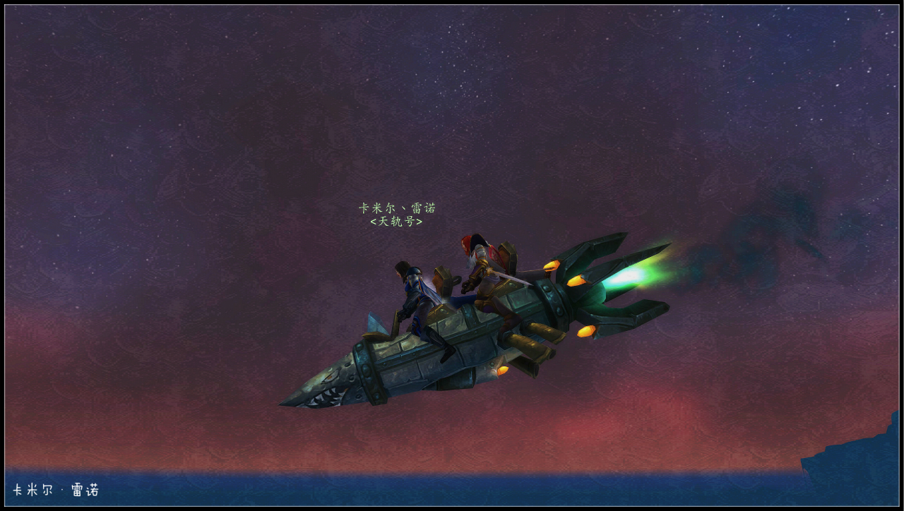
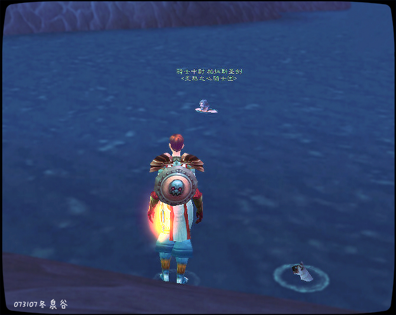

# 第一章 世界的末时

她远行过许多个世界，见过许多种族直至知晓他们的内心，如今她只想带着幸存的骑士们回家。艾泽拉斯的荒野众神，星穹之上的群星泰坦，极光凌冽的万神殿堂，还有那圣光的华羽……召唤你们，噢伟大的诗篇，召唤你们。听那号角声！古老与新生的英雄醒来。死亡并不是终末。

这是这个世界的末时。

法瑞站在斯普兰提尔城中心花园秘境中。这是贝林姆斯最为繁华的人类城市，城中的大理石柱廊围绕中心花园展开，这就是世界的中心。花园中绿荫婆娑，远处传来琴声，人们走过回廊，谈论着艺术品或者法力甘泉——一如往日的苏拉玛。但这个世界正在死去。

将要亡绝的气息弥漫在空气中。这个世界的人也警觉了，首先是城中不同部族的仇杀，然后是将要建起的北境长城，到临海郡离奇死亡的渔人——官僚化的议会，不断萎缩的边境，颓废甚至扭曲的艺术——这些都让斯普兰迪尔的人们开始忘却这座伟大城市的文明基石。他们曾骄傲地宣称贝林姆斯世界是自由的，如今骄傲的声音化作叹息，又慢慢地染上绝望。

大约一千年以前，斯普兰提尔的建造者杀死了原本居住在此的原住民，用大理石和奴隶建立起自由之城。或许他们想错了，自由之城自兴起之日，就充满奴役和不公。为此原住民的首领萨拉死前曾诅咒斯普兰提尔，他说，“这个世界的兴盛延续不过一千年。”

“一千年之后，斯普兰提尔，甚至整个贝林姆斯都会死去。城里的人会首先相互残杀，只有凶残的人会活下来。活下来的人则要承受更为残酷的天罚，人们会眼看着农田枯萎，林中结满白霜。因为自己的罪过而绝望地等待整个世界死去。”

这一千年来，萨拉的诅咒早已成了笑柄。骄傲的斯普兰提尔人不相信命运，他们只相信力量和他们自身的伟大。他们的国度和他们的城市会兴盛，成为整个世界的明灯，像灯塔一样指引航船。

他们到底是太傲慢了。

最近城里每一天都有人因为部族仇杀而死，法瑞只是一个旅者，在斯普兰提尔陷入混乱时，她只能用剑盾保护自己——因为她显然是最好的劫掠目标之一。或许她还能用圣光保护自己。圣光？红发骑士低头看自己的手。

圣光。这个词甚至让她感到陌生。

“圣光术，”法瑞抬手，但什么也没有发生，她的指尖上没有一丝光辉。

她怎么会忘记，贝林姆斯世界里没有圣光。她离开艾泽拉斯已经六年了，这六年来她无法召唤出任何光芒。她早已学会了不用圣盾术保护自己，不用圣疗拼上断骨。没有圣光，也没有骑士团。

六年前法瑞认识了位面旅者吉薇艾尔。那时她仍被软禁在镶金玫瑰，得知血色十字军败亡，而炙热之心骑士团选择袖·手·旁·观后，她有些……不知所措，她就跟着吉薇艾尔去远行……血色十字军是她永远的梦魇，但她本以为对于骑士团而言，让洛丹伦人活下去才是最重要的。

圣剑骑士还有骑士评议会显然不这么认为。

如果他们对联盟对于血色十字军的判决哪怕显示出一点异议。整个骑士团就会暴露在外，他们毕竟是一个已死国度的流民，暴风王国待他们再好，也无法改变他们的身份。就像法瑞永远不可能成为贝林姆斯人，因为她来自艾泽拉斯。

斯普兰提尔正在死去，但在城心花园一切仿佛如旧。法瑞仍站在那，茫然地听着远处的琴声。她抱着自己的双臂，不再徒劳地召唤圣光。她从来没有感觉这么害怕过。那一刻她突然意识到——她不想死在这。

她不想死在这。

斯普兰提尔对她的命运毫不关心。就像暴风王国的贵族们对血色十字军毫不关心，他们可以随意为十字军安上叛徒、狂热者的名号，然后杀死洛丹伦人。洛丹伦已经不在了，没有人能保护她的子民。

她不想死在这。

“哟，你发呆作甚？”一个路过的斯普兰提尔人嘲笑道，他们认为发呆是不好的，没有活力，发呆的人最好被当做奴隶。

法瑞没有理会他，径直回到住处。

待到法瑞来到自由之城海边那天，城中已经有两个区因为仇杀陷入混乱。但她不在乎，她对斯普兰提尔的命运毫不关心。她走进海水里，右手紧握着碎心石。吉薇艾尔与她分别时，给了她这个礼物，吉薇艾尔说，“现在你就叫法瑞雅了，你的名字听起来就和我的一样。拿着它，它可以实现你的最后愿望。”

碎心石是一种强力位面旅行石，传说它可以带着旅者去到星云中任何一个世界，甚至是梦中世界。如果目的世界只存在于梦境中，那么碎心石会杀死使用者，好让他永不醒来。然而因为碎心石过于强大，即使目的地世界存在于物质界，用它来旅行仍可能会撕裂旅者的灵魂。

法瑞把碎心石敲碎在礁石上。

蓝色能量光丝瞬间缠绕上她的手，她仿佛被蓝色闪电击中了，水面升起巨浪。法瑞奋力抬手，浪花扬起她的红发。在被水潮吞没之前，她将碎心石猛撞上自己的胸膛。碎心石完全裂开。

“艾泽拉斯，”浪潮没过了她的祈祷，我回来了。

冰蓝色的传送魔法渗进她的血管，沿着她的脖颈上升，她全身感觉都要裂开。法瑞在巨大的痛苦中思绪游移，她想，这就是神圣干涉祷文的感觉，死亡的感觉。在艾泽拉斯，任何一个骑士在读出神圣干涉祷文时都会被它夺取生命，然后以死去的骑士灵魂铸成的护盾会暂时保护一个人。

碎心石的能量穿透了她的双眼，让她盲目，眼前的世界瞬间消失。只有蓝光在烧灼她的眼，一点点洗去她眼里的蓝色。法瑞曾经拥有天蓝色的眼睛，而战斗法师爱兰佩雷斯会在诗里写道——她的眼睛，仿佛是天使的双眸。

但她不是一个天使。她是血色十字军审判者詹姆·韦沙斯的副手，她是炙热之心骑士团的西瘟疫之地指挥官，她是圣洁骑士，位面旅者……她是那会用带刺的盾面拍亡灵脸的圣骑士。她的红发和蓝眼睛在你的心里。

海水灌进法瑞嘴里，她突然意识到自己已经不再站在浅海中——她在大洋中心！法瑞的双眼仍刺痛，她极力看了四周，深蓝直接天际。星海之中竟有两个月亮的浅痕。那是艾泽拉斯的双月。

她挣扎着才能勉强浮在水面，回到艾泽拉斯的狂喜突然被绝望取代。无尽海心中的她必死无疑。不过……死在双月的光辉下，亦是死得其所。法瑞逐渐失去意识时，不知道她扑腾的水花中带着几缕圣光的辉华，她回家了。

“报告指挥官，海里有闪光水母，”暗夜精灵奥莉薇兴奋地说。

卡米尔·雷诺翻白眼，奥莉薇就像她那长不大的妹妹。卡米尔叹了一口气，她有时很担心如果有一天她离开了舰队，奥莉薇、希维娅，还有云秀会是她最放心不下的几个。话虽如此，卡米尔不会让奥莉薇看出自己的想法。指挥官面不改色，很不情愿地往天轨号船缘外看了一眼。她皱眉。

那不是什么闪光水母。

那是圣光术——洛丹伦的光纹。一个洛丹伦人，在潘达利亚？

“放下翼船，另外舰载机3号打开海面探照灯，”卡米尔在探照灯下终于看清了，海里有一个女人，“好吧我们得把她捞上来！”

指挥官不容置疑地说，卡米尔的声音低沉而有力。自从被雷诺家族收养，卡米尔就是那最不让人操心的，她有一大群弟弟妹妹要照顾。她生来就是一个战士，一个陆战队指挥官，暴风王国雄狮徽记所有者，联盟远征指挥官，皇家舰载直升机飞行员……或许她经常忘记照顾自己。如今的卡米尔是天轨号的指挥官，而天轨号——

天轨号破天者级天际炮艇隶属联盟第三舰队——卡米尔记得每一个船员的名字，也记得天轨号上的一切——左右翼共配备六门诺莫瑞根轨道炮，口径为460mmx21，12m工匠式舰载炮。炮艇机底装载两门双联425mm奥能电磁炮，甲板配置4座舰载机，腹仓科容纳20架旋涡武装舰载直升机，3架运输火箭，动力系统采用1座B2C型水压反应堆2旋涡推进，科兼容40%奥术能量运作。她是联盟展翼天际的雄狮，她的外装甲由萨隆邪铁优化合金铸成，她是卡米尔的家。

啪！卡米尔拍了陌生落水者的脸，这掌用力了点。

“我……”法瑞睁开双眼——她的眼睛褪成了绿色，但她看不清。法瑞看见一张白皙的脸庞从模糊变清晰，又变模糊，看着她的女人有一头乌黑长发，乌黑彷如无星之夜，“阿尔温？”

从来没有人叫过卡米尔这个名字，卡米尔却愣住了。她好像听过这个名，但不知在哪，它既熟悉又陌生。这个名字甚至让卡米尔微微发抖。训练有素的指挥官用手握住剑柄很快稳住自己。

“远行者？”法瑞记得这张脸庞，但她的记忆散落了。

“听着，陌生人，我不知道阿尔温是谁，”卡米尔用命令的语气说，“我是联盟第三舰队指挥官卡米尔·雷诺。你对自己出现在潘达利亚战区有任何解释吗。回答我！”

法瑞昏死过去。

三天之后。法瑞在雄狮港的监狱中醒来。骑士头痛欲裂，但至少卡米尔给她留了条毯子，不然她的骨头都要冻坏。那么，我回来了，她想，自顾自地笑出声。“哈哈哈，”这笑声对比牢室的凄寂，听起来真有几分疯狂。法瑞拉开衬衫，低头看见自己胸前多了些裂纹般的疤痕，那是碎心石的痕迹。疤痕延展像是火焰，胸前的火焰之心——是炙热之心骑士团的纹章。

“为什么？”法瑞不解道，这不可能。碎心石烧灼的疤痕应该是随机的，没有意义，而不是像现在这样。除非有人在召唤碎心石的使用者，并用星界的能量对其进行传送。这不可能。

有人在召唤骑士团。

这不是一个好兆头。能进行这种召唤的人，除了泰坦、纳鲁等高阶生命体，恐怕就只有恶魔和通灵法师了。但为何一个通灵法师要召唤炙热之心骑士团？还有其他骑士被影响了吗？

牢门打开，法瑞连忙捂住疤痕。

“指挥官雷诺要见你，”士兵说。

“那么，你来自炙热之心骑士团？”卡米尔·雷诺将那块从名牌丢到桌上，牌上刻着“法瑞·图尔加斯，圣洁骑士，炙热之心骑士团”。

法瑞一言不发地拿起名牌，手握成拳。

卡米尔对她点头，随即站直行了一个军礼。天轨号指挥官的军礼干脆利落。

圣洁骑士是法瑞从前的称号。她曾经为壁炉谷的血色十字军做过的事——却毫无圣洁可言。然而正如圣剑骑士帕拉斯·圣剑是唯一的，炙热之心骑士团也只有一个圣洁骑士。“过于可爱”的德鲁伊艾尔宁静之歌曾说：法瑞是他见过的最年轻，最简单的骑士。然而太天真怎么会是一种骑士的美德？无论如何，她因此被称为圣洁骑士。

法瑞不知所措地扬起眉毛，她仍然头痛欲裂。她知道她认得眼前这位黑发指挥官的脸，但她怎么也想不起来了。

“我曾经在圣剑骑士的分队里，那时他还不是圣剑骑士，”在法瑞能询问之前，卡米尔就说道，“他……和其他人很不同。但那是很久以前的事了，”卡米尔的脸上第一次露出疲惫的神色。认识她的人会以为她无所畏惧，她总是那么——雷厉风行。艾泽拉斯里的确有令卡米尔·雷诺畏惧的事，但她**并不在乎**。

话说回来，炙热之心骑士团只有过一位圣剑骑士——帕拉斯·圣剑。帕拉斯很有魅力，没有人能忘记他。因为人们总会不由自主地想要追随他，好靠近这种天生的，接近纯粹魅力或者纯粹情感的事物。然而圣剑骑士也是骑士团里唯一能称得上“会发呆”并且“惹人烦”的骑士……

“圣剑骑士还活着吗？”法瑞问，她开始放下防御。

“我不知道。看，骑士，如果你想要我帮你，你得先告诉我你怎么会半夜出现在那海里。”

“今年是多少年？”

“黑暗之门33年。”

“我离开……艾泽拉斯，六年了，”法瑞谨慎地挑选着字句。

“你去了外域对吧？”雷诺坐下，在报告里填上：外域。

“有点像外域……”法瑞正犹豫要不要提到贝林姆斯。

“你去了外域，然后传送回来的时传送门开错了，对吧，”卡米尔在下一栏填上：传送门不稳，然后她制止了法瑞，“你不需要告诉我其它细节。而且……你对其他人，不要说。对我说可以，但我最好不要知道。如果你之后决定回到暴风城，你要小心自己说的每一句话。”

“为什么？”

“金色平原之幕变了，”卡米尔平静地说，“如果你没有骗我，骑士，你离开了六年。这六年里发生的事……好吧，你先告诉我炙热之心骑士团战旗室的铭牌上刻着什么。”

法瑞犹豫了，她不知道自己能否信任卡米尔，但铭牌上那句话早已刻进她的血与骨。如果她战死，甚至惨遭厄运变成被遗忘者，她可能会将那句话带到她的坟墓里，“为了失落的洛丹伦的荣耀。”

卡米尔露出一个笑容。她很少笑。但她笑起来就像银月下的森林，是星光下冰冷的美丽。看来眼前的落水鬼确实是圣洁骑士本人，卡米尔想。

“跟我来，”卡米尔说，她离开指挥厅时为自己披上一件深蓝色的斗篷。指挥官也为法瑞拿了一件。斗篷能盖上法瑞火红的头发。

“我们去哪？”

“看，”卡米尔指着远方岩崖顶的竹屋。潘达利亚的迷雾溶解了暮光，缥缈着金紫色的薄暮，山巅入云。如果说潘达利亚是一副画，那么从雄狮港看过去，竹屋就近在画中——“纳松岭，”卡米尔伸手将法瑞拉上火箭时说，“我把她带到那，因为从雄狮港正好能看见她。尤其是在入夜后，如果山上没有一点灯光，她就是遇到了麻烦。”

法瑞正要问是谁。火箭引擎的爆裂声就盖过她的声音，新的冒险开始了。

纳松岭立于海中，由奇岩所构，极其陡峭，一如潘达利亚的群山。潘达利亚的山水画中尽是三千尺高的峭壁山头，传说山巅有仙人的居所，仙人乘飞鹤而去，腾云驾雾，得道而自由。纳松岭竹屋简朴，屋前有一小道竹制空港，竹屋唯一的装饰就是屋顶拉着一顶彩燕风筝。


竹屋的主人不是仙人，而是一位金发碧眼的姑娘。


“冬妮！”法瑞不等火箭落稳，就踉跄下去，跑过去抱住冬妮，“冬妮你还活着！感谢圣光，纳鲁，或是别的什么宇宙能量，你还活着！”


如果说炙热之心骑士团是一个圣光兄弟会，那么冬妮就是他们最小的妹妹。杀光哥哥姐姐，但不能杀死最小的妹妹。


冬妮轻轻将法瑞的头按向自己的肩膀，她的左手自从腕骨碎裂后，再用圣光术复原也毫无知觉了。但法瑞不需要知道这些，冬妮想，她能感觉到法瑞喜极而涕的眼泪渗进她的亚麻长袍，一切都像从前那样，不是吗？


冬妮招待两人进屋，沏了一壶柔丝茶。


卡米尔关上门，将竹门锁紧了然后才席地而坐，脱下铁手套。纳松岭险要，无人能攀上峰顶，只能乘狮鹫或者直升机抵达。这样很好，有人来时他们就一定会听见。


“我在这屋里说的话，”卡米尔顿了下，“你，一个字也不可以漏到屋外，发誓。”


“以圣光之名，你拥有我的誓言。”


“很好，”卡米尔看了一眼冬妮的左手，然后看进法瑞的绿眼睛说，“我们的世界正在死去。”


法瑞感到胸口上的火焰疤痕处传来一阵剧痛。她身经百战了，圣骑士在战斗中忽略痛苦而不倒下。这种痛苦只是让她深吸了一口气。那么她是从一个正在死去的世界，回到另一个正在死去的世界了？艾泽拉斯对她的命运毫不关心。


“怎么个死去法？”法瑞问道。这听起来很疯狂，但最理智的做法是问个究竟。除了关心艾泽拉斯的命运以外，她别无选择。


“不是燃烧军团的入侵，”卡米尔看出法瑞的疑问，“也不是天灾。有人在猎杀星云降落徽记持有者。”


星云降落徽记是艾泽拉斯——金色平原之幕的传说。黑暗之门20年，守护者联盟合并六大冒险者联盟，划定冒险者们拥有“原住民”的头衔，其他人则被称作“外域人”。然而这并非星云使者们的本意。


冒险者们可以通过各种非艾泽拉斯势力获得星云降落徽记，甚至召唤星云使者之力。


“持星云徽记者，降落到了他们应降落的世界，”星云传说之卷上写道，“他们的目的是让这些世界活过来。”金色平原之幕上所有冒险者都被询问过是否接受星云徽记，因为徽记使者就在联盟与主城的入口。法瑞、卡米尔和冬妮显然都拥有星云徽记。


获得徽记的人约定要遵守徽记上的守则——即完全活在艾泽拉斯之中，甚至忘记任何关于其它世界的记忆。


因此传说拥有星云降落徽记的人最终都会疯掉。甚至仇恨艾泽拉斯。


而更多的人对星云降落徽记不以为然。那不过是一小块被云状金丝包裹的蓝水晶罢了。黑市里十金币一个。


“仇誓者从来就有许多。我们早就整个世界地通缉笑嘻嘻的蓝猫了，这不足以为虑，”法瑞指出，她看不出一两个仇誓者怎么就能毁灭艾泽拉斯了。


“你知道誓言上所说的，最后一个持星云降落徽记死去，这个世界就死了。我们正在死去。每月都有新的攻击，袭击者们都十分残忍。他们折磨受害者。而且，有太多迹象指出，这些攻击的背后支持者来历众多，从暴风王国的贵族，到部落的部族武装。我们正在死去……”他们焚烧了冬妮在希尔斯布莱德的农场，踩碎了她的手，雷诺说不出这句。


“一个月前，沉重的钱袋的铜丝老板也被逐出暴风城，”冬妮说。


“诺贝尔？”法瑞上身前倾，她当然认识铜丝老板。诺贝尔·铜丝失去沉重的钱袋——那间酒馆可是老侏儒的一切。他每天坐在吧台后面擦亮一枚银币，他说，他在等玫瑰女士回来，“他现在安全了吗？”


“铜丝活着，但他的心可能恢复不过来了，”卡米尔叹气道。


“谁做的？”


卡米尔饮了一口茶……娓娓道来。星辰间没有这次谈话的记录，没有一个灵魂能窥探纳松岭竹屋的秘密。毕竟，毁灭一个世界的话是不能说的，拯救它亦然。这不是一个普通的冒险故事，它活着。一个人只能看见一个已死的故事的全貌，而这个故事还活着。


多年以后，雷诺、法瑞和冬妮会回忆起纳松岭上的彻夜长谈，并叫它茶道会议。


自狮王之傲时代建立的炙热之心骑士团如今已解散6年了，老去的骑士们失落在艾泽拉斯，抑或是不知名的世界。他们再也不会在狮王之傲举杯相聚，盾牌不再被擦亮，剑暗淡了。然而燃烧军团再临，瓦里安的意外战死……继任的年轻君王下令重铸骑士团。


黑暗之门33年，法瑞·图尔加斯奉命于暴风城光明大教堂的地下室中取回骑士团法典，随后前往艾泽拉斯各地寻找存活的骑士。


她要找的第一个骑士就是帕拉斯·圣剑——炙热之心骑士团的第二任大团长，唯一的圣剑骑士，最后的月亮照耀着山谷诗人，骑士团的传奇……拇指布莱克的噩梦，罗兰·塞克的好友以及守护者联盟的叛徒。


据说帕拉斯·圣剑死后成为圣光的背誓者——死亡骑士维萨里奥·黯刃，然而，维萨里奥也死了。人总不能死两次，此后再也没有了圣剑骑士的传奇。


为此提尔之光十字军的指挥官安娜丝塔西亚曾警告法瑞：“远离黯刃！”


依靠冬妮留下的线索，法瑞终于找到雷霆崖下金色平原大草原边缘的一座帐篷。她拉开帐帘，一束阳光照进帐中……刺痛了里面的一个黑影，皮肤烧焦的味道瞬间充满了整个营帐。


“不！”法瑞连忙松手，反射性地拔剑。


她知道这意味着什么，只有不死生物惧怕阳光。


“领主？”她问道，法瑞心底深处仍抱有一丝侥幸的愿望，或许大领主还认得她。她想起那一年在冬泉谷，圣剑骑士卸下盔甲，跳进温泉里。法瑞和她的黑额白猫则站在岸边看。她恐怕不适合泡温泉——她就是要显得优雅，总不能像帕拉斯一样，把盔甲胡乱丢一边然后跳进水里。

但她从心里感到快乐，她说，“连我的猫都在吐白气，好冷。”圣骑士的生活里除了征战，没有其它，连这一个下午的闲暇都是他们偷来的。这是最美好的时光。

“还不是帮卡米那小女孩。噢，我的小狼……”帕拉斯在水里说，“糟糕，我把他忘家里了。”

“养狼很危险。”

“我经常梦到我是那大草原上的孤狼，奔跑在阳光下，获得自由。你说，我是不是更适合当一个猎手，而不是一个骑士？”

法瑞侧身走进帐里，终于看见了里头盘腿而坐的黑暗之人——一个身穿全副盔甲的死亡骑士，他的冰蓝色眼睛空洞，仿佛是死亡本身。

如今帕拉斯的愿望实现了，法瑞心想，他来到了金色平原。金色平原大草原中的牧草绿得泛金，只是他再也无法奔跑在阳光下。

“领主，帕拉斯？”法瑞再问，她不会问第三遍。

“我认得你的脸，和你低贱的血统，”死亡骑士用嘶哑的声音说，“你认为我叫帕拉斯？曾经用过这个名字，是我的耻辱，直到我意识到，这些都是毫无意义的。宇宙中有无数个世界，而艾泽拉斯，太小。联盟和部落，不过是其中最微小的乌合之众群体。高贵的草原之狼的思维方式和你们，呵呵，完全不同。你们，尤其是你，只是个刻板学习者，我则懂得六种语言，拥有草原孤狼，山地雄狮，还有那茲鸟的血统……你们这些联盟的人，我看根本称不上是人，你们既没有历史，又没有对草原之灵的敬畏。”

“帕拉斯你能听见我说的话吗？”法瑞不解地问。

“那当然，是你听不见我说的话。我知道你一定想要重铸炙热之心骑士团，对吧，你所想，所做的一点都没有超出我的预期。我都一清二楚。”

“抱歉，我不认为你懂我的心。”

“就连这句话，我也预料到了。你不过是一个平民，你连统治的基础是什么都不懂，你认为你是大团长了么，法瑞？像你这样的人，我见的多了，见的多了。我在这世界上旅行，见过最憨厚又最暴躁的牛头人，最有趣又最虚伪的人类，而你，并不有趣。”

“我的领主，”法瑞几乎不想用这个词，眼前的死亡骑士在亵渎她所认知的一切，“我重铸骑士团，并不是为了我自己，甚至不是为了圣光或者联盟之类。”

“你做不到，因为你无法理解这件事。你的血统太低贱了，你根本无法理解我说的话。别忘了，当年你是第一个离开骑士团的人。”

眼泪从法瑞的左眼滑落，眼前人确是帕拉斯无误，只有圣剑骑士能一语刺中她的弱点。她最不愿提及的事，她的耻辱。她是一个背誓者，而背誓者狡诈，只喜好权力。不，她对自己说，这不是她重铸骑士团的原因。

“我劝你赶快离开，”帕拉斯继续道，“金色平原之幕不过是一个小地方，从前和你一起冒险的人，其实都不存在。你们这些人没有贵族之血，根本不能理解我说的话。”

“不要再说了。”

“曾经和你们一道，是我最大的耻辱。”

“**不！**”眼泪滑下她的右眼。在眼泪滴落前，她反手将剑刺进帕拉斯的心脏。

（第一章完）

