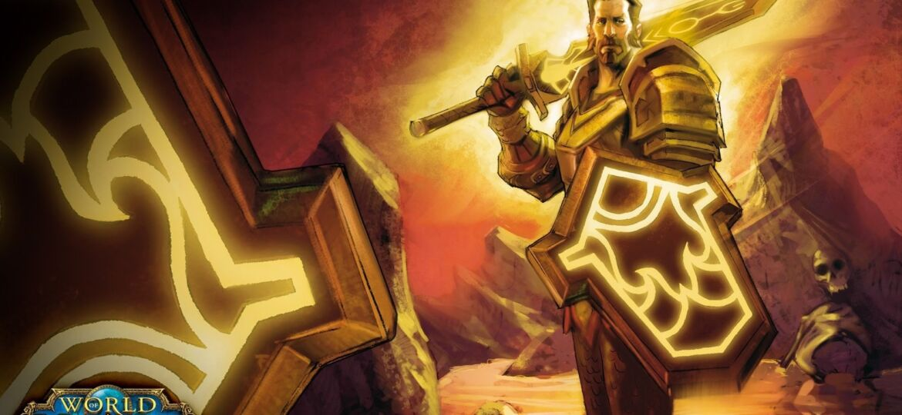

# \[60]邪恶的术士-梅林·白银盾

本任务来自于2006年的原住民之乡。

## Part 1: \[60]大领主之死

路听途说（找到醉鬼维尔福）

大领主梅林·白银盾的心死了–他堕落了。醉鬼维尔福似乎对这件事有一些了解。

醉鬼的试炼（完成醉鬼的要求）

醉鬼正忙于进行自己的冒险以及与部落的战斗，帮助他达到他的目的，他就会告诉你接下来该怎么做。

白银盾家族（找到罗兰·塞克，他会向你讲述事情的大致，但不详细，你必须先满足他的要求。成功，进入第三幕；失败，进入第二幕或者支线）

醉鬼告诉你白银盾家族曾经是一个伟大的圣骑士家族，现在已经破灭。这些是他唯一知道的了。如果你想知道更多，必须去找梅林所属公会的会长，也是他的会长–罗兰·塞克。

罗兰·塞克是一个很麻烦的人，如果你是男性，他会让你去收集点东西。如果是女性…………达到他的要求，否则他会让你误入歧途。无论怎样，你已经卷入了一场政治阴谋中。

## Part 2 :\[60]罗兰的阴谋

独裁者的党羽（找到巴鲁沙等人）

贪婪的罗兰等人决定杀死其他所有议员，以拥有整个公会的统治权。如果让他得逞的话，公会将陷入他的铁腕之中，更为严重的是那些女会员……你必须尽快找到罗兰的爪牙！

契约（战胜巴鲁沙等人）

现在，让你的怒火扼杀这些邪恶的人们吧！为了守护者联盟的未来而战！

爱的祈祷（找到罗兰的爱人）

罗兰·塞克的心灵已被恶魔占据，并拥有了不死的能力。唯一的办法是找到他的真爱，不要笑！这个风流的家伙确实有过真爱。尽快找到她，在一切还来得及之前。

## Part 3 : \[60]徽记之争

真相大白（找到目击者）

罗兰·塞克告诉你他并不清楚事情的经过。现在，他告诉了你谁是目击者。找到他！

为了荣耀！（杀死索罗斯·白银盾。成功，任务结束；失败，进入第四幕）

目击者告诉你白银盾家族的纷争以及梅林与索罗斯的那场决斗。你得知了梅林堕落的原因–索罗斯！杀死他！为了联盟的荣耀！以梅林的名义！

## Part 4 : \[60E]堕落者的审判

荣耀的重铸（战胜梅林·白银盾）

你的失败让其他人很失望，你的荣耀已经被剥夺，梅林也无法被挽救。唯一的办法，是杀了他！

支线任务：背叛者之死（战胜圣骑士CANT）

罗兰·塞克告知你cant协助索罗斯战胜了梅林，对于这个联盟的叛徒，还有什么可以说的呢？杀死他，然后向罗兰报道。

Cant作为一个英勇的圣骑士，战斗在最前线–阿拉希盆地。他用圣光的力量给予他人希望与治疗。你的所作所为已经背叛了联盟，罗兰扭曲的脸上露出了狰狞的笑容。
