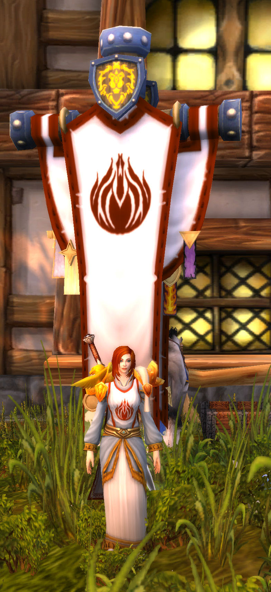

# \[60\]炙热之心骑士团再临

在奥利波斯的旅店走出一位身穿古旧铠甲的骑士，她是炙热之心骑士团最后的守墓人，昔日的大团长。这是亡者的国度，最后的归宿。转移之环呼啸着，诉说着联盟领袖们的厄运。这是混乱的时代，英雄从永眠中崛起的时代。

法瑞寻思着，走进回暴风城的传送门，传送门一阵激荡。

在暴风城中，她走过炙热之心骑士团的墓地，这里安眠着这群来自北方的骑士。帕拉斯圣剑、爱兰佩雷斯、拥光者克拉拉、巴鲁沙，他们都象征性地埋葬在这。其中帕拉斯的最后命运只有法瑞知晓，她揉了右眼，她曾经用命运之剑刺进了他的心脏……

骑士团的往事如歌，随风飘散。他们的勇气，他们的圣契，他们的古老誓言。法瑞独自回到镶金玫瑰，抬起笔又放下，过去如此沉重，她该如何走向未来？她的故事没有走到终章，骑士团也没有消失在光芒之中。

她必然抬笔写下：“炙热之心骑士团，再度征兵。”

勇敢的冒险者，你将要加入的是一个古老的骑士团，它来自同样古老的洛丹伦，现在驻扎在暴风城。你将承载它的历史，它的希望。

如果你响应这个召唤，请联系：法瑞雅。暴风城的邮件系统将会为你联系上她。

## 炙热之心骑士团的扮演

欢迎加入炙热之心骑士团的圣骑士和其他。来到骑士团后请先阅读我们的法典，里面介绍了骑士团的规则和著名的骑士。

炙热之心骑士团一直秉承严肃rp的传统，我们是一间小而精的精英圣骑士兄弟会。不是军队，虽然法典要求新晋骑士服从长官的指令。我们不是军事rp公会，所以想体验军事扮演的朋友可以另寻他处。炙热之心骑士团的特点在于性格各异的圣骑士，以及他们所参与的传奇故事。

炙热之心骑士团建立于2007年，或者2006年，具体已经不可考。第一任大团长为战士塞斯克，随后骑士团进入由帕拉斯圣剑担任大团长的时期。骑士团建立初期一直维持着较为零散的rp活动，但也有类似\[70\]帕拉斯的救赎（团队）一样的剧情rp。

炙热之心骑士团曾经是最为“严格”的小众rp公会，比如说我们不收术士、暗影牧师、德鲁伊等职业的成员。这些规定也延续至今，因为炙热之心骑士团当时是作为特色角色扮演公会，从守护者联盟中分割出来的。炙热之心骑士团第一次覆灭时，许多成员也回到了守护者联盟。

对于我个人而言，炙热之心骑士团是一份不可磨灭的记忆，因此我也为其守墓至今。偶尔有时间和精力，就希望能继续炙热之心骑士团的剧情冒险。我们是一间纯粹的rp公会，不组织pve和pvp活动。在剧情上，我们一直有尝试开放性剧情故事，让参与者感受到自己是故事的一部分，甚至主导故事的走向。也欢迎各公会与我们合作进行rp活动。

加入炙热之心骑士团，第一条就是尊重它的历史。它起起落落，倒也延续至今，见证了金色平原的变迁。也一直拥有自己独特的魅力和故事。当你成为了这个故事的一部分，你会遇到各式有趣的圣骑士，甚至改变骑士团的未来。

如果你是一个来到金色平原的新人，那么你首先可以尝试的，是扮演自己。如果你活在艾泽拉斯，你会是怎么样的一个人？你愿意成为怎么样的一个人。扮演自己总是最容易，最为顺畅的。炙热之心骑士团欢迎各种扮演风格，我们不要求统一的制服和扮演方式。记住这是一个圣骑士兄弟会，圣骑士们战斗之余，喜欢与朋友一道。

在炙热之心骑士团中，有人扮演狂热的骑士，有人扮演温和的骑士，有人扮演高阶牧师。他们每一个人都令人印象深刻，因为他们扮演的时候没有顾虑，并乐在其中。我想要看见的是你用心塑造自己的人物，将他或她的性格展现出来。

