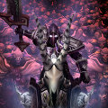

# \[70\]帕拉斯的救赎（团队）

> “告诉塞拉夫，我在地狱等他。”

## 记事篇

奥术爆炸巨大的能量将领主那高大的身躯掀翻在地，他挣扎着用手撑住松软的泥土，努力地想站起身来。一汪浓血从他的额头上渗出，让他的视线变得模糊不清。不远处震天的砍杀声仿佛离他越来越远，他努力晃了一下头……但刚刚奥爆那巨大的震荡让他的左耳几乎失聪。

“克拉拉！克拉拉！保护好米拉娅！”在他身前50码的地方，兰德摩尔正在吐沫横飞地怒吼着，同样飞舞着的还有他手上那把巨大的战刃。

领主有些迟钝地转过头去，多年的战斗经验让他意识到了有人正在向他跑来，他用眼角的余光捕捉到了那个身影，并下意识的举起了战锤准备迎敌。但他很明白，一个半摊在地上的人是接不住那来势汹汹的一击的。他的嘴角甚至弯出了一个扭曲的笑容，准备面对死亡。

“圣光在上，接招，”一个熟悉又沧老的声音传入了他的耳朵，随之而来的是一把圣光幻化出的巨锤重重的砸在了那个正在冲锋的身影脑门上。那个人突然两腿一软就摊倒在地。

“梅林？梅林？”领主徒劳地低声呻吟道，“给我起来！”

那个身着半身锴甲的老人低吼了一声。并将挂着盾牌的手伸向了领主，借着外力，领主摇摇晃晃地站了起来。但眼前的景像差点让他再次跌倒下去。满山编野的敌人——血精灵，被遗忘者，正在不停的向他们所在的小山包涌来。

有生以来，帕拉斯领主第一次感觉到了绝望。两行清泪尽在不知不觉间划过了他的面庞，“我都做了些什么？塞拉夫在哪里？”他沮丧地问道。

梅林只是冷冷的瞟了他一眼，又接着冲向下面杀得火热的战阵中。一时间，领主愣住了，他没有跟着冲下去，只是呆呆地站在那里，看着下面的战况。骑士团的盾，拥光者克拉拉如大海中的一叶偏舟般在成堆中的敌人中奋力的挥舞着他的剑，并小心的格挡着每一次攻击，但他越来越慢的动作疲态必露。米拉娅那银铃般的声音一次次的在战场上空响起，每次都招来一道柔合的白光治愈正在撕杀的战友，但不难听出她的声音中充满了绝望。兰德摩尔几乎成了一个血人，恐怕连他自己也很难分清到底是他流的血多还是敌人流的血多。年迈的梅林披挂着盔甲气喘吁吁地躲闪着敌人的攻击，但他身上也已经被鲜血染红了一大块。

“我们被出卖了，”领主喃喃自语道，他眼前又一次浮现出了那张肮脏的小纸条，以及那个蒙着脸的男人，“我们被出卖了，”他又默念了一遍。

又是一次巨大的爆炸，“不！”兰德摩尔那撕心裂肺的惨叫几乎盖过了爆炸的余音。领主拍掉了自己身上的灰尘，抬头就看见一个巨人正跪倒在一个娇小的身躯边，后者已经没有了反应。

“小心，灭鼠的！”克拉拉大叫着用盾牌架在了毫无防备的兰德身边。但几支冰枪还是在第一时间穿透了巨人的大腿，兰德痛苦地呻吟着倒在了地上。远处的梅林也已经是在地上爬行，他一寸寸地向同伴们爬去，嘴里不断喷涌出大口的鲜血，他身后阴影中一个同样伤痕累累的血精灵高高地举起了细剑。

“我们以鲜血捍卫荣耀！”领主暴怒了，他一边冲锋一边从腰间掏出一把小型战锤扔向梅林身后的血精灵。直接将那个已经受重伤的血精灵砸翻在地。一个眨眼的功夫他已经冲入了敌人之中，一阵激烈的冷兵器碰壮的声音过后，一个血精灵法师捂着被刺穿的胸口倒了下去。但刺耳的萨拉斯语的战吼声并没有减弱，他们排着有序的战阵，从四面八方压向孤身一人的领主。

当最后一把剑从领主身体里抽出时，领主并没有立刻倒下。

“快撤……”他用尽力气喊出了最后两个字，然后仰面倒了下去。他转过头去，看到同样冰冷的米拉娅的尸体正躺在离他不远的地方。年轻的女孩脸上带着安静的表情沉沉地睡去。远处，一个背着盾牌的身影正抚着一个大汉渐渐远去，视线变得越来越模糊。

“Dormir，mon ami（睡吧，我的朋友），”熟悉的萨拉斯语，“Parle a Seraf，je acompanion lui en hell（告诉塞拉夫，我在地狱等他）。”

## 节选骑士团年史

一月七日，骑士团圣剑骑士帕拉斯领主于布瑞尔同血精灵作战时战死。并被大敌斩首，其尸身下落不明。

## 线索A

当领主在他面前倒下时，梅林刚刚对自己施放了一个圣光术。他彷徨了一下，接着就毫不犹豫地冲向了领主。他大吼着冲进围成一圈的血精灵中，血精灵被他这个近乎疯狂的举动给惊呆了。但他们很快就反应了过来，快速地扑向了落单的老人。

“Arette！”一个看似军官模样的血精灵大喊了一声，正在冲锋的血精灵们全都停下了脚步转过身诧异地盯着那个发令的血精灵军官。

“Lasie resperta nos enmies，C’est notre roluer。”他接着说道。血精灵门很不情愿的垂下了高举武器的手，愤恨地看着那个年迈的人类拼命摇晃着他同类那已经冰冷的尸身。

“今天不杀我，你们会为你们的傲慢付出代价的。”梅林终于放弃了领主还活着这个想法，快速扫视了一圈周围的血精灵，并将目光停在那个血精灵军官的脸上。一时间他有些诧异，但他很快就稳定了自己的情绪。从领主颈上摘下了他那染血的护身符，快速地离开了战场。

## 线索B

战场上硝烟散尽，再也听不到垂死者的哀嚎。最后一点零星的兵器碰撞的声音也沉寂了下去，只剩下乌鸦一边绕着死者盘旋一边发出刺耳的叫声。

“血日升起了，昨晚这里发生了一场杀戮，”一个戴着兜帽的身影快步穿行于一片狼籍的战场中，并不时伏下身来查看着地上的尸体。终于，这个人在一具无头男尸前止步，那具尸体胸前的徽记昭现了主人的不凡身分。带着兜帽的人仔细地检查了一下尸体。

“该死，不见了，”那人骂了一声。突然，远处的雾气中若隐若现出了两点火光，两名被遗忘者巡夜人一边交谈着一边接近了这里。带兜帽的人快速地掏出一卷羊皮纸记下了什么，然后没入了浓浓的雾气中。

## 线索C

芙蕾妮·塞尔瑞恩最近有了一位新伙伴。做为一位对魔法敏感的法师，她那天偷偷的从她父亲的行囊里翻出了一个带着强烈魔法气息的护身符。自从那一天起……她总是会在没有人的时侯对着空气说话，她总是称她的新朋友叫……无头骑士叔叔。  
任务篇

（此篇大部分为虚构，被点到名的朋友请不要介意）

宽敞明亮的骑士团议会厅里，正端坐着几个全身披挂的武士。在一种让人窒息的沉默气氛中，只有壁炉中的木材偶尔在爆烈时发出的辟叭声。终于，有人开口了，“我大致明白了，”天威骑士塞拉夫放下了手中长长的卷宗，“大人他临终前说了什么吗？”

他紧皱着眉头扫视了一下他对面的另外两位骑士团成员，暂时接替圣剑骑士一职的拥光者克拉拉，以及侍从梅林。克拉拉摇了摇头，“太混乱了，我身边有个半死不活的兰德摩尔，除了撤退的号令外我什么都没听到，然而……”他话音未落一个女性的声音就接着响了起来。

“你们当时怎么能扔下大人不管！而把他留给那些惨白精灵，”圣洁骑士法瑞突然从座位上站了起来，哆哆逼人地盯着两位当时在场的骑士团成员。

“请坐法瑞，你要容他们说完，”天威骑士塞斯克挥了挥手示意法瑞坐下，他清了清喉咙接着说道，“我相信在坐的诸位都绝非贪生怕死之徒，不过评议会也对大人的遗体被大敌玷污之事（不许叵测！）有所疑惑。”

克拉拉低下头低声说道：“我只是服从了大人的直接命令，”他抬起头看了法瑞一眼，“我这么说并不是想为自己推脱责任。”

“他是为了救我，”大厅门口突然出现了一个高大的身影，所有人都将目光转向了他。兰德摩尔身上缠满了绷带，看上去就像一个虚灵，隐隐约约还能看见绷带下渗出的斑斑点点的血迹。他有些蹒跚地走进了大厅，“如果不是克拉拉在死人堆里把我翻出来，我恐怕早就变成一堆骨灰了。”

他的声音已不如在战场上那般宏亮，看上去一副大病初愈的样子。法瑞有些不置可否的别过头去，冷笑了一声。塞斯克不满地瞪了她一眼，又将目光转向兰德摩尔：“你看来伤得不轻，兄弟。相信我，我们谈的东西不太有利于你的康复，”他打了个手势，“医官，带他上楼休息。”

一个白胡子的老人伸手想要掺扶大汉，但却被他一把甩开，“他妈的米拉娅都死了，我这点小伤算什么！”他大吼了起来，却因为伤口的剧痛一下跪倒在了地上。塞斯克叹了口气，又挥了挥手。这次大汉仿佛没有力气反抗了，只得不情愿地在医官的掺扶下上了楼。

“好了，我们继续，”他又将目光转向了一言不发的梅林，“关于你，”他的口气中带有一种厌恶的感觉，“你的退团申请很快就会批下来。虽然你是一介侍从，但你仍有义务如实告诉我们那天你在布瑞尔都做了什么。”

梅林仰起头，“杀血精灵，”他简短地说道。

塞斯克微微有些恼怒，“是的，是的。我们知道，就像我们知道你不是那个出卖我们的人一样。那大人倒下时你在哪里？”

梅林并没有因为这个有些挑衅意味的提问而改变自己的语调，他仍一字一顿地说道，“我在他身边。”

一句话激起千层浪，大厅里立刻沸腾了起来，惊叹的声音充斥着大厅，“安静，先生们，安静！”塞斯克用戴着铁手套的手重重地砸在桌子上。待周围的声音渐渐地小了下去后，他盯着梅林看了足足有一分钟，“看出来你没说谎。我虽然不会读心，但我能轻易地看破敌人的伪装和卑劣的谎言。那么告诉我，为什么你还能坐在这里，而没有马革裹尸？”

所有人都屏息等待着他的答案。

“他们放过了我，”梅林有些颤抖地说完了这句话。

“叛徒！”法瑞毫不犹豫地大声叫了出来，有几位骑士也愤怒地站了起来，指责梅林。

“安静！安静！”塞斯克感觉局面好像就快失控了。他觉得，如果今天没有一个让众人满意的结果的话，很可能他面前的这个老人就会成为众矢之的。虽然他个人对梅林并无好感，但他更不希望骑士团里传出叛徒的丑闻……那将对整个骑士团是个巨大的伤害。梅林身边的克拉拉也不无诧异地盯着梅林愣了几秒钟，他不敢相信眼前这个沧老的男人居然在他们撤退后还留在领主身边。“也许，”他伸出了一只手，“我们该让他说完。”

他话音未落，法瑞立刻大叫道，“以圣光之名！我们应该绞死这个男人！通敌，叛国，何等的奇耻大辱！”

但一个比她愤怒百倍的声音一下把她的话音给盖住了，“以圣光之名，我还是这里的最高指挥官！”克拉拉怒吼道，“圣洁骑士，我命令你，闭嘴听他说完！”

法瑞刚想张口回敬，但她做为骑士的良好的纪律观念让她把话又咽了回去。她的脸突然变成了一种很难看的紫灰色，她一屁股坐在了凳子上，双手抱臂，不再说话。

“谢谢，女士，”克拉拉挤出了一个笑容低声说道，“你可以继续了，梅林。”

老人显然没有听到他的话，只是自顾自的思索着什么，“梅林，大人在对你说话，”塞斯克有些威慑地敲了敲桌子。

“哦，抱歉，”梅林的眼睛一下子又有了焦点，“在我为自己逞清前，我想我有一些情报要和各位分享。”

“好吧，好吧，只要不要耽误太久。你要知道你现在身上有着一定的嫌疑，”塞斯克甚至有点开始怀疑这个男人的心智是不是正常，常人一般都会急着帮自己辩护才对。

“是这样的，”梅林又恢复了他那不带感情平缓的腔调，“在那群辛多雷包围大人，并将他击倒的时侯，我离得最近。在那一刻，我好像听到了一声尖锐的呐喊，”他顿了一顿，“在坐的各位圣武士都进行过灵魂方面的协调训练，能够快速的和同伴进行沟通。所以，我相信那个时侯，我显然是听到了我和领主的灵魂链断掉的声音。”

他的一席话显然引起了所有人的兴趣，并没有人打断他，“众所周知，一个人死后，他的灵魂还是会留在尸体附近的，而不会完全的灰飞烟灭，这是建立在圣光理论上的基本常识。救赎也是通过这个原理才能运作的。”

“但当时没有足够的时间让我验证这一点，那些辛多雷不可能给我机会对大人施放救赎。但我完全感不到大人的灵魂的气息，”他环视了一圈四周，连法瑞都目不转睛地等待着他的下一句话，“但我能看到大人的护身符在那一刻突然闪起了紫色的光茫。灵魂的介质是紫色的，很幸运，那群辛多雷并没有注意到这一点。我趁着接近大人的时侯，用手盖住了那些光芒，然后把护身符拿了下来。那些辛多雷可能以为我只是想拿些遗物走，而且他们中的那个高阶军官好像，也故意在放我走。所以，我毫发无伤地离开了那里。但是，”他的声音又低沉了下去，“我绝饶不了他们所做的玷污行为。”

“一时间没有人说话，只能听到门外的孤儿院内孩子们嬉闹的声音。所有人都在努力接受并理解刚刚得到的信息。终于，塞斯克开口了，“你说得很有趣，虽然我持怀疑态度。但我仍认为你的话对我们有重大的价值，”他站了起来，“能让我们看看你所说的护身符吗？”他看着梅林说道。

梅林摇了摇头，“不能，我不知道是什么时侯，有人从我这里偷走了那个护身符……”法瑞冷笑着说：“看来你没办法帮你那故事打圆场了？”

“他说的都是真的，”一直没有说话的塞拉夫开口了，“很抱歉，老朋友，我趁你不注意时对你施放了侦测邪恶。”

梅林张大了嘴，但很快就镇定了下来，“好吧，我想这是必需的，”塞拉夫接着说道，“就算那个护身符丢掉了，我们还是有别的办法的。我建议大家行动起来。首先我们需要找回大人的尸身，这需要冒极大的风险，我在一天之内将拟出一个作战方案提交议会审核。”

塞斯克有些按耐不住了，“等等等，你这是什么意思，你想要干什么？”

“我想要让大人复活，”大厅里又一次炸开了锅。很难分辩人们到底在说什么，但大多数人都希望大人能够回来。

“可，大人的首级还在辛多雷手上，就算再强捍的圣光操控者。哪怕是大主教本尼迪塔斯本人都不可能把一个不完整的尸体复活！”有人反驳道。

“耐心，兄弟们，”塞拉夫慢慢说道，“精灵们常说，猎物只属于最耐心的猎手，我们现在至少需要大人的尸身。这样，我们才能知道，灵魂链到底为什么会断开。”

“况且，我们也不让大人的尸身也落入辛多雷手中……”

“我不这么想……”克拉拉接过了他的话，“大人早年和辛多雷中的一些人有过交情。我想那个放过梅林的人，他会想办法善后的，至少不会让那些被遗忘者遭踏大人。”

“那么麻烦……”塞拉夫挠了挠他的光脑门，“总而言之，我们现在的目标就是再去一次布瑞尔，进行一次战斗侦察，议会？”

“我……哎……”塞斯克无奈地点了点头。

“三位天威骑士全数通过，圣洁骑士您呢？”塞拉夫转向了法瑞。

“没有异议，大人。事实上，我想请求议会将这次侦察任务的指挥权交给我。”

“我会考虑的。”

教堂的大钟发出了低沉的鸣响，“啊，都这个时侯了。那么今天就到这里吧？”

塞拉夫看了看塞斯克，后者点了点头，“一旦议会通过了作战方案，那么被选中的骑士都会接到一封密函。”塞拉夫说着行了个礼，“Esarus thar no’darador（以鲜血捍卫荣誉）！”

在场的所有骑士都起身行了个礼，然后离开了大厅。

