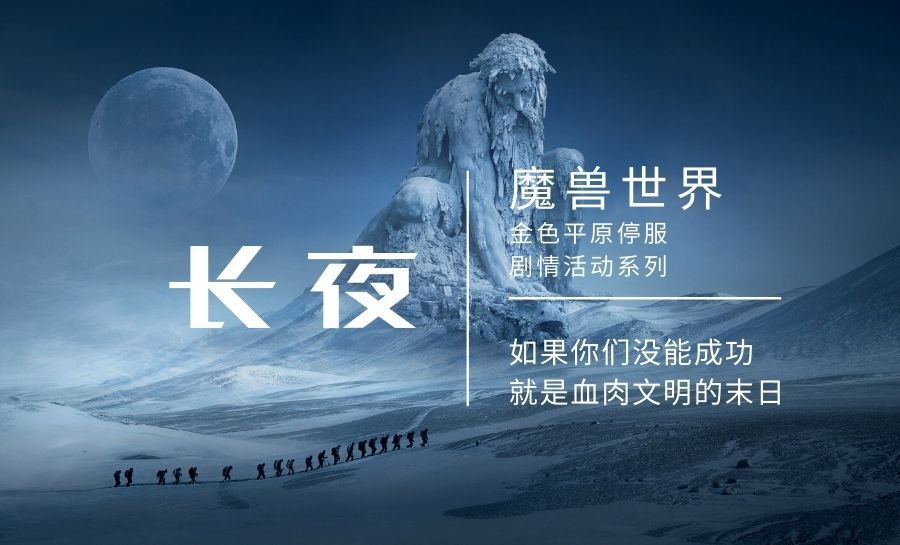

# 长夜

<figure><figcaption></figcaption></figure>

“最后一个月的时间，如果你们没能成功，就是血肉文明的末日。” ——拉夏，太阳的造物

守护者霍迪尔的死亡，开启了霍迪尔之冬。原本在盛夏的艾泽拉斯众国度，下起了暴风雪，四面八方，暴雪呼啸，冰霜刺骨，寒风如刀。日光消逝，天色灰暗……再也没有了阳光，大地没有了暖意。

终末的白霜席卷尘世，永恒的冬天，忘却了记忆。这是一个世界的末时。

英雄们，你们将阻止凛冬，还是灭亡于永寒？这是一次剧情活动，你，或许会改变所有人的命运。希望参与此次剧情的，联系法瑞雅，格林威治主教。金色平原内写信，或者侏儒通讯器添加：251939530。
