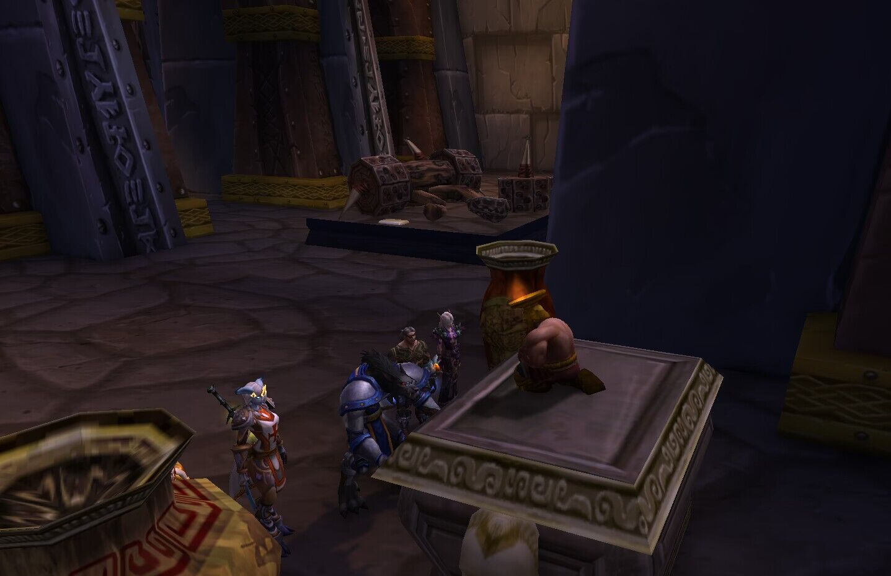
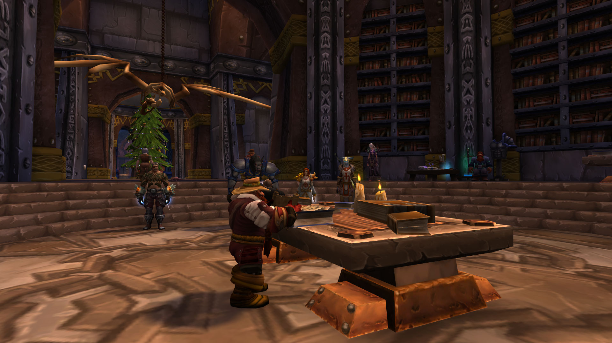
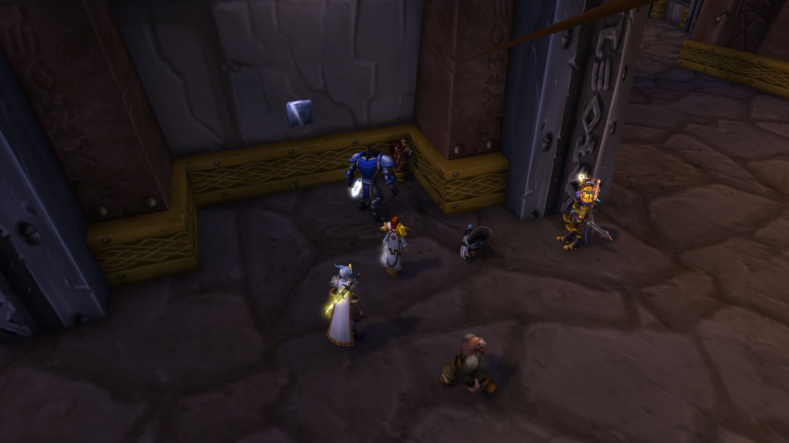
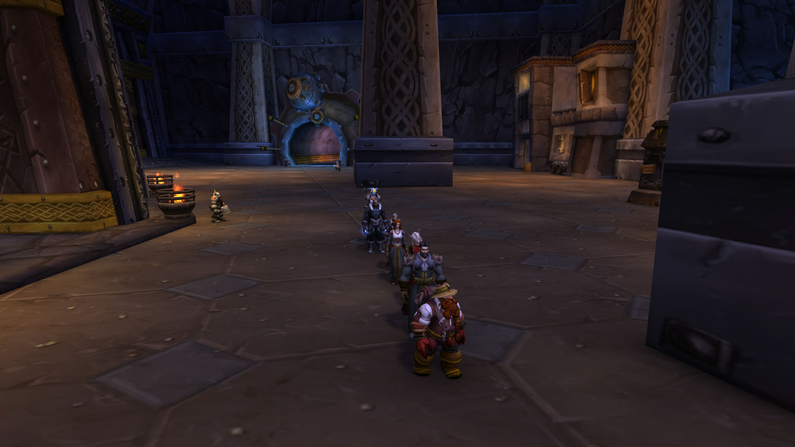
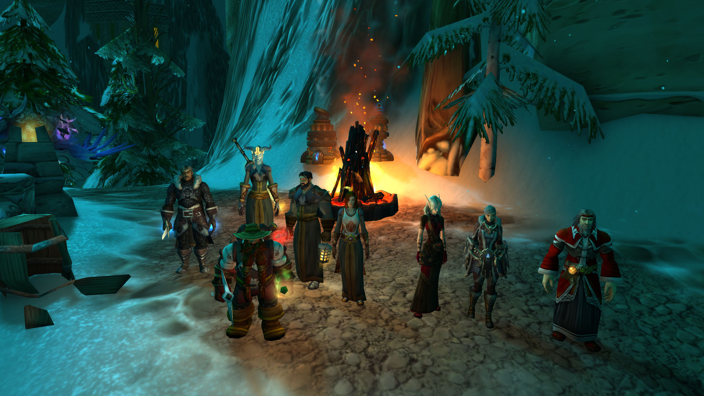
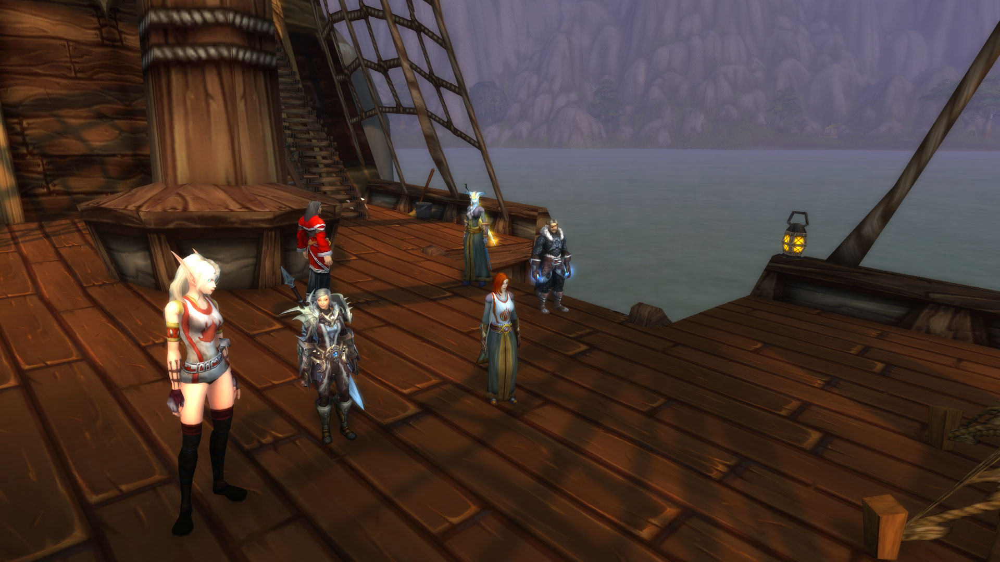
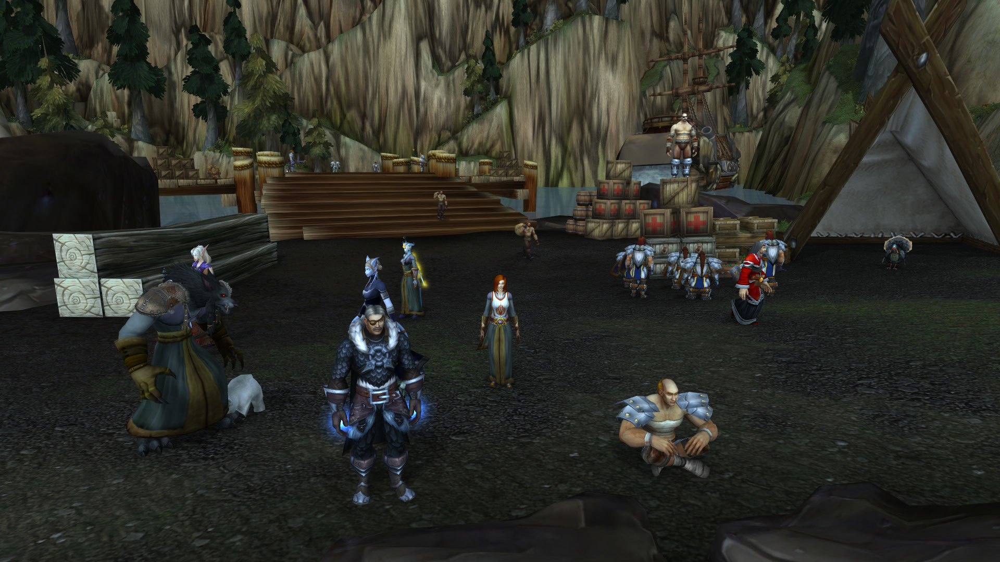

# 第二幕 铁炉堡避难（记录）

大家在铁炉堡里找到布莱恩·铜须，他可能是唯一知道这发生了什么的矮人。

记录开始于 12/30/2022日 18:08:42时。\
\[法瑞雅]: 你好布莱恩。\
\[布赖恩铜须]: 什么布莱恩\
\[布赖恩铜须]: 我不是\
\[布赖恩铜须]: 你认错人了\
\[法瑞雅]: 不，矮人先生，我想我们没认错，但是我们很需要你的帮助。\
布赖恩铜须 躲在了书架后\
法瑞雅 很快看到了书架后的矮人\
\[法瑞雅]: 我们可能得截住他\
\[法瑞雅]: 大家一起来吧\
\[莱斯文丶灰鬓]: 要拦住他？\
\[法瑞雅]: 我们确实需要矮人的帮助\
\[佩瑞妮克洛斯]: 好\
\[法瑞雅]: 是的\
法瑞雅 小心地靠近\
\[法瑞雅]: 都包围好了？\
\[法瑞雅]: 布莱恩，我们确实需要你的帮助。\
布赖恩铜须 惊讶的跳起来

<figure><figcaption></figcaption></figure>

\[布赖恩铜须]: 你们居然发现我了\
\[布赖恩铜须]: 如果你们还能找到我\
\[布赖恩铜须]: 那时候再说\
\[莱斯文丶灰鬓]: 人呢？\
\[法瑞雅]: 又消失了！\
\[佩瑞妮克洛斯]: 、在这里\
\[莱斯文丶灰鬓]: 这小矮人跑的还挺快\
\[法瑞雅]: 别躲啦\
\[佩瑞妮克洛斯]: 矮人先生跑的真快\
\[布赖恩铜须]: 该死\
\[布赖恩铜须]: 又让你们发现了\
\[法瑞雅]: 是的跑得比很多人快\
\[布赖恩铜须]: 我敢打赌下一个地方你们肯定找不到我\
\[莱斯文丶灰鬓]: 我可是狼人\
\[莱斯文丶灰鬓]: 鼻子很灵的\
\[布赖恩铜须]: 我敢打赌你们绝对找不到我了\
\[法瑞雅]: 幸亏我们有狼人法师

\[莱斯文丶灰鬓]: 我不信！\
\[莱斯文丶灰鬓]: 这小矮人，跑的太快了\
\[莱斯文丶灰鬓]: 尽然比一个受过训练的士兵都快\
\[莱斯文丶灰鬓]: 他在这\
法瑞雅 四处寻找\
\[莱斯文丶灰鬓]: 摸了摸瓶子\
\[莱斯文丶灰鬓]: 不是这个\
\[佩瑞妮克洛斯]: 嗯？\
索里奥斯馆长抹去神器底座上的灰尘。\
\[佩瑞妮克洛斯]: 摸了摸这个瓶子\
索里奥斯馆长小心翼翼地查看着大花瓶。\
巴里丶劳伦斯向布赖恩铜须挥手致意。\
\[莱斯文丶灰鬓]: 这个瓶子好矮啊\
\[巴里丶劳伦斯]: 你们不觉得那个很奇怪吗\
\[莱斯文丶灰鬓]: 还有胡子\
\[法瑞雅]: 说不定不是瓶子呢\
\[莱斯文丶灰鬓]: 给我下来\
\[布赖恩铜须]: 我只是一个奥达曼雕像\
\[巴里丶劳伦斯]: ！\
\[莱斯文丶灰鬓]: 还会说话\
莱斯文丶灰鬓 一把拉住矮人的胡子\
\[法瑞雅]: 会说话的瓶子\
\[莱斯文丶灰鬓]: 给我下来

<figure><figcaption></figcaption></figure>

\[布赖恩铜须]: 哎哟\
\[莱斯文丶灰鬓]: 疼吗？\
\[布赖恩铜须]: 欢迎你们来到探险者大厅\
\[布赖恩铜须]: 我是馆长布莱恩铜须\
\[法瑞雅]: 现在外面全是风雪，你见多识广，铜须先生，或许你对暴风雪天气的成因也知道一些？\
\[布赖恩铜须]: 这边来\
\[布赖恩铜须]: 你们有什么事找我\
\[法瑞雅]: 外面的暴风雪天气\
\[法瑞雅]: 这反常的气候\
\[布赖恩铜须]: 丹莫罗不一直如此吗\
\[法瑞雅]: 席卷了整个艾泽拉斯\
\[布赖恩铜须]: 嗯？\
\[法瑞雅]: 不只是丹莫罗，甚至是荆棘谷\
\[布赖恩铜须]: 什么？\
\[布赖恩铜须]: 太奇怪了\
\[布赖恩铜须]: 我得找找资料\
\[法瑞雅]: 是的，我们在想你或许知道什么

\[巴里丶劳伦斯]: 天哪\
\[巴里丶劳伦斯]: 好多的书\
\[布赖恩铜须]: 嗯我看看\
\[布赖恩铜须]: 阿拉索与巨魔战争？\
\[布赖恩铜须]: 洛丹伦联盟\
\[布赖恩铜须]: 瘟疫之地的内战\
\[法瑞雅]: 巨龙之战？\
\[布赖恩铜须]: 格瑞姆巴托之战\
\[布赖恩铜须]: 巨龙军团\
\[布赖恩铜须]: 嗯\
\[布赖恩铜须]: 就是这本\
\[布赖恩铜须]: 上古之神与艾泽拉斯的秩序\
法瑞雅 听着\
\[布赖恩铜须]: 嗯\
\[布赖恩铜须]: 泰坦在创造艾泽拉斯的时候\
\[布赖恩铜须]: 留下了守护者看管艾泽拉斯不被上古之神所侵蚀\
\[布赖恩铜须]: 设置有18个代码

<figure><figcaption></figcaption></figure>

\[法瑞雅]: 18个代码？\
\[布赖恩铜须]: 阿尔法\
\[布赖恩铜须]: 贝塔\
\[布赖恩铜须]: 西格玛\
\[法瑞雅]: 这些代码是用来做什么的？\
\[布赖恩铜须]: 伊克斯\
\[布赖恩铜须]: 找到了\
\[布赖恩铜须]: 最后终结世界的代码\
\[布赖恩铜须]: 欧米伽\
\[布赖恩铜须]: 欧米伽代码分别安放在两处\
\[布赖恩铜须]: 奥杜尔与奥丹姆\
\[布赖恩铜须]: 奥丹姆代码为最高权限——起源熔炉\
\[法瑞雅]: 难道这代码被启动了？\
\[布赖恩铜须]: 起源熔炉为天启者代码\
\[布赖恩铜须]: 需要四位守护者一同开启\
\[布赖恩铜须]: 而在奥杜尔的欧米伽代码\
\[莱斯文丶灰鬓]: 难道世界要毁灭了\*小声\*\
\[布赖恩铜须]: 任何一位奥杜尔守护者都有权发送

\[布赖恩铜须]: 比如我们曾经打败的洛肯\
法瑞雅 感觉这个世界命不久矣\
\[布赖恩铜须]: 就曾经对世界释放过欧米伽代码\
\[莱斯文丶灰鬓]: 我不想死，我还没有讨老婆呢\*小声\*\
\[布赖恩铜须]: 企图以观察者启动远古引擎\
\[布赖恩铜须]: 书上还说\
\[布赖恩铜须]: 远古引擎是第二欧米伽\
\[布赖恩铜须]: 毁坏世界的血肉生命\
\[布赖恩铜须]: 但是更多资料我无法得知\
\[布赖恩铜须]: 需要前往奥杜尔的远古法庭\
\[布赖恩铜须]: 才能知晓泰坦的秘密\
\[布赖恩铜须]: 你们恐怕白来了\
\[布赖恩铜须]: 我知道的也只有这些\
\[法瑞雅]: 我们可能得去一趟奥杜尔\
\[法瑞雅]: 弄清楚这一切\
\[法瑞雅]: 尽管那很危险

\[布赖恩铜须]: 我可没说要去\
\[布赖恩铜须]: 那种地方我才不去\
\[法瑞雅]: 你是最好的向导\
\[布赖恩铜须]: 什么？\
\[布赖恩铜须]: 绑架矮人了!\
\[法瑞雅]: 你难道对到底什么启动了暴风雪不好奇吗？\
法瑞雅 感觉是需要绑架矮人了\
\[布赖恩铜须]: 有人绑架矮人了!\
\[法瑞雅]: 这将是一场醉伟大的冒险\
巴里丶劳伦斯 准备动手\
布赖恩铜须 准备好按下机关\
\[法瑞雅]: 绑架矮人吧\
\[巴里丶劳伦斯]: 我们围住他\
布赖恩铜须 按下开关\
\[法瑞雅]: 只有他知道奥杜尔的路\
布赖恩铜须 按下火鸡枪按钮\
\[巴里丶劳伦斯]: ！\
布赖恩铜须在嘲笑巴里丶劳伦斯。\
\[巴里丶劳伦斯]: 葛格格\
\[莱斯文丶灰鬓]: 那我先把他胡子拔了\
\[布赖恩铜须]: 还有谁

\[莱斯文丶灰鬓]: 在帮他\
\[巴里丶劳伦斯]: 咯咯\
\[莱斯文丶灰鬓]: 我！\
\[法瑞雅]: 好家伙\
巴里丶劳伦斯 咯咯（救救我）\
\[佩瑞妮克洛斯]: 跑得飞快\
\[巴里丶劳伦斯]: 咯咯\
\[莱斯文丶灰鬓]: 你让我找到了，你就得被我暴打一顿！\
\[法瑞雅]: 这……诡异的生物\
\[法瑞雅]: 不像展品的一部分\
莱斯文丶灰鬓 闻了闻周围\
\[莱斯文丶灰鬓]: 好像在这\
基尔妮重重地敲了一下巴里丶劳伦斯的脑袋，发出“咚”的一声。\
巴里丶劳伦斯 跳到乌龟壳上\
\[莱斯文丶灰鬓]: 果然！\
\[莱斯文丶灰鬓]: 你把我惹急了！

<figure><figcaption></figcaption></figure>

\[法瑞雅]: 这件展品……\
\[莱斯文丶灰鬓]: 这是矮人王吗？\
索里奥斯馆长抹去神器底座上的灰尘。\
\[莱斯文丶灰鬓]: 里面肯定会有很多钱\
基尔妮拥抱了维塔罗希尔-白银之手。\
\[法瑞雅]: 有点吓人\
\[巴里丶劳伦斯]: 咯咯\
\[莱斯文丶灰鬓]: 我要盗墓\
\[莱斯文丶灰鬓]: 我的钱！\
\[布赖恩铜须]: 有话好说\
\[莱斯文丶灰鬓]: 要不帮我们，要不趋势\
\[法瑞雅]: 带我们去奥杜尔\
布赖恩铜须害怕地退缩了。\
\[基尔妮]: ？\
\[莱斯文丶灰鬓]: 选择一条\
\[法瑞雅]: 是这个世界的最后希望之一了

\[布赖恩铜须]: 有话好说有话好说\
莱斯文丶灰鬓向布赖恩铜须展示肌肉。哇，好壮啊！\
\[巴里丶劳伦斯]: 咯咯（别跑了 矮人）\
布赖恩铜须害怕地退缩了。\
\[莱斯文丶灰鬓]: 快点说\
\[布赖恩铜须]: 我去还不行吗\
莱斯文丶灰鬓对着布赖恩铜须发出野兽般的狂吼。好凶啊！\
\[莱斯文丶灰鬓]: 可以\
\[布赖恩铜须]: 我去还不行吗\
\[莱斯文丶灰鬓]: 别耍花招\
\[莱斯文丶灰鬓]: 来，队长，给你说好了\
\[法瑞雅]: 你带路，矮人\
\[布赖恩铜须]: 好吧好吧\
\[布赖恩铜须]: 需要准备一支探险队了

\[莱斯文丶灰鬓]: 队长，要绑他吗？\
\[法瑞雅]: 奥杜尔的远古法庭\
\[莱斯文丶灰鬓]: 我感觉他会耍花招\
\[布赖恩铜须]: 收拾行李\
\[布赖恩铜须]: 需要准备\
\[布赖恩铜须]: 很多登山装备\
\[布赖恩铜须]: 让你的人\
\[布赖恩铜须]: 准备行李。\
布赖恩铜须指着奥莉妮娜。\
\[奥莉妮娜]: 就像明天就要过春节了\
\[布赖恩铜须]: 准备好\
\[布赖恩铜须]: 就出发了\
\[布赖恩铜须]: 排队\
\[布赖恩铜须]: 天哪\
\[布赖恩铜须]: 怎么那么大的雪\
\[布赖恩铜须]: 天色怎么如此恶劣\
\[法瑞雅]: 天色变了\
\[布赖恩铜须]: 下来\
\[布赖恩铜须]: 哦，外人

<figure><figcaption></figcaption></figure>

朱斯提尼阿诺 将马拴在树边\
\[布赖恩铜须]: 看来\
\[布赖恩铜须]: 我没离开铁炉堡\
\[布赖恩铜须]: 都不知道\
\[布赖恩铜须]: 原来已经如此恶劣的气候了\
\[法瑞雅]: 连铁炉堡都不曾有这样恶劣的暴风雪\
\[布赖恩铜须]: 如此恶劣的天气\
\[法瑞雅]: 天色都改变了\
\[布赖恩铜须]: 太阳呢\
\[布赖恩铜须]: 为何天如此的黑\
\[布赖恩铜须]: 但愿海洋还没结冰吧\
\[布赖恩铜须]: 我们要立刻从米奈希尔港\
朱斯提尼阿诺 沉默地看着远处的雪景，心中默念着圣光祷词

<figure><figcaption></figcaption></figure>

\[布赖恩铜须]: 抵达\
\[布赖恩铜须]: 诺森德海岸\
朱斯提尼阿诺 在火堆边伸出自己的双手，感受着温度\
\[朱斯提尼阿诺]: 图尔加斯女士\
\[法瑞雅]: 怎么了？\
\[朱斯提尼阿诺]: 没什么\
\[莱斯文丶灰鬓]: 大家好\
\[莱斯文丶灰鬓]: 我是原空军部队的\
\[莱斯文丶灰鬓]: 可以给大家带去诺森德\
\[莱斯文丶灰鬓]: 我带大家走小路\
\[莱斯文丶灰鬓]: 御\
\[莱斯文丶灰鬓]: 前方下马同行\
\[莱斯文丶灰鬓]: 好像走反了\
\[莱斯文丶灰鬓]: 我去看下\
\[佩瑞妮克洛斯]: 欸\
\[巴里丶劳伦斯]: 水手们 打起精神来

大家通过湿地去往诺森德。

<figure><figcaption></figcaption></figure>

 

<figure><figcaption></figcaption></figure>

