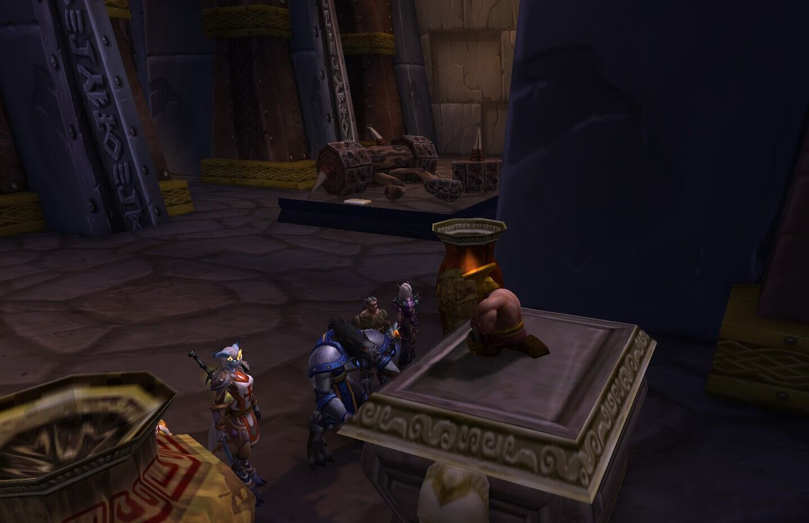
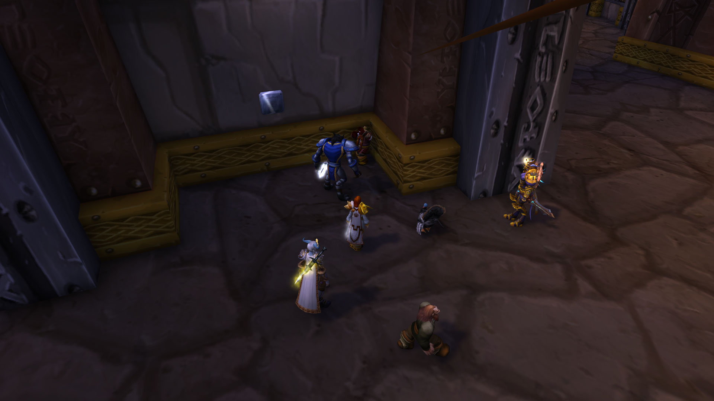
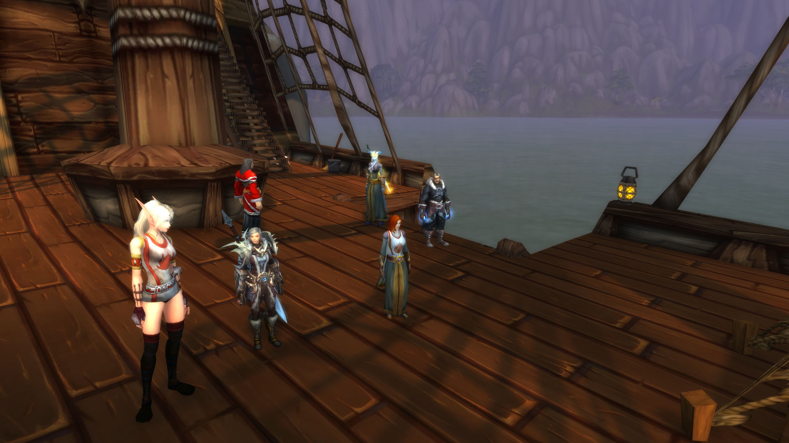

# 第二幕 铁炉堡避难（战报）

暴风雪席卷了整个艾泽拉斯，英雄们无所适从，希望能找到答案。他们和大多数人一样，来到铁炉堡，希望寻找一丝温暖，更多的，是要找到艾泽拉斯冰封的原因。

他们找到探险家协会的布莱恩·铜须。法瑞上前问道：“你好，布莱恩。”

布莱恩听着迅速逃离众人，他躲到书架后说：“什么布莱恩。我不是，你认错人了。”

“不，矮人先生，我想我们没认错，但是我们很需要你的帮助，”法瑞急切地说，她知道艾泽拉斯的时间不多了。她很快看到了书架后的矮人。她对身边的其他英雄说：“我们可能得截住他，大家一起来吧。”

法师莱斯文·灰鬓也喊道：“要拦住他？”

佩瑞妮克洛斯应和道：“好。”

布莱恩·铜须迅速地跑向展品大厅，大家小心地靠近，围着一件可疑的展品。这时法瑞才说：“都包围好了？布莱恩，我们确实需要你的帮助。”

<figure><figcaption></figcaption></figure>

布莱恩惊讶地跳起来，他边溜走边说道：“你们居然发现我了。如果你们还能找到我，那时候再说。”

“人呢？”莱斯文惊讶道，“这小矮人跑得还很快。”

“又消失了！”法瑞无奈道，“别躲啦。”

“在这里，”佩瑞妮克洛斯指出，“矮人先生跑得真快。”

“该死，又让你们发现了，”布莱恩咒骂道，“我敢打赌下一个地方你们肯定找不到我，我敢打赌你们绝对找不到我了。”

“我可是狼人，鼻子很灵的，”莱斯文警告道。布莱恩不等他说完，又溜走了，躲藏在展品之中。法瑞庆幸他们有狼人法师。

莱斯文带领着大家穿梭在展品之中，“我不信，这小矮人，跑得太快了。居然比一个受过训练的士兵都快。他在这。”

莱斯文指着其中一件神器说，又摸了摸瓶子，说道：“不是这个。”

“嗯？”佩瑞妮克洛斯跟上去。摸了摸这个瓶子。

巴里·劳伦斯直接向布莱恩·铜须挥手致意，他已经看到了矮人。法师莱斯文指出：“这个瓶子好矮啊。”

“你们不觉得那个很奇怪吗？”巴里也说道。

“还有胡子，”莱斯文指着瓶子说。

“说不定不是瓶子呢，”法瑞终于说。

“给我下来！”莱斯文对矮人说道。

“我只是一个奥达曼雕像，”布莱恩还想继续躲藏。

“还会说话，”莱斯文说着一把拉住矮人的胡子，“给我下来。”

<figure><figcaption></figcaption></figure>

“哎呦！”布莱恩大喊一声。

“疼吗？”莱斯文威胁道。这时布莱恩才从展品上跳下来，带领大家走向大厅。

“欢迎你们来到探险者大厅，我是馆长布莱恩·铜须，”布莱恩这才说道。

“现在外面全是风雪，你见多识广，铜须先生，或许你对暴风雪天气的成因也知道一些？”法瑞迫不及待地问。

“这边来，”布莱恩带领众人，“你们有什么事找我。”

“外面的暴风雪天气，这反常的气候，”法瑞继续道。

“丹莫罗不一直如此吗？”布莱恩反问。

“席卷了整个艾泽拉斯，不只是丹莫罗，甚至是荆棘谷，”法瑞急切道。

“什么？太奇怪了，我得找找资料，”布莱恩说着去往图书馆。

“天哪，好多的书，”巴里·劳伦斯感叹。

“嗯我看看，《阿拉索与巨魔战争》、《洛丹伦联盟》、《瘟疫之地的内战》、《格瑞姆巴托之战》、《巨龙军团》，嗯，就是这本《上古之神与艾泽拉斯的秩序》。”布莱恩找到他要找的那本书。

大家都屏息着听着布莱恩说，“嗯，泰坦在创造艾泽拉斯的时候，留下了守护者看管艾泽拉斯不被上古之神所侵蚀。设置有18个代码。”

<figure><figcaption></figcaption></figure>

“18个代码？”法瑞不解。

“阿尔法、贝塔、西格玛……”布莱恩说。

“这些代码是用来做什么的？”法瑞好奇。

“……伊克斯，找到了，最后终结世界的代码。欧米伽，欧米伽代码分别安放在两处，”布莱恩继续道，“奥杜尔与奥丹姆，奥丹姆代码为最高权限——起源熔炉。”

“难道这代码被启动了？”法瑞问道。

“起源熔炉为天启者代码，需要四位守护者一同开启，”布莱恩说道，“而在奥杜尔的欧米伽代码，任何一位奥杜尔守护者都有权发送。”

莱斯文·灰鬓低声说：“难道世界要毁灭了。”

“比如我们曾经打败的洛肯，就曾经对世界释放过欧米伽代码……”布莱恩读着书上的字。

法瑞雅感觉这个世界命不久矣。莱斯文哀叹道：“我不想死，我还没有讨老婆呢。”

“企图以观察者启动远古引擎。书上还说，”布莱恩读道，“远古引擎是第二欧米伽，毁坏世界的血肉生命，但是更多资料我无法得知。需要前往奥杜尔的远古法庭，才能知晓泰坦的秘密，你们恐怕白来了。我知道的也只有这些。”

“我们可能得去一趟奥杜尔，弄清楚这一切，尽管那很危险，”法瑞指出。

“我嗑没说要去，那种地方我才不去，”布莱恩拒绝。

“你是最好的向导，”法瑞急切道。

“什么？绑架矮人了！”布莱恩叫道。

法瑞雅感觉是需要绑架矮人了，她最后问道：“你难道对到底什么启动了暴风雪不好奇吗？这将是一场最伟大的冒险。”

“我们围住他，”巴里跟大家说。

“只有他知道奥杜尔的路，”法瑞说道。

“有人绑架矮人了！”布莱恩铜须叫到。巴里·劳伦斯准备动手。布莱恩则按下了火鸡枪的按钮，将巴里暂时变成了火鸡。他叫道：“还有谁！”

莱斯文·灰鬓径直说：“那我先把他胡子拔了。”

“跑得飞快，”佩瑞妮克洛斯看着再次消失的布莱恩说。布莱恩再次藏到产品中央。众人还是找到了他。

“有话好说，”布莱恩再次被找到时只能说。

“要不帮我们，要不去世，”莱斯文威胁道。

“带我们去奥杜尔，”法瑞不得不说，“是这个世界的最后希望之一了。”

布莱恩缩在墙角说：“有话好说有话好说。”

莱斯文说道：“快点说。”

“我去还不行吗？”布莱恩终于妥协，“好吧好吧，需要准备一支探险队了。”

<figure><figcaption></figcaption></figure>

“队长，要绑他妈？我感觉他会耍花招，”莱斯文建议道。

“收拾行李，需要准备很多登山装备，”布莱恩指着奥莉妮娜，“准备好，就出发了，排队。”

<figure><figcaption></figcaption></figure>

他们走出铁炉堡，就撞上暴风雪。“天哪，怎么那么大的雪，天色怎么如此恶劣，”布莱恩也感叹道，“看来，我没离开铁炉堡。都不知道，原来已经如此恶劣的气候了。”

“连铁炉堡都不曾有这样恶劣的暴风雪，”法瑞说道，“天色都改变了。”

“太阳呢，为何天如此的黑。但愿海洋还没结冰吧，我们要立刻从米奈希尔港，抵达诺森德海岸，”布莱恩说道。

<figure><figcaption></figcaption></figure>

朱斯提尼阿诺，沉默地看着远处的雪景，心中默念着圣光祷词。在火堆边伸出自己的双手，感受着温度。

大家在莱斯文·灰鬓的带领下，去往湿地的米奈希尔港，乘船去了诺森德。

<figure><figcaption></figcaption></figure>

<figure><figcaption></figcaption></figure>
