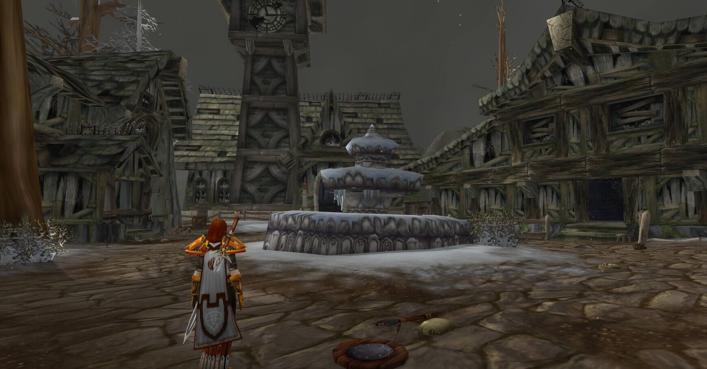
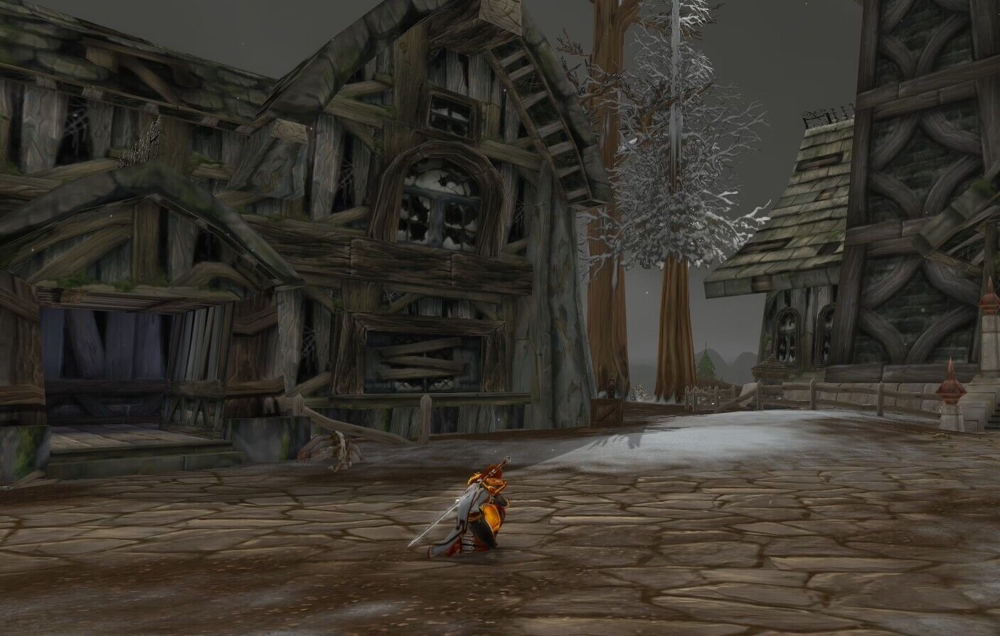
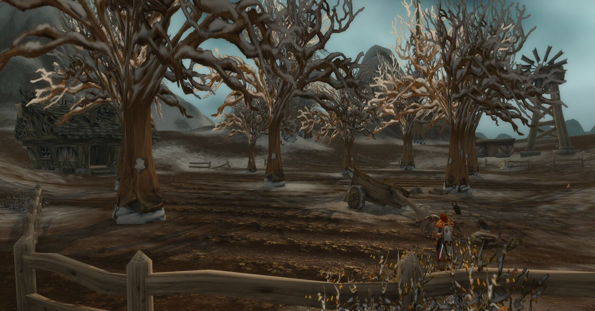
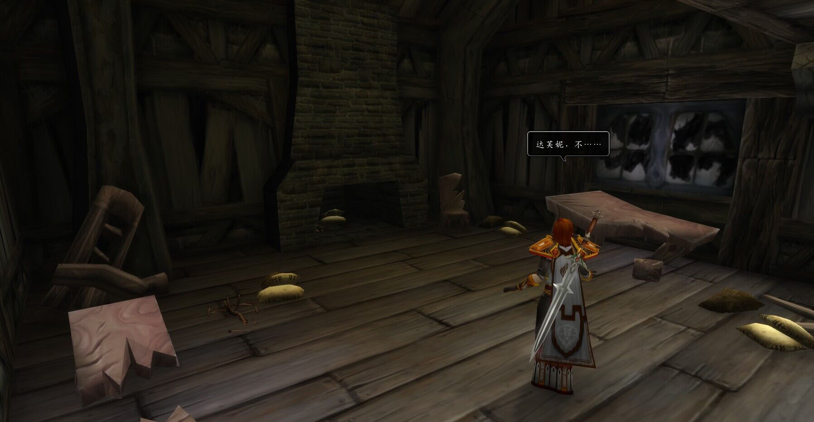
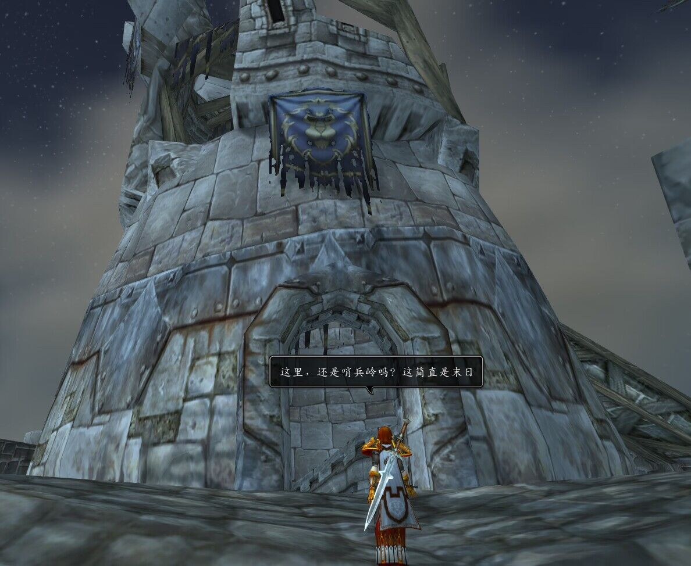
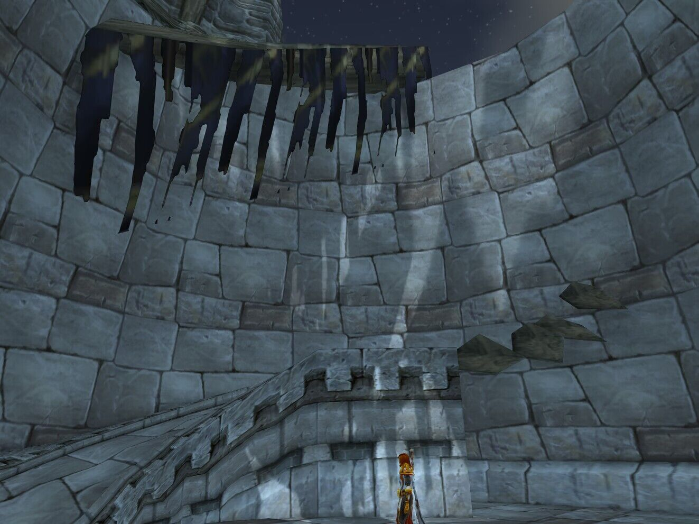
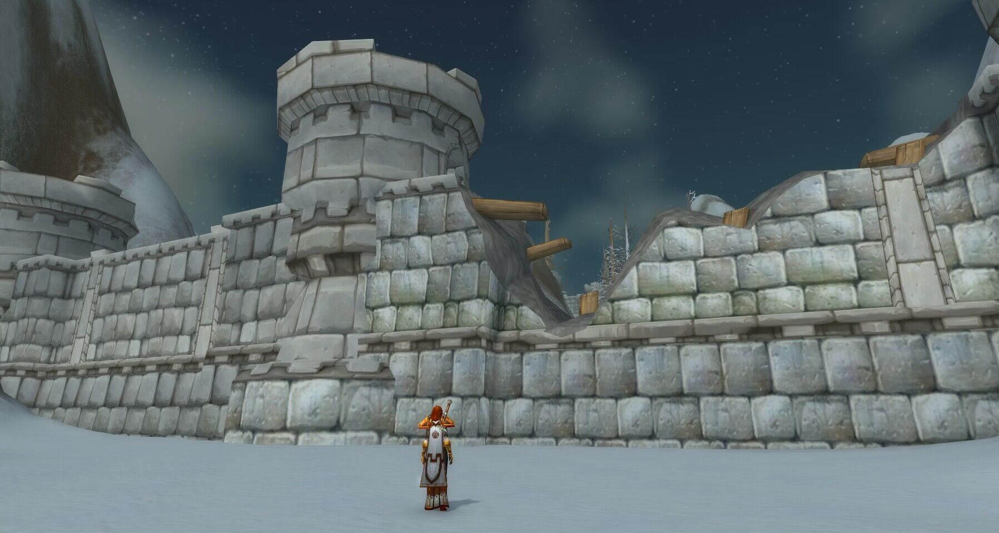

# 第六幕 回到暴风王国（记录）

记录开始于 01/13/2023日 19:46:52时。

<figure><figcaption></figcaption></figure>

你怀疑着进入着城镇

除了残垣断壁

什么都没有

地上也全是尸体

以及骸骨\
法瑞雅 感到很怪异，但她看向四周\
法瑞雅 这里是熟悉的夜色镇，但……\
法瑞雅 看到周围一片雪飘冰封，守夜人在哪？

那些还来不及掩埋的骸骨

皑皑白雪让你不知所措

<figure><figcaption></figcaption></figure>

\[法瑞雅]: 有人吗？\
\[法瑞雅]: 守夜人？\
法瑞雅 只看到被冻僵的尸体\
法瑞雅 在一具尸体旁跪下检查\
你跪了下来。\
法瑞雅 看到尸体被冻僵，死不瞑目

你来到了那个苹果园

树木以及枯死

马车碎成了渣

<figure><figcaption></figcaption></figure>

法瑞雅 走进苹果园，却找不到它的主人\
\[法瑞雅]: 达芙妮？\
\[法瑞雅]: 你还在吗？\
法瑞雅 没有听见应答

你决定进屋看看

一片狼藉中有着一些骸骨

法瑞雅 发现屋内一片狼藉，她上前去检查骸骨

但你发现那是狗的骸骨

<figure><figcaption></figcaption></figure>

\[法瑞雅]: 达芙妮，不……\
法瑞雅 发现是狗的残骸，这才稍微放心一点

你决定前往哨兵岭

哨兵岭只剩下残破的塔楼

法瑞雅 离开苹果园\
法瑞雅 来到哨兵岭，周围也布满残骸\
\[法瑞雅]: 这里，还是哨兵岭吗？这简直是末日

西部荒野的人都逃离了这里

这里已经没人居住了

<figure><figcaption></figcaption></figure>

<figure><figcaption></figcaption></figure>

法瑞雅 看向周围，感叹风雪的不留情\
法瑞雅 走进塔楼里，却没找到任何暖意\
\[法瑞雅]: 希望人们都及时逃离了\
\[法瑞雅]: 但就连铁炉堡，估计也支撑不了多久\
法瑞雅 回到暴风城\
\[法瑞雅]: 好冷……冷得深入骨髓……\
法瑞雅 来到大使馆外，听见了什么

<figure><figcaption></figcaption></figure>

