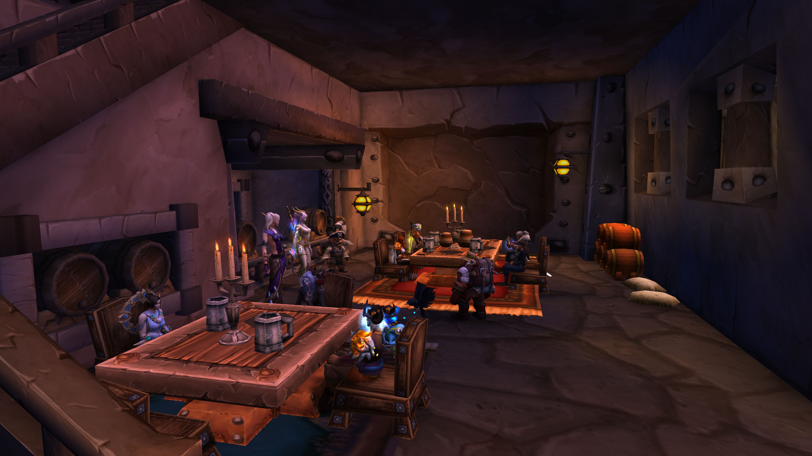
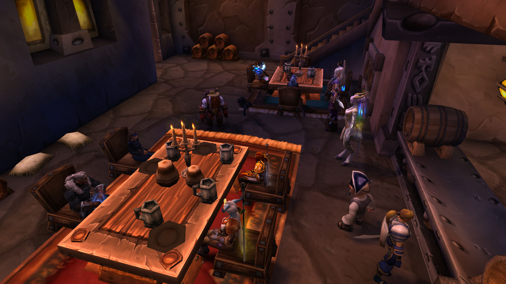
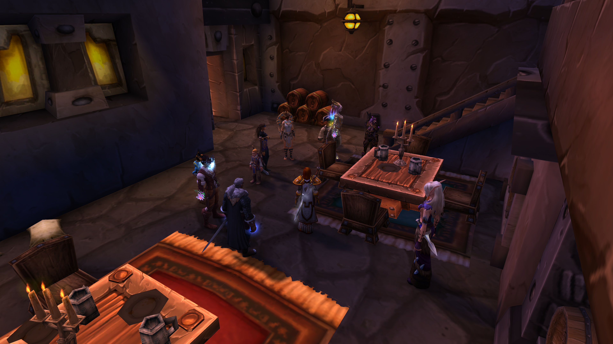
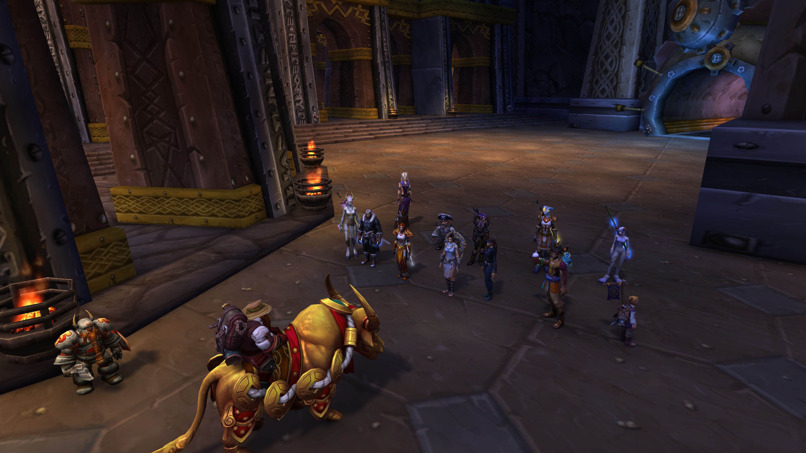
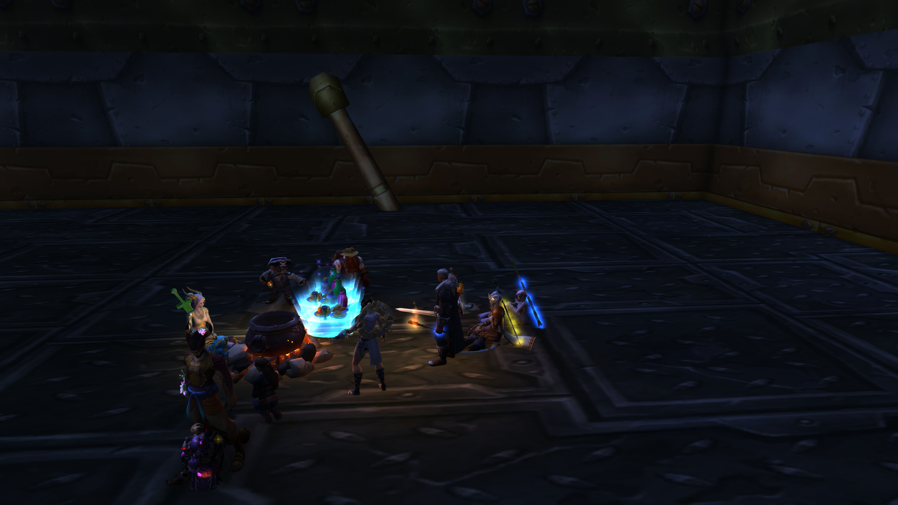
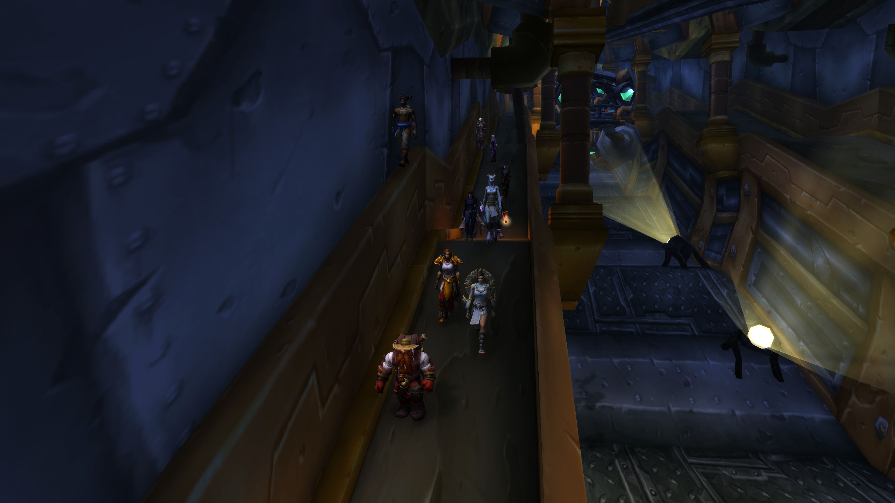
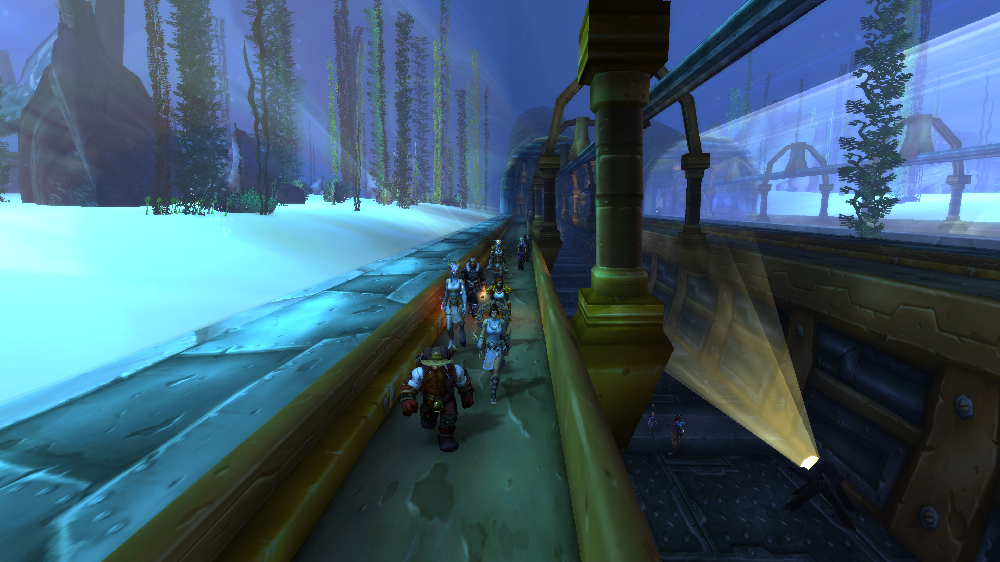
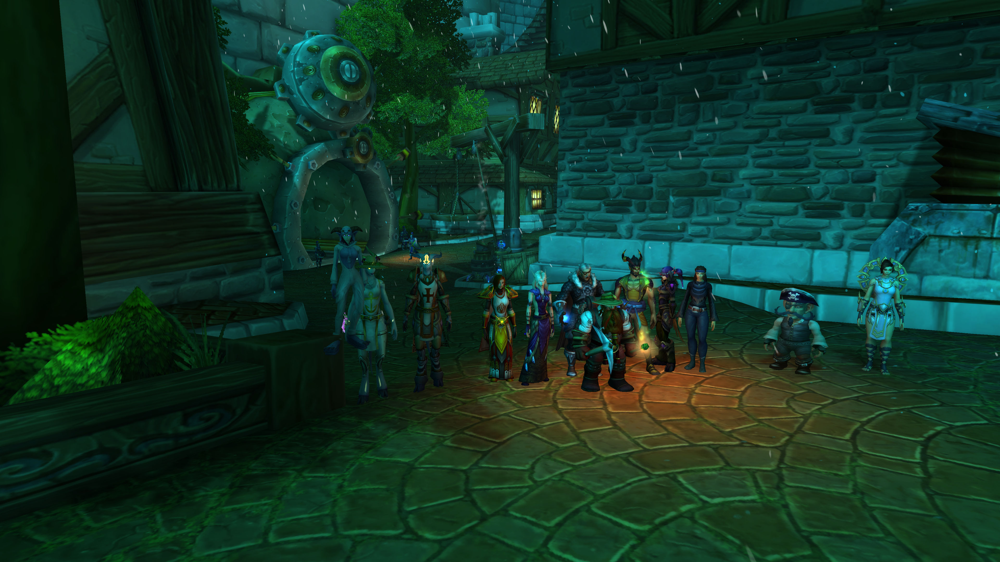
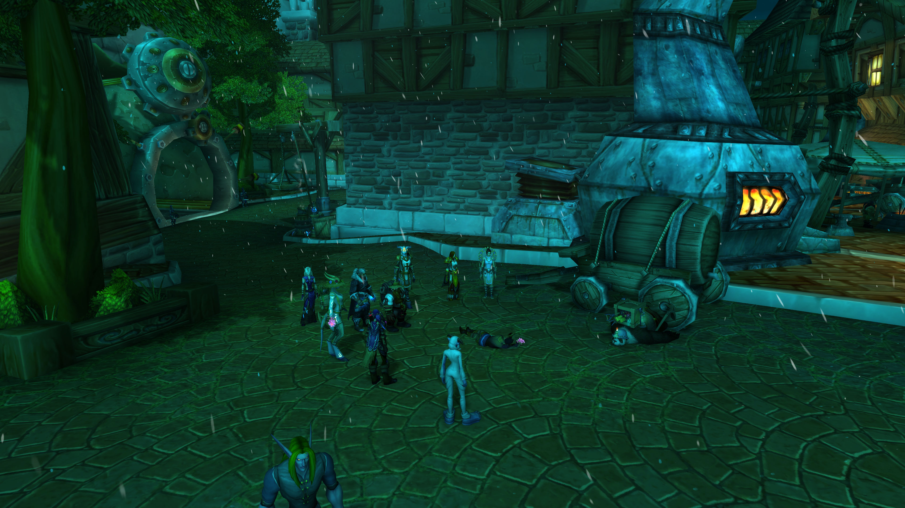

# 第七幕 步行矿道地铁（记录）

记录开始于 01/15/2023日 19:59:15时。\
探险队从奥杜尔回来后，发现各大城市已经开始无法住人了

联盟难民以向铁炉堡集合

铁炉堡已经成为世界上唯一最暖和的地区

各地的大雪覆盖已经毁灭了许多城镇和大型城市

而目前的铁炉堡已经人满为患，廉价的房间都要1个金币一天

从奥杜尔回来后的布莱恩与联盟高层开了会议

高层委任布莱恩前往奥丹姆夺取守护者之心

而主力军全部到巨龙群岛对付化身巨龙去了

<figure><figcaption></figcaption></figure>

\[九宝儿]: 不怎么样 太冷了\
\[巴里丶劳伦斯]: 糟透了\
\[佩瑞妮克洛斯]: 太糟糕了\
\[布赖恩铜须]: 联盟的会议已经开完了\
\[法瑞雅]: 到处都是冻死的人\
\[布赖恩铜须]: 我告诉大家一个好消息\
\[巴里丶劳伦斯]: 我都要被冻成冰雕了\
\[九宝儿]: 好消息？\
\[布赖恩铜须]: 是的\
\[布赖恩铜须]: 好消息\
\[九宝儿]: 这年头还能有好消息？\
\[法瑞雅]: 难得的好消息\
\[巴里丶劳伦斯]: 什么？\
\[布赖恩铜须]: 联盟上层和达拉然法师们通过了决议\
\[布赖恩铜须]: 决定讨伐化身巨龙\
\[布赖恩铜须]: 然后就是\
\[布赖恩铜须]: 所有联盟公民都将被迁来铁炉堡躲避寒冬\
\[布赖恩铜须]: 男人每天在矿洞劳作18小时挖煤

\[巴里丶劳伦斯]: ！\
\[巴里丶劳伦斯]: 天哪\
\[九宝儿]: 18个小时！！！\
\[布赖恩铜须]: 女人需要18个小时制作御寒衣物和面包\
\[布赖恩铜须]: 同时上面批准了\
\[布赖恩铜须]: 使用童工\
\[巴里丶劳伦斯]: 比我守夜的时间还要长\
\[曉蹄子]: 这不就是奴隶吗\
\[魔法小干笋-熊猫酒仙]: 联盟公民很多人的吧？矿洞能同时容纳这么多人吗？\
\[布赖恩铜须]: 并且\
\[布赖恩铜须]: 童工工资只有成年人的一般\
\[布赖恩铜须]: 一半\
\[法瑞雅]: 这也是无奈之举\
\[布赖恩铜须]: 24小时轮班制\
\[布赖恩铜须]: 并且在铁炉堡避难的人\
\[布赖恩铜须]: 要交出一切随身携带的财产，作为避难费\
\[九宝儿]: 这也太黑了\
\[布赖恩铜须]: 所以\
\[曉蹄子]: 。。。我们可以!@#$%^&\*!@#$吗？

\[布赖恩铜须]: 现在\
\[布赖恩铜须]: 准备去挖矿吧\
布赖恩铜须指着巴里丶劳伦斯。\
布赖恩铜须指着九宝儿。\
\[巴里丶劳伦斯]: 。。。\
布赖恩铜须指着苍圣大葱。\
\[魔法小干笋-熊猫酒仙]: 我想我们需要工业化生产相关的技术人员\
苍圣大葱害怕地退缩了。\
\[布赖恩铜须]: 准备到矿井工作吧\
\[曉蹄子]: 挖矿是不可能挖矿了 这辈子是不可能挖矿的\
\[布赖恩铜须]: 不想挖矿？\
\[布赖恩铜须]: 可以啊\
\[巴里丶劳伦斯]: 你是女人 你不用挖矿\
\[布赖恩铜须]: 女人挖晚上\
\[苍圣大葱]: 我本职虽然是个矿工，但是….我一般都在偷懒\
\[布赖恩铜须]: 男人挖白天\
\[乔丹丶卡佛]: 什么？晚上挖？\
\[布赖恩铜须]: 并且矿洞不供暖

<figure><figcaption></figcaption></figure>

\[魔法小干笋-熊猫酒仙]: 我们女人不用睡觉了吗？\
\[布赖恩铜须]: 不想挖矿也行啊\
\[布赖恩铜须]: 那就必须加入探险队\
\[布赖恩铜须]: 前往奥丹姆\
\[布赖恩铜须]: 要么就滚出铁炉堡\
\[布赖恩铜须]: 这就是好消息\
\[九宝儿]: 探险队！！！\
\[巴里丶劳伦斯]: 去奥丹姆？\
\[布赖恩铜须]: 对\
\[布赖恩铜须]: 现在奥丹姆\
\[法瑞雅]: 探险队生存几率小\
\[布赖恩铜须]: 也是皑皑白雪了\
\[宅细胞]: 比挖矿好\
\[法瑞雅]: 但是总好过挖矿\
\[巴里丶劳伦斯]: 吗 de 干了\
\[巴里丶劳伦斯]: 去奥丹姆\
\[魔法小干笋-熊猫酒仙]: 我宁愿死在探险的路上，也不愿意过劳而猝死\
\[巴里丶劳伦斯]: 我可不想一辈子 在矿洞里

\[曉蹄子]: 那里到处了 安其拉虫子\
\[布赖恩铜须]: 噢，对了\
\[乔丹丶卡佛]: 去奥丹姆开拓丝绸之路吗？\
\[布赖恩铜须]: 把财产叫出来\
\[宅细胞]: 我对十字镐过敏\
\[布赖恩铜须]: 交出来\
\[布赖恩铜须]: 这是高层的决议\
\[苍圣大葱]: 我只有一把矿工锄了。。\
\[曉蹄子]: 我只想 摆烂\
\[布赖恩铜须]: 凡是用了铁炉堡暖气的\
\[布赖恩铜须]: 都要交出一切财产\
\[乔丹丶卡佛]: 不会是去奥丹姆当波斯猫吧\
魔法小干笋-熊猫酒仙 翻了翻自己扁扁的钱包\
\[法瑞雅]: 还是去探险队吧，至少去那的时候要有剑和盔甲\
\[曉蹄子]: 。。。。

\[布赖恩铜须]: 没有钱的将被扔出铁炉堡\
\[布赖恩铜须]: 大门是不可能再开了\
\[宅细胞]: 去当波斯猫听着也是不错的选择\
\[布赖恩铜须]: 不交钱的人会被扔到地铁中\
魔法小干笋-熊猫酒仙 翻了翻自己胀鼓鼓的行旅包\
\[布赖恩铜须]: 地铁不供暖\
曉蹄子 惊讶的看着宅细胞\
\[布赖恩铜须]: 你们可以看看\
\[苍圣大葱]: 波斯猫\~偷偷撸两把可行\~\~\
\[布赖恩铜须]: 暴风城的难民在地铁矿道排队呢\
\[九宝儿]: 去探险队吧\
\[布赖恩铜须]: 每天进铁炉堡都是有名额的\
\[法瑞雅]: 我们还是考虑探险队吧\
\[曉蹄子]: 我一身 白板 拿来的财物、\
\[布赖恩铜须]: 你们商量好了\
\[布赖恩铜须]: 再来找我\
\[宅细胞]: 投票吧

\[苍圣大葱]: 铁炉堡的地热确实暖和。但是\
\[法瑞雅]: 大家认为去冒险队怎么样？好过挖矿\
\[苍圣大葱]: 设置到能不能供暖到18摄氏度\
\[魔法小干笋-熊猫酒仙]: 大家都怎么想的\
\[曉蹄子]: 我们不如 起 义 反 了 吧\
\[九宝儿]: 我去探险队 在这里太无聊了\
\[法瑞雅]: 但是会没机会回到铁炉堡\
\[乔丹丶卡佛]: 对，我选跟着去奥丹姆看看\
\[法瑞雅]: 铁炉堡是最暖和的地方了\
\[宅细胞]: 我想去当波斯猫\
\[宅细胞]: 挺着很有趣\
\[乔丹丶卡佛]: 奥丹姆是个沙漠\
巴里丶劳伦斯 拼一把\
\[魔法小干笋-熊猫酒仙]: 可是奥丹姆原来是一片沙漠吧

<figure><figcaption></figcaption></figure>

\[曉蹄子]: 阿古斯也挺暖和\
\[法瑞雅]: 奥丹姆也是雪天了\
\[乔丹丶卡佛]: 当波斯猫 拍拍照\
\[巴里丶劳伦斯]: 我去奥丹姆\
\[曉蹄子]: 要不考虑换个地方？\
\[魔法小干笋-熊猫酒仙]: 按理来说，也是冰天雪地中最暖和的地方\
\[法瑞雅]: 整个艾泽拉斯都是暴风雪\
\[乔丹丶卡佛]: 也可以谋生\
\[法瑞雅]: 我不想将剑和盔甲都交给矮人们\
\[法瑞雅]: 你们觉得呢？\
\[曉蹄子]: 没错\
\[法瑞雅]: 我也去奥丹姆\
\[魔法小干笋-熊猫酒仙]: 不能让矮人%^&控一切\
\[苍圣大葱]: 我就一把矿锄了，给了别人就真的啥都没了\
\[法瑞雅]: 大家都决定去探险队了？\
\[宅细胞]: 反正不让我拿十字镐就行

\[九宝儿]: 是的\
魔法小干笋-熊猫酒仙 举起手\
\[宅细胞]: 我对那玩意过敏\
\[魔法小干笋-熊猫酒仙]: 我去\
\[宅细胞]: 投票吧各位\
\[曉蹄子]: 对对 反正我是不会去挖矿的\
法瑞雅 投赞成票\
\[巴里丶劳伦斯]: 我去奥丹姆\
魔法小干笋-熊猫酒仙 举手赞成\
宅细胞 举起了受赞成\
法瑞雅 看着众人的投票过程\
苍圣大葱赞同曉蹄子的观点。\
曉蹄子 举起尾巴也同意\
\[法瑞雅]: 没有人反对吧？\
维塔罗希尔-白银之手 弃权投票

\[法瑞雅]: 好的，有一票弃权，但也不是反对\
\[法瑞雅]: 好了我们去找布莱恩吧，既然如此\
巴里丶劳伦斯指着维塔罗希尔-白银之手。\
\[法瑞雅]: 我们没有反对的\
\[法瑞雅]: 因为挖矿确实……\
\[法瑞雅]: 被扔地铁里更加难熬\
\[巴里丶劳伦斯]: 赌一把\
\[巴里丶劳伦斯]: 搏一搏\
\[魔法小干笋-熊猫酒仙]: 我想看看外面的世界\
\[法瑞雅]: 布莱恩\
\[乔丹丶卡佛]: 挖矿对于一个模特来说不可接受\
\[法瑞雅]: 我们刚才投票决定\
\[布赖恩铜须]: 瞧瞧我的黄金牛\
\[乔丹丶卡佛]: 我要出去\
\[布赖恩铜须]: 刚才一个熊猫人\
\[法瑞雅]: 参与探险队去奥丹姆\
\[布赖恩铜须]: 交出了他的全部财产\
宅细胞 露出羡慕的表情

\[布赖恩铜须]: 一个熊猫人的全部财产\
\[布赖恩铜须]: 然后换来的这头牛\
法瑞雅 觉得有点吓人\
\[布赖恩铜须]: 纯金的\
\[九宝儿]: 金牛？\
\[曉蹄子]: 骑的金牛\
\[布赖恩铜须]: 是的\
\[九宝儿]: 帅啊\
\[曉蹄子]: 一看就没少捞\
\[法瑞雅]: 我们决定搏一搏，去奥丹姆\
\[宅细胞]: 我这辈子没见过那么多钱\
\[法瑞雅]: 只有一票弃权\
\[布赖恩铜须]: 你们身上的钱，我们会用到正确的地方的\
巴里丶劳伦斯 看着矮人骑着金牛 很想冲上去揍他一顿\
魔法小干笋-熊猫酒仙 看着眼前贪婪的矮子，愤怒无比

苍圣大葱 心想：我要是挖矿得挖十辈子才能挖到那一头金牛！！！\
\[布赖恩铜须]: 怎么样\
\[布赖恩铜须]: 要交出钱\
曉蹄子 对着苍圣大葱\*小声说\*啥时候矮人也成奸商了\
\[布赖恩铜须]: 还是服务铁炉堡\
\[法瑞雅]: 我们去探险队，不交钱，也不挖矿\
\[九宝儿]: 去探险队\
\[魔法小干笋-熊猫酒仙]: 对\
苍圣大葱赞同你的观点。\
\[布赖恩铜须]: 很好\
曉蹄子 要钱没有要命不给\
\[布赖恩铜须]: 那就去奥丹姆吧\
巴里丶劳伦斯对曉蹄子点了点头。\
苍圣大葱 不敢说话，，默默点了点头\
\[九宝儿]: 怎么去？\
布赖恩铜须 矮人又炫耀他的金牛\
\[宅细胞]: 腿着去

<figure><figcaption></figcaption></figure>

\[曉蹄子]: 包专机吗？\
\[苍圣大葱]: 小声说：你得给我们条活路。。。\
\[法瑞雅]: 别交钱呀\
巴里丶劳伦斯 咬牙切齿的盯着布莱恩\
布赖恩铜须 把黄金给拿走了\
\[布赖恩铜须]: 现在暴风城有一条船\
巴里丶劳伦斯 \*小声\*到了奥丹姆我就干掉你\
\[布赖恩铜须]: 唯一的破冰船\
\[布赖恩铜须]: 那么走吧\
\[曉蹄子]: 奸商\
\[布赖恩铜须]: 地铁将会给你们开放\
宅细胞 感到沮丧\
\[布赖恩铜须]: 你们可以好好看看\
\[法瑞雅]: 我们走吧\
\[布赖恩铜须]: 地铁里那些靠双脚走的难民\
\[魔法小干笋-熊猫酒仙]: 到了奥丹姆，我们把它干掉吧\
法瑞雅 看见地铁里的难民

宅细胞 嘘\
\[布赖恩铜须]: 好好看看吧\
\[布赖恩铜须]: 这里的难民\
\[布赖恩铜须]: 他们只能靠双脚走\
巴里丶劳伦斯 环顾四周\
\[布赖恩铜须]: 你们也是\
法瑞雅 看见难民和老鼠们在一起\
\[布赖恩铜须]: 只能靠双脚走\
布赖恩铜须指向远方。\
\[宅细胞]: 我可不想走着去\
\[巴里丶劳伦斯]: 布莱恩\
\[曉蹄子]: 把奸商一脚踢下去\
\[宅细胞]: 他要走着来了\`\
\[佩瑞妮克洛斯]: qwq\
\[魔法小干笋]: 我们可以密谋一下\
\[宅细胞]: 快\`说说\`\
\[魔法小干笋]: 比方说我奥丹姆某个土堆后\
\[魔法小干笋]: 将布赖恩埋葬\
\[魔法小干笋]: 只要在没有目击者的地方，我们就能动手\
\[宅细胞]: 今天地跌的营业额达标了\
\[巴里丶劳伦斯]: 你\
\[巴里丶劳伦斯]: 不要欺人太甚\
\[九宝儿]: 走过去？？？

\[曉蹄子]: 我可没走过这么长的路\
\[法瑞雅]: 地铁里真冷\
\[九宝儿]: 跑过去吧\
巴里丶劳伦斯 掏出火把\
\[魔法小干笋-熊猫酒仙]: 跑起来还能热乎一些\
\[曉蹄子]: 是啊 还暖和些\
\[巴里丶劳伦斯]: 我们要尽可能保存体力\
\[巴里丶劳伦斯]: 还不知道外面怎么样\
\[苍圣大葱]: 感觉又回到了矿洞里面\~\~\
\[魔法小干笋]: 大家行囊里如果厚厚衣服，就都穿上吧\
\[魔法小干笋]: 一会从地铁站出去会更冷\
\[巴里丶劳伦斯]: 我们靠近一些\
\[巴里丶劳伦斯]: 这样会暖和点\
\[乔丹丶卡佛]: 我不想走在队伍后面，太没安全感了

<figure><figcaption></figcaption></figure>

\[曉蹄子]: 喝些热汤吧\
\[曉蹄子]: 。。。。我不想双休\
\[九宝儿]: 抱着你取暖\
\[布赖恩铜须]: 行了\
\[布赖恩铜须]: 走\
\[宅细胞]: 我还没吃饱你\
\[布赖恩铜须]: 你配吃东西吗\
\[乔丹丶卡佛]: 我担心被后方其它难民偷袭，不要走在最后\
\[魔法小干笋-熊猫酒仙]: 再等等\
\[法瑞雅]: 走吧\
\[曉蹄子]: 去抱你的小二去\
\[布赖恩铜须]: 武器都交上来\
\[九宝儿]: 她不让我抱\
\[布赖恩铜须]: 到了奥丹姆再还给你们\
\[苍圣大葱]: 哦\~天呐·\
\[魔法小干笋-熊猫酒仙]: 我只带了几本书和衣服\
\[曉蹄子]: 这时就想到老娘了\
九宝儿害羞地避开了曉蹄子。

\[凝風幻雪]: 我就剩衣服了\
\[九宝儿]: 我没武器\
\[乔丹丶卡佛]: 我的武器？你们碰不到的，这是海洋之力\
\[巴里丶劳伦斯]: 不给我们武器 外面有危险怎么办\
\[巴里丶劳伦斯]: 我们需要防身\
\[乔丹丶卡佛]: 这里光线好暗\
\[宅细胞]: 比西游记还惨\
乔丹丶卡佛 瑟瑟发抖\
\[九宝儿]: 我们为什么不传送过去\
\[曉蹄子]: 看不到尽头\
苍圣大葱 \*小声\*1G金币，我我我见过最大的钱币是1银币。。。\
\[魔法小干笋-熊猫酒仙]: 这里怎么会有水\
\[布赖恩铜须]: 看来\
\[乔丹丶卡佛]: 右边有个侏儒潜水\
\[布赖恩铜须]: 海水还没结冰

<figure><figcaption></figcaption></figure>

<figure><figcaption></figcaption></figure>

曉蹄子 \*小声\*曾经辉煌过的我 怎么会成现在的处境\
\[布赖恩铜须]: 这里是海底深处\
\[布赖恩铜须]: 后面去\
\[乔丹丶卡佛]: 呜\
\[乔丹丶卡佛]: 看！\
\[乔丹丶卡佛]: 尼斯水怪\
\[凝風幻雪]: 在哪\
\[曉蹄子]: 对面\
\[曉蹄子]: 鄙人 不善奔跑\
\[法瑞雅]: 呼，终于到了\
\[曉蹄子]: 呼呼 喘口气\
布赖恩铜须指向远方。\
\[布赖恩铜须]: 抵达了暴风城\
\[布赖恩铜须]: 现在\
\[布赖恩铜须]: 面对风雪吧

<figure><figcaption></figcaption></figure>

\[乔丹丶卡佛]: 白霜纪元？\
\[魔法小干笋-熊猫酒仙]: 姐到了\
\[巴里丶劳伦斯]: 天哪\
\[巴里丶劳伦斯]: 冻死我了\
\[凝風幻雪]: 、招手\
\[巴里丶劳伦斯]: 雪\
\[巴里丶劳伦斯]: \*小声\*我们动手吧\
\[魔法小干笋-熊猫酒仙]: \*小声\*再等等\
\[魔法小干笋-熊猫酒仙]: 这里人多\
苍圣大葱向暴风城巡逻兵挥手致意。\
\[曉蹄子]: 去 吧死鬼\
\[巴里丶劳伦斯]: 把熊猫吃了吧 他这么胖\
\[魔法小干笋-熊猫酒仙]: 可怜的熊猫人\
\[曉蹄子]: 、这是要碰瓷？

\[乔丹丶卡佛]: 他脂肪多\
\[巴里丶劳伦斯]: 没想到毛发最多的 最先被冻死\
\[乔丹丶卡佛]: 拿去熬汤\
宅细胞 暗中观察\
\[魔法小干笋-熊猫酒仙]: 可他不是北极熊\
\[曉蹄子]: 209少了这个数免谈\
\[乔丹丶卡佛]: 这不重要，他有大量脂肪\
\[布赖恩铜须]: 看见了吗\
\[曉蹄子]: 大葱啊 呜呜呜呜呜呜……..\
\[布赖恩铜须]: 没有铁炉堡\
\[布赖恩铜须]: 你们什么都不是

<figure><figcaption></figcaption></figure>

\
