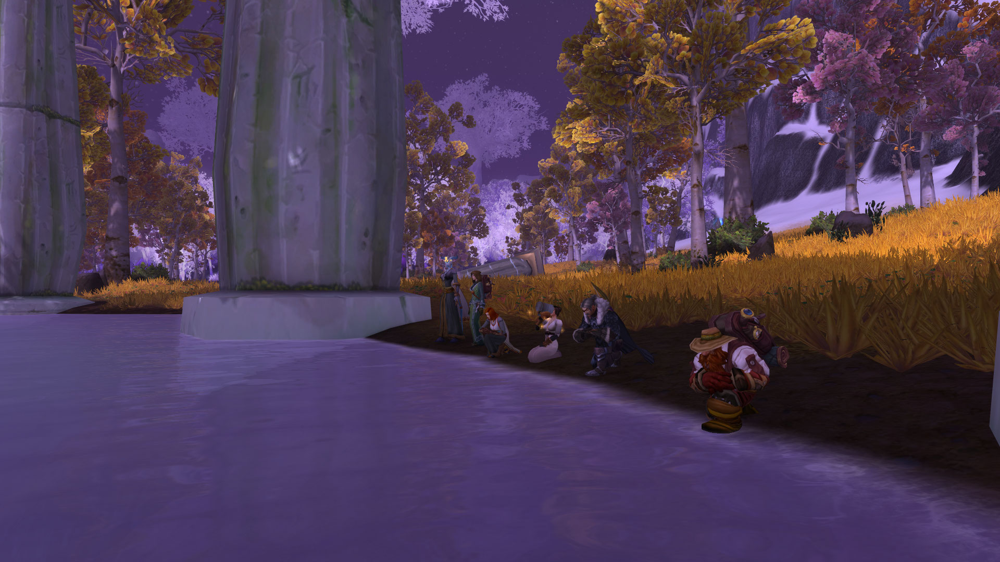

# 第三幕 长途跋涉（记录）

大家艰难地向奥杜尔进发。

记录开始于 01/06/2023日 19:35:36时。\
\[巴里丶劳伦斯]: 穿厚点\
\[巴里丶劳伦斯]: 这里很冷\
\[巴里丶劳伦斯]: 我没包 就不被了啊\
\[布赖恩铜须]: 拿弓箭\
\[布赖恩铜须]: 或者枪\
\[布赖恩铜须]: 真倒霉\
\[布赖恩铜须]: 连续下了七天雪了\
\[法瑞雅]: 雪似乎会一直下下去\
\[布赖恩铜须]: 继续上路吧\
\[布赖恩铜须]: 还有很远的路\
\[法瑞雅]: 我们要徒步去奥杜尔吗？\
\[温蒂丶泰勒]: 又是徒步\
\[布赖恩铜须]: 当然不是\
\[布赖恩铜须]: 我们有\
\[布赖恩铜须]: 山羊!\
熙啊 打了个喷嚏

<figure><figcaption></figcaption></figure>

\[布赖恩铜须]: 这个镇子估计用不了多久\
\[法瑞雅]: 天真冷\
\[布赖恩铜须]: 就会废弃了\
\[布赖恩铜须]: 带上这兔子\
\[布赖恩铜须]: 等会或许能作为午饭呢\
\[布赖恩铜须]: 该死\
巴里丶劳伦斯对布赖恩铜须点了点头。\
\[布赖恩铜须]: 我都不知道现在是白天还是黑夜了\
\[法瑞雅]: 夜晚的时间真长\
熙啊 又打了个喷嚏\
\[温蒂丶泰勒]: 可能是风雪挡住了阳光\
\[布赖恩铜须]: 先说好\
\[布赖恩铜须]: 我们现在食物\
\[布赖恩铜须]: 只有精炼脂肪\
\[布赖恩铜须]: 也就是猪油\
\[巴里丶劳伦斯]: !\
\[布赖恩铜须]: 还有一些腌肉

<figure><figcaption></figcaption></figure>

\[佩瑞妮克洛斯]: 欸\
\[布赖恩铜须]: 以及辣椒\
\[法瑞雅]: 足够到达终点的\
\[布赖恩铜须]: 还有上个月的羊肉\
\[布赖恩铜须]: 土豆已经变成这样了\
布赖恩铜须 扔掉冻成石头的土豆\
\[熙啊]: 不是还有一只兔子么\
\[布赖恩铜须]: 接下来还有就是胡萝卜\
\[布赖恩铜须]: 这些是喂山羊的\
\[布赖恩铜须]: 所以别随便吃东西\
\[布赖恩铜须]: 我们只有这些了\
\[温蒂丶泰勒]: 山羊也不错\
\[布赖恩铜须]: 这个据点里只有这点食物\
\[布赖恩铜须]: 他们也不肯卖给我们\
\[布赖恩铜须]: 走吧\
\[布赖恩铜须]: 我还有半只冬幕节的火鸡\
\[布赖恩铜须]: 山羊在这里\
巴里丶劳伦斯指着极地山羊。\
\[佩瑞妮克洛斯]: 欸\
\[布赖恩铜须]: 出发吧\
\[温蒂丶泰勒]: 圣光在上\
\[布赖恩铜须]: 当心\
\[布赖恩铜须]: 说话小声点\
\[布赖恩铜须]: 不然会引起雪崩\
\[温蒂丶泰勒]: 活着的巨人

<figure><figcaption></figcaption></figure>

巴里丶劳伦斯对布赖恩铜须点了点头。\
\[布赖恩铜须]: 休息\
\[巴里丶劳伦斯]: 这里可真冷\
\[布赖恩铜须]: 生火\
布赖恩铜须跪了下来。\
\[布赖恩铜须]: 都进来\
\[佩瑞妮克洛斯]: 温暖的火堆\
布赖恩铜须跪了下来。\
\[巴里丶劳伦斯]: 。。。。\
\[巴里丶劳伦斯]: 出发了\
\[巴里丶劳伦斯]: 朋友们\
巴里丶劳伦斯 抬头看了看两边巨大的冰川\
\[布赖恩铜须]: 啊\
\[布赖恩铜须]: 走出峡谷了\
\[布赖恩铜须]: 总算见到一丝光了\
\[布赖恩铜须]: 啊\
\[布赖恩铜须]: 看来\
\[法瑞雅]: 如果不是太冷，这一切有美感\
\[布赖恩铜须]: 这个谷地\
\[法瑞雅]: 但是实在是太冷了\
\[布赖恩铜须]: 没有受到寒潮影响\
\[布赖恩铜须]: 依然保持着温暖\
\[布赖恩铜须]: 看来\
\[布赖恩铜须]: 我们很幸运\
\[布赖恩铜须]: 能够取水

<figure><figcaption></figcaption></figure>

布赖恩铜须跪了下来。\
巴里丶劳伦斯跪了下来。\
\[布赖恩铜须]: 哎哟\
\[布赖恩铜须]: 冻死我了\
\[布赖恩铜须]: 这水\
温蒂丶泰勒在巴里丶劳伦斯面前跪下。\
你跪了下来。\
乔丹丶卡佛跪了下来。\
布赖恩铜须开始吃东西。\
\[温蒂丶泰勒]: 这里可以钓鱼\
布赖恩铜须开始吃东西。\
\[布赖恩铜须]: 继续出发\
佩瑞妮克洛斯 开始吃东西\
\[布赖恩铜须]: 你看\
\[布赖恩铜须]: 那边的树\
\[布赖恩铜须]: 都开始冻成冰柱了\
\[佩瑞妮克洛斯]: 是啊\
\[佩瑞妮克洛斯]: 变成冰晶了呢\
\[佩瑞妮克洛斯]: 很漂亮呢\
\[法瑞雅]: 整个世界最终很可能也是这样的结果\
\[佩瑞妮克洛斯]: 是呀像冰河世纪那样\
\[法瑞雅]: 布莱恩我记得你说过这是欧米茄代码启动的后果？\
\[法瑞雅]: 我们很快就会查明真相

\[布赖恩铜须]: 天哪\
\[布赖恩铜须]: 那群大象疯了吗\
\[法瑞雅]: 如果我们还能够返行\
\[法瑞雅]: 接下来就是风暴峭壁了\
\[布赖恩铜须]: 前面应该还有一个镇子\
\[法瑞雅]: 我们很靠近守护者的神殿了\
\[布赖恩铜须]: 我记得\
\[布赖恩铜须]: 我兄弟\
\[布赖恩铜须]: 曾经在那里\
\[布赖恩铜须]: 当国王\
\[巴里丶劳伦斯]: 啊？\
\[布赖恩铜须]: 穆拉丁在那里当过国王\
\[法瑞雅]: 这是一个冰冷的国度，他与守护者同在\
\[布赖恩铜须]: 山羊最适合这个地形了\
\[布赖恩铜须]: 三笔\
\[布赖恩铜须]: 闪避!\
\[布赖恩铜须]: 闪开大象

<figure><figcaption></figcaption></figure>

\[法瑞雅]: 这些大象真古怪\
\[法瑞雅]: 着就是世界最高峰\
\[法瑞雅]: 奥杜尔，守护者们居住在其上\
\[布赖恩铜须]: 噢天哪\
\[布赖恩铜须]: 接下来\
\[布赖恩铜须]: 恐怕\
\[布赖恩铜须]: 我们不能再使用山羊了\
\[法瑞雅]: 这里的地形非常复杂\
\[布赖恩铜须]: 可能我们要登山\
\[布赖恩铜须]: 攀岩\
\[法瑞雅]: 我们准备好了\
\[法瑞雅]: 我们来这就是要刨根问底的\
\[法瑞雅]: 一定要找到答案\
\[布赖恩铜须]: 看来\
\[布赖恩铜须]: 到此为止了\
\[布赖恩铜须]: 不能在用山羊了\
\[布赖恩铜须]: 把山羊\
\[布赖恩铜须]: 牵着上来\
\[布赖恩铜须]: 泰坦在上啊\
\[布赖恩铜须]: 瀑布都冻成冰了\
\[佩瑞妮克洛斯]: 我的天啊\
\[法瑞雅]: 实在令人惊讶

<figure><figcaption></figcaption></figure>

\[布赖恩铜须]: 小点心\
\[法瑞雅]: 小心脚下\
\[布赖恩铜须]: 这是冰\
\[布赖恩铜须]: 小心打滑\
\[佩瑞妮克洛斯]: 好的\
\[布赖恩铜须]: 快跟上\
\[布赖恩铜须]: 会不会\
\[布赖恩铜须]: 我们方向错了\
\[佩瑞妮克洛斯]: 欸\
\[布赖恩铜须]: 这里是峭壁\
\[法瑞雅]: 我们是要去寒冰神殿吗？\
\[布赖恩铜须]: 我们应该\
\[布赖恩铜须]: 从那块冰川上去\
布赖恩铜须指向远方。\
\[布赖恩铜须]: 太高了\
\[布赖恩铜须]: 得用冰镐\
\[布赖恩铜须]: 敲上去\
\[布赖恩铜须]: 贴近里面

<figure><figcaption></figcaption></figure>

\[佩瑞妮克洛斯]: 我的天啊小心一点\
\[巴里丶劳伦斯]: 我断后\
\[布赖恩铜须]: 这里有个锚点\
\[布赖恩铜须]: 千万不能用冰镐打冰\
\[布赖恩铜须]: 这是瀑布\
\[布赖恩铜须]: 太脆弱了\
\[布赖恩铜须]: 万一雪崩\
\[布赖恩铜须]: 我们都完了\
\[法瑞雅]: 小心洗\
布赖恩铜须显得气喘吁吁。\
\[布赖恩铜须]: 天哪\
\[布赖恩铜须]: 我们上来第一阶梯了\
\[布赖恩铜须]: 该死\
\[布赖恩铜须]: 太垂直了\
\[法瑞雅]: 这是一块悬崖\
\[布赖恩铜须]: 不行\
\[法瑞雅]: 不敢想象我们居然上来了\
\[布赖恩铜须]: 第三阶梯\
\[布赖恩铜须]: 太脆弱了\
\[布赖恩铜须]: 你们看\
\[布赖恩铜须]: 这里\
\[布赖恩铜须]: 还能看见里面的水

\[布赖恩铜须]: 来休息一下\
\[布赖恩铜须]: 赞美我的胡子\
\[布赖恩铜须]: 居然有路可以上来\
巴里丶劳伦斯对布赖恩铜须点了点头。\
\[法瑞雅]: 这里其实很美\
佩瑞妮克洛斯对布赖恩铜须点了点头。\
\[布赖恩铜须]: 继续往前走吧\
\[布赖恩铜须]: 冰上生火太危险了\
\[布赖恩铜须]: 而且也太潮湿了\
\[法瑞雅]: 这里就是世界的尽头\
\[布赖恩铜须]: 嗯？\
\[布赖恩铜须]: 臭鼬？\
\[布赖恩铜须]: 为什么这里会有臭鼬\
\[布赖恩铜须]: 快跑\
\[布赖恩铜须]: 他放屁了\
\[布赖恩铜须]: 第四阶梯\
法瑞雅 气喘吁吁\
\[巴里丶劳伦斯]: 我的肺 要被冻住了\
\[布赖恩铜须]: 如果我们到\
\[布赖恩铜须]: 山顶上\
\[布赖恩铜须]: 或许\
\[布赖恩铜须]: 能够修整

<figure><figcaption></figcaption></figure>

\[布赖恩铜须]: 霜脉矮人也许还在\
巴里丶劳伦斯对布赖恩铜须点了点头。\
\[布赖恩铜须]: 前面的维库人城镇应该\
\[布赖恩铜须]: 没人了\
\[法瑞雅]: 真是艰苦的旅程\
\[法瑞雅]: 但我们要知道这下雪的真相\
\[布赖恩铜须]: 我忘记怎么上去了\
\[布赖恩铜须]: 啊\
\[布赖恩铜须]: 看来霜脉矮人孩子\
\[布赖恩铜须]: 还在\
\[布赖恩铜须]: 我们可以在这里休息\
\[布赖恩铜须]: 告诉其他人\
\[法瑞雅]: 还在真好\
\[布赖恩铜须]: 休息\
\[布赖恩铜须]: 每人都有房间\
\[布赖恩铜须]: 每个人都有房间\
\[布赖恩铜须]: 所有人都好好休息\
\[法瑞雅]: 爬山很累确实\
\[布赖恩铜须]: 霜脉矮人兄弟看来不怕寒冷\
巴里丶劳伦斯对布赖恩铜须点了点头。\
温蒂丶泰勒烹制了一顿烧烤大餐！
