# 第四幕 去往寒冰神殿（记录）

记录开始于 01/08/2023日 19:49:39时。\
巴里丶劳伦斯向你鞠躬。\
\[法瑞雅]: 你好啊巴里\
瓦尔多姆向你鞠躬。\
\[巴里丶劳伦斯]: 大家把厚衣服穿上\
\[巴里丶劳伦斯]: 这里很冷\
\[巴里丶劳伦斯]: 别冻坏了\
\[布赖恩铜须]: 噢，我的老天啊，简直是要冻死了\
\[布赖恩铜须]: 我的骨头都要冻僵了\
花语芳菲对散落的星星沙露出了微笑。\
\[布赖恩铜须]: 不行了\
\[布赖恩铜须]: 拿点辣椒\
\[布赖恩铜须]: 熬汤吧\
\[布赖恩铜须]: 把冻羊肉给煮了\
巴里丶劳伦斯对布赖恩铜须点了点头。\
\[巴里丶劳伦斯]: 大家 换件衣服\
\[巴里丶劳伦斯]: 像我这样\
\[巴里丶劳伦斯]: 看着厚一点的\
\[布赖恩铜须]: 穿点带毛的\
\[布赖恩铜须]: 现在气温为-90度

<figure>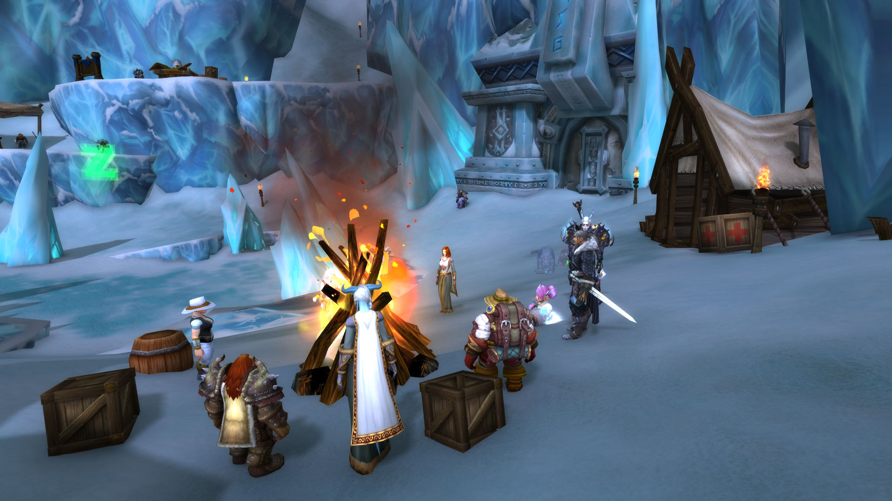<figcaption></figcaption></figure>

\[巴里丶劳伦斯]: 盔甲 换一下\
\[瓦尔多姆]: 我就这一身吧\
\[巴里丶劳伦斯]: 女士\
\[巴里丶劳伦斯]: 这么冷的天气\
\[瓦尔多姆]: 里面是加厚的，没关系\
\[巴里丶劳伦斯]: 就不要露着胳膊了\
\[巴里丶劳伦斯]: 虽然美很重要 但是这里真的很冷的\
\[布赖恩铜须]: 哎呦\
\[布赖恩铜须]: 快冻僵了\
毒蛇罗莎真心地向魔法失灵啦表示问候。\
\[法瑞雅]: 这里是艾泽拉斯最冷的地方之一\
\[毒蛇罗莎]: 你这身毛发 肯定不会冷的吧\
\[布赖恩铜须]: 温蒂\
\[布赖恩铜须]: 做几件毛纺\
\[布赖恩铜须]: 发下去\
\[温蒂丶泰勒]: 好的\
\[朱迪嘉兰]: ……

\[朱迪嘉兰]: 巴里给的衣服更单薄\
朱迪嘉兰哭了。\
\[巴里丶劳伦斯]: 。。\
\[巴里丶劳伦斯]: 。。。\
花语芳菲对巴里丶劳伦斯露出了微笑。\
布赖恩铜须对花语芳菲点了点头。\
花语芳菲向布赖恩铜须鞠躬。\
\[花语芳菲]: 铜须先生晚上好\~\
\[布赖恩铜须]: 登山就需要这样的衣服\
\[花语芳菲]: 谢谢\~\
\[布赖恩铜须]: 毕竟皮革制作的衣服\
\[布赖恩铜须]: 不怕被石头磨破\
\[花语芳菲]: 是呀，还保暖\~\
\[布赖恩铜须]: 我的上一件衣服就被磨烂了\
\[花语芳菲]: 唔\
花语芳菲对布赖恩铜须点了点头。\
\[布赖恩铜须]: 不过还是要注意手的保护

\[布赖恩铜须]: 你看手都冻伤了\
\[花语芳菲]: 对哦，我去戴个手套\
\[布赖恩铜须]: 你的手都冻伤了\
\[花语芳菲]: 嗯…我去找找看\~谢谢\~\
\[布赖恩铜须]: 你发下去\
\[布赖恩铜须]: 看看谁需要\
\[布赖恩铜须]: 就给谁\
\[巴里丶劳伦斯]: 小心你的胳膊\
\[巴里丶劳伦斯]: 会冻伤的\
维塔罗希尔-白银之手响亮地吹了一声口哨。\
花语芳菲对着散落的星星沙咯咯地笑个不停。\
\[温蒂丶泰勒]: 还有需要棉大衣的吗？\
\[维塔罗希尔-白银之手]: 接着，为你的关心\
\[巴里丶劳伦斯]: 这下 暖和多了\
花语芳菲向瓦尔多姆鞠躬。\
\[毒蛇罗莎]: 这位先生\
\[毒蛇罗莎]: 你的盔甲很棒

\[布赖恩铜须]: 噢\
\[布赖恩铜须]: 我喜欢你的帽子\
\[毒蛇罗莎]: 很有味道\
\[复仇者多姆]: 您好，美丽的虚空精灵\
\[魔法失灵啦]: 确实\
\[布赖恩铜须]: 一定很暖和\
毒蛇罗莎向复仇者多姆鞠躬。\
朱迪嘉兰向布赖恩铜须表示感谢。\
花语芳菲对着散落的星星沙咯咯地笑个不停。\
\[朱迪嘉兰]: 是的\
\[复仇者多姆]: 事实上，我是服役于第七军团\
\[魔法失灵啦]: 敬礼！\
\[毒蛇罗莎]: 哇 真棒\
\[复仇者多姆]: 这一身也是第七军团的军装\
魔法失灵啦满怀敬意地向复仇者多姆致礼。\
复仇者多姆立正敬礼。\
\[布赖恩铜须]: 你背后三个人\
毒蛇罗莎向布赖恩铜须鞠躬。\
魔法失灵啦满怀敬意地向布赖恩铜须致礼。

<figure>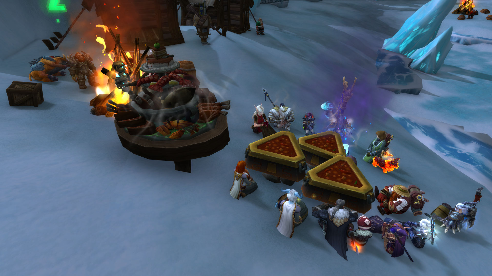<figcaption></figcaption></figure>

\[布赖恩铜须]: 各位\
毒蛇罗莎向布赖恩铜须鞠躬。\
\[布赖恩铜须]: 离奥杜尔\
\[布赖恩铜须]: 奥杜尔的寒冬神殿\
\[布赖恩铜须]: 只有3座山了\
\[布赖恩铜须]: 我们如果今天运气好\
\[布赖恩铜须]: 我们能够到\
\[布赖恩铜须]: 该死，我不知道现在是黑夜还是白天\
\[布赖恩铜须]: 巴里\
\[布赖恩铜须]: 来\
\[布赖恩铜须]: 把羊肉炖了\
巴里丶劳伦斯对布赖恩铜须点了点头。\
\[布赖恩铜须]: 至少今天我们还能吃一顿热的\
巴里丶劳伦斯准备了一席鲜血大餐！\
\[布赖恩铜须]: 恩\
\[布赖恩铜须]: 多放点辣椒\
巴里丶劳伦斯准备了一席鲜血大餐！\
巴里丶劳伦斯准备了一席鲜血大餐！\
维塔罗希尔准备好了一份船长盛宴佳肴！

巴里丶劳伦斯 感觉身体暖和起来\
\[法瑞雅]: 这顿热乎的\
毒蛇罗莎 感觉身体充满了力量\
\[布赖恩铜须]: 啊\
温蒂丶泰勒在魔法失灵啦面前躺下。\
\[布赖恩铜须]: 我充满了力量\
布赖恩铜须正在展示他的肌肉。哇，好壮啊！\
\[布赖恩铜须]: 拿起行李\
\[布赖恩铜须]: 准备出发\
\[布赖恩铜须]: 多穿点才能保暖\
\[布赖恩铜须]: 接下来的暴风雪\
\[布赖恩铜须]: 会更加强烈了。\
\[布赖恩铜须]: 出发了朋友们\
\[布赖恩铜须]: 多穿点\
\[温蒂丶泰勒]: 真想把火堆带上

\[布赖恩铜须]: 请把睡觉的衣服脱了，换成探险的服装\
\[布赖恩铜须]: 不然会很冷的\
\[布赖恩铜须]: 出发\
\[法瑞雅]: 走吧\
温蒂丶泰勒向霜脉持斧者挥手致意。\
\[布赖恩铜须]: 下面雪很厚\
\[布赖恩铜须]: 不会摔死的\
\[布赖恩铜须]: 可能\
\[布赖恩铜须]: 前面的镇子\
\[布赖恩铜须]: 没有活人了\
\[佩瑞妮克洛斯]: 欸\
\[布赖恩铜须]: 所以\
\[法瑞雅]: 这是山中的镇子\
\[布赖恩铜须]: 接下来发生什么\
\[布赖恩铜须]: 都不要惊慌\
\[法瑞雅]: 可能都被冻裂了\
\[毒蛇罗莎]: 会发生什么呢\
\[法瑞雅]: 这里是很危险的山区\
\[法瑞雅]: 瓦格里！

\[布赖恩铜须]: 嘘\
\[布赖恩铜须]: 有没有盗贼\
\[布赖恩铜须]: 或许我们能够\
\[布赖恩铜须]: 在帷幕下\
\[布赖恩铜须]: 混进去\
\[毒蛇罗莎]: 愿意为您效劳\
\[毒蛇罗莎]: 先生\
\[布赖恩铜须]: 恩\
\[布赖恩铜须]: 大家\
\[布赖恩铜须]: 及合起来\
\[布赖恩铜须]: 集合\
\[布赖恩铜须]: 都抱团\
\[佩瑞妮克洛斯]: 好\
\[布赖恩铜须]: 准备冲过去

<figure>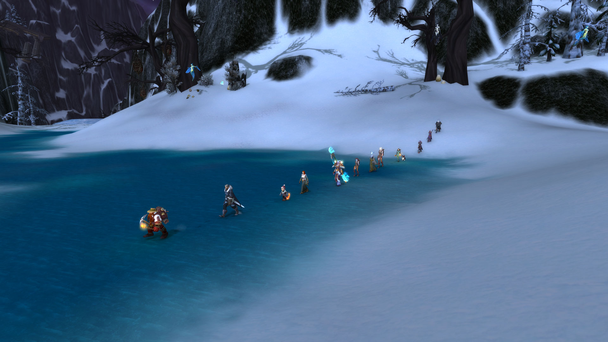<figcaption></figcaption></figure>

\[复仇者多姆]: 我可以用在阿彻鲁斯学过的魔法来控制其中一只！\
\[毒蛇罗莎]: 你说开始 我就施法\
\[布赖恩铜须]: 准备好了吗\
\[布赖恩铜须]: 3\
\[复仇者多姆]: 我可以控制其中一只！布赖恩！\
\[布赖恩铜须]: 2\
\[布赖恩铜须]: 1\
\[布赖恩铜须]: 开启帷幕\
\[布赖恩铜须]: 跑\
\[复仇者多姆]: 前面还有一只！\
布赖恩铜须指向远方。\
\[毒蛇罗莎]: 我们成功了\
\[布赖恩铜须]: 快\
\[布赖恩铜须]: 从那边走\
\[复仇者多姆]: 天哪，他就在我们天上\
\[布赖恩铜须]: 都检查一下\
\[布赖恩铜须]: 看看胳膊\
\[法瑞雅]: 果然厉害\
\[布赖恩铜须]: 还在身上没\
\[复仇者多姆]: 我其实可以控制一只的，我说了，我在阿彻鲁斯学过一种强大的咒语

<figure>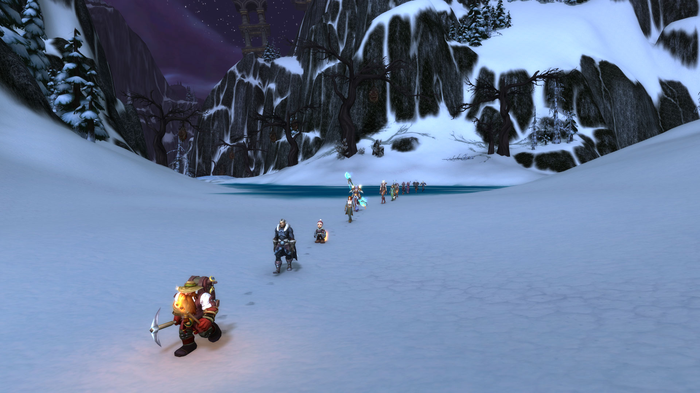<figcaption></figcaption></figure>

毒蛇罗莎 仔细打量着身体觉得并无大碍\
\[法瑞雅]: 我们都还活着\
\[布赖恩铜须]: 呼\
\[布赖恩铜须]: 看来\
\[巴里丶劳伦斯]: 大家都没事\
\[复仇者多姆]: 我的腿受伤了\
\[复仇者多姆]: 谁说没事\
\[布赖恩铜须]: 接下来的路不好走了\
\[布赖恩铜须]: 什么？\
\[布赖恩铜须]: 你受伤了!\
\[布赖恩铜须]: 快\
复仇者多姆 啊，我的脚好痛\
\[布赖恩铜须]: 把他抬过来\
复仇者多姆躺了下来。\
\[布赖恩铜须]: 抬过来\
\[复仇者多姆]: 快帮我\
\[复仇者多姆]: 我….我流了好多血

法瑞雅 抬起复仇者多姆\
\[复仇者多姆]: 好像是骨头断了\
巴里丶劳伦斯 抬起多母\
\[花语芳菲]: 啊…我想我可以…稍微给他缓解一下\
\[布赖恩铜须]: 恩\
\[温蒂丶泰勒]: 头朝下，流血少\
\[布赖恩铜须]: 砍了这条腿\
\[复仇者多姆]: 快把我翻过来\
\[复仇者多姆]: 我要脑溢血了\
\[巴里丶劳伦斯]: 忍住\
\[巴里丶劳伦斯]: 一下就好了\
\[复仇者多姆]: 那你们要一路抬着我走了\
\[布赖恩铜须]: 这条腿砍了\
\[布赖恩铜须]: 就不疼了\
\[复仇者多姆]: 你们不会丢下队友的对吧？\
\[布赖恩铜须]: 那不一定\
\[复仇者多姆]: 你们肯定不会的\
\[巴里丶劳伦斯]: 放心你的腿 立刻就会冻上\
\[复仇者多姆]: 伟大的布莱恩铜须怎么会丢下队友

<figure><figcaption></figcaption></figure>

\[巴里丶劳伦斯]: 不会流血\
\[布赖恩铜须]: 我会保留你的腿\
\[布赖恩铜须]: 放在博物馆的\
\[复仇者多姆]: 那样对我又什么好处！\
\[布赖恩铜须]: 特别注明\
\[布赖恩铜须]: 英雄之腿\
\[法瑞雅]: 我觉得保住腿比较难\
\[复仇者多姆]: 整个博物馆只展览我的腿吗\
\[温蒂丶泰勒]: 我们没有足够的盐，怎么带回去他的腿？\
\[布赖恩铜须]: 不\
\[布赖恩铜须]: 放在角落里\
\[复仇者多姆]: 啊，我知道怎么救我了\
\[复仇者多姆]: 看到旁边那颗树下的草药了吗\
\[布赖恩铜须]: 别废话了\
\[复仇者多姆]: 快把他给我\
\[布赖恩铜须]: 砍了腿\
\[佩瑞妮克洛斯]: 要是有布条好就好了\
\[布赖恩铜须]: 都让一人\
\[布赖恩铜须]: 都让让\
\[布赖恩铜须]: 都让让

\[复仇者多姆]: 啊，不….\
\[复仇者多姆]: 不要\
\[毒蛇罗莎]: 不忍直视啊\
\[花语芳菲]: 唔,有会采集草药的人吗…\
\[复仇者多姆]: 我还要去杀BL\
\[毒蛇罗莎]: 快转过身\
\[复仇者多姆]: 谢谢你，这位女士\
复仇者多姆 吃下了[\[冰棘草\]](http://www.wowhead.com/?item=36906)\
\[毒蛇罗莎]: 天哪\
复仇者多姆 感觉腿回复的很快\
复仇者多姆 我好了\
\[温蒂丶泰勒]: 竟然恢复了\
\[布赖恩铜须]: 你没好\
\[复仇者多姆]: 谢谢你，女士\
\[温蒂丶泰勒]: 感谢圣光\
\[毒蛇罗莎]: 好神奇！\
\[法瑞雅]: 圣光祝福了他\
\[复仇者多姆]: 我好了，我已经站起来了\
\[布赖恩铜须]: 必须节制\
\[布赖恩铜须]: 截肢

\[复仇者多姆]: 我腿好了，你还要砍了？\
\[布赖恩铜须]: 这样才能保住小命\
\[复仇者多姆]: 你是为了让我和你一样高么？\
\[复仇者多姆]: 你是嫉妒我的身高！\
\[复仇者多姆]: 矮人！\
\[法瑞雅]: 如果他能走的话\
\[布赖恩铜须]: 不行\
\[复仇者多姆]: 现在在场的所有人，就你最矮\
\[布赖恩铜须]: 必须给锯了\
\[复仇者多姆]: 你再说！\
\[布赖恩铜须]: 得让你比矮个儿还矮\
\[复仇者多姆]: 我还能矮过侏儒吗？\
\[布赖恩铜须]: 行吧\
\[复仇者多姆]: 我大名鼎鼎多姆，躺下都比侏儒高的人！\
\[布赖恩铜须]: 就算你好了\
\[法瑞雅]: 就让他走路吧，不会多个累赘\
\[布赖恩铜须]: 直接埋雪里不好吗\
\[复仇者多姆]: 女士

<figure>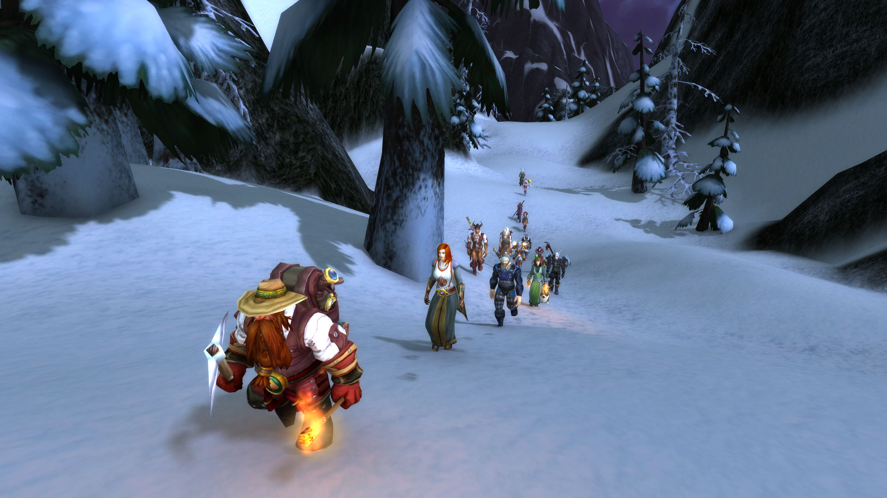<figcaption></figcaption></figure>

花语芳菲招手示意散落的星星沙过来。\
\[复仇者多姆]: 您叫什么名字\
\[复仇者多姆]: 我前面的那位女士\
\[布赖恩铜须]: 翻过这个山头\
\[布赖恩铜须]: 就快到了\
\[法瑞雅]: 我是法瑞雅\
\[复仇者多姆]: 喔\~可真动听\
\[复仇者多姆]: 看你穿的如此单薄，不如把我的外套披上，好吗？\
\[法瑞雅]: 我们估计还离终点很远\
\[法瑞雅]: 不需要\
\[法瑞雅]: 我穿着长袍\
\[复仇者多姆]: 快停下！\
\[九宝儿]: 大虫子\
\[布赖恩铜须]: 看我的\
\[复仇者多姆]: 长虫\
\[毒蛇罗莎]: 是一只远古巨虫！

\[复仇者多姆]: 哇，你可真厉害\
\[法瑞雅]: 一招杀虫！\
\[复仇者多姆]: 你竟然会魔法\
\[布赖恩铜须]: 这是邪恶的洛肯的子嗣\
\[复仇者多姆]: 你为什么会使用魔法\
\[布赖恩铜须]: 泰坦装置\
\[布赖恩铜须]: 我还能把人变成火鸡\
花语芳菲安抚着雪流冰虫。一切……一切都会好的。\
\[宅细胞]: 怎么变?\
\[复仇者多姆]: 是这样吗？\
\[宅细胞]: 哇\~\
\[法瑞雅]: 这把自己变成了火鸡\
\[九宝儿]: 我可以把火鸡变成烤鸡\
\[九宝儿]: 你们看好\
\[复仇者多姆]: 刚才吃的羊肉都消耗了吧？各位

\[散落的星星沙]: 嗯。。。我们还有多少食物\*小声\*\
\[法瑞雅]: 糟糕，他不见了！\
温蒂丶泰勒在宅细胞面前躺下。\
\[复仇者多姆]: 怎么放在雪地里了，这样就冰了\
\[法瑞雅]: 布莱恩去哪了？\
\[佩瑞妮克洛斯]: 那是什么\
\[法瑞雅]: 我们得找到他\
\[法瑞雅]: 看！\
\[法瑞雅]: 这火鸡，估计就是了吧？\
\[温蒂丶泰勒]: 不起作用啊\
\[法瑞雅]: 有人能解除法术吗？\
\[温蒂丶泰勒]: 这是什么邪魔法\
\[法瑞雅]: 或许需要一个法师？\
\[瓦尔多姆]: 我来试一下\
\[九宝儿]: 我试试\
\[宅细胞]: 咕咕咕“咕咕\`\
\[法瑞雅]: 两只火鸡呀\
\[宅细胞]: 感谢\
\[复仇者多姆]: 你们为什么都会使用魔法？

\[布赖恩铜须]: 该死\
\[法瑞雅]: 好了！\
\[瓦尔多姆]: 啊\
\[布赖恩铜须]: 是谁把我\
\[瓦尔多姆]: 成了\
\[布赖恩铜须]: 变成了火鸡\
\[复仇者多姆]: 是你自己\
\[复仇者多姆]: 言出法随\
\[法瑞雅]: 魔法反噬了吧\
\[布赖恩铜须]: 该死的火鸡装置\
布赖恩铜须 把泰坦火鸡装置丢掉了\
\[法瑞雅]: 总是出乎意料\
\[布赖恩铜须]: 继续走吧\
\[法瑞雅]: 我们继续前进吧\
\[布赖恩铜须]: 快入夜了\
\[布赖恩铜须]: 传闻说\
\[布赖恩铜须]: 这座高山\
\[布赖恩铜须]: 上面有风暴的力量\
\[复仇者多姆]: 快看那边！\
\[复仇者多姆]: 好大的布莱恩雕像\
\[宅细胞]: 不好意思\`\
\[布赖恩铜须]: 那是巨人\
\[宅细胞]: 我想方便一下\`\
\[复仇者多姆]: 巨人布莱恩

\[布赖恩铜须]: 最好别\
\[布赖恩铜须]: 这地方\
\[布赖恩铜须]: 撒泡尿都会结冰\
\[九宝儿]: 我陪你去 宝贝\
\[法瑞雅]: 会冻到自己的\
\[复仇者多姆]: 是因为你知道自己太矮，所以才建造了一个如此庞大的自己吗\
复仇者多姆在嘲笑布赖恩铜须。\
\[宅细胞]: 还是不了\
\[法瑞雅]: 继续向前走吧\
\[布赖恩铜须]: 前面的峡谷过去\
\[布赖恩铜须]: 我们就能到奥杜尔了\
\[法瑞雅]: 奥杜尔是守护者们的地方\
\[布赖恩铜须]: 看\
\[布赖恩铜须]: 前面就是奥杜尔了\
\[布赖恩铜须]: 前面就是奥杜尔了\
\[布赖恩铜须]: 从这里就能看见寒冬神殿了

<figure>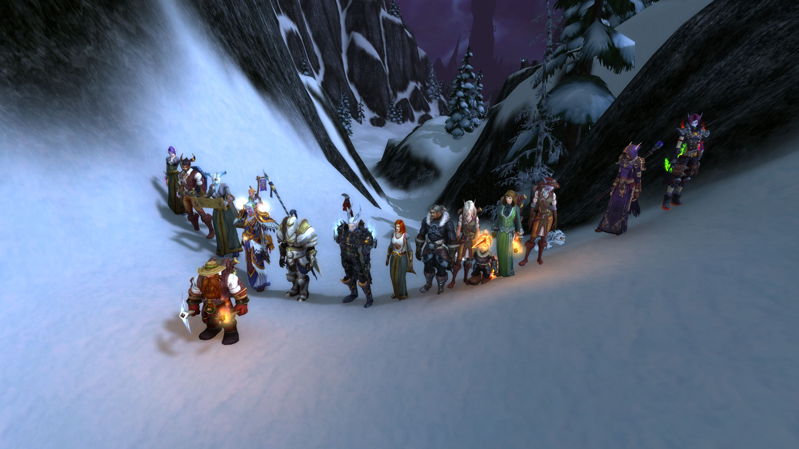<figcaption></figcaption></figure>

布赖恩铜须指向远方。\
\[宅细胞]: 哇塞\
\[法瑞雅]: 寒冬神殿！\
\[布赖恩铜须]: 接下来\
\[布赖恩铜须]: 我们马上就要进入泰坦城市了\
\[布赖恩铜须]: 排好队伍\
\[宅细胞]: 温蒂\`感谢你给的与御寒衣物\`\
\[宅细胞]: 我感觉“\`好多了\
\[布赖恩铜须]: 队伍排好\
\[布赖恩铜须]: 把奇怪的宠物关掉\
\[布赖恩铜须]: 过来合照\
\[布赖恩铜须]: 战成一排\
巴里丶劳伦斯大声欢呼！\
\[布赖恩铜须]: 当心点\
\[布赖恩铜须]: 前面的泰坦城市\
\[布赖恩铜须]: 很多机关\
\[法瑞雅]: 真壮美\
\[温蒂丶泰勒]: 前面好多基维斯啊

花语芳菲真心地向梅尔维拉苟萨表示问候。\
\[九宝儿]: 那个光球是什么\
\[复仇者多姆]: 伟大的布莱恩铜须会把他们一一解除\
梅尔维拉苟萨向花语芳菲挥手致意。\
花语芳菲对梅尔维拉苟萨露出了微笑。\
\[法瑞雅]: 那是，数据库？\
巴里丶劳伦斯向梅尔维拉苟萨鞠躬。\
\[布赖恩铜须]: 准备\
\[布赖恩铜须]: 出发\
\[布赖恩铜须]: 保护我\
\[布赖恩铜须]: 我要检查下\
\[九宝儿]: 好大\
\[复仇者多姆]: 你怎么可以杀兔兔\
\[宅细胞]: 这些零件以后可能会用得上\
\[复仇者多姆]: 兔兔那么可爱\
\[维塔罗希尔-白银之手]: 你怎么看到是我杀的？\
\[维塔罗希尔-白银之手]: 我什么都没做\
维塔罗希尔-白银之手坚决地对复仇者多姆说不。\
\[复仇者多姆]: 你对他使用了什么？\
\[维塔罗希尔-白银之手]: 我就站在你身边\
\[法瑞雅]: 我们保护好布莱恩\
\[维塔罗希尔-白银之手]: 我做了什么

<figure>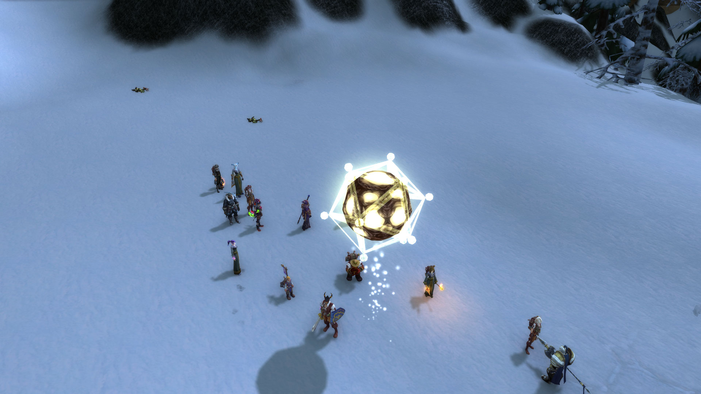<figcaption></figcaption></figure>

维塔罗希尔-白银之手正在向复仇者多姆提问。\
\[布赖恩铜须]: 好了\
\[布赖恩铜须]: 我解除了\
\[布赖恩铜须]: 奥杜尔的防御系统\
\[复仇者多姆]: 那兔兔怎么死的\
\[维塔罗希尔-白银之手]: 兔兔突然躺下了，这里有鬼怪\
\[九宝儿]: 牛啊\
\[维塔罗希尔-白银之手]: 有邪灵\
维塔罗希尔-白银之手被复仇者多姆惊呆了。\
\[布赖恩铜须]: 看吧\
\[布赖恩铜须]: 创世的神迹\
温蒂丶泰勒 右手自然屈曲，先点额头，再点胸膛，后点左右肩并双手合十\
布赖恩铜须指向远方。\
\[法瑞雅]: 真的很壮观\
\[九宝儿]: 真是宏伟的建筑\
巴里丶劳伦斯 被眼前宏伟的建筑群 惊呆了\
\[布赖恩铜须]: 在那上面的\
\[布赖恩铜须]: 就是寒冬神殿\
毒蛇罗莎为维塔罗希尔-白银之手而欢呼！\
\[布赖恩铜须]: 在这里休整一下\
\[布赖恩铜须]: 这里\
\[布赖恩铜须]: 拿出毛毯\
\[布赖恩铜须]: 拿出毛毯子

\[复仇者多姆]: 哇，你刚才骑得狮鹫呢？\
\[复仇者多姆]: 怎么突然没了\
\[布赖恩铜须]: 大伙儿\
\[布赖恩铜须]: 都赶紧休息休息\
\[九宝儿]: 我搭个帐篷\
\[布赖恩铜须]: 黑夜要降临了\
毒蛇罗莎为九宝儿而欢呼！\
\[毒蛇罗莎]: 你竟然还会做这个\
\[毒蛇罗莎]: 不会塌吧\
\[九宝儿]: 稳得很\
布赖恩铜须进入了梦乡。Zzzzzzz…\
散落的星星沙进入了梦乡。Zzzzzzz…\
花语芳菲进入了梦乡。Zzzzzzz…\
毒蛇罗莎进入了梦乡。Zzzzzzz…\
\[温蒂丶泰勒]: 晚安\
\[维塔罗希尔-白银之手]: 巴里\
\[复仇者多姆]: 你们安心睡觉，我去站岗巡逻\
\[维塔罗希尔-白银之手]: 你冷吗？\
你进入了梦乡。Zzzzzzz…\
瓦尔多姆进入了梦乡。Zzzzzzz…\
\[巴里丶劳伦斯]: 当然很冷

<figure>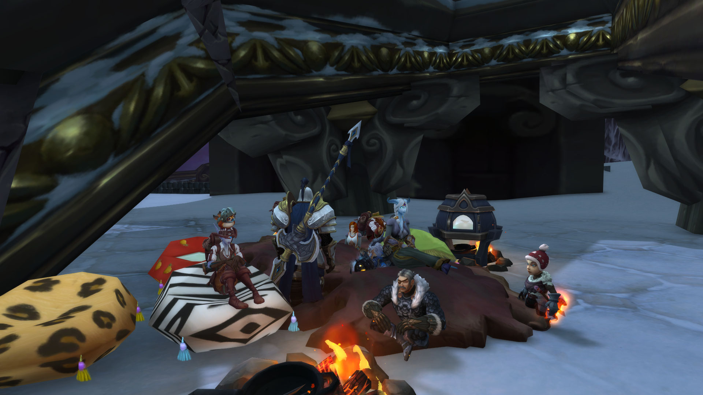<figcaption></figcaption></figure>

\[复仇者多姆]: 身为第七军团的士兵，这是我应该做的\
\[温蒂丶泰勒]: 亡者果然不需要睡觉\
\[维塔罗希尔-白银之手]: 我也冷\
\[复仇者多姆]: 你们为什么不表示表示？\
\[维塔罗希尔-白银之手]: 抱住我，互相取暖\
维塔罗希尔-白银之手 放下背包\
\[宅细胞]: 要衣服嘛?\
\[复仇者多姆]: 那我也睡\
\[巴里丶劳伦斯]: 坐在篝火边吧 女士\
佩瑞妮克洛斯 抱住\
复仇者多姆进入了梦乡。Zzzzzzz…\
\[维塔罗希尔-白银之手]: 坐在篝火边也冷\
\[维塔罗希尔-白银之手]: 我们抱在一起取暖吧\
\[九宝儿]: 什么衣服？\
布赖恩铜须进入了梦乡。Zzzzzzz…\
\[复仇者多姆]: 喂！\
\[布赖恩铜须]: 各位

\[复仇者多姆]: 下面有个人呢！\
\[布赖恩铜须]: 休息好了吗\
\[布赖恩铜须]: 上山了\
\[宅细胞]: 抱歉\
毒蛇罗莎为宅细胞而欢呼！\
\[法瑞雅]: 休息好了\
\[布赖恩铜须]: 收拾好皮毛\
\[布赖恩铜须]: 上山了\
\[复仇者多姆]: 你差点一屁股把我作死\
\[宅细胞]: 我感觉还是拿着我的武器\`心里比较踏实\`\
温蒂丶泰勒指着图书馆守卫者。\
\[瓦尔多姆]: 跑过来！\
复仇者多姆躺了下来。\
\[复仇者多姆]: 啊\
\[复仇者多姆]: 我的腿\
\[复仇者多姆]: 又摔断了\
毒蛇罗莎靠在复仇者多姆的肩膀上泣不成声。\
\[布赖恩铜须]: 恩\
\[布赖恩铜须]: 没救了

\[法瑞雅]: 这次……\
\[毒蛇罗莎]: 怎么会这样啊\
\[宅细胞]: 我们需要医生\
\[布赖恩铜须]: 这次\
朱迪嘉兰向花语芳菲表示感谢。\
\[法瑞雅]: 是真的摔到了\
\[布赖恩铜须]: 骨头都摔出来了\
\[布赖恩铜须]: 有人愿意拉着瘸子走吗\
\[宅细胞]: 我拉着他吧\`\
\[布赖恩铜须]: 我建议还是就地埋了\
\[布赖恩铜须]: 接下来是上山\
\[复仇者多姆]: 谢谢你啊，虽然你刚才一屁股坐在了我的头上\
\[布赖恩铜须]: 负重前行很危险\
\[宅细胞]: 万一之后肚子饿了呢\`\
\[毒蛇罗莎]: 为了联盟 我们不会抛下任何人

复仇者多姆开始为联盟欢呼！\
\[宅细胞]: 你的盔甲太重了\`\
\[布赖恩铜须]: 接下来要进入\
\[布赖恩铜须]: 泰坦之城\
\[宅细胞]: 不如换掉吧\`反正你也不需要他们了\`\
\[复仇者多姆]: 这位女士，你可千万不要放屁哈，虽然我鼻子不是很灵敏，但是闻到屁味还是会泛呕\
\[布赖恩铜须]: 神之阶梯\
\[毒蛇罗莎]: 看到你这副场景 让我想起了小时候父亲也拉着我这样滑冰 真是让人难忘呢\
花语芳菲赢下了一局炉石比赛！\
花语芳菲放下了炉石游戏盘！谁想来玩？\
\[布赖恩铜须]: 接下来要\
\[布赖恩铜须]: 上全世界\
\[布赖恩铜须]: 最高的阶梯\
\[布赖恩铜须]: 恩？\
\[布赖恩铜须]: 为什么\
\[布赖恩铜须]: 泰坦造物\
\[法瑞雅]: 这令人惊叹\
\[布赖恩铜须]: 在山下\
\[法瑞雅]: 很高的阶梯

<figure>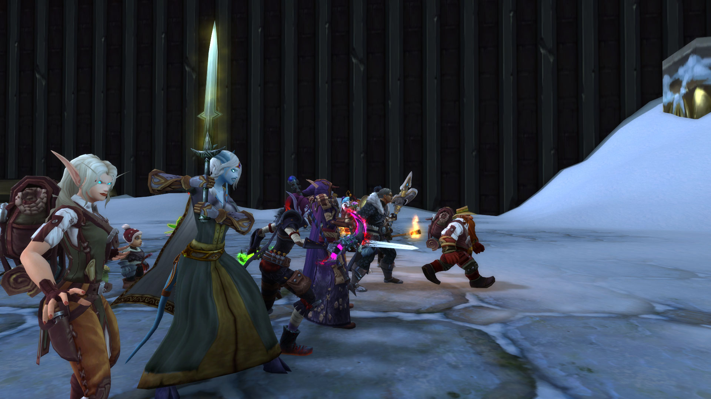<figcaption></figcaption></figure>

<figure>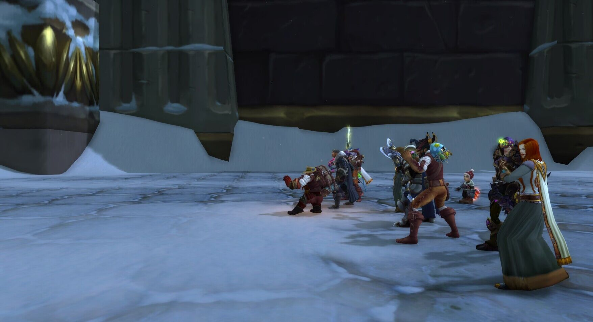<figcaption></figcaption></figure>

\[布赖恩铜须]: 而且他们敌对上方\
\[九宝儿]: 这楼梯真大\
\[布赖恩铜须]: 肯定是出事了\
\[毒蛇罗莎]: 一定很疼吧 小声\
\[布赖恩铜须]: 我们一定要上去看看\
\[复仇者多姆]: 哎，怎么换成你了\
\[九宝儿]: 侏儒能上去吗\
\[宅细胞]: 我拉不动了\`\
\[布赖恩铜须]: 哎哟\
\[毒蛇罗莎]: 你好重啊\
\[复仇者多姆]: 我还行吧，主要是下半身重\
\[宅细胞]: 待会下去的时候才麻烦\
\[布赖恩铜须]: 这叫150步\
\[布赖恩铜须]: 天梯\
\[九宝儿]: 有个大家好\
\[九宝儿]: 大家伙\
\[布赖恩铜须]: 让开

<figure>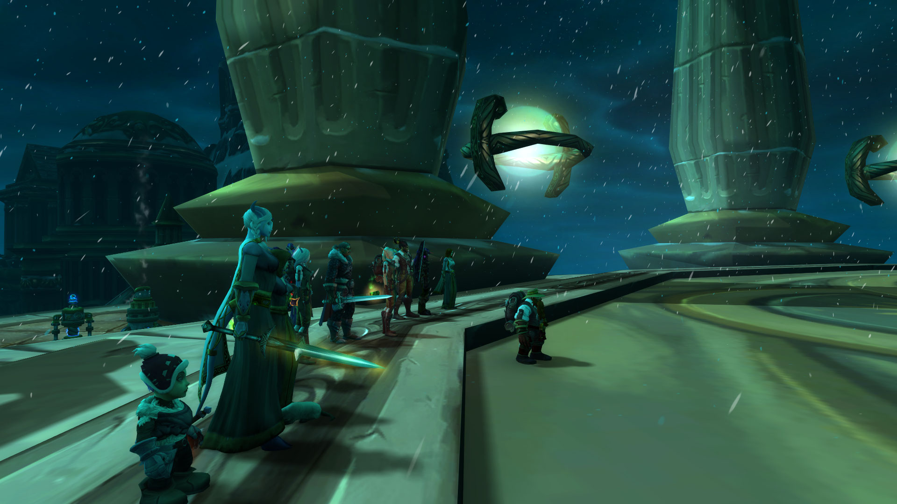<figcaption></figcaption></figure>

\[法瑞雅]: 巨人的阶梯\
\[毒蛇罗莎]: 这次我们还要偷偷溜过去吗\
\[九宝儿]: 哈哈\
\[复仇者多姆]: 谁啊，真厉害\
\[九宝儿]: 拿着弓箭\
\[九宝儿]: 嗯\
\[布赖恩铜须]: 我的胡子在上!\
\[布赖恩铜须]: 这里怎么了\
\[布赖恩铜须]: 霍迪尔的仆从怎么都战死了\
\[法瑞雅]: 看这些尸体\
\[布赖恩铜须]: 难道说\
\[布赖恩铜须]: 其他神殿\
\[布赖恩铜须]: 也都沦陷了\
\[法瑞雅]: 很可能也沦陷了\
\[布赖恩铜须]: 怪不得刚才那些泰坦造物为何敌对这座城市\
\[布赖恩铜须]: 而下面城市还都被拜荒者占领了\
\[宅细胞]: 我感觉后背凉飕飕的\`刚才\
\[布赖恩铜须]: 看来\
\[布赖恩铜须]: 奥杜尔的守护者们都阵亡了\
\[布赖恩铜须]: 这才是寒冬来临的原因

\[法瑞雅]: 艾泽拉斯还有机会吗？\
\[布赖恩铜须]: 或许远古法庭\
\[布赖恩铜须]: 还有机会\
巴里丶劳伦斯 叹气\
\[法瑞雅]: 远古法庭，在奥丹姆？\
\[布赖恩铜须]: 但是我需要5位勇士\
\[布赖恩铜须]: 与我一同进入奥杜尔\
\[布赖恩铜须]: 如果你们准备好了\
九宝儿向布赖恩铜须展示肌肉。哇，好壮啊！\
\[布赖恩铜须]: 就到岩石大厅找我吧\
温蒂丶泰勒在你面前躺下。\
服部半藏 胡言乱语了一通。

<figure>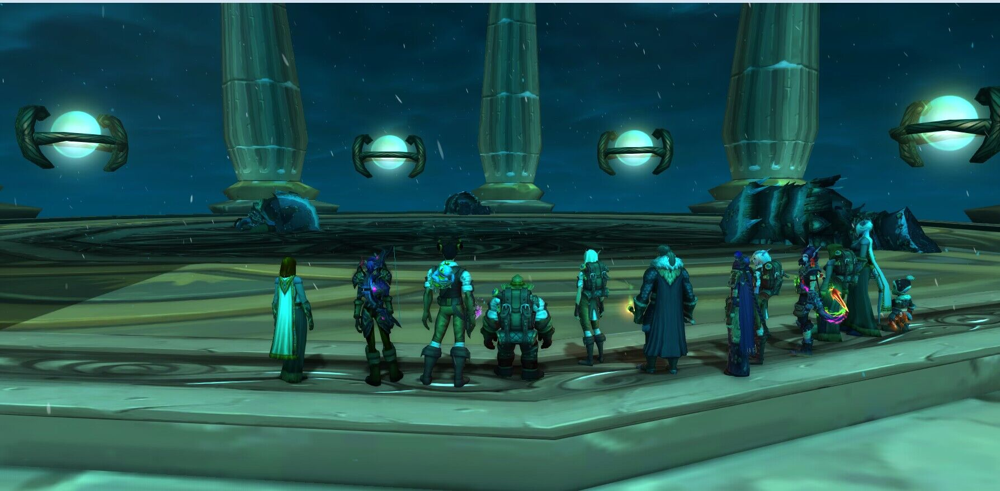<figcaption></figcaption></figure>
