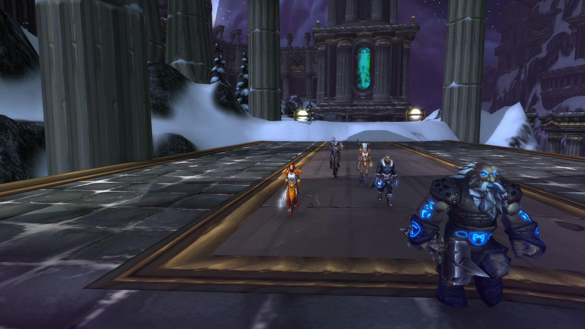
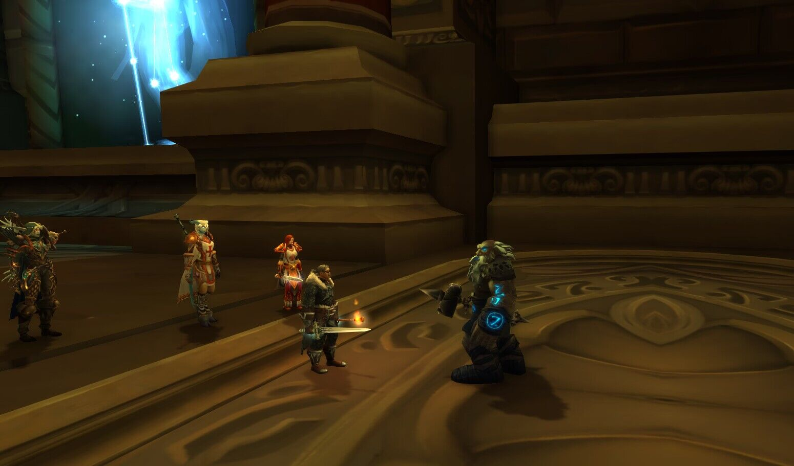
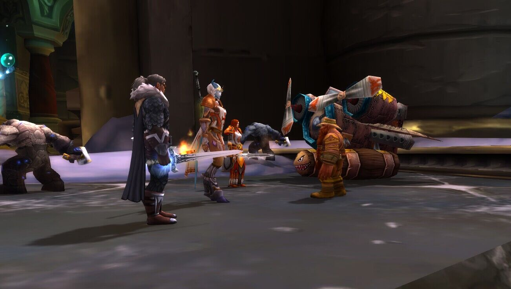
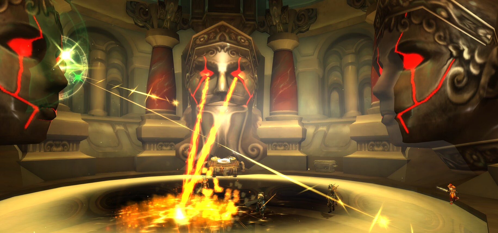
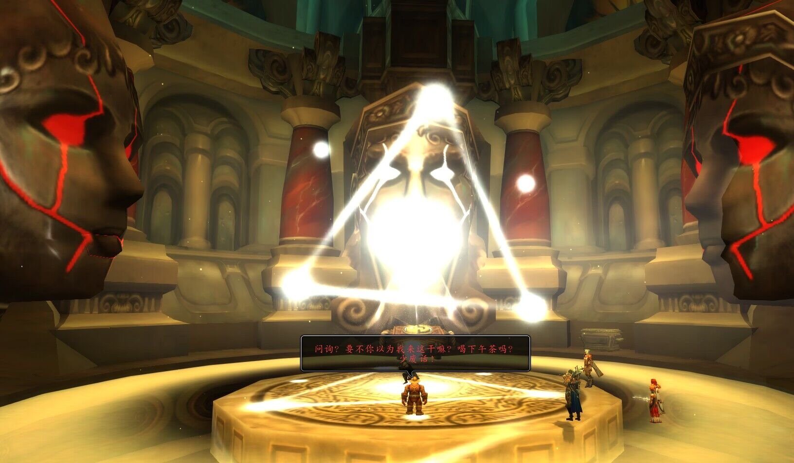
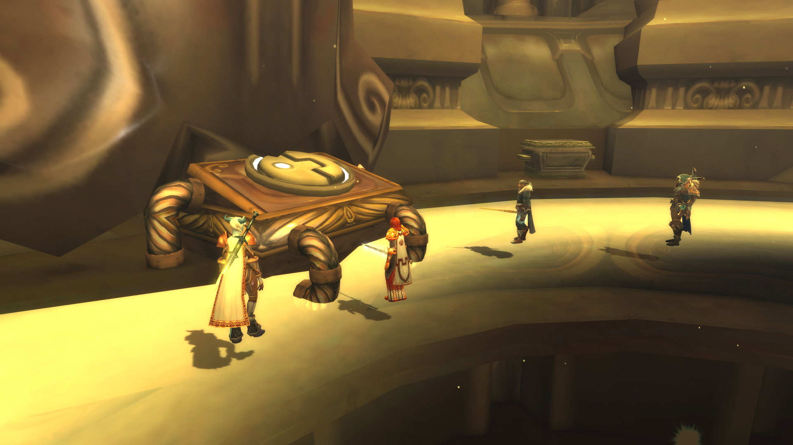

# 第五幕 奥杜尔调查（记录）

<figure><figcaption></figcaption></figure>

记录开始于 01/11/2023日 19:45:45时。

\[法瑞雅]: 我们会见到布莱恩的\
\[巴里丶劳伦斯]: 萨沙\
\[巴里丶劳伦斯]: 我们出发了\
\[岩石大厅管理者]: 请随我来\
\[岩石大厅管理者]: 一般这里是不对凡人开放的\
\[法瑞雅]: 这大厅非常古老\
\[岩石大厅管理者]: 不要乱动这里东西\
\[岩石大厅管理者]: 凡人\
\[法瑞雅]: 这里的东西都属于守护者\
\[巴里丶劳伦斯]: 你是谁\
\[岩石大厅管理者]: 我是岩石大厅管理者\
\[岩石大厅管理者]: 艾泽拉斯的代言人允许了你们的进入

<figure><figcaption></figcaption></figure>

\[法瑞雅]: 我们来调查欧米茄代码是否被释放\
\[岩石大厅管理者]: 系统出故障了\
\[岩石大厅管理者]: 布莱恩在这里\
\[巴里丶劳伦斯]: 看那是谁\
\[岩石大厅管理者]: 请与他交谈\
\[法瑞雅]: 布莱恩，在这里见到你了，你的调查结果怎么样\
\[法瑞雅]: 这暴风雪的成因\
\[法瑞雅]: 有线索了吗？\
\[法瑞雅]: 啊这\
\[巴里丶劳伦斯]: 天哪\
\[法瑞雅]: 这是什么装置？\
\[巴里丶劳伦斯]: 看那张巨大的脸\
\[巴里丶劳伦斯]: 怎么回事\
\[法瑞雅]: 我们得保护他

<figure><figcaption></figcaption></figure>

布莱恩·铜须 喊话: 休息一会，然后和我一起来启动这个东西。一切……马上就要真相大白了。好了，我们开始吧！

布莱恩·铜须 喊话: 嗯，你们帮我看着点外面。我这样的强者只要锤两下就能搞定这破烂……

埃比德努 喊话: 警告：生命体形态模式无法辨识。文档处理程序中断。继续干涉程序将导致安全对策启动。

布莱恩·铜须 喊话: 噢，见鬼，好像有点不太妙，看来我们遇到点小麻烦啦……

卡德拉克 喊话: 安全系统发现不明入侵。历史文档的分析工作优先级转为低。对策程序立即启动。

布莱恩·铜须 喊话: 嘿，破机器，怎么样？你想跟我来硬的？太可惜了，这是属于我的游戏！

布莱恩·铜须 喊话: 再给我几分钟，马上就能……啊噢……

玛尔纳克 喊话: 已超出威胁指数标准。天界文档中断。提高安全级别。

布莱恩·铜须 喊话: 提高？这算是好消息吗？

布莱恩·铜须 喊话: 哈！终于找到问题出在哪儿了！我马上就能搞定了……

埃比德努 喊话: 威胁指数过高。虚空分析程序关闭。启动清理协议。

布莱恩·铜须 喊话: 等等！你想清理谁啊！有我在，没门！

布莱恩·铜须 喊话: 哈！看来还是我这把老骨头厉害呀！然后再看看这里……

埃比德努 喊话: 警告：安全系统自动修复装置已被关闭。立刻消除全部存储器内容并……

布莱恩·铜须 喊话: 消除？不不不不……呀，我刚才搞到哪来着？啊哈！应该是这样！

埃比德努 喊话: 系统已上线。生命形态模式已确认。您好，铜须先生。是否需要问询？

布莱恩·铜须 喊话: 问询？要不你以为我来这干嘛？喝下午茶吗？少废话！

布莱恩·铜须 喊话: 告诉我矮人是怎样演化出来的！从最初开始！

埃比德努 喊话: 正在检索史前数据……文档定位完毕。创世之初，土灵的使命是——

布莱恩·铜须 喊话: 对，对。我已经知道土灵是用石头创造出来，用以改造地下世界的。但变异是怎么发生的？我听说过什么母体扰动？

埃比德努 喊话: 收到，布莱恩布隆赞。进程终止。

布莱恩·铜须 喊话: 好吧，以后再来这里。我觉得我们应该瞧瞧入口附近的门后面到底隐藏着什么秘密。我会悄悄地潜行过去。到门口找我吧，我能带你们进去。

<figure><figcaption></figcaption></figure>

\[巴里丶劳伦斯]: 小心\
\[法瑞雅]: 这是什么提高安全级别？\
\[法瑞雅]: 天界文档又是什么？\
\[巴里丶劳伦斯]: 布莱恩 你还没好吗\
\[巴里丶劳伦斯]: 我们快顶不住了\
\[法瑞雅]: 我们的入侵被发现了\
\[法瑞雅]: 布莱恩？\
\[法瑞雅]: 清理不了我们\
\[法瑞雅]: 这？\
\[巴里丶劳伦斯]: …\
\[佩瑞妮克洛斯]: 欸\
\[法瑞雅]: 我们必须保护布莱恩\
巴里丶劳伦斯在岩石大厅管理者面前跪下。\
\[巴里丶劳伦斯]: 什么声音\
\[巴里丶劳伦斯]: 这是什么东西

<figure><figcaption></figcaption></figure>

天界档案：守护者霍迪尔死亡，启动欧米伽代码：霍迪尔之冬

\[法瑞雅]: 霍迪尔之冬是什么？\
\[法瑞雅]: 欧米茄代码被启动了吗？\
\[佩瑞妮克洛斯]: 霍迪尔之冬是什么\
\[巴里丶劳伦斯]: 我们怎么办\
\[法瑞雅]: 这个代码没有扭转的方法吗？\
\[法瑞雅]: 如果我没想错，这就是世界的末时\
\[法瑞雅]: 之前布莱恩说过的

天界档案馆：霍迪尔之冬是泰坦对艾泽拉斯的一种清除血肉腐化措施

\[法瑞雅]: 就是说会毁灭一切血肉生命\
\[巴里丶劳伦斯]: 清除血肉腐化？

天界档案：霍迪尔之冬以冬天形式清除一切世界敌人

\[法瑞雅]: 以寒冷的冬天的形式\
\[法瑞雅]: 我们必须扭转这个进程\
\[巴里丶劳伦斯]: 世界会迎来冰河时期\
\[法瑞雅]: 既然守护者霍迪尔是关键，我们是否能够通过复活霍迪尔，来阻止这场寒冬？

天界档案馆：错误！

天界档案馆：检测到非守护者

天界档案馆：无法关闭欧米伽代码

\[巴里丶劳伦斯]: 无法关闭\
\[法瑞雅]: 我认为我们还是要找到布莱恩，我不相信欧米茄代码无法真正关闭\
\[佩瑞妮克洛斯]: 无法关闭开什么玩笑？\
\[法瑞雅]: 布莱恩或许会有办法\
\[法瑞雅]: 所以这一切都是由霍迪尔死亡引发的

天界档案馆：检测到守护者——霍迪尔死亡

<figure><figcaption></figcaption></figure>

\[法瑞雅]: 我们有任何办法修复霍迪尔吗？

天界档案馆：搜索关键词：复活守护者

\[佩瑞妮克洛斯]: 复活守护者\
法瑞雅 搜索关键词：复活守护者\
佩瑞妮克洛斯 搜索关键词复活守护者\
\[法瑞雅]: 守护者之心？就是其他守护者的心脏？

天界档案馆：修复以损坏的守护者，需要使用守护者之心

\[法瑞雅]: 这……是必须的牺牲……

天界档案馆：正确

\[法瑞雅]: 我所知到的，还有奥丹姆的守护者，但是要求他们献出心脏……\
\[巴里丶劳伦斯]: 主教 随时为您效命\
\[法瑞雅]: 这恐怕不是一件容易或者应该做的事\
\[法瑞雅]: 但看起来，这是唯一的方法
