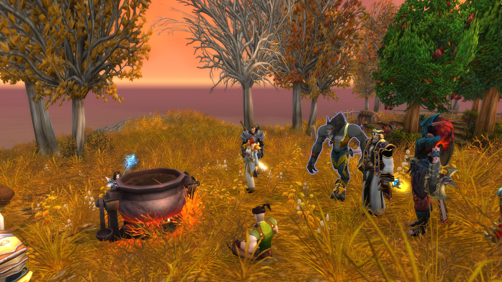

# 第一幕 霍迪尔之冬（战报）

“但是如今莱萨杰丝通过放出了四元素始祖龙王，击溃了英雄们和所有守护巨龙，她会对艾泽拉斯做出什么！？”诗人停在问句上。

“毁灭？”忧郁的守卫回应。

“毁灭吗？”吟游诗人亚克若有所思。

“莱萨杰丝确实很可能带来……毁灭，”法瑞说，“她会对这个世界做什么？”

一阵带有恶意的寒风刮过。人们都打了一个哆嗦。没有人知道，为何在西部荒野，会刮起这样的寒风。有的来客穿得不够暖。自从那个演员掉下去了，法瑞就有一种不祥预感。又到了一年苹果收获的季节，达芙妮·斯威夫特的苹果园里，香甜的果实挂满枝头。多年前，曾有一个圣骑士在此独自一人面对五个迪菲亚暴徒，保护了她。如今她邀请圣骑士和其他朋友一同到苹果园里享受秋日的最后时光。当年的勇气，或许又要再度出发，如此温馨的聚会，不多了。

“啊，苹果酒，还得让我们自己酿，”主教格林威治也放下往日的严肃，讨论起苹果的丰收，苹果园里家的气息浓郁。故事就从这里开始，“去把苹果摘下来，女人在这里搅果肉糊。男人们去摘果子。”

“苹果，吃一口，或者被砸中……”炙热之心骑士团的大团长法瑞说道，选在苹果园聚会，并非偶然。苹果是那智慧之国，而果园则是一切的开始。但法瑞不会知道，这既是开端，也是终末。

<figure><figcaption></figcaption></figure>

<figure><figcaption></figcaption></figure>

熊猫人煖暖·风裘和法师莱斯文·灰鬓已经去往苹果树下，一个踢苹果树，一个捡果子。但吟游诗人亚克则还坐着，不愿起身。“起来，去干活，”格林威治对诗人说，却也没有不悦，“让这些女人们煮苹果酒。”

“干嘛，老头子，我是诗人，我的手是用来拨动琴弦的，”诗人坚持。

“来俩壮汉，给他拖苹果地去。女人去管锅，把他抓苹果园去，大爷们居然不干活，”格林威治严厉道。

“诗人，我拎着你走，还是你自己走？”法师莱斯文应和。

“我的双手只抚摸琴弦和女人，”吟游诗人亚克浪漫地说。最终诗人还是拗不过主教，休闲地走向苹果园。

煮的苹果酒散发出香甜的气息，虽然西部荒野的深秋并不寒冷，但这果酒也给英雄们带来暖意。“这味道真是甜美，就像您的笑容一样，”桑黛威玛说道。

“好了，准备品尝，秋天的第一杯苹果酒，”主教格林威治把大家都叫过来，“来人，准备好杯子。苹果酒，是站着喝的，这才叫酒会。在我身后排队。”

大家排起队，法瑞雅则给每一个来客分发苹果酒。气氛一度十分和睦，但英雄们不知道，这好景不长了。今天绝非平日。

<figure><figcaption></figcaption></figure>

<figure><figcaption></figcaption></figure>

“这个季节的苹果甜度高，”希休斯说道。而其他人都在喝苹果酒时赞美了圣光。圣光会一直眷顾这片土地吗？圣光在寒冷面前，又能抵抗多久。一阵寒风吹过，苹果酒的热度，显得更为温暖了。

“太甜了点，”格林威治惺忪平常地说，“如果加入一些三年葡萄酒，会更好，还有胡椒。”

“再放些肉桂，”希休斯与主教谈起酒。大家也喝得有点微醺，享受着这最美好的时光。

<figure><figcaption></figcaption></figure>

喝完苹果酒后，大家围坐在悬崖前，准备看点节目。坐垫被放到地上，大家随意就坐，而第一个节目，是“考沃克很聪明！”的食人魔节目。一个不知从哪来的食人魔，开始在悬崖边上跳舞。这舞蹈真魔性，掌声不断。

“噢，我头晕，啊！”食人魔突然说。

“啊！”法瑞惊呼，“他……下去了……”

食人魔直接掉下了悬崖。

“你！走好啊！”吟游诗人亚克幸灾乐祸。

“摔死了，好像那个演员死了，”主教格林威治评论道，“下一个节目。”

“这是一个好兆头，”法瑞若有所思。

<figure><figcaption></figcaption></figure>

接下来由吟游诗人亚克上场，来讲讲巨龙的故事，他边弹琴边唱道：“在万神殿离开艾泽拉斯后的漫长岁月中，无数生命形态在这个世界的地表上繁荣生长……其中最为野蛮和狡猾的是居住在卡利姆多冰寒的北部地带的始祖龙……不同种类的始祖龙有着各式各样的力量与能力：其中一些拥有令人难以置信的巨大的身体和双翼，他们的灵魂与这个世界本身紧密相连；另一些获得了弥漫在世界上的潜在元素能量的影响……”

“我想他说的是迦拉克隆？”女猎手萨娜小声说。

“迦拉克隆曾是艾泽拉斯最大的一条始祖龙。在吞食了无数同类的尸体后，迦拉克隆的体型变得庞大。最强大的守护者——提尔首先注意到了迦拉克隆给这个世界带来的危险。”吟游诗人亚克继续道，“提尔在五条最大也是最有智慧的始祖龙——阿莱克丝塔萨、奈萨里奥、玛里苟斯、伊瑟拉和诺兹多姆身上找到了答案。他们种类各异，各自拥有独一无二的力量。就连阿莱克丝塔萨和伊瑟拉这对姐妹也驾驭着截然不同的能力。坚韧善良的阿莱克丝塔萨能够喷吐烈焰；”

诗人的歌声悠扬：“强大的奈萨里奥力量惊人，他那震耳欲聋的咆哮声能将骨头和岩石震得粉碎；狡猾的玛里苟斯能够吐出冰霜气息，将敌人冻结在寒冰里；睿智的诺兹多姆会卷起漫天飞沙来将敌人致盲；神秘的伊瑟拉能用气息使敌人衰弱，汲取他们的意志，令其进入深度恍惚状态。”

此时突然刮起一道风，带来一种独特的寒意，不属于西部荒野的寒意。

“提尔恳求这五条始祖龙与他一同对抗迦拉克隆，这些生物起初对这个接近自己的陌生来客不甚信任，但他们很快就决定与他并肩作战，”吟游诗人亚克不惧寒风，继续唱道，“尽管特性迥异，五条龙却出人意料地团结一心，共同抗敌，最终，迦拉克隆的尸体倒地不起，砸在一片冰寒冻原上，那里就是后来的龙骨荒野。”

<figure><figcaption></figcaption></figure>

<figure><figcaption></figcaption></figure>

“但是如今莱萨杰丝通过放出了四元素始祖龙王，击溃了英雄们和所有守护巨龙，她会对艾泽拉斯做出什么！？”诗人停在问句上。

“毁灭？”忧郁的守卫回应。

“毁灭吗？”吟游诗人亚克若有所思。

“莱萨杰丝确实很可能带来……毁灭，”法瑞说，“她会对这个世界做什么？”

一阵带有恶意的寒风刮过。人们都打了一个哆嗦。没有人知道，为何在西部荒野，会刮起这样的寒风。有的来客穿得不够暖。自从那个演员掉下去了，法瑞就有一种不祥预感。

<figure><figcaption></figcaption></figure>

“说到毁灭，我倒是想起了一个更古老的故事，”吟游诗人亚克继续道，“接下来我们讲一个更为古怪的故事，关于守护者的梦境。”

“这天气怎么有点变了，”希休斯不是第一个注意到天气变化的人。

“怎么突然刮起风来了？”洛瑟瓦尔也说道，嗅了嗅周围空气的味道。

“关于这个世界的两种末日，冰与火，”吟游诗人亚克唱道，“五个泰坦守护者，都有他们的梦境，在首席管理者奥丁的梦境中，瓦格里不再受到诅咒，英魂为他而战。在风暴之王托里姆的梦境中，妻子西芙并未死去，兄弟洛肯没有背叛。在生命之王芙蕾雅的梦境中，她战胜了上古之神，走出郁郁葱葱的温室，为世界带去生命。在创造之王米米尔隆的梦境中，他为这个世界献出生命。”

鸭子嘎嘎的叫个不停起来。

“但是寒冰之王霍迪尔的梦境，更为古怪，”吟游诗人亚克尽情地唱道，“漫长寒冷的严冬，会终结世上的血肉生命，再没有夏天，没有阳光。冰雪从四面八方吹来，有数不清的战乱，兄弟之间互相杀戮，所有的日子都是寒冷而黑暗。一旦霍迪尔的守护者之心停止跳动，长夜降临。”

吟游诗人亚克唱着末日的歌谣：“艾泽拉斯有两种可能的毁灭方式，火或冰。起源熔炉或者霍迪尔之冬。起源熔炉的程序在未被修改前，如果启动，会让整个艾泽拉斯的生态圈毁灭。此为在烈火中终结。霍迪尔之冬，则是终末的白霜，一头狼吞噬太阳。月亮产生月蚀，光明陨落，漫长的冬天。”

唱到这，连诗人都打了一个哆嗦。恶意的寒风又一次吹过。

“英雄们，如果你们能选择，你们会选择烈火还是寒冰？”诗人告诫道，“我要你们记得，如果火焰末日或者长夜冰封到来，你们两者都不会选择。火焰天启虽然恐怖，却是急速死亡。长夜冰封看似温和，实际上是更加绝望的慢性自杀。所以你们将守护这个世界，免遭长夜！！！”

忽然填上开始飘落雪花。

“嗯？”吟游诗人亚克是第一个反应过来的人，“下雪了？”

<figure><figcaption></figcaption></figure>

<figure><figcaption></figcaption></figure>

恶意的寒风又一次刮来。法瑞雅看向天际。桑黛威玛这才意识到有多冷，赶紧披上披风。艾薇拉·星坠则高兴地去舔雪花。“西部荒野怎么会下雪？？”大家都疑虑道，“不可能啊……”

奇怪的大雪忽如其来，令所有人惶恐不已。却没有人能够解释到底发生了什么事。

“都到屋子里去，”主教格林威治说。吟游诗人亚克搓着双手。

“圣光的仆人啊，这是什么情况？”吟游诗人亚克问道，却没有人能够回答。

法师莱斯文也说：“诗人，你见识广，你知道这是怎么回事吗？”

“我就是个吟游诗人！”亚克不得不说。就连他也不曾想到，西部荒野会下起暴风雪。这雪花纷飞，无情地落到地面。凯东·费尔康惊愕地看着填上飘下来的雪花，朱斯缇娅也是如此。

疑惑的众人并不知道该怎么办。雪很快覆盖了苹果园，有的苹果被冻得掉下枝头。大家都躲进达芙妮家中，但这的炉火也在摇曳，似乎就要熄灭。格林威治说道：“这个地方不能久留啊。”

<figure><figcaption></figcaption></figure>

“可是还有哪里比这更为温暖，荆棘谷吗？”法瑞思索道。

“以后要去荆棘谷过冬？”月祈者瑟尔疑问。希休斯拨了拨火堆，让火焰得以延续下去。

“真是反常的天气，这儿的天气让我觉得这里不是王国，而是北裂境，”骑士凯东·费尔康不得不说，缓缓地呼出一口白气。桑黛威玛还安排地退缩了。希休斯发现房间内的家具都蒙上了一层霜。

“天哪，现在还没到收获麦子的季节吧！”月祈者瑟尔担忧道。艾薇拉·星坠冷得发抖，马上跑到火炉边。

“收了，前两天就收了，这几天是果子收获的日子，”主教格林威治安抚道。

“但是这也就意味着下一茬作为就很难正常种植了，”月祈者瑟尔还是说。

“人类说的并没有错，这样的气候不属于此地，”女猎手萨娜评论道。艾薇拉·星坠的毛也不能完全保暖，冻得好像一只冰狐。凯东·费尔康凝视着手上逐渐融化的雪花，打了个哆嗦。

“天气忽然这样，勇士们当然要搞清楚怎么回事，”吟游诗人亚克建议。

“主教，我们应该多累积一些粮食，否则我们的食物供给将很难支持接下来可能的饥民浪潮，”月祈者瑟尔冷静分析。

“燃料供暖是一个大问题啊，”主教格林威治回应，“我们应该去铁炉堡，那里的探险者协会的布莱恩，他最了解这些事情。那里至少能够供暖。”

<figure><figcaption></figcaption></figure>

恐慌的众人开始愤怒，胡乱发泄怒火。他们虽然在雪地里升起了一堆篝火，但也无从驱散心中的寒意。

“那个诗人呢，他说了什么，招来了风雪，”主教格林威治首先说。

“霍迪尔什么的，”希休斯说道。

“一定是他！”格林威治毋庸置疑地说，“一定是他惹怒了上天。”

主教格林威治指着吟游诗人亚克，斥责道，“都是他的错，应该把他绞死。”

“烧了他！”希休斯应和。

“这……从何说起？”骑士凯东·费尔康不解地说，惊讶地看向吟游诗人亚克。

“就是他！”法师莱斯文·灰鬓补充道，“他嘴开过光的。”

“干嘛干嘛，”吟游诗人亚克说。

<figure><figcaption></figcaption></figure>

“你看这群人类是不是脑袋不好使？竟然因为一个故事就绞死同胞，”精灵桑黛威玛低声说。

“完全同意，姐妹，我宁愿为此憎恨一只咬了苹果的虫子，”月祈者瑟尔回应桑黛威玛。

“就是你惹怒了上天，带来了暴风雪，”主教格林威治继续指责道。

“把他砍了，献祭，”法师莱斯文·灰鬓雪上加霜。

“是我们正在讨论最近的巨龙群岛探险好吗，”吟游诗人亚克甚至觉得有点好笑。

“不是你说冰雪的故事，怎么会下雪。都是你的错！”主教格林威治怒道。愤怒的众人不断吵架和咒骂着。人类、精灵、侏儒和熊猫人都在互相指责。到底是什么引来了暴风雪，则没有人知道。

“嗯？火堆熄灭了，把他绑在树上，”主教格林威治指挥道。

“这个天气异象，为什么不去寒冰的起源地看看是发生了什么，”吟游诗人亚克提议。凯东·费尔康的脸色有些难看。

“霍迪尔，他还在他的神殿吗？”法瑞问。

“你到底知道什么？”希休斯逼问。

“跟他废话什么，直接给他处死了，”格林威治敦促道。吟游诗人亚克对格林威治眨了眨眼。

“没有人会杀一个吟游诗人……”亚克唱道。

“你来，”格林威治指着说，“打碎他的脑袋。”

“等一下主教，这样是不被圣光认可的……啊！”月祈者瑟尔惊呼。

“我来，”莱斯文·灰鬓主动要求。

<figure><figcaption></figcaption></figure>

“等等！喂喂！各位人类同胞！！！你们疯了吗？等等！”桑黛威玛叫道。

“霍迪尔的神殿，有意思，想象就有意思！”吟游诗人亚克还在他的世界里。

“给我打！”莱斯文·灰鬓说道。

主教格林威治朝着吟游诗人扔石头。愤怒的人失去了理智，也开始扔湿透。吟游诗人捂着头，捂着流血的脑袋晕了过去。

“各位！！”桑黛威玛挡在人群和吟游诗人亚克之间说，举起盾牌试图抵挡石头，“别这样！！你们竟然因为一个故事……这也天荒谬了。”

“都是他的错，”格林威治说，指着吟游诗人亚克，“来人，给每个人分发石头。对他用石刑。”

“残酷的人类，”法瑞雅说道，但她也没阻止。艾薇拉·星坠不理解这些人在做什么，舔了舔吟游诗人亚克。愤怒的众人依旧没有任何进展，只有相互吵架。

“我得说，只是因为故事就处死人，实在是……”凯东·费尔康还是一个骑士。

“喂喂！！”桑黛威玛继续阻止众人道，“历史上用石刑的，都是十恶不赦之徒。而他只不过是讲了个故事。老头，你疯了吗？你觉得圣光允许你如此轻率吗？罪名就是讲故事吗？”

“长夜……绝望……自杀……”吟游诗人呢喃道。

愤怒的人群开始分发石块。法师莱斯文·灰鬓去看看诗人死没死。凯东·费尔康发现诗人似乎还有一口气。亚克吐了口血痰在凯东的脸上。凯东对亚克叹了口气。

“粗鲁自大的人类们……你们不知道你们即将面对什么……”吟游诗人亚克诅咒道。

“打死他，”格林威治说。

“打死他，”莱斯文·灰鬓说。

<figure><figcaption></figcaption></figure>

人们亦然在争吵中，毕竟这种事情已经超越了他们的认知。凯东叹气：“愿圣光宽恕我的软绕和怯懦。”

“罪名是什么？？”桑黛威玛不依不饶地为吟游诗人辩护，“你们新养道饿圣光允许你们这么做吗？”

“这样是不道德的，”月祈者瑟尔说。

“但是他死了有什么用呢？雪还是会继续下啊？”洛瑟瓦尔想让众人冷静。

“来来来，打死我，不然我会到处传唱圣光教会的粗鄙！”吟游诗人亚克说道。

“打死他，打死这个罪人，”格林威治坚持。

“阁下，你也赞成处死这个诗人吗？”凯东低声对法瑞说。但是法瑞没有反应，只是看着这场闹剧。

吟游诗人亚克最终在一种土地法术的帮助下，在众人面前逃脱，“这是什么！”是他最后说的话，然后他就消失在风雪中。

<figure><figcaption></figcaption></figure>

“他要跑了，该死的。精灵，这就是你保护的人，风暴就是他们带来的。你要直接砸死他，就不会有这事情了。还有你熊猫人，你扔的什么石头，哼！”格林威治异常愤怒。

雪越来越大。本是愉快的秋收品酒会，却因为天气的异变，导致所有人不欢而散。人类顽固派对其他种族的敌意也加深了。最终所有人都愤愤地离开了庄园。所有种族谁也没给谁好脸色。

<figure><figcaption></figcaption></figure>
