# 第一幕 霍迪尔之冬（记录）

## 第一幕 霍迪尔之冬

### 苹果酒

达芙妮·斯威夫特邀请了她的朋友们到苹果园，品尝秋天末尾的苹果。

记录开始于 12/09/2022日 19:28:56时。

\[吟游诗人亚克]: 嗨，晚上好，伙计们

\[朱丝缇雅]: 晚上好

\[佩瑞妮克洛斯]: 晚上好哦

吟游诗人亚克 拨弄起琴弦，开始吟唱。

\[格林威治]: 啊

\[格林威治]: 苹果酒

\[格林威治]: 还得让我们自己酿

\[法瑞雅]: 是的，达芙妮这里有许多新鲜的苹果。

\[格林威治]: 我还以为我们能直接喝呢

\[法瑞雅]: 正是这个秋冬最好的苹果。

\[格林威治]: 去摘苹果

格林威治指着莱斯文丶灰鬓。

格林威治指着煖暖丶风裘。

格林威治指着忧郁的护卫。

\[煖暖丶风裘]: 熬苹果粥吗？

\[格林威治]: 去把苹果摘下来

\[格林威治]: 女人在这里搅拌果肉糊

煖暖丶风裘 猛踹苹果树

\[格林威治]: 男人都去摘果子

\[法瑞雅]: 苹果，吃一口，或者被砸中……

\[莱斯文丶灰鬓]: 我好像有点矮

\[煖暖丶风裘]: 你来捡 我来踹

\[莱斯文丶灰鬓]: 够不到

\[格林威治]: 你是女人吗

\[格林威治]: 起来

\[格林威治]: 去干活儿

\[莱斯文丶灰鬓]: 你来踹吧

煖暖丶风裘 用脚猛踢苹果树

<figure>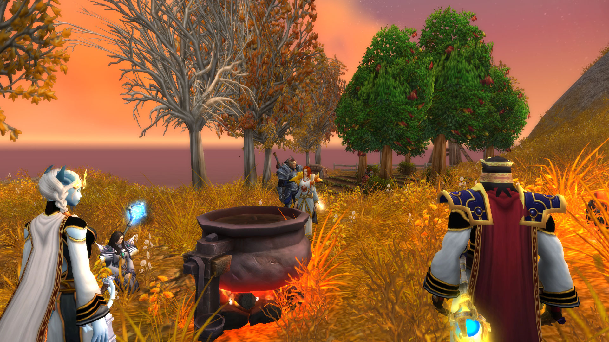<figcaption></figcaption></figure>

\[吟游诗人亚克]: 干嘛，老头子

\[吟游诗人亚克]: 我是诗人

\[桑黛威玛]: 嗨，老者，又见面了\*打招呼\*

\[格林威治]: 让这些女人们煮苹果酒

\[吟游诗人亚克]: 我的手是用来拨动琴弦的

莱斯文丶灰鬓 拿出了篮子

\[格林威治]: 来俩壮汉

\[莱斯文丶灰鬓]: 厉害啊

\[格林威治]: 给他拖苹果地去

\[莱斯文丶灰鬓]: 我也来

格林威治指着莱斯文丶灰鬓。

赫瓦格瑞尔 召唤出了四个自己来摘苹果

\[格林威治]: 女人去管锅

\[莱斯文丶灰鬓]: 干什么？

\[格林威治]: 把他抓苹果园区

\[格林威治]: 大老爷们居然不干活

\[法瑞雅]: 是的，新鲜的苹果，都摘下来。

\[莱斯文丶灰鬓]: 诗人，我拎着你走

\[吟游诗人亚克]: 我的双手只抚摸琴弦和女人\~

\[莱斯文丶灰鬓]: 还是你自己走？

\[朱丝缇雅]: 咕嘟咕嘟

\[吟游诗人亚克]: 好吧好吧\~

煖暖丶风裘 把苹果都扔进了锅里

吟游诗人亚克 装装样子站了起来。

\[格林威治]: 男人都来摘苹果

\[法瑞雅]: 男人们都去吧。

\[法瑞雅]: 我们在这看锅。

\[朱丝缇雅]: 辛苦喽\~

桑黛威玛 一脸茫然的看着锅子

\[煖暖丶风裘]: 对 男人们都去

\[桑黛威玛]: 各位姐妹们，咱们这是要做什么汤？

\[朱丝缇雅]: 看来我们这位胖熊心理认知是女性

法瑞雅 准备煮苹果。

\[煖暖丶风裘]: 不不不 我不是人

\[煖暖丶风裘]: 我是公熊猫

\[朱丝缇雅]: 啊！

\[煖暖丶风裘]: 熊猫不是人

\[佩瑞妮克洛斯]: 欸！

洛瑟瓦尔 静静的打量着周围的人

\[朱丝缇雅]: 熊猫是猫嘛？

\[桑黛威玛]: 熊猫竟然会说我们人类的语言了，也是难得

\[佩瑞妮克洛斯]: 公熊猫不也是大老爷们嘛\~

\[法瑞雅]: 看着这口锅。

\[格林威治]: 熊猫人

\[格林威治]: 干活去

\[桑黛威玛]: 看见了，它，它会怎样？\*一眨不眨的盯着大锅\*

\[煖暖丶风裘]: 你说男人去 但我不是人呀

法瑞雅 开始煮苹果酒。

洛瑟瓦尔 嘲笑熊猫人

法瑞雅 认真地看着锅。

\[煖暖丶风裘]: 去去去 行了吧

\[法瑞雅]: 第一瓶苹果酒好了。

\[法瑞雅]: 女士们先来品尝。

洛瑟瓦尔 变化回人形态

\[佩瑞妮克洛斯]: 欸好耶

\[桑黛威玛]: 哇哦，好香甜的气味

桑黛威玛 小口的品尝着\[\[热苹果酒]]

\[洛瑟瓦尔]: 谢谢你的慷慨\~

\[朱丝缇雅]: 谢啦

希休斯 往锅里又扔了些新鲜苹果

\[佩瑞妮克洛斯]: 欸谢谢啦

\[希休斯]: 温度刚刚好

\[桑黛威玛]: 这味道真是甜美，就像您的笑容一样

\[佩瑞妮克洛斯]: 苹果酒的味道很棒呢

\[法瑞雅]: 是的，都来喝一口。

<figure>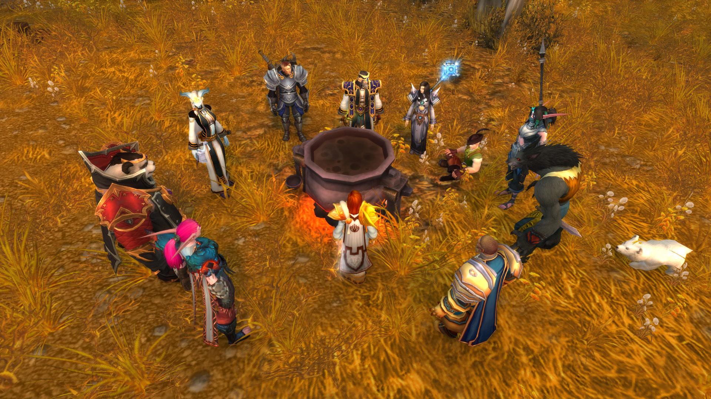<figcaption></figcaption></figure>

\[格林威治]: 好了

\[格林威治]: 准备品尝

\[格林威治]: 冬天的第一杯苹果酒

\[格林威治]: 来人

\[法瑞雅]: 是的，收获的季节。

\[格林威治]: 准备好被子

\[格林威治]: 杯子

\[佩瑞妮克洛斯]: 好哦

\[吟游诗人亚克]: 坐坐，都站着，太紧张了气氛

桑黛威玛 好不容易从背包里翻出一个水囊

煖暖丶风裘举起酒杯，然后一饮而尽。干杯！

法瑞雅 放入更多苹果，打捞出第1瓶苹果酒。

\[格林威治]: 苹果酒

\[格林威治]: 是站着喝的

\[格林威治]: 这才叫酒会

\[桑黛威玛]: 没有杯子，这水囊可以吗？

\[格林威治]: 排队

\[吟游诗人亚克]: 好吧，还是武喝

\[格林威治]: 来人

煖暖丶风裘举起酒杯，然后一饮而尽。干杯！

\[格林威治]: 这里排队

\[格林威治]: 我身后排队

\[莱斯文丶灰鬓]: 没有杯子，酒瓶行吗

\[桑黛威玛]: 要不要间隔一米

\[莱斯文丶灰鬓]: 不是2米吗

\[格林威治]: 来

\[煖暖丶风裘]: 女士先请

\[朱丝缇雅]: 2米吧

\[桑黛威玛]: 为什么不是1.5米?

\[格林威治]: 给我乘一杯

格林威治 端起\[\[热苹果酒]]走开

\[桑黛威玛]: 谢谢

\[佩瑞妮克洛斯]: 谢谢啦

希休斯 接过一大杯热苹果酒

\[希休斯]: 感谢圣光

\[洛瑟瓦尔]: 谢谢

\[吟游诗人亚克]: 圣光在上，赞美圣光

\[格林威治]: 我觉得

\[莱斯文丶灰鬓]: 谢谢你

吟游诗人亚克 接过苹果酒。

\[格林威治]: 有点偏甜

<figure>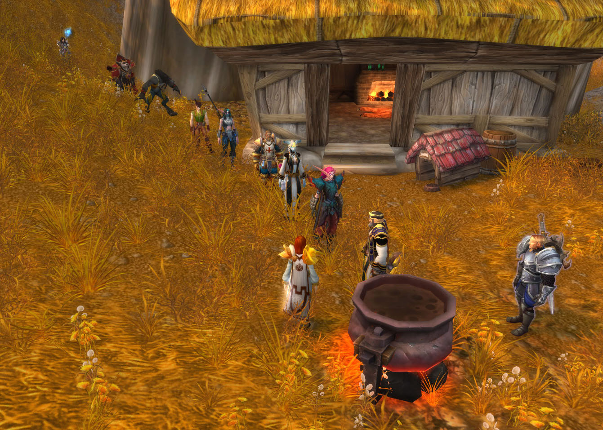<figcaption></figcaption></figure>

\[希休斯]: 这个季节的苹果甜度高

\[朱丝缇雅]: 谢啦

\[格林威治]: 太甜了点

\[桑黛威玛]: 这位小哥，我有点好奇，为什么你接过酒的时候，要赞美圣光？\*看着吟游诗人亚克\*

\[格林威治]: 我在想

\[格林威治]: 如果加入一些三年葡萄酒

\[格林威治]: 会更好

\[吟游诗人亚克]: 圣光的仆从给我的酒，我当然要赞美圣光

\[希休斯]: 再放些肉桂

\[格林威治]: 还有胡椒

\[法瑞雅]: 会更容易醉那样

\[吟游诗人亚克]: 你给我酒，我就赞美艾露恩\~

\[格林威治]: 哈哈

\[莱斯文丶灰鬓]: 我想加点小麦酒好

\[格林威治]: 好了

\[格林威治]: 品酒结束

\[格林威治]: 来点节目

\[桑黛威玛]: 是吗？听听你的赞美\*把\[\[热苹果酒]]轻轻放在吟游诗人亚克唇上\*

### 食人魔节目

\[格林威治]: 我们都坐过来

\[格林威治]: 果林作为舞台

\[格林威治]: 这里

\[格林威治]: 这里不错

希休斯 盘膝坐下

\[格林威治]: 来

\[格林威治]: 都坐下

\[格林威治]: 准备看点节目

\[女猎手萨娜]: 我想说 这些坐垫相当..有特点

\[吟游诗人亚克]: 我说伙计们，最近巨龙群岛的探险，大家都听说参与了吗

\[格林威治]: 我给大家带来个食人魔节目

\[格林威治]: 考沃克很聪明!

\[桑黛威玛]: 是啊，有机会想和萨娜坐上去滚滚呢\*扮鬼脸\*

\[莱斯文丶灰鬓]: 我没有

希休斯为格林威治而欢呼！

煖暖丶风裘激动地为格林威治鼓掌。

\[洛瑟瓦尔]: 我倒是可以让给你们打滚\*捂嘴偷笑\*

\[朱丝缇雅]: 好家伙

吟游诗人亚克向格林威治大声喝彩。真棒！

希休斯大声喝彩。真棒！

莱斯文丶灰鬓向格林威治表示祝贺。

佩瑞妮克洛斯向格林威治大声喝彩。真棒！

法瑞雅 喝彩！

\[吟游诗人亚克]: 很好！圣光会狠狠的保佑您的！

希休斯向格林威治大声喝彩。真棒！

\[格林威治]: 噢

\[格林威治]: 我头晕

\[格林威治]: 啊

\[法瑞雅]: 啊！

\[莱斯文丶灰鬓]: 人呢？

\[法瑞雅]: 他……下去了……

<figure>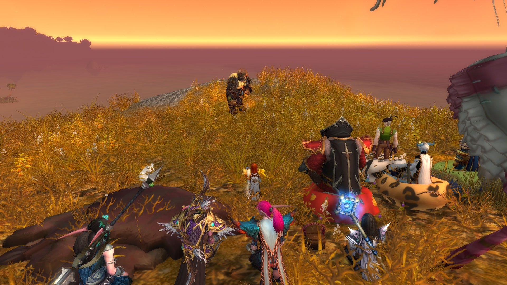<figcaption></figcaption></figure>

\[煖暖丶风裘]: 下一个

\[希休斯]: 掉下去了！

\[洛瑟瓦尔]: 如果你不介意我变成熊\*一脸意味深长的表情\*

\[格林威治]: 额

\[吟游诗人亚克]: 你！走好啊！

\[桑黛威玛]: 当然不介意

\[佩瑞妮克洛斯]: 欸

\[格林威治]: 摔死了

\[朱丝缇雅]: 哈哈哈哈

\[格林威治]: 好像那个演员死了

\[法瑞雅]: 这是一个好兆头

\[朱丝缇雅]: pity

\[洛瑟瓦尔]: 那我倒是很乐意参与其中\*痴笑\*

\[法瑞雅]: 现在有请诗人上场？

\[格林威治]: 下一个节目

### 诗人的巨龙故事

\[吟游诗人亚克]: 那不如我来讲个故事？

吟游诗人亚克优雅的鞠了一躬。

莱斯文丶灰鬓向吟游诗人亚克大声喝彩。真棒！

吟游诗人亚克 拨弄起琴弦，开始吟唱。

\[吟游诗人亚克]: 我们首先来讲讲巨龙的故事\~

\[吟游诗人亚克]: 在万神殿离开艾泽拉斯后的漫长岁月中\~

吟游诗人亚克 正在演奏一首音乐。

\[吟游诗人亚克]: 无数生命形态在这个世界的地表上繁荣生长\~

\[吟游诗人亚克]: 其中最为野蛮和狡猾的是居住在卡利姆多冰寒的北部地带的始祖龙\~

\[吟游诗人亚克]: 不同种类的始祖龙有着各式各样的力量与能力\~

\[吟游诗人亚克]: 其中一些拥有令人难以置信的巨大的身体和双翼\~

\[吟游诗人亚克]: 他们的灵魂与这个世界本身紧密相连\~

\[吟游诗人亚克]: 另一些获得了弥漫在世界上的潜在元素能量的影响\~

<figure>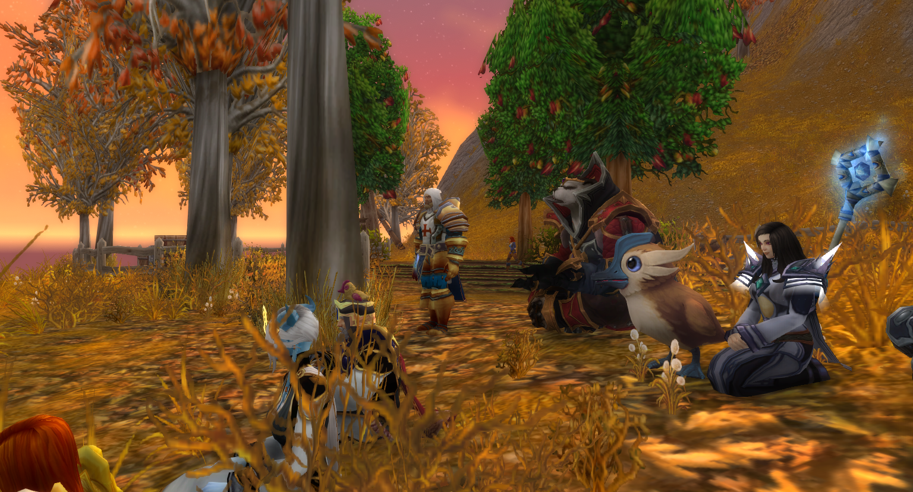<figcaption></figcaption></figure>

\[女猎手萨娜]: 我想他说的是加拉克隆？\*小声\*

\[吟游诗人亚克]: 迦拉克隆曾是艾泽拉斯最大的一条始祖龙\~

\[吟游诗人亚克]: 在吞食了无数同类的尸体后\~

\[吟游诗人亚克]: 迦拉克隆的体型变得庞大\~

\[吟游诗人亚克]: 最强大的守护者——提尔首先注意到了迦拉克隆给这个世界带来的危险\~

吟游诗人亚克 正在演奏一首音乐。

\[吟游诗人亚克]: 提尔在五条最大也是最有智慧的始祖龙——阿莱克丝塔萨、奈萨里奥、玛里苟斯、伊瑟拉和诺兹多姆身上找到了答案\~

\[吟游诗人亚克]: 他们种类各异，各自拥有独一无二的力量\~

\[吟游诗人亚克]: 就连阿莱克丝塔萨和伊瑟拉这对姐妹也驾驭着截然不同的能力\~

\[吟游诗人亚克]: 坚韧善良的阿莱克丝塔萨能够喷吐烈焰\~

\[吟游诗人亚克]: 强大的奈萨里奥力量惊人，他那震耳欲聋的咆哮声能将骨头和岩石震得粉碎\~

\[吟游诗人亚克]: 狡猾的玛里苟斯能够吐出冰霜气息，将敌人冻结在寒冰里\~

\[吟游诗人亚克]: 睿智的诺兹多姆会卷起漫天飞沙来将敌人致盲\~

\[吟游诗人亚克]: 神秘的伊瑟拉能用气息使敌人衰弱，汲取他们的意志，令其进入深度恍惚状态\~

吟游诗人亚克 正在演奏一首音乐。

<figure>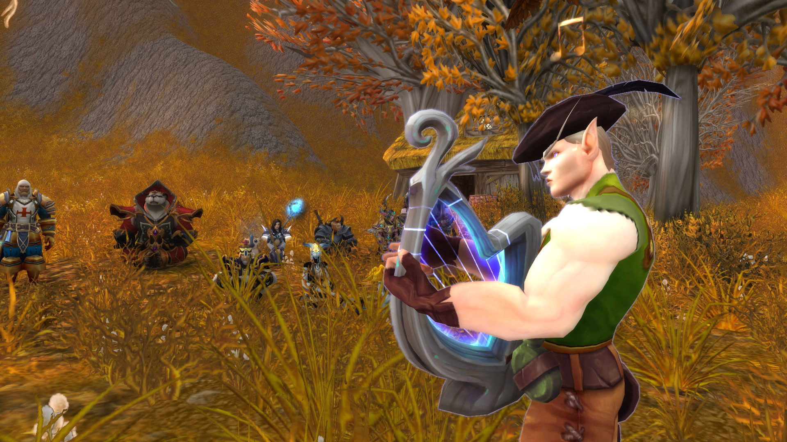<figcaption></figcaption></figure>

忽然刮起一道风。

\[吟游诗人亚克]: 提尔恳求这五条始祖龙与他一同对抗迦拉克隆\~

\[吟游诗人亚克]: 这些生物起初对这个接近自己的陌生来客不甚信任，但他们很快就决定与他并肩作战\~

\[吟游诗人亚克]: 尽管特性迥异，五条龙却出人意料地团结一心，共同抗敌\~

\[吟游诗人亚克]: 最终，迦拉克隆的尸体倒地不起，砸在一片冰寒冻原上，那里就是后来的龙骨荒野\~

\[吟游诗人亚克]: 但是如今莱萨杰丝通过放出了四元素始祖龙王\~

\[吟游诗人亚克]: 击溃了英雄们和所有守护巨龙\~

\[吟游诗人亚克]: 她会对艾泽拉斯做出什么！？

\[忧郁的护卫]: 毁灭？

\[吟游诗人亚克]: 毁灭吗

\[法瑞雅]: 莱萨杰丝确实很可能带来……毁灭。

吟游诗人亚克 若有所思。

一阵带有恶意的寒风刮过。

\[法瑞雅]: 她会对这个世界做什么？

\[吟游诗人亚克]: 说到毁灭，我倒是想起了一个更古老的故事

吟游诗人亚克 拨弄起琴弦，开始吟唱。

法瑞雅 感觉到了寒风。

\[希休斯]: 这天气怎么有点变了

吟游诗人亚克 正在演奏一首音乐。

\[洛瑟瓦尔]: 怎么突然刮起风来了。

<figure>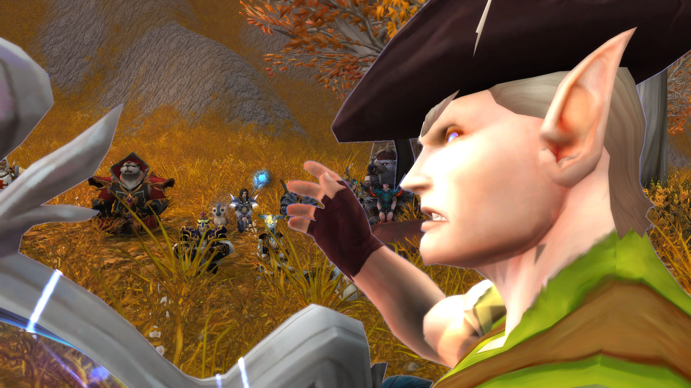<figcaption></figcaption></figure>

### 守护者的梦境

\[吟游诗人亚克]: 接下来我们讲一个更为古怪的故事，关于守护者的梦境\~

法瑞雅 自从那个演员掉下去了，就有一种不祥预感。

\[吟游诗人亚克]: 关于这个世界的两种末日，冰与火\~

洛瑟瓦尔 嗅了嗅周围空气的味道

\[吟游诗人亚克]: 五个泰坦守护者，都有他们的梦境\~

\[吟游诗人亚克]: 在首席管理者奥丁的梦境中，瓦格里不再受到诅咒，英魂为他而战\~

\[忧郁的护卫]: 所以穿厚点

\[吟游诗人亚克]: 在风暴之王托里姆的梦境中，妻子西芙并未死去，兄弟洛肯没有背叛\~

\[忧郁的护卫]: 就像我这样。一身铠甲的

\[吟游诗人亚克]: 在生命之王芙蕾雅的梦境中，她战胜了上古之神，走出郁郁葱葱的温室，为世界带去生命\~

\[吟游诗人亚克]: 在创造之王米米尔隆的梦境中，他为这个世界献出生命\~

鸭子嘎嘎的叫个不停起来。

希休斯 起身四处观察

\[吟游诗人亚克]: 但是寒冰之王霍迪尔的梦境，更为古怪\~

吟游诗人亚克 正在演奏一首音乐。

\[莱斯文丶灰鬓]: 我之前就这样穿着的

\[吟游诗人亚克]: 漫长寒冷的严冬，会终结世上的血肉生命，再没有夏天，没有阳光\~

\[吟游诗人亚克]: 冰雪从四面八方吹来，有数不清的战乱\~

\[吟游诗人亚克]: 兄弟之间互相杀戮，所有的日子都是寒冷而黑暗\~

\[吟游诗人亚克]: 一旦霍迪尔的守护者之心停止跳动，长夜降临\~

\[吟游诗人亚克]: 艾泽拉斯有两种可能的毁灭方式，火或冰\~

希休斯 听着霍迪尔的故事感觉更冷了

\[吟游诗人亚克]: 起源熔炉或者霍迪尔之冬\~

\[吟游诗人亚克]: 起源熔炉的程序在未被修改前，如果启动，会让整个艾泽拉斯的生态圈毁灭\~

\[吟游诗人亚克]: 起源熔炉同时也有关押克苏恩的用途\~

\[吟游诗人亚克]: 此为在烈火中终结\~

法瑞雅 对寒冬有更为不祥的预感。

\[吟游诗人亚克]: 霍迪尔之冬，则是终末的白霜，一头狼吞噬太阳\~

\[吟游诗人亚克]: 月亮产生月蚀，光明陨落，漫长的冬天\~

希休斯 戴起兜帽

吟游诗人亚克 打了个哆嗦。

\[法瑞雅]: 可是这是西部荒野，常年温暖，难道？

恶意的寒风又一次吹过。

<figure>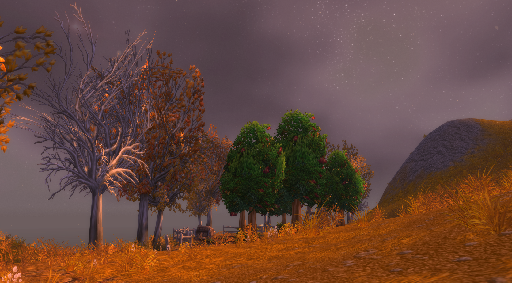<figcaption></figcaption></figure>

\[吟游诗人亚克]: 英雄们，如果你们能选择，你们会选择烈火还是寒冰\~

\[洛瑟瓦尔]: 希望你这两件单薄的衣服，能帮你抵御这寒风。

\[吟游诗人亚克]: 我要你们记得，如果火焰末日或者长夜冰封到来，你们两者都不会选择\~

希休斯 用火石点燃一堆柴火

\[吟游诗人亚克]: 火焰天启虽然恐怖，却是急速死亡\~

\[吟游诗人亚克]: 长夜冰封看似温和，实际上是更加绝望的慢性自杀\~

\[吟游诗人亚克]: 所以你们将守护这个世界，免遭长夜\~！！！

忽然天上开始飘落雪花。

\[桑黛威玛]: 大熊，外面真的很冷吗？\*好奇\*

艾薇拉丶星坠 从格林威治的口袋里掏了1796金85银65铜

\[洛瑟瓦尔]: 我感觉还好，只是风有点急

\[吟游诗人亚克]: 嗯？

\[吟游诗人亚克]: 下雪了？

恶意的寒风又一次刮来。

吟游诗人亚克 收起竖琴。

\[希休斯]: 下雪？

\[莱斯文丶灰鬓]: 怎么回事啊\*小声\*

艾薇拉丶星坠咬了格林威治一口。啊！

法瑞雅 看向天际。

桑黛威玛 这才意识到有多冷

\[吟游诗人亚克]: 快进屋吧！伙计们！

艾薇拉丶星坠 高兴的去舔雪花

\[吟游诗人亚克]: 雪越来越大了！

桑黛威玛 赶紧披上披风

\[吟游诗人亚克]: 西部荒野怎么会下雪？？

\[格林威治]: 该死

\[格林威治]: 好冷

\[法瑞雅]: 不可能啊，但是……

奇怪的大雪忽如其来，令所有人的惶恐不已。却没有人能够解释到底发生了什么事。

\[格林威治]: 那风好冷

\[吟游诗人亚克]: 这不可能啊

法瑞雅 确实感受到了雪花。

\[桑黛威玛]: 还是大熊靠谱

\[莱斯文丶灰鬓]: 感觉有点冷啊

\[格林威治]: 都到屋子里去

\[法瑞雅]: 快进屋！

\[煖暖丶风裘]: 雪\~一片一片一片一片\~拼出你我的缘分\~\~\~

\[洛瑟瓦尔]: 下雪了？\*舔了舔空气中飘落的雪花\*

\[忧郁的护卫]: 先进屋吧

吟游诗人亚克 搓着双手。

\[艾薇拉丶星坠]: 喵

\[吟游诗人亚克]: 圣光的仆人吗，这是什么情况

\[桑黛威玛]: 萨娜

\[莱斯文丶灰鬓]: 诗人，你见识广，你知道咋回事嘛

\[煖暖丶风裘]: 我俩来挡风

\[吟游诗人亚克]: 我就是个吟游诗人！

### 进屋躲避风雪

\[法瑞雅]: 都进屋来，外面下起暴风雪了！

\[格林威治]: 奇怪

\[莱斯文丶灰鬓]: 你爱喝酒吗

\[洛瑟瓦尔]: 这地上不冷吗？\*拿出一张毛毯铺到地上\*

\[忧郁的护卫]: 没人愿意听吗。。

朱丝缇雅 斜靠在墙上

\[格林威治]: 怎么回事

\[吟游诗人亚克]: 好端端的怎么下起大雪了？还是在这里

\[格林威治]: 怎么会下雪

\[法瑞雅]: 莱萨杰丝做了什么难道是？

\[女猎手萨娜]: 我会在这外面停留

\[吟游诗人亚克]: 始祖龙王？

\[月祈者瑟尔]: 萨娜姐妹？

\[吟游诗人亚克]: 有意思了

\[月祈者瑟尔]: 是你吗？

洛瑟瓦尔 一屁股坐到毛毯上。

\[桑黛威玛]: 萨娜，这么冷，快进去呀

\[女猎手萨娜]: 女祭司 西部荒野的天气有些..怪异

\[月祈者瑟尔]: 怪异？

\[艾薇拉丶星坠]: 咪

\[女猎手萨娜]: 放心好了 尽管这里不常下雪 但这还不足以让我畏惧

<figure>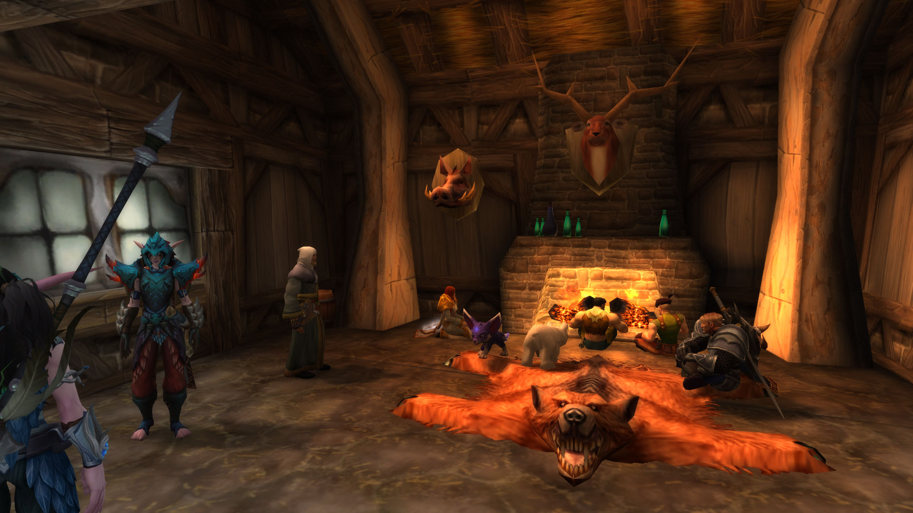<figcaption></figcaption></figure>

\[吟游诗人亚克]: 神官们都进来！

\[法瑞雅]: 不仅仅是怪异了，这是不可能发生的事！

\[吟游诗人亚克]: 发生什么了！

\[桑黛威玛]: 当然

\[格林威治]: 这是怎么回事

\[格林威治]: 怎么会那么寒冷

\[格林威治]: 西部荒野居然下雪了

\[桑黛威玛]: 萨娜啊，你怎么看?

\[法瑞雅]: 这里不可能下雪。

\[月祈者瑟尔]: 西部荒野下雪？

\[忧郁的护卫]: 奇怪。。怎么会下雪

\[格林威治]: 我觉得

凯东丶费尔康 惊愕的看着天上飘下来的雪花

疑惑的众人并不知道该怎么办。

\[格林威治]: 恐怕

\[月祈者瑟尔]: 这可能性就跟狐狸不可爱一样荒谬，不是吗？

\[法瑞雅]: 恐怕？

\[格林威治]: 这个地方不能久留啊

\[法瑞雅]: 可是还有哪里比这更为温暖，荆棘谷吗？

\[格林威治]: 这里的燃料只有那么多

\[月祈者瑟尔]: 以后要去荆棘谷过冬？

\[格林威治]: 我觉得我们应该回到城市

希休斯 拨了拨火堆，让火焰得以延续下去

\[凯东丶费尔康]: 真是反常的天气

\[法瑞雅]: 好的，我们尽快回去。

\[希休斯]: 壁炉快熄了

桑黛威玛 皱起了眉头

\[女猎手萨娜]: 有什么东西制造了这样的天气

桑黛威玛害怕地退缩了。

\[忧郁的护卫]: 好冷、、

\[月祈者瑟尔]: 怎么回事！

\[忧郁的护卫]: 我都觉得冷了

凯东丶费尔康 缓缓的呼出一口白气

\[桑黛威玛]: 太冷了，萨娜

\[月祈者瑟尔]: 这里怎么会有雪？

希休斯 发现房间内的家具都蒙上了一层霜

洛瑟瓦尔 低头看了看面前的小狐狸。

\[月祈者瑟尔]: 天哪，现在还没到收获麦子的季节吧！

\[希休斯]: 这都结霜了

艾薇拉丶星坠 冷的发抖，马上跑到火炉边

\[桑黛威玛]: 咱们抱一起取暖吧？\*贴近女猎手萨娜\*

\[格林威治]: 收了

\[格林威治]: 前两天就收了

\[格林威治]: 这几天是果子收货的日子

法瑞雅 联想起诗人刚才讲的故事。

吟游诗人亚克 冻得双手捂住自己。

\[凯东丶费尔康]: 也许附近有不怀好意的萨满？

\[女猎手萨娜]: 注意你视线可及之处

\[月祈者瑟尔]: 但是这也就意味着下一茬作物就……

\[凯东丶费尔康]: 但这么大的雪…

\[月祈者瑟尔]: 很难正常种植了

\[女猎手萨娜]: 人类说的并没有错 这样的气候不属于此地

艾薇拉丶星坠 的毛也不能完全保暖，冻得好像一只冰狐

\[月祈者瑟尔]: 暴风城可能会面临饥荒！

凯东丶费尔康 凝视着手掌上渐渐融化的雪花

\[桑黛威玛]: 我们是要搞清楚原因？还是赶紧撤？

艾薇拉丶星坠朝佩瑞妮克洛斯喵喵叫。

凯东丶费尔康 打了个哆嗦

\[格林威治]: 奇怪

\[洛瑟瓦尔]: 你不冷吗？

\[吟游诗人亚克]: 天气忽然这样，勇士们当然要搞清楚怎么回事

\[月祈者瑟尔]: 主教，我们应该多累计一些粮食，否则我们的食物供给将很难支持接下来可能的饥民浪潮。

\[莱斯文丶灰鬓]: 好吧

\[桑黛威玛]: 大狗，来抱抱

\[洛瑟瓦尔]: 法师可不会变成这个样子。

\[莱斯文丶灰鬓]: 我是达拉然的法师

\[格林威治]: 燃料供暖是个大问题啊

<figure>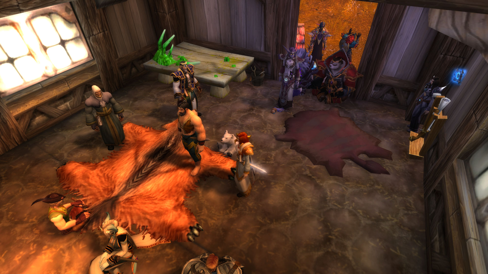<figcaption></figcaption></figure>

\[凯东丶费尔康]: 达拉然的法师？

\[月祈者瑟尔]: 外面有很多树木

佩瑞妮克洛斯 摸摸小狐狸的尾巴\~

凯东丶费尔康 不可置信的看了看莱斯文丶灰鬓

\[月祈者瑟尔]: 必要的时候他们就是我们的柴火

\[格林威治]: 或许

\[格林威治]: 我们应该去铁炉堡

\[洛瑟瓦尔]: 一名狼人法师还真是少见。

\[月祈者瑟尔]: 铁炉堡？那儿暖和！

\[法瑞雅]: 如果整个艾泽拉斯陷入雪天

\[格林威治]: 那边的探险者协会的布莱恩

\[法瑞雅]: 那只有铁炉堡是最暖和的地方

\[格林威治]: 是布莱恩对吧？

\[法瑞雅]: 是的，我听说过他的名。

\[格林威治]: 他最了解这些事情

\[希休斯]: 是的主教大人

\[月祈者瑟尔]: 嗯……你们谁有去火焰之地的办法？

\[凯东丶费尔康]: 我无意对其他人的装束做出评价 但…我很难相信你会是一位法师

\[格林威治]: 我们应该去铁炉堡

\[格林威治]: 那里至少能够供暖

\[法瑞雅]: 是的，我们去铁炉堡吧。

艾薇拉丶星坠 缓过来了，出去玩雪

\[希休斯]: 我去砍些柴火

\[法瑞雅]: 我认为大量难民可能会涌入铁炉堡。

艾薇拉丶星坠 拿雪球砸人

\[桑黛威玛]: 太冷了

\[莱斯文丶灰鬓]: 记得给钱

\[月祈者瑟尔]: 愿艾露恩与我们同在……

\[凯东丶费尔康]: 他居然真的是一位法师！

\[莱斯文丶灰鬓]: 记得付钱

\[莱斯文丶灰鬓]: 嗷！

很快整个苹果园，变成了白雪皑皑。

\[吟游诗人亚克]: 太冷了！！！

\[莱斯文丶灰鬓]: 让你穿这么少

吟游诗人亚克 去远处的换上棉服。

洛瑟瓦尔 因为受不了这里的寒冷气候，所以继续变成熊的样子

\[月祈者瑟尔]: 这太可怕了！

\[希休斯]: 这雪真大

\[月祈者瑟尔]: 我只希望我的买入大量粮食和取暖物资的指令得到了贯彻落实。

\[桑黛威玛]: 瑟尔，你感觉怎么样？

\[月祈者瑟尔]: 我感觉……冷……

\[凯东丶费尔康]: 周围真的没有萨满或者您的同僚施法来令天气变得如此异常吗？法师阁下？

\[桑黛威玛]: 我也是……不如我们互相抱抱？\*挑眉\*

凯东丶费尔康 还是有些不敢相信

### 诗人仅是因为讲故事就要被处死

恐慌的众人开始愤怒。开始胡乱发泄怒火。

\[格林威治]: 那个诗人呢

\[格林威治]: 他说了什么

\[格林威治]: 招来了风雪

\[希休斯]: 霍迪尔什么的

\[格林威治]: 一定是他

\[法瑞雅]: 他说了……霍迪尔的故事

\[格林威治]: 一定是他惹怒了上天

\[月祈者瑟尔]: 暴风城今年的棉布产量大概是141万匹，我刚才买入了81万匹……不过远水解不了近渴，我们……\*拥抱\*

\[法瑞雅]: 霍迪尔，冬日之王

\[莱斯文丶灰鬓]: 我朋友全去巨龙群岛了

\[凯东丶费尔康]: 这儿的天气让我觉得这里不是王国 而是北裂境…

<figure>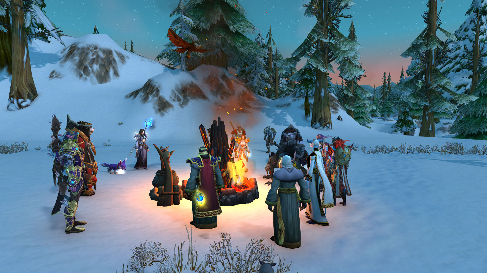<figcaption></figcaption></figure>

格林威治指着吟游诗人亚克。

\[格林威治]: 都是他的错

\[格林威治]: 应该把他绞死

格林威治指着吟游诗人亚克。

\[法瑞雅]: 这……

\[希休斯]: 烧了他！

桑黛威玛 紧紧抱住月祈者瑟尔，并把下巴搁在她肩膀上

\[凯东丶费尔康]: 这…从何说起？

\[法瑞雅]: 留着他他可能还知道更多的事情

凯东丶费尔康 惊讶的看向吟游诗人亚克

\[莱斯文丶灰鬓]: 就是他

\[女猎手萨娜]: 为什么你会如此了解…人类国家的行情\*小声\*

\[莱斯文丶灰鬓]: 他嘴开过光的

\[吟游诗人亚克]: 干嘛干嘛

<figure>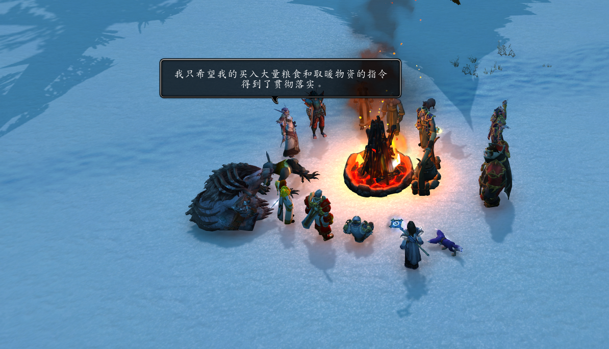<figcaption></figcaption></figure>

\[桑黛威玛]: 你看这群人类是不是脑袋不好使？竟然因为一个故事就绞死同胞\*低声在瑟尔耳边说\*

\[格林威治]: 就是你惹怒了上天

\[格林威治]: 带来了暴风雪

\[莱斯文丶灰鬓]: 把他砍了

\[莱斯文丶灰鬓]: 献祭

\[吟游诗人亚克]: 是我们正在讨论最近的巨龙群岛探险好吗

\[月祈者瑟尔]: 完全同意，姐妹，我宁愿为此憎恨一只咬了苹果的虫子。

\[格林威治]: 不是你说冰雪的故事

\[格林威治]: 怎么会下雪

\[格林威治]: 就是你的错!

\[桑黛威玛]: 还是咱们卡多雷脑袋正常点\*故意把气息喷在瑟尔耳朵上\*

艾薇拉丶星坠 听不懂，但是觉得很有趣

愤怒的众人们不断吵架和咒骂着。

\[格林威治]: 嗯？

\[格林威治]: 火堆熄灭了

\[凯东丶费尔康]: 只是故事？…\*低声\*

\[格林威治]: 把他绑在树上

凯东丶费尔康耸了耸肩说：“天知道。”

\[法瑞雅]: 我认为他很可能知道更多事

\[莱斯文丶灰鬓]: 我记得当年暗月精灵比我高很多的

\[桑黛威玛]: 要是哪天我讲故事下雪了，瑟尔会怎么做呀？\*低声\*

\[莱斯文丶灰鬓]: 怎么你们现在矮了这么多

\[月祈者瑟尔]: 呃……我？

艾薇拉丶星坠 从桑黛威玛的口袋里掏了1299金8银32铜

\[吟游诗人亚克]: 这个天气异象，为什么不去寒冰的起源地看看是发生了什么

凯东丶费尔康 面色有些难看

\[月祈者瑟尔]: 我会觉得这是个……把全世界变成冬泉谷的机会，大概？

\[法瑞雅]: 霍迪尔，他还在他的神殿吗？

\[希休斯]: 你到底知道什么？

\[凯东丶费尔康]: 你说的…是北裂境？

\[吟游诗人亚克]: 反正我们有达拉然的大法师在这里

\[格林威治]: 跟他废话什么

\[格林威治]: 直接给他处死了

吟游诗人亚克对格林威治眨了眨眼。

\[桑黛威玛]: 哈哈哈哈，我也是，我会趁机做冰淇淋\~\*伸出舌头舔了舔月祈者瑟尔的耳垂\*

\[吟游诗人亚克]: 没有人会杀一个吟游诗人\~

艾薇拉丶星坠 愤怒的叫了一声

\[格林威治]: 你来

\[月祈者瑟尔]: 等一下主教，这样是不被圣光认可的……啊！

\[格林威治]: 打碎他的脑袋

<figure>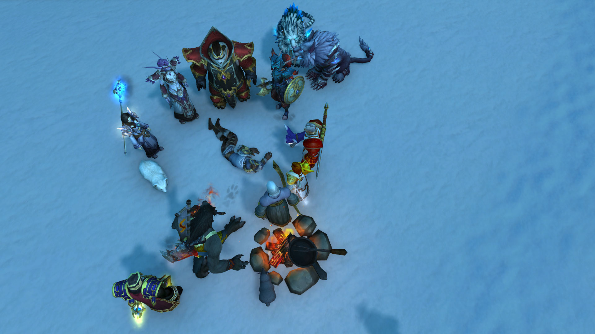<figcaption></figcaption></figure>

\[莱斯文丶灰鬓]: 我来

\[月祈者瑟尔]: 好奇怪的感觉……

\[桑黛威玛]: 等等！

\[吟游诗人亚克]: 霍迪尔的神殿

\[桑黛威玛]: 喂喂

\[吟游诗人亚克]: 有意思，想想就有意思！

\[桑黛威玛]: 各位人类同胞！！！

\[法瑞雅]: 他说了霍迪尔的神殿。

\[桑黛威玛]: 你们疯了吗

\[莱斯文丶灰鬓]: 给我打

\[凯东丶费尔康]: 霍迪尔？那些巨人们的首领

\[桑黛威玛]: 大狗，你冷静点

\[格林威治]: 打

\[桑黛威玛]: 等等！！！

格林威治 朝着吟游诗人扔石头

愤怒的人失去了理智。愤怒的人群开始扔石块。

\[桑黛威玛]: 各位！！！

吟游诗人亚克 捂着头。

\[希休斯]: 让开精灵！

\[洛瑟瓦尔]: 还真是粗暴。

凯东丶费尔康 敲了敲脑袋

桑黛威玛 举起盾牌试图抵挡石头

\[月祈者瑟尔]: 狐，有一个名叫萨拉塔斯的人觉得他们很愚蠢，你觉得呢？

\[桑黛威玛]: 别这样！！！

艾薇拉丶星坠 虽然不懂这是什么意思，但是好像明白了

吟游诗人亚克 捂着流血的脑袋晕了过去。

\[桑黛威玛]: 你们竟然因为一个故事……

\[月祈者瑟尔]: 看起来你确实听得懂我在说什么……？

\[桑黛威玛]: 这也太荒谬了

<figure>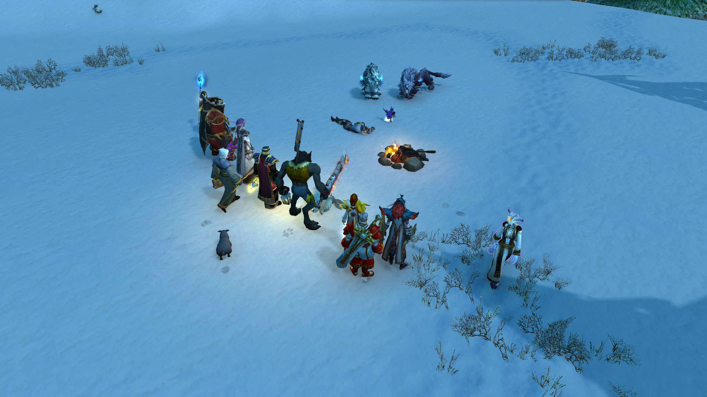<figcaption></figcaption></figure>

\[格林威治]: 都是他的错

\[法瑞雅]: 残酷的人类（但她也没阻止）。

\[莱斯文丶灰鬓]: 是的！

\[格林威治]: 来人

\[格林威治]: 给每个人分发石块

\[莱斯文丶灰鬓]: 把他拖走

\[桑黛威玛]: 他现在快死了，这雪也没见小！！！

\[格林威治]: 对他用石刑

\[莱斯文丶灰鬓]: 我要把它挂在树上

格林威治指着吟游诗人亚克。

艾薇拉丶星坠 不理解这些人在做什么

\[法瑞雅]: 是的啊，杀死他也阻止不了雪。

\[月祈者瑟尔]: 这也太……残酷了……

\[希休斯]: 把他管道铁笼子里！

艾薇拉丶星坠舔了舔吟游诗人亚克。

\[莱斯文丶灰鬓]: 是的

\[煖暖丶风裘]: 别浪费 他能吃吗？

\[月祈者瑟尔]: 当然不能，熊猫人！

愤怒的众人依然没有任何进展，只有相互吵架。

\[桑黛威玛]: 喂喂！！！

\[凯东丶费尔康]: 我得说 只是因为故事就处死人 实在是…

凯东丶费尔康皱着眉头。

\[煖暖丶风裘]: 我觉得你肯定很美味

\[莱斯文丶灰鬓]: 我也觉得

\[桑黛威玛]: 不！

\[月祈者瑟尔]: 我身上有足够的食物，请不要这样说！

\[桑黛威玛]: 太荒谬了

\[月祈者瑟尔]: 吃人，这也太……

\[莱斯文丶灰鬓]: 精灵好像不算人

\[月祈者瑟尔]: 喂！

桑黛威玛 举起盾牌，试图挡开石头

\[煖暖丶风裘]: 你们还砸他呢 我可仁慈多了

\[莱斯文丶灰鬓]: 好像把他杀了，也没用

\[桑黛威玛]: 历史上用石刑的，都是十恶不赦之徒

\[吟游诗人亚克]: 长夜…绝望…自杀…\*呢喃\*

\[桑黛威玛]: 而他只不过是讲了个故事

格林威治 愤怒的人群开始分发石块

艾薇拉丶星坠 觉得有点害怕，靠近了月祈者瑟尔

\[艾薇拉丶星坠]: 咪嘤嘤嘤？

\[桑黛威玛]: 老头，你疯了吗

凯东丶费尔康 沉思了片刻

莱斯文丶灰鬓 思考了下

\[吟游诗人亚克]: 冰封…即将…到来…

\[桑黛威玛]: 你觉得圣光允许你如此轻率吗

\[月祈者瑟尔]: 这是不名誉的……

\[法瑞雅]: 石刑，确实是古老的刑罚……

\[莱斯文丶灰鬓]: 我去看看，死没死

\[月祈者瑟尔]: 至少我们应该把他交给暴风城法官……

\[凯东丶费尔康]: 唔…

\[桑黛威玛]: 罪名就是讲故事是吗

\[凯东丶费尔康]: 似乎还有一口气

吟游诗人亚克 吐了口血痰在凯东丶费尔康的脸上。

\[莱斯文丶灰鬓]: 感觉能活

凯东丶费尔康对着吟游诗人亚克叹了口气。

\[吟游诗人亚克]: 粗鲁自大的人类们…你们不知道你们即将面对什么

\[莱斯文丶灰鬓]: 你会治疗吗

月祈者瑟尔 安抚狐狸，虽然他自己也十分害怕

凯东丶费尔康 祈祷

\[桑黛威玛]: 住手！！！

\[格林威治]: 打死他

\[莱斯文丶灰鬓]: 打死他

人们依然在争吵中，毕竟这种事情已经超越了他们的认知。

\[凯东丶费尔康]: 愿圣光宽恕我的软弱和怯懦\*低声\*

\[桑黛威玛]: 罪名是什么？？？

\[月祈者瑟尔]: 这样是不道德的

\[洛瑟瓦尔]: 但是他死了有什么用呢？雪还是会继续下啊？

\[桑黛威玛]: 你们信仰的圣光允许你们这么做吗？

\[煖暖丶风裘]: 小心他背后捅你刀子

\[吟游诗人亚克]: 来来来，打死我，不然我会到处传唱圣光教会的粗鄙！

\[格林威治]: 打死他

\[格林威治]: 打死这个罪人

\[月祈者瑟尔]: 不行……

\[桑黛威玛]: 我宁可相信一群无故杀人的从前面捅刀子

\[希休斯]: 把他关起来！

\[桑黛威玛]: 另外，就算是他讲故事造成的，我们是不是该找元凶？

洛瑟瓦尔 舔了舔前爪，揉了揉脸。

\[凯东丶费尔康]: 阁下 您也赞成处死这个诗人吗?\*低声\*

凯东丶费尔康 看向法瑞雅

\[法瑞雅]: 霍迪尔，可能是我们需要调查的东西

\[桑黛威玛]: 不找真正的凶手，而找这位，是不是过于怯懦了？这算是柿子捡软的捏

### 诗人亚克逃跑

\[吟游诗人亚克]: 这是什么！

\[凯东丶费尔康]: 这是什么法术？

\[煖暖丶风裘]: 他要逃跑啦

\[格林威治]: 他要跑了

\[格林威治]: 该死的

\[桑黛威玛]: 不该跑吗？

\[格林威治]: 精灵

\[法瑞雅]: 圣光啊

\[格林威治]: 这就是你保护的人

\[希休斯]: 这是异端！

\[格林威治]: 风暴就是他们带来的

\[桑黛威玛]: 再不跑就被你们无故砸死啦

\[桑黛威玛]: 理由？

<figure>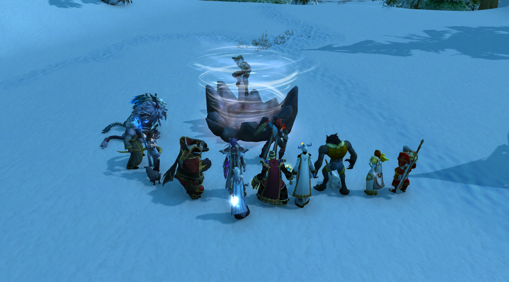<figcaption></figcaption></figure>

雪越来越大。

\[月祈者瑟尔]: 等等，风暴？

格林威治指着莱斯文丶灰鬓。

\[格林威治]: 你要直接砸死他

洛瑟瓦尔 对眼前的闹剧开始失去兴趣。

\[格林威治]: 就不会有这事情了

\[格林威治]: 还有你熊猫人

格林威治指着煖暖丶风裘。

\[格林威治]: 你扔的什么石头

\[煖暖丶风裘]: 干熊麽

\[桑黛威玛]: 既然“凶手”跑了，那不如去他说的地方瞧瞧？也好还他清白

\[桑黛威玛]: 或者，定他罪名

凯东丶费尔康对桑黛威玛点了点头。

\[凯东丶费尔康]: 我同意这位…精灵女士的观点

\[格林威治]: 哼

法瑞雅 的盔甲也无法御寒。

本是愉快的秋收品酒会，却因为天气的异变，导致所有人不欢而散。

\[桑黛威玛]: 叫我桑黛，先生\*抛媚眼\*

\[月祈者瑟尔]: 好冷……、

\[凯东丶费尔康]: 好吧 我同意你的观点 桑黛

凯东丶费尔康 无视了桑黛威玛的媚眼

\[法瑞雅]: 我建议去霍迪尔的神殿调查他到底发生了什么

\[煖暖丶风裘]: 雪绵绵 情依依 多少故事在心里

\[希休斯]: 我要带我的羊回去了！这个鬼地方！

\[凯东丶费尔康]: 但这里距离北裂境万里之遥…

\[月祈者瑟尔]: 没错，我们也要回去了！\~

\[桑黛威玛]: 瑟尔，我们走吧，人类简直不可理喻

艾薇拉丶星坠赞同月祈者瑟尔的观点。

\[月祈者瑟尔]: 回……嗯，暴风城拍卖行！

\[艾薇拉丶星坠]: 嗯……

\[煖暖丶风裘]: 人类世界套路深 我要回潘达利亚！

<figure>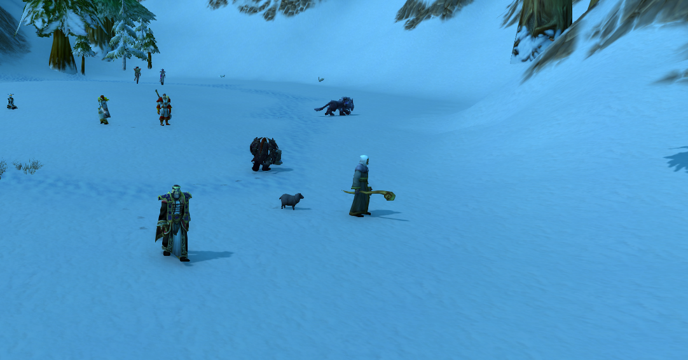<figcaption></figcaption></figure>

人类顽固派对其他种族的敌意也加深了。最终所有人都愤愤的离开了庄园。所有种族谁也没给谁好脸色。
