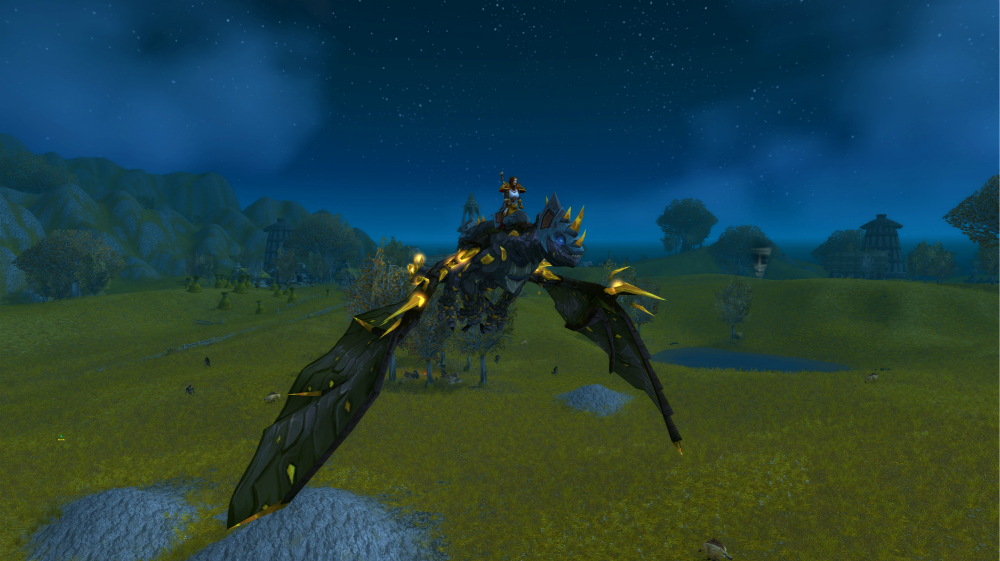
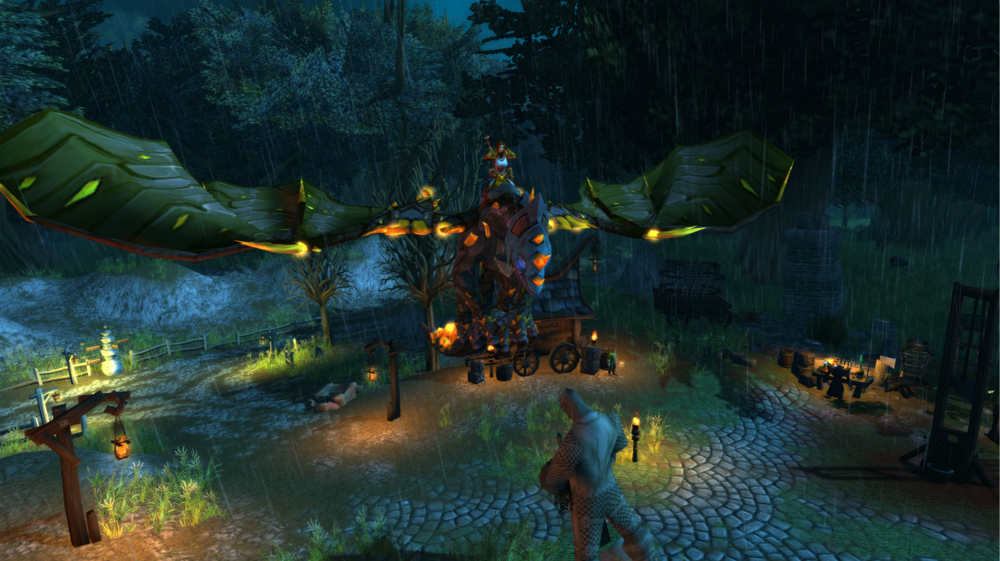
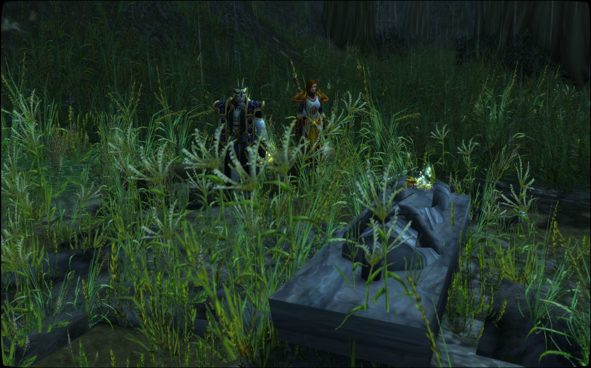
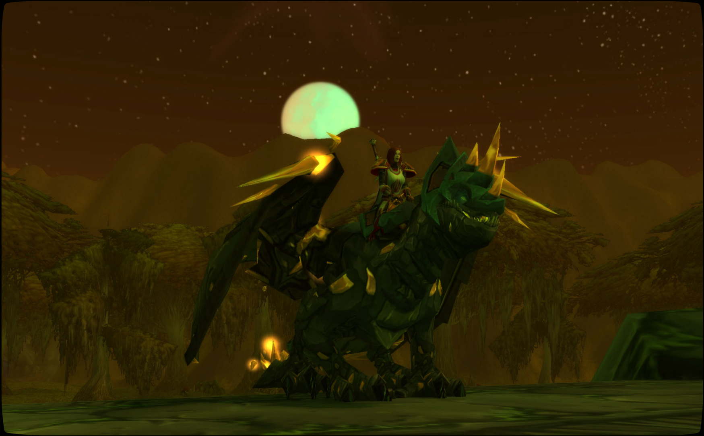
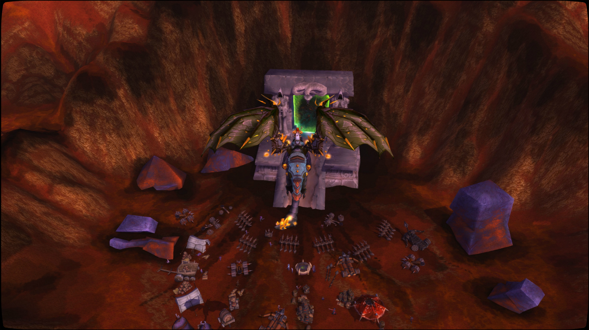
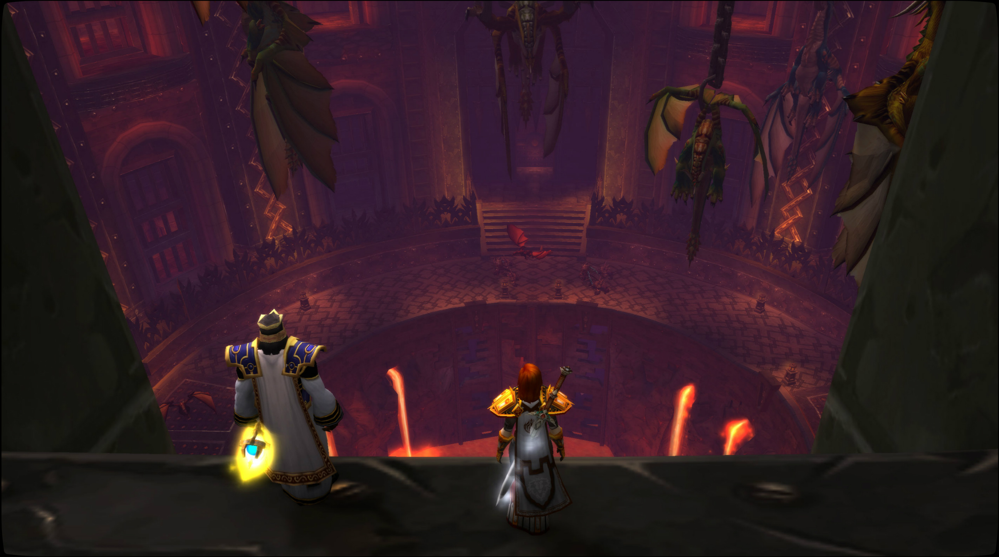
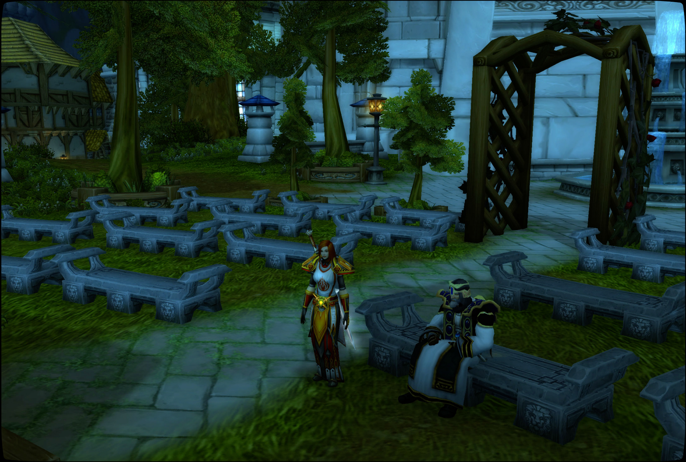

# 地狱之旅

与贤者尼苛德摩的地狱之旅。

记录开始于 10/16/2019 的 00:01:16。

\[贤者尼苛德摩]: 踏过冥界之河

\[贤者尼苛德摩]: 进入地狱

\[贤者尼苛德摩]: 但是

\[贤者尼苛德摩]: 这里和活着时候又有何不同？

\[贤者尼苛德摩]: 这是一个枯萎凋零的世界

\[法瑞雅]: 是一个正在死去的世界。

\[贤者尼苛德摩]: 秋季的最后一个月

\[贤者尼苛德摩]: 这是地狱的开始

\[贤者尼苛德摩]: 这里是枯败之国

\[贤者尼苛德摩]: 死后进入这里的人

\[贤者尼苛德摩]: 永远的饱受饥寒交迫

\[贤者尼苛德摩]: 若是给他一块食物

\[贤者尼苛德摩]: 他能够为你攻打地狱之城

\[贤者尼苛德摩]: 田野上

\[贤者尼苛德摩]: 豆子全部都枯萎

\[贤者尼苛德摩]: 豆荚却空空如也

\[贤者尼苛德摩]: 什么都不剩

\[法瑞雅]: 衰败和死亡！

\[贤者尼苛德摩]: 地上的南瓜

\[贤者尼苛德摩]: 全部枯萎!

\[贤者尼苛德摩]: 切开这干瘪的南瓜

\[贤者尼苛德摩]: 你发现它的内心是空壳

\[贤者尼苛德摩]: 无法食用

\[贤者尼苛德摩]: 满地的南瓜

\[贤者尼苛德摩]: 却没有一个能够食用

\[贤者尼苛德摩]: 饥饿让人变成了怪物

\[法瑞雅]: 这不是收获的季节，而是凋零的往日。

\[贤者尼苛德摩]: 变成了豺狼

\[贤者尼苛德摩]: 不惜同类相食

\[贤者尼苛德摩]: 更是嚼碎骨头，不留一点残渣

\[贤者尼苛德摩]: 血色的苹果树

\[贤者尼苛德摩]: 枯败的叶子上全是自相残杀的人

\[贤者尼苛德摩]: 所留下的鲜血

\[法瑞雅]: 连鲜血都是苦的。

\[贤者尼苛德摩]: 无尽的风暴

\[贤者尼苛德摩]: 劫掠大地

\[贤者尼苛德摩]: 茂盛的田野里

\[贤者尼苛德摩]: 长的不是麦子

\[贤者尼苛德摩]: 而是有毒的稗子

\[贤者尼苛德摩]: 人马食用皆会死去

\[贤者尼苛德摩]: 田野中不是秋葵

\[贤者尼苛德摩]: 那是邪草

\[贤者尼苛德摩]: 邪恶的草

\[贤者尼苛德摩]: 大地崩裂

\[贤者尼苛德摩]: 因为饥饿

\[贤者尼苛德摩]: 大地也张开了大嘴

\[法瑞雅]: 那是大地的怒火，连大地也不再是和蔼的母亲了。

\[贤者尼苛德摩]: 田野之上

\[贤者尼苛德摩]: 上面都不剩下

\[贤者尼苛德摩]: 荒芜的小镇

\[贤者尼苛德摩]: 满是饥饿之人

\[贤者尼苛德摩]: 噢

\[贤者尼苛德摩]: 这枯败世界之王

\[贤者尼苛德摩]: 正在山巅之上

\[贤者尼苛德摩]: 他以哀求

\[贤者尼苛德摩]: 让人同情他

\[贤者尼苛德摩]: 为他建造这乞丐的庇护所

\[贤者尼苛德摩]: 乞讨的恶魔之王

\[贤者尼苛德摩]: 再心硬之人

\[贤者尼苛德摩]: 都会可怜他

\[贤者尼苛德摩]: 乞丐之城

\[法瑞雅]: 但地狱里没有圣光，也没有圣光的怜悯。

\[贤者尼苛德摩]: 漫游着枯败的世界啊

\[贤者尼苛德摩]: 满是凄凉

\[贤者尼苛德摩]: 让我们进入

\[贤者尼苛德摩]: 胜利之日

\[贤者尼苛德摩]: 骷髅之界

\[贤者尼苛德摩]: 满是黑暗的世界

\[贤者尼苛德摩]: 只有老鼠

\[贤者尼苛德摩]: 毫无人烟

\[法瑞雅]: 永夜的森林，黑暗的国界。

\[贤者尼苛德摩]: 古老的城镇

\[贤者尼苛德摩]: 早已废弃

\[贤者尼苛德摩]: 无人居住

\[贤者尼苛德摩]: 让我们读这铭文

\[贤者尼苛德摩]: 最后的胜利!

\[贤者尼苛德摩]: 大地被鲜血和眼泪浸透！

\[贤者尼苛德摩]: 圣十字高举的年代！

\[贤者尼苛德摩]: 黑死降临

\[贤者尼苛德摩]: 最后的胜利

\[贤者尼苛德摩]: 踏破秋日的寂静

\[法瑞雅]: 也是最后的灭亡之时。

\[贤者尼苛德摩]: 那时已经开始治疗周围的市民们

\[贤者尼苛德摩]: 这并不能使所有的家庭逃脱瘟疫的魔掌

\[贤者尼苛德摩]: 最后的胜利

\[贤者尼苛德摩]: 打破了秋日的静谧

\[贤者尼苛德摩]: 对于死者

\[贤者尼苛德摩]: 愿主的荣光永远照耀他们吧

\[法瑞雅]: 圣光会怜悯他们。

\[贤者尼苛德摩]: 黑死病降临这个世界

\[贤者尼苛德摩]: 人们痛苦的死去

\[贤者尼苛德摩]: 这是死亡的胜利

\[贤者尼苛德摩]: 偌大的墓园啊

\[贤者尼苛德摩]: 埋葬了所有的人

\[贤者尼苛德摩]: 天罚降临

\[贤者尼苛德摩]: 谁又能躲过？

\[法瑞雅]: 连天使都会失去羽翼。

\[贤者尼苛德摩]: 墓园中

\[贤者尼苛德摩]: 一段拉丁文

\[贤者尼苛德摩]: 记住

\[贤者尼苛德摩]: 你只有一死

\[贤者尼苛德摩]: 三个老人在这里

\[贤者尼苛德摩]: 如同死人的面孔

\[贤者尼苛德摩]: 宁人厌恶

\[贤者尼苛德摩]: 他对路过的骑士说

\[贤者尼苛德摩]: 今夕吾躯归吾土

\[贤者尼苛德摩]: 他朝君体亦相同

\[贤者尼苛德摩]: 我的今天，是你的明天

\[贤者尼苛德摩]: 啊

\[贤者尼苛德摩]: 坟墓中的骷髅啊

\[贤者尼苛德摩]: 都爬了起来

\[贤者尼苛德摩]: 他们在舞蹈

\[贤者尼苛德摩]: 为何舞蹈？

\[贤者尼苛德摩]: 死亡胜利了

\[贤者尼苛德摩]: 最后的胜利

\[法瑞雅]: 死亡之舞和死神的狂欢。

\[贤者尼苛德摩]: 瘟疫

\[贤者尼苛德摩]: 他正长眠于他的王座之上

\[贤者尼苛德摩]: 遂见有灰马

\[贤者尼苛德摩]: 名曰死

\[贤者尼苛德摩]: 以杀以戮以疫之

\[贤者尼苛德摩]: 幽灵啊

\[贤者尼苛德摩]: 舞蹈吧

\[贤者尼苛德摩]: 因为死亡得胜了

\[法瑞雅]: 地狱里的狂欢。

\[贤者尼苛德摩]: 肿胀的行尸啊

\[贤者尼苛德摩]: 也欢悦起来了

\[贤者尼苛德摩]: 到处都是死亡

\[贤者尼苛德摩]: 黑鼠的大军啊

\[贤者尼苛德摩]: 正驶向一切未死之物

\[贤者尼苛德摩]: 教堂已经破败

\[贤者尼苛德摩]: 在无人烟

\[贤者尼苛德摩]: 墓地埋着所有人

\[贤者尼苛德摩]: 现在这些骷髅啊

\[贤者尼苛德摩]: 也出来高举胜利的旗帜

\[贤者尼苛德摩]: 死亡获胜了

\[法瑞雅]: 即使到了土里，化为灰烬，也不安宁。

\[贤者尼苛德摩]: 死去的卫兵

\[贤者尼苛德摩]: 永远在执行生前的使命

\[贤者尼苛德摩]: 什么都不剩下了

\[贤者尼苛德摩]: 只剩下破败无人居住的房屋

\[贤者尼苛德摩]: 什么都没有了

\[贤者尼苛德摩]: 枯败的墓园

\[法瑞雅]: 亡者并不安息，圣光啊。

\[贤者尼苛德摩]: 是那与黑死病作战的人的坟墓

\[贤者尼苛德摩]: 他失败了

\[法瑞雅]: 死亡来的时候悄无声息。

\[贤者尼苛德摩]: 他安葬于此

\[贤者尼苛德摩]: 死却派出他的骑士

\[贤者尼苛德摩]: 死骑士们

\[贤者尼苛德摩]: 在他的墓前

\[贤者尼苛德摩]: 如同嘲弄

\[贤者尼苛德摩]: 死命令他的骑士为这位与死亡作战的英雄守墓

\[贤者尼苛德摩]: 这更像是在嘲笑他

\[法瑞雅]: 他如何能胜过死亡？

\[贤者尼苛德摩]: 他死了

\[贤者尼苛德摩]: 没有战胜死亡

\[贤者尼苛德摩]: 无知之人依然涌向这里

\[贤者尼苛德摩]: 死不断在嘲笑着

\[贤者尼苛德摩]: 跑吧，向山上跑吧

\[贤者尼苛德摩]: 庆典正在开始

\[贤者尼苛德摩]: 选一个位置最好的座位

\[贤者尼苛德摩]: 看那求饶着的男人是如何屈膝跪在那里

\[贤者尼苛德摩]: 他应感受到死亡

\[贤者尼苛德摩]: 镰刀会将他的喉咙切断

\[法瑞雅]: 是死亡正在唱着来自西风的歌谣。

\[贤者尼苛德摩]: 树叶变成了最深的绿色

\[贤者尼苛德摩]: 他在夜晚的微风中尖叫

\[贤者尼苛德摩]: 让我们一起享用这美酒

\[贤者尼苛德摩]: 黑暗会降临在所有人之上

\[贤者尼苛德摩]: 死亡将他带回母亲的怀中

\[贤者尼苛德摩]: 在那里他将得到安息

\[贤者尼苛德摩]: 让我们敬他一杯

\[法瑞雅]: 祝酒！

\[贤者尼苛德摩]: 黑暗是如此的嘲弄啊

\[贤者尼苛德摩]: 罪恶深渊

\[法瑞雅]: 这枯萎的土地里没有安息。

\[贤者尼苛德摩]: 我们越来越深入地狱的深处

\[贤者尼苛德摩]: 这里不再有生灵

\[贤者尼苛德摩]: 这是绝望的深渊

\[贤者尼苛德摩]: 看那扭曲的树木

\[法瑞雅]: 仿佛都在尖叫着死者的哀嚎。

\[贤者尼苛德摩]: 这都是死者的灵魂

\[贤者尼苛德摩]: 他们犯下了通奸和鸡奸

\[贤者尼苛德摩]: 还有兽恋

\[贤者尼苛德摩]: 一切违逆上主的人

\[贤者尼苛德摩]: 屈服于肉体欲望之人

\[贤者尼苛德摩]: 将在这里

\[贤者尼苛德摩]: 无尽的受罚

\[贤者尼苛德摩]: 什么都不剩下

\[贤者尼苛德摩]: 上面东西都没有

\[法瑞雅]: 刺骨的雨水已经是怜悯了。

\[贤者尼苛德摩]: 受罪者之林

\[贤者尼苛德摩]: 一切都是咎由自取

\[贤者尼苛德摩]: 那高塔

\[贤者尼苛德摩]: 是魔王的居所

\[贤者尼苛德摩]: 他是谁？

\[法瑞雅]: 是那坠落的星辰？

\[法瑞雅]: 失去了翅膀的天使长？

\[贤者尼苛德摩]: 他是欲望的魔王

\[贤者尼苛德摩]: 是肉体最原始的欲望

\[贤者尼苛德摩]: 他的名字

\[贤者尼苛德摩]: 只出现在希伯来文中

\[法瑞雅]: 无名之魔王，他是谁？

\[贤者尼苛德摩]: 她是恶意

\[贤者尼苛德摩]: 是被谴责者

\[贤者尼苛德摩]: 阿斯莫德努斯

\[贤者尼苛德摩]: 他是淫邪者

\[贤者尼苛德摩]: 这受罪者之林的主人

\[法瑞雅]: 奸邪者之名。

\[贤者尼苛德摩]: 淫邪之城

\[法瑞雅]: 地下城中更是深渊。

\[贤者尼苛德摩]: 进入淫邪之城

\[贤者尼苛德摩]: 只有最坚定的人

\[贤者尼苛德摩]: 才可避免堕落

\[贤者尼苛德摩]: 在淫邪之城中

\[贤者尼苛德摩]: 有一位圣光的仆人

\[贤者尼苛德摩]: 她希望宁这些淫邪者改过自新

\[贤者尼苛德摩]: 罪恶之城

\[贤者尼苛德摩]: 淫邪的坐骑

\[贤者尼苛德摩]: 他与死一样

\[贤者尼苛德摩]: 在末日审判之日

\[法瑞雅]: 这是死之骑士的坐骑。

\[贤者尼苛德摩]: 会骑着马出现

\[贤者尼苛德摩]: 不不不

\[贤者尼苛德摩]: 死的马

\[贤者尼苛德摩]: 没有这么华丽

\[贤者尼苛德摩]: 阿斯莫德努斯不会在第一时间出现于世

\[贤者尼苛德摩]: 他只会在四骑士肆掠结束后才出现

\[贤者尼苛德摩]: 他将会诱惑世人

\[贤者尼苛德摩]: 让世人与君王都陷入无尽的肉体欲望之中

\[贤者尼苛德摩]: 她是那大淫妇

\[贤者尼苛德摩]: 与诸王苟合

\[贤者尼苛德摩]: 喝着圣徒之血

\[贤者尼苛德摩]: 她亦是那大巴比伦

\[贤者尼苛德摩]: 无尽的舞会

\[贤者尼苛德摩]: 无尽的宴会厅

\[贤者尼苛德摩]: 无尽的宴会

\[贤者尼苛德摩]: 这是他们最后的宴会

\[法瑞雅]: 引诱正直之人的宴会

\[贤者尼苛德摩]: 随后便会变成那城外的受难之树

\[贤者尼苛德摩]: 每天都无穷无尽的人来赴宴

\[贤者尼苛德摩]: 因为

\[贤者尼苛德摩]: 世界上

\[贤者尼苛德摩]: 淫邪之人

\[贤者尼苛德摩]: 太多了

\[贤者尼苛德摩]: 这里是招待那些淫邪之人

\[贤者尼苛德摩]: 鉴定信念

\[贤者尼苛德摩]: 不要被肉体的欲望控制

\[贤者尼苛德摩]: 禁住诱惑

\[贤者尼苛德摩]: 若是陷入肉体的欲望

\[法瑞雅]: 不要像这床上的草人一般……

\[贤者尼苛德摩]: 则永远的迷失

\[贤者尼苛德摩]: 当心

\[贤者尼苛德摩]: 欲望会战胜理智

\[贤者尼苛德摩]: 用眼睛瞧着她们

\[法瑞雅]: 这些多半是毒酒，扰乱心智。

\[贤者尼苛德摩]: 不要害怕

\[贤者尼苛德摩]: 不

\[贤者尼苛德摩]: 这是世界上最好的葡萄酒

\[贤者尼苛德摩]: 价值连城

\[贤者尼苛德摩]: 不必害怕

\[贤者尼苛德摩]: 即使饮下这酒

\[贤者尼苛德摩]: 信德坚定

\[贤者尼苛德摩]: 永远不会陷入堕落

\[贤者尼苛德摩]: 书架上

\[贤者尼苛德摩]: 都是淫邪的书籍

贤者尼苛德摩 端起桌上的红酒

\[贤者尼苛德摩]: 这酒

\[贤者尼苛德摩]: 能够让一切不坚定的人堕落

\[贤者尼苛德摩]: 有信德之人，它仅仅只是一杯水罢了

\[法瑞雅]: 我已经很久不碰酒了。

\[法瑞雅]: 是的。

\[贤者尼苛德摩]: 有信德

\[贤者尼苛德摩]: 这里是信德的考验

\[贤者尼苛德摩]: 圣光唯一的仆人

\[贤者尼苛德摩]: 唯一在这淫邪之地的仆人

\[贤者尼苛德摩]: 她来自于上主之手

\[贤者尼苛德摩]: 要制止淫邪

\[法瑞雅]: 她成功了吗？

\[贤者尼苛德摩]: 直到审判之日

\[贤者尼苛德摩]: 才有答案

\[贤者尼苛德摩]: 我们要离开这里了

\[贤者尼苛德摩]: 我们来到了泥潭深渊

\[贤者尼苛德摩]: 这里

\[贤者尼苛德摩]: 是腐烂之地

\[贤者尼苛德摩]: 一切都在腐烂中

\[贤者尼苛德摩]: 这里没有人

\[法瑞雅]: 像是在魔王的肚腹里。

\[贤者尼苛德摩]: 那些人啊

\[贤者尼苛德摩]: 生前为人

\[贤者尼苛德摩]: 死后成为一滩烂泥

\[贤者尼苛德摩]: 犯下了什么罪孽呢？

\[贤者尼苛德摩]: 懒惰

\[贤者尼苛德摩]: 这个世界恶臭

\[贤者尼苛德摩]: 这是恶魔的使者

\[贤者尼苛德摩]: 无尽的抓捕那些刚到这里的灵魂

\[贤者尼苛德摩]: 腐烂的城市

\[贤者尼苛德摩]: 是魔王的居所

\[贤者尼苛德摩]: 这一座神殿

\[贤者尼苛德摩]: 是他的王座

\[法瑞雅]: 腐蚀也俯视懒惰的灵魂。

\[贤者尼苛德摩]: 该地魔王

\[贤者尼苛德摩]: 名曰

\[贤者尼苛德摩]: 撒塔尼娅

\[贤者尼苛德摩]: 手持胆汁的长枪

\[贤者尼苛德摩]: 只有无尽的腐烂

\[贤者尼苛德摩]: 上面都不剩下

\[贤者尼苛德摩]: 啊

\[法瑞雅]: 啊燃烧之路。

\[贤者尼苛德摩]: 猩红的大地

\[贤者尼苛德摩]: 腐烂的撒塔尼亚

\[贤者尼苛德摩]: 她不在这里

\[贤者尼苛德摩]: 但是

\[贤者尼苛德摩]: 到处都是魔王的爪牙

\[贤者尼苛德摩]: 让人怀疑

\[贤者尼苛德摩]: 但是

\[贤者尼苛德摩]: 这很正常

\[贤者尼苛德摩]: 魔鬼与魔鬼之间的互相攻杀罢了

\[贤者尼苛德摩]: 更深的地方

\[贤者尼苛德摩]: 需要更强大的勇气

\[贤者尼苛德摩]: 烈火地域

\[贤者尼苛德摩]: 我们进入了火地狱

\[贤者尼苛德摩]: 这就是

\[贤者尼苛德摩]: 我们常说的

\[贤者尼苛德摩]: 满是烈火的地方

\[法瑞雅]: 这是地狱的深处了。

\[贤者尼苛德摩]: 不

\[贤者尼苛德摩]: 这只是

\[贤者尼苛德摩]: 人们熟知的地方而已

\[贤者尼苛德摩]: 像这个畜生

\[贤者尼苛德摩]: 只是地狱最常见的魔鬼罢了

\[贤者尼苛德摩]: 火狱

\[贤者尼苛德摩]: 一切异端的归宿

\[贤者尼苛德摩]: 那些异端邪说者

\[贤者尼苛德摩]: 叛教者

\[贤者尼苛德摩]: 分裂教会者

\[贤者尼苛德摩]: 不信者

\[贤者尼苛德摩]: 亵渎者

\[法瑞雅]: 异端葬身火海。

\[贤者尼苛德摩]: 这里是永久让他们受罚的地方

\[贤者尼苛德摩]: 烈焰地狱有三层

\[贤者尼苛德摩]: 这只是

\[贤者尼苛德摩]: 最基础的一层罢了

\[贤者尼苛德摩]: 是给罪轻之人的

\[贤者尼苛德摩]: 阿兹莫丹的王座

\[贤者尼苛德摩]: 他是长官这一层地狱的魔王

\[贤者尼苛德摩]: 他代表愤怒

\[贤者尼苛德摩]: 这一层地狱是一切暴怒之人的归宿

\[贤者尼苛德摩]: 第二火狱

\[法瑞雅]: 是给仇恨之人的吗？

\[贤者尼苛德摩]: 是的

\[贤者尼苛德摩]: 仇恨的地狱

\[贤者尼苛德摩]: 仇恨之王的宫殿

\[贤者尼苛德摩]: 充满恨意的宫殿

\[贤者尼苛德摩]: 仇恨大殿

\[贤者尼苛德摩]: 看下面

\[法瑞雅]: 那是沸腾的岩浆。

\[贤者尼苛德摩]: 那都是仇杀者的归宿

\[贤者尼苛德摩]: 烈火恶魔

\[贤者尼苛德摩]: 把罪人

\[贤者尼苛德摩]: 扔进火海

\[贤者尼苛德摩]: \[伊森拉图斯]

\[贤者尼苛德摩]: 仇恨的匕首

\[法瑞雅]: 上面的尖刺说明了这点。

\[贤者尼苛德摩]: 只是一把杀母亲的匕首

\[贤者尼苛德摩]: 仇恨母亲之人

\[贤者尼苛德摩]: 所用的

\[贤者尼苛德摩]: 罪恶厅堂

\[贤者尼苛德摩]: 不要下去

\[贤者尼苛德摩]: 那是深渊

\[贤者尼苛德摩]: 罪恶深渊

\[法瑞雅]: 确实令人害怕。

\[贤者尼苛德摩]: 仇恨的深渊

\[贤者尼苛德摩]: 仇恨就躺在

\[贤者尼苛德摩]: 下方的血池中

\[贤者尼苛德摩]: 离开这里

\[贤者尼苛德摩]: 第三层火狱

\[贤者尼苛德摩]: 无法再前往了

\[贤者尼苛德摩]: 需要更强大和睿智的人

\[贤者尼苛德摩]: 才能够前往


