# 教会：乌瑟尔之墓朝圣

## 乌瑟尔之墓朝圣（一）

教会决定去往乌瑟尔之墓进行朝圣。

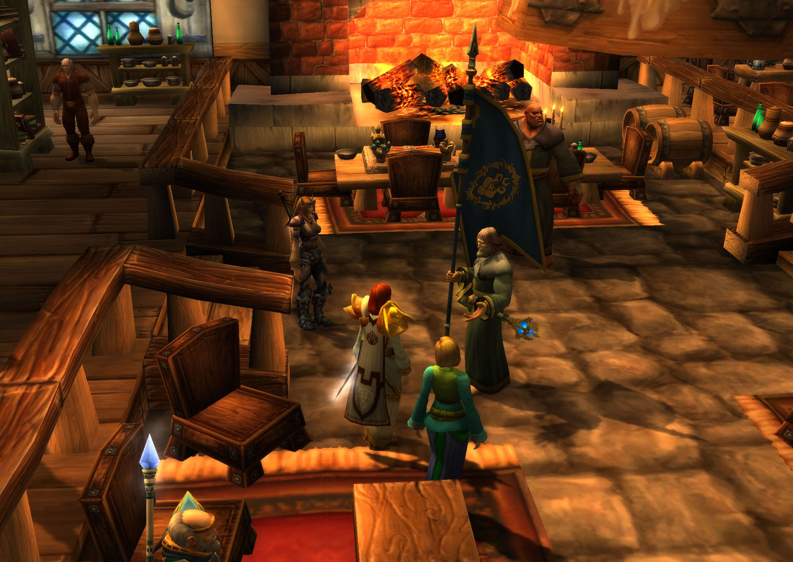

\[格林威治主教]: 给拉斐尔学士准备的

\[格林威治主教]: 我们要前往乌瑟尔之墓朝圣

\[格林威治主教]: 有没有人愿意同行？

\[法瑞雅]: 我愿意

\[格林威治主教]: 我们需要强壮的武士

法瑞雅 举手致意

\[格林威治主教]: 尊敬的夫人

\[法瑞雅]: 朝圣的路途艰险，你们可以用上我的剑。

\[格林威治主教]: 我们感谢您的同行

\[格林威治主教]: 在朝圣的路途中

\[格林威治主教]: 我们感谢您的武器来保卫朝圣者

\[法瑞雅]: 这是我的荣幸。

\[格林威治主教]: 教会的骑士都是没什么战斗经验的傻孩子

\[法瑞雅]: 他们可能会在路上遇到真正的亡灵。

\[格林威治主教]: 比起亡灵

\[格林威治主教]: 我更担心

\[法瑞雅]: 我希望他们握剑的手不会发抖。

\[格林威治主教]: 罪恶者

\[法瑞雅]: 罪恶者？

\[格林威治主教]: 罪恶者查尔德纳修斯公爵

\[格林威治主教]: 他最喜欢在圣途上袭击朝圣者

\[法瑞雅]: 啊，那你们确实需要我。

\[梅洛蒂]: 他是异教徒吗?

\[格林威治主教]: 他是王国的封臣

\[格林威治主教]: 人们叫他查尔公爵

\[梅洛蒂]: 那他怎么敢袭击同宗

\[格林威治主教]: 他是奥斯伯特最邪恶，最无耻的贵族

\[格林威治主教]: 甚至在斋戒日吃肉

\[梅洛蒂]: 愿圣光宽恕他

\[格林威治主教]: 他肯定

\[格林威治主教]: 在半路准备着袭击朝圣者

\[格林威治主教]: 你们先到外面去吧

\[格林威治主教]: 我继续招募同行者

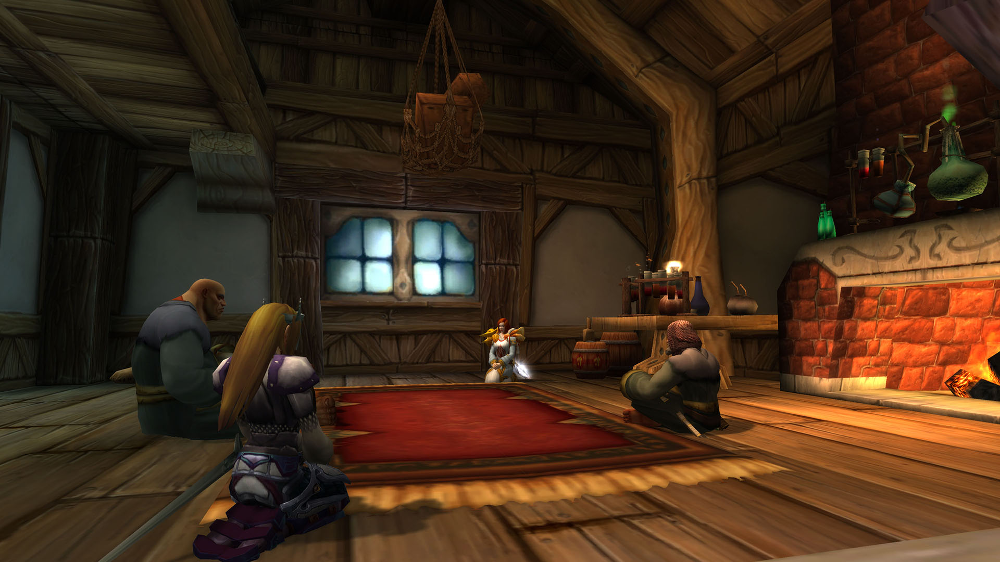

\[法瑞雅]: 说来听听。

\[格林威治主教]: 查尔公爵他谋杀了自己的妻子

\[格林威治主教]: 谋害

\[法瑞雅]: 听起来是个险恶之人。

\[格林威治主教]: 他的妻子是吉尔尼斯霍华德家族的

\[格林威治主教]: 年芳15岁

\[格林威治主教]: 就嫁给了30多岁的查尔

\[格林威治主教]: 查尔把她锁在城堡的高塔上

\[格林威治主教]: 不允许别的男人看他的妻子

\[格林威治主教]: 如果他的妻子与其他男子说话

\[格林威治主教]: 他就视为妻子不贞

\[格林威治主教]: 你们说说，世界上怎么会有着这种混账

\[法瑞雅]: 听起来确实是个善妒的人。

\[格林威治主教]: 每天晚上，霍华德都会被查尔公爵殴打

\[格林威治主教]: 因为霍华德给城堡仆人一人一枚银币

\[格林威治主教]: 在他们新婚时候

\[格林威治主教]: 查尔觉得这钱，该全给他

\[梅洛蒂]: 可是他已经很富有了

\[格林威治主教]: 后来有一天

\[格林威治主教]: 一个吟游诗人在高塔下唱歌

\[格林威治主教]: 霍华德夫人偷偷打开窗户聆听歌声

\[格林威治主教]: 查尔这时却回到城堡

\[格林威治主教]: 他视为妻子背叛

\[格林威治主教]: 第二天，他抓着她的头发

\[格林威治主教]: 拖到了城堡的广场上

\[格林威治主教]: 砍下了妻子的人头

\[梅洛蒂]: 这么暴戾吗

\[法瑞雅]: 真是骇人的故事。

\[格林威治主教]: 现在诗人还在传唱着那首歌

\[格林威治主教]: 她给了子民5个苏子

\[格林威治主教]: 他却给了她斧子

\[格林威治主教]: 她只是打开窗户

\[格林威治主教]: 他却砍了她的头

\[格林威治主教]: 最后钱全给了那个拿斧子的人

\[格林威治主教]: 噢\~\~\~

\[梅洛蒂]: 他一定被很多人记恨

\[格林威治主教]: 你没有办法

\[格林威治主教]: 他是奥斯伯特的君主

\[格林威治主教]: 你不可能在他的土地上袭击他

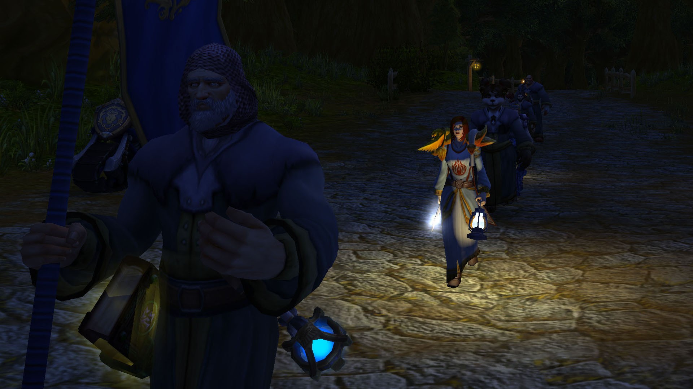

\[格林威治主教]: 走吧

\[格林威治主教]: 看看今晚能不能抵达格兰

\[格林威治主教]: 到阿莱西娅都难说

助祭维克雷斯 喝的有点晕

\[格林威治主教]: 走了

\[梅洛蒂]: 我说，要是每天都能喝酒吃饼，朝圣也不错

\[格林威治主教]: 没看见那个储备粮吗

\[格林威治主教]: 我们都还没离开艾尔文的国界

\[格林威治主教]: 离格兰公国都远着呢

\[梅洛蒂]: 储备粮吃完了怎么办、

\[格林威治主教]: 今晚看看能不能到格兰公国的国境线

\[艾莎丶墨竹]: 出发!

\[格林威治主教]: 格兰公国也是我还是世俗领主时候的封地

\[格林威治主教]: 现在我不是世俗领主了

\[梅洛蒂]: 那相比有宴席和礼物等着我们

\[格林威治主教]: 跟上

助祭维克雷斯 感觉现在的路虽然比较硌脚，但是还能忍受

\[助祭维克雷斯]: 为什么用不了啊

\[助祭维克雷斯]: 喝不了啊

\[格林威治主教]: 蜡烛定在脑袋上

\[格林威治主教]: 就不会黑了

\[格林威治主教]: 队伍排好

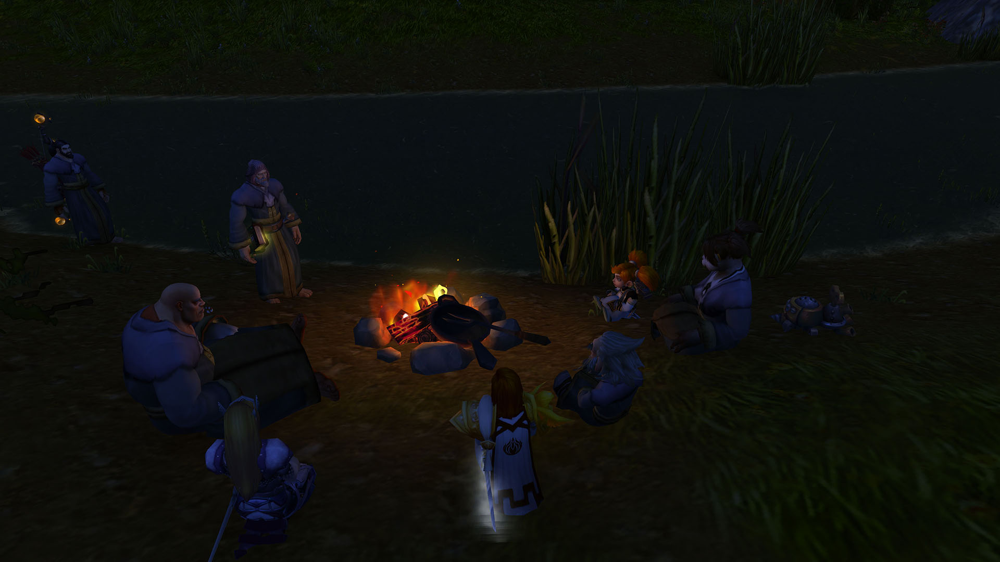

\[格林威治主教]: 我们现在到布莱克瓦尔德了

\[格林威治主教]: 曾经

\[格林威治主教]: 在这个地方

\[格林威治主教]: 阿拉希帝国最后的皇帝

\[格林威治主教]: 洛萨皇帝

\[格林威治主教]: 在这里与艾尔文至高王

\[格林威治主教]: 以及

\[格林威治主教]: 马塔尔的骑士王

\[格林威治主教]: 在这里决战

\[格林威治主教]: 李德骑士和甲胄骑兵

\[格林威治主教]: 都被阿拉希的骑士给击败了

\[格林威治主教]: 再往前走

\[格林威治主教]: 就进入格兰国界了

\[格林威治主教]: 只要经过伊索而德河

\[格林威治主教]: 伊索尔德河到了后

\[格林威治主教]: 就到格兰了

\[格林威治主教]: 当然我不确定今天是否会有宴会

\[格林威治主教]: 因为我没告诉仆人，我今天要回格兰

\[格林威治主教]: 啊

\[格林威治主教]: 伊索尔德河到了

\[格林威治主教]: 都过来

\[梅洛蒂]: 太好了

\[格林威治主教]: 过了伊索尔德河

\[格林威治主教]: 我们就进入格兰公国了

\[格林威治主教]: 休整一下

\[梅洛蒂]: 我们有什么要注意的么

\[格林威治主教]: 都过来休息下

艾莎丶墨竹 掏出了一个便当盒，吃了起来。

助祭维克雷斯开始吃东西。

\[格林威治主教]: 伊索尔德

\[格林威治主教]: 是艾尔文最漂亮的女人

\[艾莎丶墨竹]: 布鲁 你的头发又长了

\[格林威治主教]: 她的头发

\[格林威治主教]: 如金色

\[格林威治主教]: 就像天上的晚霞

\[格林威治主教]: 他是第一任艾尔文至高王的女儿

艾莎丶墨竹 把手靠近火堆取暖

\[格林威治主教]: 第一任至高王叫康·马克·图彼得

\[格林威治主教]: 他有一个侄儿，叫做

艾莎丶墨竹真心地向奈子表示问候。

\[格林威治主教]: 特里斯坦

\[奈子]: 嗯，大家好\*小声\*

\[格林威治主教]: 和伊索尔德一起长大

布鲁丶海德林 拍拍口袋里的饼干拿出一块放在手心塞进嘴巴

艾莎丶墨竹对奈子点了点头。

\[格林威治主教]: 伊索尔德年芳16

\[格林威治主教]: 特里斯坦20

\[格林威治主教]: 两人青梅竹马

\[格林威治主教]: 如果没有意外

\[格林威治主教]: 那么他们成婚那是必然

\[格林威治主教]: 但是

\[格林威治主教]: 阿拉索人来了

\[艾莎丶墨竹]: 为什么现在的阿拉索联军没落了

艾莎丶墨竹正在向格林威治主教提问。

\[格林威治主教]: 那个可恶的马塔尔王尼基弗鲁斯

\[格林威治主教]: 他收买了阿拉索人

\[格林威治主教]: 把格温内德的大湖区

\[格林威治主教]: 卖给了阿拉索人

奈子 靠近熊猫人感觉好舒服

\[格林威治主教]: 阿拉索人在大湖对岸建立城市

\[格林威治主教]: 康·马克知道对方肯定会来打击自己

\[格林威治主教]: 因此派出斟酒人帕林

奈子正在咀嚼爆米花。

\[格林威治主教]: 与阿拉索人谈判

\[格林威治主教]: 答应将伊索尔德嫁给他

助祭维克雷斯 四处张望

\[格林威治主教]: 但是特里斯坦，却不甘接受命运

\[格林威治主教]: 他在石碑湖婚礼上

\[格林威治主教]: 劫走伊索尔德

\[道恩]: 主教，那边的卫兵我认识，有些忙需要我帮下，马上回来\*小声\*

\[格林威治主教]: 当然

助祭维克雷斯 四处张望，想起了往昔的鱼人声音

\[格林威治主教]: 他的行为激怒了康马克

\[格林威治主教]: 康马克抓起祖先的标枪

\[格林威治主教]: 射杀自己的侄儿

奈子 左右寻找，想换个衣服

\[格林威治主教]: 但是伊索尔德却挡了上去

\[格林威治主教]: 伊索尔德的献血流出

\[艾莎丶墨竹]: 噢 石碑湖 传说那个地方有一个美丽的爱情故事

\[格林威治主教]: 流进了这条河

\[格林威治主教]: 随后她的身体也掉进了这条河中

\[格林威治主教]: 特里斯坦看见爱人去世

\[格林威治主教]: 也跳入了河中

\[格林威治主教]: 拔出扎中爱人的标枪

\[格林威治主教]: 插入了自己的身体

\[格林威治主教]: 而康马克的祖传神器

\[格林威治主教]: 达努之枪

\[格林威治主教]: 也消失在了这条河中

\[格林威治主教]: 无数打捞者

\[格林威治主教]: 都没找到

\[梅洛蒂]: 它真的存在么

\[格林威治主教]: 有人说是，成为了伊索尔德与特里斯坦婚礼的嫁妆

\[格林威治主教]: 有人说，当遇到私奔的恋人时

\[格林威治主教]: 伊索尔德会从河里现身

\[格林威治主教]: 祝福那对恋人

\[格林威治主教]: 来，把水壶灌满

\[格林威治主教]: 我们要走了

格林威治主教跪了下来。

艾莎丶墨竹 拿出水壶灌水

奈子跪了下来。

法瑞雅 将水壶灌满

奈子 装了一瓶子水

助祭维克雷斯 感到腿麻了

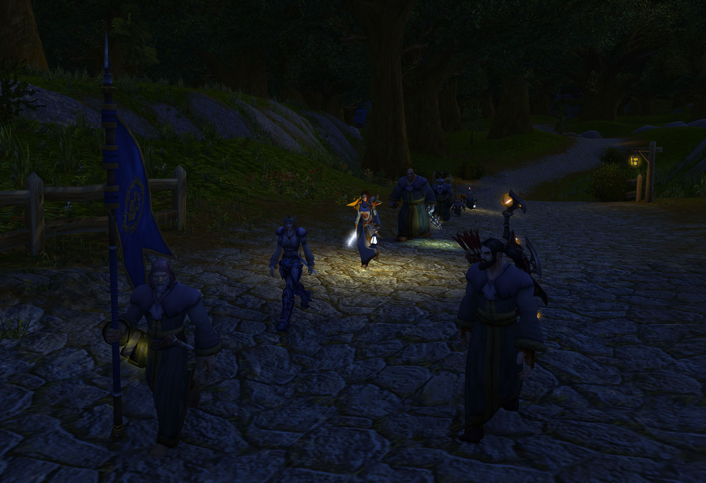

\[格林威治主教]: 现在

\[奈子]: 走

\[格林威治主教]: 我们进入格兰公国

\[格林威治主教]: 接下来

\[格林威治主教]: 将十分安全

\[格林威治主教]: 因为是我的土地

\[梅洛蒂]: 但愿如此

\[格林威治主教]: 我们只有过了阿莱西娅后

\[格林威治主教]: 才有可能有危险

艾莎丶墨竹 看着周围漆黑的森林，不免害怕起来。

奈子 感觉自己也需要一个灯

助祭维克雷斯 圣光护佑着我们

\[格林威治主教]: 觉得黑可以把蜡烛定在脑门上

奈子 才想起来，落家了

\[格林威治主教]: 道恩

\[格林威治主教]: 到前来

\[格林威治主教]: 道恩

\[格林威治主教]: 到前面来

\[格林威治主教]: 走前面

\[格林威治主教]: 你之前问到

奈子 紧紧抓着熊猫人的大尾巴

\[格林威治主教]: 教会的卫队制度吗

\[道恩]: 是的，主教

\[格林威治主教]: 教会圣骑士

\[格林威治主教]: 必须从修士中选拔

\[格林威治主教]: 这个很无奈

艾莎丶墨竹 感觉热乎乎的小手抓着自己

\[格林威治主教]: 但是还有另一个方法

\[格林威治主教]: 就是成为教堂卫队

道恩 静静地听着

\[道恩]: 有什么条件吗？

\[格林威治主教]: 但是也必须经过晋升才可以

道恩 点点头

\[格林威治主教]: 教堂卫队不需要你是骑士

\[格林威治主教]: 当你在教会中达到一定的威望

\[格林威治主教]: 就会晋升

\[道恩]: 明白

\[格林威治主教]: 卫队之后是铁甲圣骑兵

\[格林威治主教]: 你就能够获得封地了

奈子 消的转头让布鲁看远处的狼

\[格林威治主教]: 成为教会的封建骑士

\[格林威治主教]: 享有和王国骑士一样的待遇

\[格林威治主教]: 嗯

艾莎丶墨竹指着觅食的灰狼。

\[格林威治主教]: 我们马上到格兰边境了

\[道恩]: 那倒是不错

\[艾莎丶墨竹]: 小奈子 有大灰狼\*小声\*

\[格林威治主教]: 前面就是阿莱西娅城堡了

奈子 紧紧闭上了眼

布鲁丶海德林 看着自己被拉长的影子挺起了胸膛

\[道恩]: 不过我有些个人想法，等安定下来，主教我在和你汇报

\[格林威治主教]: 各位

\[格林威治主教]: 现在

\[格林威治主教]: 我们进入阿莱西亚城堡

奈子 微微看了看周围

\[布鲁丶海德林]: 嘿我听到了

\[格林威治主教]: 从这下去

\[格林威治主教]: 是巨魔桥

艾莎丶墨竹指着巨型血牙野猪。

\[格林威治主教]: 来

\[格林威治主教]: 我们上去吧

\[格林威治主教]: 阿莱西亚城堡

\[格林威治主教]: 是一个防御性的

\[艾莎丶墨竹]: 好高

\[格林威治主教]: 哨塔式堡垒

\[格林威治主教]: 空间面积不大

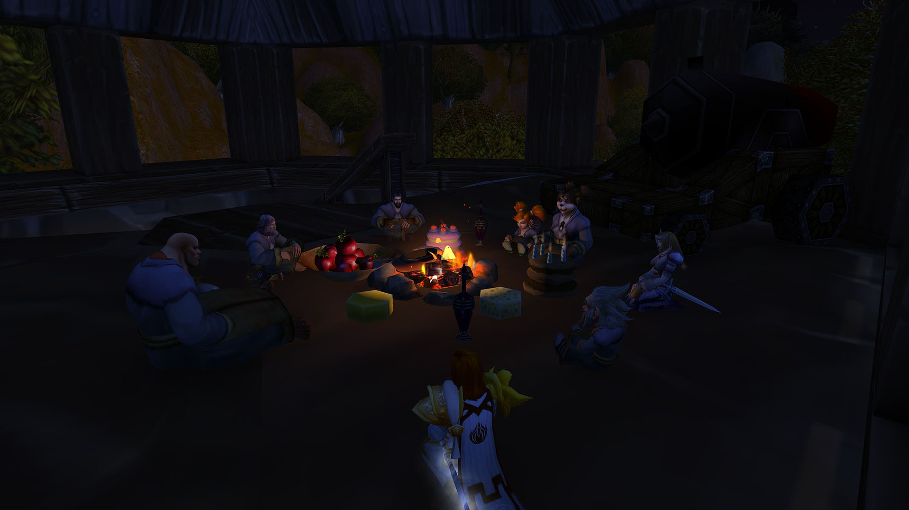

\[格林威治主教]: 坐

艾莎丶墨竹 开玩笑的假装推奈子

21:37:57 奈子 再也不敢去边上了

\[格林威治主教]: 不需要警戒

\[道恩]: 我靠一会就好

\[格林威治主教]: 这两门大炮

奈子 翻找打火石

\[格林威治主教]: 是当年

\[艾莎丶墨竹]: 他们是怎么把这些重型火炮运上来的

\[格林威治主教]: 花费了许多人力

\[格林威治主教]: 开宴会了

\[格林威治主教]: 都过来

\[格林威治主教]: 围绕火堆

\[艾莎丶墨竹]: 小奈子 烤乳酪

奈子 把手升到火堆边

\[奈子]: 嗯嗯，

\[奈子]: 味道好吸了

\[艾莎丶墨竹]: 看来教会最近的伙食不错\*小声\*

格林威治主教准备了一桌焦糖鱼宴！

格林威治主教准备了超甜鱼宴！

格林威治主教准备了一桌焦糖鱼宴！

\[格林威治主教]: 这是我们旅途最好的一顿了

\[艾莎丶墨竹]: 小奈子 少喝点酒 一会还要赶路 我可不背你

\[格林威治主教]: 接下来

布鲁丶海德林 张开口袋把\[巧克力饼切片]塞进去一半

\[格林威治主教]: 就没这些了

奈子 点了点头

\[格林威治主教]: 不赶路了

\[格林威治主教]: 今日就在阿莱西亚城堡住下

艾莎丶墨竹对格林威治主教点了点头。

梅洛蒂点了点头。

奈子 开始范晕。。。

\[法瑞雅]: 这里看起来挺安全。

\[布鲁丶海德林]: 明智的决定

\[格林威治主教]: 阿莱西亚城堡

\[格林威治主教]: 在历史上

\[格林威治主教]: 是格温内德的分水岭

\[格林威治主教]: 格兰被称之为西南格温内德

\[格林威治主教]: 止水是中央格温内德

\[格林威治主教]: 中格温内德

\[格林威治主教]: 马塔尔为北格温内德

\[格林威治主教]: 一个区域分为三份

\[格林威治主教]: 原本格温内德更大

\[格林威治主教]: 我们今天说的格温内德

\[格林威治主教]: 都是南格温内德

\[格林威治主教]: 北格温内德已经不复存在了

\[格林威治主教]: 北格温内德曾经叫做青绿之地

\[格林威治主教]: 但是邪恶的矮人王安威马尔

艾莎丶墨竹 盯着面前的火堆，越发的入神了。

\[格林威治主教]: 入侵了那里

奈子 感觉有点冷

\[格林威治主教]: 格温内德先王

\[格林威治主教]: 拉格纳罗斯在绝望中把自己灵魂卖给魔鬼

\[格林威治主教]: 打击他的敌人

\[格林威治主教]: 他献祭了自己的儿子

\[格林威治主教]: 然后他的战锤长出了尖刺

奈子 哇哦\*小声\*

\[格林威治主教]: 慢慢的他被火焰吞噬

\[格林威治主教]: 安威马尔王驾驭战车准备击杀这败军之将时

\[格林威治主教]: 火焰突然变成了人形

\[格林威治主教]: 一锤子将安威马尔的战车打飞出去

\[格林威治主教]: 然后一个巨大的火焰龙卷风出现

\[格林威治主教]: 那个巨大龙卷风挥舞着巨大的火焰战锤

艾莎丶墨竹感到非常惊讶！

\[格林威治主教]: 随后一锤砸向了地面

奈子 哇哦

\[格林威治主教]: 大地变成了喷着火焰的深渊裂谷

\[格林威治主教]: 青白山脉被震颤得喷出演讲

\[格林威治主教]: 大地上一切都被火焰的热浪席卷

\[格林威治主教]: 土地烧成了灰色

\[格林威治主教]: 岩石烧为了黑色

\[格林威治主教]: 但是南格温内德因天父之墙，抵挡北格温内德的热浪

艾莎丶墨竹感到非常惊讶！

\[格林威治主教]: 使南格温内德活了下来

\[格林威治主教]: 安威马尔重伤

\[格林威治主教]: 被矮人带走

助祭维克雷斯进入了梦乡。Zzzzzzz…

\[格林威治主教]: 不久后就死在了荒芜平原

\[格林威治主教]: 而拉格纳罗斯却看见，自己的祖国

\[格林威治主教]: 被烧毁

\[格林威治主教]: 他悲痛欲绝

\[格林威治主教]: 用头撞击最高的山脉

\[格林威治主教]: 杀死了自己

奈子 哇哦！

\[艾莎丶墨竹]: 真是疯狂

\[格林威治主教]: 但是诅咒的火焰，在高山上永久保留了下来

\[格林威治主教]: 那里就变成了今天的黑石山

艾莎丶墨竹向格林威治主教大声喝彩。真棒！

\[格林威治主教]: 而格温内德的遗民

助祭维克雷斯向格林威治主教大声喝彩。真棒！

奈子向格林威治主教大声喝彩。真棒！

\[格林威治主教]: 是拉格纳罗斯最小的儿子

\[格林威治主教]: 他在大湖的北岸建立了新格温内德帝国

\[格林威治主教]: 为什么是帝国

\[格林威治主教]: 因为他觉得自己功劳大

\[格林威治主教]: 觉得自己比格兰王国厉害

\[格林威治主教]: 哈哈，是挺厉害的

\[格林威治主教]: 阿拉索人一来就投降了

\[格林威治主教]: 好了，各位

\[艾莎丶墨竹]: 真是精彩

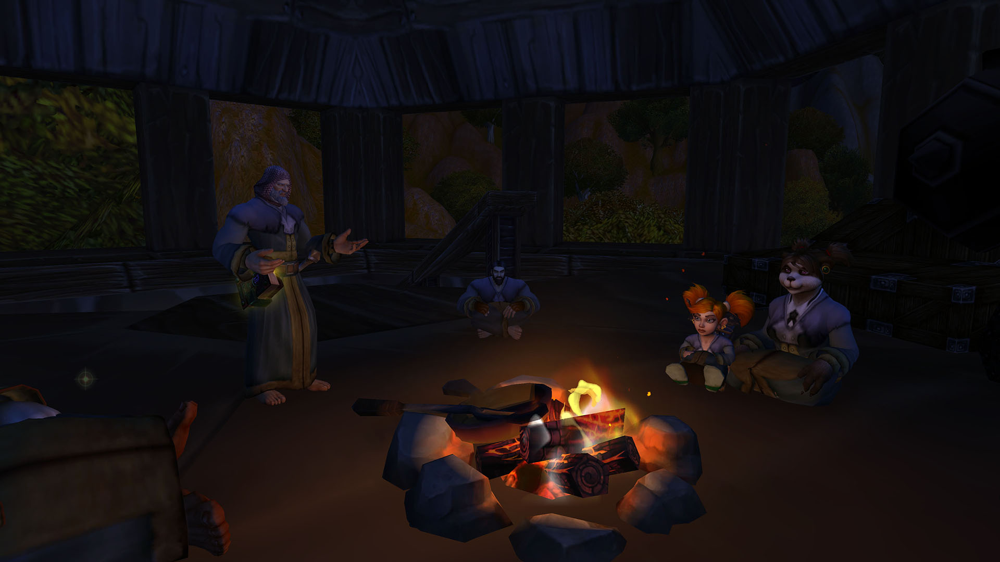

\[格林威治主教]: 明天再继续赶路吧

\[格林威治主教]: 都休息吧

\[格林威治主教]: 记得毯子盖厚点

助祭维克雷斯进入了梦乡。Zzzzzzz…

\[格林威治主教]: 阿莱西亚城没有独立的单人房间

布鲁丶海德林 找了个舒服的姿势

布鲁丶海德林进入了梦乡。Zzzzzzz…

格林威治主教进入了梦乡。Zzzzzzz…

梅洛蒂跪了下来。

你进入了梦乡。Zzzzzzz…

奈子 靠着软棉棉的艾莎睡了下来

梅洛蒂虔诚地向神祈祷。

奈子进入了梦乡。Zzzzzzz…

梅洛蒂进入了梦乡。Zzzzzzz…

艾莎丶墨竹进入了梦乡。Zzzzzzz…

奈子进入了梦乡。Zzzzzzz…

## 乌瑟尔之墓朝圣（二）

\[格林威治主教]: 走吧

\[格林威治主教]: 我们前往

\[格林威治主教]: 湖畔镇

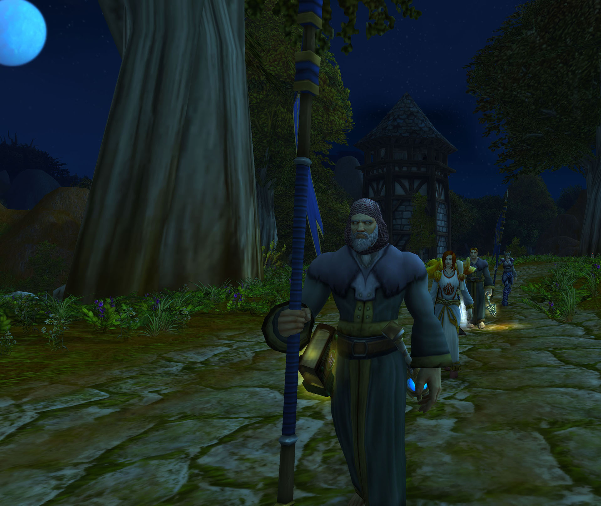

\[格林威治主教]: 出发了

\[格林威治主教]: 出发了

\[格林威治主教]: 都跟上

\[格林威治主教]: 不然会被罪恶的查尔公爵抓去卖奴隶

\[利亚姆丶穆图]: 公爵城堡的糕点还是不错的

\[梅洛蒂]: 被狼叼走了

\[利亚姆丶穆图]: 圣光保佑布鲁

\[格林威治主教]: 我们到湖畔镇

\[格林威治主教]: 买些补给品和衣服

\[格林威治主教]: 也就是头巾

\[利亚姆丶穆图]: 这石头真大啊

梅洛蒂真心地向弗纳·奥斯古表示问候。

利亚姆丶穆图向卡伦·泰勒挥手致意。

\[格林威治主教]: 自由行动

\[利亚姆丶穆图]: 进去喝一杯

\[格林威治主教]: 都到餐馆来

\[利亚姆丶穆图]: 对面发现情况

\[利亚姆丶穆图]: 有人

\[格林威治主教]: 走之前先吃点东西

\[梅洛蒂]: 是土匪吗

\[利亚姆丶穆图]: 自由之鹰

萨丽安娜放下了一辆熊猫人八宝汤面餐车！

\[斯普林丶戴尔]: 无聊的教会。

\[格林威治主教]: 朝圣者们别跟丢了

\[利亚姆丶穆图]: 无聊的佣兵

\[利亚姆丶穆图]: 好吃的

\[格林威治主教]: 朝圣者们别跟丢了

梅洛蒂 有点搞不清状况

\[格林威治主教]: 到餐馆来吃饭了

\[罗夏丶夜影]: 老板

\[格林威治主教]: 二楼

\[格林威治主教]: 随便坐

\[梅洛蒂]: 这家的主人是…？

\[格林威治主教]: 没主人

\[格林威治主教]: 这里是餐馆

\[格林威治主教]: 你没见过吗

\[梅洛蒂]: 太好了

\[格林威治主教]: 我们开个宴会吧

\[格林威治主教]: 全鱼宴会

\[格林威治主教]: 都坐

\[梅洛蒂]: 昨天吃的也是鱼，主教

\[格林威治主教]: 湖畔镇只有鱼

\[格林威治主教]: 坐这里

\[梅洛蒂]: 刚刚外面的那群人是谁?

\[格林威治主教]: 熊猫人

\[格林威治主教]: 坐那边去

\[利亚姆丶穆图]: 佣兵吧

\[利亚姆丶穆图]: 谁给钱就给谁做事

\[梅洛蒂]: 啊，我就知道

\[格林威治主教]: 坐过来

\[法瑞雅]: 缺乏信仰

\[格林威治主教]: 我去叫餐

格林威治主教准备了一桌焦糖鱼宴！

格林威治主教准备了一桌焦糖鱼宴！

格林威治主教准备了一桌焦糖鱼宴！

格林威治主教准备了一桌焦糖鱼宴！

格林威治主教准备了一桌焦糖鱼宴！

\[格林威治主教]: 都跪下

\[格林威治主教]: 让我们祈祷

艾莎丶墨竹跪了下来。

你跪了下来。

梅洛蒂跪了下来。

\[格林威治主教]: 跪下，我们是有信仰的人

\[格林威治主教]: 我们得祈祷后才能吃饭

利亚姆丶穆图跪了下来。

\[格林威治主教]: 我们的天父

\[艾莎丶墨竹]: 主教 请允许我来念悼词

\[格林威治主教]: 那好吧

\[格林威治主教]: 你来

艾莎丶墨竹向大家表示感谢。

\[艾莎丶墨竹]: 我们在天上的父

梅洛蒂虔诚地向神祈祷。

\[艾莎丶墨竹]: 愿人都尊你的名为圣

\[艾莎丶墨竹]: 愿你的国降临

布鲁丶海德林跪了下来。

\[艾莎丶墨竹]: 愿你的旨意行在地上,如同行在天上

格林威治主教准备了一桌焦糖鱼宴！

\[艾莎丶墨竹]: 我们日用的饮食

格林威治主教准备了一桌焦糖鱼宴！

格林威治主教准备了一桌焦糖鱼宴！

\[艾莎丶墨竹]: 今日赐给我们

\[艾莎丶墨竹]: 赦免我们的罪

\[艾莎丶墨竹]: 免我们的债,如同我们免了人的债

格林威治主教准备了超甜鱼宴！

格林威治主教准备了超甜鱼宴！

\[格林威治主教]: 阿门

\[艾莎丶墨竹]: 不叫我们遇见试探

\[格林威治主教]: 开吃

\[艾莎丶墨竹]: 叫我们脱离凶恶

\[梅洛蒂]: 阿门

\[艾莎丶墨竹]: 直到永远。阿门

\[艾莎丶墨竹]: 感谢神

\[利亚姆丶穆图]: 阿门

\[格林威治主教]: 抓紧时间吃东西，还要赶路

\[格林威治主教]: 抓紧时间吃

\[格林威治主教]: 还要赶路

你开始吃东西。

\[艾莎丶墨竹]: 我吃饱了

\[格林威治主教]: 都吃好了？

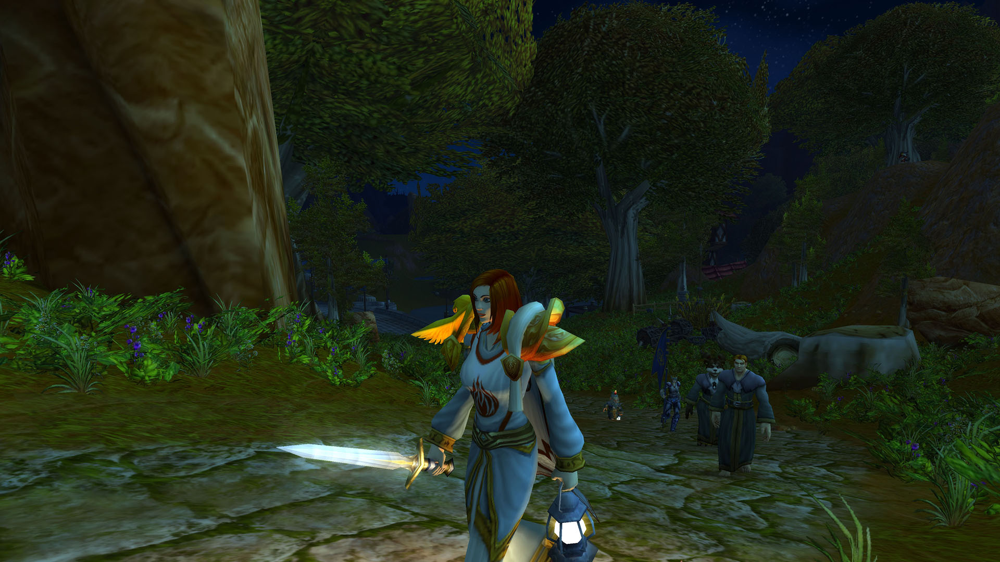

\[格林威治主教]: 朝圣者队伍们，我们要出发了

\[格林威治主教]: 拿好灯笼

\[格林威治主教]: 点燃蜡烛

\[格林威治主教]: 下一站，格纹内德

\[格林威治主教]: 排成一列队伍

\[格林威治主教]: 接下来要跟紧了

\[格林威治主教]: 无耻的查尔公爵可能在路上埋伏

\[利亚姆丶穆图]: 圣光会护佑着我们

\[格林威治主教]: 各位

\[格林威治主教]: 我们抵达

\[格林威治主教]: 玛塔尔的国土了

\[格林威治主教]: 如果走高山之路

\[格林威治主教]: 就是去玛塔尔的路程

\[格林威治主教]: 去玛塔尔的路上

\[格林威治主教]: 会经过圣瓦尔古兰山

\[格林威治主教]: 我们现在

\[格林威治主教]: 大家小心点

\[艾莎丶墨竹]: 有敌人

\[格林威治主教]: 这里有许多劫掠的库曼人

\[格林威治主教]: 他们会在两侧埋伏你

\[梅洛蒂]: 我们的驴子呢？

\[格林威治主教]: 等过了这段路

\[格林威治主教]: 到天父之墙

\[格林威治主教]: 大家就要忍耐

\[格林威治主教]: 大地的灼热了

\[法瑞雅]: 这被诅咒的土地

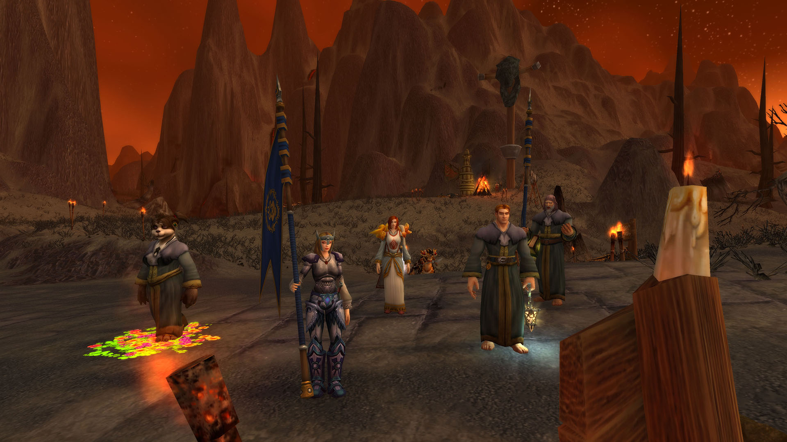

艾莎丶墨竹 似乎嗅到了不安的气息

\[格林威治主教]: 炎魔之王烧毁的土地

\[格林威治主教]: 我们进入了

\[格林威治主教]: 格纹内德的边界

\[格林威治主教]: 前面就是天父之墙

\[格林威治主教]: 各位

\[格林威治主教]: 快过来

\[格林威治主教]: 这里就是天父之墙

\[格林威治主教]: 两侧山脉

\[格林威治主教]: 垂直90度

\[格林威治主教]: 真的是一夫当关万夫莫开

\[格林威治主教]: 都小心点

\[格林威治主教]: 别掉下去了

\[艾莎丶墨竹]: 主教 有恶魔

\[格林威治主教]: 都慢点

\[梅洛蒂]: 这里的河流为什么是红的

\[艾莎丶墨竹]: 那里都是岩浆

\[格林威治主教]: 这是炎魔拉格纳罗斯的血液

\[法瑞雅]: 不需要惧怕

\[艾莎丶墨竹]: 去死把 恶魔

\[格林威治主教]: 安全了

\[格林威治主教]: 看见了前面的山脉了吗

\[艾莎丶墨竹]: 布鲁 掉队了

\[梅洛蒂]: 他旁边有个比他脑袋还大的马蜂！

\[艾莎丶墨竹]: 哈哈

\[格林威治主教]: 前面的山峰

\[格林威治主教]: 那是曾经的格纹内德要塞

\[格林威治主教]: 也叫先民铁拳

\[格林威治主教]: 都跟上

\[艾莎丶墨竹]: 天空被染成了红色

\[格林威治主教]: 那个要塞

\[格林威治主教]: 现在上面只有鬼混

\[格林威治主教]: 鬼魂

\[梅洛蒂]: 前面的山好像在流血

\[格林威治主教]: 拉格纳罗斯

\[艾莎丶墨竹]: 瞧 龙人

\[格林威治主教]: 当年就是在这座山上

\[艾莎丶墨竹]: 还有灰狼

\[格林威治主教]: 他就是在这里

\[格林威治主教]: 被矮人大军包围

\[格林威治主教]: 在这里献祭了自己的七个儿子

\[格林威治主教]: 告示牌都劝人们不要进去寻宝

\[格林威治主教]: 那些古代幽灵

\[格林威治主教]: 在里面漫游呢

\[格林威治主教]: 接着走

\[格林威治主教]: 看

\[格林威治主教]: 还能看见曾经古老的城墙

\[梅洛蒂]: 好热啊

\[艾莎丶墨竹]: 是啊

\[格林威治主教]: 看来

\[格林威治主教]: 前几天

\[格林威治主教]: 滑坡了

\[格林威治主教]: 城墙都花落到这里来了

\[格林威治主教]: 可以想象

\[格林威治主教]: 古代先民

\[格林威治主教]: 在这里的惨烈

\[艾莎丶墨竹]: 瞧 一座墓碑

\[格林威治主教]: 这个祭坛

\[梅洛蒂]: 这是谁的坟墓

\[格林威治主教]: 是曾经的古代德鲁伊祭坛

\[格林威治主教]: 是活人献祭的地方

\[艾莎丶墨竹]: 上面还有锁链

\[格林威治主教]: 我们离开这里

\[格林威治主教]: 德鲁伊的邪恶魔法

\[格林威治主教]: 让人不敢摧毁邪恶的祭坛

\[梅洛蒂]: 我好像看见，会走路的石头

\[格林威治主教]: 大家来

梅洛蒂 赞叹主教的老骨头

\[格林威治主教]: 这里

\[格林威治主教]: 是格纹内德城市的废墟

\[梅洛蒂]: 现在里面还有人么

\[格林威治主教]: 被矮人攻陷的城市

\[格林威治主教]: 没有了

\[格林威治主教]: 据说这里被诅咒了

\[格林威治主教]: 这里是人类在北格纹内德

\[格林威治主教]: 最大的城市了

\[格林威治主教]: 南国曾经最大的城市

\[格林威治主教]: 比老暴风城还大

\[格林威治主教]: 我知道你们很想进去探险

\[格林威治主教]: 但是那里除了亡魂

\[格林威治主教]: 什么都没有

\[艾莎丶墨竹]: 这里的气味真让人窒息

\[艾莎丶墨竹]: 一股硫磺味

\[格林威治主教]: 这家旅社

\[格林威治主教]: 是黑店

\[格林威治主教]: 一般没人愿意

\[格林威治主教]: 住在这种像城堡的地方

\[艾莎丶墨竹]: 瞧 一群石头人

\[格林威治主教]: 我们到了第一个休息点

\[格林威治主教]: 铸铁镇

\[格林威治主教]: 这里是

\[格林威治主教]: 矮人王国在大火后

\[格林威治主教]: 修建的最南边的一个城镇

\[格林威治主教]: 用于与玛塔尔人交易

\[格林威治主教]: 在这里

\[格林威治主教]: 是曾经卖给南方铁器的地方

\[格林威治主教]: 以铸铁锅最为出名

\[格林威治主教]: 当海运出现后

\[格林威治主教]: 铸铁镇开始衰落

艾莎丶墨竹 越发的觉得喉咙干痒难耐

\[艾莎丶墨竹]: 主教 我想喝水

\[格林威治主教]: 从而只能为乡下卖出货物

梅洛蒂 咽了咽口水

\[格林威治主教]: 这个地方

\[格林威治主教]: 水很贵

\[格林威治主教]: 你最好有钱

\[格林威治主教]: 喝圣水就行了

艾莎丶墨竹对格林威治主教点了点头。

艾莎丶墨竹 喝下圣水

\[格林威治主教]: 面包发下去

\[艾莎丶墨竹]: 是

\[格林威治主教]: 准备出发

\[格林威治主教]: 别忘了买点纪念品锅子

\[艾莎丶墨竹]: 看 一座宏伟的雕像

\[格林威治主教]: 那是洛萨像

\[艾莎丶墨竹]: 真是英武

\[格林威治主教]: 就是被图拉杨给打死那个

\[格林威治主教]: 当然，那是喜剧

\[梅洛蒂]: 我们城市都没有这样大的雕像

\[格林威治主教]: 我觉得如果

\[格林威治主教]: 图拉杨今天如果看见莎士比亚的喜剧

\[格林威治主教]: 肯定会砍了他脑袋

艾莎丶墨竹见此情景咯咯地笑个不停。

\[梅洛蒂]: 巨人!

艾莎丶墨竹指着火腹抢掠者。

\[格林威治主教]: 看见了吗

\[格林威治主教]: 黑石山

\[格林威治主教]: 今天还在喷发

\[法瑞雅]: 很难忽略它

\[艾莎丶墨竹]: 小心 蝎子

\[梅洛蒂]: 听说山里有龙？

\[格林威治主教]: 别踩到毒蝎

\[艾莎丶墨竹]: 瞧 食人魔

\[格林威治主教]: 他们只吃熊猫人

梅洛蒂 松了口气

艾莎丶墨竹一看到毒尖蝎就害怕地退缩了。

\[艾莎丶墨竹]: 恐怖图腾

\[格林威治主教]: 矮人在黑石山修建了城市

\[格林威治主教]: 拉格纳罗斯的灵魂却不断在骚扰这群世仇

\[格林威治主教]: 我们现在进入黑石山

\[格林威治主教]: 古代矮人的遗迹

\[格林威治主教]: 这里是黑铁王国的疆土

\[格林威治主教]: 查尔公爵不敢怎么样

\[格林威治主教]: 看吧各位

\[格林威治主教]: 矮人将整个山凿空了

\[法瑞雅]: 也挖到了古老的秘密

\[格林威治主教]: 拉格纳罗斯

\[格林威治主教]: 因此诅咒着这群人

\[格林威治主教]: 他派出了魔龙

\[格林威治主教]: 人想要

\[格林威治主教]: 在去一趟矮人的城市吗

\[格林威治主教]: 如果没人想

\[格林威治主教]: 我们就要出去了

\[格林威治主教]: 有人想去吗

艾莎丶墨竹 摇了摇头

\[法瑞雅]: 出去吧

\[格林威治主教]: 我们现在进入

\[格林威治主教]: 拉格纳罗斯与安慰马尔决战的地方了

\[格林威治主教]: 传说那边的山上

\[格林威治主教]: 拉格纳罗斯的坐骑

\[格林威治主教]: 一头科多兽大小的野猪

\[格林威治主教]: 至今还活着

\[格林威治主教]: 在那边的山里

\[格林威治主教]: 等待主人回归

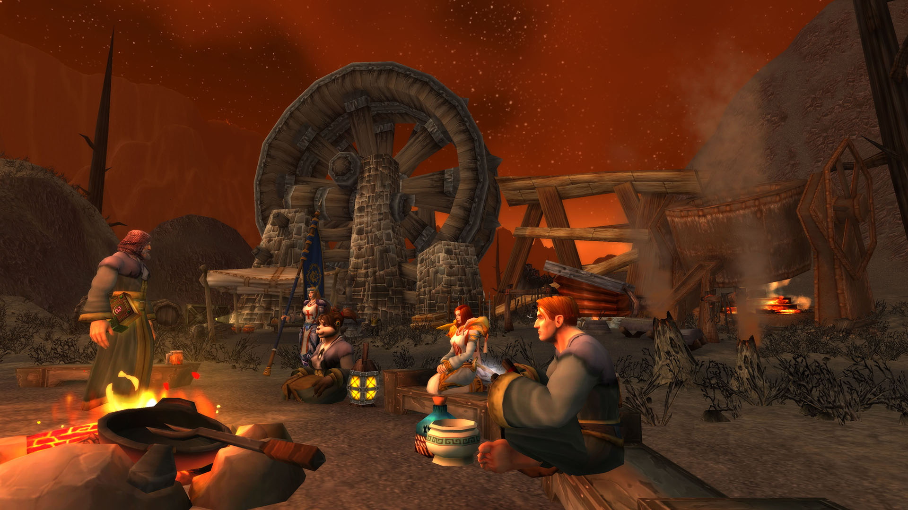

格林威治主教指向远方。

\[格林威治主教]: 小心点

\[格林威治主教]: 这座山上

\[格林威治主教]: 就是我们今天的休息点

\[格林威治主教]: 铸铁堡垒

\[格林威治主教]: 这是矮人

\[格林威治主教]: 在大火后建立的城堡

\[格林威治主教]: 索性

\[格林威治主教]: 我认识这里的领主

\[格林威治主教]: 他们也是我

\[格林威治主教]: 封地的生意伙伴

\[格林威治主教]: 看

\[格林威治主教]: 下面的大裂谷

\[格林威治主教]: 曾经拉格纳罗斯打下的

\[利亚姆丶穆图]: 不是跳下去啊

\[艾莎丶墨竹]: 这里看星空真美

\[格林威治主教]: 你最适合跳下去

\[格林威治主教]: 脑子着地

\[格林威治主教]: 那样就肝脑涂地了

\[格林威治主教]: 在这个国家

\[格林威治主教]: 领主喜欢跳舞

\[格林威治主教]: 达伦恩

\[格林威治主教]: 伦达恩

\[格林威治主教]: 就是这个城堡的领主

利亚姆丶穆图向山丘领主伦达恩鞠躬。

艾莎丶墨竹满怀敬意地向山丘领主伦达恩致礼。

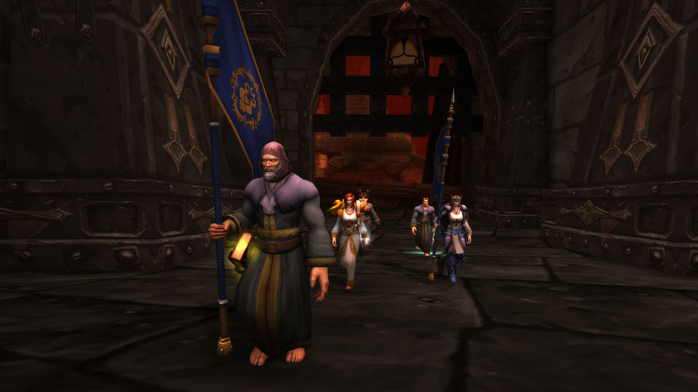

\[格林威治主教]: 就在这里休息吧

\[格林威治主教]: 休息吧各位

艾莎丶墨竹深深地打了个哈欠。

你进入了梦乡。Zzzzzzz…

\[格林威治主教]: 看来

\[格林威治主教]: 还需要两天

\[格林威治主教]: 才能离开格纹内德境内

\[艾莎丶墨竹]: 主教 我们下一站是哪

\[法瑞雅]: 路途遥远

\[格林威治主教]: 下一站

\[格林威治主教]: 是塞萨马尔

\[格林威治主教]: 中途没有任何城市

\[利亚姆丶穆图]: 好远啊

\[艾莎丶墨竹]: 哈哈

\[格林威治主教]: 也许

\[格林威治主教]: 下周能够抵达

\[艾莎丶墨竹]: 听说哪里能喝上最正宗的麦芽酒

\[艾莎丶墨竹]: 我都迫不及待了

\[艾莎丶墨竹]: 香甜的麦芽酒

## 乌瑟尔之墓朝圣（三）

\[格林威治主教]: 今天应该能够抵达塞萨马尔了

\[格林威治主教]: 坐一会儿

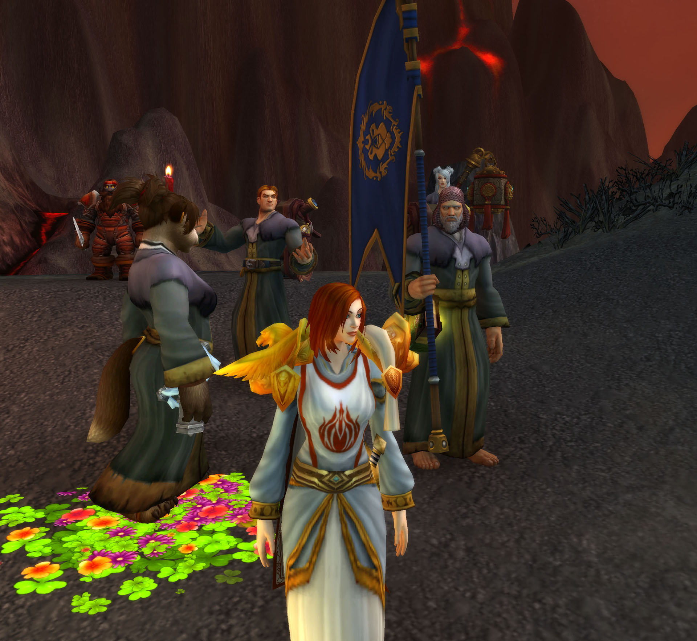

\[布鲁丶海德林]: 肉太少放回来了

\[利亚姆丶穆图]: 一身巧克力味道

\[利亚姆丶穆图]: 狼不爱吃

\[艾莎丶墨竹]: 撒冷地 开始吧

布鲁丶海德林 撸起袖子问了问

布鲁丶海德林 忍不住在手心舔了一口

\[格林威治主教]: \[弗拉斯·席比的稀世增高酒]

\[格林威治主教]: 听说喝了能长高

\[艾莎丶墨竹]: 这花真美

\[长袖]: 默认就是关闭的

\[格林威治主教]: 巧克力味道的

\[格林威治主教]: 你该试试

\[格林威治主教]: 哈哈

\[格林威治主教]: 它变成了巧克力色

布鲁丶海德林 顺着杯子倒扣在头上

利亚姆丶穆图感到很饿。也许在格林威治主教那里可以找到一些食物。

布鲁丶海德林 直勾勾看着别人手里的酒壶

长袖给了班福，班禄的幼崽一个飞吻。

长袖拥抱了班福，班禄的幼崽。

艾莎丶墨竹必须走了。

艾莎丶墨竹告诉格林威治主教说自己必须走了。

\[格林威治主教]: 出发了

\[长袖]: 我觉得有点黑

\[格林威治主教]: 都跟上

\[利亚姆丶穆图]: 矮人的营地没有虱子？太奇怪了，以前总是有虱子

\[长袖]: 好的大主教

\[格林威治主教]: 这个地方

\[格林威治主教]: 曾经是一片碧绿

\[格林威治主教]: 后来被烧成了灰烬

\[长袖]: 我好像来过这儿..又好像没有

\[格林威治主教]: 我们有两个选择

\[格林威治主教]: 直接进入塞萨马尔隧道

\[格林威治主教]: 进入帝王谷

\[格林威治主教]: 第二条路就是参观安慰马尔王的墓地

\[格林威治主教]: 就要走沙漠

\[格林威治主教]: 对了，我跟那你们说

\[格林威治主教]: 这个地方

\[长袖]: 我们可以选择一条 风景优美的路线吗

\[格林威治主教]: 有一种特殊的食物

长袖给了咸饼干船长一个飞吻。

\[格林威治主教]: 叫做土耳其鸡

长袖对着咸饼干船长吹了一声口哨。

\[格林威治主教]: 这种鸡很傻

艾莎丶墨竹看着燃灰小鸡流出了口水。

\[格林威治主教]: 傻到

\[格林威治主教]: 你能够

\[格林威治主教]: 让他自己跳进锅子里

艾莎丶墨竹大笑。

\[格林威治主教]: 这种笨鸡

\[格林威治主教]: 也叫灌木小鸡

\[长袖]: 说饿了.

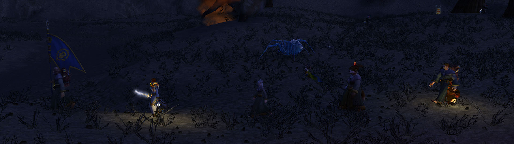

\[格林威治主教]: 各位

\[利亚姆丶穆图]: 最近的营地还有好远的

\[格林威治主教]: 我们在这里

\[格林威治主教]: 休息一下

\[格林威治主教]: 喝口水

\[格林威治主教]: 现在

艾莎丶墨竹大声喝彩。真棒！

\[格林威治主教]: 就是两条路了

\[格林威治主教]: 走这边

\[格林威治主教]: 就是进入隧道

\[格林威治主教]: 走这边

\[格林威治主教]: 就是进入沙漠

\[艾莎丶墨竹]: 好美的夜空

\[格林威治主教]: 矮人王墓地就在这边

长袖 将他的\[卡多雷风铃]举到风中。

\[利亚姆丶穆图]: 隧道可以随意通行吗

\[格林威治主教]: 走这边呢则直接进入帝王谷

布鲁丶海德林 捡起一颗石头胡乱扔了个方向

\[格林威治主教]: 你们做决定吧

\[布鲁丶海德林]: 太好了

\[布鲁丶海德林]: 往回走

\[长袖]: 我们或许可以使用\[不寻常的指南针]来决定

\[格林威治主教]: 把布鲁给扔去喂狼

艾莎丶墨竹对着布鲁丶海德林咯咯地笑个不停。

\[利亚姆丶穆图]: 27点，运气太差，我不选了

布鲁丶海德林坚决地声明，不。

\[布鲁丶海德林]: 我选上面的路

\[艾莎丶墨竹]: 你们做决定把

\[法瑞雅]: 我认为我们应该往北走

\[长袖]: 同意

\[长袖]: 指南针也是这么告诉我的

\[格林威治主教]: 大家坐下决议吧

长袖响亮地吹了一声口哨。

艾莎丶墨竹 把手靠近火堆取暖

\[格林威治主教]: 矮人大帝的墓地

\[长袖]: 人皇？

\[格林威治主教]: 就必须走右边

\[格林威治主教]: 而走左边则是帝王谷

布鲁丶海德林 从脚上把鞋子脱掉

\[艾莎丶墨竹]: 我还从来没见过矮人王的墓穴呢

\[格林威治主教]: 矮人王征服的起点

\[法瑞雅]: 那我们可以去看一下矮人王的墓地

\[格林威治主教]: 一条路通往起点，一条路通往终点

\[长袖]: 这种地方还是少去..会被诅咒的！

\[布鲁丶海德林]: 你好啊脚趾头

\[格林威治主教]: 但是最终我们都会抵达洛克莫丹

布鲁丶海德林 的脚趾头动了一下

\[气功大师罗丹]: 谁的脚,好臭啊

\[艾莎丶墨竹]: 听说矮人王有一颗神奇的宝钻

\[格林威治主教]: 那么，我们走这边吧

布鲁丶海德林 把鞋子穿上然后看着那个光脚的人

\[利亚姆丶穆图]: 矮人酿酒和熊猫人，哪个更胜一筹啊

\[格林威治主教]: 都起来

\[艾莎丶墨竹]: 出发啦

\[气功大师罗丹]: 肯定是矮人

\[长袖]: 好吧 希望下一个营地 能近一些

\[格林威治主教]: 喝口水

利亚姆丶穆图 小声嘀咕，这个食人魔吃人吗？

\[格林威治主教]: 别喝醉了

\[气功大师罗丹]: 我酒量

\[气功大师罗丹]: 很好

\[艾莎丶墨竹]: 真解渴

\[格林威治主教]: 走了

\[气功大师罗丹]: 嗝儿

\[格林威治主教]: 都跟上

\[格林威治主教]: 矮人王

\[格林威治主教]: 是一个伟大的征服者

\[格林威治主教]: 他原本是牧羊人

\[格林威治主教]: 也就是我们说的羊倌

\[格林威治主教]: 后面的人听得见吗

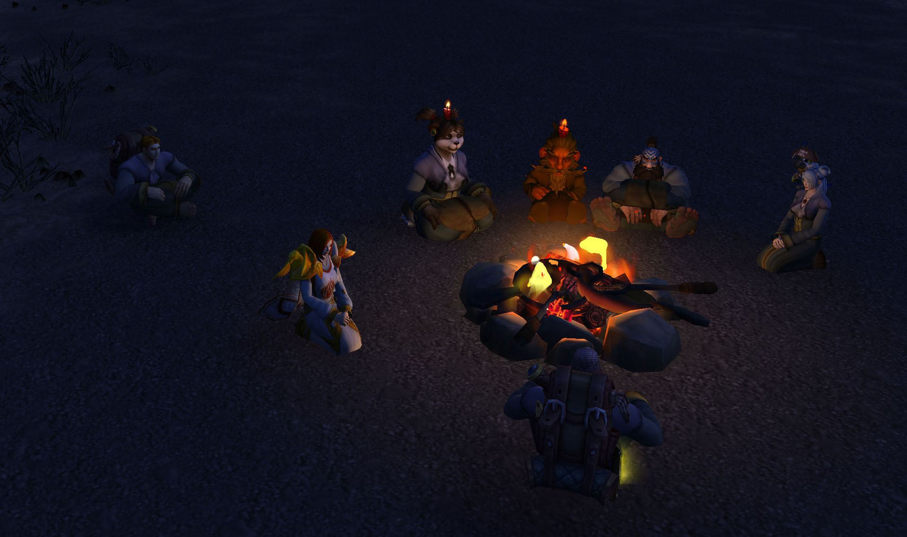

\[艾莎丶墨竹]: 这里 真热

\[艾莎丶墨竹]: 刺鼻的味道

\[格林威治主教]: 他本来只是希望自己生活过得更好

\[布鲁丶海德林]: 牛奶巧克力收到

\[格林威治主教]: 但是他却统一了矮人诸国

\[法瑞雅]: 厉害的角色

\[艾莎丶墨竹]: 这里有食人魔 布鲁\*小声\*

\[长袖]: 右边一只豹子

\[艾莎丶墨竹]: 看 一只花豹

\[长袖]: 左边一只狼

\[格林威治主教]: 这里曾经也是

\[长袖]: 哈哈哈哈 罗丹恐怕有麻烦了

\[格林威治主教]: 曾经是格纹内德

\[格林威治主教]: 的最北变

\[利亚姆丶穆图]: 小心野兽

\[格林威治主教]: 也是卡兹莫丹王国的争议之地

\[长袖]: 你在说什么 你不是野兽吗 \*笑

\[格林威治主教]: 虽然大火烧毁了

\[利亚姆丶穆图]: 也看内心

\[格林威治主教]: 旧格纹内德

\[格林威治主教]: 但是，矮人最终得到了先民的土地

\[格林威治主教]: 人类再也没有回到曾经的故土

\[长袖]: 野兽有了人性就不吃人了 人没了人性就吃人了

\[艾莎丶墨竹]: 传说 矮人 受到了泰坦的血肉诅咒

\[格林威治主教]: 矮人获得了

\[格林威治主教]: 人类的故土

\[艾莎丶墨竹]: 真是亲切

\[利亚姆丶穆图]: 这些野兽这么喜欢布鲁和罗丹的味道

\[格林威治主教]: 抵达了第一个朝圣营地

\[利亚姆丶穆图]: 我去和飞行管理员打个招呼

\[利亚姆丶穆图]: 这个我不认识

\[长袖]: 啊哦 这里也有暴风城的布告板

\[格林威治主教]: 别走远了

\[格林威治主教]: 马上要出发了

\[格林威治主教]: 出发了

\[格林威治主教]: 我们要去下一站

\[艾莎丶墨竹]: 布鲁 走啦

\[格林威治主教]: 矮人王墓

\[长袖]: 跟上了 狼人

\[利亚姆丶穆图]: 我和你一样

\[格林威治主教]: 很长一段时间

\[长袖]: 又是龙人

\[格林威治主教]: 我们不会有休息点了

布鲁丶海德林 捡起一只像巧克力的虫子放进嘴里

布鲁丶海德林 又吐了出来

\[艾莎丶墨竹]: 瞧 一只龙

\[格林威治主教]: 跟上

艾莎丶墨竹指着歼灭者卡拉然。

\[利亚姆丶穆图]: 布鲁又被打了

\[长袖]: 不.是我

\[格林威治主教]: 那边的柱子

\[利亚姆丶穆图]: 满脸巧克力吸引怪兽

\[格林威治主教]: 是曾经

\[格林威治主教]: 矮人王的祭坛

\[布鲁丶海德林]: 这些带翅膀的东西真可爱

\[格林威治主教]: 那边

格林威治主教指向远方。

\[格林威治主教]: 当年

艾莎丶墨竹向利亚姆丶穆图大声喝彩。真棒！

\[格林威治主教]: 矮人王

\[格林威治主教]: 在那里起始

\[格林威治主教]: 他在那里统一了矮人最后的城市

\[格林威治主教]: 奥丹姆

\[格林威治主教]: 呸

\[格林威治主教]: 奥达曼

布鲁丶海德林 看着前面的矮人想象着她头上有块金子做的王冠

\[格林威治主教]: 奥达曼最终也在拉格纳拉斯的一锤撕裂大地中

\[格林威治主教]: 陷入了地下

\[格林威治主教]: 走了

布鲁丶海德林 神手对着气功大师罗丹的头上虚握了一下随即将什么放在了自己的头上

\[长袖]: 哈哈哈

\[长袖]: 又显出原形了！

\[利亚姆丶穆图]: 我和你一样的

\[长袖]: 罗丹和布鲁..掉队了

\[艾莎丶墨竹]: 主教 有人掉队了

\[长袖]: 大主教！

\[格林威治主教]: 谁掉队了

\[长袖]: 看看罗丹吧

\[利亚姆丶穆图]: 他们总被狼袭击

\[长袖]: 真可怜

\[布鲁丶海德林]: 矮人王

\[格林威治主教]: 先到这里来

\[布鲁丶海德林]: 哈哈

\[格林威治主教]: 到山坡上

艾莎丶墨竹见此情景咯咯地笑个不停。

\[格林威治主教]: 全上来

\[艾莎丶墨竹]: 哈哈

\[格林威治主教]: 全部上来

\[长袖]: 不等矮人了吗

\[格林威治主教]: 出发了

艾莎丶墨竹真心地向斯坦德表示问候。

\[格林威治主教]: 这就是当年

\[长袖]: 我们教会还有年纪这么大的长者啊

\[格林威治主教]: 奥达曼沉入地下的遗迹

\[格林威治主教]: 前面就是矮人王墓了

斯坦德真心地向长袖表示问候。

\[长袖]: 额 抱歉 是骑士团的

\[艾莎丶墨竹]: 看来有不少盗墓贼

\[格林威治主教]: 我们抵达矮人王墓了

\[长袖]: 艾莎 我观察你的尾巴观察一天了

\[格林威治主教]: 这里是矮人王墓的营地

\[艾莎丶墨竹]: 讨厌

布鲁丶海德林 呼出一口气

\[格林威治主教]: 他们是在发掘古代奥丹姆城

\[利亚姆丶穆图]: 烤野猪

\[格林威治主教]: 看这边

\[格林威治主教]: 那就是古代奥达曼城

\[艾莎丶墨竹]: 真香

\[法瑞雅]: 这是一个挖掘场

\[格林威治主教]: 都过来

布鲁丶海德林 摸了一下烤野猪

\[格林威治主教]: 都过来

\[布鲁丶海德林]: 还没熟

利亚姆丶穆图 口水直流

艾莎丶墨竹 悄悄地撕了一块猪肉，装进口袋。

\[格林威治主教]: 前面就是奥达曼古城遗迹

\[艾莎丶墨竹]: 我们要进去看看吗

\[布鲁丶海德林]: 财宝

\[格林威治主教]: 矮人最大的城市

\[格林威治主教]: 但是我们不进去

\[格林威治主教]: 那里很危险

\[格林威治主教]: 来吧

\[艾莎丶墨竹]: 真是遗憾

\[长袖]: 可能矮人王喜欢

\[布鲁丶海德林]: 很多财宝

\[格林威治主教]: 我们去矮人王墓

\[格林威治主教]: 拿好灯笼

\[格林威治主教]: 点燃火把和蜡烛

\[格林威治主教]: 这里就是矮人王墓

\[格林威治主教]: 矮人第一任皇帝

\[长袖]: 嗯…我能不进去吗

\[格林威治主教]: 的墓

\[艾莎丶墨竹]: 这墓可真够隐蔽的

\[格林威治主教]: 来吧

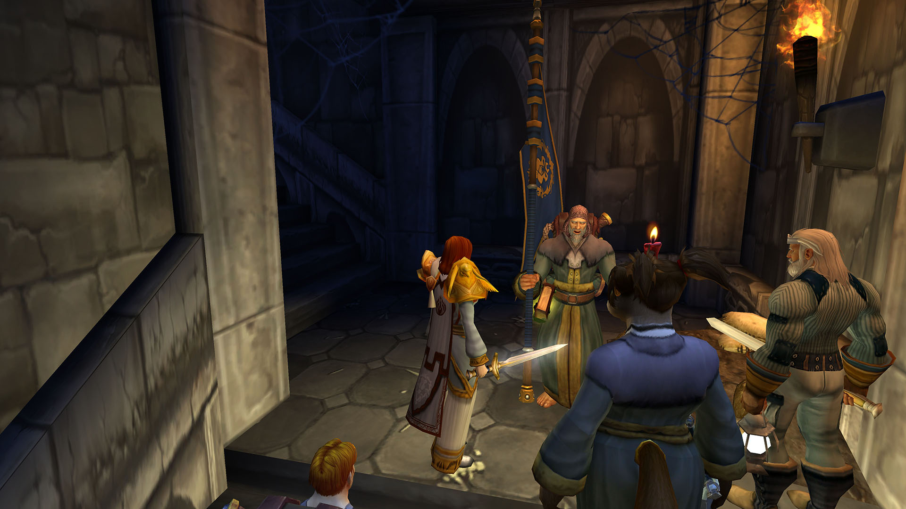

\[长袖]: 看起来很危险

\[艾莎丶墨竹]: 布鲁 小心有僵尸

艾莎丶墨竹见此情景咯咯地笑个不停。

\[长袖]: 老鼠啊

布鲁丶海德林 一把扔掉了蜡烛

\[格林威治主教]: 都下来吧

\[格林威治主教]: 传说

\[格林威治主教]: 矮人王去世后

\[长袖]: 这是什么生物

\[艾莎丶墨竹]: 好多骷髅

\[格林威治主教]: 矮人

\[艾莎丶墨竹]: 哇

\[格林威治主教]: 养了一只大蜥蜴

\[格林威治主教]: 用来守护它

\[格林威治主教]: 只要不招惹她

\[格林威治主教]: 就不会理你

\[格林威治主教]: 来吧

\[格林威治主教]: 这就是矮人王

艾莎丶墨竹立正敬礼。

\[格林威治主教]: 第一任矮人皇帝

\[格林威治主教]: 与拉格纳拉斯国王交战的人

\[艾莎丶墨竹]: 看样子 他还有好多的陪葬

\[格林威治主教]: 他手中还拿着

\[格林威治主教]: 他的宝剑

布鲁丶海德林 拿出灯笼猛砸石头做的箱子

\[长袖]: 布鲁 你在干什么 别乱动这里的东西

\[艾莎丶墨竹]: 对 生锈了的宝剑

\[格林威治主教]: 莱瓦汀

\[格林威治主教]: 走吧

\[格林威治主教]: 下一站

\[艾莎丶墨竹]: 好恐怖 我可不要近距离观察他

\[布鲁丶海德林]: 真可惜

\[艾莎丶墨竹]: 我们出去把 这里真阴森

\[布鲁丶海德林]: 就不能拿走一些纪念品吗

\[格林威治主教]: 有一个传说

\[格林威治主教]: 矮人王死前

\[利亚姆丶穆图]: 老鼠你可以拿走

艾莎丶墨竹见此情景咯咯地笑个不停。

\[格林威治主教]: 诅咒一切盗墓贼

\[长袖]: 比如 黑老鼠？布鲁你带走一只当宠物吧

\[格林威治主教]: 他们要碰了他的财报

\[格林威治主教]: 财宝

\[格林威治主教]: 就会变成干尸

布鲁丶海德林 嫌弃的吓唬身边的老鼠

\[艾莎丶墨竹]: 快走吧

布鲁丶海德林对着黑老鼠发出野兽般的狂吼。好凶啊！

\[格林威治主教]: 所以

\[格林威治主教]: 矮人王墓穴

\[格林威治主教]: 成为了朝圣的景点

\[布鲁丶海德林]: 宝贝宝贝宝贝宝贝宝贝宝贝宝贝宝贝宝贝

\[格林威治主教]: 都跟上

\[艾莎丶墨竹]: 盗墓贼

\[格林威治主教]: 排好队伍

布鲁丶海德林 盯着地上的碎片念叨着

\[布鲁丶海德林]: 宝贝宝贝宝贝宝贝宝贝宝贝宝贝宝贝宝贝

\[利亚姆丶穆图]: 又有狼出没

\[利亚姆丶穆图]: 布鲁小心

布鲁丶海德林 吓得缩起了脖子

\[格林威治主教]: 走这条路我们无法看见帝王谷的宏伟雕像

\[格林威治主教]: 但是，我们可以看见古奥达曼城遗迹

\[格林威治主教]: 安危马尔时代也被称之为矮人的奥达曼古典时代

\[格林威治主教]: 在那之后

\[格林威治主教]: 大家小心了

\[格林威治主教]: 现在要穿越峡谷

\[格林威治主教]: 等到了塞萨马尔

\[格林威治主教]: 我们就举办宴会

艾莎丶墨竹大声喝彩。真棒！

\[长袖]: 好！

\[格林威治主教]: 抵达绿色之地了

\[格林威治主教]: 这里是曾经的洛克湖

\[格林威治主教]: 现在干了

\[长袖]: 艾莎 我一直想问你但是不好意思 请问你穿裙子的时候 尾巴不碍事吗

\[艾莎丶墨竹]: 我掏了个洞

\[利亚姆丶穆图]: 你总盯着艾莎的屁股干嘛啊

\[长袖]: 那么有一天你长高了怎么办

\[艾莎丶墨竹]: 那就再掏一个

\[格林威治主教]: 我们今天一定要抵达米奈希尔港口

长袖 被艾莎丶墨竹逗笑了

\[艾莎丶墨竹]: 我们要抓紧赶路了

\[艾莎丶墨竹]: 还有好久的路程呢

\[格林威治主教]: 前面就是塞萨马尔镇了

\[格林威治主教]: 都跟上

\[格林威治主教]: 拖后腿的那几个跑起来

\[长袖]: 不是今天要举办宴会吗

\[斯坦德]: 小个子你枪法倒是不错

\[格林威治主教]: 我们到了

\[艾莎丶墨竹]: 终于到了

长袖 向豹子头林冲打了个招呼

\[艾莎丶墨竹]: 吃饭吃饭

\[艾莎丶墨竹]: 我都饿了

\[长袖]: 你就知道吃

\[长袖]: 刚才也是

\[格林威治主教]: 随便找地方坐

\[艾莎丶墨竹]: 略略略

\[格林威治主教]: 都出来

布鲁丶海德林 冲进厨房找巧克力罐头

\[格林威治主教]: 我们到外面

\[格林威治主教]: 外面吃

\[格林威治主教]: 里面太闷了

艾莎丶墨竹 撕下一块猪排 啃了起来

\[格林威治主教]: 下一次宴会

\[长袖]: 还有酒吗

\[艾莎丶墨竹]: 味道有点淡

\[长袖]: 走了一天了

\[斯坦德]: 这里有

\[艾莎丶墨竹]: 布鲁 快吃呀

\[格林威治主教]: 至少今天要下山

\[艾莎丶墨竹]: 你不是嘟囔这 要吃猪排

\[豹子头林冲]: 哈哈

艾莎丶墨竹打了个响亮的嗝。

\[豹子头林冲]: 猪排可还行

\[艾莎丶墨竹]: 我吃饱了

\[格林威治主教]: 快吃 ……嗝儿！

\[格林威治主教]: 吃完要赶路了

\[利亚姆丶穆图]: 这个蹭吃蹭喝的熊猫人是谁啊

\[长袖]: 你是不是吃多了

\[格林威治主教]: 我收到消息

\[格林威治主教]: 邪恶的查尔公爵

豹子头林冲 从口袋里拿出一个饭盒

艾莎丶墨竹对着豹子头林冲咯咯地笑个不停。

\[豹子头林冲]: 打点回去吃

\[格林威治主教]: 已经开始出兵追赶我们了

\[艾莎丶墨竹]: 真的吗 主教 我们有麻烦了？

\[长袖]: 你是要去守山神庙吗

\[格林威治主教]: 他可是杀人不眨眼的东西

\[斯坦德]: 查尔？他不是被关起来了吗？

豹子头林冲对长袖点了点头。

\[格林威治主教]: 他又跑回了封地

\[艾莎丶墨竹]: 这可如何是好

\[格林威治主教]: 然后又在袭击朝圣者

\[格林威治主教]: 为了报复教会

\[艾莎丶墨竹]: 我们没有卫队

\[格林威治主教]: 我们必须加快步伐

\[长袖]: 一会赶路我走中间

\[斯坦德]: 难怪最近圣墓那边的补给断了

\[格林威治主教]: 早日度过萨尔多瓦大桥

\[艾莎丶墨竹]: 快走把 希望能逃离魔爪

\[格林威治主教]: 在查尔公爵之前抵达斯坦布莱恩

\[格林威治主教]: 出发了

\[格林威治主教]: 后面的跟上

\[斯坦德]: 小个子呢？

\[艾莎丶墨竹]: 布鲁 又走丢了

\[斯坦德]: 又？

\[艾莎丶墨竹]: 他经常迷失

\[斯坦德]: 看来这次他跟上了

斯坦德 念动一串咒语，一束奥能倾泻而下，在布鲁丶海德林的身上镀上了一层淡淡的银光

\[艾莎丶墨竹]: 好多堡垒

\[斯坦德]: 矮人风格

\[斯坦德]: 还有很多山洞

\[长袖]: 左边是哪里

\[艾莎丶墨竹]: 矮人的工匠真是强大

\[斯坦德]: 你看这些旗帜

\[斯坦德]: 是铁炉堡的旗帜

\[格林威治主教]: 我们现在要下山了

\[艾莎丶墨竹]: 钻山洞

\[布鲁丶海德林]: 宝贝宝贝宝贝宝贝宝贝宝贝

\[利亚姆丶穆图]: 布鲁受到了影响

艾莎丶墨竹见此情景咯咯地笑个不停。

布鲁丶海德林 数着自己的背包里可以装多少财宝

\[长袖]: 被诅咒了吗

\[艾莎丶墨竹]: 失心疯了要

\[斯坦德]: 怕是要变成钻石了

布鲁丶海德林 兴奋的举起3个指头

\[利亚姆丶穆图]: 好远啊

\[利亚姆丶穆图]: 这隧道

\[利亚姆丶穆图]: 真是奇迹

\[斯坦德]: 相比从暴风城到铁炉堡的隧道来说

布鲁丶海德林 看了看周围又悄悄放下手

\[斯坦德]: 这个属于常规操作了

\[利亚姆丶穆图]: 听说路上会有兽人

\[斯坦德]: 还有各种沼泽生物

布鲁丶海德林 看着远处可能是矮人王的房子又高兴了起来

\[艾莎丶墨竹]: 这里的隧道

\[艾莎丶墨竹]: 有一种错觉

\[艾莎丶墨竹]: 有种向上 又是向下的感觉

\[艾莎丶墨竹]: 你发现没

\[艾莎丶墨竹]: 真是神奇

\[布鲁丶海德林]: 地底下的宝贝

\[布鲁丶海德林]: 太好了

\[格林威治主教]: 把布鲁扔下去吧

\[艾莎丶墨竹]: 哈哈

艾莎丶墨竹对着布鲁丶海德林咯咯地笑个不停。

\[利亚姆丶穆图]: 封建军事贵族

\[格林威治主教]: 大家都过来

\[格林威治主教]: 今天我们就在湖边扎营

\[长袖]: 太好了 可以坐下休息了

艾莎丶墨竹 长出了一口气

\[格林威治主教]: 明天我们要去米奈希尔港找雇佣兵保卫

\[格林威治主教]: 不然我们镇不好说能不能抵达

\[格林威治主教]: 叛国者

\[格林威治主教]: 他在伺机报复

\[格林威治主教]: 大家早点休息吧

\[利亚姆丶穆图]: 晚安

\[格林威治主教]: 明天还要去米奈希尔港

## 乌瑟尔之墓朝圣（四）

记录开始于 04/25/2021 的 20:10:53。

\[格林威治主教]: 再休息一会儿

布鲁丶海德林大声欢呼！

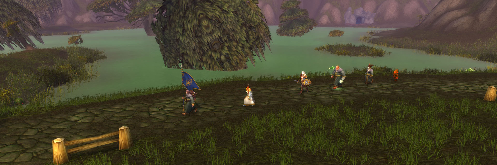

\[格林威治主教]: 翠花换衣服

\[格林威治主教]: 大家都起来

\[格林威治主教]: 我们要去米奈希尔港了

\[格林威治主教]: 都起来

\[格林威治主教]: 我们要去米奈希尔港了

\[格林威治主教]: 都跟上了

布鲁丶海德林 捂住自己的嘴巴

\[卫兵温蒂]: 那还好远

\[格林威治主教]: 跑步前行

\[卫兵温蒂]: 湿地好大啊

\[温柔先生]: 有人说话！

\[格林威治主教]: 嘘

\[格林威治主教]: 离开大路

\[格林威治主教]: 笨蛋

\[格林威治主教]: 别圣火

\[格林威治主教]: 快跑

\[格林威治主教]: 把灯都灭了

\[巫师切万顿]: 你似乎离开了你的防线

游侠巴丁对巫师切万顿点了点头。

格林威治主教显得气喘吁吁。

艾莎丶墨竹真心地向游侠巴丁表示问候。

\[巫师切万顿]: 这几位是？！

游侠巴丁真心地向格林威治主教表示问候。

\[长袖]: 可是 布鲁不管他了吗

\[长袖]: 他可能被狼叼走了

\[游侠巴丁]: 他们是教会来的

\[法瑞雅]: 两位是？

\[格林威治主教]: 我们是来自暴风城的朝圣者

艾莎丶墨竹正在向长袖提问。

\[格林威治主教]: 刚才有土匪

\[游侠巴丁]: 各位好

\[格林威治主教]: 在追杀我们

\[游侠巴丁]: 土匪！

\[游侠巴丁]: 在哪？

长袖 向巫师切万顿表示敬意

\[格林威治主教]: 我们不知道

\[巫师切万顿]: 你好 铁炉堡 铁誓军团 切万顿

\[游侠巴丁]: 竟敢在湿地放肆

\[艾莎丶墨竹]: 我们是来朝圣的僧侣

\[巫师切万顿]: 欢迎你们来到湿地

\[卫兵温蒂]: 温蒂，

\[艾莎丶墨竹]: 他们要劫掠我们

\[格林威治主教]: 感谢矮人们

巫师切万顿 下马

\[巫师切万顿]: 你们需要什么帮助

游侠巴丁对巫师切万顿点了点头。

\[法瑞雅]: 我们恐怕需要更多武装人士

\[格林威治主教]: 我们被兄弟会追杀了

艾莎丶墨竹对你点了点头。

巫师切万顿 思考着

\[格林威治主教]: 在朝圣的旅途上

\[格林威治主教]: 我们很危险

\[巫师切万顿]: 你们要到哪里去

\[格林威治主教]: 我们要去乌瑟尔之墓

\[巫师切万顿]: 你们有什么路线吗

\[长袖]: 布鲁！太好了 你还活着

\[格林威治主教]: 现在要途经矮人圣骑士铁须的墓地

\[格林威治主教]: 朝拜一下

\[布鲁丶海德林]: 是的

\[格林威治主教]: 然后再去激流堡

\[布鲁丶海德林]: 这里的野兽太不友好了

\[巫师切万顿]: 巴丁

\[布鲁丶海德林]: 看见我就想着叼回去

\[巫师切万顿]: 你还有多少子弹

\[游侠巴丁]: 我的子弹多得是

\[格林威治主教]: 如果矮人们与我们同行

\[巫师切万顿]: 如果你们要去拜见铁须大人

\[格林威治主教]: 那么我们将安全了许多

\[巫师切万顿]: 我可以带路

\[长袖]: 是呀 帮帮我们吧

\[游侠巴丁]: 是 长官

游侠巴丁满怀敬意地向巫师切万顿致礼。

巫师切万顿满怀敬意地向游侠巴丁致礼。

\[巫师切万顿]: 巴丁

\[巫师切万顿]: 带他们去见铁须大人

\[游侠巴丁]: 好

\[格林威治主教]: 感谢你们，矮人朋友

艾莎丶墨竹优雅的鞠了一躬。

\[游侠巴丁]: 不用客气

\[格林威治主教]: 我们出发吧

\[游侠巴丁]: 教会的伙计们

\[长袖]: 谢谢你们

\[卫兵温蒂]: 感谢你们

\[格林威治主教]: 我们走吧

艾莎丶墨竹点了点头。

\[格林威治主教]: 整合队伍

\[巫师切万顿]: 你们是什么组织

\[巫师切万顿]: 竟然知道铁须大人

\[格林威治主教]: 我们是暴风城的朝圣者

\[巫师切万顿]: 依我看

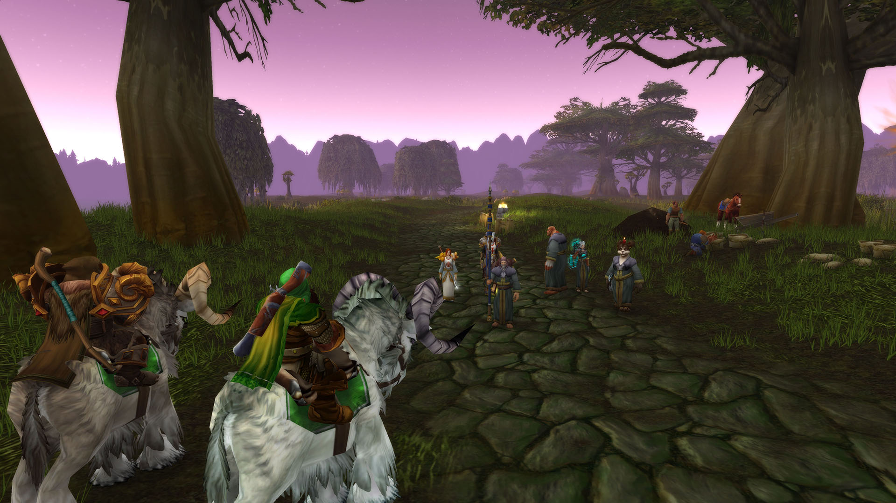

\[格林威治主教]: 我们为了这次朝圣

\[格林威治主教]: 准备了三年

\[巫师切万顿]: 没那么简单呐

\[游侠巴丁]: 真不容易啊

\[格林威治主教]: 我们打算沿途朝拜所有的圣骑士和古代君王

\[巫师切万顿]: 这么说

\[格林威治主教]: 我们之前在奥达曼古城朝拜了古代矮人大帝

\[巫师切万顿]: 你们是圣光的信徒

\[格林威治主教]: 是的

\[长袖]: 布鲁 这回有矮人保护我们了 再也不用怕野兽了

\[长袖]: 不过..你也是个矮人吧？

\[巫师切万顿]: 我曾经解读过一块泰坦石板

\[巫师切万顿]: 不知道你们是圣光的哪一脉

\[格林威治主教]: 我们是南国的大公教会

\[格林威治主教]: 也有巴斯特兰教会

\[格林威治主教]: 和月溪教会

\[格林威治主教]: 不管是哪个教会

\[巫师切万顿]: 看来你们的来历很丰富啊

\[巫师切万顿]: 哈哈

\[格林威治主教]: 我们的信徒都是

\[格林威治主教]: 热衷朝拜古代圣人

巫师切万顿 拿出\[烈性朗姆酒]喝了一口

\[法瑞雅]: 只要跟随圣光

\[格林威治主教]: 古代列王

\[格林威治主教]: 是圣光教会的教义之一

长袖对着咸饼干船长吹了一声口哨。

\[格林威治主教]: 不管是安威马尔

\[格林威治主教]: 还是拉格纳罗斯国王

\[格林威治主教]: 我们都会朝拜他们

\[游侠巴丁]: 炎魔怎么能算国王？

\[格林威治主教]: 他再变成炎魔以前

\[巫师切万顿]: 我喜欢你们都工作

巫师切万顿 拿出\[烈性朗姆酒]喝了一口

\[格林威治主教]: 也是一位伟大的君王

\[格林威治主教]: 奥拉夫之子拉格纳罗斯

\[巫师切万顿]: 就在上面

\[格林威治主教]: 这里是沼地

\[格林威治主教]: 我们不能进去

\[格林威治主教]: 都跟上

\[格林威治主教]: 不然可恶的兄弟会把我们割裂就完了

\[巫师切万顿]: 这里除了 一些植物之外

\[格林威治主教]: 出发

\[艾莎丶墨竹]: 为了教会！

\[巫师切万顿]: 有很多豺狼人

\[格林威治主教]: 奥拉夫

\[格林威治主教]: 奥拉夫国王

\[格林威治主教]: 传说中

\[格林威治主教]: 他一怒之下

\[格林威治主教]: 砸出了一个

\[格林威治主教]: 巨大的湖泊

\[格林威治主教]: 他撒了一泡尿

\[格林威治主教]: 然后那里变成了火山湖

\[格林威治主教]: 所以温泉是臭的

\[巫师切万顿]: 哈哈

\[巫师切万顿]: 伙计 你喝多了

\[巫师切万顿]: 哈哈

\[艾莎丶墨竹]: 我有种不祥的预感

巫师切万顿 拿出\[烈性朗姆酒]喝了一口

\[格林威治主教]: 拉格纳罗斯继承王位后

\[格林威治主教]: 他在裂石湖

\[巫师切万顿]: 伙计

\[格林威治主教]: 遇见了湖中仙女

\[巫师切万顿]: 你一定是喝多了

\[格林威治主教]: 阿什莉

\[巫师切万顿]: 拉格纳罗斯是火焰之王

\[格林威治主教]: 他在湖泊中投入了10箱黄金

\[格林威治主教]: 作为聘礼

\[格林威治主教]: 他建立了繁荣的王国

\[格林威治主教]: 然后直到他的死敌出现了

\[格林威治主教]: 安威马尔国王

\[格林威治主教]: 他们两个都是伟大的君王

\[格林威治主教]: 但是他们互相仇视对方

\[巫师切万顿]: 伙计

\[格林威治主教]: 安威马尔王

\[巫师切万顿]: 是安威格玛

\[格林威治主教]: 击败了拉格纳罗斯

\[格林威治主教]: 拉格纳罗斯在绝望中

\[格林威治主教]: 把灵魂卖给了恶魔

\[巫师切万顿]: 女士

\[格林威治主教]: 变成了炎魔

\[巫师切万顿]: 这位老者在说什么

\[长袖]: 温蒂 你的盔甲真的很迷人

布鲁丶海德林 把小鸟凑近自己的嘴巴说起了悄悄话

\[巫师切万顿]: 小心

\[巫师切万顿]: 巴丁

\[格林威治主教]: 都跟上

\[卫兵温蒂]: 第七军团

\[巫师切万顿]: 准备武器

\[格林威治主教]: 我们到了

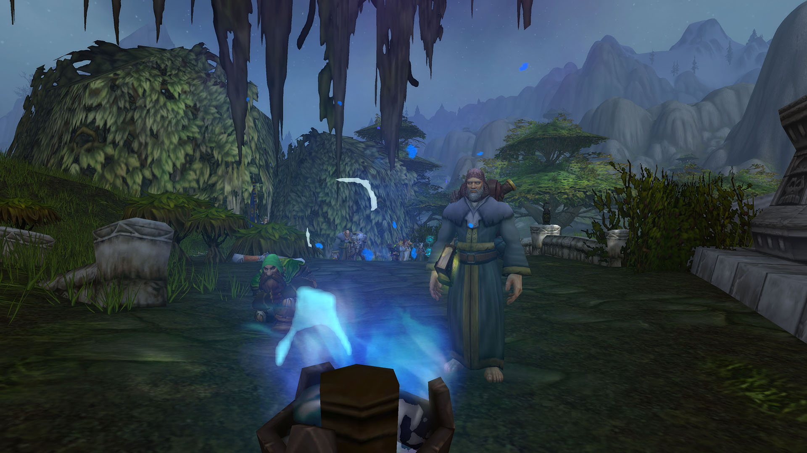

\[游侠巴丁]: 老巴丁的子弹弹无虚发

\[格林威治主教]: 铁须王的墓

\[巫师切万顿]: 等一下

\[格林威治主教]: 嗯

布鲁丶海德林 听到了墓地

\[巫师切万顿]: 几位在进去之前

\[格林威治主教]: 我们不进去

\[巫师切万顿]: 需要接受犀利

\[巫师切万顿]: 需要接受洗礼

游侠巴丁真心地向奈子表示问候。

\[格林威治主教]: 我们就在他的墓穴前焚香

奈子向游侠巴丁挥手致意。

梅洛蒂被完全搞糊涂了。

\[巫师切万顿]: 等一下

\[格林威治主教]: 他的雕像前

巫师切万顿 拿出卷轴

巫师切万顿 拿出卷轴默念咒语

助祭维克雷斯 右手自然屈曲，先点额头，再点胸膛，后点左右肩并双手合十

奈子 对巴丁的身手赞不绝口

\[巫师切万顿]: 站好了

\[格林威治主教]: 都过来

\[格林威治主教]: 跪下

格林威治主教跪了下来。

奈子在巫师切万顿面前跪下。

卫兵温蒂跪了下来。

艾莎丶墨竹跪了下来。

胡蒂尔跪了下来。

布鲁丶海德林 把水袋从包里扔了出去

长袖跪了下来。

游侠巴丁跪了下来。

巫师切万顿 拿出卷轴默念咒语

助祭维克雷斯跪了下来。

梅洛蒂疑惑地看着巫师切万顿。

\[巫师切万顿]: 好了 老者

艾莎丶墨竹见此情景咯咯地笑个不停。

\[长袖]: 布鲁 小声点 正在洗礼呢

你在梅洛蒂面前跪下。

\[巫师切万顿]: 朝圣者可以进行礼拜了

\[艾莎丶墨竹]: 布鲁又失心疯了\*小声\*

\[胡蒂尔]: 这个光，，，

卫兵温蒂 心想布鲁没救了

\[胡蒂尔]: 照的我有点不舒服

\[格林威治主教]: 不打扰铁须王陛下

\[梅洛蒂]: 刚才的老头是…?

\[格林威治主教]: 我们在他的雕像前焚香

布鲁丶海德林向周围大家祈求。好可怜啊。

布鲁丶海德林跪了下来。

游侠巴丁跪了下来。

格林威治主教 在火炉里扔了一把没药

奈子 戴上了驾驶头盔

\[游侠巴丁]: 群山赐予我们力量

\[格林威治主教]: 都去焚香

\[奈子]: 这样就不怕光晃眼了

巫师切万顿跪了下来。

助祭维克雷斯跪了下来。

胡蒂尔跪了下来。

布鲁丶海德林跪了下来。

奈子跪了下来。

艾莎丶墨竹 掏出了一根松鼠香

格林威治主教 捧起一堆土

长袖跪了下来。

艾莎丶墨竹跪了下来。

\[巫师切万顿]: 老者

格林威治主教跪了下来。

你跪了下来。

布鲁丶海德林跪了下来。

奈子跪了下来。

卫兵温蒂跪了下来。

\[格林威治主教]: 我们要把这一土

\[格林威治主教]: 要带回暴风城

\[巫师切万顿]: 我们该离开了

\[巫师切万顿]: 可以

\[格林威治主教]: 当然

奈子 跟着别人一样，抓了一把土

艾莎丶墨竹 点燃了松鼠香

\[格林威治主教]: 出发了

布鲁丶海德林 捡起小树枝拨弄着

奈子 撒到了火里

长袖 抓了两把土

\[格林威治主教]: 今天要抵达激流堡

\[梅洛蒂]: 这里没有纪念品卖？

\[胡蒂尔]: 激流堡的战事已经结束了吗

\[巫师切万顿]: 老者

\[格林威治主教]: 嗯

\[游侠巴丁]: 是的姑娘

奈子 找到了毛茸茸的尾巴，舍不得松手

\[巫师切万顿]: 我们要护送你们去萨尔多大桥

\[奈子]: 艾莎，我能一直抓着它吗？\*小声\*

\[格林威治主教]: 能护送我们到激流堡吗

艾莎丶墨竹对奈子点了点头。

\[巫师切万顿]: 抱歉

\[长袖]: 抱歉 奈子..刚看到你…我是说..额 你太矮了…哦不， 你不太能吸引别人的目光..你懂我说什么的

\[巫师切万顿]: 我不能离开

\[巫师切万顿]: 不过 巴丁可以

\[巫师切万顿]: 巴丁

\[游侠巴丁]: 长官有何吩咐

\[巫师切万顿]: 一会儿你负责带领你的小队护送我们的暴风城朋友去激流堡

奈子 回头看到了自己同款饮水机

\[游侠巴丁]: 是

奈子向胡蒂尔挥手致意。

\[巫师切万顿]: 我送到你们萨尔多大桥就要回营地了

巫师切万顿 拿出卷轴

\[艾莎丶墨竹]: 奈子 看 一只臭鼬

奈子 捂住了鼻子

艾莎丶墨竹指着山地臭鼬。

\[奈子]: 我们走快点，它的屁可臭了

\[艾莎丶墨竹]: 什么情况

\[格林威治主教]: 土匪

\[胡蒂尔]: 黑铁矮人？

\[长袖]: 他们是谁？

\[艾莎丶墨竹]: 战斗！

\[胡蒂尔]: 那么终于要动手了吗

\[奈子]: ？

\[游侠巴丁]: 为了卡兹莫丹！

\[胡蒂尔]: 这么不经打！

奈子开始为联盟欢呼！

\[格林威治主教]: 我们走

\[长袖]: 大主教呢

\[奈子]: 哇，这里好像有魔法

\[艾莎丶墨竹]: 是啊

\[莎恩丶利希尔]: 这是什么魔法

\[奈子]: 真是不错，有意思

奈子 左右看了看

奈子靠在艾莎丶墨竹的肩膀上泣不成声。

\[格林威治主教]: 都跟上

奈子 想到布鲁被分解的画面

\[胡蒂尔]: 嗨

\[胡蒂尔]: 看来他没被狼叼走

\[长袖]: 真遗憾

\[格林威治主教]: 看见前面的大树了吗

\[长袖]: 我是说 真是太好了

\[格林威治主教]: 我们在那里歇脚

\[卫兵温蒂]: 哈哈

\[格林威治主教]: 今天我们在激流堡开宴会

\[布鲁丶海德林]: 我可是很厉害的

奈子为格林威治主教而欢呼！

\[奈子]: 布鲁，你居然买的起马！说钱是从哪来的

\[胡蒂尔]: 我才是从教会的钱箱里偷的

胡蒂尔大笑。

\[胡蒂尔]: 我猜

\[格林威治主教]: 上厕所

\[格林威治主教]: 湖边放水

\[梅洛蒂]: 该死，这是水源

\[卫兵温蒂]: 这么多人，我放弃

\[莎恩丶利希尔]: 啊偶

\[法瑞雅]: 我警惕

\[布鲁丶海德林]: 它喜欢我

奈子 捂起了眼睛，讨厌

\[莎恩丶利希尔]: 苦了下游的人

\[卫兵温蒂]: 淑女

\[长袖]: 太 小 了

\[格林威治主教]: 走

亚柏临丶林歌优雅的鞠了一躬。

\[长袖]: 有人！

\[亚柏临丶林歌]: 没想到今天路上好多人！

\[艾莎丶墨竹]: 来者何人

\[亚柏临丶林歌]: 我刚刚从前面来，还有一个持枪的卡多雷兄弟站在石头上。

\[格林威治主教]: 看来是个旅行者

\[亚柏临丶林歌]: 不知道往这边在看什么！真奇怪！

奈子正在咀嚼爆米花。

\[亚柏临丶林歌]: 他站的石头还会说话！

\[格林威治主教]: 愿意和我们一起前行吗

\[亚柏临丶林歌]: 发出不同的声音！

\[亚柏临丶林歌]: 不，我得去绿色守卫者岗哨。

\[格林威治主教]: ?

\[梅洛蒂]: 啊，北方路上的故事总是这么荒谬

\[亚柏临丶林歌]: 在这里偶遇是艾露恩的指引，希望月亮母亲的光芒会继续照耀你们的道路。

亚柏临丶林歌优雅的鞠了一躬。

奈子 比了比这人的小腿和自己

\[法瑞雅]: 再会

亚柏临丶林歌向大家挥手告别。再见！

\[梅洛蒂]: 礼貌的异教徒

\[格林威治主教]: 暗夜精灵都很奇怪

\[格林威治主教]: 大概脑子受了伤

梅洛蒂赞同格林威治主教的观点。

\[长袖]: 也很可怜

艾莎丶墨竹见此情景咯咯地笑个不停。

\[游侠巴丁]: 确实这些尖耳朵

\[胡蒂尔]: 我觉得这些德鲁伊都有点神神叨叨的

\[格林威治主教]: 看那边

\[格林威治主教]: 激流堡

\[奈子]: 也，派对就在眼前了

\[长袖]: 呜呼

\[莎恩丶利希尔]: 呵，比起暴风城差多了

\[奈子]: 我想烧烤

\[游侠巴丁]: 听说已经重建了

助祭维克雷斯 右手自然屈曲，先点额头，再点胸膛，后点左右肩并双手合十

\[莱斯顿丶弗莱]: 站住！

\[长袖]: 纯好奇 我实在忍不住想问一下 布鲁和奈子..不是一对吗？

\[格林威治主教]: 什么人

\[莱斯顿丶弗莱]: 下面是什么人经过了

\[奈子]: 才不是，他那么扣

\[梅洛蒂]: 那边

\[格林威治主教]: 你们是什么人

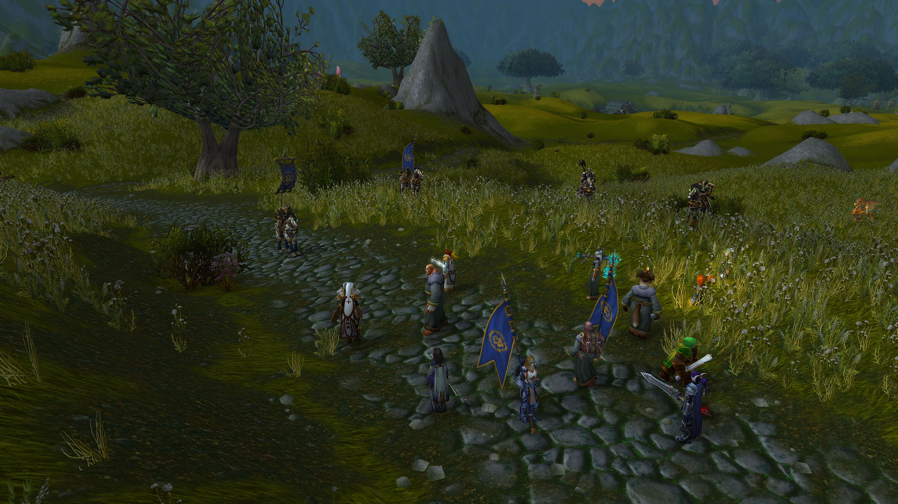

长袖 指着侍卫洛文

\[奈子]: 又爱钱

法瑞雅 手放在剑柄上

\[莱斯顿丶弗莱]: 大胆

\[艾莎丶墨竹]: 土匪！

\[莎恩丶利希尔]: 是敌人么？

\[格林威治主教]: 大概是敌人

\[莱斯顿丶弗莱]: 我乃骑士

\[艾莎丶墨竹]: 准备战斗！

\[格林威治主教]: 围成一个圈

\[格林威治主教]: 围成一个圈

\[嘉兰蒂亚]: 刚来就有情况了么?

奈子 慌乱的在身上摸刀子

艾莎丶墨竹 摆好了阵势

\[莱斯顿丶弗莱]: 冲下去，围住他们

\[格林威治主教]: 你们是什么人？

高洁者雷蒙德 满脸惊讶地盯着眼前的情形

法瑞雅 站在最前面，毫不畏惧

\[莎恩丶利希尔]: 愿圣光祝福我们

\[长袖]: 布鲁 别害怕 躲到艾莎的身后

\[法瑞雅]: 你们是什么人？

\[奈子]: 啊，他们有马，我们打不赢了\*小声\*

\[艾莎丶墨竹]: 保护主教！

\[布鲁丶海德林]: 我讨厌比我高的家伙

\[莱斯顿丶弗莱]: 你们的首领在哪

\[莱斯顿丶弗莱]: 让他出来说话

布鲁丶海德林 气的跺脚

\[格林威治主教]: 把行李堆成简易城墙

\[高洁者雷蒙德]: 等一下女士先生们，你们不能就在这里兵刃相接！

奈子靠在艾莎丶墨竹的肩膀上泣不成声。

\[嘉兰蒂亚]: 啊…这都是带了什么稀奇古怪的东西…

\[莱斯顿丶弗莱]: 这没有什么用的，老头子

高洁者雷蒙德 从道路后方靠了过去，试图接近冲突人群

\[格林威治主教]: 你是何人

\[莱斯顿丶弗莱]: 我的铁马会踏平你们的木箱

\[长袖]: 身后！

\[高洁者雷蒙德]: 请让我过去！这是一场误会！

\[奈子]: 这是我所有的钱

\[莱斯顿丶弗莱]: 我们是影月堡公爵大人麾下的骑士

\[艾莎丶墨竹]: 不行 你不是教会的人！

布鲁丶海德林 拿出水袋喝个干净一把扔在地上

\[莱斯顿丶弗莱]: 奉命来此保护我北境的商会

\[高洁者雷蒙德]: 我只是一名路过的人！

\[艾莎丶墨竹]: 不能让你接近主教

\[长袖]: 快离开这里 旅行者 这里很危险！

奈子哭了。

\[梅洛蒂]: 啊，这肮脏的口音，一听就知道是谁的走狗

\[莎恩丶利希尔]: 路过？这个时间路过很难不让人生疑啊

\[高洁者雷蒙德]: 不，不行！我听我说，事情是复杂的！

\[莱斯顿丶弗莱]: 你们是哪里来的墨猪

\[格林威治主教]: 我们是朝圣者

\[艾莎丶墨竹]: 我们不能冒险

\[高洁者雷蒙德]: 就在刚刚，在你们抵达之前，我通过与那位先生的交谈

奈子 歪着头往外看

\[高洁者雷蒙德]: 得知了这场冲突的原因！

\[长袖]: 布鲁 你快过来 你站在了来路不明的人的身后了 \*小声\*

布鲁丶海德林 拿出巧克力全部塞进嘴里

\[高洁者雷蒙德]: 我需要向主教解释这件事！

\[莱斯顿丶弗莱]: 哪里来的朝圣者

法瑞雅 握紧手中的命运之剑

\[莱斯顿丶弗莱]: 铁炉堡的矮人也来朝圣吗

\[高洁者雷蒙德]: 听我说各位，你们不能在联盟的土地上就这样兵刃相接！

\[格林威治主教]: 暴风城来的

\[游侠巴丁]: 我是奉命护卫他们的

\[艾莎丶墨竹]: 不是我们挑起事端的

\[艾莎丶墨竹]: 我们只是出于自卫

\[法瑞雅]: 骑士团保护朝圣者

\[游侠巴丁]: 你们为何要阻拦教会

\[嘉兰蒂亚]: 噢…可怜人…

\[莱斯顿丶弗莱]: 朝圣者，只怕朝圣是假

\[高洁者雷蒙德]: 我明白，正是如此我才需要向主教阁下解释此事！

\[艾莎丶墨竹]: 主教！

\[长袖]: 哦 又一个！

\[莱斯顿丶弗莱]: 你们携带武器和甲士来此掠夺财宝才是真的

\[格林威治主教]: 你看不见我们是什么人吗

\[艾莎丶墨竹]: 这个人想要解释

艾莎丶墨竹指着高洁者雷蒙德。

\[莱斯顿丶弗莱]: 骑士们

\[莱斯顿丶弗莱]: 列阵

\[高洁者雷蒙德]: 请让我过去，主教阁下，这是一场误会！

\[格林威治主教]: 都拿起武器

\[布鲁丶海德林]: 土匪流氓无耻败类

\[高洁者雷蒙德]: 我不是袭击者，只是一名知情者！

长袖 指着温柔先生

嘉兰蒂亚 捏了几下自己的手指发出轻微的咔咔声

奈子 早知道就不拿钱出来了

\[温柔先生]: 咳咳

\[长袖]: 把枪放下！

\[克劳雷丶马修]: 听着

布鲁丶海德林 翻找着自己的背包最后拿出一个包子砸了过去

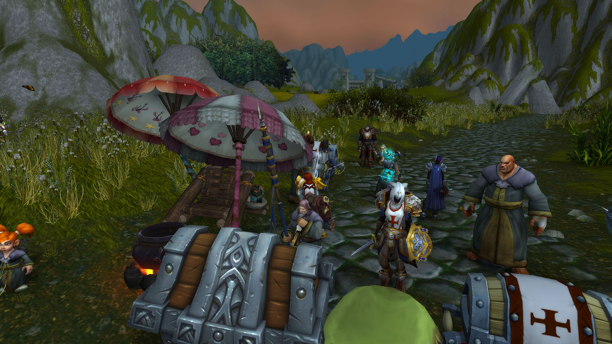

\[克劳雷丶马修]: 带路的老头

\[克劳雷丶马修]: 我给你们一次机会

\[格林威治主教]: 躲在行李后面

\[高洁者雷蒙德]: 不，先生，你们不是必须通过武力才能解决这样的问题的！

\[克劳雷丶马修]: 把武器放下，把铁甲留下

\[克劳雷丶马修]: 你们可以穿着得体的衣服空手回去

\[克劳雷丶马修]: 我们不会伤害你们

\[梅洛蒂]: 听听这是什么话

\[高洁者雷蒙德]: 我会放下武器..清你们让我进去！

\[艾莎丶墨竹]: 哼 说辞！

\[艾莎丶墨竹]: 我们不相信你们！

\[嘉兰蒂亚]: 怎么，这些人还要扒衣服?

高洁者雷蒙德 慢慢将长剑放在地上

\[法瑞雅]: 我不认为放下武器是一个好主意

\[嘉兰蒂亚]: 辛迪加吗

\[莎恩丶利希尔]: 有什么话现在说，我们会传达给主教的

\[艾莎丶墨竹]: 放下武器 我们就是鱼肉

\[莱斯顿丶弗莱]: 我现在最后给你们一次机会

\[格林威治主教]: 见鬼去吧

\[高洁者雷蒙德]: 听好了

\[莱斯顿丶弗莱]: 如果你们是朝圣，留下你们的财宝

\[高洁者雷蒙德]: 事情是这样的！

\[莱斯顿丶弗莱]: 我会派骑士送你妹去

\[莱斯顿丶弗莱]: 啊！

\[莱斯顿丶弗莱]: 骑士们！

\[格林威治主教]: 列阵

\[法瑞雅]: 我们哪有财宝

\[莱斯顿丶弗莱]: 进攻！

\[格林威治主教]: 靠拢

\[高洁者雷蒙德]: 在你们面前的那个人，是影月堡的领主，查尔德修斯先生

\[奈子]: 这么说，钱还是要给啊

布鲁丶海德林 看着自己手里的油灯想着要不要也砸过去

\[莎恩丶利希尔]: 查尔德修斯，还有昵？

\[高洁者雷蒙德]: 主教数周以前

奈子哭了。

\[艾莎丶墨竹]: 小奈子 别哭 我会保护你！

\[梅洛蒂]: 啊，我就知道，查尔大人

\[高洁者雷蒙德]: 与他在..领地问题和一些人事关系上产生了纠纷

\[奈子]: 哦

\[助祭维克雷斯]: 圣光护佑着我们

\[高洁者雷蒙德]: 查尔德修斯先生认为，他受到了冒犯！

\[高洁者雷蒙德]: 因此他才准备..该死…停下来！

\[高洁者雷蒙德]: 你们没听到我说话吗？！

\[高洁者雷蒙德]: 我说了，快点停下来！

\[莎恩丶利希尔]: 雇主，后方有人要见你，似乎说这一切是误会！！！

\[高洁者雷蒙德]: 你们在进行一场该死的毫无意义的战斗！！

\[格林威治主教]: 干掉这些土匪

\[格林威治主教]: 不要管其他人

\[莱斯顿丶弗莱]: 消灭他们

\[艾莎丶墨竹]: 杀呀！

\[奈子]: 啊布鲁，快吃点巧克力啊

\[法瑞雅]: 我的剑就是我的命运

\[嘉兰蒂亚]: 土匪…啊呵呵呵….

\[莎恩丶利希尔]: 遵从你的指令，雇主

\[梅洛蒂]: 你只会抢到带血污的钱币

\[莱斯顿丶弗莱]: 这群人是真正的强盗！

奈子哭了。

\[高洁者雷蒙德]: 该死…\*翻身上马\*

\[莱斯顿丶弗莱]: 给我冲破他们的阵型

\[格林威治主教]: 快

\[游侠巴丁]: 吃我一枪

\[格林威治主教]: 冲过去

\[梅洛蒂]: 你会下地狱的

布鲁丶海德林 被奇怪的大鸟叼起飞远

\[格林威治主教]: 跑啊

\[格林威治主教]: 东西不要了

\[格林威治主教]: 快跑

\[长袖]: 布鲁！

\[艾莎丶墨竹]: 完了 布鲁被抓了

\[长袖]: 奈子会想你的！

\[奈子]: 他肯定是舍不得自己的钱

艾莎丶墨竹哭了。

\[长袖]: 你还真是了解他啊

\[奈子]: 那么多钱，他赞了很久的。

\[长袖]: 温蒂也不见了

\[长袖]: 会不会已经…

\[格林威治主教]: 上山坡

\[奈子]: 远处有大头怪！

\[格林威治主教]: 快趴下

长袖在布鲁姆·白蹄面前躺下。

艾莎丶墨竹 躲进了草丛中

长袖在布鲁姆·白蹄面前躺下。

\[奈子]: 我们就这样藏起来吧，别出去了

\[奈子]: 来的路上都没有看到人

\[艾莎丶墨竹]: 真险啊

\[奈子]: 布。。。鲁。。。啊

奈子哭了。

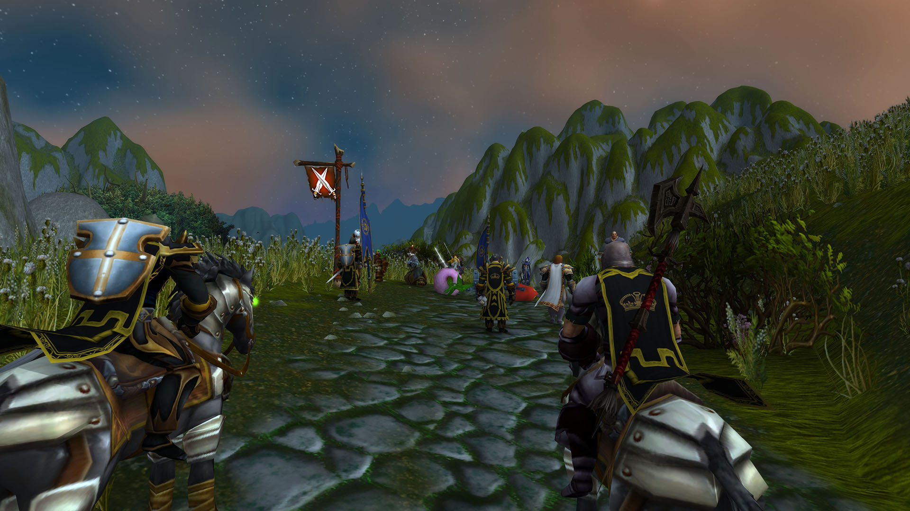

\[莎恩丶利希尔]: 刚才那些家伙到底是怎么回事

\[格林威治主教]: 那是土匪

\[法瑞雅]: 查尔的人

格林威治主教跪了下来。

游侠巴丁在安慰奈子。

\[长袖]: 别伤心奈子 你会遇见更好的

\[助祭维克雷斯]: 你们隐藏的真好

\[奈子]: 同事一场

\[助祭维克雷斯]: 我都没找到你们

\[艾莎丶墨竹]: 嘘 小点声

\[助祭维克雷斯]: 绕了一大圈吧

格林威治主教跪了下来。

\[梅洛蒂]: 就怕布鲁被抓去当奴隶了

\[格林威治主教]: 小声点

\[莎恩丶利希尔]: 快躲起来，笨蛋

\[长袖]: 温蒂！你还活着！ 太好了！

\[游侠巴丁]: 大块头藏起来

\[莎恩丶利希尔]: 趴下

\[莎恩丶利希尔]: 嘘

长袖在玄牛雕像面前躺下。

\[格林威治主教]: 蹲下

\[艾莎丶墨竹]: 快藏起来 大块头

\[艾莎丶墨竹]: 他们要搜索了

\[格林威治主教]: 他们来了

\[艾莎丶墨竹]: 瞧 他们来了\*小声\*

奈子 有种想放屁的感觉

\[格林威治主教]: 快起来

\[艾莎丶墨竹]: 我们快走把 主教

\[格林威治主教]: 快走

\[长袖]: 好险 都不敢呼吸了

\[格林威治主教]: 快走

\[格林威治主教]: 进入激流堡

\[艾莎丶墨竹]: 快跑

\[格林威治主教]: 快

\[格林威治主教]: 躲起来

\[艾莎丶墨竹]: 快 隐蔽

\[嘉兰蒂亚]: 蠢货…

\[长袖]: 哦 他们在来回巡视

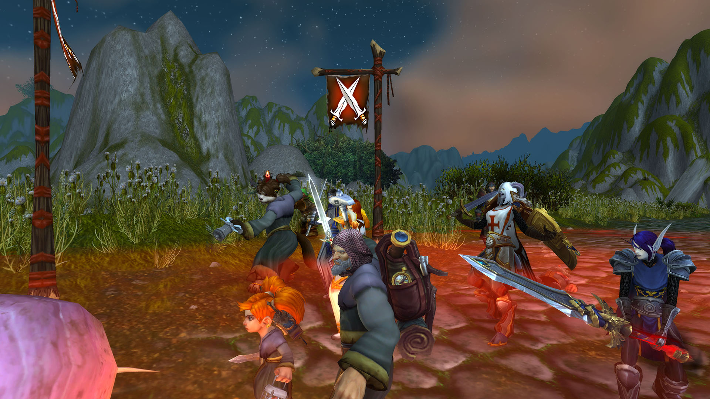

\[莎恩丶利希尔]: 这些家伙在搜寻我们么

\[艾莎丶墨竹]: 快走

\[格林威治主教]: 卧倒

\[艾莎丶墨竹]: 我可不想游泳

\[格林威治主教]: 走

\[格林威治主教]: 我们进入激流堡

\[长袖]: 我最害怕那个猎人 那把长枪看起来就吓人

\[克劳雷丶马修]: 我们继续

\[格林威治主教]: 趴下

\[格林威治主教]: 糟了

\[莎恩丶利希尔]: 他们来了！

\[克劳雷丶马修]: 站住！

\[艾莎丶墨竹]: 完了 我们被发现了

\[克劳雷丶马修]: 休想再跑了

\[格林威治主教]: 跑进城市

布鲁丶海德林 拿起饼干喂给大鸟怪

\[艾莎丶墨竹]: 快跑

奈子 拼命甩着双腿

\[格林威治主教]: 跑啊

\[格林威治主教]: 这边

\[克劳雷丶马修]: 冲锋！

\[艾莎丶墨竹]: 卫兵 救救我们

\[格林威治主教]: 进屋子

梅洛蒂干咳了几下。

\[莎恩丶利希尔]: 啊哈，进了城市他们就无法为所欲为了

\[克劳雷丶马修]: 围起来

\[嘉兰蒂亚]: 就这里…？

格林威治主教 关上门

\[嘉兰蒂亚]: 为所欲为也没人知道吧…嗯哼

\[莎恩丶利希尔]: 糟了，这下我们出不去了

\[奈子]: 这些人真气人

\[格林威治主教]: 把门堵死

\[莎恩丶利希尔]: 万一他们放火一把……

奈子靠在游侠巴丁的肩膀上泣不成声。

\[克劳雷丶马修]: 来人

布鲁丶海德林 挥手指挥着大鸟怪飞上天空

\[长袖]: 小点声 他们会听到的！

\[克劳雷丶马修]: 点火！

游侠巴丁对奈子点了点头。

\[汉斯丶卡彭]: 是

\[莎恩丶利希尔]: 糟糕，被我言中了

\[梅洛蒂]: 完了

\[奈子]: 原来你会魔法

\[游侠巴丁]: 小姑娘我是装的

\[游侠巴丁]: 哈哈

\[嘉兰蒂亚]: 啊…坐以待毙?

\[汉斯丶卡彭]: 扔火把

\[格林威治主教]: 你别想放火

\[长袖]: 这种时候就别开玩笑了！

\[莎恩丶利希尔]: 需要突围吗？雇主

奈子 给了巴丁一个白眼

\[格林威治主教]: 阿拉希公爵会要你们命的

\[克劳雷丶马修]: 快把火灭了

\[克劳雷丶马修]: 这是有领主的领地

\[艾莎丶墨竹]: 我们要死在这了

\[莎恩丶利希尔]: 愚蠢的家伙，竟然事到如今想起这里是领主的底盘

\[格林威治主教]: 阿拉希公爵来了

\[艾莎丶墨竹]: 他们要放火烧我们

\[长袖]: 也就是说 我们得救了？

\[长袖]: 啊哈\~

\[格林威治主教]: 你们完蛋了

布鲁丶海德林 把手里的油灯砸了出去

\[艾莎丶墨竹]: 感谢主上

\[克劳雷丶马修]: 上马

\[克劳雷丶马修]: 骑士们

\[嘉兰蒂亚]: 闹剧…\*低声\*

\[克劳雷丶马修]: 我们不要和领主发生冲突

\[奈子]: 我看看救星长什么样

\[莎恩丶利希尔]: 这年头土匪能大摇大摆进城了

\[艾莎丶墨竹]: 守住门口

\[克劳雷丶马修]: 走！

格林威治主教对克劳雷丶马修做了个粗鲁的手势。

\[格林威治主教]: 他们走了

\[长袖]: 啊哈 胜利！

奈子 冲对面吐着舌头

\[艾莎丶墨竹]: 我们解脱了

\[格林威治主教]: 我们安全了

\[长袖]: 今晚多喝点不过分吧

艾莎丶墨竹大声欢呼！

\[格林威治主教]: 我们先去朝拜阿拉索诸王墓

\[奈子]: 唉，从头攒钱了

\[艾莎丶墨竹]: 太好了

布鲁丶海德林响亮地吹了一声口哨。

\[奈子]: 抓住了尾巴

\[艾莎丶墨竹]: 刚才真是惊险

\[奈子]: 我的钱

奈子哭了。

\[莎恩丶利希尔]: 那群家伙，或许会在半路伏击……（喃喃）

游侠巴丁对奈子讲了个笑话。

\[奈子]: 请换个话题，我喜欢一米八的

游侠巴丁靠在奈子的肩膀上泣不成声。

\[格林威治主教]: 废物们

\[艾莎丶墨竹]: 他们被领主叫回了吗

\[莎恩丶利希尔]: 他们…真的是土匪吗？

\[格林威治主教]: 查尔公爵的废物们

\[艾莎丶墨竹]: 或许吧

\[格林威治主教]: 来杀我们啊

\[法瑞雅]: 装备精良得不像土匪

\[艾莎丶墨竹]: 反正他们不怀好意

\[长袖]: 土匪也这么守序吗

\[嘉兰蒂亚]: 真是随叫随到啊…

格林威治主教在嘲笑克劳雷丶马修。

\[克劳雷丶马修]: 你们怎么敢

\[莎恩丶利希尔]: 似乎雇主没有对我们说实话

\[游侠巴丁]: 土匪可不会脸上写着土匪

布鲁丶海德林 掏出最后一块巧克力饼干摆成两半喂给大怪鸟

\[克劳雷丶马修]: 你们一定会被杀的，我发誓

\[格林威治主教]: 朝他扔烂水果

长袖像母鸡一样扇动着双臂，绕着克劳雷丶马修咯咯咯地叫！

布鲁丶海德林向白棕先生挥手告别。再见！

\[克劳雷丶马修]: 你们死定了

格林威治主教对克劳雷丶马修做了个粗鲁的手势。

\[克劳雷丶马修]: 我们走

艾莎丶墨竹 做了个鬼脸

\[莎恩丶利希尔]: 真是贼心不死

\[长袖]: 布鲁竟然跳上来了

艾莎丶墨竹像母鸡一样扇动着双臂，绕着圈子咯咯咯地叫！

\[莎恩丶利希尔]: 口出狂言

格林威治主教像母鸡一样扇动着双臂，绕着克劳雷丶马修咯咯咯地叫！

长袖像母鸡一样扇动着双臂，绕着克劳雷丶马修咯咯咯地叫！

\[格林威治主教]: 哈哈

\[嘉兰蒂亚]: 真乖…

\[格林威治主教]: 我们开宴会

\[艾莎丶墨竹]: 坏蛋跑咯！

游侠巴丁像母鸡一样扇动着双臂，绕着小型虚空行者咯咯咯地叫！

\[长袖]: 宴会！宴会！宴会！

\[艾莎丶墨竹]: 我可要好好的喝一杯

\[游侠巴丁]: 哈哈

\[格林威治主教]: 我们今天住这里

\[格林威治主教]: 住在圣殿

艾莎丶墨竹大声喝彩。真棒！

\[莎恩丶利希尔]: 这种破破烂烂的地方吗？

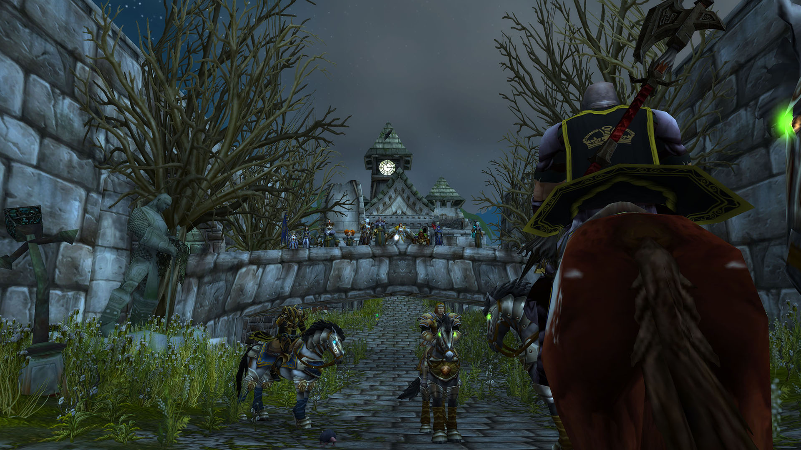

\[嘉兰蒂亚]: 真是豪华…

\[格林威治主教]: 并排坐

\[奈子]: 这，是圣殿？

\[格林威治主教]: 都进来坐下

奈子 用手指摸着灰

\[格林威治主教]: 坐近点

\[游侠巴丁]: 无所谓我在森林都住过

\[格林威治主教]: 都坐下

\[格林威治主教]: 做成一排

\[格林威治主教]: 这一

\[格林威治主教]: 这样

格林威治主教烹制了大型筵席！

格林威治主教烹制了大型筵席！

\[艾莎丶墨竹]: 烤猪！

\[奈子]: 哇哈哈

\[长袖]: 艾莎的最爱

\[游侠巴丁]: 啊 哈真不错

\[长袖]: 蛋糕！

\[长袖]: 这是我的最爱

\[奈子]: 我更喜欢糕点，哈哈

艾莎丶墨竹 撕了一个猪腿，大口地吃了起来。

游侠巴丁 拉下烤猪腿尝起来

\[奈子]: 巧克力蛋糕，哈哈！

布鲁丶海德林 切下一小块野猪肉跑了出去

嘉兰蒂亚 摘下一个手套无聊地磨着指甲

\[长袖]: 感觉有点头晕晕的

\[格林威治主教]: 把这点吃完

\[格林威治主教]: 我们上大菜

奈子 把剩下的蛋糕都装进了包包

\[艾莎丶墨竹]: 今天打跑了土匪

\[艾莎丶墨竹]: 真开心

\[格林威治主教]: 两位进来吧

\[莎恩丶利希尔]: 不行，保护你是我们的职责

\[嘉兰蒂亚]: 啊…死人没有必要浪费

\[格林威治主教]: 没事

\[格林威治主教]: 进来吧

\[莎恩丶利希尔]: 但这样的话

艾莎丶墨竹打了个响亮的嗝。

\[莎恩丶利希尔]: 我们的上司会说教的，要是他知道的话

\[长袖]: 奈子 我感觉喝多了

\[长袖]: 一会扶我去睡觉吧？

\[艾莎丶墨竹]: 奈子 你的布鲁回来了

\[莎恩丶利希尔]: 嗯……

\[莎恩丶利希尔]: 你觉得怎么样？

嘉兰蒂亚对格林威治主教点了点头。

\[格林威治主教]: 进来热闹热闹

\[长袖]: 算了 我还是摆脱艾莎吧

\[奈子]: 啊，我扶不动你

\[嘉兰蒂亚]: 好吧…热闹….

\[奈子]: 你看，

布鲁丶海德林 疑惑的回头

\[奈子]: 我还没有拐棍高呢

\[布鲁丶海德林]: 什么

艾莎丶墨竹见此情景咯咯地笑个不停。

奈子大笑。

\[格林威治主教]: 请这边来

\[长袖]: 哈哈

\[格林威治主教]: 这边来

\[格林威治主教]: 两位

\[格林威治主教]: 这边来

\[格林威治主教]: 这本来

\[格林威治主教]: 这边来

\[长袖]: 快上大餐 大餐大餐 ……嗝儿！

\[格林威治主教]: 坐下

布鲁丶海德林 挠挠头

格林威治主教准备了一份海帆盛宴！

\[艾莎丶墨竹]: 哇

\[长袖]: 他们真的是天生一对

\[奈子]: 哇。。。哦

格林威治主教准备了一份海帆盛宴！

\[艾莎丶墨竹]: 小奈子 快吃

\[莎恩丶利希尔]: 哇…真是香气扑鼻

\[莎恩丶利希尔]: 谢谢

\[格林威治主教]: 各位

\[艾莎丶墨竹]: 大螃蟹 你最爱吃了

\[格林威治主教]: 我们干杯

嘉兰蒂亚 对着食物眨了眨眼睛，并没有下手

奈子 都顾不上看了，抓起什么来吃什么

\[艾莎丶墨竹]: 干了啦！

\[莎恩丶利希尔]: 这杯敬主教

\[奈子]: 啊，这啤酒这么愁

\[格林威治主教]: 万福米雷达尔

\[艾莎丶墨竹]: 感谢主上让我们今天脱险，还吃上了大餐

嘉兰蒂亚 端起面前的酒杯犹豫了一下

\[奈子]: 敬主教

布鲁丶海德林 小心翼翼的切下一部分食物包裹起来放进背包

\[长袖]: 布鲁..食物藏起来..会腐烂的

\[奈子]: 哟，布鲁开始活精致了呢

奈子在嘲笑布鲁丶海德林。

布鲁丶海德林 摸摸自己的肚子

\[奈子]: 唉不对，这么说蛋糕也是了

\[布鲁丶海德林]: 以防万一以防万一

\[格林威治主教]: 这些东西

奈子 想起自己包里的蛋糕

\[格林威治主教]: 你们能用上

\[嘉兰蒂亚]: 啊…

艾莎丶墨竹开始跳舞。

\[嘉兰蒂亚]: 您费心了…

嘉兰蒂亚 生硬地说出每一个字

\[莎恩丶利希尔]: 真是美味，感谢您的款待

\[格林威治主教]: 拿去吧

\[嘉兰蒂亚]: 感谢…

\[奈子]: 艾莎跳的真棒！

嘉兰蒂亚 接过磨刀石捏着晃了晃

\[格林威治主教]: 我们明日

长袖在和艾莎丶墨竹跳舞。

\[艾莎丶墨竹]: 主教我们下一站 去哪

\[格林威治主教]: 要从经过希尔斯布莱德

\[格林威治主教]: 然后通过斯坦布莱恩

\[布鲁丶海德林]: 吃得好饱我出去散散步

\[艾莎丶墨竹]: 南海镇吗

\[格林威治主教]: 经过冰风岚

\[格林威治主教]: 最后抵达乌瑟尔之墓

嘉兰蒂亚 解下腰间挂着的地图打量着

\[艾莎丶墨竹]: 太好了 我都等不及了

## 乌瑟尔之墓朝圣（五）

记录开始于 05/03/2021 的 20:13:08。

奈子跪了下来。

\[奈子]: 圣光在上！

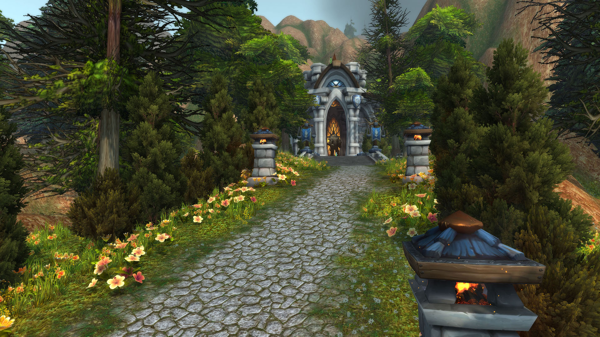

\[卫兵温蒂]: 这灵魂之井需要多少灵魂啊

\[奈子]: 我用禁用的魔法也是不得已的！

艾莎丶墨竹对着奈子咯咯地笑个不停。

奈子哭了。

\[奈子]: 啊，。。。

\[奈子]: 好丑啊！

\[卫兵温蒂]: 我去一下喝水

奈子哭了。

\[艾莎丶墨竹]: 哈哈 小奈子变成丑老巫

奈子大声欢呼！

\[奈子]: 啊，原来是个短时魔法

\[卫兵温蒂]: 圣光在上

\[格林威治主教]: 那个琴的道具

\[奈子]: 圣光在上，你们还吃糖吗？

\[格林威治主教]: 琴道具呢

\[格林威治主教]: 能走着弹琴吗

\[奈子]: 不能

奈子拥抱了艾莎丶墨竹。

\[格林威治主教]: 全体集合

\[奈子]: 艾莎，

\[艾莎丶墨竹]: 怎么了 奈子

艾莎丶墨竹给了奈子一个飞吻。

奈子 再一次抓住了毛蓉蓉的尾巴

\[格林威治主教]: 都出来

艾莎丶墨竹害羞地避开了奈子。

\[格林威治主教]: 到葡萄园来

\[格林威治主教]: 曾经有一首歌

\[格林威治主教]: 形容第一位人类皇帝

\[艾莎丶墨竹]: 奈子 我的黛西可爱吗

\[格林威治主教]: 高地有一位国王

\[格林威治主教]: 一世忠诚可佩

\[格林威治主教]: 一个女人

\[格林威治主教]: 给他一只金杯

\[格林威治主教]: 他当做无上珍品

\[格林威治主教]: 开宴总要干杯

\[格林威治主教]: 每逢他举杯痛饮

\[格林威治主教]: 不由落下眼泪

\[格林威治主教]: 待到他死期将近

\[格林威治主教]: 他把全国城市

\[艾莎丶墨竹]: 黛西 抓紧我 别掉下去了\*小声\*

\[格林威治主教]: 都分给他的储君

\[格林威治主教]: 独留一只杯子

\[格林威治主教]: 是那只金杯

\[格林威治主教]: 他走向海边

\[格林威治主教]: 将酒杯放入海中

\[格林威治主教]: 他合上他的眼皮

\[格林威治主教]: 饮一杯海水

\[格林威治主教]: 从此不再能饮

\[格林威治主教]: 都跟金钿

\[格林威治主教]: 都跟紧点

\[格林威治主教]: 马上就到索拉丁长城了

奈子 不自觉得摸出发小刀拿在手上

\[奈子]: 啊，好高大

\[格林威治主教]: 长城这在了伫立了一千多年了

\[奈子]: 矮人真伟大！

\[格林威治主教]: 曾经是抵挡巨魔的要塞

\[卫兵温蒂]: 圣光在上

艾莎丶墨竹对着阿拉希亡灵卫兵吐口水。

\[格林威治主教]: 如今长城已经废弃了

\[格林威治主教]: 这是世界上最高的城墙了

\[奈子]: 我好像看见了恶鬼。\*自言自语\*

\[格林威治主教]: 抬头仰望

艾莎丶墨竹对奈子点了点头。

\[格林威治主教]: 这城墙的高大

\[奈子]: 门坏了，关不住坏人

奈子 擦了下脸上的汗

\[格林威治主教]: 前面的郭霍尔德城堡废墟

\[格林威治主教]: 我们在那里休息

奈子 城堡，王子，白马

艾莎丶墨竹指着暴怒的枭兽。

\[格林威治主教]: 枭兽

奈子 难过的看着残破的城墙

\[艾莎丶墨竹]: 小奈子 快看 一所破碎的城堡

\[格林威治主教]: 是北方的火鸡

奈子靠在艾莎丶墨竹的肩膀上泣不成声。

\[格林威治主教]: 宴会时候必不可少的食物

\[卫兵温蒂]: 元素

\[奈子]: 我想回县城\*小声\*

\[格林威治主教]: 就到这里休息

艾莎丶墨竹 拿出了水壶，给黛西喂了点水。

\[格林威治主教]: 南方很少有枭兽

\[格林威治主教]: 在南国，吃一只枭兽

\[格林威治主教]: 那真是最高的待遇

\[格林威治主教]: 国王的宴会上都没几次见到

\[奈子]: 啊！

\[奈子]: 鸡翅！

\[格林威治主教]: 人们常说

\[格林威治主教]: 北方人为什么长得高大

奈子大声欢呼！

\[艾莎丶墨竹]: 吃吧 我从家里拿的

\[格林威治主教]: 就是因为他们吃的枭兽

\[格林威治主教]: 而我们南方人只能吃灌木小鸡

\[格林威治主教]: 灌木小鸡肉少

\[格林威治主教]: 一家人吃不饱

\[阿索斯拉裴尔]: 大陆人的食谱还挺奇怪的，

\[格林威治主教]: 这是什么东西

\[艾莎丶墨竹]: 哈哈

奈子招手示意黛西过来。

格林威治主教 踹了一脚黛西

\[艾莎丶墨竹]: 主教 这是一只树懒

\[莎恩丶利希尔]: 啊，跑掉了

\[奈子]: 哈哈，你们找不到了

\[艾莎丶墨竹]: 新物种

\[格林威治主教]: 新物种？

\[格林威治主教]: 烤了

\[艾莎丶墨竹]: 不要！

\[格林威治主教]: 弹琴

\[奈子]: 你们就不怕消化不良吗。

\[奈子]: 哦

\[格林威治主教]: 我来给大家唱一首

艾莎丶墨竹对奈子点了点头。

\[格林威治主教]: 洛丹伦人的歌曲

\[格林威治主教]: 罗兰与马格努斯国王

奈子 紧张的上弦中…

\[格林威治主教]: 在隘口作战

梅洛蒂响亮地吹了一声口哨。

\[格林威治主教]: 我的六位骑士将留下

\[格林威治主教]: 守卫我的王国

\[格林威治主教]: 另外六位将随我去异教徒的土地上

\[格林威治主教]: 挥舞着武器

奈子正在咀嚼爆米花。

\[格林威治主教]: 他们离开洛丹伦之地，去那南阿拉希

\[格林威治主教]: 在格兰山隘口

\[格林威治主教]: 象牙号角响声传到洛丹伦

\[格林威治主教]: 带着肩上的战利品

\[格林威治主教]: 吹响你的号角吧

\[格林威治主教]: 阳光甚至都无法清晰地投下

\[格林威治主教]: 他们在这里战斗了两三天

\[格林威治主教]: 透过男人们污浊的血液

\[格林威治主教]: 带着肩上的战利品

\[格林威治主教]: 吹响你的号角吧

\[格林威治主教]: 啊\~\~\~\~

\[格林威治主教]: 啊\~\~\~

\[格林威治主教]: 啊\~\~\~\~\~

\[格林威治主教]: 罗兰把号角放到他血迹斑斑的嘴边

\[格林威治主教]: 用所有的意志将其吹响

\[格林威治主教]: 大地颤动山峦回响

\[格林威治主教]: 持续三天三夜

\[格林威治主教]: 他们安然离开南阿拉希之地

\[格林威治主教]: 带着他们肩上的战利品回去

\[格林威治主教]: 罗兰拔出宝剑

\[格林威治主教]: 砍向石头去

\[格林威治主教]: 石头崩裂剑无损

\[格林威治主教]: 他们安然离开南阿拉希之地

\[格林威治主教]: 带着他们肩上的战利品

\[格林威治主教]: 吹响号角吧

\[格林威治主教]: 让国王安全的回去

\[格林威治主教]: 吹响号角吧

\[格林威治主教]: 带着他们肩上的战利品

阿索斯拉裴尔大声喝彩。真棒！

你向艾莎丶墨竹大声喝彩。真棒！

\[格林威治主教]: 这首歌是第一次阿拉希人去南国时候

\[格林威治主教]: 阿拉希人渡过大湖

\[格林威治主教]: 去征服南国其他先民

\[格林威治主教]: 他们却遭到了包围

\[格林威治主教]: 罗兰和十二位骑士留下

\[奈子]: 哇哦！\*小声\*

\[格林威治主教]: 为阿拉索皇帝撤离提供了宝贵时间

\[格林威治主教]: 喝口水

\[格林威治主教]: 然后准备上路了

莎恩丶利希尔 有些心不在焉

\[莎恩丶利希尔]: 走了是吗？

\[格林威治主教]: 出发了

阿索斯拉裴尔 拿起杯子咕咚咕咚一饮而尽。

\[格林威治主教]: 挨个递过去

\[格林威治主教]: 喝一口挨个递过去

\[艾莎丶墨竹]: 好的 主教

格林威治主教 水袋扔过去

\[格林威治主教]: 挨个递过去

奈子 越越欲试

\[格林威治主教]: 都喝完了没

\[莎恩丶利希尔]: 怎么回事，天这么快就黑了

奈子 接过了水袋

奈子 交出了喝光的水袋

奈子向格林威治主教鞠躬。

\[格林威治主教]: 出发了

阿索斯拉裴尔 咂了咂嘴。

\[奈子]: 我是勇敢的奈子，天不怕地不怕…8\*声音越来越小\*

\[格林威治主教]: Blessed are you o lord

\[格林威治主教]: Teach me your statutes

\[格林威治主教]: The choir of the saints

\[卫兵温蒂]: 我会保护你的

阿索斯拉裴尔 弯腰系鞋带。

\[格林威治主教]: Has found the fountain of life

\[莎恩丶利希尔]: 总觉得阴森森的

\[格林威治主教]: And the door of paradise

\[格林威治主教]: May I also find the way

\[奈子]: 别过来！

\[格林威治主教]: 跟上

\[格林威治主教]: Alleluia

\[格林威治主教]: Alleluia

\[格林威治主教]: Glory to you our god

\[格林威治主教]: Alleluia

\[格林威治主教]: Alleluia

\[格林威治主教]: Alleluia

\[格林威治主教]: Glory to you our god

\[格林威治主教]: 干什么

记录开始于 05/04/2021 的 11:37:14。

\[格林威治主教]: 都准备一下

\[格林威治主教]: 我们马上就要抵达目的地了

艾莎丶墨竹招手示意黛西过来。

\[格林威治主教]: 我们最后一站

\[格林威治主教]: 前往圣墓骑士团总部

\[格林威治主教]: 都跟上

奈子招手示意黛西过来。

\[奈子]: 哦！走了！哈哈

艾莎丶墨竹大声欢呼！

希休斯 翻身下马

希休斯在格林威治主教面前跪下。

\[格林威治主教]: 圣墓守护者

\[希休斯]: 主教大人，你们终于到了

\[格林威治主教]: 是的

\[格林威治主教]: 我们到了

\[希休斯]: 诸位辛苦了，我们到圣墓再说吧

\[格林威治主教]: 请带路

\[格林威治主教]: 都跟上

\[格林威治主教]: 都很老旧了

\[格林威治主教]: 不过

\[格林威治主教]: 上次我来时候

\[格林威治主教]: 这里建筑

\[格林威治主教]: 还是罗曼式的

\[格林威治主教]: 这塔楼

\[格林威治主教]: 真漂亮

\[希休斯]: 墓地整体重新修葺了一遍

\[格林威治主教]: 比以前漂亮多了

\[希休斯]: 是的

\[格林威治主教]: 所有朝圣者

\[艾莎丶墨竹]: 小奈子 我们到了

\[艾莎丶墨竹]: 圣墓

奈子大声欢呼！

希休斯 戴上了骑士盔

\[格林威治主教]: 亲吻脚下的泥土

格林威治主教跪了下来。

艾莎丶墨竹跪了下来。

希休斯跪了下来。

你跪了下来。

格林威治主教向周围大家祈求。好可怜啊。

卫兵温蒂跪了下来。

马希尔跪了下来。

助祭维克雷斯跪了下来。

奈子 扣了扣脚趾中的泥土

你跪了下来。

\[格林威治主教]: 带路吧

\[希休斯]: 请

\[格林威治主教]: 都起来

\[格林威治主教]: 把后面那个气球给戳了

\[格林威治主教]: 看来

\[格林威治主教]: 雕像

\[格林威治主教]: 也更新了

\[格林威治主教]: 我记得曾经这里是

\[希休斯]: 这次修葺

\[格林威治主教]: 罗曼式的神龛

奈子 收起了气球

\[希休斯]: 更加辉煌了

\[艾莎丶墨竹]: 真是个虔诚的地方

希休斯真心地向高阶牧师赛尔丹尼斯表示问候。

\[格林威治主教]: 他还活着啊

\[希休斯]: 不过现在不太喜欢理人

\[格林威治主教]: 我曾经在这里时他就在了

\[希休斯]: 每天就在神龛前祈祷

希休斯 摘掉头盔

马希尔真心地向高阶牧师赛尔丹尼斯表示问候。

\[法瑞雅]: 我就是在这受封光明骑士

奈子 右手自然屈曲，先点额头，再点胸膛，后点左右肩并双手合十

希休斯满怀敬意地向你致礼。

艾莎丶墨竹跪了下来。

你跪了下来。

奈子跪了下来。

马希尔跪了下来。

艾莎丶墨竹 双手合十，虔诚的祈祷。

卫兵温蒂跪了下来。

助祭维克雷斯跪了下来。

格林威治主教 点燃焚香

希休斯跪了下来。

\[格林威治主教]: 阿门\~\~

\[格林威治主教]: 阿门\~\~

\[希休斯]: 阿门

\[奈子]: 阿门

\[法瑞雅]: 圣光在上

马希尔 阿门

格林威治主教 换上祭服

\[法瑞雅]: 雕像确实翻新了，更为气派，但守墓者没有变

\[助祭维克雷斯]: 圣光在上，我们祝福你！

卫兵温蒂跪了下来。

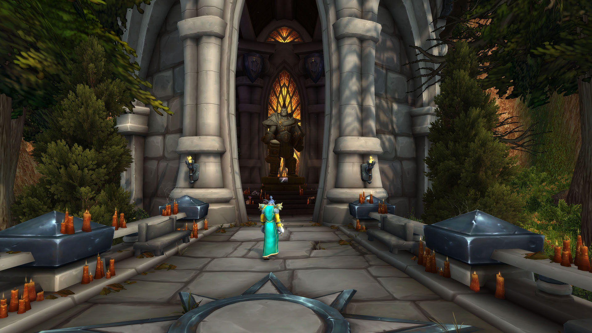

\[格林威治主教]: 洁贞君后兮

\[格林威治主教]: 无玷诞神女

\[助祭维克雷斯]: 赞颂米雷达尔万有之母

\[格林威治主教]: 童贞母后兮，满露之羊絮

\[助祭维克雷斯]: 赞颂米雷达尔万有之母

\[格林威治主教]: 高呼九天兮，昭于日茫

\[助祭维克雷斯]: 赞颂米雷达尔万有之母

\[格林威治主教]: 贞伶之乐兮，天使之上

\[助祭维克雷斯]: 赞颂米雷达尔万有之母

\[格林威治主教]: 殊耀苍穹，纯净逾光

\[助祭维克雷斯]: 赞颂米雷达尔万有之母

\[格林威治主教]: 较诸天军，尔圣愈上

\[助祭维克雷斯]: 赞颂米雷达尔万有之母

\[格林威治主教]: 米雷达尔，举世之母

\[助祭维克雷斯]: 赞颂米雷达尔万有之母

\[格林威治主教]: 莊莊王女，上上神母

\[助祭维克雷斯]: 赞颂米雷达尔万有之母

\[格林威治主教]: 尊赫儒文，位座天神

\[助祭维克雷斯]: 赞颂米雷达尔万有之母

\[格林威治主教]: 庆兮，弗娉之新俪

\[助祭维克雷斯]: 赞颂米雷达尔万有之母

\[格林威治主教]: 庆兮，赫儒文之歌

\[助祭维克雷斯]: 赞颂米雷达尔万有之母

\[格林威治主教]: 庆兮，众天使之咏

\[格林威治主教]: 安和及欢怡，救恩之锚地

\[助祭维克雷斯]: 赞颂米雷达尔万有之母

\[格林威治主教]: 圣言之神宇，弗朽之华英

\[助祭维克雷斯]: 赞颂米雷达尔万有之母

\[格林威治主教]: 安适之伊甸，永生之乐园

\[助祭维克雷斯]: 赞颂米雷达尔万有之母

\[格林威治主教]: 生命之株木，无死之泉源

\[助祭维克雷斯]: 赞颂米雷达尔万有之母

\[格林威治主教]: 祈尔母后，唤尔于今

\[助祭维克雷斯]: 赞颂米雷达尔万有之母

\[格林威治主教]: 庆兮，弗娉之新俪

\[助祭维克雷斯]: 赞颂米雷达尔万有之母

希休斯跪了下来。

助祭维克雷斯跪了下来。

艾莎丶墨竹跪了下来。

格林威治主教 将手中的圣剑\[命运]插入焚香

艾莎丶墨竹 感觉心灵收到了洗涤

格林威治主教 念诵阿拉索文

\[格林威治主教]: Da pacem,Domine

\[格林威治主教]: In diebus nostris

\[格林威治主教]: Quia non est alius

希休斯跪了下来。

\[格林威治主教]: Qui

\[格林威治主教]: pugnet pro nobis

\[格林威治主教]: Nisi tu Deus noster

\[格林威治主教]: Fiat pax in virtute tua

\[格林威治主教]: Et abundantia in turribus tuis

\[格林威治主教]: 都起来

\[格林威治主教]: 围绕圣墓环绕三圈

艾莎丶墨竹优雅的鞠了一躬。

\[奈子]: 主教真牛，招出鬼魂了

格林威治主教 献上鲜花

奈子 取出了自己的零食，放了一袋在上面。

\[格林威治主教]: 为圣墓献上礼品

奈子 把黛西抱了上去

马希尔 从怀里掏出两个焐热的苹果，放在了台阶上。

法瑞雅 放上一束海棠花

艾莎丶墨竹 献上了一朵鲜花

\[格林威治主教]: 愿圣光

\[格林威治主教]: 照耀我们

\[马希尔]: 感谢圣光

奈子 对黛西说：这里好吃的很多，你不会饿着的，会过的很好

\[格林威治主教]: 乌瑟尔兄弟

\[格林威治主教]: 愿我们在加里肋亚海的那边见面

\[希休斯]: 与圣光同行

\[艾莎丶墨竹]: 愿您的光辉 庇护者艾泽拉斯的人民 圣光在上

\[助祭维克雷斯]: 阿肋路依亚

\[马希尔]: 乌瑟尔，我们会以你为榜样，继续前行。

\[奈子]: 愿圣光与黛西同在

艾莎丶墨竹立正敬礼。

奈子优雅的鞠了一躬。

马希尔 右手自然屈曲，先点额头，再点胸膛，后点左右肩并双手合十

\[奈子]: 啊哦\*小声\*

\[格林威治主教]: 来吧

\[格林威治主教]: 带我们

\[卫兵温蒂]: 感谢上主；祂准许你们使用圣光的力量。阿肋路依亚。

\[奈子]: 阿肋路依亚

\[格林威治主教]: 到休息的地方

艾莎丶墨竹向大家挥手告别。再见！

\[奈子]: 走吧，艾莎

马希尔向高阶牧师赛尔丹尼斯挥手告别。再见！

\[艾莎丶墨竹]: 嗯

奈子 开始吹

\[希休斯]: 我们在安多哈尔建立了一个休息点

\[格林威治主教]: 是吗

\[希休斯]: 但是现在有亡灵肆虐

奈子 点上了手提灯

\[法瑞雅]: 洛丹伦终于重建

\[希休斯]: 骑士团的精锐都在前线

\[格林威治主教]: 上一次离开这里

\[法瑞雅]: 等我完成了一切任务，就会回到这里

\[希休斯]: 部分新兵在安多哈尔

\[格林威治主教]: 没想到回去后

\[格林威治主教]: 教宗病逝

\[格林威治主教]: 整个教会被邪恶势力盯上

\[奈子]: 啊！好美艾莎

艾莎丶墨竹见此情景咯咯地笑个不停。

\[格林威治主教]: 出于责任

马希尔 左手抓马缰，左脚纫镫，右手抓紧鞍鞯，翻身上马。

\[格林威治主教]: 玛塔尔教区

\[格林威治主教]: 也被邪恶之人打击严重

\[希休斯]: 我听说半路有人伏击？

\[格林威治主教]: 是的

艾莎丶墨竹真心地向玛莱恩·雷德帕斯表示问候。

\[格林威治主教]: 半路

\[格林威治主教]: 那个贼人查尔德纳修斯

\[希休斯]: 那个败类

\[格林威治主教]: 抢劫了朝圣的黄金

\[格林威治主教]: 那个女巫还活着吗

\[希休斯]: 不能说活着

\[格林威治主教]: 那个叫麦兰达的女巫

\[希休斯]: 也不能说死了

\[格林威治主教]: 护送我们回旅店吧

\[希休斯]: 要住下的话只能在寒风营地了

\[格林威治主教]: 本来我们还要去

\[格林威治主教]: 米雷达尔显圣湖

\[希休斯]: 那边吗？

\[格林威治主教]: 但是现在朝圣者已经无力继续前进了

\[格林威治主教]: 他们的钱都被查尔给抢走了

\[希休斯]: 这里有足够的马匹

\[格林威治主教]: 我们本也该去圣法奥修道院

\[格林威治主教]: 朝拜圣法奥

\[格林威治主教]: 但是我听说

\[格林威治主教]: 德莱尼人给他挖出来了

\[希休斯]: 这边现在有些情况复杂

\[格林威治主教]: 也就是说他不在那里了

\[希休斯]: 亡灵天灾 血色余孽

\[格林威治主教]: 如果有足够的马匹

\[格林威治主教]: 我们要去一趟

\[希休斯]: 嗯，我去准备一下

\[格林威治主教]: 鹰巢山

\[格林威治主教]: 准备一下

\[艾莎丶墨竹]: 可以歇歇脚了

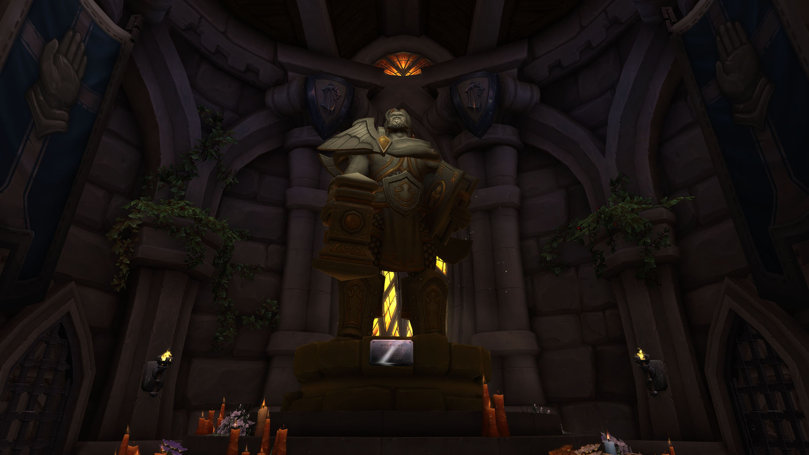

奈子 捂着发麻的脚趾

\[希休斯]: 主教大人，马匹已经准备换好了

希休斯 从马厩中牵出了一些马匹

\[马希尔]: 又该出发了吗？

马希尔 左手抓马缰，左脚纫镫，右手抓紧鞍鞯，翻身上马。

\[希休斯]: 主教大人？

\[奈子]: 呀，我这个马有皮肤病，可怜的孩子。\*小声\*

\[马希尔]: 主教大人 一定是累了

艾莎丶墨竹对着奈子咯咯地笑个不停。

\[希休斯]: 主教这一路的确辛苦了

\[艾莎丶墨竹]: 我们徒步 翻山越岭

\[奈子]: 艾莎的有，温蒂的也有。

奈子大笑。

\[艾莎丶墨竹]: 终于抵达了终点

\[希休斯]: 这不是皮肤病

\[奈子]: 哦

\[希休斯]: 杂色马

\[希休斯]: 这是最初级的马匹

\[马希尔]: 这是健康的肤色，能够适应更恶劣的环境。

\[奈子]: 啊，它是健康的呀，真好！

\[艾莎丶墨竹]: 是时候叫醒主教大人 该走了

\[希休斯]: 也是步兵练习成为骑兵用的初级训练马

\[希休斯]: 主教大人，我们要动身了

\[奈子]: 我叫它“三花”吧。

奈子大笑。

\[马希尔]: 主教来了

\[艾莎丶墨竹]: 走吧 奈子

\[马希尔]: 等等他们吧

\[马希尔]: 他们好像掉队了

\[马希尔]: 后边的跟上

\[马希尔]: 希修斯

\[马希尔]: 这边

\[奈子]: 真是太好了

艾莎丶墨竹给了奈子一个飞吻。

\[马希尔]: 痛快！\~

\[格林威治主教]: 我们从矮人哪里

\[格林威治主教]: 坐狮鹫

\[格林威治主教]: 回去

\[希休斯]: 大家可以把马匹留在这，我会找人牵回去

\[希休斯]: 这里有矮人狮鹫出租
