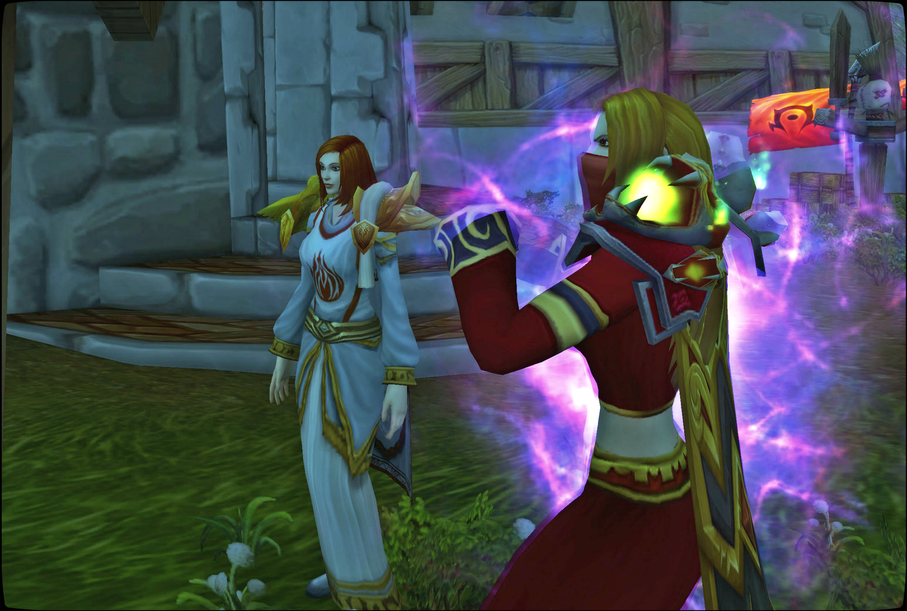
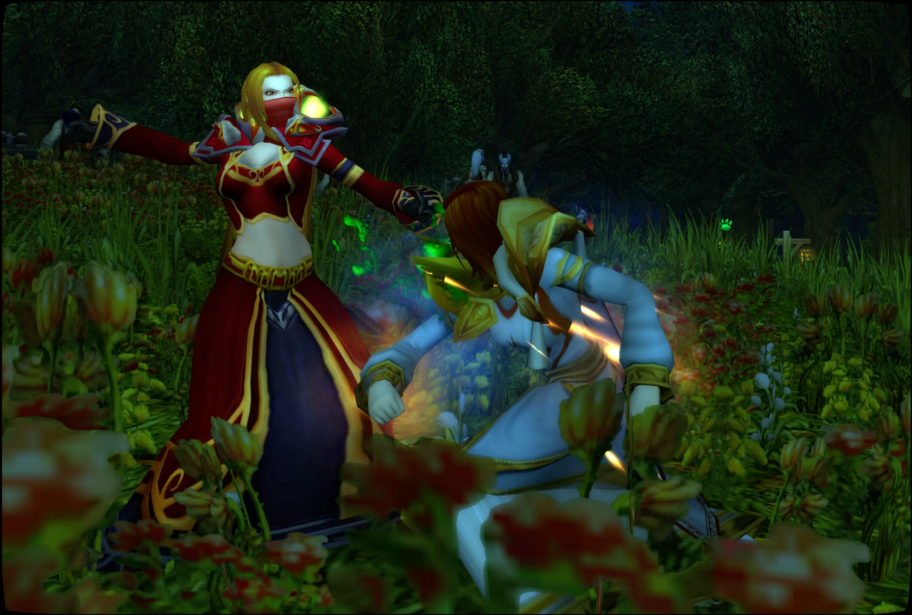
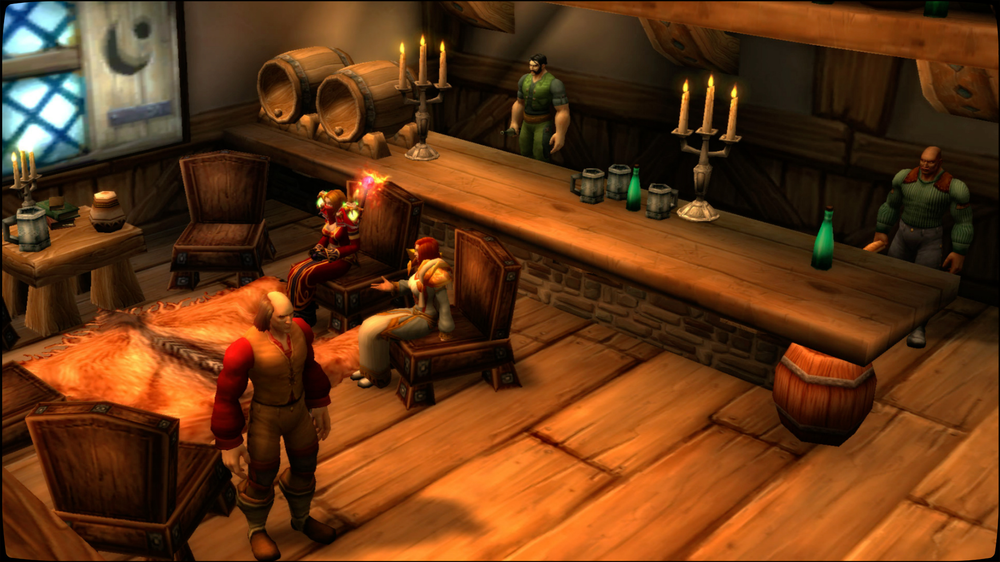

# 丽萨的格斗训练

魔导师丽萨加入炙热之心骑士团后，按照法典，她参与了一次格斗训练。虽然她已经年近半百，但她还是完成了训练。

\[法瑞雅\]: 首先是拳头。

\[魔导师丽萨\]: 哦，天呐，看来会很痛

\[法瑞雅\]: 战争可不在乎我们是否会痛。

\[法瑞雅\]: 抬高一点。

\[法瑞雅\]: 记住不要握太紧。

\[法瑞雅\]: 用指节处落到目标上，不然你可能会打断你的手指。

\[法瑞雅\]: 双手抬高，恢复时放到眼前。

\[法瑞雅\]: 这样才能够有效防止对方进攻你的头部。

\[法瑞雅\]: 是的，就是这样。

\[法瑞雅\]: 格挡的时候，手臂弯曲到90度左右。

\[法瑞雅\]: 用前臂的外延格挡。

\[魔导师丽萨\]: 我感觉我的手要爆炸了

\[法瑞雅\]: 记得是全身的力气都要用上。

\[法瑞雅\]: 用上全身的力气格挡才可能将对方挡住。

\[法瑞雅\]: 看我的示范，一定要小心不要打断自己的手指。

\[法瑞雅\]: 出拳的时候大拇指朝上，不要直着手。

\[法瑞雅\]: 好了，我们加上腿部踢的动作。

\[法瑞雅\]: 这要你的身体保持平衡。

\[法瑞雅\]: 左脚作为基础脚，放到前面，右脚靠后，抬高脚跟。

\[法瑞雅\]: 先试下基础的直踢。

\[法瑞雅\]: 踢裆……这又叫。

\[法瑞雅\]: 如果命中目标，那么战斗就结束了。

\[法瑞雅\]: 所以你一定要将这招练熟了。

\[魔导师丽萨\]: 哦，我这老腿。。。

你向魔导师丽萨大声喝彩。真棒！

\[法瑞雅\]: 战争可不会放过我们，不会看我们的年龄就下手变轻。

\[法瑞雅\]: 好的，我们来试下侧踢。

\[法瑞雅\]: 很好，这起跳的动作。

\[法瑞雅\]: 正好用上两只脚的力量。

\[法瑞雅\]: 来，我们试下你练习的成果。

\[法瑞雅\]: 来，我们试试。

\[法瑞雅\]: 啊，还不错，这身手。

\[魔导师丽萨\]: 魔法让我的身手勉强跟得上你们年轻人

\[法瑞雅\]: 是的，这是你的优势。

\[法瑞雅\]: 你更大的优势则是多年来的智慧。

\[法瑞雅\]: 避免进入一次这样的格斗，比赢取格斗胜利更重要。

\[法瑞雅\]: 记住我教你的握拳和出拳的方法。

\[魔导师丽萨\]: 好的

\[法瑞雅\]: 还有怎么正确地踢裆……这叫一击结束战斗。

\[法瑞雅\]: 我们去喝一杯吧。

\[魔导师丽萨\]: 好的

\[法瑞雅\]: 啊，狮王之傲，总是会回到这里。

\[法瑞雅\]: 十五年前我就是在这遇到了帕拉斯·圣剑，自此加入了骑士团。

\[法瑞雅\]: 丽萨，你说你来自达拉然，你为什么离开了那座城市了呢？

\[魔导师丽萨\]: 自从被赶出学院后，那座城市越来越让我感到恶心，于是就离开了

\[法瑞雅\]: 啊，为什么会被赶出学院？你是如此优秀的一个学员。

\[魔导师丽萨\]: 因为优秀，所以，骄傲自大，做了一些不合规矩的事情，就被赶出来了

\[法瑞雅\]: 哦，是的，我听说法师学院的规矩几乎跟骑士团的法典一样严格。

\[法瑞雅\]: 我在暴风城光明大教堂的地下室中取回了骑士团的旧法典，正在修复，完成后会给你一份抄本。

\[魔导师丽萨\]: 都是年轻时惹的祸啊，我现在已经年过半百，在家中却只能对着墙壁自言自语

\[魔导师丽萨\]: 谢谢

\[法瑞雅\]: 啊，我也曾年轻而不自知，那时的我喜欢喝过量的酒精饮品。但是自从安全地从提瑞斯法林地回来后，我就戒了。

\[法瑞雅\]: 你能告诉我那大概是一件什么样的事吗？在法师学院的。如果你不愿意回忆，也没关系。

\[魔导师丽萨\]: 为了证明自己的能力比老师们强，错手伤了其他学生

法瑞雅 叫布洛葛·哈姆菲斯特来了一份清凉的泉水。

\[魔导师丽萨\]: 所幸他们没有生命危险，于是就把我驱逐出来了

\[法瑞雅\]: 啊，我也经常想要证明我比圣骑士导师们强。这真遗憾。

\[法瑞雅\]: 接下来的时间里你就自己研习魔法了？

\[魔导师丽萨\]: 而且当时我的认罪态度并不端正

\[魔导师丽萨\]: 没错

\[魔导师丽萨\]: 静心修炼，一直到最近才到外面走走

\[法瑞雅\]: 是什么激起了你想要出来冒险的心呢？联盟和部落的战争？

\[魔导师丽萨\]: 人老了，心没老，虽然已经没有了以前的自大，却还是那颗年轻的心

\[法瑞雅\]: 是的，我们都经历了很多，但是心里……

\[法瑞雅\]: 我本可以回到壁炉谷参与重建，但是我不相信部落提出的和约。

\[法瑞雅\]: 所以骑士团正在征兵，就是为了防备重新恶化的局势。

\[法瑞雅\]: 你经过了格斗训练，就是我们的一员了。

\[魔导师丽萨\]: 我相信在今后会有更多愿意加入的人

\[法瑞雅\]: 不好说，我恐怕骑士之路如今已经很少人愿意，或者能坚持地走下去了。

\[法瑞雅\]: 太多的规条和战斗。

\[法瑞雅\]: 比如说，骑士团是不会接纳术士、德鲁伊等职业的，这是法典上的一条。

\[魔导师丽萨\]: 我认识一位圣骑士，或许我可以去找他谈谈，他没准会愿意加入

\[法瑞雅\]: 好的，你去问问他。

\[魔导师丽萨\]: 他现在也在为洛丹伦的事业而献身

\[法瑞雅\]: 啊你也是一名前线英雄，你当时在哪服役？

\[法瑞雅\]: 是的，我们的其中一个目标，就是为了洛丹伦失落的荣耀而战。

\[法瑞雅\]: 那时因为当时建立炙热之心骑士团的几位骑士大多数来自洛丹伦。

\[魔导师丽萨\]: 我参与抵抗过王子对达拉然的入侵

\[法瑞雅\]: 我听说了，那可是一场恶战。

\[法瑞雅\]: 当然后来整个骑士团来到了南方，我们也接收了不少暴风城的骑士。

\[法瑞雅\]: 其中骑士团最后的盾牌，拥光者克拉拉就来自西部荒野。

\[法瑞雅\]: 你真该看他拿起盾牌的样子，但他已经不再服役了。

\[魔导师丽萨\]: 每一位老兵身后都会有一位合格的新兵接任

\[法瑞雅\]: 但愿如此，我已经很久没有主持过骑士晋升仪式了。希望我们找到愿意走这条路的骑士们。

\[法瑞雅\]: 好了，我得回去继续修复法典了。

魔导师丽萨对你点了点头。

