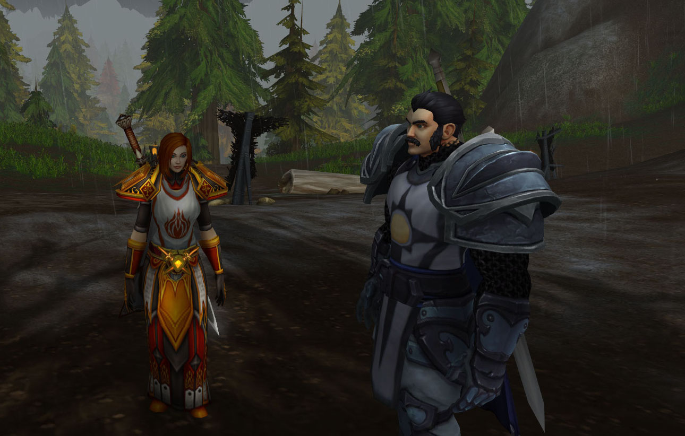
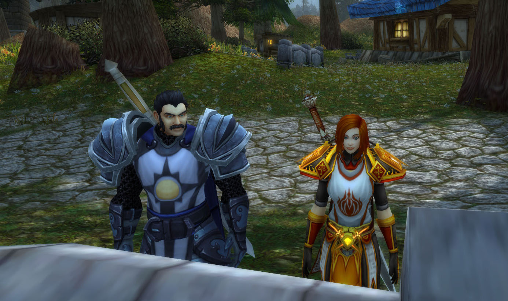
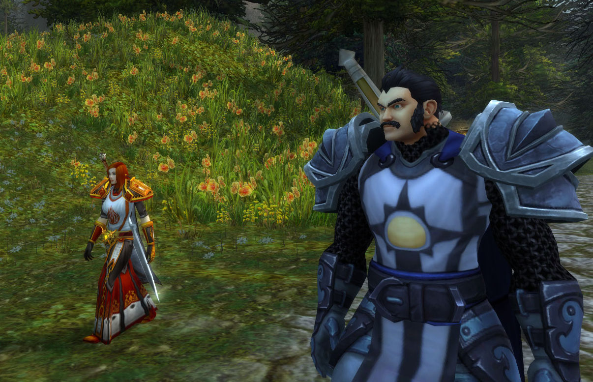

# 偶遇富尔克·潘恩

在希尔斯布莱德偶遇富尔克·潘恩骑士。

\
记录开始于 12/08/2022日 22:28:26时。\
\[富尔克潘恩]: 嘿！大家伙\
\[富尔克潘恩]: 你是谁？\
\[富尔克潘恩]: 此路不通女士 这里是奥特兰克山区 前方的道路禁止通行\
\[法瑞雅]: 这个雨天这位骑士在此做什么呢？\
\[法瑞雅]: 是吗？如果我需要北上呢\
富尔克潘恩 确认周围没有食人魔后 打开了面甲\
\[富尔克潘恩]: 我想最好换个地方再谈\
\[富尔克潘恩]: 如果您需要北上\
\[法瑞雅]: 是的此处常有食人魔出没\
\[富尔克潘恩]: 我的建议是绕行东侧山谷\
\[法瑞雅]: 是啊，我居然走错了路\
\[富尔克潘恩]: 沿着河流直入西威尔德 但\
\[富尔克潘恩]: 您的目的地是哪里？\
\[法瑞雅]: 寒风营地

<figure><figcaption></figcaption></figure>

\[富尔克潘恩]: 寒风营地 那恐怕只有我右手边的一条路是捷径\
\[法瑞雅]: 我原本对回洛丹伦的路足够熟悉，今天是怎么了，或许是这雨吧\
\[法瑞雅]: 你是？\
\[富尔克潘恩]: 倘若穿越达隆米尔河 还需要在抵达西威尔德后向西绕行 ..抱歉 我忘了自我介绍了女士\
\[富尔克潘恩]: 富尔克.潘恩 银色先锋骑士\
富尔克潘恩 抖了抖在冰雨中有些褪色和结冰的战袍\
法瑞雅 听见银色两个字，顿时警惕\
\[富尔克潘恩]: 我们就在这儿呆着？那不是个好主意\
\[法瑞雅]: 嗯换个地方说话吧\
\[富尔克潘恩]: 如果您赶时间我也可以陪同您过去\
\[富尔克潘恩]: 这附近恐怕没什么“惬意”的场所\
\[富尔克潘恩]: 您怎么会选择在这种天气穿越冰封岗？女士\
\[法瑞雅]: 我急需回到西洛丹伦，来见几个旧人\
\[富尔克潘恩]: 仅仅在三个月前 我们还同奥特兰克食人魔发生冲突 近来这些生物较比以往更为狂暴了几分\
\[法瑞雅]: 猎杀食人魔的骑士，你是？\
\[富尔克潘恩]: 我是富尔克 银色先锋军指挥官 我们正在此地执行监视食人魔动向的任务\
\[法瑞雅]: 你们的骑士团和银色各种军队又有什么关系（终究还是问了）。\
\[富尔克潘恩]: 呃..为何要询问这样的问题 女士\
\[富尔克潘恩]: 莫非您要寻找的人也是我们之中的一员么？\
\[法瑞雅]: 不是，而这恐怕就是其中令人忧虑之处\
\[法瑞雅]: 一个还在北方的人，不是银色军队，那他只能是……另外的人了。

\[富尔克潘恩]: 银色先锋军是一支直属于十字军将军埃利戈尔.黎明使者的精锐军事力量\
\[富尔克潘恩]: 从原则上 我们听从十字军领主泰罗索斯的指挥 但大多数时候我们拥有自己独立的职责\
\[法瑞雅]: 我来自炙热之心骑士团，我们是一支由洛丹伦遗民组成的骑士团。\
\[富尔克潘恩]: 而当我们需要与其他银白十字军共同指挥时..恐怕只有非常严重的情况了\
富尔克潘恩 再次摘下了头盔 露出一张虽然有些邋遢但依然相当年轻的面庞\
\[富尔克潘恩]: 富尔克.潘恩 银色先锋军指挥官\
法瑞雅 老了\
\[法瑞雅]: 法瑞雅·图尔加斯，炙热之心骑士团大团长。\
\[法瑞雅]: 这是一团足够猛烈的热火，在我的徽章之上。\
\[富尔克潘恩]: 抱歉 法瑞娅阁下 并无冒犯 但是..\*思考着该如何询问\*\
法瑞雅 扬起一边眉毛\
\[富尔克潘恩]: 在昨日晚间我们从壁炉谷启程时，银白守卫们曾经与我通报过您的造访\
\[法瑞雅]: 是吗？那你也很清楚我的选择了。\
\[富尔克潘恩]: 事实上 相反\
\[法瑞雅]: 忘掉过去，就是背叛。\
\[富尔克潘恩]: 听着，女士，没有人会忘却什么 这里只有一种现实\
\[法瑞雅]: 有的死物，不能与人类共存。

\[富尔克潘恩]: 那就是现实所迫\*转过头看了看情绪低落的银白十字军\*\
\[富尔克潘恩]: 走吧 也许实在是过去了太多年 以至于您..并不了解一些发生在过往的事情\
\[法瑞雅]: 银色北伐军选择了与亡灵妥协，你也会这么做吗？\
\[富尔克潘恩]: 万事皆有代价 法瑞娅女士\
\[富尔克潘恩]: 走吧 我带您看看..历史的痕迹\
\[富尔克潘恩]: 6年前\
\[富尔克潘恩]: 这条路上每日都有巡查兵\
\[法瑞雅]: 与亡灵妥协的代价就是死亡。\
\[富尔克潘恩]: 银色十字军的观察岗哨遍布冰封岗到圣墓的路上\
\[富尔克潘恩]: 是..那场战争\
\[富尔克潘恩]: 战争改变了许多 即使银色十字军甚至不是战争的参与者\
\[富尔克潘恩]: 或者说…“忽略者”\
\[富尔克潘恩]: 看到这座未完工的高塔了么？\
\[法瑞雅]: 我曾经在冰封岗与亡灵战斗过，那时我还拿着盾牌。但是我已经很久没来这里了。\
\[法瑞雅]: 这座高塔是新建的。\
\[富尔克潘恩]: 血精灵的工程师曾经计划在这里建设起一道能够覆盖安多哈尔南侧的瞭望站\
\[富尔克潘恩]: 6年前 战争开始后\
\[富尔克潘恩]: 他们永远的离开了我们 舍弃了十字军的事业

\[法瑞雅]: 这里确实没有了银色黎明的巡逻兵。\
\[法瑞雅]: 这或许不是坏事……\
\[富尔克潘恩]: 悔恨岭农场\
\[富尔克潘恩]: 一位名叫埃森纳的农夫与他同样来自暴风城的兄弟姐妹们 将这里原本的荒地开垦为了适合耕作的沃土\
\[富尔克潘恩]: 而自从..那棵参天古树被付之一炬后\
\[富尔克潘恩]: 这些人愤怒地询问我们的指挥官 我们为何无动于衷\
\[法瑞雅]: 虽然这里仍有亡者的气息，但是我能感受到他们的愤怒。\
\[富尔克潘恩]: 最后 他们失落的离开了 因为没有人能回答他们的问题\
\[法瑞雅]: 那么为何无动于衷呢？\
\[富尔克潘恩]: 因为..那是一个错误\
\[富尔克潘恩]: 一个 所有人意识到的时候 已经太晚的错误\
富尔克潘恩指向远方。\
法瑞雅 看向富尔克指的方向

新建的一整块墓地上，到处都是刻印着联盟圣光信徒的墓碑，大多数去世日期是黑门33年。\
\[富尔克潘恩]: 那些 原本与我们互为兄弟姐妹的人们 为了彼此族群 或是阵营的战争 而离开了十字军的事业\
\[富尔克潘恩]: 大多数人..最终以这样的方式回归到了圣光的花园中\
\[法瑞雅]: 银白十字军也有今日……但是逝者安息。但洛丹伦无法安息。\
\[富尔克潘恩]: 那就是那个错误的代价\
\[法瑞雅]: 所以我认为对亡灵还有兽人妥协，都会带来死亡。\
\[富尔克潘恩]: 当希尔瓦娜斯在提瑞斯法杀害那些从南方前来寻找他们亲人的生者时\
\[富尔克潘恩]: 我们称那是阵营的战争 是圣光所不齿的杀戮行径\
\[富尔克潘恩]: 再后来 这个理由又被使用了许多次\
\[法瑞雅]: 尤其是亡灵，不能与之理论，不能威慑。只有……让他们彻底安息。\
\[富尔克潘恩]: 直到他变得不再为大多数人容忍\
\[法瑞雅]: 阵营战争或许可耻，但与亡灵的战争不是。根本不能容忍。\
\[富尔克潘恩]: 我还记得 许多兄弟说 他们虔诚地信仰着圣光，遵循它的教诲\
\[富尔克潘恩]: 但那其中不包括..纵容\
\[法瑞雅]: 当然。但是圣光里也有死亡。\
\[法瑞雅]: 圣光并非只有怜悯。

\[富尔克潘恩]: 直到那时，我们才意识到 倘若起初我们能让女妖之王为她的罪行付出代价 我们本可以避免这片土地血流成河\
\[富尔克潘恩]: 我们有过太多机会 但却将它们一一错失\
\[法瑞雅]: 一个人如果被圣光击中，很可能引发的是巨大的痛苦，而不是温暖。这片土地已经血流成河了。\
\[法瑞雅]: 但是我知道还有为这片土地而战的人，被认为是异端，是狂热者。\
\[富尔克潘恩]: 已经不存在 异端 了 法瑞娅\
\[法瑞雅]: 他们被驱逐，被审判，流落在这片山谷之中。\
\[富尔克潘恩]: 这片土地上的所有生者 皆是在连绵不断的战火之中 求得自保者 即使是银白十字军同样如此\
\[富尔克潘恩]: 正是因为他们清楚地意识到自己没有办法保护昔日承诺守护的土地 才会有我们这样的人被纳入其中\
\[法瑞雅]: 6年前黑色星期五审判，炙热之心骑士团差点因为被认为是异端而毁灭。教会并不认为没有异端。\
\[富尔克潘恩]: 您恐怕也说了 那是六年前\
\[富尔克潘恩]: 女士 异端并不存于圣光的教义之中\
\[富尔克潘恩]: 事实上 她从未自诩正义 但 我们人类是一种矛盾的生物\
\[富尔克潘恩]: 我们总是苛求为一种力量注入太多的美好与理想\
\[法瑞雅]: 使用圣光的人有很多，他们可不认为没有异端。圣光本身，则被认为是一种能量，对于血精灵而言，他们甚至可以不信仰圣光就使用它的力量。\
\[法瑞雅]: 对此也有人类的信仰遭到了动摇。\
\[法瑞雅]: 圣光原本应该是一种信仰，然后才是能量灌注之力。\
\[富尔克潘恩]: 或许提里奥领主本初并未给我们指明银色之路究竟为何物\
\[法瑞雅]: 提里奥·弗丁说过种族并不代表荣耀，他见过高尚的兽人。但也正是因为那个兽人，他被驱逐出骑士团。\
\[法瑞雅]: 没有什么比被驱逐出骑士团对一个圣骑士内心的打击更大了。\
\[法瑞雅]: 在法庭上，他恳求罪不及他的儿子，泰兰。\
\[法瑞雅]: 因此他所领导的银色北伐军，也包容了兽人。兽人，或许吧。但没有一个亡灵应该被包容。

\[富尔克潘恩]: 我想 他指明的道路应当是追求净化，美德之路，那曾是他未能获得的\
\[富尔克潘恩]: 至于..亡者，那则是我们要说的另一个故事了\
\[法瑞雅]: 这是生与死的界限，不仅仅是种族问题。亡灵对生者的仇恨，那可比我对死者的仇恨更深。\
\[富尔克潘恩]: 那么您可知晓 现在那些 被遗忘者的领导者 乃是一位为圣光所祝福之亡者\
\[法瑞雅]: 我有所耳闻，但是她毕竟已经死了，她的血脉也被诅咒的。\
\[富尔克潘恩]: 安度因.乌瑞恩国王使用圣光之力救赎了她的躯体 但..\
\[法瑞雅]: 我不认为王座上一定要坐上一个米奈希尔。\
\[富尔克潘恩]: 她所领导着的 乃是上一场战争之中罪行累累的犯人\
\[法瑞雅]: 死者就该保持死的状态。\
\[富尔克潘恩]: 事实上 十字军内部对此 无法得出统一的回应\
\[法瑞雅]: 追求永恒的安息，而不是追求因为她是亡灵的身份，而合理的解释——获取权力。\
\[富尔克潘恩]: 我们之中有许多人曾对乌瑞恩国王的行为感到困惑\
\[法瑞雅]: 炙热之心骑士团还未对此召开骑士评议会，所以我无从得知南方骑士们的看法。但是北方的骑士，基本上对此不可能容忍。\
\[富尔克潘恩]: 我不知该从何开始才好 女士 我本来并无权与您沟通此事 但 出于您如此强烈的执念\
\[法瑞雅]: 是因为那个位子上需要坐着一个亡灵，恰好还是米奈希尔。这行为当然令人困惑，但这就是身份政治。\
\[富尔克潘恩]: 我想这并非不可言表之事

<figure><figcaption></figcaption></figure>

富尔克潘恩 转过身向着更前方走去了\
\[富尔克潘恩]: 两个月前\
\[富尔克潘恩]: 联盟承认了 被遗忘者当前政权 对于他门现有统治区域的——合法地位\
\[富尔克潘恩]: 作出这一决定的并非乌瑞恩国王 而是在其失踪时代行联盟领导职权者之一\
\[富尔克潘恩]: 吉尔尼斯国王 吉恩.格雷迈恩\
\[富尔克潘恩]: 从那时起\
\[富尔克潘恩]: 银白十字军就接收到了…一些代表联盟 以及部落共识的讯息\
\[富尔克潘恩]: 而那些讯息则无疑反映了两者的意志 他们称之为..和平\
\[法瑞雅]: 这块土地判给亡灵，我就知道他们会这么做，因为他们认为这片土地上已经不再有真正的洛丹伦人了。\
\[富尔克潘恩]: 银白十字军被告知 为了延续这和平 至少是多些年头\
\[富尔克潘恩]: 血色十字军 乃至他们的支持者都被禁止了公开的活动 尽管以前亦是如此\
\[富尔克潘恩]: 只有在血色修道院 血色兄弟会的成员坚决地抨击这样的行为是背叛\
\[法瑞雅]: 我知道……血色修道院是最后的堡垒了\
\[富尔克潘恩]: 他们因此沦为北方的公敌 如今只得聚集在他们原本所在的地方 血色修道院\
\[法瑞雅]: 但是这个堡垒恐怕也有被攻破的一天。

\[富尔克潘恩]: 这也许令人沮丧\
\[富尔克潘恩]: 但它就是这个时代的事实 如今 无论是联盟 还是部落\
\[法瑞雅]: 曾经，这片土地上战斗到底的人，都是血色十字军。\
\[富尔克潘恩]: 这片土地已经不再是他们所关注的地区\
\[富尔克潘恩]: 现如今 他们更加关心北方的岛屿 只有这件事才能吸引那些领导者们调兵遣将\
\[法瑞雅]: 太多人逃跑了，但是他们还战斗至死，或者变成亡灵，也继续战斗。\
\[法瑞雅]: 是啊，或许这就是机会。\
\[法瑞雅]: 当所有人的目光都聚焦在北方岛屿之上。\
\[富尔克潘恩]: 但对于那些生存在这片土地上的人们\
\[富尔克潘恩]: 他们因此失去了自己曾经或许可以获得的返回家乡的机会\
\[法瑞雅]: 我们都会回到故土，总有一天。\
\[富尔克潘恩]: 就如同这座墓穴之中沉睡的人们一样\
\[富尔克潘恩]: 6年前 这座墓穴遭到了被遗忘者的破坏\
\[富尔克潘恩]: 他们说 埋藏在这里的 是曾经屠戮过他们的联盟圣骑士\
法瑞雅 轻笑，她杀死过太多亡灵，就在这片墓地上

<figure><figcaption></figcaption></figure>

\[富尔克潘恩]: 多么荒唐 但我们无权告知他们我们的阵营立场 只得将它们并不那么友善的送了出去\
\[法瑞雅]: 和平是不可能的，除非亡灵从这片土地上消失，你总有一天会意识到。\
\[法瑞雅]: 他们不是人。即使都是死去的洛丹伦人。\
\[富尔克潘恩]: 我不曾见过那个充斥着血腥与杀戮的时代 法瑞娅女士，我只是一个道听途说的追随者，但\
\[富尔克潘恩]: 您所向我讲述的故事 为我提供了一个崭新的视角\
\[法瑞雅]: 看来我是真的老了，因为我见过。\
\[富尔克潘恩]: 至于银色十字军\
\[法瑞雅]: 这片墓地当年，充满骷髅，土地还是红色的。\
\[富尔克潘恩]: 他们之中实际上许多人与你我一样 对于现在 过去 和未来 充满了困惑\
\[富尔克潘恩]: 太多的问题需要被提出 太少的答复可以被提供\
\[法瑞雅]: 但是他们无法违抗银色十字军的军令。\
\[法瑞雅]: 他们选择了继续沉默。\
\[富尔克潘恩]: 并非如此\
\[富尔克潘恩]: 时代在变化 十字军也在变化\
\[法瑞雅]: 比银色黎明好那么一点吧。\
\[法瑞雅]: 他们是公然接受被遗忘者加入的。\
\[富尔克潘恩]: 我们的信条注定了我们终将无法以亚历山德罗斯.莫格莱尼的军队那般令人望而生畏 为了光复家园而战的决心\
\[富尔克潘恩]: 但那不意味着我们会接受沉沦\
\[富尔克潘恩]: 提里奥也许已经逝去，但这里的一切就是他所留下的遗产\
\[富尔克潘恩]: 十字军不能允许这些遗产在漫长的岁月中遗失\
\[法瑞雅]: 炙热之心骑士团的一位北方骑士曾跟我说，未经历他人的痛苦，莫劝他人善良。

\[富尔克潘恩]: 但倘若世界已经充满痛苦 那么则给予他人希望 哪怕十分微小\
\[法瑞雅]: 我无法背弃我的过去，我宁愿这个过去一直刻在我的背上。\
\[富尔克潘恩]: 没有人可以遗忘过去 女士 即使是我这样从未有过多少过去可言的人也一样\
\[富尔克潘恩]: 苦难与罪孽是一本厚实的书籍\
\[富尔克潘恩]: 代代相传\
\[富尔克潘恩]: 十字军不希望为这个痛苦不堪的世界制造更多仇恨与罪恶\
\[富尔克潘恩]: 但我们也因此承受了回避他们的代价\
\[法瑞雅]: 你要意识到，只有杀光亡灵，才有希望。\
\[富尔克潘恩]: 但这一切不会这样持续下去了\
\[法瑞雅]: 真的吗？\
\[法瑞雅]: 你要是见到一个血色十字军，你会怎么做？\
富尔克潘恩 点了点头\
\[富尔克潘恩]: 我会劝他莫要忘记自己的初心，但请求他尊重自己其他同胞的选择

\[富尔克潘恩]: 圣光为每个个体带来的指引不尽相同\
\[富尔克潘恩]: 但倘若在信仰圣光之人众也要发生无意义的屠戮 实在是令人悲哀\
\[富尔克潘恩]: 据我所知\
\[富尔克潘恩]: 在暴风城\
\[富尔克潘恩]: 图拉扬主教已经包容了那些 与他们的信条不尽相同的血色修士们\
\[富尔克潘恩]: 时代在变化 姐妹 但人们的思想与行为总是无法紧跟上岁月的流逝\
\[法瑞雅]: 他现在包容，是因为血色十字军只有血色修道院一个堡垒了，不足为虑。\
\[法瑞雅]: 但是……\
\[法瑞雅]: 如果联盟支持了血色十字军。\
\[法瑞雅]: 那么血色十字军就很有可能在北方与银色北伐军一战。\
\[富尔克潘恩]: 那是需要被阻止的\
\[法瑞雅]: 到了那时，你我都只能选边站。很久以前，帕拉斯圣剑，炙热之心骑士团的大团长，在血色十字军覆灭的时候，选择了将我软禁在南方。就是不让我和血色十字军有任何联系。

\[富尔克潘恩]: 在这个时代 已经不需要更多圣光信徒之间的战争\
\[法瑞雅]: 所以一旦事态恶化，所有人都需要重新做选择。\
\[富尔克潘恩]: 我从未听闻过他的名字 但我清楚他做出选择的目的\
\[富尔克潘恩]: 而我恐怕并不这么认为 但只有一件事我持有保留态度\
\[法瑞雅]: 到了真正需要做出两难选择的时候，才能证明你是一个怎样的人。\
\[富尔克潘恩]: 事态或许会变化 法瑞娅\
\[法瑞雅]: 几天前我在壁炉谷，选择了不放弃我的过去。因为那塑造了我到底是谁。\
\[富尔克潘恩]: 但它或许会以一种你我皆意想不到的方式\
\[富尔克潘恩]: 就如同..20年前一样\
\[富尔克潘恩]: 以圣光的名义发誓 法瑞娅 我不会同您这样高尚的圣光信徒为敌

\[富尔克潘恩]: 那乃是对圣光信条的亵渎与侮辱 只有那些渴求权势的无信者才会积极地充当马前卒\
\[法瑞雅]: 圣光的信仰如果完全包容，那么它就不会有能力去取人性命了。\
\[法瑞雅]: 但是每一天圣骑士都在使用圣光战斗。因此，圣光残酷的一面，恐怕更令人所知。\
\[富尔克潘恩]: 但倘若它的信条之中只有毁灭 那么也不会有圣光之愿礼拜堂的神迹\
\[富尔克潘恩]: 祝福纯净之人 去除腐朽与堕落 圣光从来都只是将它们摆在信徒面前\
\[法瑞雅]: 仁慈只留给配得上的人。\
\[富尔克潘恩]: 我的时间到了 法瑞娅女士 许久没有见到您这样拥有坚定信念的战士了\
\[法瑞雅]: 嗯，你去休息吧。愿圣光永远怜悯你的灵魂。\
\[富尔克潘恩]: 圣光与你同在 法瑞娅姐妹\
富尔克潘恩优雅的鞠了一躬。
