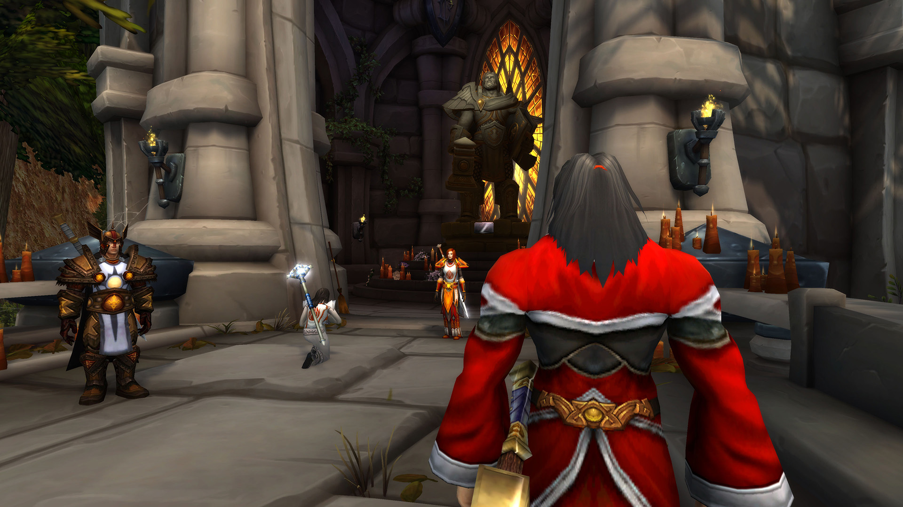
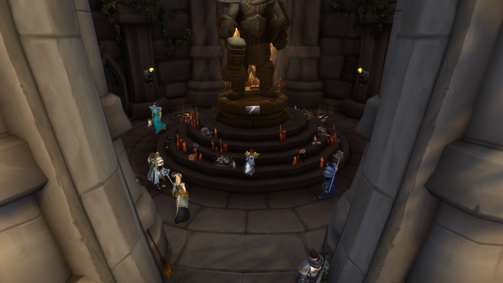
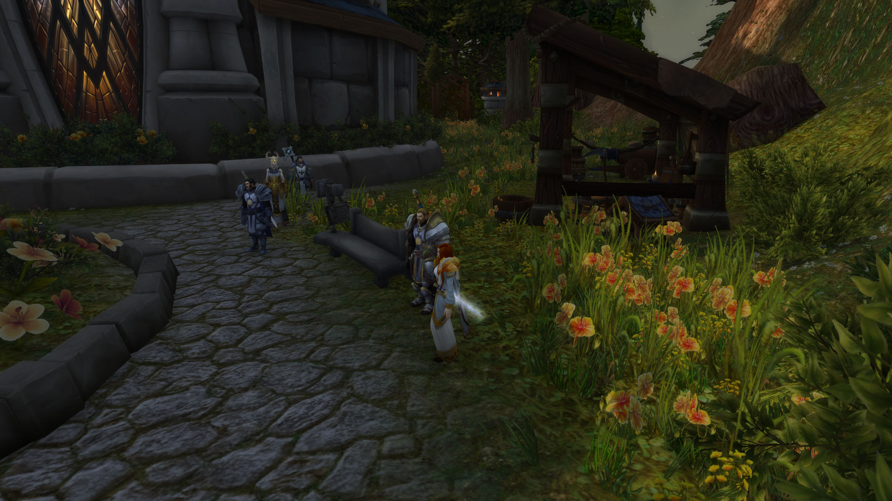

# 银色与血色在乌瑟尔之墓

记录开始于 12/09/2022日 21:55:15时。

\[查克马威尼]: 站住！

\[法瑞雅]: 这位是？

\[查克马威尼]: 我是圣心骑士团的

\[查克马威尼]: 虽然那是曾经的名字。

\[法瑞雅]: 你们现在是某种银色，银色先锋队？

\[查克马威尼]: 对

\[法瑞雅]: 在乌瑟尔之墓有仪式正在举行吗？

\[梅斯丶达瑟尔]: 不过历史已经注定……

\[查克马威尼]: 团长，这就是我说的那个人。

梅斯丶达瑟尔 目光如炬地盯着法瑞雅穿着的战袍

富尔克潘恩 皱起了眉头，但一言未发

\[梅斯丶达瑟尔]: 只是寻常拜谒。

法瑞雅 看向自己的战袍，知道那是一团烈火。

\[法瑞雅]: 恰好，我也是。

\[梅斯丶达瑟尔]: 你身处银色领地上，阿拉索的子民。

法瑞雅 的烈火纹章，和某一种纹章十分相像，但不是。

<figure><figcaption></figcaption></figure>

\[梅斯丶达瑟尔]: 你的战袍代表着许多含义，但不是每一项都能令乌瑟尔的英灵感到欣喜

\[法瑞雅]: 是的，但我不认为洛丹伦人不能到乌瑟尔之墓祭拜。

\[梅斯丶达瑟尔]: 恐怕作为本地的圣骑士，我不能同意你的拜谒请求。

\[法瑞雅]: 你怎么知道他会怎么想？

\[梅斯丶达瑟尔]: 我不敢妄言乌瑟尔大人的思绪，但我能断定他不会做出血色十字军所做的事情。

\[法瑞雅]: 是吗，你也是洛丹伦人？是洛丹伦人就应该理解，每一个洛丹伦骑士对乌瑟尔的感受。

\[梅斯丶达瑟尔]: 他在斯坦索姆的城门前就证明过这一点，用他的荣誉。

\[富尔克潘恩]: 稍等 梅斯兄弟

\[辯護者佩蘭妲]: 圣光在上，原谅我的打断，我认为所有人都可以对英雄献上他的崇敬。

\[梅斯丶达瑟尔]: 当屠刀上沾满了无辜者鲜血后，恐怕握刀的人就没有辩驳的余地了

\[富尔克潘恩]: 女士 请问您的姓名与所属的组织是？

\[法瑞雅]: 法瑞雅·图尔加斯，炙热之心骑士团的大团长，曾是骑士团西瘟疫之地指挥官。

\[法瑞雅]: 这里就是我战斗的地方，在他的墓前。

\[梅斯丶达瑟尔]: 我听闻过你们的名字和战争……

\[法瑞雅]: 我有祭拜乌瑟尔的一切权利，因为我为此战斗过。

梅斯丶达瑟尔皱着眉头。

\[梅斯丶达瑟尔]: 原谅我武断判定你的身份了，女士。

\[梅斯丶达瑟尔]: 但荣誉命令我不能准许血色十字军的战袍出现在圣墓的祭台前

\[梅斯丶达瑟尔]: 恐怕我要坚持——

\[法瑞雅]: 炙热之心骑士团的纹章，是烈火。不是血色十字军。但是，我们并不排斥血色十字军的加入。

梅斯丶达瑟尔 沉吟了片刻，然后微微点了点头

\[法瑞雅]: 血色十字军和任何银色军队一样，都在为这片土地战斗。或者，其实只有血色十字军还在战斗了？

\[法瑞雅]: 银色北伐军恐怕……放弃了很多……原则。

\[梅斯丶达瑟尔]: 您选择何人作为战友，与白银之手的骑士并无冲突。如果您坚持的话，那这烈火确实可以不是血色十字军的三瓣魔火。

\[富尔克潘恩]: 这是可以被英灵所接受的 法瑞娅女士 但请您再英灵的归宿之地保持谦卑

\[法瑞雅]: 谁为洛丹伦献出鲜血，谁就有资格生活在这片土地上。相反，某些与被遗忘者为伍的人……

\[辯護者佩蘭妲]: 我相信法瑞雅团长既然已经证明了自己祭拜的资格，我想不应该因为她来自哪个组织拒绝她，二位。

\[梅斯丶达瑟尔]: 血色十字军中不乏受谎言蒙蔽才行事极端的英雄好汉

\[梅斯丶达瑟尔]: 一切都可以被原谅，这片土地意味着原谅。

\[法瑞雅]: 杀死每一个亡灵，这极端吗？

\[梅斯丶达瑟尔]: 我没有更多的问题了。

\[梅斯丶达瑟尔]: 恐怕我无法回答这个问题而不大动干戈

\[法瑞雅]: 甚至拷问每一个亡灵再杀死，亡灵也死不足惜。

\[辯護者佩蘭妲]: 你是说，杀死每一个亡灵，没有更多的限制条件了吗

\[梅斯丶达瑟尔]: 但我只能再次强调，血色十字军所杀戮的诸多魂灵中，无辜者绝对不在少数。

\[富尔克潘恩]: 姐妹，我想这片土地上的英灵不会拒绝曾经为她而战的子民

\[法瑞雅]: 那些，是必要的损失。

\[梅斯丶达瑟尔]: 我亲眼目睹血色十字军的教士活活烧死完全无辜的可怜平民

\[法瑞雅]: 他们感染了。

\[梅斯丶达瑟尔]: 感染了。

\[法瑞雅]: 血色十字军会多次确认。

\[法瑞雅]: 感染者应该对自己没有变成亡灵感到庆幸。

\[梅斯丶达瑟尔]: 通过鞭打，刑架和拷问确认。

\[梅斯丶达瑟尔]: 相信我，按照这个方法，最纯洁的灵魂也会承认自己感染了亡灵瘟疫的。

\[梅斯丶达瑟尔]: 当然，我没必要说服你，女士

\[富尔克潘恩]: 但如今，这些英灵期盼着救赎与谅解，而您，法瑞娅团长，又为何要为血色十字军的所为做出辩护呢

\[法瑞雅]: 有时候，这些是必须的，你不知道一个亡灵会隐藏得多好。

\[梅斯丶达瑟尔]: 你的功绩仍然卓著，我很抱歉谎言仍然占据了您的部分心灵

梅斯丶达瑟尔 盯着对方

\[法瑞雅]: 因为炙热之心骑士团从来不敌对血色十字军。我们都是洛丹伦人。

\[法瑞雅]: 北方骑士组成的盟约。

\[梅斯丶达瑟尔]: 是银色黎明，女士，而不是血色十字军，找出并驱逐了恶魔巴纳扎尔

\[富尔克潘恩]: 这不是您应当承担的罪责，您也并非他们的一员 但您的言行令我感受到您就如同身居他们其中一般

\[梅斯丶达瑟尔]: 我想光铸者大人应该能对此有所分辨

\[法瑞雅]: 因为每一个洛丹伦人，都知道血色十字军做的一切，才是这片土地所需要的。

\[梅斯丶达瑟尔]: 如果拷问和刑具是正义，那么，为何巴纳扎尔没有被忠诚的审判官们所发觉呢？

\[辯護者佩蘭妲]: 原谅我对此并不了解，你们口中的亡灵和与燃烧军团对抗的被遗忘者，是同一种存在吗。

\[法瑞雅]: 但看清楚了，我们的纹是烈火，至热的心。

\[梅斯丶达瑟尔]: 被遗忘者曾是亡灵天灾中的一部分

\[法瑞雅]: 他们现在还是。

\[梅斯丶达瑟尔]: 但在他们获得自由意志后，也依然犯下了罄竹难书的罪行

\[法瑞雅]: 所有亡灵都必须死，这是我们对洛丹伦的誓言。

\[富尔克潘恩]: 正是 佩兰妲姐妹，但他们从巫妖王的枷锁之中挣脱了出来 即使他们在那之后依旧犯下了累累罪行

\[梅斯丶达瑟尔]: 如若不是他们自己驱逐了主犯女妖希尔瓦娜斯，银色领地也不会容忍他们。

\[法瑞雅]: 永远不能容忍，这是一条可怕的道路。至少亡灵不值得。

\[梅斯丶达瑟尔]: 也不会有亡灵来到乌瑟尔之墓前拜谒，或者说，极少。

\[梅斯丶达瑟尔]: 莱尼德·巴塞罗梅大人可能除外

\[梅斯丶达瑟尔]: 我们无需在这里争辩哪条道路才是正道

\[辯護者佩蘭妲]: 兽人也同样犯下了种种罪行，但他们当中也一样有高尚的灵魂，或者说信仰圣光的人。

\[梅斯丶达瑟尔]: 如果您来拜谒，且身着炙热之心，而非血色烈焰

\[梅斯丶达瑟尔]: 那么，我们欢迎您。

\[富尔克潘恩]: 时代正在改变 女士，摆脱过往的仇恨，直面您的内心，乌瑟尔的英灵就将眷顾于您

梅斯丶达瑟尔 微微摆手

\[梅斯丶达瑟尔]: 请来吧。

\[富尔克潘恩]: 放行

\[富尔克潘恩]: 请随我们来

\[梅斯丶达瑟尔]: 传统是敬献一束花。

你跪了下来。

法瑞雅 开始祈祷。

\[辯護者佩蘭妲]: 圣光在上，希望您的炙热之心能被伟大的圣骑士乌瑟尔见证。

梅斯丶达瑟尔 坚定地微微颔首，以示尊敬

\[法瑞雅]: 我虽行过黑暗深渊

\[法瑞雅]: 心中却没有绝望

\[法瑞雅]: 直面严酷污秽之邪恶

\[法瑞雅]: 背信弃义或设限之敌手

\[法瑞雅]: 我那赐福之刃不暗淡

\[法瑞雅]: 没有无法战胜的危难

富尔克潘恩 满怀敬意地凝视着对方

\[法瑞雅]: 没有过于冰冷的掌握

\[法瑞雅]: 我心于圣光中铸造

\[法瑞雅]: 披上破除邪恶的铠甲——信仰

\[法瑞雅]: 圣光在上，我们从深渊凯旋

\[法瑞雅]: 举起圣光的勇气

\[法瑞雅]: 黑暗将不能吞噬你

法瑞雅 默默地完成祈祷

梅斯丶达瑟尔 如同雕像一般面无表情地站立着

富尔克潘恩 神色庄重地伫立在原地，一只手托着沉重的头盔 一言不发

<figure><figcaption></figcaption></figure>

\[法瑞雅]: 血色十字军并不邪恶，如果你认识他们，这片土地需要每一个战斗到底的人

\[法瑞雅]: 我恰好认识许多血色十字军骑士

\[富尔克潘恩]: 圣光将以她至高无上的意志为我们的信仰做出定夺，你我皆是如此

\[法瑞雅]: 因为我是洛丹伦人，恰好认识

\[梅斯丶达瑟尔]: 富尔克大人所言也正是我的评价。

\[梅斯丶达瑟尔]: 圣光会定夺。

梅斯丶达瑟尔皱着眉头。

\[法瑞雅]: 圣光照样赐福他们。

\[梅斯丶达瑟尔]: 不错，因着血色十字军中也不乏英雄好汉

\[梅斯丶达瑟尔]: 在圣像前讨论这些颇为不敬

\[梅斯丶达瑟尔]: 请到后庭来吧。

\[辯護者佩蘭妲]: 如指挥官潘恩说所说，无论是兽人，血精灵，还是被遗忘者，都有被圣光裁决良善的资格。

\[梅斯丶达瑟尔]: 那里的果园正在丰收。

\[梅斯丶达瑟尔]: 请，诸位。

\[富尔克潘恩]: 无需争论道路 无需更多的猜忌，但，圣光唯独不姑息罪孽的亵渎 来吧法瑞娅女士

\[梅斯丶达瑟尔]: 这边来。

\[富尔克潘恩]: 雨听了

\[梅斯丶达瑟尔]: 抱歉野草过于繁茂了

\[梅斯丶达瑟尔]: 本地的德鲁伊朋友们……嗯

\[梅斯丶达瑟尔]: 做的经常有点多。

\[梅斯丶达瑟尔]: 但好消息是，赞吉吉阁下不太坚持亲自播种施法了

\[梅斯丶达瑟尔]: 洛丹伦的和平人民感谢他，以及暗矛酋长洛坎的干涉

\[富尔克潘恩]: 如今 德鲁伊们大多离开了这里 前往了极北之地的岛屿 他们为这片土地付出了太多

\[梅斯丶达瑟尔]: 诸位现在所看到的这颗树栽在乌瑟尔殉难前一日

\[富尔克潘恩]: 而我们唯有以坦诚和宽容的美德回报他们付出的一切

\[法瑞雅]: 能在洛丹伦重新看到阳光鲜花挂满枝头，确实是到家了

\[辯護者佩蘭妲]: 你们是说，德鲁伊也曾踏足过这片土地。

\[梅斯丶达瑟尔]: 哦，当然，光铸者女士

\[法瑞雅]: 但是可惜再也看不到熟悉的面孔

\[法瑞雅]: 死亡带走了他们

\[梅斯丶达瑟尔]: 塞纳里奥议会的德鲁伊们在这里住了十年呢。

\[梅斯丶达瑟尔]: 我们终究会有一死，法瑞雅女士

\[梅斯丶达瑟尔]: 到那时我们就会再见到他们了，我坚信。

\[法瑞雅]: 死掉的人应该保持死掉，如果他们活过来，那只好再死一次

\[法瑞雅]: 绝不妥协

\[梅斯丶达瑟尔]: 我想，灵魂的解放恐怕是判定生命价值的关键吧。

\[法瑞雅]: 如果你们认为应该惩罚血色十字军，那么被遗忘者恐怕更应该

\[梅斯丶达瑟尔]: 举莱尼德大人为例，他虽然&\*!@#$已经枯朽，但心灵依然是一位响当当的骑士

\[梅斯丶达瑟尔]: 我们无需惩罚任何人。

\[梅斯丶达瑟尔]: 血色十字军已经远去，曾经加入过它的人也不再受道德以外的俗世律法审判

\[梅斯丶达瑟尔]: 被遗忘者也是一样。

\[法瑞雅]: 血色修道院仍然站立。

\[梅斯丶达瑟尔]: 我想名字本身并不完全重要

\[梅斯丶达瑟尔]: 告诉我，法瑞雅女士，您看过血色“兄弟会”的传单吗？

\[富尔克潘恩]: 当我再度回到这片土地上时 人们常说，这是一片充满了痛苦的土地 即使战火已经熄灭，但战争带来的死难之人 他们之中太多充满怨念的灵魂游荡在我们之间\*转过头看了看佩兰妲\*

\[法瑞雅]: 有所耳闻，但未亲眼看过。不过里面所说的，够辛辣讽刺。

\[梅斯丶达瑟尔]: 辛辣还是低俗？

\[法瑞雅]: 讽刺，而某些联盟领袖的所作所为，那才叫“正义”，会被圣光看在眼里。

\[富尔克潘恩]: 在圣光军团之中 您可曾协助那些灵魂得以安然回归圣光的国度

\[梅斯丶达瑟尔]: 我是个孤儿，法瑞雅女士，而恰巧——我成长在大修道院的育儿所里。

\[梅斯丶达瑟尔]: 因此对于我来说，那里永远是提瑞斯法的大修道院

\[梅斯丶达瑟尔]: 无论后来他们叫它什么。

\[梅斯丶达瑟尔]: 万物皆要面对圣光的审判，领袖当然不意外

\[辯護者佩蘭妲]: 当然。

\[梅斯丶达瑟尔]: 但审判很难和不入流的风言风语画等号。

\[法瑞雅]: 我在壁炉谷长大，但是我无法回到那片土地上，这就是另一个故事了。

\[梅斯丶达瑟尔]: 您不能吗？

梅斯丶达瑟尔皱着眉头。

\[法瑞雅]: 不能，不是不愿。

\[法瑞雅]: 因为我所坚信的一切。

\[梅斯丶达瑟尔]: 这不合常理，壁炉谷如今向所有国度的旅客开放，更何况是土生土长的公民。

梅斯丶达瑟尔 看向富尔克·潘恩

\[富尔克潘恩]: 在壁炉谷 太多的人依然无法原谅血色十字军..我已经听闻了那样的报告

\[梅斯丶达瑟尔]: 关于这点，指挥官潘恩才有话语权。

\[法瑞雅]: 不是无法原谅，是他们都不在了，审判，驱逐，流放。

\[梅斯丶达瑟尔]: 或是其它结局。

\[富尔克潘恩]: 很不幸 梅斯兄弟 前些日子 法瑞娅女士曾经受到了一位..她昔日友人的指控 而她则被当作了血色十字军的一员

\[梅斯丶达瑟尔]: 有这样的事……

\[富尔克潘恩]: 对于此事，以银色先锋军的名义，这绝不该发生

\[富尔克潘恩]: 但经历了第四次大战的洗礼，人们的神经…我很遗憾 他们依然恐惧一切可能带来冲突的个体或群体

\[富尔克潘恩]: 许多人在这些年里离开了我们的事业 梅斯

\[梅斯丶达瑟尔]: 法瑞雅女士确实仍对血色十字军的过去抱有信念，但这样的人也不在少数，如果我们处罚每一个这样想的人，那不如把兵锋对准暴风城呢。

梅斯丶达瑟尔 苦涩地摇了摇头

\[梅斯丶达瑟尔]: 伤痕太深。

\[富尔克潘恩]: 他们或是响应了族群的号召 或是难以平息自身的愤怒，银色十字军不希望再让更多的人因为仇恨而离去

\[梅斯丶达瑟尔]: 这也是为什么你存在，富尔克兄弟，你和先锋军。

\[富尔克潘恩]: 这也是他们如此武断行事的理由 但这不意味着它是正确的

\[梅斯丶达瑟尔]: 这也是为什么白银之环会协助你的事业。

\[富尔克潘恩]: 而我很欣慰地看到我们有机会修正这个错误

\[梅斯丶达瑟尔]: 我们当然不会为了阻止战争而发起战争。

\[梅斯丶达瑟尔]: 在哲学上这是说不通的。

\[法瑞雅]: 但是你们不会接受血色十字军的加入，不是吗。

\[富尔克潘恩]: 恐惧与逃避并不是解决问题的良药，但冲突与仇恨也并不是任何时候都被需要的

\[梅斯丶达瑟尔]: 您想错了，大半马登霍尔德的老兵都曾是泰兰大人的部下

\[梅斯丶达瑟尔]: ——也是伊森利恩大人的部下。

\[法瑞雅]: 他们都死了，或者被驱逐了，在城破之后。

\[富尔克潘恩]: 在这片土地上 我们已经拥有了更好的选择 您视线所及的一切就是银色之路最好的证明

\[梅斯丶达瑟尔]: 如果我们驱逐每一个前血色十字军，那马登霍尔德就无人防守了

\[梅斯丶达瑟尔]: 许多人选择了放下武器，改旗易帜

\[法瑞雅]: 在银色北伐军“夺取”马登霍尔德城堡之后。

\[法瑞雅]: 你无法想象当时发生了什么。

\[梅斯丶达瑟尔]: 那是一场和平的交接，女士，我必须提醒您

\[梅斯丶达瑟尔]: 但我想争辩这个没有意义

\[梅斯丶达瑟尔]: 如今壁炉谷的大门会向所有人开放

\[法瑞雅]: 你认为血色十字军会允许兽人和血精灵，甚至是亡灵的进入吗。

\[梅斯丶达瑟尔]: 富尔克大人和他的先锋军骑士们会确保这一点，我相信。

\[梅斯丶达瑟尔]: 如果我说马登霍尔德甚少被亡灵拜访，会好些吗？

\[梅斯丶达瑟尔]: 也几乎没有被遗忘者居住在壁炉谷。

\[富尔克潘恩]: 我们已经修正了这样的错误 法瑞娅女士 以圣光之名 我为您所遭受的冷遇深感歉意

\[梅斯丶达瑟尔]: 至于杜隆塔尔的兽人，各部族的巨魔、牛头人……

\[梅斯丶达瑟尔]: 您会惊奇地发现，他们中不乏圣光信徒

\[梅斯丶达瑟尔]: 且圣光也对他们回报以了神力和微笑

\[辯護者佩蘭妲]: 正如圣骑士梅斯所言。

\[富尔克潘恩]: 就连昔日以邪恶的方式奴役圣光之力的血精灵 如今也皈依于圣光的恩泽

\[梅斯丶达瑟尔]: 我认识一个兽人小伙子，他出生在萨尔的军营里，在部落西渡的时候被落下了，就在这片森林里

\[法瑞雅]: 圣光不只是一种可以被随意使用的能量。

\[梅斯丶达瑟尔]: 后来，他在瘟疫之地艰难求生，靠根茎和蛆虫为生

\[梅斯丶达瑟尔]: 再后来，他加入了银白十字军，如今，他是一名年轻侍从

\[法瑞雅]: 没有信仰的惨白精灵，和杀死过太多洛丹伦人的兽人，不配。

\[梅斯丶达瑟尔]: 是我见过自弗丁大人以后最有天赋的剑客。

\[法瑞雅]: 所以你们可以想象壁炉谷发生的事，没有血色十字军会允许。

\[梅斯丶达瑟尔]: 他们虔诚地祈祷了，而圣光也回应了

\[梅斯丶达瑟尔]: 银白十字军允许，银白先锋军执行。

\[梅斯丶达瑟尔]: 但我理解您的顾虑。

\[法瑞雅]: 因为圣光，在这个时代，确实只剩能量了。看血精灵的所作所为吧。

\[富尔克潘恩]: 人们因圣光的感召而汇集于这里守护圣光的美德，这难道不是圣光真理与在这片土地上最好的证明吗？

\[辯護者佩蘭妲]: 很遗憾…我对你们辩论的话题做不出任何回答，因为军团再临之时，理念的不同或许都是因为恐惧魔王们的三言两语，诛之便是。但目前的洛丹伦比我想象中复杂百倍。

\[法瑞雅]: 不是，这是人类的土地。

\[梅斯丶达瑟尔]: 血骑士的恶行很难被抹除，但那只持续了很短的时间

\[富尔克潘恩]: 一个国家与族群领导者无法代表他们之中的每一个个体 女士

\[梅斯丶达瑟尔]: 如今他们尽数皈依，但我不能说我很喜欢血骑士们。

\[梅斯丶达瑟尔]: 至于人类的土地……不再是了。

\[梅斯丶达瑟尔]: 一位人类亲手毁灭了它

\[法瑞雅]: 但是我们的领袖公然想将洛丹伦卖给被遗忘者。

\[富尔克潘恩]: 您所看到的是这片土地上的活化石般的历史记忆 佩兰妲

\[梅斯丶达瑟尔]: 弑父的同时，他为洛丹伦盖上了棺椁

\[法瑞雅]: 联盟，曾经叫洛丹伦联盟。

\[梅斯丶达瑟尔]: 现在仍是。

\[梅斯丶达瑟尔]: 但即使洛丹伦也不是人类的洛丹伦。

\[梅斯丶达瑟尔]: 我必须提醒您，即使加里瑟斯元帅的军队里都有大量的矮人盟友

\[梅斯丶达瑟尔]: 穆拉丁·铜须更是洛丹伦的座上宾客

\[法瑞雅]: 洛丹伦人都不存在于这片土地上了，联盟自己的所作所为，难逃其咎

\[梅斯丶达瑟尔]: 更不要提精灵，侏儒……

\[梅斯丶达瑟尔]: 我们还在，不是么？

\[法瑞雅]: 但大多数居民是人类。

\[富尔克潘恩]: 法瑞娅女士 洛丹伦并不只是我们脚下的土地

\[梅斯丶达瑟尔]: 其实现在也是。银白十字军的成员一大半都是人类。

\[梅斯丶达瑟尔]: 至于本地的农夫，平民，更不用说

\[法瑞雅]: 是土地上的人，如果你想说，那么就更讽刺了。

\[富尔克潘恩]: 她在这里\*拍打着自己左前胸\*

\[法瑞雅]: 因为土地上的人死了。

\[富尔克潘恩]: 和这里\*用手指指了指自己的太阳穴\*

梅斯丶达瑟尔 突然笑了

\[梅斯丶达瑟尔]: 我想潘恩指挥官已经解释的够清楚了，法瑞雅女士

\[梅斯丶达瑟尔]: 您自可以发泄您的不满。

\[梅斯丶达瑟尔]: 但事实就是这样

\[辯護者佩蘭妲]: ——关于被遗忘者和洛丹伦

\[法瑞雅]: 我只是认为你们会为此付出巨大的代价。

\[法瑞雅]: 因为谁是敌人，谁是朋友，是一个重要的问题。

\[梅斯丶达瑟尔]: 提尔之光十字军的阿格妮娅·拉索米尔将军曾经用一把剑指着我的喉咙，嚷到我们是圣光事业的大叛徒

\[梅斯丶达瑟尔]: 您比她冷静多了。

\[辯護者佩蘭妲]: 我曾在造访虚空之光神殿的时候见过一位叫佳莉娅的牧师，她是虔诚的圣光教徒

\[法瑞雅]: 选错了朋友，可能会孤独无依。选错了敌人，则是死无葬身之地。

\[富尔克潘恩]: 那正是被遗忘者做出的选择 佩兰妲

\[富尔克潘恩]: 他们选择以圣光的追随者驱逐希尔瓦娜斯带来的邪恶，将正义带给他们的族群

\[富尔克潘恩]: 即使这条道路注定充满曲折

<figure><figcaption></figcaption></figure>

\[法瑞雅]: 我守护着一个骑士团，所以我不会贸然攻击联盟势力。

\[法瑞雅]: 但是，如果有一天炙热之心骑士团选择不再中立，那么那些对亡灵宽容的人。都会是我们的敌人。

\[富尔克潘恩]: 但，法瑞娅女士，您提出了一个在这片土地上并不罕见的理念

\[梅斯丶达瑟尔]: 光铸者女士，我……

\[梅斯丶达瑟尔]: 我不得不悲伤地告知您：

\[梅斯丶达瑟尔]: 佳丽娅·米奈希尔殿下被希尔瓦娜斯杀害了

富尔克潘恩 惭愧地低下了头

\[梅斯丶达瑟尔]: 但圣光拯救了她的灵魂，令她再起，如今她选择以苍白女士的身份领导……被遗忘者，她曾经的部分子民的遗留。

\[法瑞雅]: 我们选择中立只是因为要庇护更多的北方骑士，但是北方骑士的怒火，早已难以承载。看那，这就是你们纵容女妖的后果。

\[辯護者佩蘭妲]: 她是作为生者被杀害，还是作为被遗忘者？我想前者我是知道的。

\[梅斯丶达瑟尔]: 如果女妖卷土重来，白银之手会以最深沉的怒火令她付出代价

\[梅斯丶达瑟尔]: 生者，女士。

\[梅斯丶达瑟尔]: 她选择了被遗忘者的身份。

\[辯護者佩蘭妲]: 这正是我想问的，看来我已经得到答案——苍白女士如今正是被遗忘者的领导者

\[富尔克潘恩]: 我们本曾拥有过机会制止它的发生，但，圣光的美德不允许我们在任何一方破坏和平之前展露刀锋

\[梅斯丶达瑟尔]: 你也许该去提尔之手看看，法瑞雅女士

\[梅斯丶达瑟尔]: 那里容留着不少和您想法相近的战士。

\[富尔克潘恩]: 您可以称这是纵容，女士，但没有人可以未卜先知

\[法瑞雅]: 不要让道德观阻止你做正确的事。

\[梅斯丶达瑟尔]: 但幸运的是，那些打着金红色双头鹰旗帜的人还是选择大体尊重银色和平的。

\[梅斯丶达瑟尔]: 我能告诉您一件我自己的往事吗，法瑞雅女士？

\[法瑞雅]: 红色双头鹰，啊，那是另一个故事了。

\[辯護者佩蘭妲]: 既然她被圣光所救，那么我想她一定比我第一次见到她那时更加虔诚，这和我的经历很像。

\[法瑞雅]: 说说。

梅斯丶达瑟尔 微微侧了侧头

\[梅斯丶达瑟尔]: 大约，唔，那是地狱咆哮倒台的那一年，也就是……十年前？差不多吧。

\[梅斯丶达瑟尔]: 在达隆郡发生了一场战斗

\[梅斯丶达瑟尔]: 被遗忘者军团“死誓者”在一群血骑士的帮助下，悍然跨过了索多里尔河，试图占据达隆郡的废墟

\[梅斯丶达瑟尔]: 自然，那时达隆郡的废墟由我刚才所提到的那些十字军们占据着。

\[梅斯丶达瑟尔]: 我被派遣作为和谈时节警告交战双方，止战求和

\[法瑞雅]: 这是难事。

\[富尔克潘恩]: 洛丹伦被驱散的瘟疫与和平的降临正是圣光对她虔诚的回应 佩兰妲

\[梅斯丶达瑟尔]: 当我抵达的时候，我看到死誓者的军团所%^&\*!@的，哪里是什么十字军？他们是一群农夫，乡勇，手拿的粗糙火枪甚至根本无法开火

\[梅斯丶达瑟尔]: 他们的刀剑就是锄头，他们的盾牌是门板

\[梅斯丶达瑟尔]: 十几个骑士带领着一支这样的普通人在那里艰难地求生，试图开垦

\[辯護者佩蘭妲]: ——这符合我对被遗忘者的印象。

\[梅斯丶达瑟尔]: 我试图说服血骑士们停止战斗，他们确实也勉强同意了

\[梅斯丶达瑟尔]: 晨锋骑士团的辛多雷们可以非常固执，但他们好歹有荣誉。

\[梅斯丶达瑟尔]: 当我到达死誓者的阵线外时，他们朝我射箭

\[梅斯丶达瑟尔]: 我躲开了，并且警告他们，这是在袭击银白十字军的使节。

\[梅斯丶达瑟尔]: 他们派出了一个滑稽的，可笑又卑劣的……人，来对我讲：

\[梅斯丶达瑟尔]: “您要那些乡巴佬吗？我这就把他们献给您”

\[梅斯丶达瑟尔]: 接着，死誓者的几辆绞肉车向我转来，投来一个个刚刚被砍下的头颅

\[梅斯丶达瑟尔]: 我认识那些脸，西部荒野的农夫，北郡的农夫，旧洛丹伦的普通人……

\[梅斯丶达瑟尔]: 很多人在安多哈尔战役后，是我亲自护送到壁炉谷安排妥当的。

\[梅斯丶达瑟尔]: 他们的眼睛盯着我，他们断掉的脖子上还淌着鲜血

\[富尔克潘恩]: 这就是历史，佩兰妲 它或许不若圣光军团与燃烧军团的战争那般漫长 但它恰是这片土地所见证过的…正义..卑劣 丑恶 与高尚

\[梅斯丶达瑟尔]: 但我没有愤怒，你知道，一个银白骑士应该懂得更多

\[梅斯丶达瑟尔]: 但接下来发生的事情……

\[梅斯丶达瑟尔]: 被遗忘者开始焚烧那片废墟，我亲眼看着那著名的鬼魂，小帕米拉，在她那不存在的屋檐下哭泣

\[辯護者佩蘭妲]: 没错，指挥官阁下，骑士梅斯口中的这些被遗忘者活该受到惩戒。

\[梅斯丶达瑟尔]: 那是达隆郡啊，达隆郡！

梅斯丶达瑟尔 几乎愤恨地低吼了出来

\[梅斯丶达瑟尔]: 那是洛丹伦的记忆……

\[梅斯丶达瑟尔]: 我撕下了银白旗帜，然后把我的战袍解下当做披风

\[梅斯丶达瑟尔]: 然后骑马冲入了被遗忘者的阵型

\[梅斯丶达瑟尔]: 那天我杀了自己都数不过来的亡灵士兵，也许比我任何一场战役都要多

\[梅斯丶达瑟尔]: 我失控了，作为银白骑士。但作为洛丹伦人？我问心无愧。

\[法瑞雅]: 这是复仇，正义之举。

\[梅斯丶达瑟尔]: 之后，刚才提到的那位阿格妮娅女士，那时还是个少女，用一杆战旗把所剩不多的百姓聚拢，通过山中密道疏散了

梅斯丶达瑟尔 摇了摇头

\[梅斯丶达瑟尔]: 不是复仇，至少对我来说不是

\[梅斯丶达瑟尔]: 那只是必要之举。

\[梅斯丶达瑟尔]: 在那以后，我随着这支十字军征战了几个月，放弃了银白骑士的身份

\[梅斯丶达瑟尔]: 再后来的事情就是无关紧要的了。

\[梅斯丶达瑟尔]: 被遗忘者曾经想要毁灭的不仅仅是洛丹伦，你看

\[辯護者佩蘭妲]: 你的事迹值得令人尊敬，圣骑士梅斯，而它所沾染的哪怕一点罪行也会被圣光宽恕。

\[梅斯丶达瑟尔]: 我也曾经在黑海岸担任过使节，我们曾经在亚米萨兰。

\[梅斯丶达瑟尔]: 他们后来称我们是“亚米萨兰七人”

\[梅斯丶达瑟尔]: 希尔瓦娜斯想要毁灭的是生命，甚至包括她自己的子民

\[梅斯丶达瑟尔]: 在那以后我清楚地看透了一点：

\[梅斯丶达瑟尔]: 想要彻底杀死这种有毒的思想，唯一的办法，就是完全反其道而行之。

\[梅斯丶达瑟尔]: 凡是女妖所做的，我们就反过来做

\[梅斯丶达瑟尔]: 她不愿原谅自己子民的仁慈？我们原谅。

\[梅斯丶达瑟尔]: 复仇？当然很甜美爽快。

\[梅斯丶达瑟尔]: 也许你在世的时候能够维系住高贵的复仇

\[梅斯丶达瑟尔]: 但下一代呢?

\[梅斯丶达瑟尔]: 又有谁说，英雄之子必是好汉？

\[法瑞雅]: 以眼还眼，是一种平衡。还清了，自然就没有下一代了。

\[富尔克潘恩]: 仁慈是比仇恨更加难以践行的美德，我们的生命短暂，而仇恨却往往最难以被忘怀

\[梅斯丶达瑟尔]: 泰瑞纳斯何其高贵，何其睿智？

\[法瑞雅]: 没还清，这债永远都在。

\[梅斯丶达瑟尔]: 他又诞下了如何的子嗣？

\[梅斯丶达瑟尔]: 这债，是还不清的。

\[法瑞雅]: 血债留下的不平衡，需要被纠正。

\[梅斯丶达瑟尔]: 消灭了被遗忘者，更多的仇恨还在等着清算

\[法瑞雅]: 没人能逃脱。

\[富尔克潘恩]: 仇恨并非是一人 一物，它是一种思想

\[梅斯丶达瑟尔]: 它如今已经被纠正了。被遗忘者为他们的战争罪行付出了代价，讽刺的是，还是希尔瓦娜斯亲自执行的

\[梅斯丶达瑟尔]: 而如今我们所做的——潘恩指挥官的先锋军所做的

\[梅斯丶达瑟尔]: 是彻彻底底的反其道而行之

\[富尔克潘恩]: 一种 生命本初的冲动，脱离理性与信仰之外

\[梅斯丶达瑟尔]: 我们就是圣光的回答，我们就是圣光的裁决

\[梅斯丶达瑟尔]: 而圣光希望这片土地重现光明与正义，即使代价是一些自尊，也许还有永远洗不净的血腥

\[梅斯丶达瑟尔]: 但是终究，草木会重新生长，而希尔瓦娜斯的记忆将会被埋葬。

\[法瑞雅]: 说到这，炙热之心骑士团的第二任大团长，他死后，成为了一个死亡骑士。这恐怕只是洛丹伦大地上发生的一件小事，但这说明了，死亡之后的堕落，其实是无法挽回的。

\[富尔克潘恩]: 当你践行复仇时，得到的或许是解脱，但那是虚假的 浮于表面，仇恨的齿轮一旦转动，带来的只有破坏 与毁灭的循环

\[梅斯丶达瑟尔]: 因为我们在这里，银白十字军，银白先锋军，白银之环，我们所有人在坚定着一个信念。

\[梅斯丶达瑟尔]: 和平。

\[梅斯丶达瑟尔]: 正如您所说，高贵者也会变得堕落，洛丹伦见证了太多这样的事

\[法瑞雅]: 我是在乌瑟尔之墓前杀死一群又一群的亡灵，才成为我自己的，你们或许想要和平，但他们，从来不这么想。

\[梅斯丶达瑟尔]: 我们要做的就是不给堕落以滋生的空间，哪怕很多时候，堕落的苗头是以正义的面貌出现的

\[梅斯丶达瑟尔]: 在我这里，破坏和平，破坏人们的记忆——

\[梅斯丶达瑟尔]: 永远是堕落。

\[富尔克潘恩]: 人们不会因为复仇而得到救赎，女士，它可以带来守护 却无法救赎灵魂，化解罪孽

梅斯丶达瑟尔 抿起嘴唇

\[法瑞雅]: 他成为了死亡骑士之后，加入了那支十字军，所以说，又是另一个故事了。

\[梅斯丶达瑟尔]: 我不认识巴纳斯·圣剑，但我听说他是一位高贵的圣骑士

\[梅斯丶达瑟尔]: 但很可惜，我认识巴纳斯·黯刃

\[梅斯丶达瑟尔]: 我很高兴巴纳斯·黯刃已经不在，而巴纳斯·圣剑被铭记。

\[法瑞雅]: 是的，我听说了，他最后的结局，或许只有我知道。

\[梅斯丶达瑟尔]: 也许您永远保留这个秘密会更好。

\[富尔克潘恩]: 阿尔萨斯.米奈希尔又是为何踏上了诺森德冰封的土地，他最初恐怕只是为了救赎自我的罪恶，为死难的同胞复仇罢了

\[法瑞雅]: 当然。

\[梅斯丶达瑟尔]: 洛丹伦不缺少另一个秘密，但永远不需要残酷的真相。

\[法瑞雅]: 这个秘密连天威骑士们也不知道。

\[梅斯丶达瑟尔]: 我想对任何人来说都无需再知道了

\[法瑞雅]: 我唯一能说的，是堕落无法挽回。

\[富尔克潘恩]: 您是如何定义 “堕落”本身的呢？

\[富尔克潘恩]: 如您所说 死者复生是一种堕落

\[法瑞雅]: 那你就难以想象了，我必须守口如瓶。

\[富尔克潘恩]: 而生者的背叛亦然

\[法瑞雅]: 真的，无法·想象。

\[富尔克潘恩]: 我们无权定义什么是堕落 法瑞娅姐妹

\[辯護者佩蘭妲]: 死而复生并不意味着堕落，他们中的一部分甚至并不自愿，但他们依然渴望继续活下去

\[富尔克潘恩]: 力量本身并不带来救赎或堕落 它取决于个体的使用方式

\[富尔克潘恩]: 当一个人的内心充满恶意与腐朽 圣光亦可成为他行恶的工具而非信仰 圣光也因此诅咒他们

\[法瑞雅]: 这件事至今还令我感到遗憾，甚至和他的死而复生无关。但梅斯说得对，人们最好记得的是帕拉斯圣剑。别的我就无法多说了。

\[辯護者佩蘭妲]: 我不愿看见那样渴望生存的灵魂被冠以堕落的污名而受到莫须有的惩罚。

\[富尔克潘恩]: 而当一个人愿意为了救赎自己或者他人付出一切 即使他手无寸铁 行他人观之毫无意义之事，他的行为已经证明了自己的高尚 无需任何力量与能量借助下的评判

\[富尔克潘恩]: 我们同样如此 那些被人们所怨恨的兽人 亡灵 或者其他的生灵 他们亦是如此

\[富尔克潘恩]: 我见过最高尚的兽人 也见过..最卑劣的人类 前者并非圣光信徒 后者甚至宣称自己的行为得到了圣光的认可

\[辯護者佩蘭妲]: 如果他们不能，并且犯下罪行，那么圣光自会定夺他的良善。

\[富尔克潘恩]: 来让我用自己的故事作为这场交谈的结尾吧

\[梅斯丶达瑟尔]: 我还从未听过你的故事呢，富尔克兄弟，哈

\[富尔克潘恩]: 从我的口音二位就可以揣测出 我并不是一个土生土长的洛丹伦人

\[富尔克潘恩]: 是的 我出生在南海镇 但我的父母皆是奥特兰克人

\[富尔克潘恩]: 在斯坦恩布莱德 我的父亲曾经有过一小块土地 他是一个诚实的人 忠诚于国王与他的人民

\[富尔克潘恩]: 但是 当兽人的浪潮席卷直至奥特兰克国门前的时候

\[富尔克潘恩]: 我的父亲选择了反对他的领主与国王

\[富尔克潘恩]: 在兽#$%^&\*军压境的几日后，他与其他几名奥特兰克领主决心推翻匹瑞诺德的统治

\[富尔克潘恩]: 一切都太仓促 以至于在没有开始之前 匹瑞诺德国王就亲自率领军队包围了他的领地

\[富尔克潘恩]: 艾登.匹瑞诺德说 他忤逆了圣光降下的旨意

\[富尔克潘恩]: 与“奉圣光旨意守护人民的君王”为敌

\[富尔克潘恩]: 当匹瑞诺德询问他为何行背叛之举 父亲说：

\[富尔克潘恩]: 圣光从不允诺以和平或者救赎的方式

\[富尔克潘恩]: 倘若您所言为实，那么您定可以驾驭她的力量

\[富尔克潘恩]: 众人面对国王，而国王甚至不敢直视牧师的脸

\[富尔克潘恩]: 人群默然无言，他们深知圣光已然抛弃了懦弱的国王

\[富尔克潘恩]: 他被判处驱逐

\[富尔克潘恩]: 与他的家人一同 被士兵们丢出了奥特兰克山脉 自生自灭

\[富尔克潘恩]: 而我的母亲，在流放的途中生下了一个孩子

\[富尔克潘恩]: 那就是我

\[富尔克潘恩]: 父亲回归圣光的花园前，曾经与我说过这样的故事 许多许多次

\[富尔克潘恩]: 他说 “孩子 不要相信圣光予以你道路”

\[富尔克潘恩]: “它予以你治愈与惩戒的力量，但没有任何人 这股力量的使用者 可以高呼它赋予了某条道路”

\[富尔克潘恩]: 当道路走到终点 抑或是半途之时 圣光会降下她的光辉 审判行路之人的过往

\[富尔克潘恩]: 至于艾登.匹瑞诺德 圣光在他选择背弃自己的人民时，就已经宣判了他所行道路的命运

\[富尔克潘恩]: 而我与我的父母 难以置信 他们最终穿越了兽人的占领区

\[富尔克潘恩]: 当战火结束后，一户南海镇的商人发现了他们 而他们就这样定居了下来

\[梅斯丶达瑟尔]: 圣光想必庇佑着你。

\[富尔克潘恩]: 因此 我逢人会说，我有过两个祖国，但如今 我所希望的是他们都拥有和平 他们的人民不必再遭受战乱之苦

\[富尔克潘恩]: 尽管圣光从未多言

法瑞雅 有点理解富尔克了，既然有两个祖国。

\[辯護者佩蘭妲]: 抱歉，我还以为在这个故事里迟早会出现一个纳斯雷兹姆。

\[富尔克潘恩]: 但奥特兰克的废墟，就是圣光对于行路者的警示

\[辯護者佩蘭妲]: 所以艾登·匹瑞诺德背弃圣光是出于他个人的行为。

\[富尔克潘恩]: 这片土地上留下的一切 亦然

\[富尔克潘恩]: 我想 那位国王从未真正虔诚地侍奉圣光

\[富尔克潘恩]: 他的眼中被自己所渴求的蝇头小利所填充 而无法看清圣光的指引

\[梅斯丶达瑟尔]: 而如今潘恩指挥官统领一支强硬维护和平的大军

\[梅斯丶达瑟尔]: 如若泰瑞纳斯国王因匹瑞诺德的罪行而惩处所有奥特兰克出身的人

\[梅斯丶达瑟尔]: 如今也不会有富尔克·潘恩，圣骑士和先锋军指挥官了。

\[富尔克潘恩]: 在这片土地上 凡是拿起刀剑的人

\[富尔克潘恩]: 他们必然 也必须是为了更多人的和平而战 而不是出于仇恨或愤怒

法瑞雅 记得那首诗，执圣剑者必将死于剑下。

\[富尔克潘恩]: 倘若他们不是，那么他们就必须知晓破坏和平的代价

\[富尔克潘恩]: 无论他们的族群，过往，阵营立场

\[梅斯丶达瑟尔]: 让我们为圣光的仁慈所祈祷吧

\[富尔克潘恩]: 这便是银白先锋军，以及一切行走在维护圣光和平银色道路上的人所应尽的使命

富尔克潘恩 长长地吸了口气 随后归于沉默

\[梅斯丶达瑟尔]: 感谢你的阐述和分享，潘恩指挥官

\[富尔克潘恩]: 最后 法瑞娅女士

\[梅斯丶达瑟尔]: 法瑞雅女士，我知道穿着我们战袍的人很难说服你真心认同这一切

\[梅斯丶达瑟尔]: 但我们所求无非是和平而已。

\[法瑞雅]: 炙热之心骑士团的中立，自从血色十字军大规模溃败的时候，就开始了。当时我们的战袍甚至被改成了蓝色。

\[法瑞雅]: 我无意终止这种中立的行为，但是有的北方骑士，确实不可能相信你说的和平。

\[富尔克潘恩]: 或许终有一日 我们会发现自己的道路并不完全正确 亦或许我们会发觉到您所提出的观点有着先见之明，或许和平最终依然需要以流出更多的鲜血才得以延续

\[富尔克潘恩]: 但在那一刻到来之前 我们不会放弃这条追寻共存与救赎的道路

\[法瑞雅]: 蓝色的战袍就是为了避免这团烈火燃烧的耀眼。我也被要求居住在镶金玫瑰，不允许外出。这种中立，一直被小心地维护着。

\[法瑞雅]: 血债血还，有它的价值，我想你们也难以理解。但是，不要相信亡灵。我只能这么警告。

\[辯護者佩蘭妲]: 我想战袍的含义始终是空洞的，关键看穿着它的人做了什么

富尔克潘恩 点了点头

\[梅斯丶达瑟尔]: 我想光铸者大人的话是今晚最好的总结了。

\[梅斯丶达瑟尔]: 诸位，天色已晚

\[法瑞雅]: 回吧，愿圣光永远怜悯你们的灵魂。

\[梅斯丶达瑟尔]: 如果你们乐意在圣地渡过一晚，那么，墓穴雕像下的圣遗物库有休息室可供简单休整

\[富尔克潘恩]: 让我们用岁月的史书来评判彼此的道路吧 女士 愿我们终有一日都能再圣光指明的通途上冰释前嫌

梅斯丶达瑟尔 坚定地微微颔首，以示尊敬

\[梅斯丶达瑟尔]: 潘恩指挥官，我会在壁炉谷等你

\[梅斯丶达瑟尔]: 诸位，告退了。

\[法瑞雅]: 再会了。

\[富尔克潘恩]: 我了解了 圣光与你同在 梅斯兄弟
