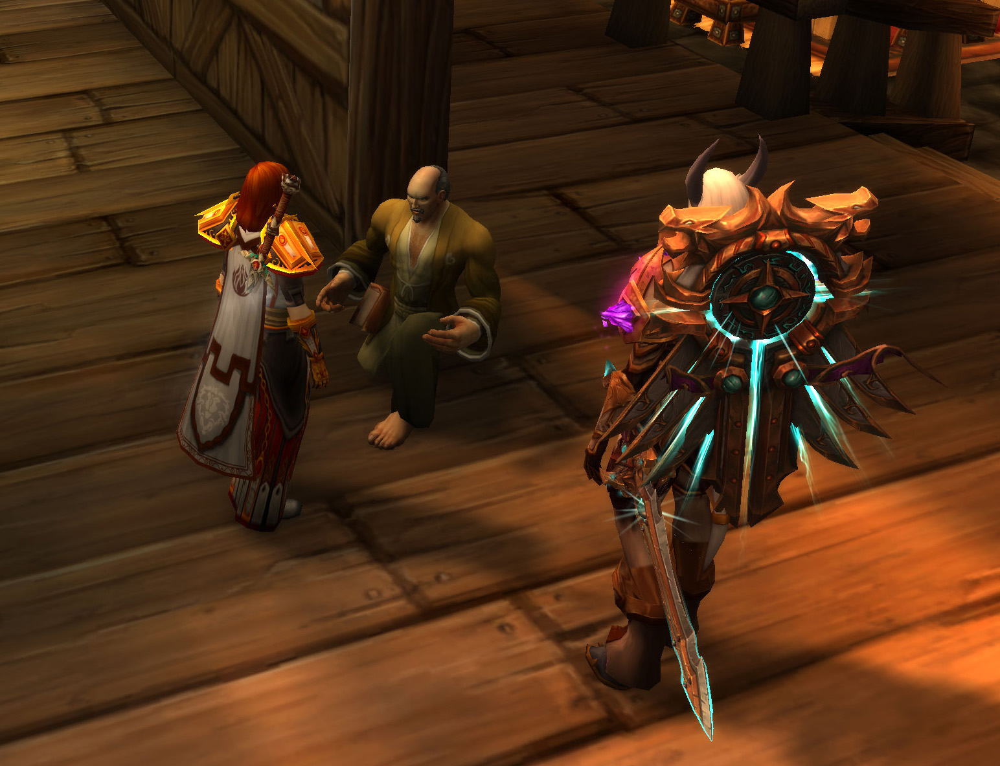

# 与阿西西修士谈到圣杯

\[法瑞雅\]: 这位修士

\[法瑞雅\]: 你是否读过许多经书？

\[阿西西修士\]: 圣光在上，让我今天见到了第二位圣光照耀的女骑士！

\[法瑞雅\]: 是的，圣光一直护佑着我，我用它的力量斩除邪恶。

\[阿西西修士\]: 请原谅我的卑微，女士，尽管我的确阅读过一些经卷

\[阿西西修士\]: 但越是探求圣光的神秘，越是感到自己作为她的仆人的无知

\[法瑞雅\]: 我只是很少见到读书的修士，大多数人都是军旅之人。所以我对你感到好奇。

\[法瑞雅\]: 圣光并不完全向你开放它的力量吗？

\[阿西西修士\]: 圣光予以您挥剑的职责，也为您的身边预备了持杖的修士

赫尔伯特向阿西西修士鞠躬。

\[阿西西修士\]: 圣光并未赐予我挥舞长剑的本领，但她一定也为我准备了什么

\[法瑞雅\]: 那是什么呢？它为你准备的。

\[阿西西修士\]: 她手中的天平更甚平静的湖面

\[阿西西修士\]: 她赐给我，日用的饮食

\[阿西西修士\]: 在我面对诱惑时，救我脱离凶恶

\[阿西西修士\]: 令我得以触摸经卷，探求她的神圣

\[阿西西修士\]: 不叫我遇见试探

\[法瑞雅\]: 我看得出来你说话都用的是古语，这让我感到熟悉。

\[阿西西修士\]: 而当圣光最终召唤我之时，我的灵魂也将享受她赐予的自由

\[圣洁裁决者\]: 向您问好

阿西西修士向你鞠躬。

\[圣洁裁决者\]: 牧师

\[法瑞雅\]: 那么说你从不怀疑圣光？

\[阿西西修士\]: 圣光在上！

阿西西修士 后退了一步

阿西西修士一看到你就害怕地退缩了。

\[圣洁裁决者\]: 圣光带给了我力量

\[阿西西修士\]: \*自言自语\*这就是您的试探么？

\[圣洁裁决者\]: 让我有能力去与命运对抗

\[法瑞雅\]: 不，我只是知道所有人都曾怀疑圣光。

\[法瑞雅\]: 尤其是圣光的使者们。

\[阿西西修士\]: 你！\*指向法瑞\*

阿西西修士指着你。

\[法瑞雅\]: 这种试探，是必经之路。

\[阿西西修士\]: 你这披着圣光赐予的铠甲！

\[阿西西修士\]: 享受着圣光赐予你挥剑的保卫者的礼物！

\[法瑞雅\]: 幸而圣光从未放弃过我。

\[法瑞雅\]: 即使在我最黑暗的日子里。

\[阿西西修士\]: 却用“所有人都曾怀疑”，为自己的软弱所狡辩！

\[圣洁裁决者\]: 我也曾怀疑圣光

\[阿西西修士\]: \*大声\*horrendum pudendu mau！\*\[古阿拉索语\]：狡辩者！\*

阿西西修士指着你。

\[圣洁裁决者\]: 但每次怀疑之后，都使我更加坚信

\[法瑞雅\]: 你认识主教吗？

\[法瑞雅\]: 我觉得他会是你的朋友。

阿西西修士向你鞠躬。

\[阿西西修士\]: 我不曾见过这种城市的主教大人，但我相信

\[法瑞雅\]: 他是普世大公圣光教会的主教，你像他提到过的那样的修士。说着古代语言。

\[阿西西修士\]: 对圣光的信仰不会因为华丽法袍而更加神圣

\[阿西西修士\]: 修行者，同样不会因为说着古阿古拉索语而愈加接近她

\[法瑞雅\]: 所以你是一个朴素的修士，过着艰苦的斯多葛派般的生活？

\[阿西西修士\]: 我的确听说过您说的那个学派，女士，我也的确遇见过秉持那个学派的学者

\[法瑞雅\]: 这跟我们的骑士们不同，我们需要知道各种宫廷礼仪，以出席各式会议。暴风城的生活，已经让有的骑士忘记了北方正在遭受的亡灵侵袭。

\[法瑞雅\]: 你见过他们？在这片大陆上？

\[阿西西修士\]: \*轻轻打量法瑞\*我从您光鲜华丽的盔甲上看到了您说的这些，尊贵的女士——但这并不意味着我的指责

\[阿西西修士\]: 只要你是为了虔诚和圣光做事，当你站在最终审判的天平前的时候，不论你做过的事情曾经多么违反甚至破坏世俗准则，你都会因为这份虔诚而得到救赎的。

\[法瑞雅\]: 但是骑士团的使命是恢复洛丹伦的荣光。有的骑士认为我们已经忘记了这件事。他们甚至可能会挑起骑士团的内战。

\[法瑞雅\]: 当然，像我所说的，圣光从未放弃过我。我也一直使用着它的力量。

\[阿西西修士\]: 洛丹伦的荣光？\*阿西西发出平淡的疑问\*

\[阿西西修士\]: 对于圣光的仆人而言，应当明白

\[阿西西修士\]: 圣光的归于圣光，而莱恩的，归于莱恩

\[法瑞雅\]: 我们大部分骑士都来自这古老的国家。也想要回到北方。但骑士团已经驻扎在暴风王国很多年了。

\[法瑞雅\]: 久到我们之中有的人已经忘记了自己来自哪。

阿西西修士 没有继续反驳，他意识到法瑞似乎想继续说什么

\[法瑞雅\]: 这就是目前骑士团可能遇到的最大威胁。不过，近来，我们得知了圣杯的事。

\[法瑞雅\]: 那是骑士团的三大圣物之一，它可能重新显现在这个世界上。

\[阿西西修士\]: 是骑士团的圣物，而非圣光的圣物

阿西西修士 轻声小心纠正

\[法瑞雅\]: 这有可能。因为骑士团的圣物通常都有争议。甚至不能确定它们是否神圣。

\[法瑞雅\]: 比如说，第一件圣物，真理圣契。相传它记录了神圣干涉神术。

\[法瑞雅\]: 这种神术会让使用者立即死亡，以保护一个人一段时间。它会要了圣骑士的命！

阿西西修士 听到圣物的名字，皱着眉头翻开了手上握着的笔记

阿西西修士向你鞠躬。

\[法瑞雅\]: 所以教会并不同意骑士团使用这样的圣物。

阿西西修士 打量了打量法瑞胸前的徽记

\[法瑞雅\]: 我们也因此有了分歧。

\[法瑞雅\]: 当然，这不是最大的分歧……

\[法瑞雅\]: 曾经有一天，如今那一天被叫做黑色星期五。原本是骑士团将要覆灭的一天。

\[阿西西修士\]: 尊贵的女士，请恕我未曾听说过这件“圣物”的名字，但从您的徽记上看来，得到王国承认的骑士团，应当有使用“副器”的权力

阿西西修士向你鞠躬。

阿西西修士 固执地纠正着法瑞的用词

\[法瑞雅\]: 我们驻扎在暴风王国已经很久了，确实得到了他们的承认。

阿西西修士对你点了点头。

\[法瑞雅\]: 我们的徽记……虽然看起来很像那个什么徽记你知道。

\[法瑞雅\]: 但是它确实是代表炙热的心，燃烧的心。

\[阿西西修士\]: 圣光赐与的热情与勇气

\[阿西西修士\]: 赞美圣光\*轻声祈祷\*

\[法瑞雅\]: 第二件圣物，命运之剑。

\[法瑞雅\]: 这是一把专门杀圣骑士的剑。

\[阿西西修士\]: ！

\[法瑞雅\]: 曾经有一个兽人用它杀死了一个圣骑士，它因此得名。

\[法瑞雅\]: 此后命运之剑就一直保管在骑士团的圣剑骑士手中。

\[法瑞雅\]: 象征着对任何背弃圣光的圣骑士的审判。

\[法瑞雅\]: 这是第二件圣物。

\[阿西西修士\]: Liberavi animam meam \*\[古阿拉索语\]：愿骑士的灵魂得以自由\*

\[法瑞雅\]: 第三件圣物，就是圣杯了。连我也不清楚它的来历和作用。

\[阿西西修士\]: \*固执地纠正\*……副器……

阿西西修士向你鞠躬。

\[法瑞雅\]: 但是近来它重现世间，骑士团估计有守护它的使命之类的。

\[法瑞雅\]: 一种古老的契约。

\[阿西西修士\]: 圣光的确会赐予凡人以考验

\[法瑞雅\]: 但是我认为……只有内心纯洁，正义的圣骑士能寻找到圣杯。

\[阿西西修士\]: 也许这正是对贵团勇气与虔诚的试炼

\[法瑞雅\]: 这样的骑士，倒真要看骑士团里有没有了。我本人估计不算是。

\[阿西西修士\]: 请您不要低估自己，尊贵的女士

\[阿西西修士\]: 圣光永远照拂她的仆人

\[法瑞雅\]: 绝对的正义是一件危险的事。

\[法瑞雅\]: 对于这样的人和他周围的人而言。

\[法瑞雅\]: 所以我同意，骑士团的圣物并非一定是圣光的。

\[阿西西修士\]: \*再次固执地纠正\*……副器……

\[阿西西修士\]: \*轻声咳嗽\*……咳咳，尊贵的女士，我想您所说的副器

\[法瑞雅\]: 它们带有一系列的矛盾和危险的地方。

\[阿西西修士\]: 同样是圣光的造物，也许也因此得到了圣光的恩赐

\[法瑞雅\]: 不过骑士团本来就有争议。

\[阿西西修士\]: 而虔诚的圣光的仆人

\[法瑞雅\]: 在黑色星期五的那一天，我们差点遭到了毁灭。

朱斯提尼阿诺 看见法瑞雅，微微颔首

\[法瑞雅\]: 就是我跟你说的主教的前一任主教。

阿西西修士 露出疑惑的神色

\[法瑞雅\]: 他认为骑士团是异端邪说，因此想要将它毁灭。

\[阿西西修士\]: 圣光让人用谦卑滋养自己

\[阿西西修士\]: 而恶魔让人用傲慢炫耀自己

\[法瑞雅\]: 所以这就要看你怎么看了，毕竟我们戴着这个徽章。

\[阿西西修士\]: 您说的这位主教

\[阿西西修士\]: 愿圣光原谅这迷途的羔羊，

\[阿西西修士\]: 不论他是否在生时被恶魔所引诱

\[阿西西修士\]: 当他的灵魂离开躯体

\[阿西西修士\]: 都是在接受圣光的审判

阿西西修士向你鞠躬。

朱斯提尼阿诺 注视着壁炉中的木柴逐渐被大火吞噬而化为灰烬，他顺手拾起一根木柴丢入火堆，而注意力全部集中在那边那个看似神父的男人身上

\[法瑞雅\]: 你真该认识他，他对圣光和你一样虔诚。虽然他有时……比较执著。

\[阿西西修士\]: 请恕我言尽于此，女士

\[阿西西修士\]: \*很小声地自言自语\*请圣光原谅您卑微的仆人，此时的畏缩与缺乏勇气

\[法瑞雅\]: 我以为你是他提到的文先生，应该不是吧？

\[阿西西修士\]: 我是苦修者阿西西，尊敬的女士

阿西西修士向你鞠躬。

\[法瑞雅\]: 我会记住你。

朱斯提尼阿诺 将昨天收到的那封奇怪的信拿出来又读了一遍，随后带着奇怪表情将其丢入火堆中

\[阿西西修士\]: 与虔信者的辩论，总是令我们对圣光的理解愈加深刻

\[法瑞雅\]: 我同意，你来自哪？

\[阿西西修士\]: 倘若女士您未有太过急迫之事，请允许阿西西为你我，以及您所将要面对的，祈祷

\[法瑞雅\]: 可以。

阿西西修士 轻轻上前一步，单膝下跪，额头深深地埋在膝盖上

阿西西修士在你面前跪下。

\[阿西西修士\]: \*埋下额头，轻声\*倘若您的铠甲与尊严，不允许您在平民面前下跪，出于对圣光的虔诚，苦修者阿西西仍然请求女士您，在祈祷时闭上眼睛

法瑞雅 闭上眼睛。

\[阿西西修士\]: \*轻声祈祷\*看哪！

阿西西修士在你面前跪下。

\[阿西西修士\]: \*轻声祈祷\*圣光要差遣这位女士，她的使者在你前面，

\[阿西西修士\]: \*轻声祈祷\*预备道路！

\[阿西西修士\]: \*轻声祈祷\*在天空中有人声喊着说：

\[阿西西修士\]: \*轻声祈祷\*“预备圣光的道，修直使者的路。”

\[阿西西修士\]: \*轻声祈祷\*荆棘之地的黑暗笼罩着骑士团

\[阿西西修士\]: \*轻声祈祷\*但是圣光就在前面

\[阿西西修士\]: \*轻声祈祷\*天空中有人大喊：

\[阿西西修士\]: \*轻声祈祷\*“看哪！”

朱斯提尼阿诺 看着熊熊燃烧的壁炉之火，他的注意力忽然集中在壁炉一角的一只蜘蛛身上，那只蜘蛛离火焰的深渊只有一步之遥；但是它依然在向着那个角落爬去

\[阿西西修士\]: \*轻声祈祷\*那是使者在指出圣光……

阿西西修士 阿西西的额头深深地埋在膝盖上，似乎随着祈祷而陷入了沉思，女骑士等待了良久，也不见阿西西站起身子——但是祈祷大概是已经结束了

法瑞雅 感受到圣光的力量。

阿西西修士 \| 女骑士 轻声呼唤阿西西的名字，也不得到阿西西的回应——也许已经可以离开了

