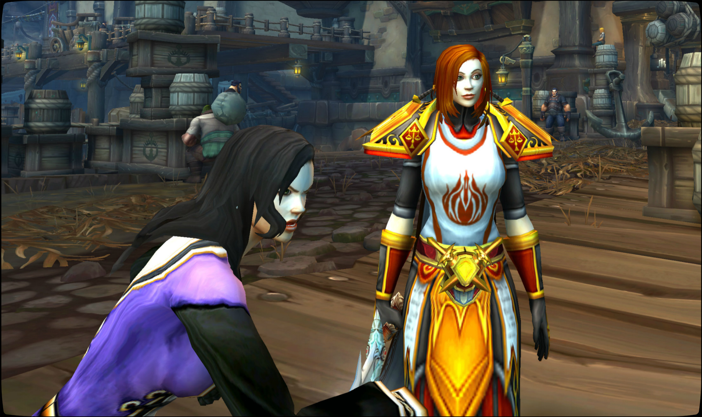
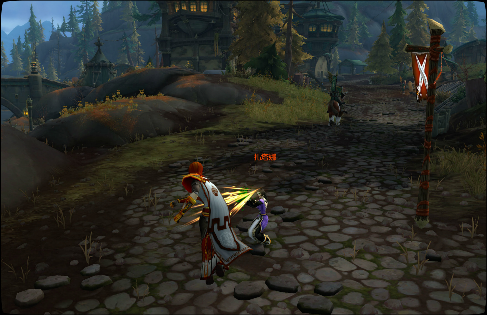
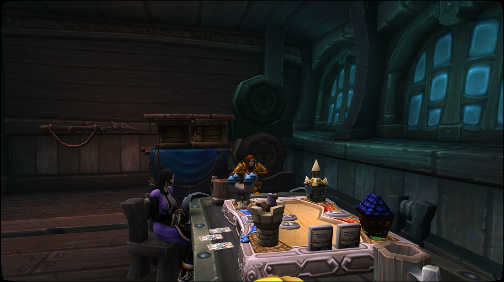

# 扎塔娜的格斗训练

记录开始于 10/20/2019 的 13:43:26。

\[法瑞雅]: 来吧，我们开始今天的训练。

\[法瑞雅]: 你要使用你的拳头。

\[法瑞雅]: 首先，握拳的方式要正确。

\[法瑞雅]: 拇指放在食指和中指之上，不要握太紧。

扎塔娜 依照指令攥紧了拳头

\[法瑞雅]: 最危险的事莫过于你出拳之后将自己的手指打断了。

\[法瑞雅]: 这会让你马上输掉这场战斗。

\[法瑞雅]: 所以拳头与对方的接触点应该是最上面的几个指节。

扎塔娜 点了点头

法瑞雅 将扎塔娜的拳头移至拳心向上。

\[法瑞雅]: 现在你可以练习一下。

\[扎塔娜]: 好的

扎塔娜 尽量保持动作的标准

\[法瑞雅]: 很好，就是这样，你的左勾拳很有力。

扎塔娜 的拳头看似很标准，但是准确度还是差一些

\[法瑞雅]: 注意一下整体的姿势，你的手不在出拳的时候应该放到和你的眼睛一样的高度。

\[法瑞雅]: 因为你需要随时格挡对方的攻击。

扎塔娜 尽力抬高自己的右胳膊

\[法瑞雅]: 格挡的时候手臂呈90度，用上全身的力量。

\[法瑞雅]: 格挡的点在前臂中部，你应该能感受到你自己的力量。

扎塔娜 有些出汗了

\[法瑞雅]: 注意拳头收回之后的位置，这点很容易忘记，在没有真正的对手的时候。

\[法瑞雅]: 很好。

扎塔娜 可以看到自己的拳头前侧有一些擦伤

\[法瑞雅]: 你逐渐掌握了。

\[扎塔娜]: 好…好的

\[法瑞雅]: 小心你的拳头，按照我说的，不要握太紧，就不容易受伤。

\[法瑞雅]: 我们来试一下你的脚踢怎么样。

\[扎塔娜]: 脚踢吗？

\[法瑞雅]: 首先是正面的踢法，这一招主要用来踢裆。

扎塔娜 长长出了一口气

\[扎塔娜]: 呃

\[法瑞雅]: 作用非常大。

\[法瑞雅]: 你能用它一招解决战斗，就不需要继续跟敌人缠斗了。

\[扎塔娜]: 我的裙子好像不太方便，不过我理解你的意思

\[法瑞雅]: 我们总是找最有效的方式。因为你如果也被敌人攻击了要害，也是一招之内解决战斗的。

\[法瑞雅]: 左脚在前，右脚在后站好准备姿势。向前向上一踢，像这样。

\[法瑞雅]: 记住脚踢出去之后，要马上收回，不然你很容易无法平衡你的身体。

\[扎塔娜]: 好的

\[法瑞雅]: 目标就是对方的裆部。

\[法瑞雅]: 你甚至不需要摆出战斗姿态也能踢到。

\[扎塔娜]: 哎呀

\[法瑞雅]: 啊！

\[扎塔娜]: 这可咋办

\[法瑞雅]: 这可是……

\[扎塔娜]: 虽然我能漂一会儿

\[法瑞雅]: 至少证明你踢得很用力。

\[扎塔娜]: 踢过头勒

\[法瑞雅]: 没事，这附近有上来的地方。

扎塔娜跪了下来。

扎塔娜 找个没人的地方抖了抖裙子

\[法瑞雅]: 你做得很好，我们可以到城外练一下。

\[扎塔娜]: 好呀

\[法瑞雅]: 来吧

\[扎塔娜]: 我上了

扎塔娜在你面前跪下。

\[法瑞雅]: 很好。

扎塔娜 大口喘着气

\[扎塔娜]: 太累了

\[法瑞雅]: 战争总是让人疲惫。

\[法瑞雅]: 你学得很好，我能看出你用上了刚才学的出拳方法。

\[扎塔娜]: 我还是喜欢躲在别人后面

扎塔娜大笑。

\[法瑞雅]: 怎么强调小心打断手指都不为过。

\[法瑞雅]: 你可以让他们意想不到。

\[法瑞雅]: 如果他们认为你是法师然后首先攻击你的话。

\[扎塔娜]: 我尽力按照你说的去做，不过你这身盔甲可真硬

\[法瑞雅]: 是的，我忘记先脱下盔甲了。

\[法瑞雅]: 你在战场上遇到的敌人也穿着盔甲。

扎塔娜 微微笑了笑，表示不在意

\[法瑞雅]: 但人体其实很脆弱，有不少关键点很容易被攻击。

\[法瑞雅]: 首先身体背后的弱点最多，比如说后颈和肾，所以不能把背后留给敌人。

\[扎塔娜]: 好吧，你说的对

\[法瑞雅]: 其次正面整个头部和脖子也很脆弱，如果一个人没戴头盔，那么都是可以被你攻击到的。

\[扎塔娜]: 嗯，也许我的法术可以瞄准这些地方

\[法瑞雅]: 对，那样效率就更高了。

\[法瑞雅]: 下雨了，我们回去吧。

扎塔娜 坐在椅子上揉了揉自己酸痛的膝盖

\[法瑞雅]: 这里是个不错的战旗室，骑士团暂时就驻扎在这里。

\[法瑞雅]: 对了，你一直没说过你的过去。

\[法瑞雅]: 你来自哪？

扎塔娜 轻轻笑了一下

法瑞雅 抿了一口清凉的泉水。

\[扎塔娜]: 我出生在北郡

\[扎塔娜]: 战争年代，我在兽人的嚎叫声中出生

\[法瑞雅]: 嗯，我也是在战争中出生的，然后各种征战就从来没停止过。不过我是在北方，洛丹伦的壁炉谷。

\[扎塔娜]: 也许我的处境没有你那么严峻，所以自我记事开始，我的父母就送我去和北郡的法师们学习

\[法瑞雅]: 啊那你是从小就开始掌握魔法了。

\[扎塔娜]: 我还能趁着每年兽人休息的时候外出学习

\[扎塔娜]: 对于我这种女生，恐怕只有魔法适合我

\[法瑞雅]: 魔法确实是令人着迷的东西。

扎塔娜 听到这里意味深长的叹了口气

\[扎塔娜]: 是的，也影响了我的生活

\[法瑞雅]: 好的，今天你完成了你的第一个试炼，就是格斗训练。

\[扎塔娜]: 下一步呢？

\[法瑞雅]: 以后我会要你去寻找骑士团的历史。

\[扎塔娜]: 哇哦，听起来很有趣

\[法瑞雅]: 除了这件事，我还提到了骑士团的一个圣物可能出现了。

\[扎塔娜]: 嗯，我没听说过那个东西

\[法瑞雅]: 就是真理圣契，我们以为我们已经在和亡灵天灾的战斗中失去了它。

\[法瑞雅]: 你看，我施放祝福。

\[法瑞雅]: 就是这本书，但是我们在施放祝福的时候拿的只是它的影像版。

扎塔娜 点了点头

\[法瑞雅]: 它可能重新出现在这个世界上了，我听说，所以我们很可能会趁着部落和联盟停战的间隙，去寻找它。

\[扎塔娜]: 太好了

\[法瑞雅]: 嗯，今天的训练就到这了，你可以解散了。之后我会安排你了解骑士团历史的任务的。

\[扎塔娜]: 那我等待你的指示勒

你满怀敬意地向扎塔娜致礼。

扎塔娜向你鞠躬。

\[扎塔娜]: 再会
