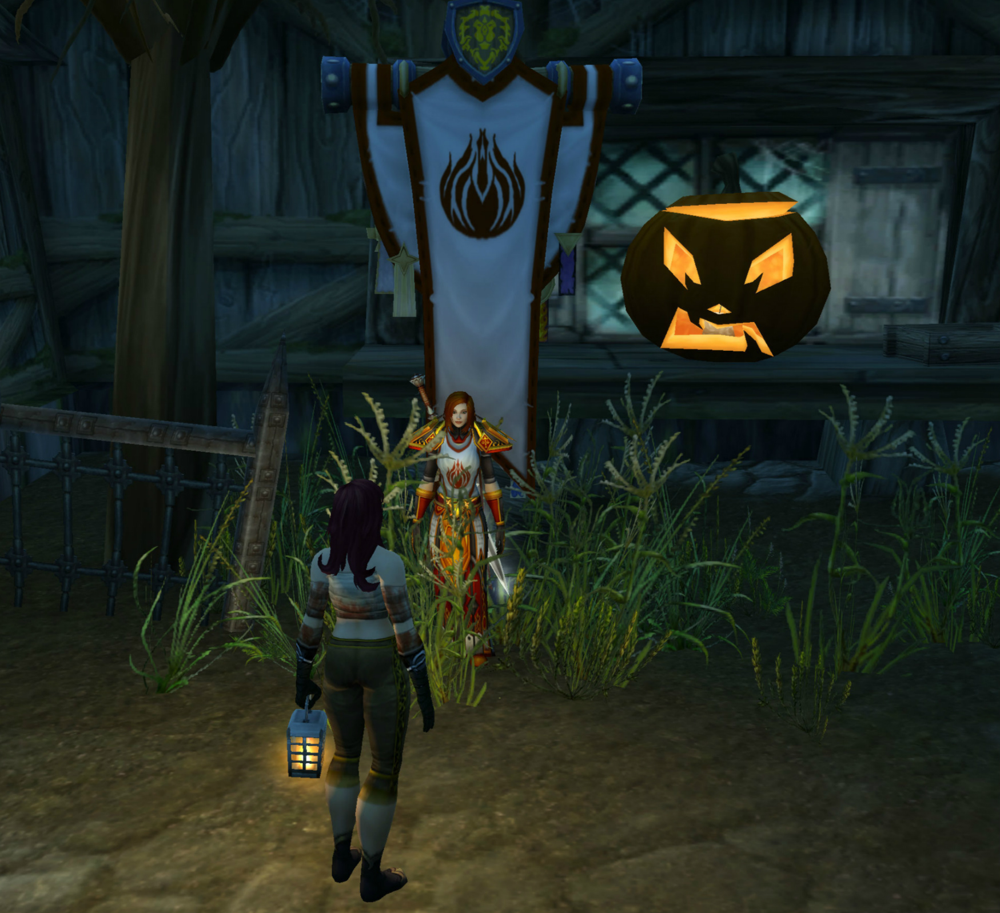

# 扎塔娜寻找帕拉斯的救赎

扎塔娜向你挥手致意。

你满怀敬意地向扎塔娜致礼。

\[扎塔娜\]: 晚上好啊

\[法瑞雅\]: 扎塔娜，今晚有空不？

\[扎塔娜\]: 嗯.有“一丢丢”时间，有什么指示吗

\[法瑞雅\]: 那你可以去寻找一个骑士团的历史。

希尔露娜对着卡琳丶纳菲尔吹了一声口哨。

\[扎塔娜\]: 好啊

\[法瑞雅\]: 这是一段悲剧性的国王，我们的大团长帕拉斯·圣剑的头颅被血精灵砍下盗走了。

\[扎塔娜\]: 呃，听着真血腥

\[法瑞雅\]: 是的，这是一段悲剧而血腥的过往。

\[法瑞雅\]: 《帕拉斯的救赎》。

\[法瑞雅\]: 这本书被藏在提瑞斯法林地丧钟镇铁匠铺里的骑士团铁箱里。

\[法瑞雅\]: 这是骑士团最黑暗的一段往事。

\[法瑞雅\]: 你能去找回这本书吗？

\[扎塔娜\]: 呃

\[扎塔娜\]: 那个地方，现在也许是一片废墟了吧

\[法瑞雅\]: 那个地方十分危险。

\[法瑞雅\]: 你要躲过部落的眼睛。

扎塔娜 翻看着地图

\[扎塔娜\]: 好吧，我记下了

\[扎塔娜\]: 我尽力去试试

\[法瑞雅\]: 好的，一定要小心。

\[法瑞雅\]: 这段历史既黑暗又危险。

\[扎塔娜\]: 我得去找暴风城的朋友们送我一次“特快旅行”了

记录开始于 10/23/2019 的 21:29:13。

\[扎塔娜\]: 嘀嘀嘀，已经安全穿过暴风城的传送门来到阿拉希高地，接下来会尝试穿过希尔斯布莱德丘陵

\[法瑞雅\]: 好的，收到通讯，注意安全。

\[法瑞雅\]: 在帕拉斯的头颅被砍下后，我曾经带着塞斯克深入部落的领地找他。

\[法瑞雅\]: 最后是血精灵索拉把我们护送出来，才安全无恙。

\[扎塔娜\]: 哈 希望这里已经没人看护了

\[法瑞雅\]: 近来亡灵已经全面撤退了我认为，我们在洛丹伦之战打垮了他们。

\[扎塔娜\]: 我听说了，不过不知道有没有余孽

\[扎塔娜\]: 受到攻击，通往塔伦米尔的路上，仍有一个亡灵据点

\[扎塔娜\]: 幸好我的马快，我现在躲在树林里，我得绕路了

\[法瑞雅\]: 是的，尽量躲过他们的眼睛。

\[扎塔娜\]: 塔伦米尔的亡灵已经撤退了，一路上没有受到骚扰，不过奥特兰克废墟，已经被食人魔占领了，为了我的骡子不被吃掉，我得收起通讯器加速前进了，晚些联系

\[法瑞雅\]: 收到。

\[扎塔娜\]: 嘀嘀~已经抵达寒风营地，安多哈尔仍有小股被遗忘者军队，我必须带上伪装面具向西绕路了。稍后联系

\[法瑞雅\]: 这是一趟辛苦的旅程，而结果甚至不足以配上它，但这能让你了解骑士团的过往。我们的过去不是一帆风顺的。

\[扎塔娜\]: 收到~\*滋滋\* 通过亡灵壁\*滋滋\*垒，信号\*滋滋\*变弱，正在前往丧钟镇

\[法瑞雅\]: 能独自一人深入亡灵的领地，需要很大的勇气。

\[扎塔娜\]: \*滋滋\*受到攻击，我必须\*滋滋\*银色黎明\*滋滋\*帮助，我\*滋滋\*附近的农场，不能离开\*滋滋\*~信号中断

\[法瑞雅\]: 为你祈祷，圣光与你同在，它会保护你，即使在最危险的时候。帕拉斯本人的灵魂甚至也会保护你。

\[扎塔娜\]: 喂，喂喂，刚才我穿过火焰废墟的时候，受到了被遗忘者拾荒小队，我的骡子被击杀了，我拼命翻过一座矮山

\[扎塔娜\]: 误打误撞进入了丧钟镇内部，附近到处是食尸鬼，我得把辎重放在这里，轻装出发

\[法瑞雅\]: 当时大团长的头颅被砍下，也是因为援兵不足又深入部落领地。

\[法瑞雅\]: 你寻找这份失落的羊皮卷的过程，也会看见当年的情境。

\[法瑞雅\]: 帕拉斯·圣剑是骑士团的第二任大团长，也是最传奇的一位骑士。他的性格十分特立独行，也带领了骑士团经历了辉煌的日子。

\[扎塔娜\]: 我成功拿到了卷轴，刚才的景象让我还有些眩晕

\[法瑞雅\]: 刚才发生了什么事？

\[扎塔娜\]: 我仿佛看到了曾经的战斗场景，还有一场审判

\[法瑞雅\]: 是的，我们甚至有那场审判的完整记录。

\[扎塔娜\]: 刚才我碾碎了几个食尸鬼的骨头，不过还是被那里的被遗忘者卫兵发型了

\[扎塔娜\]: 我现在躲在一个帐篷里，当我打开卷轴的时候，似乎是某种精神幻象，让我看到了一些画面

\[扎塔娜\]: 好在这段时间被遗忘和那些怪物没过来

\[法瑞雅\]: 啊，确实很危险。

\[扎塔娜\]: 我想我引起他们的注意了

\[扎塔娜\]: 我要释放一个传送法术了

\[扎塔娜\]: 希望一切顺利

\[法瑞雅\]: 有经验的法师的传送术总不会出错。

\[扎塔娜\]: 圣光在上，我

\[扎塔娜\]: 啊，我回来了

\[法瑞雅\]: 你看起兰安全无恙。

\[扎塔娜\]: 哈？

\[法瑞雅\]: 至少是活着回来了，不像帕拉斯。

扎塔娜 脱下了自己的长袍

\[扎塔娜\]: 安全无恙？

扎塔娜 指着自己身上染血的绷带

\[法瑞雅\]: 啊，这些伤口。

\[法瑞雅\]: 我必须为你祈祷。

扎塔娜 又把长袍穿上了

\[扎塔娜\]: 这还是幸好有这个\[女性牛头人面具\]

\[扎塔娜\]: 寒风营地的人给我的

扎塔娜 随手扔下了面具

\[法瑞雅\]: 多亏了这个面具。

\[希尔露娜\]: 一般人类叫我希尔

\[法瑞雅\]: 至少是让你活着回来了。

\[扎塔娜\]: 是的，还带回了卷轴

扎塔娜 有些疲惫地坐下来

\[法瑞雅\]: 现在你知道当时发生了什么事了吧。他们孤立无援。

\[法瑞雅\]: 塞拉夫并没有赶到，而他们都被包围了。

\[法瑞雅\]: 血精灵取走帕拉斯的头颅甚至是为了羞辱骑士团。

\[扎塔娜\]: 如果那个场景是真的，我很惊叹有一部分能活着回来

\[扎塔娜\]: 我是说如果辛多雷真的施压的话，他们根本不能活着出来

\[法瑞雅\]: 是的，他们当时应该没有往死里去，只是想羞辱我们。他们的目的达到了。

\[法瑞雅\]: 不过这个故事，有一个光明的结局。

\[扎塔娜\]: 真是令人厌恶的计谋

\[法瑞雅\]: 《帕拉斯的救赎 – 结局1》

\[法瑞雅\]: 这本书藏在暴风城艾林·提亚斯的奶酪店二楼的骑士团奶酪盒里。

\[扎塔娜\]: 哦？我倒是很好奇他复活没有

\[法瑞雅\]: 如果你能在绝望中看见希望的话，那这是好的结局。

\[法瑞雅\]: 帕拉斯是一个传奇的圣骑士，他的故事远不止于此。

扎塔娜 对希望这个词汇没什么特别的感触

\[扎塔娜\]: 好吧

\[扎塔娜\]: 明天我去找找看，这回应该不会那么惊险刺激了

扎塔娜 揉了揉受伤的左肩膀

\[法瑞雅\]: 是的，明天再去吧。

\[扎塔娜\]: 我需要好好休息一下，还有一些倒刺得拔出来

扎塔娜 吐了吐舌头

\[法瑞雅\]: 圣光照耀你。

扎塔娜 感觉到一股暖流穿越全身

\[扎塔娜\]: 谢谢，我感觉好多了，一个好觉会有助于我的恢复

\[扎塔娜\]: 我先去休息拉

\[法瑞雅\]: 晚安。

\[扎塔娜\]: 晚安

