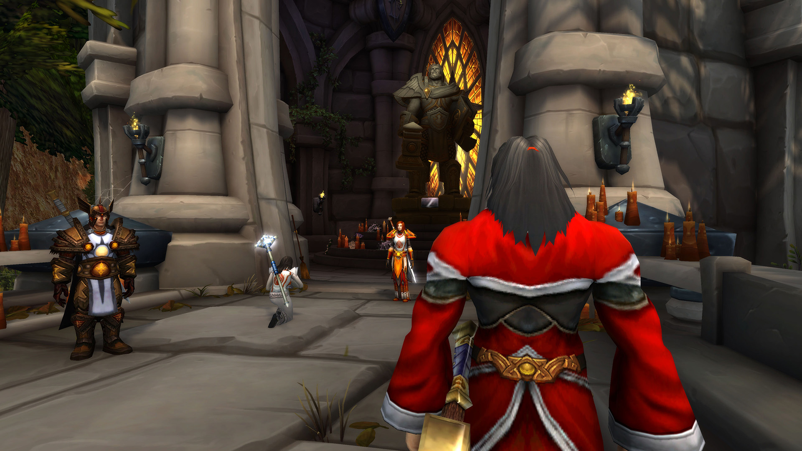
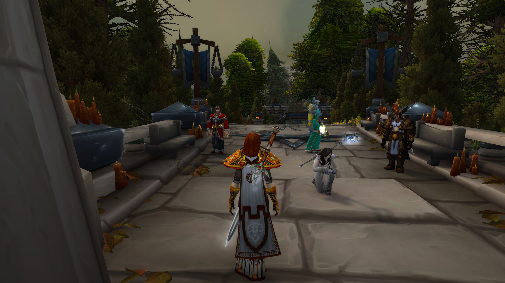

# 朱丝缇雅晋升光明骑士

记录开始于 07/11/2021 的 20:21:09。

杜维丶贝里席满怀敬意地向你致礼。

\[法瑞雅\]: 你来了。

\[杜维丶贝里席\]: 我是第一次来这里，大团长

\[杜维丶贝里席\]: 这儿和我想象中的不太一样。

\[法瑞雅\]: 乌瑟尔之墓被重新修整过，更像一个真正的圣地。

杜维丶贝里席对你点了点头。

杜维丶贝里席跪了下来。

\[杜维丶贝里席\]: 这儿就是我们的驻地吗？

\[法瑞雅\]: 不，但这是我们的圣地。

\[杜维丶贝里席\]: 乌瑟尔爵士是个真正的英雄

杜维丶贝里席 揉了揉自己的膝盖

朱丝缇雅跪了下来。

杜维丶贝里席干咳了几下。

朱丝缇雅跪了下来。

杜维丶贝里席跪了下来。

法瑞雅 \| 高阶牧师赛尔丹尼斯 说: 骑士们，很高兴见到你们。

朱丝缇雅 静静的感受着平静的内心

朱斯提尼阿诺 抬头看着礼拜堂内乌瑟尔巨大的雕像，神情复杂

\[法瑞雅\]: 乌瑟尔长眠于此，这里永远是我们的圣地。

朱斯提尼阿诺 深吸一口气，将视线转到法瑞雅身上

\[法瑞雅\]: 我们开始今天的仪式吧。

朱斯提尼阿诺 微微颔首

朱丝缇雅 平静的点点头，她已经准备好接受这神圣的时刻

\[法瑞雅\]: 朱丝缇雅因为她的勇气和领导能力，将晋升成为光明骑士。

朱丝缇雅 点头致意

\[法瑞雅\]: 首先，是圣诗仪式。

\[法瑞雅\]: 在圣光的感召下，我们齐聚在此，

\[法瑞雅\]: 让神圣力量在我们的兄弟身上流淌。

朱斯提尼阿诺 的视线聚焦在朱丝缇雅身上，虽然在一些事情上这个女人显得稍显软弱，但在事务的处理和问题的手段上自己还是认可的

\[法瑞雅\]: 在光之辉的照耀下，她将获得新生。

\[法瑞雅\]: 在光之力量的支持下，她将指引她的人民。

\[法瑞雅\]: 在光之勇气的武装下，她将与阴影战斗。

\[法瑞雅\]: 以及，在光之智慧的召唤下，她将领导她的同胞们去分享天堂中永恒的荣耀。

\[法瑞雅\]: 朱丝缇雅，你有准备祝圣的话语吗，如果有，现在是说它们的时候。

\[朱丝缇雅\]: 我将奉行骑士团的准则，服务于圣光和大团长，永不背叛

朱丝缇雅 向圣光和大团长致敬

\[法瑞雅\]: 骑士们，如果你们认为这个人值得尊敬，请施与你们的祝福。

朱斯提尼阿诺 尽管十分不喜欢这种向个人宣誓效忠的誓词，但是想到自己曾经的手段也就释然了

朱斯提尼阿诺对着朱丝缇雅叹了口气。

\[朱斯提尼阿诺\]: 祝福你，年轻的姑娘

朱斯提尼阿诺 打开系在腰间的圣契，佶屈聱牙的祷词从他嘴里缓缓念出，圣光回应了他的祈求，缓缓注入朱丝缇雅体内

朱丝缇雅 向朱斯提尼阿诺致敬

\[杜维丶贝里席\]: 额，我就敬个礼吧

杜维丶贝里席满怀敬意地向朱丝缇雅致礼。

\[法瑞雅\]: 很好，接下来是誓言。

朱丝缇雅 向杜维丶贝里席致敬

\[杜维丶贝里席\]: 我不会法术，真的

\[法瑞雅\]: 你，朱丝缇雅，是否宣誓接受炙热之心骑士团的荣誉与规章？

杜维丶贝里席 向朱斯提尼阿诺耸了耸肩

朱斯提尼阿诺 注意到身边这个陌生人携带的战袍，低声冷哼一声

\[朱丝缇雅\]: 我宣誓：我接受炙热之心骑士团的荣誉与规章

朱丝缇雅跪了下来。

\[法瑞雅\]: 你发誓会感召圣光的恩惠，并将其智慧在你的追随者之中传颂吗？

\[朱丝缇雅\]: 我发誓：我会感召圣光的恩惠，并将其智慧在我的追随者中传颂

\[法瑞雅\]: 你发誓，不论在何时何地，只要发现邪恶的存在，你就会毫不犹豫将之粉碎，用你的每一滴血去保护弱小和无辜吗？

\[朱丝缇雅\]: 我发誓：不论何时何地，

朱丝缇雅跪了下来。

\[法瑞雅\]: 那么站起来吧——光明骑士，欢迎加入炙热之心骑士团。

\[朱丝缇雅\]: 为了圣光

杜维丶贝里席向朱丝缇雅大声喝彩。真棒！

朱斯提尼阿诺 看着朱丝缇雅，嘴角微微扬起，扭成一个微笑的弧度

\[朱丝缇雅\]: 阿诺你这个笑容

\[朱丝缇雅\]: 比哭还难看

\[杜维丶贝里席\]: 恭喜您，朱斯提亚大人

朱斯提尼阿诺对着朱丝缇雅耸了耸肩说：“天知道。”

\[朱丝缇雅\]: 谢谢，这位骑士

\[杜维丶贝里席\]: 以后叫我杜维就好了。

