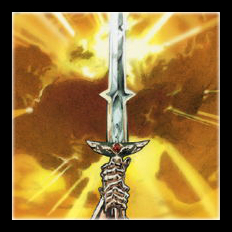
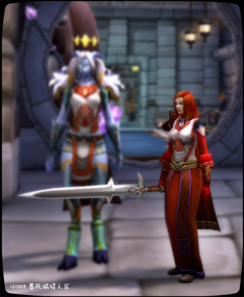
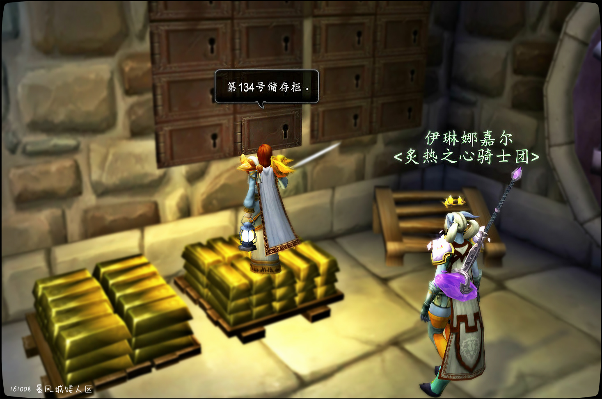
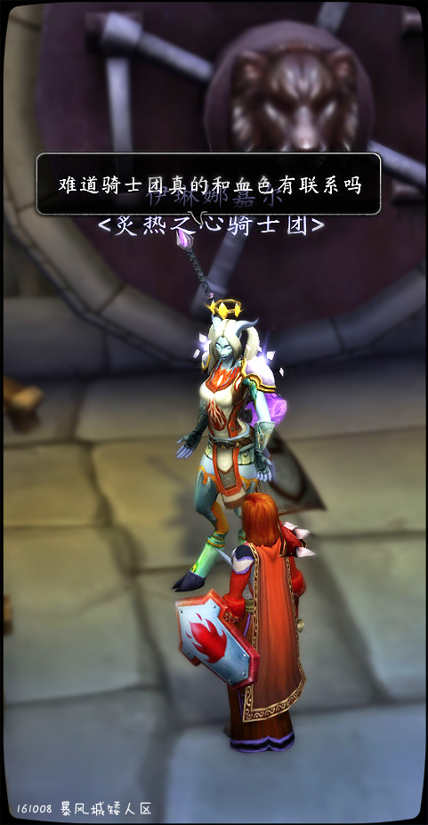
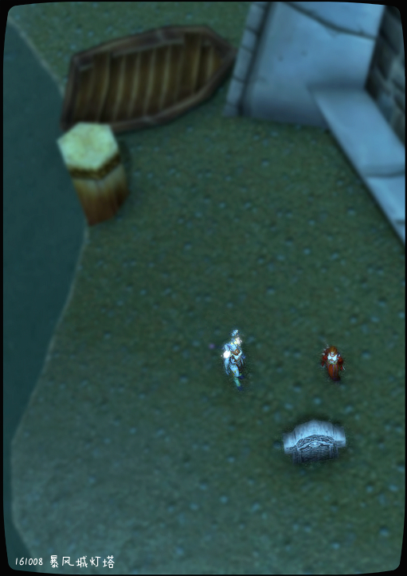
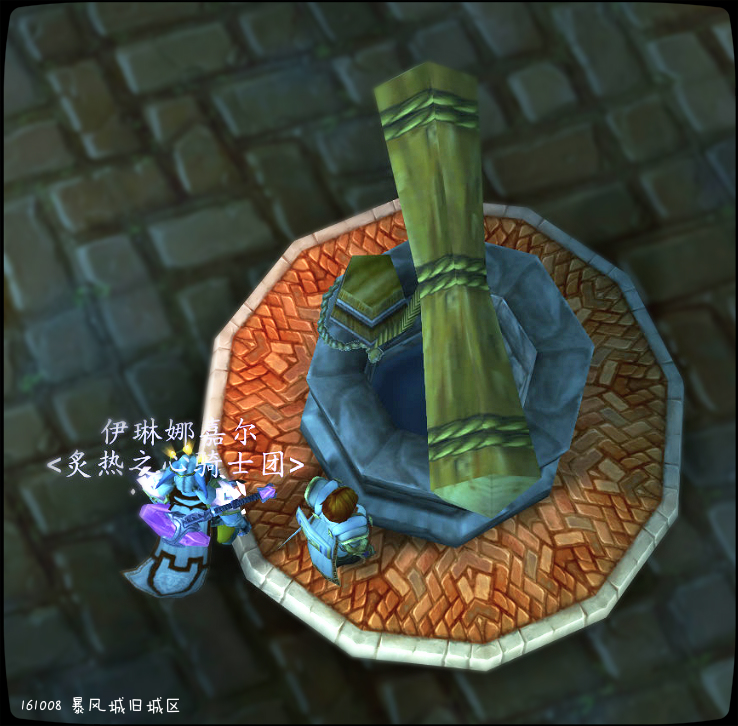

# 第二幕 命运之剑

第二幕 命运之剑

次日骑士团的法瑞和天威骑士伊琳娜嘉尔为了躲避调查，藏匿了骑士团的所有秘密。这些秘密包括：骑士团里有70%的前血色十字军成员，第五任大团长法瑞杀死了第二任大团长帕拉斯·圣剑，骑士团的银行系统里有巨额财富。血色十字军徽章被弃置在暴风城灯塔下的海里，圣剑骑士的圣剑\[命运]则被悬挂在暴风城旧城区的枯井中。骑士团如今就像枯井中悬挂的命运之剑，无法掌握自己的命运。

命运之剑完整记录见《命运之剑》


命运之剑小说见\[110]炙热之心骑士团的复兴-第三章 命运之剑

法瑞雅 将剑挂到暴风城旧城区的井绳上

\[伊琳娜嘉尔]: 这口枯井

法瑞雅 将剑慢慢沉进干枯的井中

伊琳娜嘉尔 感到有些不舒服

\[法瑞雅]: 这或许是它的“命运”吧。

\[伊琳娜嘉尔]: 大人，我们是不是做出太多牺牲

\[法瑞雅]: 有一天我们会来取回它。

\[伊琳娜嘉尔]: 好吧

\[伊琳娜嘉尔]: 我也希望如此

\[法瑞雅]: 然后重新把握我们自己的命运。

命运之剑

威廉的审判后，贤者尼苛徳摩要求对骑士团的合法性进行调查。炙热之心骑士团行事正义，并没有什么好掩盖的，不是吗？

记录开始于 10/08/2016 的 12:07:21。

伊琳娜嘉尔向你鞠躬。

\[伊琳娜嘉尔]: 大人，我接到来信后马上就赶来了

\[伊琳娜嘉尔]: 骑士团遇到了什么麻烦？

法瑞雅 用钥匙打开柜门

法瑞雅 再次确保没有人

法瑞雅 将柜里的东西小心翼翼地拿出来

伊琳娜嘉尔 站在法瑞身后，她感觉有点紧张

法瑞雅 那是一叠红色的战袍

伊琳娜嘉尔 惊讶地看着法瑞穿上战袍

\[伊琳娜嘉尔]: 这，，，是

\[伊琳娜嘉尔]: 血色（低语）

\[伊琳娜嘉尔]: 圣光在上

法瑞雅 安抚伊琳娜嘉尔

\[法瑞雅]: 是时候让你看到这些了，年轻的骑士。

\[伊琳娜嘉尔]: 难道骑士团真的和血色有联系吗

\[伊琳娜嘉尔]: 可您是那么圣洁勇敢

法瑞雅 叹了一口气

\[伊琳娜嘉尔]: 和那些记载里的完全不一样

法瑞雅 再将其它血色战袍拿了出来

法瑞雅 柜里至少有15件

伊琳娜嘉尔 对这些血色战袍感到惊讶

\[伊琳娜嘉尔]: 大人，虽然我不太明白

\[伊琳娜嘉尔]: 但您现在似乎已经和血色十字军

\[伊琳娜嘉尔]: 不再有更多联系了吧

\[法瑞雅]: 没有关系我知道，但是……

\[伊琳娜嘉尔]: 为何还要保留这些？

\[法瑞雅]: 我……

\[法瑞雅]: 我想念他们。

\[伊琳娜嘉尔]: 也许作为一个德莱尼无法理解这些

\[法瑞雅]: 他们都是一个个活着的人，对我而言，不是“嗜血的血色十字军

\[伊琳娜嘉尔]: 但是我愿意支持您

\[伊琳娜嘉尔]: 我对圣光有过试验

伊琳娜嘉尔满怀敬意地向你致礼。

\[法瑞雅]: 主教尼苛德摩将要对我们进行调查。

\[法瑞雅]: 这些战袍只是第一批要扔掉的东西。

\[伊琳娜嘉尔]: 好吧，我看出麻烦的所在了

\[法瑞雅]: 我拜托你帮忙处理骑士团在暴风城的金币。

\[伊琳娜嘉尔]: 这些财产要转移哪里

\[法瑞雅]: 那些，对于世俗之人，可能是更大的引诱，虽然我相信教会……好吧我希望教会不是为了那些。

\[法瑞雅]: 转移到铁炉堡。

伊琳娜嘉尔 拿出小手册耐心地记录骑士团保险柜编号

\[伊琳娜嘉尔]: 矮人能抗拒那些主教的审查吗

.jpg>)

\[法瑞雅]: 还有这个（示意伊琳娜嘉尔跟上）

伊琳娜嘉尔 看来今天还有更多惊喜

法瑞雅 拿出一把巨剑

\[伊琳娜嘉尔]: 这是？

法瑞雅 剑柄锋利，而且有独特的纹饰

\[法瑞雅]: 它曾被圣剑骑士所拥有。

\[法瑞雅]: 它有一个名字，叫“命运”。

\[伊琳娜嘉尔]: 您是指帕拉斯先生？

\[法瑞雅]: 是的，命运之剑。

\[法瑞雅]: 听我说……

\[伊琳娜嘉尔]: 但听您说他已经堕落了

\[法瑞雅]: 圣剑骑士不会再回来了，我……

伊琳娜嘉尔 对眼前的事情感到棘手

法瑞雅 难堪

法瑞雅 还在犹豫

\[伊琳娜嘉尔]: 这把剑也要转移吗

\[法瑞雅]: 你发誓你不会告诉任何一个灵魂，我将要说的话。

\[伊琳娜嘉尔]: 我以圣光之名发誓

\[法瑞雅]: 我杀了他。

\[伊琳娜嘉尔]: 什么。。。

伊琳娜嘉尔 无法相信自己的耳朵

你扑在伊琳娜嘉尔的肩膀上泣不成声。

\[伊琳娜嘉尔]: 法瑞大人，今天我必须承认是我加入骑士团以来最让我震惊的一天

\[伊琳娜嘉尔]: 但我知道您的品格

\[法瑞雅]: 所以，你还愿意跟随我吗？

\[伊琳娜嘉尔]: 我相信您做出了最有利于骑士团的事

法瑞雅 看进伊琳娜嘉尔的眼睛

\[伊琳娜嘉尔]: 您救了我和那么多德莱尼同胞

\[伊琳娜嘉尔]: 血色或者任何残忍的组织的人

\[伊琳娜嘉尔]: 不可能做这些

\[法瑞雅]: 我和圣剑骑士都曾经是血色十字军的一员。

\[伊琳娜嘉尔]: 我们德莱尼只相信自己亲眼看到的

法瑞雅 示意伊琳娜嘉尔跟上她

\[伊琳娜嘉尔]: 话说对于血色我只是在书本上读到过

法瑞雅 在暴风港口找到了一艘船

\[伊琳娜嘉尔]: 这里是？

伊琳娜嘉尔 疑惑地看着一块墓碑

\[法瑞雅]: 这是黄金狮子奥菲的墓碑。

\[法瑞雅]: 他……也曾经是血色成员。

\[伊琳娜嘉尔]: 看来骑士团和血色有很多渊源

法瑞雅 和伊琳娜嘉尔来到暴风城港口灯塔一出无名墓碑前

\[伊琳娜嘉尔]: 毕竟你们都是丹洛伦人

你跪了下来。

伊琳娜嘉尔在你面前跪下。

\[法瑞雅]: 愿你安息，我的战友。

\[伊琳娜嘉尔]: 圣光祝福您的灵魂

法瑞雅 趁着夜色走到灯塔最远端

\[伊琳娜嘉尔]: 大人，难道你真的要扔掉全部的过去？

法瑞雅 将那一包血色战袍放进用石头加重的袋子里，扔到海中

\[法瑞雅]: 别了，我的战友们！

伊琳娜嘉尔 行踪泛起一阵悲哀

法瑞雅 对伊琳娜嘉尔点头

\[法瑞雅]: 是的……因为……

你在伊琳娜嘉尔面前跪下。

伊琳娜嘉尔在你面前跪下。

法瑞雅 当然没有扔那一把剑

法瑞雅 命运之剑是骑士团最后的象征

\[伊琳娜嘉尔]: 希望这沉重 的代价

\[伊琳娜嘉尔]: 能换来好的结果

\[伊琳娜嘉尔]: 大人

\[法瑞雅]: 因为……你知道，帕拉斯圣剑，他是血色十字军的高阶指挥官。

\[法瑞雅]: 而我。

\[伊琳娜嘉尔]: 我希望您慎重考虑剑的去留

\[伊琳娜嘉尔]: 也许我们可以把它藏到了那些幻化师的虚空仓库里

\[法瑞雅]: 曾经是十字军审讯官韦沙斯的副手。

\[法瑞雅]: 他死了以后，我是说韦沙斯死后，我接替了他。

\[法瑞雅]: 所以……我真的不知道怎么面对这个“调查”。

\[伊琳娜嘉尔]: 可惜我对人类的宗教问题不是很了解

\[法瑞雅]: 我们折磨那些亡灵，向他们问话。

法瑞雅 将剑挂到暴风城旧城区的井绳上

\[伊琳娜嘉尔]: 这口枯井

法瑞雅 将剑慢慢沉进干枯的井中

伊琳娜嘉尔 感到有些不舒服

\[法瑞雅]: 这或许是它的“命运”吧。

\[伊琳娜嘉尔]: 大人，我们是不是做出太多牺牲

\[法瑞雅]: 有一天我们会来取回它。

\[伊琳娜嘉尔]: 好吧

\[伊琳娜嘉尔]: 我也希望如此

\[法瑞雅]: 然后重新把握我们自己的命运。

\[伊琳娜嘉尔]: 那么

\[伊琳娜嘉尔]: 我还想问一个问题

法瑞雅 拥抱了伊琳娜嘉尔

\[伊琳娜嘉尔]: 如果教会到头来觊觎我们的财产

\[伊琳娜嘉尔]: 或者强行要解散我们

\[伊琳娜嘉尔]: 我们是否保留使用武力的权力呢

\[法瑞雅]: 我们需要找到一些和我们的利益相同的盟友。

伊琳娜嘉尔 安慰着法瑞

\[法瑞雅]: 当然，我愿意为骑士团而死。
