# 第六幕 无可奉告

第六幕 无可奉告

骑士评议会决定：在宗教法庭上骑士团如果失利，将撤退到达拉然的据点，然后以武力保护各骑士的安全。再洗刷名誉。

然而骑士们也决定警告贤者尼苛德摩关于格里高利的阴谋。所以天威骑士伊琳娜嘉尔决定由克劳德——化名为克劳德的贵族是皇家全境保卫局特工——由克劳德出面安排尼苛德摩主教与嘉尔的见面。不料克劳德和嘉尔指出格里高利阴谋后，尼苛德摩逮捕了嘉尔以及另一位正好路过的骑士——阿海洛。只有骑士阿瑞克斯博士逃脱去警告了法瑞嘉尔的被捕。


嘉尔被捕后受到拷打，但她没有说出命运之剑的下落，直到异端审判者波尔博—血眼对她使用了吐真剂。教会获得悬挂在枯井中的命运之剑。


骑士评议会完整记录见《骑士评议会——关于如何应对教会调查》


无可奉告完整记录见《嘉尔被捕无可奉告》

.jpg>)

\[贤者尼苛德摩]: 说出圣剑的下落

\[伊琳娜嘉尔]: 圣剑

\[伊琳娜嘉尔]: 就在

\[贤者尼苛德摩]: 圣剑在哪儿

\[伊琳娜嘉尔]: 在你的。。。家里。。你这个贼

## 骑士评议会：关于如何应对教会调查

黑暗之门33年10月，炙热之心骑士团在风暴之盾举行的紧急骑士评议会。

> 骑士评议会骑士评议会将于本周五10月14日晚八点召开，讨论骑士团近期遇到的危机，以及举行新晋骑士的仪式。另外还将协力寻找骑士团的战旗。
>
> 大团长\
> 法瑞

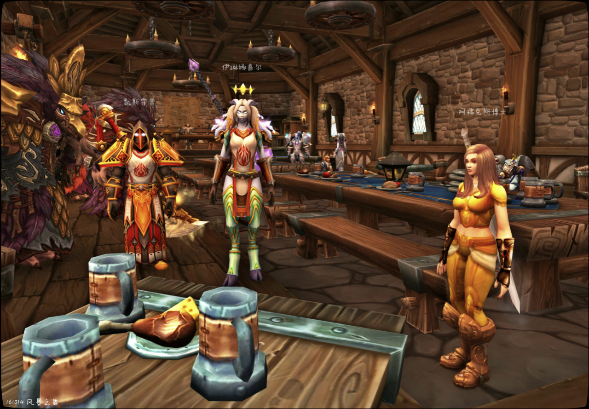

记录开始于 10/14/2016 的 08:16:57。

你满怀敬意地向阿瑞克斯博士致礼。

阿瑞克斯博士满怀敬意地向你致礼。

\[法瑞雅]: 我们进去吧。

伊琳娜嘉尔向你鞠躬。

\[伊琳娜嘉尔]: 大人，目前可以调动的的人员已经到齐了

\[法瑞雅]: 骑士评议会开始。

伊琳娜嘉尔 准备认真倾听这次评议

第一个议程：新晋的见习骑士

凯斯霍普

\[法瑞雅]: 第一个议程，新晋的见习骑士。

\[法瑞雅]: 凯斯霍普，介绍你自己吧。

阿瑞克斯博士 精神抖擞

伊琳娜嘉尔 翻开随身的手册

伊琳娜嘉尔 看了一下身边的这名男子

法瑞雅 在等凯斯霍普的回应。

\[凯斯霍普]: 我叫凯斯霍普，26岁，骑士侍从

\[伊琳娜嘉尔]: 很。。。简洁

\[法瑞雅]: 你来自暴风王国对吗？如果我没记错。

\[凯斯霍普]: 是的，我来自暴风王国

伊琳娜嘉尔 对照了一下名册，发现男性骑士居然是少数！惊讶

\[法瑞雅]: 兄弟姊妹们，记住凯斯霍普了。他现在是我们中的一员。

阿瑞克斯博士 你好！

\[伊琳娜嘉尔]: 我为你感到高兴

\[伊琳娜嘉尔]: 欢迎您

\[凯斯霍普]: 谢谢

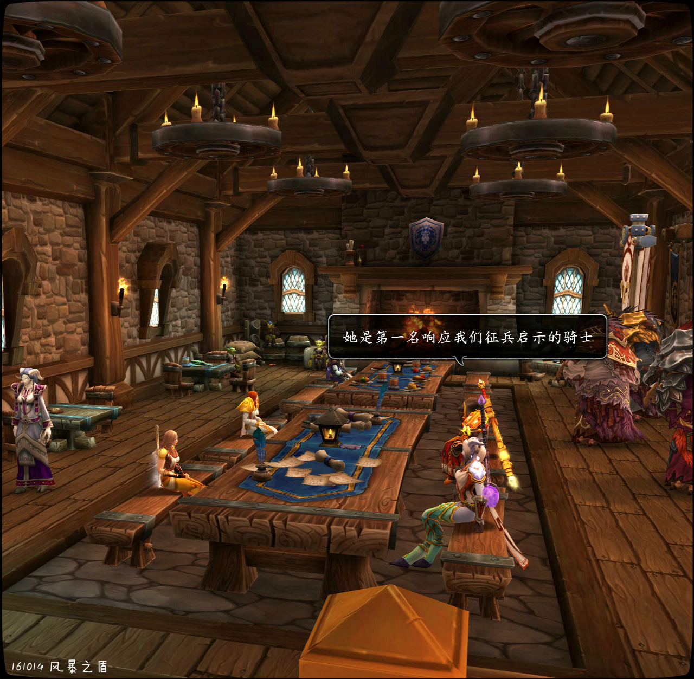

\[法瑞雅]: 阿瑞克斯博士，在骑士评议会前介绍你自己吧。

阿瑞克斯博士 欢迎 凯斯霍普

阿瑞克斯博士向凯斯霍普大声喝彩。真棒！

\[伊琳娜嘉尔]: 她是第一名响应我们征兵启示的骑士

\[法瑞雅]: 是的！

\[法瑞雅]: 她的见习骑士住圣礼在圣光秘殿，一周前。

\[阿瑞克斯博士]: 我是一名神圣骑士

\[法瑞雅]: 你让我想起了骑士团的著名骑士，巴鲁沙。

\[伊琳娜嘉尔]: 你的意思是您擅长使用圣光治疗的力量吗

\[法瑞雅]: 他也是一位神圣骑士，十分儒雅。

\[阿瑞克斯博士]: 是的

\[阿瑞克斯博士]: 我非常善于有圣光治疗受伤的战友

\[伊琳娜嘉尔]: 好吧。我已经把您的事迹记录在了骑士团的史册中

\[法瑞雅]: 你对圣光的掌握，有一天会启发很多其它骑士。

\[伊琳娜嘉尔]: 那么，团长大人

\[伊琳娜嘉尔]: 霍普的仪式要现在举行吗

\[法瑞雅]: 他和他的兄弟的仪式，已经在雄师之眠举行了。

伊琳娜嘉尔 翻了下手册，似乎已经举行了他们的仪式

\[伊琳娜嘉尔]: 好吧

\[伊琳娜嘉尔]: 我真希望骑士团里的神职人员能快点到位

\[伊琳娜嘉尔]: 我每次都要记录这些手稿和手册

伊琳娜嘉尔 无奈地把几本小手册整理好，翻开了另一卷卷轴

\[法瑞雅]: 噢，辛苦了。是的我们急需找到一位虔诚的主教……而不是……

\[伊琳娜嘉尔]: 好吧

\[阿瑞克斯博士]: 文秘

法瑞雅 面色凝重

\[伊琳娜嘉尔]: 主教的问题。。。

\[伊琳娜嘉尔]: 似乎也和今天会议的话题有关

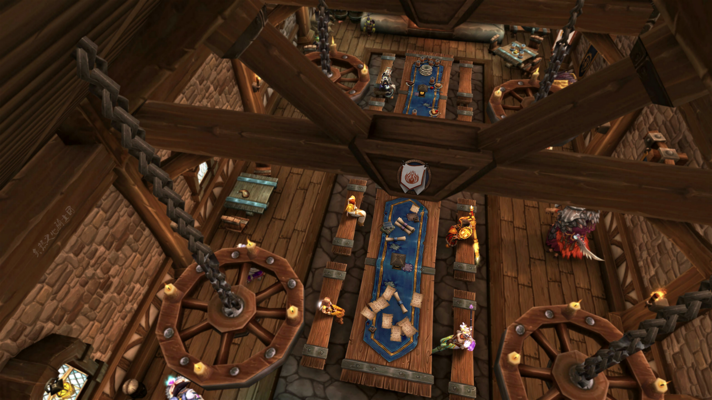

第二个议题：教会的调查

\[法瑞雅]: 目前，我们遇到的危机，就和一位主教有关。

\[伊琳娜嘉尔]: 是的，两位，我们现在遇到危机

\[伊琳娜嘉尔]: 这需要我们骑士团的成员团结一致

\[伊琳娜嘉尔]: 请法瑞大人来陈述吧

\[法瑞雅]: 圣光教会的宗主教贤者尼苛德摩下令对骑士团进行调查。

\[法瑞雅]: 并且希望派遣随军牧师。

\[法瑞雅]: 然而，由于高阶骑士评议会拒绝了他的调查。

\[法瑞雅]: 如今他会在宗教会议上谴责我们，甚至……

\[法瑞雅]: 我听说，他已经将我们定义为异端。

伊琳娜嘉尔 为此感到伤脑筋

\[阿瑞克斯博士]: 不！

\[伊琳娜嘉尔]: 对于人类的主教，我接触不多

\[阿瑞克斯博士]: 炙热之心

\[阿瑞克斯博士]: 怎么会是异端

\[伊琳娜嘉尔]: 但是没想到会变成这样

\[阿瑞克斯博士]: 我们是圣骑士

\[阿瑞克斯博士]: 是神圣的

\[法瑞雅]: 是的，我们明明是圣光的使用者。

\[阿瑞克斯博士]: 对

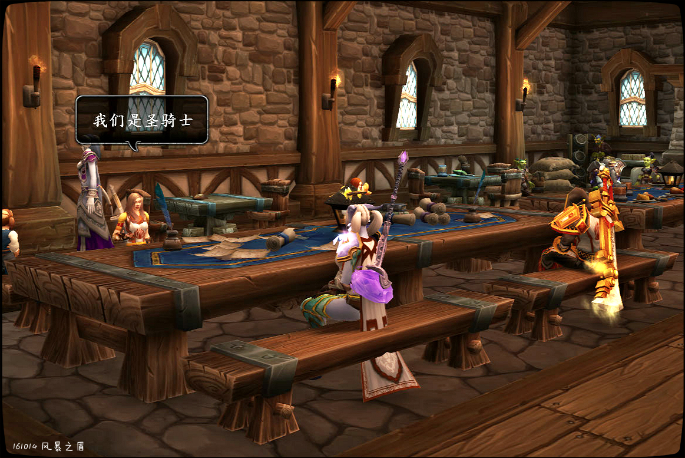

\[法瑞雅]: 但是……由于骑士团的一些过去，我们不能让教会对我们进行调查，所以只能拒绝了。

\[伊琳娜嘉尔]: 有谣传说，教会部分人员觊觎我们前辈留下的财产

\[伊琳娜嘉尔]: 处于安全考虑

\[伊琳娜嘉尔]: 我和团长将大部分财产转移了

\[法瑞雅]: 是的。

你对伊琳娜嘉尔表示感谢。

\[法瑞雅]: 几天前，这事出现了另外的波折。

伊琳娜嘉尔 认真地听着

\[法瑞雅]: 有三位辩护律师，将要在将要到来的宗教法庭上代表我们。

\[阿瑞克斯博士]: 辩护律师！

\[法瑞雅]: 贝克汉姆、伊丽莎白女王和齐达内（据说这2位在达拉然足球队待过）律师。

\[法瑞雅]: 我在湖畔镇与律师们进行交涉的时候，他们都认为虽然他们是最专业的。

\[阿瑞克斯博士]: 我想我们会经得住考验的

\[伊琳娜嘉尔]: 看来还有但是。。。

\[阿瑞克斯博士]: 但是什么呢

\[法瑞雅]: 但是，他们认为自己无法辩倒尼苛德摩主教。

\[阿瑞克斯博士]: 瞧瞧 我们会用圣光，他们有什么可说的

\[法瑞雅]: 因为尼苛德摩有很多寸不烂之舌……

\[阿瑞克斯博士]: 除非你们有什么金钱上的猫腻

\[伊琳娜嘉尔]: 很多时候事实会被诡辩所歪曲

\[法瑞雅]: 骑士团的秘密不在于金钱上，而在于我们的成员，你知道，我们大部分人是洛丹伦遗民。

\[阿瑞克斯博士]: 哦，是的

\[法瑞雅]: 而洛丹伦后来发生的事，这……（故意忽略）

\[法瑞雅]: 就在三位律师，哦我觉得我们自己要准备好辩论，他们虽然专业，但是毕竟……更像是足球律师。

\[阿瑞克斯博士]: 只是，我刚来到炙热之心就得知我们将要接受什么调查

\[法瑞雅]: 就在三位律师一筹莫展的时候，一位主教出现了。

\[伊琳娜嘉尔]: 这也许是圣光给我们的考验吧

\[法瑞雅]: 他是赤脊山石山修道院院长格里高利。

\[法瑞雅]: 如果我们能活过这一劫，我们定会更强大。

伊琳娜嘉尔 拿起笔记录，写了二次都没写对这个格里高利的名字

\[法瑞雅]: 格里高利指出了尼苛德摩的弱点。

\[伊琳娜嘉尔]: 弱点？

\[伊琳娜嘉尔]: 这太好了

\[法瑞雅]: 他说尼苛德摩出身低微，并不适合当宗主教。

\[伊琳娜嘉尔]: 这是弱点？

\[伊琳娜嘉尔]: 我。。。我无法理解

\[法瑞雅]: 格里高利要求我们设法杀死尼苛德摩，并支持他当宗主教。他就会给我们许多特权……这听起来，很不圣光对吧。

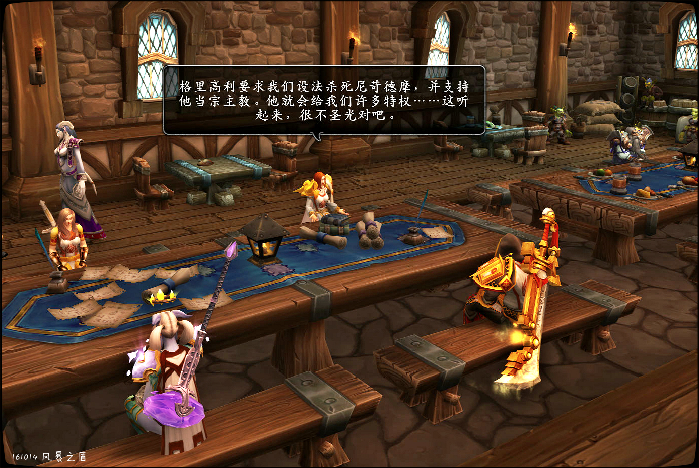

\[伊琳娜嘉尔]: 天哪

\[阿瑞克斯博士]: 是

\[阿瑞克斯博士]: 什么！！

\[伊琳娜嘉尔]: 提出这个建议的人，是一名主教？

\[阿瑞克斯博士]: 杀人！  这可是犯罪

\[法瑞雅]: 是的格里高利说尼苛德摩务农70余年，如果我们在法庭上指出这点，用他的身份羞辱他，肯定会让教会调查。

\[法瑞雅]: 三位律师建议这么做。

\[阿瑞克斯博士]: 务农

\[阿瑞克斯博士]: 哦

\[伊琳娜嘉尔]: 务农的人担任主教有什么问题吗？

\[伊琳娜嘉尔]: 我暂时还不了解人类的社会结构

\[阿瑞克斯博士]: 在土地上种吃的

\[阿瑞克斯博士]: 这能说明什么

\[伊琳娜嘉尔]: 德莱尼看来，只要领悟了圣光，无论谁都可以担任主教啊

\[伊琳娜嘉尔]: 法瑞大人

\[伊琳娜嘉尔]: 您觉得该怎么办呢

\[法瑞雅]: 我认为，格里高利的品格，简直不适合当主教。

\[法瑞雅]: 而且嘉尔提醒了我，我们不能屈服于这样的阴谋。

\[阿瑞克斯博士]: 他要求我们去杀人吗】

伊琳娜嘉尔 翻开了骑士团过往记录的手册

\[伊琳娜嘉尔]: 但是有一点

\[伊琳娜嘉尔]: 大人，我翻阅了过去的记录

\[法瑞雅]: 我们都是杀过人的人，但是我们——如果我们还要坚持骑士规条的话，这明显是卑劣的行为。

\[法瑞雅]: 如果我们在辩论上输掉，后果同样不堪设想。

\[伊琳娜嘉尔]: 这个，帕拉斯圣剑大人曾经在自己的记录写过这样一段话：政治是无法回避的，骑士团的胜利也无法躲开政治！

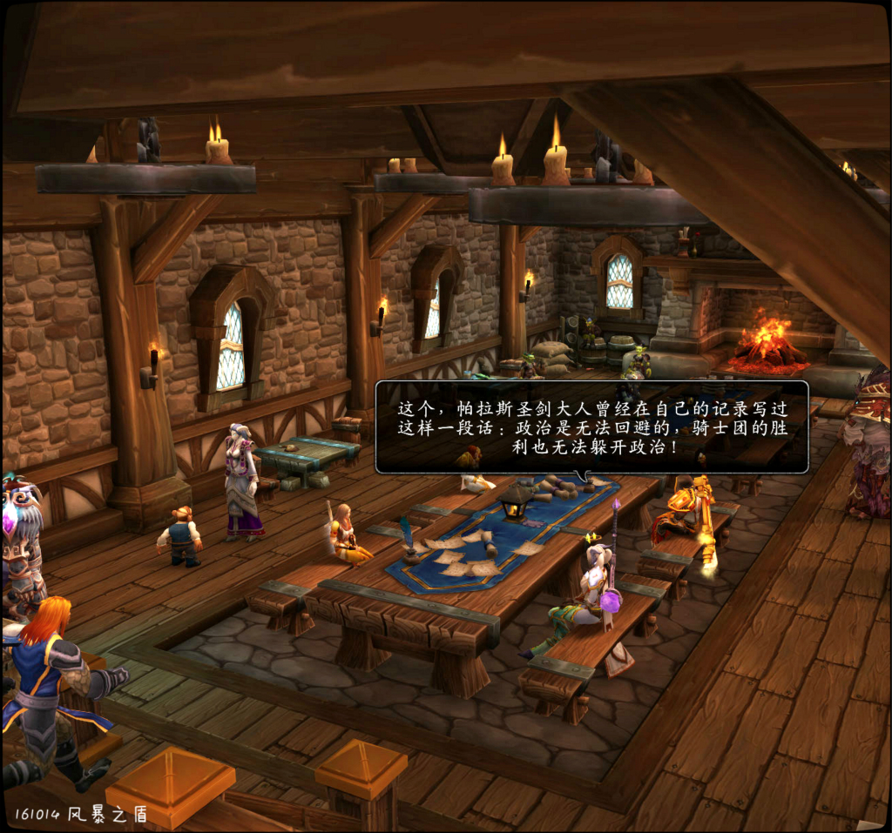

\[阿瑞克斯博士]: 我们就是骑士，这一点毋容置疑

\[伊琳娜嘉尔]: 但是我记得

法瑞雅 差点笑出声，因为这太像圣剑骑士了，只是她又觉得悲哀。

\[伊琳娜嘉尔]: 提里奥大人

\[伊琳娜嘉尔]: 也被流放过

\[伊琳娜嘉尔]: 他也是虔诚的骑士

\[法瑞雅]: 他们……甚至会让我们上火刑架。

\[法瑞雅]: 如果我们被谴责为异端。

\[伊琳娜嘉尔]: 法瑞大人，我建议我们寻找一些在暴风国王有可靠力量的盟友帮忙

\[阿瑞克斯博士]: 把圣骑士指为异端这样的事情简直是……………….

\[伊琳娜嘉尔]: 我也无法理解

\[伊琳娜嘉尔]: 据说那么主教非常的偏执

\[伊琳娜嘉尔]: 但能言善辩\[阿瑞克斯博士]: 等等，他是不是……….

\[法瑞雅]: 这就是教会的话语权。

\[伊琳娜嘉尔]: 多次驳倒贵族

伊琳娜嘉尔 注意到一名男子进入

\[伊琳娜嘉尔]: 先生

\[卡雷利亚斯]: 看来我来晚了

法瑞雅 注意到了一个男子

\[伊琳娜嘉尔]: 我们正在征用这里

\[伊琳娜嘉尔]: 您是？

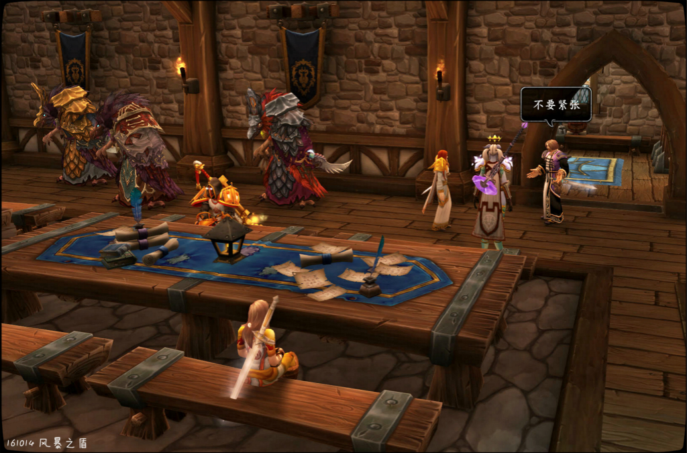

卡雷利亚斯 拉下兜帽

\[卡雷利亚斯]: 不要紧张

\[卡雷利亚斯]: 夜安 女士

你满怀敬意地向卡米尔丶雷诺致礼。

伊琳娜嘉尔向卡米尔丶雷诺鞠躬。

\[伊琳娜嘉尔]: 我没注意到您

\[伊琳娜嘉尔]: 这是天轨号的军服

\[卡雷利亚斯]: 我是收邀来的

\[伊琳娜嘉尔]: 我们才刚说到盟友

伊琳娜嘉尔 开心地笑了

\[法瑞雅]: 我认为……我们应该警告尼苛德摩主教。

卡雷利亚斯点了点头。

\[法瑞雅]: 三位律师已经准备好在法庭上羞辱他了。

\[卡雷利亚斯]: 所以需要我做的是什么。

\[伊琳娜嘉尔]: 可是万一失败呢

\[法瑞雅]: 如果我们以此作为“威胁”，警告他马上停止这一切，不然他本人会在法庭上被公然指责出身。

法瑞雅 对血统论感到很不齿。

\[法瑞雅]: 这是其中一个计划。

\[伊琳娜嘉尔]: 我们德莱尼有句老话：凡文事必以武事备之

\[法瑞雅]: 但是，今天召开骑士评议会，我是希望骑士评议会有更多办法。

\[法瑞雅]: 如何武之？天威骑士你认为。

卡雷利亚斯 皱眉头思索。

\[伊琳娜嘉尔]: 说不定事情会发展到最后的武力阶段呢

\[伊琳娜嘉尔]: 当这是最糟糕的

\[卡雷利亚斯]: 不介意我找个地方 坐下吧

\[伊琳娜嘉尔]: 不过我们仍然要准备好

\[伊琳娜嘉尔]: 坐吧

\[伊琳娜嘉尔]: 大家都挺紧张

\[卡雷利亚斯]: 夜安 美丽的将军

法瑞雅 示意众人回到座位上。

卡雷利亚斯向卡米尔丶雷诺鞠躬。

\[伊琳娜嘉尔]: 刚才的形势分析

阿瑞克斯博士 什么奇怪的事情都有……..

\[伊琳娜嘉尔]: 确实很让人揪心

\[伊琳娜嘉尔]: 不如听听新来朋友的建议吧

卡雷利亚斯 仔细打量了眼前的凯斯霍普

阿瑞克斯博士 那么……

\[卡雷利亚斯]: 新来的是指我吗？

\[伊琳娜嘉尔]: 当然

\[卡雷利亚斯]: 我跟贵团长讲过

\[伊琳娜嘉尔]: 虽然我还不认识您

\[卡雷利亚斯]: 有需要帮忙了，就找我

\[卡雷利亚斯]: 于是我就应需而来

\[卡雷利亚斯]: 我是北方人 叫我卡雷就行

\[法瑞雅]: 卡雷利亚斯认为他能胜任某种程度上去威胁尼苛德摩主教——

\[法瑞雅]: 但我们还需要讨论其他方案。

\[阿瑞克斯博士]: 威胁主教！！

卡雷利亚斯 仔细打量了眼前的阿瑞克斯博士

\[卡米尔丶雷诺]: 我离开一下

\[法瑞雅]: 不，威胁他，一方面警告他不要出席法庭，另一方面以此让他退却

\[卡雷利亚斯]: 只是请喝茶而已\[伊琳娜嘉尔]: 喝茶。。

\[卡雷利亚斯]: 显然我从来没有跟教会的人打过交道

\[伊琳娜嘉尔]: 是有什么暴力的手段吗

\[卡雷利亚斯]: 仅仅是请喝茶

\[卡雷利亚斯]: 我也不是动粗的人

\[伊琳娜嘉尔]: 我不是很能确定，不过目前的局势

\[法瑞雅]: 其他方案的话，伊琳娜嘉尔你提到的武力解决，这个是怎么进行？

\[伊琳娜嘉尔]: 恐怕不容我们过多顾虑细节

\[伊琳娜嘉尔]: 我的意思是最后时刻

\[伊琳娜嘉尔]: 我们应该用武力捍卫骑士的尊严

法瑞雅 对此非常同意。

\[伊琳娜嘉尔]: 一旦教会对我们进行污蔑

卡雷利亚斯点了点头。

\[伊琳娜嘉尔]: 并采取实际行动

\[阿瑞克斯博士]: 对抗教会吗！

\[伊琳娜嘉尔]: 不

\[卡雷利亚斯]: 生存之道 有我无敌

\[伊琳娜嘉尔]: 减少损失

\[伊琳娜嘉尔]: 并向世人昭示

\[伊琳娜嘉尔]: 我们是被污蔑的

\[伊琳娜嘉尔]: 我们应该先启用达拉然的据点

\[法瑞雅]: 天轨号站在我们这边，而……军情七处。

\[伊琳娜嘉尔]: 作为退路\[伊琳娜嘉尔]: 据说是个厉害的情报组织？

\[法瑞雅]: 军情七处已经放飞了金色雀。

\[卡雷利亚斯]: 如果你们知道暴风要塞里边发生的事情

\[法瑞雅]: 我不认为暴风王国的情报组织是一个笑话。

\[卡雷利亚斯]: 你就知道了

\[伊琳娜嘉尔]: 如果可以，我想和这个主教见一面

\[卡雷利亚斯]: 这不是此次的重点，还是搁置一边吧

\[伊琳娜嘉尔]: 说服他不要做这种无聊的调查

\[法瑞雅]: 我收到了那封密文信，上面写着：“巨大声响和火光烟雾吓跑了我的金丝雀。”

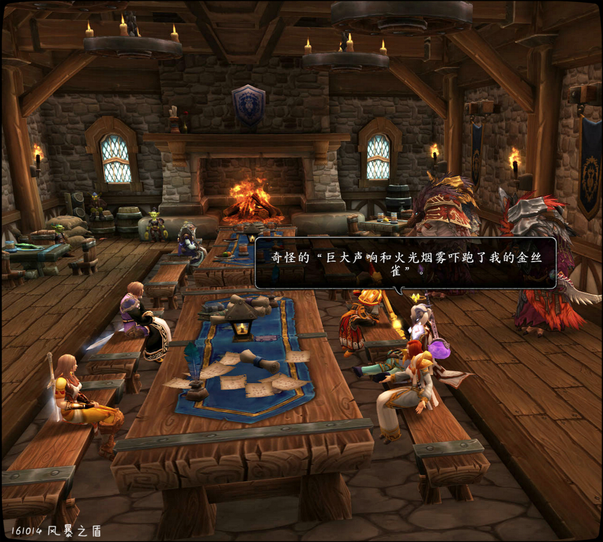

\[伊琳娜嘉尔]: 这是什么意思？

\[法瑞雅]: 我不知道这是什么意思……

\[卡雷利亚斯]: 那么 那个什么主教会见你吗  圣骑士大人

\[伊琳娜嘉尔]: 我、、、我不清楚

\[伊琳娜嘉尔]: 他可能不会喜欢见一个德莱尼

\[卡雷利亚斯]: 所以 需要我“请”他来跟你喝茶吗

\[法瑞雅]: 该死的血统论，我真的对此非常厌烦。

\[卡雷利亚斯]: 所以 我可以出面 做一些你们没法做的工作

\[法瑞雅]: 如果情况不利，撤退到达拉然，然后重新组织洗清我们的名誉。

\[伊琳娜嘉尔]: 这只是最糟糕的结果的应对方案

\[伊琳娜嘉尔]: 我先记录下来

卡雷利亚斯点了点头。

\[伊琳娜嘉尔]: 但我希望我们能打赢或者说服这名主教

\[卡雷利亚斯]: 贵团团长有我的联系方式

\[伊琳娜嘉尔]: 我直言不讳

\[卡雷利亚斯]: 大可如此

\[伊琳娜嘉尔]: 我很难信任您，但是这个时候了，我认为我们无法用正常的角度来看待问题了

\[卡雷利亚斯]: 这可是关系贵团的声誉

\[卡雷利亚斯]: 哈哈

\[伊琳娜嘉尔]: 但是

\[伊琳娜嘉尔]: 如果你打着我们委托的旗号

\[伊琳娜嘉尔]: 把那个主教杀了

\[伊琳娜嘉尔]: 我们还有声誉吗

\[伊琳娜嘉尔]: 我希望你不会做这种事

卡雷利亚斯 再次大笑

\[卡雷利亚斯]: 哈哈

\[卡雷利亚斯]: 抱歉，女士，我看起来很像土匪吗

\[伊琳娜嘉尔]: 请原谅

\[伊琳娜嘉尔]: 我们德莱尼无法想象更多的手段

卡雷利亚斯 说完看了看 自己今晚的打扮。

\[伊琳娜嘉尔]: 我只是说出我的担忧

\[卡雷利亚斯]: 我一直在强调

\[卡雷利亚斯]: 我可以出人，帮你们“请”到主教。

\[卡雷利亚斯]: 而不是“抬”

\[伊琳娜嘉尔]: 然后？

\[伊琳娜嘉尔]: 喝茶？

\[卡雷利亚斯]: 然后你就可以当面跟主教讨论你们的事情

\[卡雷利亚斯]: 再或者，你们无法出面的话，我可以带话。

\[伊琳娜嘉尔]: 好吧

\[卡雷利亚斯]: 搞主教，我可还想在这里多混几年呢

\[伊琳娜嘉尔]: 我想听听团长大人的决断

\[卡雷利亚斯]: 再说 也是为了主教好 不是吗

\[法瑞雅]: 警告他。\[伊琳娜嘉尔]: 团长您确定要警告他吗

\[法瑞雅]: 既然我们准备好撤退到达拉然的据点，又有天轨号的支援，然后还有这……

\[伊琳娜嘉尔]: 好吧

\[法瑞雅]: 奇怪的“巨大声响和火光烟雾吓跑了我的金丝雀”。

\[伊琳娜嘉尔]: 我似乎有预感这个人不是那么容易妥协 的

卡雷利亚斯 静静地听着周围人的谈话。

\[法瑞雅]: 凯斯霍普和凯斯霍普，你们有什么建议？

\[伊琳娜嘉尔]: 博士你的看法呢

\[阿瑞克斯博士]: ………..

\[阿瑞克斯博士]: 主教和教会还有圣骑士

\[卡雷利亚斯]: 请问，这位圣骑士大人叫什么呢

\[阿瑞克斯博士]: 我想不出来为什么站到了对立面

\[伊琳娜嘉尔]: 坐在我旁边的是霍普

\[法瑞雅]: 我们甚至应该找到教会的圣骑士！

\[法瑞雅]: 阿瑞克斯博士，你是个天才！

\[伊琳娜嘉尔]: 我对面这名漂亮的骑士小姐是阿瑞克斯

卡雷利亚斯对伊琳娜嘉尔点了点头。

\[伊琳娜嘉尔]: 位面当然不希望和教会对立

\[伊琳娜嘉尔]: 也希望用和平的方式解决

卡雷利亚斯 心想，好像还是没说自己的名字啊。

\[法瑞雅]: 卡雷利亚斯如果你去警告主教，务必不能伤害他。

\[阿瑞克斯博士]: 我们就是！\[卡雷利亚斯]: 所以 你们不准备出面了吗

\[伊琳娜嘉尔]: 我愿意出面

\[伊琳娜嘉尔]: 但一名德莱尼

\[伊琳娜嘉尔]: 我担心又被他抓住认为是异端

\[伊琳娜嘉尔]: 我看过一些记载

\[卡雷利亚斯]: 那更好 我还真是没跟教会的人打过交道

\[伊琳娜嘉尔]: 有些人类主教质疑我们的圣光信仰

\[伊琳娜嘉尔]: 看看

\[卡雷利亚斯]: 决定了的话，我这几天就开始行动

\[伊琳娜嘉尔]: 阿瑞克斯。。那么主教并没有质疑圣骑士的身份和职业

\[伊琳娜嘉尔]: 只是要控告我们骑士团这个组织吧

\[伊琳娜嘉尔]: 因为我们没有屈从他的要求

\[法瑞雅]: 然后我们也已经警告了他关于他将要被羞辱的事。

\[卡雷利亚斯]: 这也是对主教好

\[法瑞雅]: 但是这个“警告”一定不可以做得——你知道，太暴力。

\[法瑞雅]: 不然会留下口实。

\[卡雷利亚斯]: 谁愿意自己的过往被扒出来

\[法瑞雅]: 要非常干净。

\[伊琳娜嘉尔]: 我担心这名主教是出于权力斗争的原因对付我们

\[卡雷利亚斯]: 他又不知道我是谁

\[卡雷利亚斯]: 也不知道我跟你们的关系

\[法瑞雅]: 不，不能伤害他。

\[伊琳娜嘉尔]: 我们不希望伤害他

\[卡雷利亚斯]: 我也没打算要伤害他&#x20;

\[卡雷利亚斯]: 不然直接我自己去就了事了。

\[伊琳娜嘉尔]: 好吧

\[伊琳娜嘉尔]: 我相信法瑞大人的判断

\[伊琳娜嘉尔]: 不过阿瑞克斯博士的建议也很有启发性

\[法瑞雅]: 是的！

\[伊琳娜嘉尔]: 也许我们可以找找教会的其他人？

\[法瑞雅]: 我居然没有想到。

\[法瑞雅]: 我一定是太害怕了。

\[伊琳娜嘉尔]: 谢谢你阿瑞克斯

\[法瑞雅]: 他们也有圣骑士。

\[阿瑞克斯博士]: 让他站在我的奉献里如何

\[法瑞雅]: 哈哈

法瑞雅 忍不住笑了，想起这几天的憋屈。

\[法瑞雅]: 好了，我很满意今天的结果。

法瑞雅 接到一封信。

法瑞雅 低头看信。

\[法瑞雅]: 主教尼苛德摩邀请我们去他的生日宴会……

伊琳娜嘉尔 记录下了本次会议的主要倡议

\[伊琳娜嘉尔]: 这是？

\[伊琳娜嘉尔]: 太意外了

\[卡雷利亚斯]: 去就去呗

\[法瑞雅]: “过来老夫的大寿，不准搞事。”

\[卡雷利亚斯]: 白捡的人情

\[法瑞雅]: 好吧这……真像他。

\[卡雷利亚斯]: 有利无害

\[伊琳娜嘉尔]: 也许更多的交流

\[法瑞雅]: 我们如果出席，一定要注意礼仪。

\[伊琳娜嘉尔]: 可以促进他理解我们

\[法瑞雅]: 就像卡雷利亚斯，在你警告他时，务必注意礼仪。

卡雷利亚斯 翻白眼

\[卡雷利亚斯]: 好吧  我的团长大人

伊琳娜嘉尔真心地向卡米尔丶雷诺表示问候。

卡米尔丶雷诺真心地向伊琳娜嘉尔表示问候。

伊琳娜嘉尔真心地向洛可儿表示问候。

伊琳娜嘉尔 对见到同胞深感亲切

洛可儿向伊琳娜嘉尔鞠躬。

\[伊琳娜嘉尔]: 没想到

\[伊琳娜嘉尔]: 天轨号也有同胞在服役

\[卡雷利亚斯]: 哈哈

\[卡雷利亚斯]: 有人需要拉我做舞伴吗

\[洛可儿]: 混口饭吃而已

\[伊琳娜嘉尔]: 好吧哈哈

\[伊琳娜嘉尔]: 总之我感到亲切

卡雷利亚斯 感觉到一阵尴尬

伊琳娜嘉尔 胡言乱语了一通。

\[洛可儿]: 我也是，见到您倍感亲切

卡雷利亚斯 看来一定是胡子留的不好看。

伊琳娜嘉尔 胡言乱语了一通。

伊琳娜嘉尔 胡言乱语了一通。

\[卡米尔丶雷诺]: 我们出发吧

伊琳娜嘉尔 胡言乱语了一通。

\[卡雷利亚斯]: 唉 是时候要拓展朋友圈了。

卡雷利亚斯 拉起兜帽

\[卡雷利亚斯]: 那么  再会了，骑士团诸位

贝玲达丶桑丽 瞥了一眼伊琳娜嘉尔

伊琳娜嘉尔向卡雷利亚斯挥手告别。再见！

> 于这周五召开的骑士评议会已经作出了决定。对于宗主教贤者尼苛德摩将要谴责骑士团为异端——而且将要召开宗教法庭这事，骑士团如果失利，将撤退到达拉然的据点，然后以武力保护各骑士的安全。再洗刷名誉。
>
> 为了防止教会对我们进行秘密逮捕，所有骑士务必注意自身安全，并暂时居住在骑士团在暴风城的驻地中。再次确认，我们会以武力保护每一个骑士的安全。
>
> 另外如果各位认识教会中的圣骑士，进行外交接触，争取让更多教会的骑士站在我们这边。
>
> 大团长\
> 法瑞

## 嘉尔被捕无可奉告

乔治丶维利尔：保禄神父

伊琳娜嘉尔：伊琳娜嘉尔

贤者尼苛德摩：贤者尼苛德摩

卡雷利亚斯：克劳德

波尔博一血眼：波尔博一血眼

阿海洛：阿海洛

阿瑞克斯博士：阿瑞克斯博士

诺亚丶兰盾：诺亚·兰盾

卢卡斯丶伟尔：卢卡斯·伟尔

亚尔夫海姆：亚尔夫海姆

一个神秘的贵族克劳德要求与主教尼苛德摩见面。

记录开始于 10/20/2016 的 09:32:33。

\[亚尔夫海姆]: 这可是中南部的名字。先生来自?

\[保禄神父]: 洛丹伦是我的故乡，尊敬的主教

保禄神父向克里斯托弗修士鞠躬。

克劳德 透过面罩观察着广场的情况。

亚尔夫海姆点了点头。

\[亚尔夫海姆]: 那么太好了

\[贤者尼苛德摩]: 这群该死的吉尔尼斯人

\[保禄神父]: 我很荣幸为您这样虔诚的长者效力

\[贤者尼苛德摩]: 往教堂扔臭气蛋

\[贤者尼苛德摩]: 看

\[贤者尼苛德摩]: 那边还有客人

\[贤者尼苛德摩]: 失陪下

\[保禄神父]: 这帮异教徒，愿圣光神罚他们

保禄神父 冷酷的笑了笑

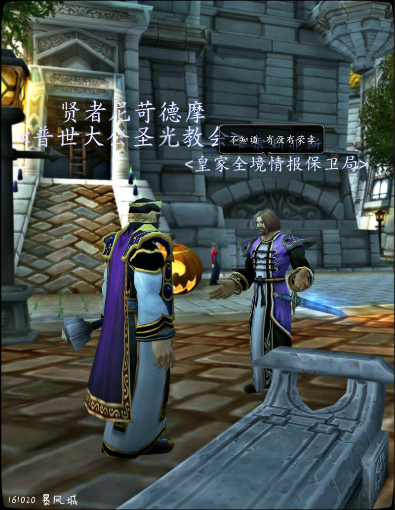

\[贤者尼苛德摩]: 朋友

克劳德 转过身子

\[贤者尼苛德摩]: 你为何遮蔽自己的面孔

\[保禄神父]: 那么…主教大人

克劳德 指着这些偷鸡蛋

\[保禄神父]: 您之前所承诺的…一些好处

\[克劳德]: 臭鸡蛋

保禄神父 悄悄的笑了笑

\[克劳德]: 你说呢  教宗大人

\[贤者尼苛德摩]: 是啊

克劳德 微笑

\[贤者尼苛德摩]: 这群混账吉尔尼斯人

\[贤者尼苛德摩]: 等万圣节过了

\[贤者尼苛德摩]: 我就把他烧了

\[克劳德]: 说起来，

克劳德 拉下兜帽

\[贤者尼苛德摩]: 亚尔夫大人

\[亚尔夫海姆]: 是

\[贤者尼苛德摩]: 保禄兄弟和你有话要说

保禄神父 把袍子拉紧了一下，尽力遮挡出胸前的血色火焰

\[克劳德]: 我最近确实在追求圣光之路上有些许困扰

\[亚尔夫海姆]: 兄弟，有什么事情请将

保禄神父 笑了笑

\[克劳德]: 不知道  有没有荣幸

\[贤者尼苛德摩]: 如果你想听

\[保禄神父]: 并没有，尊敬的大人

\[贤者尼苛德摩]: 我就告诉你

\[克劳德]: 请教宗大人指点

\[亚尔夫海姆]: 那么就是教宗开了一个不合时宜的玩笑

\[保禄神父]: 我已经被暴风城的繁荣所震惊了

保禄神父向亚尔夫海姆鞠躬。

\[亚尔夫海姆]: 的确，这座城市非常宏伟

\[贤者尼苛德摩]: 你困惑在何处？

\[亚尔夫海姆]: 在我第一次来到的时候也同样被震惊到了

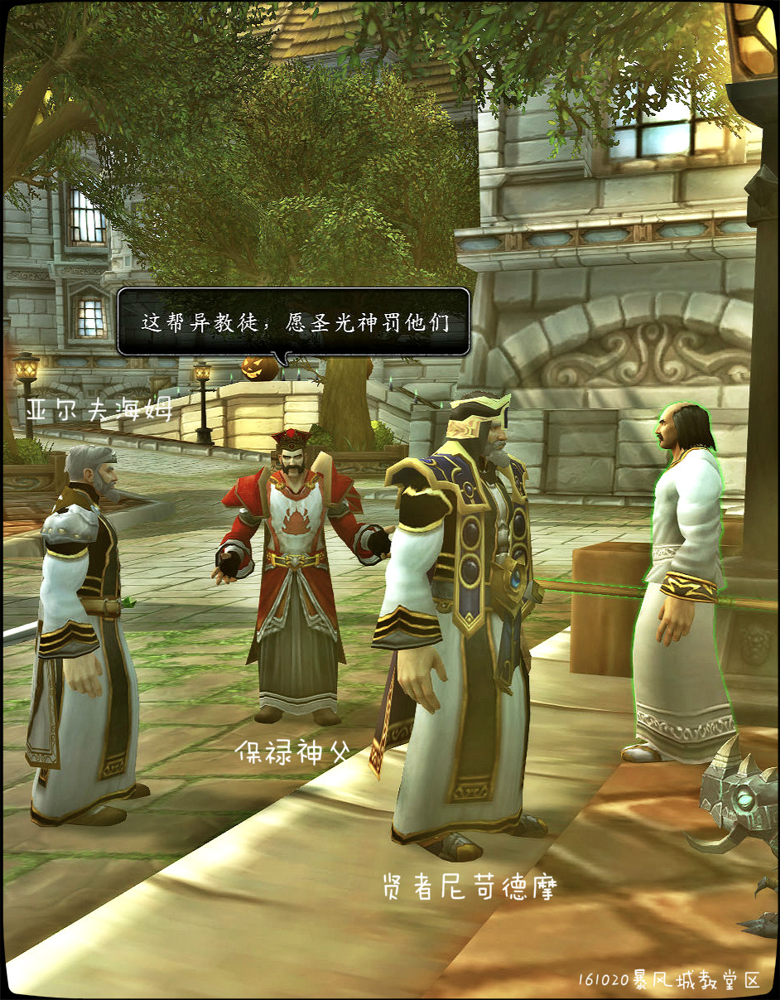

保禄神父 斜着看了看四处巡逻的卫士

\[保禄神父]: 当然

\[保禄神父]: 自从洛丹伦…

\[克劳德]: 当然，我也不是白白让教宗大人 在我身上浪费时间的  听说最近卫队的物资需要更换了

\[贤者尼苛德摩]: 是啊

\[保禄神父]: 我已经很多年没有看见过像样的大城市了

\[克劳德]: 说起来，也是有点难以启齿呢

保禄神父 自嘲的笑了笑

\[贤者尼苛德摩]: 你!

\[亚尔夫海姆]: 我明白

\[克劳德]: 而且，这里也不是谈话的合适场所呢

\[克劳德]: 不是吗

保禄神父 微笑了一下

\[亚尔夫海姆]: 尽管你肯定听过很多遍了

\[贤者尼苛德摩]: 把扔臭气蛋的人给我打下来

克劳德 捂着鼻子。

\[亚尔夫海姆]: 但是我还是对贵国的损失深表遗憾

\[保禄神父]: 当然…这里的异教徒似乎….

\[保禄神父]: 有点繁多

\[贤者尼苛德摩]: 该死的异教徒

保禄神父 残酷的笑了笑

\[贤者尼苛德摩]: 你继续

\[克劳德]: 请这边来？

\[保禄神父]: 我并不太喜欢这样的氛围

\[亚尔夫海姆]: 这是一座广泛接纳各种文化的都城。难免会出现各种意外

\[贤者尼苛德摩]: 要离开教区吗

\[克劳德]: 只是在附近呢

保禄神父 叹了一口气

\[保禄神父]: 当然….

\[贤者尼苛德摩]: 卫队

\[克劳德]: 那里有些树&#x20;

\[贤者尼苛德摩]: 来两个人跟着我

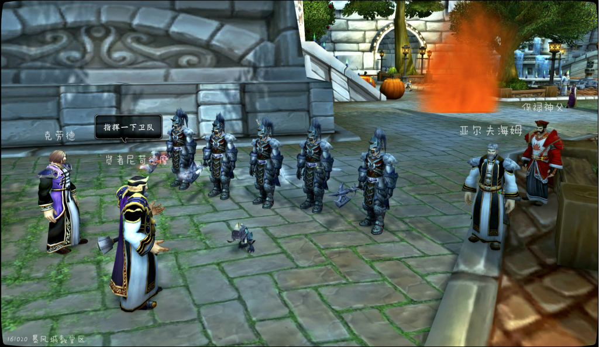

\[克劳德]: 并不需要卫队吧

\[克劳德]: 教宗大人

克劳德 解下腰间的配剑，放在一边。

\[贤者尼苛德摩]: 好吧

\[贤者尼苛德摩]: 亚尔夫大人

\[贤者尼苛德摩]: 指挥一下卫队

亚尔夫海姆点了点头。

\[贤者尼苛德摩]: 给保禄神父看看

保禄神父 整理了一下自己的礼帽

\[克劳德]: 希望先把仍鸡蛋的异教徒先处理一下

\[贤者尼苛德摩]: 普世教会完全可以保卫我们的安全

\[保禄神父]: 我的荣幸，尊敬的大人

保禄神父向亚尔夫海姆鞠躬。

\[贤者尼苛德摩]: 走吧

\[克劳德]: 请把

\[亚尔夫海姆]: 教堂卫队，保持竖列前进

\[克劳德]: 就没有什么味道了呢

\[贤者尼苛德摩]: 是啊

\[克劳德]: 嗯？

\[克劳德]: 不用管理异教徒了吗？

\[贤者尼苛德摩]: 留一个卫队给我

\[亚尔夫海姆]: 左列一队

\[贤者尼苛德摩]: 其他的带去处理那群扔臭鸡蛋的人

你满怀敬意地向亚尔夫海姆致礼。

一行人来到教堂后巷的渔港处。

\[亚尔夫海姆]: 保护教宗安全

\[亚尔夫海姆]: 其余的，跟我来

保禄神父 努力的使自己的表情不那么紧张

\[贤者尼苛德摩]: 请

\[贤者尼苛德摩]: 这里？

\[贤者尼苛德摩]: 这里啊

\[贤者尼苛德摩]: 是一个渔场

\[克劳德]: 那么&#x20;

\[克劳德]: 请往后边看

\[克劳德]: 我的烦恼就在那里

\[贤者尼苛德摩]: 什么也没有

\[克劳德]: 大人&#x20;

\[贤者尼苛德摩]: 恩

\[克劳德]: 不妨往里边一看

\[贤者尼苛德摩]: 这块木板

\[贤者尼苛德摩]: 也是我的烦恼

保禄神父 凑过头去仔细看了看

\[贤者尼苛德摩]: 好像有人

.jpg>)

\[贤者尼苛德摩]: 把眼镜给我

\[贤者尼苛德摩]: 蓝宝石的那个

卢卡斯丶韦尔 递过一副眼镜

伊琳娜嘉尔向贤者尼苛德摩鞠躬。

\[伊琳娜嘉尔]:  你好

克劳德 慢慢摸出一把武器藏在腰间

\[贤者尼苛德摩]: 谁的宠物

保禄神父 的眼神渐渐犀利起来

\[贤者尼苛德摩]: 孤儿院孩子们养的小东西

\[伊琳娜嘉尔]: 尊敬的。。请问你们哪位是主教大人

\[贤者尼苛德摩]: 总喜欢跟着我

\[贤者尼苛德摩]: 去去去

保禄神父 似乎很不高兴

\[克劳德]: 教宗大人分

伊琳娜嘉尔 四处寻找卡里利亚斯的踪迹

\[贤者尼苛德摩]: 这是谁

贤者尼苛德摩指着伊琳娜嘉尔。

\[伊琳娜嘉尔]: 请允许我介绍自己

\[克劳德]: 这是我的烦恼

\[伊琳娜嘉尔]: 我没有恶意

\[克劳德]: 也是教宗大人的烦恼

\[贤者尼苛德摩]: 我知道了

\[贤者尼苛德摩]: 你的妻子

\[克劳德]: 哈哈

\[贤者尼苛德摩]: 原来你是害怕我责怪你啊

保禄神父 拉了拉自己的帽檐

\[克劳德]: 是的&#x20;

\[贤者尼苛德摩]: 没关系

\[贤者尼苛德摩]: 带进教堂来吧

\[贤者尼苛德摩]: 我不会责怪你娶了因德莱尼

\[伊琳娜嘉尔]: 有人在听我说话吗

\[贤者尼苛德摩]: 来吧

\[贤者尼苛德摩]: 我们一起用餐

\[贤者尼苛德摩]: 保禄神父

\[贤者尼苛德摩]: 我们一起用餐吧

保禄神父 直直地盯着伊琳娜嘉尔

\[贤者尼苛德摩]: 卫

\[保禄神父]: 啊….当然

伊琳娜嘉尔 卡雷这是怎么回事？低语

\[贤者尼苛德摩]: 带二位走

\[克劳德]: 等等 教宗大人

\[保禄神父]: 我的荣幸

保禄神父向伊琳娜嘉尔鞠躬。

\[伊琳娜嘉尔]: 好吧

\[贤者尼苛德摩]: 他们在磨蹭什么？

\[贤者尼苛德摩]: 不吃饭了吗？

\[贤者尼苛德摩]: 保禄神父啊

\[亚尔夫海姆]: 好问题

\[亚尔夫海姆]: 我们过去吧

\[贤者尼苛德摩]: 这教堂卫队的服装

\[贤者尼苛德摩]: 是

\[贤者尼苛德摩]: 达芬奇为我们设计的

\[保禄神父]: 非常的勇武，教宗大人

\[贤者尼苛德摩]: 很有文化复兴的气息

保禄神父向贤者尼苛德摩鞠躬。

伊琳娜嘉尔 无法理解地看着眼前这群人类

\[贤者尼苛德摩]: 就像古代阿拉索

\[贤者尼苛德摩]: 亚尔夫大人

伊琳娜嘉尔 似乎已经确定领头的男子就主教了

\[贤者尼苛德摩]: 准备用餐吧

\[亚尔夫海姆]: 当然

\[阿瑞克斯博士]: 蹄子 尾巴 角

\[亚尔夫海姆]: 请

保禄神父优雅的鞠了一躬。

\[贤者尼苛德摩]: 去孤儿院吃吗

\[贤者尼苛德摩]: 还是在这里？

\[亚尔夫海姆]: 当然不去

\[亚尔夫海姆]: 就这里吧

\[贤者尼苛德摩]: 也是

\[贤者尼苛德摩]: 孤儿院老做甜点

\[贤者尼苛德摩]: 吃了牙疼

\[贤者尼苛德摩]: 请坐

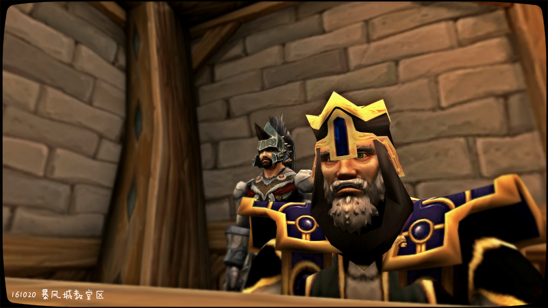

伊琳娜嘉尔 感到有点紧张

\[亚尔夫海姆]: 教宗，你坐正席

保禄神父优雅的鞠了一躬。

\[克劳德]: 别紧张

\[亚尔夫海姆]: 请来这里

\[克劳德]: 过来坐吧

保禄神父 掀开了袍子，优雅的坐下

保禄神父 显得有些拘谨

\[贤者尼苛德摩]: 让若望修士上菜吧

\[亚尔夫海姆]: 旁席就让给我来坐吧

亚尔夫海姆点了点头。

伊琳娜嘉尔 根本无心吃饭

\[贤者尼苛德摩]: 请坐

\[克劳德]: 那么 我就不客气了

拥光者克拉娜跪了下来。

保禄神父 看了看伊琳娜嘉尔，把头朝向了另一边

伊琳娜嘉尔 对卡雷使眼色

\[贤者尼苛德摩]: 请

\[亚尔夫海姆]: 暖暖身子

贤者尼苛德摩 胸前比划十字

\[克劳德]: 不得不说  教宗大人的卫队真是尽责

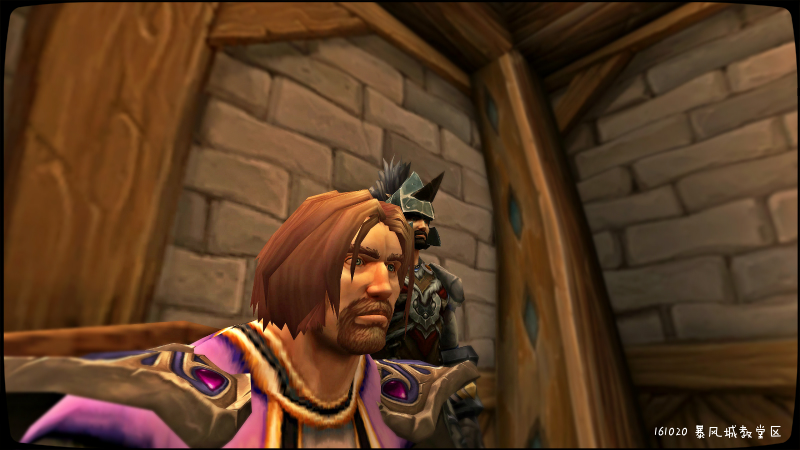

克劳德 微笑

保禄神父 看了看眼前的食物，但并没有开始食用

你对亚尔夫海姆表示感谢。

\[贤者尼苛德摩]: 请吃吧

保禄神父 做了一个礼拜的手势

\[伊琳娜嘉尔]: 谢谢主教大人

\[保禄神父]: 抱歉，教宗大人

\[伊琳娜嘉尔]: 不过我并没有胃口

\[克劳德]: 时时刻刻都在为教宗大人的安全着想啊

\[保禄神父]: 能给我一点最简单的面包和清水吗

\[贤者尼苛德摩]: 保禄修士

\[贤者尼苛德摩]: 今天不是斋戒

\[保禄神父]: 当然，有些粗盐是再好不过了

克劳德 看着眼前的伊琳娜

\[保禄神父]: 不不不

\[保禄神父]: 我已经习惯了那样的苦修

保禄神父 歉意的笑了笑

克劳德 示意只能见招拆招了

\[贤者尼苛德摩]: 吃吧

\[克劳德]: 那么 还未请问

伊琳娜嘉尔 拿了一个红色的苹果

\[克劳德]: 教宗大人是哪里人呢？

\[贤者尼苛德摩]: 我就是本地人

\[贤者尼苛德摩]: 生活了几十年了

\[克劳德]: 暴风城长大的吗？

\[贤者尼苛德摩]: 不

\[贤者尼苛德摩]: 那会儿

保禄神父 苦笑了一下，只好拿起了一块精细的面包慢慢的咀嚼起来

\[贤者尼苛德摩]: 这里不叫暴风城

\[克劳德]: 嗯哼？

\[贤者尼苛德摩]: 那时这里仅仅就是旧镇

\[亚尔夫海姆]: 你去喝点酒暖暖身子。我来换岗

\[诺亚丶兰盾]: 大人你不进去么外面冷

伊琳娜嘉尔 偷偷看了主教一眼 感觉这个男人一脸沧桑

\[贤者尼苛德摩]: 教堂对面的城区

\[诺亚丶兰盾]: 我还行

亚尔夫海姆点了点头。

\[亚尔夫海姆]: 卫队就需要你这样的勇士

\[贤者尼苛德摩]: 就是旧镇

\[贤者尼苛德摩]: 你

\[诺亚丶兰盾]: 谢谢大人称赞

\[贤者尼苛德摩]: 为我们切火腿

\[克劳德]: 嗯 确实听说暴风城被摧毁过

贤者尼苛德摩指着你。

\[贤者尼苛德摩]: 是啊

保禄神父 优雅的用餐巾擦了擦嘴

拥光者克拉娜在阿海洛面前跪下。

\[贤者尼苛德摩]: 当时并没有这么大城市

保禄神父 做了一个礼拜的手势

伊琳娜嘉尔 拒绝了火腿，她实在没有胃口

\[克劳德]: 那想必  教宗大人小时候 过的也不算太好吧。

\[贤者尼苛德摩]: 当然不好

克劳德 说道最后，声音已经开始冷了起来。

\[亚尔夫海姆]: 我去取一下我的铠甲。教宗召集的太过匆忙了。我去去军械库就回

\[贤者尼苛德摩]: 我小时候啊，那时战争频繁

\[贤者尼苛德摩]: 不是外部战争

\[诺亚丶兰盾]: 是

\[贤者尼苛德摩]: 二世诸侯战争

\[贤者尼苛德摩]: 诸侯们各自为王

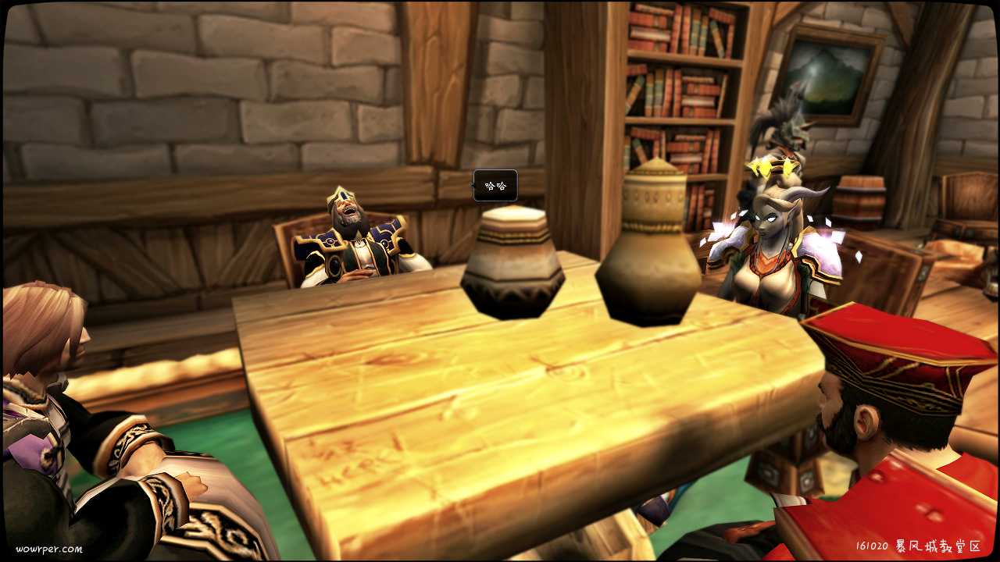

保禄神父 意味深长的笑了笑

\[贤者尼苛德摩]: 互相攻打

\[贤者尼苛德摩]: 然而

\[贤者尼苛德摩]: 每一个诸侯王却就跟一村长似的

\[贤者尼苛德摩]: 哈哈

克劳德 静静地听着周围人的谈话。

\[贤者尼苛德摩]: 哪里能和北方比啊

\[诺亚丶兰盾]: 大人你的铠甲真勇武

\[伊琳娜嘉尔]: 我没想到

\[亚尔夫海姆]: 如果你保持勇武你也会得到的

\[伊琳娜嘉尔]: 人类的历史会这样

\[诺亚丶兰盾]: 我会努力的

\[克劳德]: 北方也有北方的苦难啊

保禄神父 冷冷的轻哼了一声

\[克劳德]: 那些不死的亡灵

\[亚尔夫海姆]: 我很看好你。好好干，我会器重你的

\[克劳德]: 对了，还未介绍

\[贤者尼苛德摩]: 总体来说

\[克劳德]: 坐在我对面的，

\[贤者尼苛德摩]: 南方落后了北方100年

\[贤者尼苛德摩]: 你妻子

\[贤者尼苛德摩]: 我知道

\[伊琳娜嘉尔]: 不

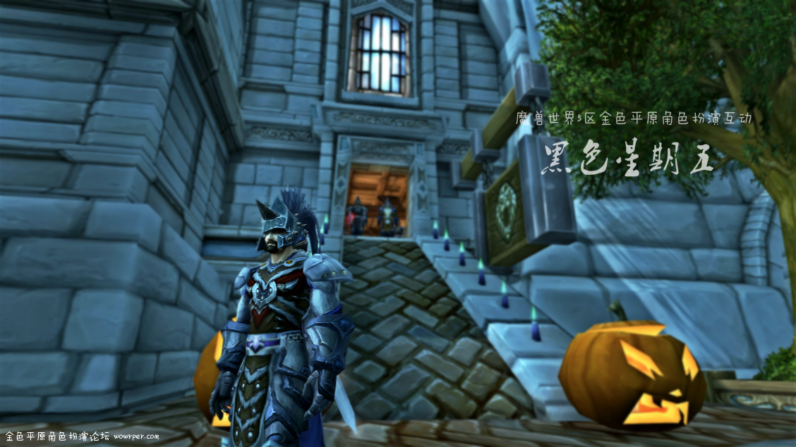

克劳德 并不直接回答

\[克劳德]: 你可知道

\[克劳德]: 她属于何处？

\[伊琳娜嘉尔]: 我想您误会了。。请原谅我的通用语还有口音，

\[贤者尼苛德摩]: 德莱尼教团？

克劳德 左手伸进口袋。

\[贤者尼苛德摩]: 德莱尼人都在那儿

\[贤者尼苛德摩]: 保禄修士

\[贤者尼苛德摩]: 不

\[贤者尼苛德摩]: 保禄神父

\[贤者尼苛德摩]: 你知道吗

\[克劳德]: 让她亲自为你解释吧

\[贤者尼苛德摩]: 德莱尼的会堂

\[保禄神父]: 什么？

拥光者克拉娜在阿海洛面前跪下。（？？？）

\[贤者尼苛德摩]: 他们没有自己的神父

\[保禄神父]: 抱歉，我从未在意过这些异,,,

\[伊琳娜嘉尔]: 我想这是误会

保禄神父 冷冷的笑了一声

\[贤者尼苛德摩]: 他们和我们虽然信仰一个神

\[伊琳娜嘉尔]: 我们德莱尼有自己的传道者

\[保禄神父]: 哈哈

\[伊琳娜嘉尔]: 不过主教大人

\[贤者尼苛德摩]: 但是他们不仅仅是异端邪说那么简单

\[保禄神父]: 传道者？

\[伊琳娜嘉尔]: 这不是今天的重点

\[保禄神父]: 这些外星人居然还有自己的传道者

保禄神父 开怀大笑

\[贤者尼苛德摩]: 哈哈

伊琳娜嘉尔 拿出一个铭刻着火红色火花的徽章放在桌子上

\[保禄神父]: 请原谅我的孤陋寡闻

保禄神父 冷冷的笑了笑

\[伊琳娜嘉尔]: 我是一名德莱尼圣骑士，现在隶属于炙热之心骑士团。

\[贤者尼苛德摩]: 炙热之心？

\[贤者尼苛德摩]: 你听说过吗？

\[贤者尼苛德摩]: 哈哈

\[伊琳娜嘉尔]: 我正在学习你们人类的宗教

\[保禄神父]: 哼

\[保禄神父]: 等等

\[伊琳娜嘉尔]: 我认为我们并无本质的冲突

保禄神父 摸了摸自己的下巴

\[贤者尼苛德摩]: 保禄修士

\[伊琳娜嘉尔]: 圣光的力量都眷顾着我们

\[贤者尼苛德摩]: 有何要说

\[保禄神父]: 我怎么…对这个….

\[保禄神父]: 有些眼熟？

\[贤者尼苛德摩]: 哪个

保禄神父 摸了摸自己的胡须

\[保禄神父]: 这位“女士”？

伊琳娜嘉尔 好奇地看着眼前的男子

阿海洛优雅的鞠了一躬。

\[伊琳娜嘉尔]: 是指我吗

保禄神父 捂着鼻子凑过去自己的端详了一下

\[阿海洛]: 里面在做什么？

\[保禄神父]: 恩….好像在哪？

\[亚尔夫海姆]: 机密

阿海洛 看着门口的卫兵，感觉气氛有些奇怪

\[伊琳娜嘉尔]: 我似乎没见过您

\[贤者尼苛德摩]: 不会是北方有德莱尼人吧

\[保禄神父]: 我倒是没见过几个这样的德莱尼人..

\[保禄神父]: 不

\[伊琳娜嘉尔]: 主教大人

\[亚尔夫海姆]: 先生想要用餐的话，可以在贸易区或者法师区找到非常棒的酒馆

\[伊琳娜嘉尔]: 实话实说

\[保禄神父]: 北方有几个，不过都被我们“做掉了‘

\[伊琳娜嘉尔]: 我是慕名而来

阿海洛耸了耸肩说：“天知道。”

\[教堂卫兵]: 这位先生？

\[贤者尼苛德摩]: 哈哈

保禄神父 冷冷的笑了笑。眼睛里充满的嗜血

\[贤者尼苛德摩]: 保禄神父

\[贤者尼苛德摩]: 去看看外面怎么了

\[伊琳娜嘉尔]: 做掉？

\[贤者尼苛德摩]: 如果运气好

\[保禄神父]: 对

\[贤者尼苛德摩]: 你可以向他出售一个赎罪券

\[保禄神父]: 您想知道细节吗？

保禄神父 舔了舔自己的嘴唇

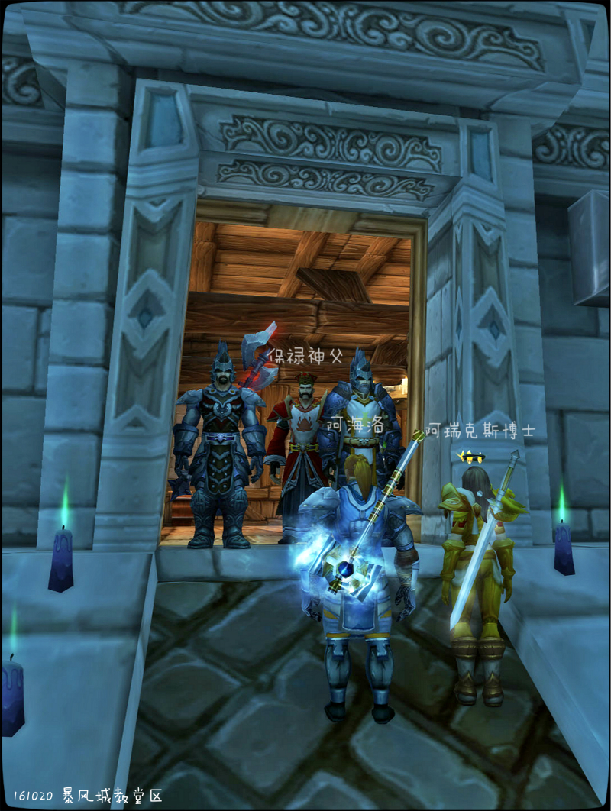

\[阿海洛]: 这里被包场了？

克劳德 站了起来

保禄神父 放声大笑

\[教堂卫兵]: 报告主教大人。

伊琳娜嘉尔 站在主教面前

亚尔夫海姆点了点头。

\[贤者尼苛德摩]: 嗯？

\[教堂卫兵]: 外面来了一位全副武装的骑士。

\[贤者尼苛德摩]: 他想干嘛

\[教堂卫兵]: 他，想进来喝酒？

\[贤者尼苛德摩]: 态度如何

\[贤者尼苛德摩]: 态度差的话

\[贤者尼苛德摩]: 都给我去揍他

\[教堂卫兵]: 态度如何？

伊琳娜嘉尔 仔细看了一眼搭话男子的胸前徽记，似乎事成相识

\[教堂卫兵]: 还算绅士。

\[教堂卫兵]: 但是……

\[贤者尼苛德摩]: 怎么用

\[教堂卫兵]: 他好像不那么清醒我觉得

阿海洛 注意到那些人身上的战袍

\[贤者尼苛德摩]: 那么去揍他

保禄神父 不被人察觉的轻蔑的笑了笑

\[贤者尼苛德摩]: 保禄神父

\[贤者尼苛德摩]: 你也去

克劳德 示意嘉尔

\[保禄神父]: 我？！

\[贤者尼苛德摩]: 外面那个人如果被卫队打伤了

\[贤者尼苛德摩]: 记得收他200个金币赎罪券

保禄神父 指了指自己

伊琳娜嘉尔 突然意识到这是一个号机会

\[保禄神父]: 这还…真是个好买卖

克劳德 微笑

\[贤者尼苛德摩]: 你瞧瞧

伊琳娜嘉尔 站在了主教面前

\[亚尔夫海姆]: 你站的太旧了

\[伊琳娜嘉尔]: 大人

\[贤者尼苛德摩]: 放肆的家伙

保禄神父 摸了摸自己的后脑勺

\[亚尔夫海姆]: 卫队

\[贤者尼苛德摩]: 就该管教

\[亚尔夫海姆]: 保卫主教

\[贤者尼苛德摩]: 嗯？

\[亚尔夫海姆]: 上!

阿海洛 看着面前一群全副武装的人

\[伊琳娜嘉尔]: 您似乎终于有机会和我说话了吗

\[伊琳娜嘉尔]: 你听说过炙热之心骑士团吗

保禄神父 把脑袋凑过去看了看

贤者尼苛德摩 打量装束

\[贤者尼苛德摩]: 你的穿着我不赞成

\[伊琳娜嘉尔]: 是吗

保禄神父 闭上了眼睛，为那个年轻人祷告了起来

\[伊琳娜嘉尔]: 您绝对不是第一个这么说的人

\[伊琳娜嘉尔]: 好了

\[贤者尼苛德摩]: 说吧

\[贤者尼苛德摩]: 你想说什么

\[伊琳娜嘉尔]: 我们有一些事想和您谈谈

\[阿海洛]: 我是炙热之心的骑士

\[伊琳娜嘉尔]: 我叫伊琳娜

\[亚尔夫海姆]: 慢着

\[伊琳娜嘉尔]: 炙热之心骑士团天威骑士

阿海洛 注意到其中一些徽记

\[亚尔夫海姆]: 去同胞教宗

保禄神父 的表情异常的虔诚，你似乎重新认识了这个背叛十字军的神父

\[亚尔夫海姆]: 通报教宗

\[阿瑞克斯博士]: 我听说这里来了一个长着蹄子和尾巴还有角的

诺亚丶兰盾 慢慢的收手

\[伊琳娜嘉尔]: 我们的团长似乎带来了一些您的信息

\[克劳德]: 小声）抓紧时间 伊琳娜

\[贤者尼苛德摩]: 哦？

\[伊琳娜嘉尔]: 我们希望能交涉一下

阿海洛 显得有些困惑

\[贤者尼苛德摩]: 你想说什么？

保禄神父 的嘴里呢喃着一些你听不懂的祷词

\[阿海洛]: 这里到底怎么了？

\[亚尔夫海姆]: 无可奉告

\[伊琳娜嘉尔]: 我们希望你马上停止这种无聊而又卑劣的调查

\[贤者尼苛德摩]: 无聊卑劣？

\[伊琳娜嘉尔]: 炙热之心骑士团拥有光辉而正义的历史

\[伊琳娜嘉尔]: 他是受命于国王重新组建的

保禄神父 睁开了眼睛

\[伊琳娜嘉尔]: 希望您重新考虑那种审判或者调查

\[伊琳娜嘉尔]: 不然

伊琳娜嘉尔 看了卡雷一眼

\[贤者尼苛德摩]: 不然怎样

保禄神父 站在卫兵身后，伸出了脑袋

\[克劳德]: 不然 石山修道院！

\[伊琳娜嘉尔]: 不然也会对您产生不利的后果

\[贤者尼苛德摩]: 什么

\[伊琳娜嘉尔]: 您要知道

\[克劳德]: 格里高利

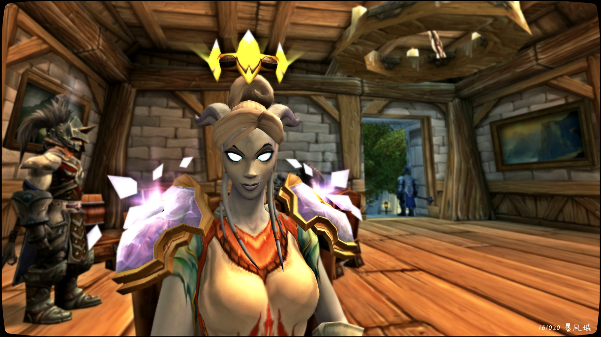

阿海洛 长叹一口气

\[伊琳娜嘉尔]: 我们做了调查

\[贤者尼苛德摩]: 你们要攻打石山修道院

\[伊琳娜嘉尔]: 您的出身

保禄神父 摸了摸自己的后脑勺

\[伊琳娜嘉尔]: 似乎并不能担任主教的职位

\[贤者尼苛德摩]: 你…..你们…..

\[伊琳娜嘉尔]: 有人建议我们

贤者尼苛德摩 气的发抖

\[伊琳娜嘉尔]: 利用这一点

\[贤者尼苛德摩]: 来人!

\[伊琳娜嘉尔]: 但我们希望

\[贤者尼苛德摩]: 卫队

\[克劳德]: 这些骑士是为了你好！

伊琳娜嘉尔  惊讶地看着眼前愤怒的老头

\[贤者尼苛德摩]: 护驾

\[亚尔夫海姆]: 卫队！

\[亚尔夫海姆]: 保护教宗!

伊琳娜嘉尔  想拿出武器，但却发现没有带

\[克劳德]: 昏眼的老修士！

\[贤者尼苛德摩]: 拿下他们

\[贤者尼苛德摩]: 拿下她

\[保禄神父]: 我就说这帮异教徒没有好东西！

\[亚尔夫海姆]: 围住她！

\[保禄神父]: 杀光这些异族！

伊琳娜嘉尔 无法抵挡这么多人攻击

伊琳娜嘉尔的法力不足。

\[保禄神父]: 圣光将会制裁这些卑劣的异端！

\[贤者尼苛德摩]: 带走

\[贤者尼苛德摩]: 带到教堂监狱

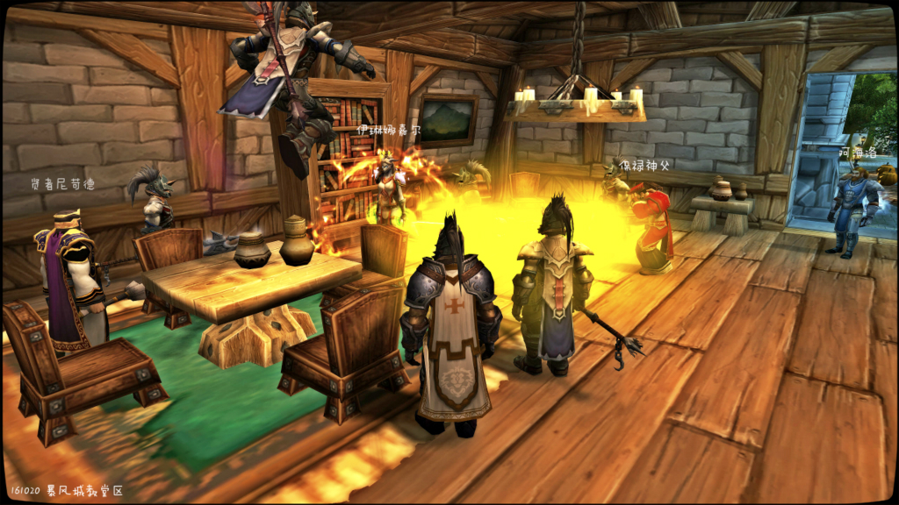

\[伊琳娜嘉尔]: 卡雷

\[伊琳娜嘉尔]: 卡雷

\[伊琳娜嘉尔]: 快去警告

保禄神父 冷冷的笑了笑

阿海洛 注意到炙热之心的旗帜

\[伊琳娜嘉尔]: 法瑞团长

\[亚尔夫海姆]: 自己走

\[贤者尼苛德摩]: 带到地牢

\[贤者尼苛德摩]: 让开

\[阿海洛]: 等等

\[伊琳娜嘉尔]: 你会后悔的主教

\[阿海洛]: 这位是我的同僚

\[阿海洛]: 到底发生了什么？

\[伊琳娜嘉尔]: 正义属于我们骑士团

\[贤者尼苛德摩]: 把他赶走

\[亚尔夫海姆]: 卫队，把他也拿下

\[保禄神父]: 呸！

\[保禄神父]: 异端也敢自称正义？！

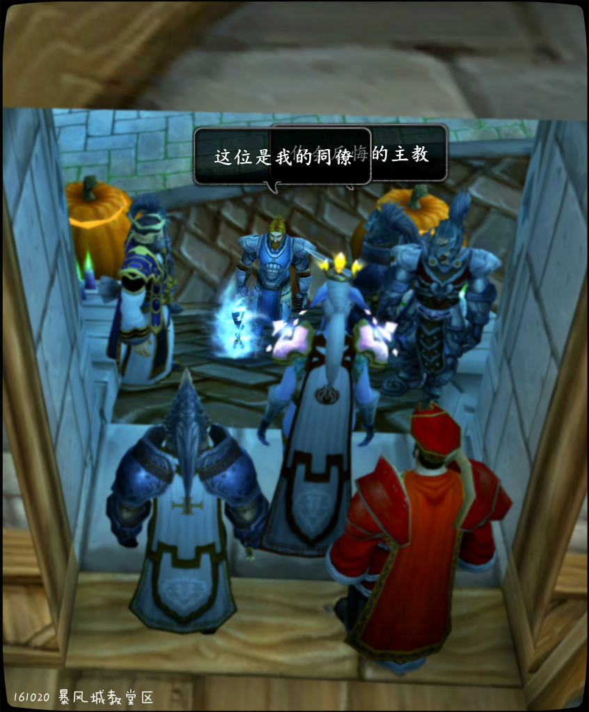

\[伊琳娜嘉尔]: 啊海洛

\[亚尔夫海姆]: 一起带走

\[亚尔夫海姆]: 出发

\[贤者尼苛德摩]: 一起带走

\[伊琳娜嘉尔]: 不

\[贤者尼苛德摩]: 走

\[保禄神父]: 你不是很好奇我在北方怎么对待那几个德莱尼的吗？

\[保禄神父]: 哈哈

诺亚丶兰盾 推了一把阿海洛

保禄神父向克罗雷修士鞠躬。

阿海洛 差点摔倒

伊琳娜嘉尔  感到全身颤栗

\[阿海洛]: 到底发生了什么？

\[贤者尼苛德摩]: 停下

保禄神父 摘下了帽子。轻蔑的笑了笑

\[伊琳娜嘉尔]: 啊海洛，抱歉让你卷进来了

\[贤者尼苛德摩]: 把他带过来

\[伊琳娜嘉尔]: 主教

\[伊琳娜嘉尔]: 请再考虑我们的建议

\[亚尔夫海姆]: 自己走吧

保禄神父 抓住伊琳娜嘉尔的下巴，仔细的看了看

\[诺亚丶兰盾]: 走

\[伊琳娜嘉尔]: 这是两败俱伤的结果

\[贤者尼苛德摩]: 停下

\[贤者尼苛德摩]: 把那个男人带来

\[保禄神父]: 恩….好俊的异端

\[诺亚丶兰盾]: 你上前去

\[伊琳娜嘉尔]: 请你放开他

保禄神父 舔了舔自己的嘴唇

\[贤者尼苛德摩]: 带上来

\[亚尔夫海姆]: 带到教宗面前

伊琳娜嘉尔 对眼前的男子感到恶心

诺亚丶兰盾 推了一把阿海洛

\[阿海洛]: 这里到底出了什么事情？

\[保禄神父]: 等等？这个小妞？

\[贤者尼苛德摩]: 把他的盔甲卸下

\[亚尔夫海姆]: 进去吧，自己走

\[保禄神父]: 圣光在上！是你！

\[贤者尼苛德摩]: 铐起来

\[亚尔夫海姆]: 他怎么还有武器

\[保禄神父]: 教宗大人！

\[亚尔夫海姆]: 缴械了

\[贤者尼苛德摩]: 怎么了

\[保禄神父]: 圣光在上！我想起来了！

伊琳娜嘉尔 握紧了拳头

\[保禄神父]: 这个德莱尼人我在北方见过！

\[保禄神父]: 哈哈

\[伊琳娜嘉尔]: 你胡说什么

\[贤者尼苛德摩]: 很好

\[贤者尼苛德摩]: 待下去

\[保禄神父]: 她就是那几个德莱尼的同伙！

\[保禄神父]: 哈哈

\[贤者尼苛德摩]: 来人

\[伊琳娜嘉尔]: 什么北方

\[贤者尼苛德摩]: 到下层地穴

\[贤者尼苛德摩]: 把这个女人待下去

\[贤者尼苛德摩]: 带下去

\[保禄神父]: 教宗！她拥有一把圣剑！

\[贤者尼苛德摩]: 圣剑？

\[保禄神父]: 一把曾经隶属于十字军的圣剑！

\[保禄神父]: 不错

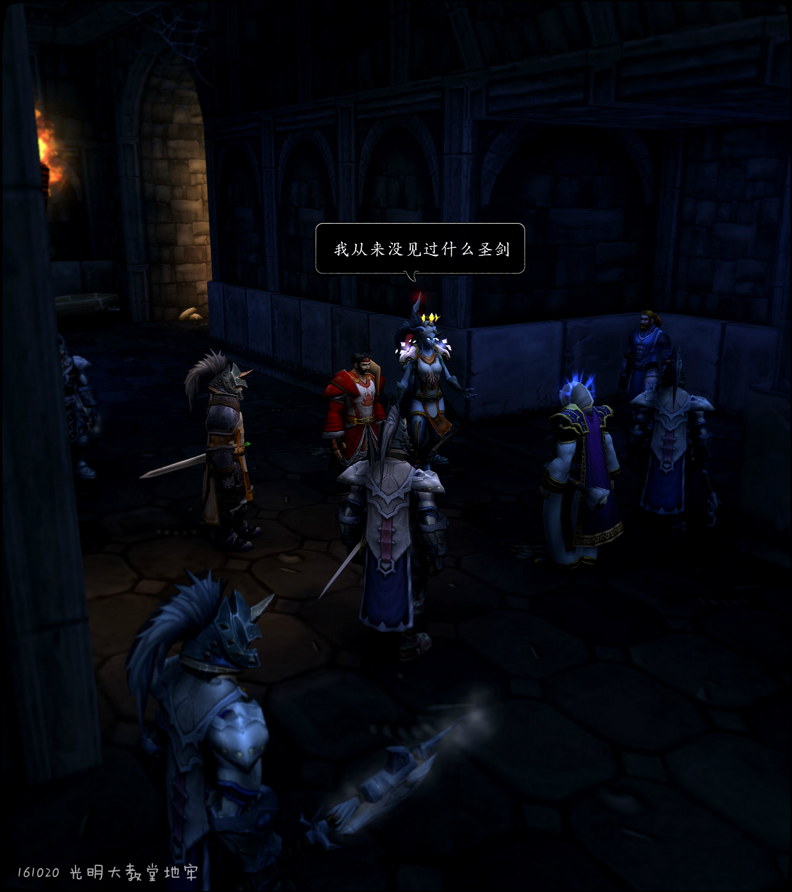

伊琳娜嘉尔 听到圣剑脸色变了一下

\[贤者尼苛德摩]: 真的？

\[伊琳娜嘉尔]: 胡说

\[伊琳娜嘉尔]: 我从来没见过什么圣剑

\[保禄神父]: 正是他们趁十字军不防备！从修道院盗取的！

\[贤者尼苛德摩]: 很好

\[保禄神父]: 胡说！

\[保禄神父]: 我记得你！

\[伊琳娜嘉尔]: 你这是污蔑

\[保禄神父]: 还有几个你的同伙！

\[保禄神父]: 哈哈

\[贤者尼苛德摩]: 把她给我带下去

\[伊琳娜嘉尔]: 圣光在上

\[保禄神父]: 他们到死都没有供出你 啊！

\[贤者尼苛德摩]: 扔下去

\[保禄神父]: 你就是化成灰！我也记得你那如同恶魔般丑陋的犄角！

伊琳娜嘉尔在贤者尼苛德摩面前跪下。

\[伊琳娜嘉尔]: 你们会后悔的

\[伊琳娜嘉尔]: 圣光会证明我的清白

伊琳娜嘉尔 感到浑身都传来剧痛，之前的打斗让她受了不少伤

\[贤者尼苛德摩]: 教堂卫队

\[贤者尼苛德摩]: 让她供出圣剑下落

\[亚尔夫海姆]: 先打

\[亚尔夫海姆]: 兄弟们，打了再问

\[伊琳娜嘉尔]: 我不会出卖骑士团的

伊琳娜嘉尔 感到意识模糊倒在了地上

\[亚尔夫海姆]: 好了，泼水

伊琳娜嘉尔 慢慢恢复了知觉

\[贤者尼苛德摩]: 停下

\[贤者尼苛德摩]: 在教堂

\[贤者尼苛德摩]: 不允许流血

\[阿瑞克斯博士]: …

\[亚尔夫海姆]: 我明白，教宗

伊琳娜嘉尔 虚弱地喘气

伊琳娜嘉尔 闭上眼睛

伊琳娜嘉尔 剧烈地疼痛让她晕厥后去

\[亚尔夫海姆]: 继续泼水

\[亚尔夫海姆]: 弄醒

\[安德拉丶热血]: 没有水了 主教

\[亚尔夫海姆]: 既然如此

\[亚尔夫海姆]: 你

\[贤者尼苛德摩]: 住手

\[亚尔夫海姆]: 说不说

安德拉丶热血 看不下去了

\[伊琳娜嘉尔]: 我、、、什么。。。也不 知道

伊琳娜嘉尔 开始说德莱尼语

\[亚尔夫海姆]: 教宗，此人就是不开口

\[贤者尼苛德摩]: 换一个

\[亚尔夫海姆]: 该如何是好

\[贤者尼苛德摩]: 换一个方式

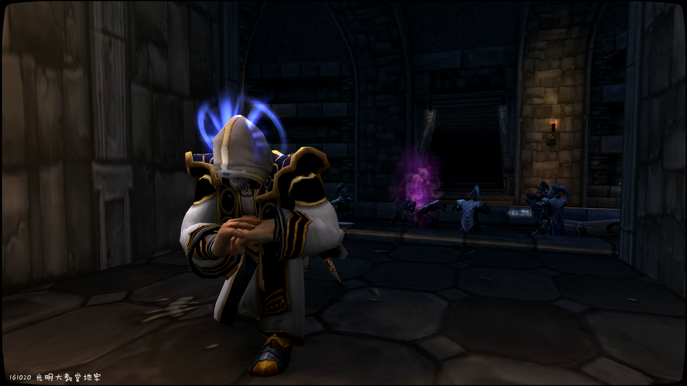

亚尔夫海姆对贤者尼苛德摩点了点头。

\[贤者尼苛德摩]: 我想想

\[伊琳娜嘉尔]: ZENN ZENN

\[贤者尼苛德摩]: 拔出指甲

\[亚尔夫海姆]: 已经快不行了

\[贤者尼苛德摩]: 拔出指甲

\[亚尔夫海姆]: 教宗

\[亚尔夫海姆]: 他的手指已经被敲碎了

亚尔夫海姆对贤者尼苛德摩点了点头。

\[亚尔夫海姆]: 你们听到了

\[亚尔夫海姆]: 动手

伊琳娜嘉尔 胡言乱语了一通。

\[伊琳娜嘉尔]: 啊！！

\[休丶格拉斯]: 别被发现（小声

\[伊琳娜嘉尔]: 我。。

\[伊琳娜嘉尔]: 我。。

\[亚尔夫海姆]: 说不说

\[贤者尼苛德摩]: 说出圣剑的下落

\[伊琳娜嘉尔]: 圣剑

\[伊琳娜嘉尔]: 就在

\[贤者尼苛德摩]: 圣剑在哪儿

\[伊琳娜嘉尔]: 在你的。。。家里。。你这个贼

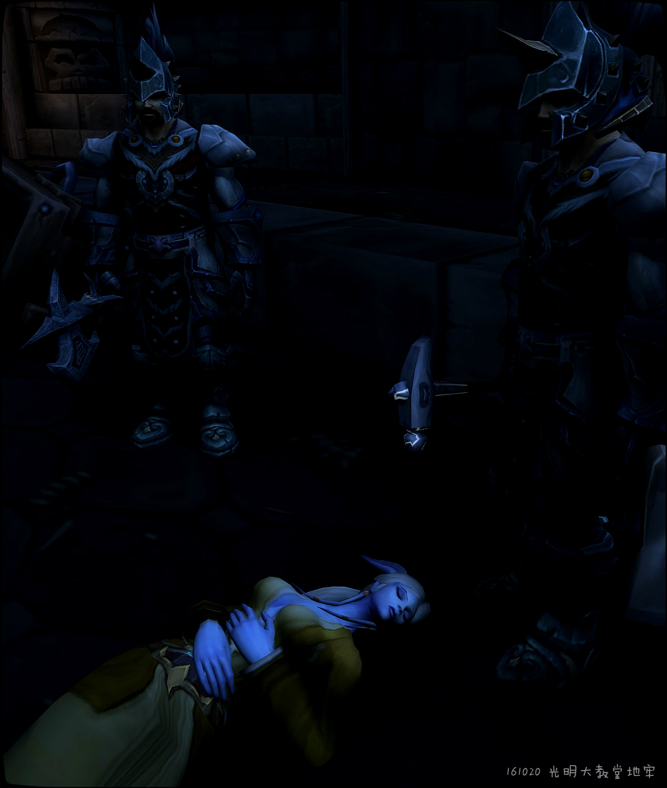

\[亚尔夫海姆]: 继续打

伊琳娜嘉尔 昏死了过去

\[贤者尼苛德摩]: 住手

\[贤者尼苛德摩]: 哈哈

\[贤者尼苛德摩]: 真是顽强

\[贤者尼苛德摩]: 请异端裁判所来

\[贤者尼苛德摩]: 异端裁判所的审查者

\[贤者尼苛德摩]: 拷问秘密

伊琳娜嘉尔 感到了一丝暖意

\[贤者尼苛德摩]: 这里有个异端

\[贤者尼苛德摩]: 拒绝透露圣剑下落

\[贤者尼苛德摩]: 请你来拷问

\[贤者尼苛德摩]: 让开

\[波尔博一血眼]: 我来试试

\[贤者尼苛德摩]: 让开

\[波尔博一血眼]: 你说不说

\[波尔博一血眼]: 圣剑的下落

伊琳娜嘉尔 微弱地呼吸着

\[伊琳娜嘉尔]: 你。。。

\[伊琳娜嘉尔]: 我。。不。。

波尔博一血眼 审打 伊琳娜嘉尔

\[休丶格拉斯]: 波尔博，给她一刀

\[波尔博一血眼]: 给我说！

\[波尔博一血眼]: 圣剑的下落

\[伊琳娜嘉尔]: 杀了。。。我吧

\[伊琳娜嘉尔]: 让我。。。回。。。阿古斯

波尔博一血眼 拿出吐真剂

休丶格拉斯 轻蔑的看着这个地上的德莱尼

\[波尔博一血眼]: 你说不说

伊琳娜嘉尔 闭上眼睛

波尔博一血眼 把吐真剂给德莱尼喝下去了

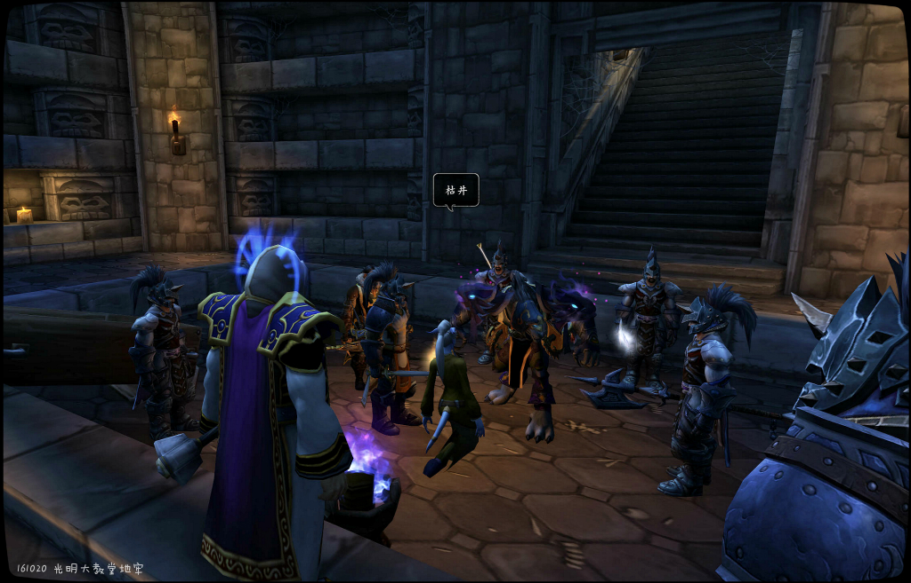

\[伊琳娜嘉尔]: 啊！

\[波尔博一血眼]: 现在

伊琳娜嘉尔在波尔博一血眼面前跪下。

\[波尔博一血眼]: 给我说出圣剑的下落

\[伊琳娜嘉尔]: 是的。。

\[伊琳娜嘉尔]: 圣剑。。。啊

\[伊琳娜嘉尔]: 圣剑就在。。

\[波尔博一血眼]: 说！

\[伊琳娜嘉尔]: 就在旧城区。。。

\[伊琳娜嘉尔]: 枯井

\[休丶格拉斯]: 很好

\[伊琳娜嘉尔]: 枯井

\[波尔博一血眼]: 这个地方？

\[贤者尼苛德摩]: 很好

\[贤者尼苛德摩]: 把德莱尼人带去医院

\[贤者尼苛德摩]: 带到医院去

伊琳娜嘉尔 昏了过去

\[休丶格拉斯]: 波尔博，干得不错，现在交给神父吧

\[贤者尼苛德摩]: 目前

\[波尔博一血眼]: 好的

\[亚尔夫海姆]: 不杀了?

\[贤者尼苛德摩]: 我不能让她死了

\[贤者尼苛德摩]: 在明日法庭上

\[亚尔夫海姆]: 为何

\[贤者尼苛德摩]: 我要她出面

亚尔夫海姆对伊琳娜嘉尔点了点头。

\[亚尔夫海姆]: 听你的

\[贤者尼苛德摩]: 把她带去医院

\[贤者尼苛德摩]: 孤儿院那边

\[亚尔夫海姆]: 带走

\[贤者尼苛德摩]: 其他人

\[贤者尼苛德摩]: 广场等候

休丶格拉斯向贤者尼苛德摩鞠躬。

\[波尔博一血眼]: 神父我们的审判官大人正在休息

\[休丶格拉斯]: 走吧 波尔博

\[贤者尼苛德摩]: 是啊

\[贤者尼苛德摩]: 我说怎么你们

\[贤者尼苛德摩]: 如此

\[贤者尼苛德摩]: 温和

亚尔夫海姆指着卢卡斯丶韦尔。

卢卡斯丶韦尔看着亚尔夫海姆。

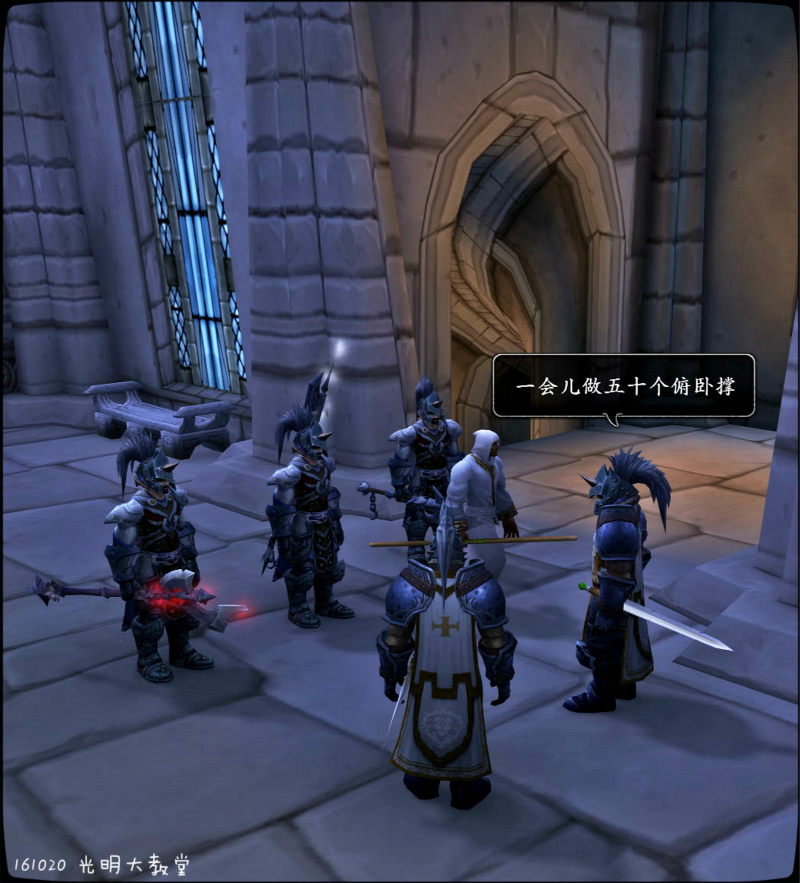

\[亚尔夫海姆]: 你这个水都喷不准的歪靶子斗鸡眼

\[亚尔夫海姆]: 一会儿做五十个俯卧撑

\[卢卡斯丶韦尔]: 喷歪的不是我！

\[亚尔夫海姆]: 那也惩罚你

\[贤者尼苛德摩]: 旧城区集合

\[贤者尼苛德摩]: 卫队

\[贤者尼苛德摩]: 出动

\[贤者尼苛德摩]: 真是肮脏

\[亚尔夫海姆]: 穷你妈，滚

\[贤者尼苛德摩]: 守好路口

\[贤者尼苛德摩]: 每个路口两个人

\[亚尔夫海姆]: 士兵，守好路口

贤者尼苛德摩 把绳子提起

教堂卫兵 看到绳子末端的剑

贤者尼苛德摩 眼前出现一把金色的巨剑

贤者尼苛德摩 抓起大剑

\[贤者尼苛德摩]: 圣剑，已经找到

\[贤者尼苛德摩]: 把圣剑拿着

\[贤者尼苛德摩]: 带回教堂

安德拉丶热血 目光炽热的看着这把剑

\[贤者尼苛德摩]: 明天

教堂卫兵 接过剑

\[贤者尼苛德摩]: 可以直接定义他们是异端邪说了

\[安德拉丶热血]: 是！

\[贤者尼苛德摩]: 啊

\[贤者尼苛德摩]: 二位

\[贤者尼苛德摩]: 怎么会出现在如此恶臭的旧城区

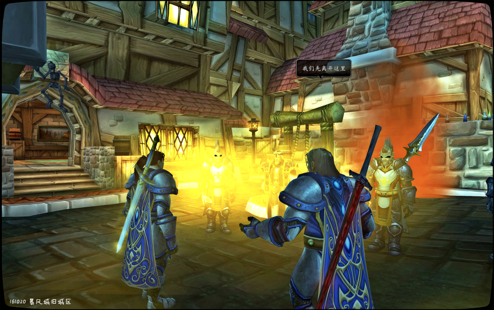

\[诺亚丶兰盾]: 这在干什么？

卢卡斯丶韦尔看着贤者尼苛德摩。

\[诺亚丶兰盾]: 这么多人可不正常

诺亚丶兰盾 打量着这几个人

\[贤者尼苛德摩]: 难道教堂卫队不允许离开教堂保护我的安全吗

诺亚丶兰盾 看了看四周

\[卢卡斯丶韦尔]: 平时喝酒的时候可没见你带这么多人

\[贤者尼苛德摩]: 教堂卫队一直被人暗杀

\[贤者尼苛德摩]: 都是那群不戴帽子的兄弟会

\[诺亚丶兰盾]: 但是这里也不是什么“好地方” 吧

\[贤者尼苛德摩]: 是啊

\[贤者尼苛德摩]: 恶丑无比

\[贤者尼苛德摩]: 我们来指挥中心谈论事情的

卢卡斯丶韦尔 捂着鼻子挥了挥手

\[贤者尼苛德摩]: 明日要审判一个异端邪说

\[诺亚丶兰盾]: 我们先离开这里

\[贤者尼苛德摩]: 无论明天结局如何

卢卡斯丶韦尔对诺亚丶兰盾点了点头。

\[贤者尼苛德摩]: 都要烧死他们

诺亚丶兰盾 看了眼潮湿的水井边

\[诺亚丶兰盾]: 你们用过水井？

\[贤者尼苛德摩]: 是啊

\[贤者尼苛德摩]: 可以除臭

\[诺亚丶兰盾]: 最好别用 最近水质不好

诺亚丶兰盾 仔细的看了看

\[诺亚丶兰盾]: 这的桶呢

\[诺亚丶兰盾]: 没桶你们怎么用的

\[贤者尼苛德摩]: 无可奉告

卢卡斯丶韦尔 探头向井里看了看

诺亚丶兰盾 拉起绳子

诺亚丶兰盾 发现是断了

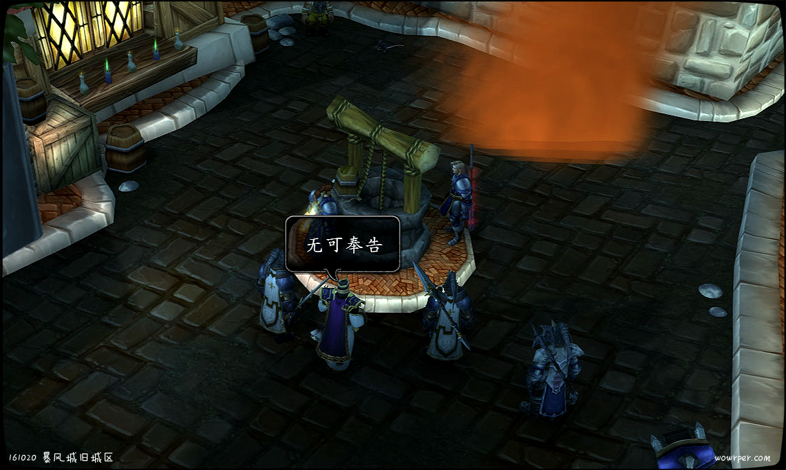

\[诺亚丶兰盾]: 恩 好吧&#x20;

\[贤者尼苛德摩]: 好了

\[贤者尼苛德摩]: 没事我们走了

\[诺亚丶兰盾]: 既然没什么 就走吧

诺亚丶兰盾 看了眼卢卡斯

卢卡斯丶韦尔对诺亚丶兰盾点了点头。
