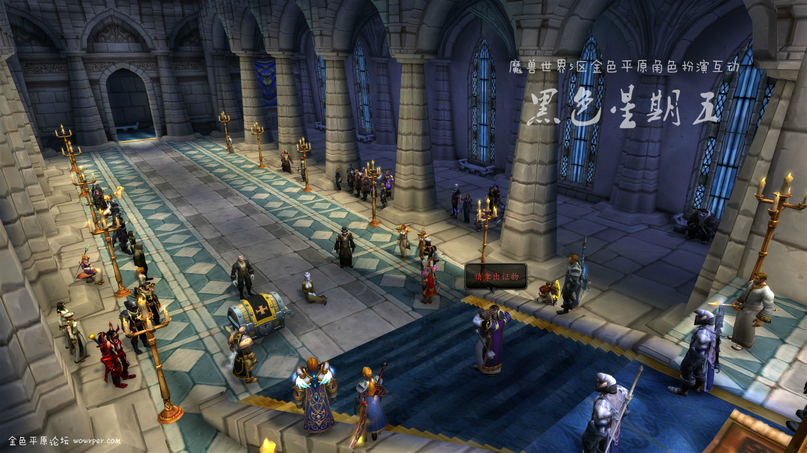
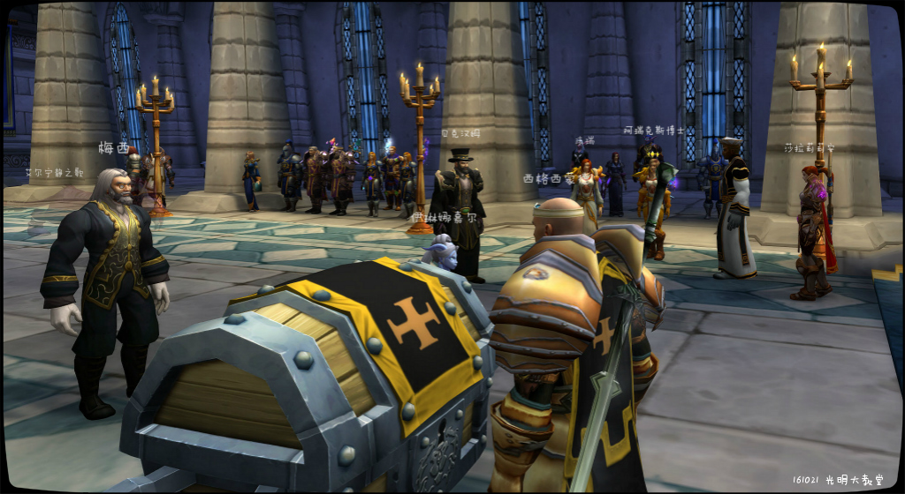
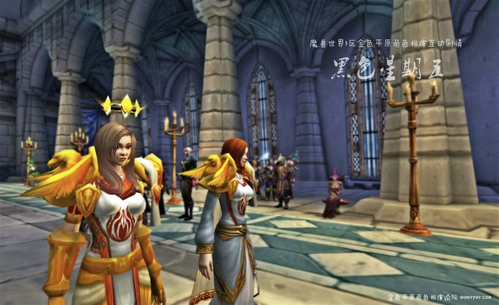

# 第七幕 黑色星期五审判

第七幕 黑色星期五审判

贤者尼苛德摩在一个星期五审判了炙热之心骑士团，并将其斥为异端。在审判庭上，律师贝克汉姆、齐达内和梅西为骑士团辩护。贝克汉姆以骑士团成立于洛丹伦，当时需要两年之内需要向所属地的宗主教呈报文件令，而贤者尼苛德摩当时并非洛丹伦宗主教为由，认为尼苛德摩的审判理由不成立。

教会这边则呈上证人伊琳娜嘉尔，证物：头颅、血色十字军盾牌以及命运之剑，并说是伊琳娜嘉尔背叛了骑士团，供出了圣剑的下落。教会因此在庭上鞭打了伊琳娜嘉尔。

情急之下，贝克汉姆律师终于使用了格里高利修士的谗言——认为贤者尼苛德摩由于出身为瓜农，并无权审判受到王国承认的贵族家族的法瑞女士。


宗主教大怒，下令处死骑士团众人以及三位律师。此时军情七处的代理人厄波曼打断庭审，莫名其妙地称呼法瑞为“深影女士”。他还说了一句无人明白的暗语：“烟幕和火光吓跑了我的金丝雀”，说完便退回原位。


贤者尼苛德摩再次宣读骑士团的罪名，并要求执行死刑判决。此时——一阵令人盲目的既像光芒又像烟雾的光幕遮蔽了教堂，加上参与了此次法庭的观众有的对庭审结果不满，法庭一时大乱。炙热之心骑士团的司库阿瑞克斯博士趁乱逃跑。


混乱平息后，尼苛德摩终于要对梅西、贝克汉姆和法瑞执行死刑。三人被拉到暴风城外的柴堆处。梅西：死于被推下刑台。贝克汉姆：死于砍头。法瑞……正当法瑞要被推上火刑架时，一个黑衣人驾驶摩托，飞车从刑台上救下法瑞。他们消失在暴风城的夜色中。


黑色星期五审判的完整记录见《黑色星期五审判》


记得看这篇，非常史诗！

\[贤者尼苛德摩]: 异端邪说的存在导致王国危机四伏

法瑞雅 环视四周，并不觉得自己是异端邪说

西格西蒙德 目光坚毅

\[贤者尼苛德摩]: 我们要在这里定论他们是否为异端邪说

\[贤者尼苛德摩]: 现在

\[贤者尼苛德摩]: 关上教堂大门

## 黑色星期五审判

这是《黑色星期五》角色扮演互动剧情的第七幕-黑色星期五审判。

感谢所有人参与。途中虽然时光沙漏了2次，但这次审判庭活动最终效果很不错。既有惊喜又有惊吓……

这段剧情非常史诗，而且很长，所以分段发。

尹弗勒尔斯：贝克汉姆

管家艾德：梅西

泰伯丶塞普汀：齐达内

其他人扮演自己

异端邪说的存在导致王国危机四伏

星期五九点钟声响起，审判开始。炙热之心骑士团的成员被宗主教贤者尼苛德摩宣布为异端。

\[贤者尼苛德摩]: 异端邪说的存在导致王国危机四伏

法瑞雅 环视四周，并不觉得自己是异端邪说

西格西蒙德 目光坚毅

\[贤者尼苛德摩]: 我们要在这里定论他们是否为异端邪说

\[贤者尼苛德摩]: 现在

\[贤者尼苛德摩]: 关上教堂大门

\[贤者尼苛德摩]: 异端邪说者

戴佛斯爵士眯着眼睛看着你。

\[贤者尼苛德摩]: 我允许你为自己辩护

贤者尼苛德摩指着你。

\[法瑞雅]: 法律，法律允许我们辩护。

\[法瑞雅]: 而不是任何一个人。

\[贤者尼苛德摩]: 这里不是普通法庭!

\[贤者尼苛德摩]: 这里是！

\[贤者尼苛德摩]: 异端审判庭

波尔博一血眼满怀敬意地向西格西蒙德致礼。

休丶格拉斯满怀敬意地向西格西蒙德致礼。

\[贤者尼苛德摩]: 你们能来这里

\[贤者尼苛德摩]: 说明你们本事很大

\[贤者尼苛德摩]: 能异端邪说了罪名本事能不大吗？

贤者尼苛德摩在嘲笑你。

齐达内长长地叹了一口气。

冰点灵魂-石爪峰大笑。

戴佛斯爵士大笑。

埃尔莉娅在嘲笑罗兰丶贝隆。

罗兰丶贝隆大笑。

冰点灵魂-石爪峰大笑。

埃尔莉娅大笑。

西格西蒙德 露出轻蔑的耻笑

莱莎丶雪诺在嘲笑杜维丨罗林。

冰点灵魂-石爪峰大笑。

冰点灵魂-石爪峰大笑。

低语者希尔娜在嘲笑贤者尼苛德摩。

潘弗杨丶瑟朗在嘲笑西格西蒙德。

代理人厄波曼 抓了抓头发

诺亚丶兰盾 不屑的哼了一下

.jpg>)

\[贤者尼苛德摩]: 异端邪说者成员

猎魔者亚诺满怀敬意地向威廉丶肯尼迪致礼。

\[贤者尼苛德摩]: 法瑞

\[贤者尼苛德摩]: 阿瑞克斯

代理人厄波曼 觉得这个名字不如自己以前熟悉的名字好

\[贤者尼苛德摩]: 阿海洛

\[阿瑞克斯博士]: 我们是神圣骑士

\[猎魔者亚诺]: 居然是她？

代理人厄波曼 于是皱了皱眉头

\[贤者尼苛德摩]: 还有一个德莱尼叫啥来着

\[贤者尼苛德摩]: 审判长

猎魔者亚诺 小声嘀咕

\[贤者尼苛德摩]: 那个德莱尼叫啥

\[西格西蒙德]: 伊琳娜

\[贤者尼苛德摩]: 你确定？

\[西格西蒙德]: 是的

\[诺亚丶兰盾]: 伊琳娜嘉尔 （小声）

\[贤者尼苛德摩]: 下去吧

\[贤者尼苛德摩]: 伊琳娜·嘉尔

法瑞雅 知道伊琳娜嘉尔失踪原来因为教会抓捕了她，记在心里。

\[贤者尼苛德摩]: 你们对此有何异议

\[莉亚丶摩恩]: 吊死她！

\[法瑞雅]: 这是非法监禁。

莉莉丝丶翠花对着阿瑞克斯博士叹了口气。

\[高德丶弗里曼]: 洛丹伦人要大闹教堂？（小声）

艾登丶霍尔对着高德丶弗里曼耸了耸肩说：“天知道。”

\[贤者尼苛德摩]: 我警告你们

\[贤者尼苛德摩]: 轻举妄动的话

\[尼亚圣光之翼]: 白银之手，把武器收起来，他们没有恶意

\[代理人厄波曼]: 还是听明白再说，我的建议

梅西 看了一眼身边的大卫

\[贤者尼苛德摩]: 你们将再次血溅当场

贤者尼苛德摩指着阿瑞克斯博士。

\[贝克汉姆]: （小声）梅西…律师社并没有说今天会出现辩论以外的事情。出了问题咱俩还是先逃

\[代理人厄波曼]: 让异端可以心服口服

\[法瑞雅]: 不，圣光在我们这边。

\[法瑞雅]: 不过律师们还是赶紧跑（小声）

\[阿瑞克斯博士]: 小角身上的伤痕能说明谁是犯人

\[贤者尼苛德摩]: 那为何你们不向我缴纳文书

\[梅西]: （小声）今天的事看起来不简单…小心行事…

\[贤者尼苛德摩]: 为何拒绝教会的册封？

贤者尼苛德摩指着你。

梅西看着贝克汉姆。

\[贝克汉姆]: 审判长大人

\[贝克汉姆]: 律师大卫丶贝克汉姆请求发言

\[尼亚圣光之翼]: 白银之手的骑士们，把武器收起来

\[梅西]: 审判长大人，律师梅西请求发言！

\[贤者尼苛德摩]: 一个一个发言

\[尼亚圣光之翼]: 这是合法的审判

戴佛斯爵士对尼亚圣光之翼点了点头。

律师梅西的发言

律师梅西为炙热之心骑士团辩护……是吗？

\[贝克汉姆]: 那么，梅西，你先

贤者尼苛德摩指着梅西。

\[贤者尼苛德摩]: 梅西律师

\[贤者尼苛德摩]: 你对此控诉

\[贤者尼苛德摩]: 有何解释

\[梅西]: 审判长大人

法瑞雅 看着梅西，认为他肯定准备好了。

\[梅西]: 我提议，对待犯下如此罪责的犯人不可掉以轻心

\[贤者尼苛德摩]: 我允许你辩护你的受辩护者

\[贤者尼苛德摩]: 嗯，我也觉得

\[梅西]: 一定要严刑处置

\[贤者尼苛德摩]: 我也这么认为的

\[梅西]: 至于他们的罪责，律师大卫非常清楚

法瑞雅 开始好奇梅西到底是不是站在同一边的。

梅西看着贝克汉姆。

\[贤者尼苛德摩]: 嗯

\[贤者尼苛德摩]: 很好

\[法瑞雅]: 他是我们的律师吗？

律师齐达内的发言

律师齐达内要求教会出示证据，没有证据就没有公正的审判！结果却……

\[贝克汉姆]: 检察长大人，被告律师大卫丶贝克汉姆请求发言

\[贤者尼苛德摩]: 不允许

\[贤者尼苛德摩]: 齐达内发言

贤者尼苛德摩指着齐达内。

齐达内对着凯莉文森叹了口气。

西格西蒙德 冷笑一声

莉莉丝丶翠花 戳了戳艾登

艾登丶霍尔对莉莉丝丶翠花露出了微笑。

\[齐达内]: 审判长！

蕾恩卡丶星焰 指了指传送门示意着法瑞雅

卧龙吟丶大壮 戳了戳艾登

\[齐达内]: 你的证据在哪！

\[贤者尼苛德摩]: 证据？

\[莉莉丝丶翠花]: 你成陪审团了（小声）

\[贤者尼苛德摩]: 你要证据吗？

\[齐达内]: 你说他们是异端！

法瑞雅 看见了蕾恩卡丶星焰的传送门

\[西格西蒙德]: 闭嘴！

\[齐达内]: 为了那些被火烤的人！

\[贤者尼苛德摩]: 割掉他舌头

\[卧龙吟丶大壮]: 看着就行，希尔娜

\[齐达内]: 你才是应该站在大厅中央的人！

\[莉莉丝丶翠花]: 真是悲惨（小声）

\[卧龙吟丶大壮]: 别被扯进去

西格西蒙德 拿出匕首

\[蕾恩卡丶星焰]: 快

\[凯莉文森]: 下去

\[贤者尼苛德摩]: 贝克汉姆律师

尼亚圣光之翼 心想。。。这才是刚开始吗？

\[低语者希尔娜]: 放心我从不怕惹事

艾登丶霍尔 挑了挑眉毛

\[齐达内]: 圣光的正义终将实现！

\[代理人厄波曼]: 唔，这挺刺激

\[贝克汉姆]: 审判长大人

\[卧龙吟丶大壮]: 割舌头了（小声

代理人厄波曼  看了看旁边的一群人&#x20;

.jpg>)

律师贝克汉姆的发言

律师贝克汉姆极其专业。喜欢贝克汉姆的女士们不应错过。他是全艾泽拉斯最专业的律师之一。

\[贝克汉姆]: 被告方律师大卫丶贝克汉姆请求发言

\[阿瑞克斯博士: 他们要烧了我们的律师

莉莉丝丶翠花 捂住了眼睛不敢看

贝克汉姆优雅的鞠了一躬。

\[贤者尼苛德摩]: 你的同僚对我的羞辱是不可饶恕的

贝克汉姆点了点头。

\[贤者尼苛德摩]: 我希望你不要妄自菲薄

\[贝克汉姆]: 请按照宗教律法处理

\[贤者尼苛德摩]: 很好

\[贤者尼苛德摩]: 允许你发言

\[阿瑞克斯博士]: 这里是教堂

\[贝克汉姆]: 首先，被告方，大团长法瑞·图尔加斯女士

\[齐达内]: 人民终究不会屈服于你的！

\[贝克汉姆]: 贵军团是否是有前洛丹伦市民组成

\[法瑞雅]: 是的

贝克汉姆点了点头。

\[法瑞雅]: 我们大多是洛丹伦人！

\[贝克汉姆]: 请问贵军团再组成之前是否洛丹伦尚未沦陷

\[齐达内]: 割了我的舌头也不能改变什么！

\[齐达内]: 啊啊…..！！

\[低语者希尔娜]: 审判一支军团

\[低语者希尔娜]: 有能耐

尼亚圣光之翼 心里一阵酸楚

\[莉亚丶摩恩]: 也许吧，你带了足够的调料了吗？

\[贝克汉姆]: 法瑞女士？

\[贤者尼苛德摩]: 割掉舌头

\[法瑞雅]: 不，我们是在沦陷时期成立的，因为洛丹伦需要任何愿意保护她的人。

贝克汉姆点了点头。

\[卧龙吟丶大壮]: 我想是的（小声

\[贤者尼苛德摩]: 现在法庭继续审判

\[贝克汉姆]: 请问教宗

\[贤者尼苛德摩]: 说

\[高德丶弗里曼]: 洛丹伦人也是能忍（自言自语）

艾登丶霍尔点了点头。

\[达伦丶乌瑞恩]: 独裁

\[低语者希尔娜]: 既然是一个将领…还是不够莽啊

\[贤者尼苛德摩]: 割掉那些人的舌头

\[西格西蒙德]: 安静！

\[贝克汉姆]: 教宗大人在洛丹伦沦陷之时是否为暴风城圣光大教堂牧师

莉莉丝丶翠花 嘀咕了一声

\[齐达内]: 你可以不让我发声！但你夺不走人们的心声！

\[齐达内]: 啊…！

\[贤者尼苛德摩]: 现在继续审判

\[贝克汉姆]: 请问

\[贝克汉姆]: 教宗大人在洛丹伦沦陷之时是否为暴风城圣光大教堂牧师

\[贤者尼苛德摩]: 没有

贝克汉姆点了点头。

\[贤者尼苛德摩]: 这和法庭审判有关系吗？

凯莉文森 对捣乱者比划了一个抹脖子的动作

\[低语者希尔娜]: 我佩服那个将军的耐心

\[贝克汉姆]: 那么根据民事诉讼法律一七三号文件令。法瑞女士的骑士团在成立之时以及两年之内需要向所属地的教宗呈报文件令

\[贤者尼苛德摩]: 停一下

\[贝克汉姆]: 但是，请原谅，教宗大人在那段时间既不是洛丹伦的宗教人员

贝克汉姆点了点头。

\[贤者尼苛德摩]: 停一下

\[达伦丶乌瑞恩]: 太残忍了（小声）

\[贤者尼苛德摩]: 拔剑

你对贝克汉姆点了点头。

高德丶弗里曼对贝克汉姆点了点头。

\[尼亚圣光之翼]: ？

\[贤者尼苛德摩]: 驱逐吵闹者

\[尼亚圣光之翼]: 啊。。。。

贝克汉姆 长叹一口气

西格西蒙德 感觉脏活总是干不完

\[尼亚圣光之翼]: 稍安勿躁

\[贝克汉姆]: （小声）吓死我了

法瑞雅 认为贝克汉姆不仅在达拉然足协很专业。

梅西 瑟瑟发抖

\[蕾恩卡丶星焰]: 待会我会召唤传送门（小声）

\[尼亚圣光之翼]: 教会的各位，这里在进行审判

\[尼亚圣光之翼]: 我理解各位的想法

\[尼亚圣光之翼]: 但是还是请以审判为重

\[尼亚圣光之翼]: 并非如此

\[低语者希尔娜]: 你会死的….

\[莉亚丶摩恩]: 我就等着收割这些不安的灵魂了

\[低语者希尔娜]: 他是..施法者…

\[贤者尼苛德摩]: 如果再有人吵闹

\[贤者尼苛德摩]: 直接驱逐

凯莉文森满怀敬意地向贤者尼苛德摩致礼。

\[尼亚圣光之翼]: 抱歉

卧龙吟丶大壮 挠头

\[尼亚圣光之翼]: 委屈你们了

\[凯莉文森]: 是

\[贤者尼苛德摩]: 允许拔剑流血

\[艾瑞森丶风歌]: 记住！你们这群逆贼！没人能够真正与我们做对！因为他们都死了！

\[凯莉文森]: 明白了

\[尼亚圣光之翼]: 没事

\[法瑞雅]: 你一定要趁乱逃跑（对阿瑞克斯博士小声说）

\[尼亚圣光之翼]: 并非如此，我们负责维持秩序，也就是我也不希望结束前任何无辜者受伤

\[阿瑞克斯博士]: 为什么

\[西格西蒙德]: 叙旧以后再吧，现在安静的观审

\[阿瑞克斯博士]: 这里是教堂啊

\[尼亚圣光之翼]: 放心，没事

\[法瑞雅]: 因为这次审判明显不公正（小声）

\[阿瑞克斯博士]: 而我是神圣骑士

\[莉莉丝丶翠花]: 我怎么觉得像是黑手党（小声）

\[尼亚圣光之翼]: 那么我先回去了

\[卧龙吟丶大壮]: 黑社会现场（小声

\[阿瑞克斯博士]: 看，她们也在

诺亚丶兰盾 看了眼卧龙吟丶大壮

莉莉丝丶翠花 点了点头

\[贤者尼苛德摩]: 继续开庭

贤者尼苛德摩指着贝克汉姆。

\[贤者尼苛德摩]: 重新发言

代理人厄波曼 笑着嘟囔着真是一个和睦的大家庭。。

\[贝克汉姆]: 那么根据民事诉讼法律一七三号文件令。法瑞女士的骑士团在成立之时以及两年之内需要向所属地的教宗呈报文件令

\[贝克汉姆]: 但是，请原谅，教宗大人在那段时间既不是洛丹伦的宗教人员

\[贤者尼苛德摩]: 那有何关系？

\[贝克汉姆]: 亦不是暴风城的宗教人员

\[贤者尼苛德摩]: 这和本案有关吗？

\[贝克汉姆]: 而如今，根据民事诉讼法二五七条令

\[贝克汉姆]: 对于骑士团文件的所求已过速效期

\[贝克汉姆]: 因此教宗大人并不能因为骑士团没有上交文件

\[贝克汉姆]: 而对他们进行处罚

证人伊琳娜嘉尔

天威骑士伊琳娜嘉尔被传唤上庭，然而……

\[贤者尼苛德摩]: 哈哈

\[贤者尼苛德摩]: 很有道理嘛

\[贤者尼苛德摩]: 接下来

\[贤者尼苛德摩]: 审判长

\[贤者尼苛德摩]: 把证物带上来

\[贤者尼苛德摩]: 还有证人

\[西格西蒙德]: 好的

\[贤者尼苛德摩]: 传令下去

\[代理人厄波曼]: 唔还有证物。。

\[贤者尼苛德摩]: 带证人和证物上台

\[代理人厄波曼]: 会是什么东西

\[西格西蒙德]: 带她上来

法瑞雅 在准备几段圣光祈文

\[凯莉文森]: 传证人证物上台！

\[代理人厄波曼]: 钱箱?尸体？

\[西格西蒙德]: 跪下！

\[阿瑞克斯博士]: 伤痕累累的德莱尼。

卢卡斯丶韦尔看着伊琳娜嘉尔。

\[法瑞雅]: 嘉尔！

代理人厄波曼 饶有兴趣地用手托着下巴

伊琳娜嘉尔 看到法瑞雅非常激动

法瑞雅 看到了伊琳娜嘉尔苍白的脸色。

伊琳娜嘉尔在你面前跪下。

诺亚丶兰盾 偏过头看了一眼

\[法瑞雅]: 你们对她做了什么？

\[西格西蒙德]: 在此之前

你指着贤者尼苛德摩。

\[凯莉文森]: 请不要激动

\[齐达内]: 骗子！

\[凯莉文森]: 退回您的位置

\[伊琳娜嘉尔]: 法瑞。。

\[西格西蒙德]: 犯人想要逃跑

\[伊琳娜嘉尔]: 不要担心我

尼亚圣光之翼 看了看德莱尼

\[西格西蒙德]: 格拉斯

\[西格西蒙德]: 软弱和逃脱是什么处罚！

代理人厄波曼 发现被带上来的这个人似乎受到了拷打

\[休丶格拉斯]: 十鞭刑

\[西格西蒙德]: 把我的鞭子给我

伊琳娜嘉尔 闭目开始呢喃着德莱尼语

\[法瑞雅]: 什么？

\[莉莉丝丶翠花]: 可怜的德莱尼（小声）

\[法瑞雅]: 不准打她。

休丶格拉斯 将辫子递给审判官

\[西格西蒙德]: 你计数！

\[法瑞雅]: 这还是法庭吗？

伊琳娜嘉尔 胡言乱语了一通。

\[休丶格拉斯]: 是

\[法瑞雅]: 这有一点圣光的正义吗？

\[凯莉文森]: 请退下

西格西蒙德 舞动鞭子

\[贤者尼苛德摩]: 退下

\[休丶格拉斯]: 1

贤者尼苛德摩指着你。

\[法瑞雅]: 不，不许乱打。

\[法瑞雅]: 你们都看见了？

\[伊琳娜嘉尔]: 法瑞大人。。。为了。。为了骑士团

西格西蒙德 抽打德莱尼

\[休丶格拉斯]: 2

\[伊琳娜嘉尔]: 啊

\[休丶格拉斯]: 2

莉莉丝丶翠花 惊呼了一声

\[代理人厄波曼]: ，，，

\[法瑞雅]: 你们每一个人，都看见了？

凯莉文森 按住伊琳娜嘉尔

诺亚丶兰盾 摇了摇头

\[莉亚丶摩恩]: 叫声不错哦

\[蕾恩卡丶星焰]: 是的我看见了

\[凯莉文森]: 你们看到了什么吗？

代理人厄波曼 看着被鞭打的德莱尼没有说一句话&#x20;

\[凯莉文森]: 你们看到了什么吗？

西格西蒙德 看着血印面无表情，继续行刑

\[伊琳娜嘉尔]: 圣光。。。圣光会见证我的。。清白

\[休丶格拉斯]: 3

\[伊琳娜嘉尔]: 啊

\[代理人厄波曼]: 哦哦我看见可以一位美丽的女士

\[尼亚圣光之翼]: 唉。。。。。

凯莉文森 按住伊琳娜嘉尔

\[休丶格拉斯]: 4

莉莉丝丶翠花 捂住了眼睛

\[休丶格拉斯]: 5

\[代理人厄波曼]: 在我跟前刚走过去

法瑞雅 给伊琳娜嘉尔牺牲祝福

\[休丶格拉斯]: 6

\[伊琳娜嘉尔]: 法瑞大人。。不要担心我（咬着牙齿）

\[休丶格拉斯]: 7

\[休丶格拉斯]: 8

伊琳娜嘉尔 感到意识开始有些模糊

\[休丶格拉斯]: 9

\[伊薇诺米]: 好可怜….

\[休丶格拉斯]: 10

波尔博一血眼 看着这个女德莱尼

法瑞雅 的牺牲祝福分担了伤害

\[西格西蒙德]: 逃脱的罪行已经惩罚，把他浇醒，拖到中间

\[休丶格拉斯]: 十鞭刑已完成，大人

\[法瑞雅]: 你们每一个人都看见了，看好了！

\[法瑞雅]: 谁是正义！

证物血色十字军盾牌

呈上来的证物中有一颗泡烂的人头和血色十字军盾牌。

\[贤者尼苛德摩]: 带证物

\[齐达内]: 所有的人都以麻木  都已心死了吗！

仲裁者波希娅 心想：圣光教会居然滥用私刑

戴佛斯爵士对着卢卡斯丶韦尔叹了口气。

代理人厄波曼 耸了耸肩膀

\[贤者尼苛德摩]: 审判长

\[贤者尼苛德摩]: 请拿出证物

戴佛斯爵士用目光压倒了贤者尼苛德摩。

西格西蒙德 取出泡烂的人头！

西格西蒙德 冷笑着

\[凯莉文森]: 肃静

代理人厄波曼 用手捂住了鼻孔

\[达伦丶乌瑞恩]: 赃款吗(小声）

\[贤者尼苛德摩]: 看啊

法瑞雅 看到人头后觉得这更加不好了。

\[贤者尼苛德摩]: 这是什么

\[贤者尼苛德摩]: 一个泡烂的人头

\[法瑞雅]: 这是污蔑！

\[贤者尼苛德摩]: 那么下一件

梅西 不自觉地后退了几步

休丶格拉斯 面无表情的看着人头

\[伊琳娜嘉尔]: 这说明不了什么

\[法瑞雅]: 没有任何证据证明我们和这随便一个人头有什么关系！

戴佛斯爵士紧紧地盯着伊琳娜嘉尔。

西格西蒙德 取出血色十字军的盾牌

波尔博一血眼 把的冷静看着人头

\[贤者尼苛德摩]: 那么这个呢？

仲裁者波希娅 看了一眼证物心想：这种伪证手段在特工内部只算是初级

\[贤者尼苛德摩]: 血色十字军的盾牌

\[阿瑞克斯博士]: 这和我们有什么关系

法瑞雅 摇头

\[贤者尼苛德摩]: 审判长

\[法瑞雅]: 这个当然和我们没有关系。

证物命运之剑的诅咒

下一件证物是骑士团的命运之剑。相传圣剑就是骑士团，骑士团就是圣剑，然而这并非事实真相。圣剑的诅咒才是这把剑的秘密。

\[贤者尼苛德摩]: 请把圣剑给我

伊琳娜嘉尔 对这些物品的出现感到吃惊

\[法瑞雅]: 你们总不能看着我们的徽章是一团火焰，就要说我们是血色十字军吧。

\[贤者尼苛德摩]: 看这是什么

\[法瑞雅]: 不要眼花了！

高德丶弗里曼耸了耸肩说：“天知道。”

代理人厄波曼 皱了皱眉头

西格西蒙德 将圣剑递给贤者尼科德摩

伊琳娜嘉尔 看到主教手中的圣剑大惊失色

\[齐达内]: 听听这自由的钟声！

\[伊琳娜嘉尔]: 你

\[贤者尼苛德摩]: 帕拉斯圣剑——命运之剑!

戴佛斯爵士拥抱了托马斯。

\[伊琳娜嘉尔]: 怎么会到你手上

法瑞雅 看着命运之剑，既紧张，又有点释然？

艾登丶霍尔对高德丶弗里曼点了点头。

\[西格西蒙德]: 正义必胜！

\[贤者尼苛德摩]: 审判长

\[贤者尼苛德摩]: 把剑拿下去

西格西蒙德 接过圣剑

\[阿瑞克斯博士]: 要不要看看圣光之锤

伊琳娜嘉尔  无法理解这一切。。昨晚自己明明什么都没有说

\[贤者尼苛德摩]: 你们还有什么话可说？

\[法瑞雅]:  \[命运]，是它的名。

贤者尼苛德摩指着伊琳娜嘉尔。

法瑞雅 突然念了两句诗。

\[凯莉文森]: 退后

\[法瑞雅]: 月亮照耀着山谷。

卧龙吟丶大壮 戳了戳希尔娜

\[凯莉文森]: 退后

\[贝克汉姆]: （小声）梅西..这是,怎么一回事？

\[法瑞雅]: 执圣剑者必死于剑下。

\[贤者尼苛德摩]: 掌嘴

贤者尼苛德摩指着你。

法瑞雅 的诗念完了

\[梅西]: （小声）我也糊涂了….这些证物从来没见过呀….

\[凯莉文森]: 退后

\[尼亚圣光之翼]: 啊。。。。

\[贝克汉姆]: （小声）早知道之前在西瓜摊子就不出来了。老老实实吃完多好

\[贤者尼苛德摩]: 贝克汉姆律师

\[梅西]: （小声）叫你呢

休丶格拉斯 对于周围的窃窃私语表示不屑

\[贝克汉姆]: 审判长

\[贤者尼苛德摩]: 你现在如何维他们辩护

戴佛斯爵士紧紧地盯着莉莉丝丶翠花。

伊琳娜嘉尔跪了下来。

\[高德丶弗里曼]: 艾登，吃瓜不，魔法大棚产的，甜着呢（低声）

贤者尼苛德摩指着贝克汉姆。

高德丶弗里曼 将一块瓜递给艾登丶霍尔

\[艾登丶霍尔]: 新鲜的?来一块(低声

\[伊琳娜嘉尔]: 你们怎么可能找到这把圣剑

\[伊琳娜嘉尔]: 是伪造的

\[贤者尼苛德摩]: 多亏你告诉我们的

\[伊琳娜嘉尔]: 不。。

\[伊琳娜嘉尔]: 不可能

艾登丶霍尔 接过瓜转过头三两下吃光了

\[伊琳娜嘉尔]: 我什么都没说

\[贤者尼苛德摩]: 你没说为何圣剑会落入我们手里？

\[伊琳娜嘉尔]: 哪怕你们扭断了我的手指

伊琳娜嘉尔 感到一阵头晕

\[贤者尼苛德摩]: 因为伊琳娜·嘉尔已经叛变了

\[法瑞雅]: 这把剑的诅咒你听见了？（对阿瑞克斯博士小声说）

\[艾登丶霍尔]: 大壮，你胖到我了(小声

\[伊琳娜嘉尔]: 住嘴

\[阿瑞克斯博士]: 叛变！

\[贤者尼苛德摩]: 她告诉了我们圣剑的下落

\[伊琳娜嘉尔]: 法瑞大人

艾登丶霍尔 摸了摸大壮的肚皮

\[卧龙吟丶大壮]: 老子心疼德莱尼（小声

\[伊琳娜嘉尔]: 相信我

\[西格西蒙德]: 叛变，无法饶恕的罪恶之一

艾登丶霍尔对着卧龙吟丶大壮耸了耸肩说：“天知道。”

莉莉丝丶翠花在嘲笑卧龙吟丶大壮。

\[伊琳娜嘉尔]: 我没有

\[法瑞雅]: 这不可能！

伊琳娜嘉尔 举起自己的手臂

埃克塔瑞昂 的魔法之音传到每个人的耳中：“为什么这个人类既是原告又是法官、既是控诉者也是审判者？所谓法官，难道不是应该身处中点、毫无偏颇，执掌天平的中心，让事实称量两侧的罪孽？”

\[伊琳娜嘉尔]: 你们用酷刑折磨我

\[伊琳娜嘉尔]: 可我没有说

\[卧龙吟丶大壮]: 要不是我怂，我现在就冲上去了（小声

\[伊琳娜嘉尔]: 对了。。对了

\[法瑞雅]: 他们折磨了她。

\[伊琳娜嘉尔]: 那个该死的狼人

代理人厄波曼 挖了挖耳朵

\[西格西蒙德]: 异端的诽谤，又一条罪恶

\[伊琳娜嘉尔]: 你们给我最后喝了什么

\[法瑞雅]: 你们都听见了？！！

格里高利的谗言

贝克汉姆律师最终使用了格里高利修士的谗言。格里高利在竞争宗主教失败后，告诉了三位律师和法瑞贤者尼苛德摩的身世。

\[贝克汉姆]: 首先，辩方律师请求审判庭撤销证物.原因如下，证物却为血色十字军之物。但骑士团的徽记和证物徽记图案仅仅是相似，并不是同一图案

\[贝克汉姆]: 其次

\[贤者尼苛德摩]: 证人伊琳娜·嘉尔已经招供

埃克塔瑞昂 “这里没有审判，只有被所谓的光明掩饰下的谋杀”

\[贤者尼苛德摩]: 你还有什么话说

贝克汉姆点了点头。

\[莉亚丶摩恩]: 快跑

\[贝克汉姆]: 回教宗，审判长。辩方律师并未结束发言

\[贝克汉姆]: 法瑞女士

\[贝克汉姆]: 您的家族是受承认的贵族家族是吗？

\[法瑞雅]: 是。

\[贝克汉姆]: 那么，教宗，审判长。在这一条上，教宗就并无权利对法瑞女士进行审判

\[贤者尼苛德摩]: 为何？

\[贤者尼苛德摩]: 难道你认为我不够资格？

\[贝克汉姆]: 根据王国贵族律法第七条，贫民以及商人并无权利质疑受到仍和王国承认的贵族阶层

西格西蒙德满怀敬意地向贤者尼苛德摩致礼。

\[贝克汉姆]: 据小人所知，教宗大人并非贵族世家出生

\[贝克汉姆]: 因此，法瑞女士在这场审判一开始

\[贝克汉姆]: 就收到了贵族律法的保护

\[贤者尼苛德摩]: 那又怎样？

\[贤者尼苛德摩]: 我现在是教宗

\[贤者尼苛德摩]: 你难道质疑这一点吗

\[贝克汉姆]: 那么，即使教宗大人在宗教审判庭对于法瑞小姐最终下达了判决。此判决只要在艾泽拉斯王国境内就无法生效

\[贝克汉姆]: 当然鄙人并不质疑教宗在宗教方面尊贵的权利

休丶格拉斯向贤者尼苛德摩鞠躬。

\[休丶格拉斯]: 大人，审判官大人临时有事，我来代替他完成工作

\[娜米拉]: （小声）这个律师资质不错，有力的一击。

\[贤者尼苛德摩]: 允许

休丶格拉斯满怀敬意地向贤者尼苛德摩致礼。

高德丶弗里曼对娜米拉点了点头。

\[贤者尼苛德摩]: 你…

安娜丶伊梅尔对娜米拉点了点头。

\[贤者尼苛德摩]: 首先

戴佛斯爵士紧紧地盯着休丶格拉斯。

\[贤者尼苛德摩]: 你该清楚王国法律第四条

\[贤者尼苛德摩]: 明确规定了异端邪说者无论贵族

\[贤者尼苛德摩]: 一并处置

贝克汉姆点了点头。

\[贝克汉姆]: 当然，教宗大人

\[贤者尼苛德摩]: 而你的所说的

法瑞雅 对此无动于衷，本来她并不同意任何血统论，但他们竟然打嘉尔。

\[贤者尼苛德摩]: 民法典在王国法以下

\[贤者尼苛德摩]: 无法对我产生仍和威胁和作用

\[贤者尼苛德摩]: 我依然是宗主教

\[贝克汉姆]: 没错，因此。这也是我为何提出第一条申请的理由

\[贤者尼苛德摩]: 我也有权力审判你们

\[贝克汉姆]: 我并不质疑教宗大人的权利

\[贤者尼苛德摩]: 那你是想说你比我适合当宗主教了？

\[贤者尼苛德摩]: 这个人认为我不适合当宗主教

贤者尼苛德摩指着贝克汉姆。

\[贝克汉姆]: 对于宗教问题，鄙人不敢挑战教宗的地位。但是对于法律的问题，小人请大人再次重审证物

\[贤者尼苛德摩]: 不允许

贝克汉姆点了点头。

亚尔林丶琼斯 紧盯着贝克汉姆

休丶格拉斯 警惕的看着四周的人群

\[贝克汉姆]: 教宗大人，在宗教方面，您的确有权威。不过法瑞女士的家族是受到王国承认的贵族，您在此并无权利对她进行世俗审判

\[贤者尼苛德摩]: 那么你说说看为何？

\[贝克汉姆]: 法瑞女士无论在洛丹伦王国或是艾泽拉斯王国。都收到了王国贵族法的保护。

代理人厄波曼 在想着艾恩的弯刀藏到哪里去了

\[贤者尼苛德摩]: 异端邪说并不在此内

\[贤者尼苛德摩]: 因此民法典再此是无效的

\[贝克汉姆]: 教宗大人，根据小人的了解。在定性法瑞女士及骑士团为异端邪说以前，瓜农出生的您并无权对骑士团以及法瑞女士进行审判

\[贤者尼苛德摩]: 你说什么？

艾恩丶皮尔斯 拍了拍自己的腰带&#x20;

\[凯莉文森]: 混账

\[阿瑞克斯博士]: 瓜农

尼亚圣光之翼 笑了一下

\[凯莉文森]: 你说什么

艾登丶霍尔 愣了一下

\[贤者尼苛德摩]: 退下

\[贤者尼苛德摩]: 让他说出来

\[贝克汉姆]: 我说教宗大人不过是瓜农出身！并无权审判受到王国承认的贵族家族的法瑞女士

\[艾登丶霍尔]: 瓜农？(小声

\[贤者尼苛德摩]: 你…..你…..

\[高德丶弗里曼]: 这个律师很厉害（低声）

艾登丶霍尔 看了一眼高德，又回头看了看刚才吃掉的西瓜皮

\[娜米拉]: （小声）教宗无法控制自己的情绪了，这场审判恐怕胜负已定。

\[尼亚圣光之翼]: 骑士团！控制局面！

\[达伦丶乌瑞恩]: 瓜农（小声）

法瑞雅 给了贤者尼苛德摩一个圣光术，压压惊。

艾登丶霍尔对高德丶弗里曼点了点头。

贤者尼苛德摩 心脏接受不了了

高德丶弗里曼对艾登丶霍尔点了点头。

贤者尼苛德摩 扶着桌子坐下

\[凯莉文森]: 肃静！

\[尼亚圣光之翼]: 说实话，我没想到你真感说（小声

休丶格拉斯 时刻准备动手

\[凯莉文森]: 肃静！

\[凯莉文森]: 肃静！

\[尼亚圣光之翼]: 贤者

\[尼亚圣光之翼]: 你还好吗？

贤者尼苛德摩 咳嗽中

\[贤者尼苛德摩]: 快….

\[尼亚圣光之翼]: 唉。。。。年纪大了就别动气啊

\[贤者尼苛德摩]: 给我….圣酒…

\[尼亚圣光之翼]: 医疗队

休丶格拉斯 看着越来越骚乱的人群，他渐渐感到了威胁

\[凯莉文森]: 医疗队

\[阿瑞克斯博士]: 我们赢了

法瑞雅 虽然给了贤者尼苛德摩一个圣光术，但是她不同情。

梅西 感觉情况不太对

梅西 慢慢往后退

\[尼亚圣光之翼]: 其实上没谁赢

\[尼亚圣光之翼]: 所有人！肃静！

\[凯莉文森]: 不许大声喧哗

高德丶弗里曼 摸出一把魔粉，随时准备传送离开这里

\[凯莉文森]: 都退下

\[尼亚圣光之翼]: 贤者你先休息一下

艾登丶霍尔 看了一眼高德往他身边靠了靠

\[戴佛斯爵士]: 嘿！别冲动

\[贤者尼苛德摩]: 扶我…起来….

\[凯莉文森]: 那是药

\[尼亚圣光之翼]: 所有人！

卢卡斯丶韦尔 俯身将贤者搀扶起来

\[尼亚圣光之翼]: 听我说

\[莱莎丶雪诺]: 我只是维持秩序

\[贤者尼苛德摩]: 炙热之心骑士团

\[凯莉文森]: 保持会场

\[凯莉文森]: 安静

\[贤者尼苛德摩]: 异端邪说罪名成立！

\[贤者尼苛德摩]: 立即火刑！

\[代理人厄波曼]: 等等

\[凯莉文森]: 请往后退

\[休丶格拉斯]: 是！

代理人厄波曼 大声喊道

\[尼亚圣光之翼]: 唉。。。。

代理人厄波曼向达伦丶乌瑞恩鞠躬。

梅西 感到十分恐惧

\[贤者尼苛德摩]: 立刻带到城门外行刑!

军情七处的暗语

听到贤者尼苛德摩说立即行刑后，军情七处的代理人厄波曼终于站了出来。

\[代理人厄波曼]: 尊敬的教宗大人&#x20;

\[休丶格拉斯]: 罪人

\[莱莎丶雪诺]: 要上吗？（小声）

贝克汉姆害怕地退缩了。

\[代理人厄波曼]: 以及尊敬的审判庭&#x20;

\[尼亚圣光之翼]: 等一下（小声

\[代理人厄波曼]: 在此之前&#x20;

贝克汉姆 求助的看着旁边的宪兵

\[代理人厄波曼]: 我想说一下这位法瑞雅女士&#x20;

休丶格拉斯 轻蔑的笑了笑

高德丶弗里曼 有些紧张地捏着手里的魔粉，同时用手肘捅了捅艾登丶霍尔

\[尼亚圣光之翼]: 骑士团，保护贤者

\[代理人厄波曼]: 或许&#x20;

\[莱莎丶雪诺]: 怎么办（小声）

\[贤者尼苛德摩]: 无人可以改变我们的决议，立刻带到城门外火刑

代理人厄波曼 看着法瑞雅&#x20;

\[尼亚圣光之翼]: 秉公办事（小声

\[莱莎丶雪诺]: 面子都没了（小声）

\[代理人厄波曼]: 或许我应该叫你的原名

\[阿瑞克斯博士]: 现在是万圣节

\[贝克汉姆]: （小声）卫兵…救…我! 梅西！准备跑

\[代理人厄波曼]: 克里斯汀深影

艾登丶霍尔 点了点头眼睛不敢离开这几个拔刀的壮汉

\[尼亚圣光之翼]: 贤者，这个局面不用先休庭吗？

\[娜米拉]: （小声）哼，这可真是意外的场面。

\[代理人厄波曼]: 原来我一直以为你死了

\[安娜丶伊梅尔]: 恩

\[代理人厄波曼]: 直到修士的那份信

\[代理人厄波曼]: 你收到了那封信是吗？

\[尼亚圣光之翼]: 代理人？！！！！（小声

\[代理人厄波曼]: 深影女士

贝克汉姆害怕地退缩了。

\[代理人厄波曼]: 烟幕和火光吓跑了我的金丝雀

\[代理人厄波曼]: 只有熟悉的人和熟悉的套路

\[罗兰丶贝隆]: 【小声  有点…不对劲

法瑞雅 想到金丝雀，但她不明白。

\[代理人厄波曼]: 才可以收到它

法瑞雅 一直不明白这句话的含义。

高德丶弗里曼 屏住呼吸

\[代理人厄波曼]: 尊敬的教宗大人&#x20;

\[代理人厄波曼]: 这位法瑞雅女士

\[代理人厄波曼]: 哦不&#x20;

\[贤者尼苛德摩]: 让开，让我到前面去

\[代理人厄波曼]: 在我这里应该叫深影女士&#x20;

\[尼亚圣光之翼]: 危险。。。

代理人厄波曼向贤者尼苛德摩鞠躬。

法瑞雅 不解，深影女士？贝克汉姆 给了高德丶弗里曼一块切好的西瓜

\[高德丶弗里曼]: 贝克汉姆律师，你要是能活着出去，你一定会出名。（小声）

\[尼亚圣光之翼]: 啊。。。。

贝克汉姆 给了安娜一块切好的西瓜

高德丶弗里曼 接过西瓜

\[贝克汉姆]: 我对此表示怀疑

安娜丶伊梅尔 接过西瓜

\[贝克汉姆]: 这几位大人貌似要大闹一场了

\[莱莎丶雪诺]: 收起来

\[阿瑞克斯博士]: 有人告诉过我，我可以打20个

\[梅西]: （小声）给我一块，大卫

高德丶弗里曼 紧张地啃了一口西瓜，点了点头

\[休丶格拉斯]: 放肆！

贝克汉姆 递给梅西一块西瓜

贝克汉姆 递给娜米拉一块西瓜

\[贝克汉姆]: 谢谢

梅西 接过西瓜，一边啃一边看

娜米拉 接过西瓜，但是并没有立刻开始吃。

高德丶弗里曼 紧张地又吃了一口瓜

贝克汉姆 吐了一口西瓜子到手上放到口袋里了

仲裁者波希娅 从身上拿出王国密令交给代理人厄波曼

代理人厄波曼看了一眼密令，对主教鞠了一躬，与特工们一起退到一边。

阿瑞克斯博士趁乱逃脱


法瑞看了军情七处的探员们，面不改色。她会帮助阿瑞克斯博士逃脱，多年的训练早教会了她如何制造混乱。她冷静地观察等待时机……


看见军情七处回到原位后，贤者尼苛德摩清了清嗓子，重新宣读判决。

\[贤者尼苛德摩]: 炙热之心骑士团

\[贤者尼苛德摩]: 异端罪名确定

\[贤者尼苛德摩]: 而且

\[贤者尼苛德摩]: 该骑士团拒绝悔改

\[法瑞雅]: 污蔑！

\[贤者尼苛德摩]: 我宣布

\[高德丶弗里曼]: 律师也不放过，艾登，准备撤….（低声）

艾登丶霍尔 看了一眼情绪躁动的教宗往后缩了几步

\[阿瑞克斯博士]: 感觉好些了

\[贤者尼苛德摩]: 炙热之心骑士团

\[贤者尼苛德摩]: 立即处决

\[法瑞雅]: 不！

\[贤者尼苛德摩]: 带走

\[法瑞雅]: 这是污蔑！

\[休丶格拉斯]: 是！大人！

\[贤者尼苛德摩]: 我要亲自军监督

突然一阵令人盲目的既像光芒又像烟雾的光幕遮蔽了教堂。这是军情七处的手法，还是上层精灵埃克塔瑞昂的法术？亦或是艾尔宁静之光的德鲁伊魔法？难道是法瑞施放的圣光术？无人得知……教堂一片混乱。

\[法瑞雅]: 跑！

\[贤者尼苛德摩]: 卫队

\[阿瑞克斯博士]: 那我就打上20个

\[法瑞雅]: 阿瑞克斯博士快走。

\[贤者尼苛德摩]: 拔剑

凯莉文森 拷起贝克汉姆律师

\[尼亚圣光之翼]: 骑士团。。。保护贤者。。。

\[休丶格拉斯]: 罪人！你听到判决了

\[法瑞雅]: 你走了你就是光明骑士了，阿瑞克斯博士，这是一个命令。

\[贝克汉姆]: 哎呀！冤枉啊大人，冤枉啊！

\[阿瑞克斯博士]: 再次原谅我

\[休丶格拉斯]: 跟我走！

你指着阿瑞克斯博士。

\[贝克汉姆]: 我不过拿钱办事啊！冤枉啊！

\[贤者尼苛德摩]: 大十字军

\[莱莎丶雪诺]: 我还累啊 老大（小声）

\[贤者尼苛德摩]: 上前

艾登丶霍尔 把头伸出去看了一眼

\[蕾恩卡丶星焰]: 哦，我的天

贝克汉姆 吓摊了

\[尼亚圣光之翼]: 回来！

\[贤者尼苛德摩]: 缉拿异端邪说

\[梅西]: 大卫！快跑！

\[尼亚圣光之翼]: 保护贤者啊

\[戴佛斯爵士]: 嘿！！

\[凯莉文森]: 抓住他

\[休丶格拉斯]: 休要反抗！

艾登丶霍尔 愣了一下

\[摩根丶布莱克]: 。。

\[贤者尼苛德摩]: 抓住他们

\[休丶格拉斯]: 站住！

\[凯莉文森]: 站住

艾登丶霍尔 左右看了看

\[贝克汉姆]: 两位大人

\[贝克汉姆]: 救救我们

艾登丶霍尔 发现了身后的律师

\[贝克汉姆]: 我和梅西是无辜的

梅西害怕地退缩了。

\[高德丶弗里曼]: 律师先生们居然活着出来了，真是….

\[贝克汉姆]: 他们…跑出来了

\[艾登丶霍尔]: 身手矫健…

\[贝克汉姆]: 我和梅西没人管

\[梅西]: 大人

\[梅西]: 你一定要救我们

梅西 抱住了艾登丶霍尔的大腿

梅西在艾登丶霍尔面前跪下。

艾登丶霍尔 愣了一下

\[高德丶弗里曼]: 哎…..

\[艾登丶霍尔]: 两位律师啊，你们这样我很难办啊

\[梅西]: 我家中还有妻儿老小…

梅西靠在艾登丶霍尔的肩膀上泣不成声。

贝克汉姆 一口气没接上，吓得瘫了只有光明骑士阿瑞克斯博士趁乱逃脱。

最终判决：火刑、火刑还有火刑

法瑞、梅西和大卫·贝克汉姆被判处火刑。

\[贝克汉姆]: 冤枉啊！

\[凯莉文森]: 是

\[贤者尼苛德摩]: 梅西律师连坐

\[波尔博一血眼]: 是

\[凯莉文森]: 你

\[贤者尼苛德摩]: 判决为火刑

贝克汉姆 吓瘫了

凯莉文森 拷起贝克汉姆律师

贝克汉姆 的粑粑吓着崩出来了

\[贤者尼苛德摩]: 大十字军

\[梅西]: 冤枉啊大人！

贝克汉姆哭了。

波尔博一血眼 也把梅西架住

\[梅西]: 跟我没关系啊…

\[波尔博一血眼]: 闭嘴

\[贤者尼苛德摩]: 拿下炙热之心骑士团

\[梅西]: 我是控诉人！

\[贤者尼苛德摩]: 同等罪名处决

\[凯莉文森]: 你

梅西靠在波尔博一血眼的肩膀上泣不成声。

\[凯莉文森]: 被捕

\[凯莉文森]: 了

梅西 惊恐之下晕了过去

梅西躺了下来。

\[波尔博一血眼]: 神父

\[波尔博一血眼]: 他晕了

\[贤者尼苛德摩]: 捆起来

\[凯莉文森]: 捆住他

\[波尔博一血眼]: 是

\[贤者尼苛德摩]: 把炙热之心骑士团一并带到火刑场

\[贤者尼苛德摩]: 城外的火刑场

波尔博一血眼 把梅西架起来

\[贤者尼苛德摩]: 由我亲自监督

\[波尔博一血眼]: 给我起来

凯莉文森 把贝壳汉姆律师五花大绑

\[贤者尼苛德摩]: 带走

\[凯莉文森]: 还有你

\[波尔博一血眼]: 走

\[凯莉文森]: 走

梅西 被拖着往外面走

\[高德丶弗里曼]: 艾登，你朋友啊？

\[凯莉文森]: 走快点

\[贝克汉姆]: 今儿个是个好日子

\[贝克汉姆]: 慷慨赴义大步前行

\[贤者尼苛德摩]: 带到城外火刑

\[凯莉文森]: 走

\[贤者尼苛德摩]: 走

\[凯莉文森]: 走吧

\[凯莉文森]: 好好看看这美丽的暴风城

\[凯莉文森]: 你们马上就看不到了

\[波尔博一血眼]: 就知道看了

\[贝克汉姆]: 下辈子我要投胎去做达拉然人

高德丶弗里曼干咳了几下。

\[凯莉文森]: 就你话多

\[梅西]: 下辈子，我要去做奥特兰克人

\[波尔博一血眼]: 。。。

\[梅西]: 贝克汉姆，你说我们怎么就这么倒霉

\[贝克汉姆]: 后面的走快点儿

\[贝克汉姆]: 谁知道呢！

\[梅西]: 你还欠我50铜币没还！

\[梅西]: 你现在给我还清了！

\[凯莉文森]: 走你的

\[贝克汉姆]: \[自己想象的达拉然方言]哈压库！

\[波尔博一血眼]: 闭嘴

\[贝克汉姆]: 其实，梅西

\[贝克汉姆]: 都要死了

\[贝克汉姆]: 告诉你一个秘密

\[波尔博一血眼]: 死不了

\[梅西]: 我不想听

\[贝克汉姆]: 续命的不听？

\[梅西]: 你说啥都没用

\[梅西]: 今天你死定了

律师的陨落

今天我们一起哀悼三位律师，今天我们一同唱起哀歌。

\[贤者尼苛德摩]: 到刑场去

\[贤者尼苛德摩]: 上去

\[唐纳德丶李]: 临死之前还在饶舌

\[艾登丶霍尔]: 那个律师刚才说什么了吗?

\[梅西]: 火！

\[梅西]: 好热！

\[凯莉文森]: 走

\[贤者尼苛德摩]: 跪下

\[波尔博一血眼]: 现在上去

\[莉莉丝丶翠花]: ..

贝克汉姆在卧龙吟丶大壮面前跪下。

\[克里斯怀特]: 我喜欢这个叫贝克汉姆 的家伙..好幽默

\[凯莉文森]: 上去

梅西 被一把推上台

\[梅西]: 火！

\[梅西]: 好热！

\[贤者尼苛德摩]: 市民们

\[贝克汉姆]: 梅西

\[贤者尼苛德摩]: 今日

梅西跪了下来。

\[贤者尼苛德摩]: 我们要出决三个异端邪说者

\[贝克汉姆]: 梅西

\[贝克汉姆]: 仰望天空

\[梅西]: 贝克汉姆，别说了，爱国

\[梅西]: 爱过

\[贝克汉姆]: 我有话要说

\[贤者尼苛德摩]: 让他跪下

\[杜维丨罗林]: 贤者！

你跪了下来。

\[杜维丨罗林]: 在处刑之前

\[杜维丨罗林]: 我有话想说

\[贤者尼苛德摩]: 说

\[杜维丨罗林]: 在这么危机的时刻

梅西 感觉自己屁股被烤红了\[杜维丨罗林]: 即便您认为他们是异端

\[杜维丨罗林]: 但是我认为他们仍然有可取之处

\[梅西]: 我想告诉我的家人，我家里地板砖下面还存着去快活的私房钱

梅西哭了。

\[梅西]: 现在连这个机会都没了

\[贤者尼苛德摩]: 很抱歉，我们不能接受你的提议

\[杜维丨罗林]: 那个律师

\[贤者尼苛德摩]: 有志愿者要扒光这三个人的衣服吗

\[杜维丨罗林]: 只是顶撞了你并没有什么大罪

梅西 眼光呆滞

\[杜维丨罗林]: 我认为掌嘴就可以了

贝克汉姆点了点头。

\[贝克汉姆]: 是的

\[贤者尼苛德摩]: 很抱歉

\[贝克汉姆]: 铲我

\[贝克汉姆]: 铲我！

\[梅西]: 贝克汉姆，你疯了…

\[杜维丨罗林]: 这个炙热之心骑士团

\[贤者尼苛德摩]: 我们拒绝放弃不执行死刑

\[贤者尼苛德摩]: 掌嘴我同意

\[唐纳德丶李]: 铲死你丫的（小声嘟囔）

\[贤者尼苛德摩]: 掌嘴

\[梅西]: 没想到，临死之前还落的个神经病的结局

\[凯莉文森]: 教宗的审判用得着你来质疑？

\[梅西]: 你好惨

凯莉文森扇了贝克汉姆一耳光，啊！

梅西靠在贝克汉姆的肩膀上泣不成声。

凯莉文森扇了梅西一耳光，啊！

\[贝克汉姆]: 打得好！

\[梅西]: 啊！

凯莉文森扇了你一耳光，啊！

\[杜维丨罗林]: 那我拒绝看他们这样被烧死

\[杜维丨罗林]: 这毫无意义

凯莉文森扇了梅西一耳光，啊！

凯莉文森扇了贝克汉姆一耳光，啊！

\[贤者尼苛德摩]: 是的

\[贝克汉姆]: 好巴掌！

\[贤者尼苛德摩]: 我们决定

梅西 被打晕了

梅西躺了下来。

\[杜维丨罗林]: 贤者！

\[杜维丨罗林]: 真的不愿意在考虑下么？！

\[贤者尼苛德摩]: 那么直接处决

\[贤者尼苛德摩]: 准备点火

\[贝克汉姆]: 诶！

\[贝克汉姆]: 别啊

\[杜维丨罗林]: 那可不行

\[贤者尼苛德摩]: 最后处决这个女人

贝克汉姆指着你。

\[贝克汉姆]: 她先！

\[莉莉丝丶翠花]: 给我留个大腿（小声）

\[凯莉文森]: 先烧了这两个

梅西 弹跳了起来！

你跪了下来。

\[贤者尼苛德摩]: 第一个处决梅西律师

梅西指着凯莉文森。

\[凯莉文森]: 放木材

\[梅西]: 女士优先！

\[凯莉文森]: 上去

\[梅西]: 啊！

暴风城卫兵-奥特兰克 戳了戳唐纳德丶李..

\[梅西]: 别踢我的老腰

\[贤者尼苛德摩]: 别废话

\[贤者尼苛德摩]: 扔进去

凯莉文森 一把抓住梅西

凯莉文森 推到火堆旁

\[梅西]: 啊！！！！！！！！

\[唐纳德丶李]: 为什么我觉着贤者更像是恶魔？（小声）

凯莉文森 一脚把梅西踹了下去

\[梅西]: 啊啊啊啊啊！

\[贤者尼苛德摩]: 滚下去

\[梅西]: 咦，突然不疼了

\[梅西]: 得！救！了！

梅西虔诚地向神祈祷。

\[梅西]: 圣光保佑啊！

梅西躺了下来。

\[贤者尼苛德摩]: 若胆敢继续妨碍

\[凯莉文森]: 第一个异端已经得到应有的审判

\[贤者尼苛德摩]: 一律处死

\[凯莉文森]: 大家可以看到

杜维丨罗林 向天空吹起特殊的音律，不久一只银色角鹰兽从天而降来到杜维身边

\[凯莉文森]: 已经执行火刑

\[凯莉文森]: 神父 可以执行下一名了

\[黑翼使徒莉可]: 再烧一个！！！再烧一个！！！！

\[唐纳德丶李]: 我觉着主教不都该是感化世人么（小声疑问）

杜维丨罗林 向天空吹起特殊的音律，不久一只银色角鹰兽从天而降来到杜维身边

\[凯莉文森]: 神父 可以执行下一名了

\[贤者尼苛德摩]: 贝克汉姆律师

\[贤者尼苛德摩]: 我判决他

\[暴风城卫兵-奥特兰克]: 神父给人一种邪恶的感觉（小声）

\[贤者尼苛德摩]: 火刑

\[贝克汉姆]: 不！

\[贤者尼苛德摩]: 带上来

\[凯莉文森]: 你

\[贝克汉姆]: 我是冤枉的！

\[贝克汉姆]: 大人！冤枉啊！

\[凯莉文森]: 自己跳

\[黑翼使徒莉可]: 反正是有热闹看（小声）

\[贝克汉姆]: 我不跳！

\[贤者尼苛德摩]: 停

\[贤者尼苛德摩]: 我改变注意了

\[贤者尼苛德摩]: 判处贝克汉姆律师

\[贤者尼苛德摩]: 被斩首

\[暴风城卫兵]: 什么！！！

\[莉莉丝丶翠花]: 哦 我的天呐

\[凯莉文森]: 太好了

\[波尔博一血眼]: ！

\[贝克汉姆]: 冤枉啊！

\[贝克汉姆]: 依然冤枉啊！

\[凯莉文森]: 犯人

\[兰索瑞斯]: 有意思

阿什布林吉尔为贤者尼苛德摩而欢呼！

\[凯莉文森]: 上前

\[贤者尼苛德摩]: 跪下

贝克汉姆在你面前躺下。

\[凯莉文森]: 妈的 要你跪下

\[莉莉丝丶翠花]: 也许这样会痛苦少些（小声嘀咕）

\[贤者尼苛德摩]: 行

\[贤者尼苛德摩]: 就这样

\[兰索瑞斯]: 哈哈哈哈

\[贝克汉姆]: 下辈子哦要当个达拉…

贝克汉姆 的脑袋掉了

\[贤者尼苛德摩]: 尸体扔下去

\[贤者尼苛德摩]: 现在

\[贤者尼苛德摩]: 我们要处决最后一个犯人

\[贤者尼苛德摩]: 炙热之心骑士团团长

艾恩丶皮尔斯 扔出了烟雾弹&#x20;

\[贤者尼苛德摩]: 啊

一个黑衣人驾驶摩托，飞车从刑台上救下法瑞。他们消失在暴风城的夜色中。

“烟幕和火光吓跑了我的金丝雀。”

谁是深影女士？

感谢大家参与这次活动！我从来没有去过如此精彩，环环相扣的角色扮演活动。感谢每一个参与的人。虽然途中NG了两次，但是我们居然一晚上一次过完成这么错综复杂的剧情，这很棒！

接下来还会更精彩。

附上几张桌面。

