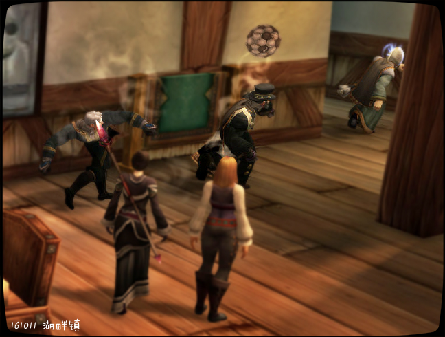
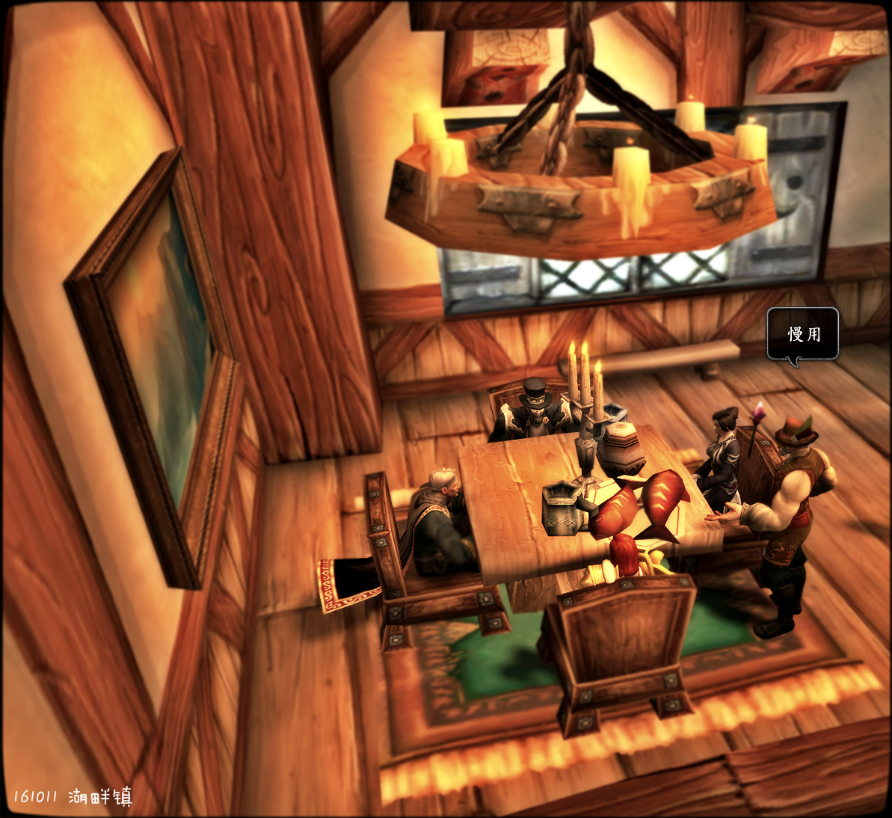
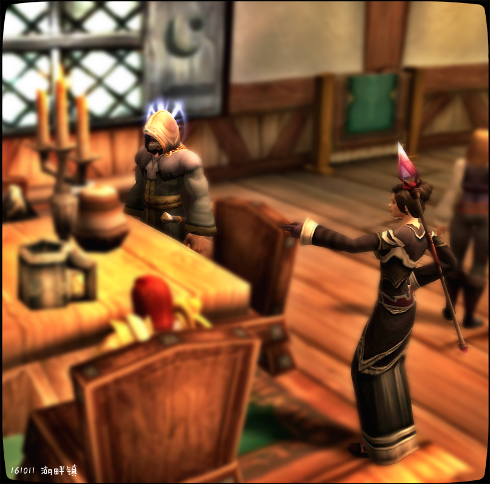
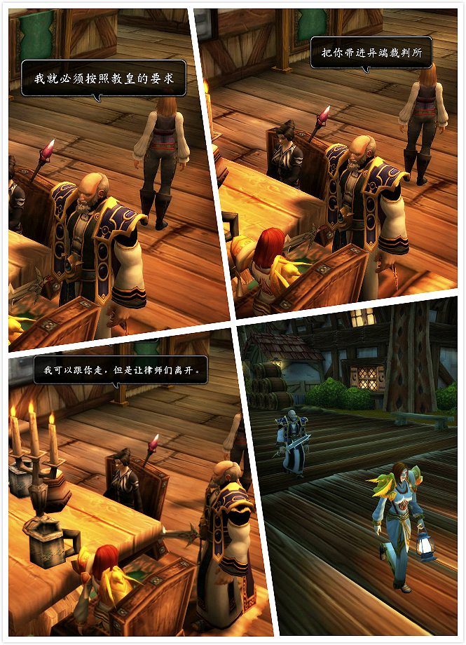
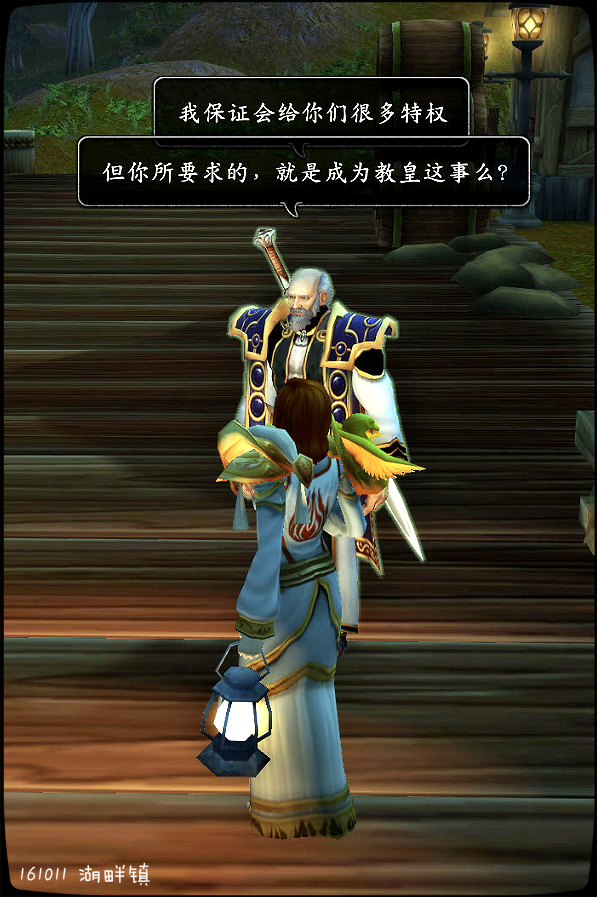

# 第三幕 三位律师

### 第三幕 三位律师

尼苛德摩不但要在宗教会议上谴责骑士团——甚至宣布骑士团是异端——还要召唤教会的审判。湖畔镇的三位律师贝克汉姆、伊丽莎白女王以及齐达内将会在法庭上与尼苛德摩对阵。如果他们失败，后果将不堪设想。然而三位律师对此并没有信心，他们已经是最专业的了，但说到辩论，没人能说倒老主教。火刑架在召唤……

然而石山修道院院长格里高利的出现，揭开了一场更大的阴谋——

格里高利在与尼苛德摩竞争宗主教之位时失败，怀恨在心。他透露，尼苛德摩实际上出身卑微，务农70年，于法理并不能坐于宗主教高位。格里高利更提出，如果骑士团安排刺杀格里高利，并支持他成为宗主教，他愿意为此作证——他要尼苛德摩死！然而公然指责一个主教的血统，背离骑士团法典……更别说这是赤裸裸的阴谋。三位律师究竟会如何选择？

三位律师的完整版记录见《三位律师与格里高利的阴谋》

\[贝克汉姆]: 那如果你觉得这个手段过于卑鄙

\[贝克汉姆]: 我们也可以保留住你的荣誉

\[贝克汉姆]: 让你为了荣誉光荣的牺牲

\[贝克汉姆]: 只要支付诉讼费即可

齐达内 飞速的在本子上写着什么

\[贝克汉姆]: 我们会给你任何你想要的结局

三位律师的扮演者：

尹弗勒尔斯：大卫·贝克汉姆

黑女巫莫瑞甘：伊丽莎白女王

艾登丶霍尔：齐达内

三位律师与格里高利的阴谋

为应对教廷的审判，三位律师和法瑞在湖畔镇密谋。

\[贝克汉姆]: 伊丽莎白，坐

\[伊丽莎白女王]: 您真是绅……

伊丽莎白女王 皱起了眉头

\[贝克汉姆]: 我猜齐达内马上就要抢位子

\[贝克汉姆]: 所以让给你

\[贝克汉姆]: 伊丽莎白，这里有位子

\[贝克汉姆]: 服务员

\[服务员]: 来了

\[贝克汉姆]: 来一份烤猪蹄

\[贝克汉姆]: 香肠，土豆泥配上腌菜

\[服务员]: 您一定是喝多了

\[齐达内]: 啧啧，这个服务员得有80了吧

\[贝克汉姆]: 你个服务员怎么花这么多

\[服务员]: 本地不出产猪肉

\[贝克汉姆]: 那就有什么来什么

\[伊丽莎白女王]: 我只需要一份小脆饼就够了

\[服务员]: 本地特产鲑鱼

\[贝克汉姆]: 我不吃鲑鱼

\[服务员]: 爱吃不吃

\[贝克汉姆]: 有红肉麻

\[齐达内]: 给我来个两米长的龙虾

\[贝克汉姆]: 欸和！你个服务员这么跳?!

\[法瑞雅]: 那我来一盘鲑鱼。

\[法瑞雅]: 大家好吃到新鲜的鱼。

法瑞雅 非常优雅

\[贝克汉姆]: 那就有什么来什么吧

\[服务员]: 赤脊山臭奶酪？

\[贝克汉姆]: 整两个

\[服务员]: 你呢

\[伊丽莎白女王]: 我以为这家主推的是“顾客是上帝”的跪式服务风格

老乞丐指着齐达内。

\[齐达内]: 咋这么墨迹呢?有啥来啥!

\[服务员]: 仰望星空派一个

\[服务员]: 你

老乞丐指着伊丽莎白女王。

\[伊丽莎白女王]: 可是为什么我觉得这个服务生像是个教皇一样

\[伊丽莎白女王]: 我要黑暗虚空小脆饼

\[法瑞雅]: 恐怕他们并不喜欢顾客就是圣光这种说法。

\[服务员]: 蒜蓉蛋糕一份

\[齐达内]: 给我对面的女士再来一份雪蛤吧

\[服务员]: 喝什么

\[齐达内]: 她得补补

\[贝克汉姆]: 整两壶白的

\[齐达内]: 我要啤的就行

\[贝克汉姆]: 洛克莫丹白啤

\[服务员]: 就白兰地

\[齐达内]: 那就白兰地

\[伊丽莎白女王]: 三壶白兰地，两壶归我就好

\[服务员]: 好没有？

\[贝克汉姆]: 那就这样吧

\[服务员]: 鲑鱼两条

\[服务员]: 慢用

\[法瑞雅]: 好新鲜！（似乎不那么严肃了）

\[服务员]: 您要的臭奶酪

法瑞雅 忘记焦虑，开始吃。

\[贝克汉姆]: 哎嘛真丑

\[服务员]: 蒜蓉蛋糕

齐达内 拖着腮帮子等着自己的派

\[法瑞雅]: 真丰盛！

\[服务员]: 仰望星空鱼头派

齐达内 看着面前仿佛星空一样大的派

伊丽莎白女王 小心的拿下蛋糕上的樱桃放进嘴里

\[齐达内]: 那要不咱俩换换?

\[服务员]: 菜上齐了

\[贝克汉姆]: 来呗

\[服务员]: 慢用

齐达内 抓起餐具白了大卫一眼

法瑞雅 放心地开始吃，但是她仍优雅。

齐达内 安静的开始吃了起来

这时从门外进来了一位老乞丐。

\[老乞丐]: 各位好心的人呐

\[老乞丐]: 捐助一份钱吧

\[贝克汉姆]: 要饭的，这儿没多的吃的了

\[贝克汉姆]: 边儿去

\[法瑞雅]: 这位先生？

齐达内 着鼻子闻到了一股霉味

\[老乞丐]: 我才不吃臭奶酪

法瑞雅 关心地看了来者一眼，但他身上的气味……

\[贝克汉姆]: 我们吃饭呢！你这么脏，我们还怎么吃啊

伊丽莎白女王 回头看了看身后的人，从口袋里掏出了一枚铜币

\[法瑞雅]: 先生你需要帮助吗？

\[老乞丐]: 你不正吃着不干净的东西吗

\[贝克汉姆]: 嘛呢？！嘛呢？！还呆着?

法瑞雅 也给了那人一块铜币

伊丽莎白女王 看着铜币想了一小会儿，又把铜币塞回去了

\[贝克汉姆]: 我这儿吃的是上好的奶酪

\[贝克汉姆]: 知道不?

\[贝克汉姆]: 吃过没?

老乞丐 捡起地上的铜币

\[老乞丐]: 不知道

\[老乞丐]: 吃过

\[老乞丐]: 过期的

\[贝克汉姆]: 拿了钱赶紧走吧！

\[法瑞雅]: 这次谈话很重要，先生你如果没有事……

\[法瑞雅]: 请不要打扰我们。

\[老乞丐]: 你们讲

\[老乞丐]: 我没事

\[伊丽莎白女王]: 说的没错，可以走远点么，你身上的虫子要爬到我这边来了

伊丽莎白女王 嫌弃的挪了挪椅子

法瑞雅 清了嗓子，但她警惕地看了四周

\[老乞丐]: 够远了

\[贝克汉姆]: 嘛呢?!

\[贝克汉姆]: 别靠近我！

\[法瑞雅]: 那么很好，三位律师。

\[老乞丐]: 她让我离她远点

\[法瑞雅]: 这顿饭骑士团会支付费用。

\[贝克汉姆]: 我们几个谈生意呢

贝克汉姆对老乞丐点了点头。

贝克汉姆对你点了点头。

\[老乞丐]: 你们继续

\[贝克汉姆]: 快走快走

\[老乞丐]: 他让我过来的

\[伊丽莎白女王]: 那么，你除了是个乞丐，还是聋子？

\[贝克汉姆]: 齐达内，给他一个铜板打发走得了

\[伊丽莎白女王]: 我叫你走远点！

伊丽莎白女王指着齐达内。

齐达内 捏着把脸埋在胳膊里疯狂挥手

\[老乞丐]: 捐款是一个神圣的事情

\[齐达内]: 味儿太大了!

\[老乞丐]: 圣书和圣光是这么说的

齐达内 挣扎着从内衬里摸出一个金币丢了过去

\[贝克汉姆]: 哟呵？！要饭的还会看书了？

老乞丐 捡起钱

\[伊丽莎白女王]: 你今天要是给了哪怕是一枚铜币，我也会把你前些天准备的卷宗全部放进厕所里冲走

\[齐达内]: 麻溜的赶紧成吗!

\[老乞丐]: 就差您了

\[贝克汉姆]: 嘿！个臭要饭的真不要脸

\[老乞丐]: 捐款是很神圣的

\[贝克汉姆]: 得得得

\[老乞丐]: 圣书和圣光也是这么说的

贝克汉姆 掏出两枚银币丢到地上

\[老乞丐]: “爱你的邻居。”

\[老乞丐]: 我就是你的邻居

\[法瑞雅]: 算了，我们开始吧。

齐达内 看着被自己无意丢出去的金币一阵肉疼

\[贝克汉姆]: 嘿！拿了钱就走吧

\[法瑞雅]: 这位教士，如果你将我们讲的话，还有这次会议告诉任何人。

\[老乞丐]: “圣书上说，如果有人打你的左脸，把右脸伸出来也给他。”

\[法瑞雅]: 骑士团不会姑息。

齐达内 捏着鼻子转过头看着法瑞雅

\[贝克汉姆]: 告儿你，你要还在这儿我让你尝尝两边脸被打的滋味

\[老乞丐]: “爱你的邻居，把他们当成你的父亲。”

\[齐达内]: 丫是个疯子，别理他 咱说咱的

\[法瑞雅]: 该死，闭嘴。

法瑞雅 开始不悦，她身上的盔甲发出光芒。

贝克汉姆扇了老乞丐一耳光，啊！

\[老乞丐]: “要把你的长辈向父亲那样对待。”

\[老乞丐]: 你打我的左脸，我必定把右脸伸出去

\[老乞丐]: 你如果打我的右脸

贝克汉姆扇了老乞丐一耳光，啊！

\[老乞丐]: 你居然打我的右脸

法瑞雅 在等教士伸出另外一半脸

\[贝克汉姆]: 我不光打你的脸！还踹你呢!

\[老乞丐]: “如果有人打你的左脸，把右脸也让给他。”

\[老乞丐]: “如果有人打你的右脸，就砍了他的手!

贝克汉姆 罩着要饭的鸡吧踹了一脚

\[老乞丐]: 哎呦

齐达内 捏着鼻子做了个赞的手势

\[老乞丐]: 你居然打我

\[贝克汉姆]: 就打你了!

\[法瑞雅]: 不要伤害他。

\[老乞丐]: 我要砍你的手

\[法瑞雅]: 好了，我们来说重要的事吧。

\[老乞丐]: 因为你打我的右脸

\[贝克汉姆]: 别闹了

\[老乞丐]: 不行

\[老乞丐]: 这一定要算清

\[贝克汉姆]: 算求!

\[法瑞雅]: 炙热之心骑士团是一个古老而荣耀的组织，瓦里安战死后，新任国王下令重铸骑士团。

\[老乞丐]: 圣书的话是真理

法瑞雅 严肃地说，她叹了一口气。

\[老乞丐]: 你必须遵守

\[法瑞雅]: 然而，我们不是唯一一个被召回的。

齐达内 对法瑞雅直呼曾经的至高王名字有些不满

\[老乞丐]: 如果你捐款

\[老乞丐]: 如果你捐款了

法瑞雅 认为骑士们对瓦里安直呼名字，是战友的表现

\[伊丽莎白女王]: 先生

\[老乞丐]: 那么圣光感激不尽

\[老乞丐]: 就赦免了你

\[老乞丐]: 嗯？

法瑞雅 不觉得瓦里安是一个贵族，他与我们并肩作战

\[伊丽莎白女王]: 在你要砍掉他的手之前

\[伊丽莎白女王]: 是否能和我来一下

\[老乞丐]: 不不不

\[老乞丐]: 就在这里说清楚

\[法瑞雅]: 如今圣光教会的宗主教老乞丐……

\[伊丽莎白女王]: 即便是一枚金币的捐款也不行？

\[老乞丐]: 尼苛德摩？我知道

\[法瑞雅]: 希望调查骑士团的合法性。

伊丽莎白女王对老乞丐露出了微笑。

\[老乞丐]: 他说的话一般都是对的

\[法瑞雅]: 然后派遣随军牧师。

\[法瑞雅]: 随军牧师这点我不反对。

\[伊丽莎白女王]: 如果不行，那就三枚

\[法瑞雅]: 然而……

\[老乞丐]: 他有一次单手把刺客给宰了

\[法瑞雅]: 高阶骑士评议会几天前决定，拒绝这次调查。

法瑞雅 似乎有什么难以言说的忧虑

\[老乞丐]: 他简直就是圣光再世呢

贝克汉姆对你点了点头。

\[老乞丐]: 我跟你们说啊

\[老乞丐]: 传闻啊

法瑞雅 看了墙上的话，他们的命运，就和画上的山崖一样

\[老乞丐]: 有一次记

\[老乞丐]: 有一头牛

\[伊丽莎白女王]: 先生？

\[老乞丐]: 那可老壮实了

伊丽莎白女王 不耐烦的看着老乞丐

法瑞雅 的话被老乞丐打断了

\[法瑞雅]: 这位修士，你有什么话要说吗？

\[老乞丐]: 当然

\[老乞丐]: 我养了一头牛

\[贝克汉姆]: 齐达内，伊丽莎白。

\[老乞丐]: 今年生了2头小牛犊

\[贝克汉姆]: 还记得我们和达拉然足协踢球时候的故事吗

\[齐达内]: 嗯?

齐达内对贝克汉姆点了点头。

贝克汉姆 一拍桌子

\[贝克汉姆]: 上!

老乞丐被踢飞。

齐达内向贝克汉姆鞠躬。

齐达内优雅的鞠了一躬。

\[老乞丐]: 我叫我们院长!

\[法瑞雅]: 噢，谢谢。

\[齐达内]: 真是抱歉，早该踹他

\[法瑞雅]: 这样就好了。

\[齐达内]: 我们说到哪了?

\[贝克汉姆]: 忘记了

\[贝克汉姆]: 请继续

\[法瑞雅]: 说到我其实不反对随军牧师。

\[法瑞雅]: 但是骑士评议会决定拒绝调查后……

\[法瑞雅]: 我听说，老乞丐将要在宗教会议上谴责我们。

\[法瑞雅]: 这很严重。

法瑞雅 但担忧并非空穴来风

\[法瑞雅]: 骑士团需要重整兵力，去破碎群岛战斗，而不是……死在这。

齐达内点了点头。

\[法瑞雅]: 我们都知道被谴责，然后被开除教籍这条可怕的路。

\[法瑞雅]: 绝对不能允许这样的事发生。

老乞丐原来是石山修道院的人。他们的院长格里高利找上门。

\[格里高利]: 哪个王八蛋打我修道院的人？

法瑞雅 没有提到骑士团究竟有什么好隐藏的，这很奇怪不是吗？

贝克汉姆指着你。

\[格里高利]: 说不说？

\[贝克汉姆]: 她打的

齐达内指着你。

\[格里高利]: 说还是不说!

\[法瑞雅]: 好吧，是我打的。

\[齐达内]: 是她

\[贝克汉姆]: 就是她

\[法瑞雅]: 这位修士，不要在意。

法瑞雅 掩护三位律师。

\[格里高利]: 你知道我是谁吗？

法瑞雅 扶额

\[格里高利]: 敢打我修道院的人

\[法瑞雅]: 不知道……

\[法瑞雅]: 但我很抱歉。

格里高利 取下兜帽

你安慰格里高利。

\[法瑞雅]: 请你不要在意。

\[格里高利]: 你们这群王八蛋

\[法瑞雅]: 我认为刚才的行为虽然不理智，但是……

\[法瑞雅]: 是我们的会议首先被打扰了。

\[法瑞雅]: 我们已经很礼貌地劝说了他。

格里高利 掐住这个女人脖子

\[格里高利]: 看着我!

法瑞雅 用强壮的手将格里高利扳倒在桌面上。

伊丽莎白女王 把桌上的辣椒粉甩到了贝克汉姆的大腿附近

法瑞雅 毕竟是久经沙场的防御骑士

齐达内 望了一眼秃头被闪到了，赶紧把头低下

\[法瑞雅]: 没有人能质疑骑士团的盾牌……

\[法瑞雅]: 没有人！

格里高利 由于准备不充分被摔倒

\[格里高利]: 那么

\[格里高利]: 我告诉你

法瑞雅 优雅地回到座位上。

\[格里高利]: 你的盾要被石山修道院的剑砍断

格里高利 提起大剑劈碎银盘

\[格里高利]: 大胆

齐达内 被这两个人的动作吓得不敢动弹

法瑞雅 并不惧怕

\[格里高利]: 报上你的名号

法瑞雅 身经百战了

齐达内 感到靴子上好像沾到刚才碎掉的盘子里的汤汁了

\[法瑞雅]: 我是炙热之心骑士团的第五任大团长，法瑞·图尔加斯。

\[格里高利]: 重复一次你的名字

\[法瑞雅]: 圣洁骑士，骑士团之盾，亡灵口中的“盾刺拍脸者”

\[格里高利]: 原来你就是教皇陛下口中的异端邪说

\[法瑞雅]: 法瑞·图尔加斯，修士先生，不要激动。

\[格里高利]: 我还以为是个男人

\[格里高利]: 没想到居然是个女人

\[法瑞雅]: 怎么，你认为女人无法手握长剑吗?

\[格里高利]: 我到很想知道

\[格里高利]: 一个女人如何成为异端邪说的、

\[法瑞雅]: 或者你认为女人，无法掌握圣光吗？

\[格里高利]: 既然你是异端邪说

法瑞雅 对修士的言论感到鄙夷，女骑士们早已战斗在最前线

\[格里高利]: 我就必须按照教皇的要求

\[格里高利]: 把你带进异端裁判所

\[格里高利]: 你们三人

\[格里高利]: 斩首

\[法瑞雅]: 不。

\[贝克汉姆]: 慢着

\[法瑞雅]: 他们现在由我保护。

\[格里高利]: 走

\[伊丽莎白女王]: 我要求见我的律师

\[伊丽莎白女王]: 等下我自己就是

\[法瑞雅]: 我可以跟你走，但是让律师们离开。

\[贝克汉姆]: 我们去外面吧。。

\[格里高利]: 你人头落地时

\[格里高利]: 我会告诉你们

齐达内 站起来就溜

\[格里高利]: 走

\[齐达内]: 你去那边躲!(小声

齐达内 一个劲把大卫往外推

\[贝克汉姆]: 她走了，看不到我们了（小声）

法瑞雅 留在原地，帮助三位律师离开

\[贝克汉姆]: 伊丽莎白呢？（小声

\[法瑞雅]: 一个骑士从来不逃跑。

\[齐达内]: 不知道啊!(小声

\[法瑞雅]: 但是你不能无缘无故逮捕他们，也不能逮捕我。

\[格里高利]: 你是异端邪说

\[格里高利]: 我有何不可把你带走

\[法瑞雅]: 不，我们忠于圣光，我不知道你口中的异端邪说什么回事。

\[格里高利]: 走

\[格里高利]: 走

法瑞雅 不愿意惹到教会

\[格里高利]: 站住

\[格里高利]: 到这边来

\[格里高利]: 快点

法瑞雅 所以还是跟上了，骑士团如今太过脆弱。

\[格里高利]: 实话告诉你

\[格里高利]: 我和尼苛德摩不是朋友

法瑞雅 惊讶地看了眼前的修士

法瑞雅 不敢相信

\[格里高利]: 忘记自我介绍了

\[法瑞雅]: 为何？

\[法瑞雅]: 你是？

\[格里高利]: 我是石山修道院院长

\[格里高利]: 格里高利七世

\[法瑞雅]: 如果你是他的敌人……

\[格里高利]: 赤脊山主教

\[法瑞雅]: 那么你为什么找上我？

\[格里高利]: 因为你也是他的敌人

\[法瑞雅]: 我明白。

\[格里高利]: 他抢走了我教皇的位置

法瑞雅 惊讶，但也不惊讶，这在教会经常发生

\[格里高利]: 如果要打败他

\[格里高利]: 毫无胜算

\[法瑞雅]: 那么好吧，我理解。你知道他的弱点吗？

\[格里高利]: 因为他掌握着全世界的兵力

\[格里高利]: 当然

\[格里高利]: 自古教皇没有身份低贱之人

\[法瑞雅]: 不，他没有掌握全世界的兵力，但他掌握了圣光的解释权。

\[格里高利]: 而他恰恰身份低贱

\[格里高利]: 他当了70年农夫

法瑞雅 叹了一口气，她亦非贵族，但她成为大团长不是因为血统

\[格里高利]: 一个没有受过教育的人被当选教皇

\[格里高利]: 只需要用身份

\[法瑞雅]: 有贵族支持他吗？还是他仅仅因为自己的虔诚？

\[格里高利]: 就可以在教堂上让他失去颜面

\[法瑞雅]: 啊！

\[格里高利]: 他在朝里没有朋友

\[法瑞雅]: 这是卑劣的手段（脱口而出——

\[格里高利]: 所以才敢这么放肆

\[格里高利]: 卑鄙？

\[格里高利]: 小姑娘

\[格里高利]: 这个世界需要卑鄙

\[法瑞雅]: 骑士团曾经挣扎在血统论之中，直到我们废除了它。

\[格里高利]: 否者在权力的游戏中

\[格里高利]: 你将被淘汰

\[法瑞雅]: 如今……我们居然要如此对付一位圣光的牧者。

\[格里高利]: 记住，戳对方的软肋

法瑞雅 对命运感到悲哀

\[格里高利]: 异端邪说罪是火刑

\[法瑞雅]: 我不知道我是否能做到……

伊丽莎白女王 在树丛里狠狠的锤了贝克汉姆的屁股

\[格里高利]: 如果你做不到，判决必定失败

\[法瑞雅]: 是的（法瑞低头）

格里高利的要求。

\[格里高利]: 如果你肯和你的律师朋友们

\[法瑞雅]: 梅林·白银盾告诉我，他是一个老骑士了，他告诉我……

\[格里高利]: 用身份羞辱他

\[格里高利]: 他才不是骑士

\[格里高利]: 他就是一个农夫

\[法瑞雅]: 在我上烤架的时候，说：我为洛丹伦而死，以誓之名灰烬重生。

\[法瑞雅]: 我愿意为骑士团而死，但我必须活着，才能保护她。

\[格里高利]: 别说没用的

\[格里高利]: 羞辱他的缓兵之计

\[格里高利]: 如果想以绝后患的话

法瑞雅 对这种手段感到十分厌恶

\[格里高利]: 就刺杀他

\[法瑞雅]: 我会考虑的。

\[格里高利]: 支持我格里高利成为教皇

\[法瑞雅]: 感谢你，好心的修士。

\[格里高利]: 如果你支持我格里高利为教皇

\[格里高利]: 我保证会给你们很多特权

\[法瑞雅]: 但你所要求的，就是成为教皇这事么？

\[格里高利]: 只要你刺杀他

\[格里高利]: 当然

\[格里高利]: 只要我成为教皇

法瑞雅 摆出外交表情，她微笑

\[格里高利]: 你必须保证他死

格里高利指着你。

法瑞雅 走到一边，她的肩甲蹭到了修士

法瑞雅 一言不发地看着止水湖

\[格里高利]: 哈哈，尼苛德摩

\[格里高利]: 你的日子不长了

\[格里高利]: 我格里高利马上就是宗主教了

\[格里高利]: 哈哈

法瑞雅 没有回答修士的要求，她只是恍惚地走回了旅馆

\[贝克汉姆]: 齐达内，坐下来、

\[服务员]: 结账的人呢

\[贝克汉姆]: 走了

\[齐达内]: 诶诶诶，还好意思要钱?

\[服务员]: 走了？

\[服务员]: 我告诉你

\[齐达内]: 你的奶酪里有苍蝇你知道么?

巫师凯瑞克 打了个哈欠

\[服务员]: 去你妈的

\[服务员]: 你吃的是派

\[齐达内]: 咳咳

\[伊丽莎白女王]: 你的樱桃是模型你知道么

\[服务员]: 想不给钱吗

齐达内指着贝克汉姆。

\[伊丽莎白女王]: 刚刚我的牙都快碎了

\[齐达内]: 他的奶酪有苍蝇

贝克汉姆指着你。

\[服务员]: 他的奶酪有苍蝇关你屁事

\[贝克汉姆]: 这就是给钱的

\[齐达内]: 他是我儿子

\[齐达内]: 我能不管吗!

\[贝克汉姆]: 你妈逼

\[法瑞雅]: 刚才各位有惊无险。

\[服务员]: 打坏东西造价赔偿

\[服务员]: 我说清楚

\[伊丽莎白女王]: 不要在儿子面前说他妈妈的坏话啊！

\[贝克汉姆]: 齐达内，别去舔别人脖子

\[伊丽莎白女王]: 那是你妻子啊

\[齐达内]: 没惊没惊，我们这么勇敢

\[法瑞雅]: 修士格力高利并不是要逮捕我们。

\[法瑞雅]: 律师们……

贝克汉姆 一脚踢飞了齐达内

\[齐达内]: 啊，那是最吼的

\[齐达内]: 抱歉，我的舌头吃了他的派有点麻

\[贝克汉姆]: 那自然太吼了

伊丽莎白女王 把一只受伤的脚抬起来放在桌子上

\[伊丽莎白女王]: 一点都不吼！

\[法瑞雅]: 格里高利修士跟我们谈了一个，并不简单的条件……

\[贝克汉姆]: 怎么说

\[法瑞雅]: 他和尼苛德摩宗主教之间的矛盾，已经到了不可挽回的地步。

\[齐达内]: 主教?

\[法瑞雅]: 格里高利主教不满于宗主教的位置被尼苛德摩抢去。

\[法瑞雅]: 他的条件是，如果我们支持他当宗主教，杀死尼苛德摩……

\[法瑞雅]: 杀死尼苛德摩，那么他会站在我们这边。

齐达内 从内衬摸出笔记本和羽毛笔

\[法瑞雅]: 为了表示他的诚意。

\[法瑞雅]: 他已经告诉了我们尼苛德摩最大的弱点。

\[法瑞雅]: 那就是……

法瑞雅 不安地看了火光

\[法瑞雅]: 尼苛德摩出身一介农夫。

\[法瑞雅]: 务农70余年。

齐达内 沾了点伊丽莎白递过来的墨水记在了本子上

\[齐达内]: 哈哈

\[贝克汉姆]: 原来是个土鳖啊

\[法瑞雅]: 没有高贵的血统，格里高利认为，于理不能身居教会高位。

\[齐达内]: 我的女士，这可是我们目前最有可能保住你们的手段了

法瑞雅 非常厌恶血统论，她身为一个女骑士，已经被无数人口头侮辱过。

\[法瑞雅]: 但是这，是非常卑鄙的手段。

\[齐达内]: 我们会在庭审一开始的时候就质疑他的身份，教会一向不会把这种事情放在什么骑士团后面处理

\[齐达内]: 无意冒犯

\[法瑞雅]: 教会落到这样的人手里，恐怕是危险。

\[贝克汉姆]: 那如果你觉得这个手段过于卑鄙

\[贝克汉姆]: 我们也可以保留住你的荣誉

\[贝克汉姆]: 让你为了荣誉光荣的牺牲

\[贝克汉姆]: 只要支付诉讼费即可

齐达内 飞速的在本子上写着什么

\[法瑞雅]: 他会使用这样的手段为求获得宗主教的地位，那么以后，谁知道他会做出什么呢？

\[贝克汉姆]: 我们会给你任何你想要的结局

\[法瑞雅]: 不！！

法瑞雅 并不惧怕死亡，她惧怕的是骑士团里的其他骑士会因此而死

齐达内 的笔尖突然顿了顿，递给大卫一个眼神

贝克汉姆眨了眨眼。

齐达内 用笔指了指身后的老头服务员

法瑞雅 用戴帖手套的左手砸了桌面

齐达内 吓了一跳，羽毛笔掉在了地上

法瑞雅 既愤怒又无助

\[贝克汉姆]: 为什么不呢

\[齐达内]: 我说法瑞雅女士啊，你们骑士总是有那么多乱七八糟的事儿

伊丽莎白女王 身前的墨水瓶倒了下来

\[齐达内]: 我们作为律师，就是要赢

\[法瑞雅]: 暴风王国不能失去它的教会，也不能失去骑士团。联盟七国崩溃后，已经很脆弱了。

\[贝克汉姆]: 有个好消息

\[贝克汉姆]: 目前有一个军事政治同盟叫做达伦德同盟

\[贝克汉姆]: 已经建立许久

\[贝克汉姆]: 所以不必担心政局，女士

齐达内 俯身捡起笔顺手扶正了墨水瓶

\[贝克汉姆]: 那么我们说正题吧

\[贝克汉姆]: 你想怎么赢

\[法瑞雅]: 那么……

\[齐达内]: 作为你的律师，我建议你接受这个提议

\[法瑞雅]: 我接受（叹气）

\[贝克汉姆]: 看来我们还是有许多共同点的女士

\[齐达内]: 不管什么荣誉不荣誉的，你输了连脑袋都掉了荣誉也只有一代人记得

贝克汉姆点了点头。

\[齐达内]: 活着没准骑士团还能延续

\[贝克汉姆]: 这种虚名放到最后把

\[法瑞雅]: 但是，我们必须支持另外一位品行正直的修士，如果出现宗主教的争夺。

齐达内 舔了舔嘴唇

\[贝克汉姆]: 那就是你们的事情了、、

\[贝克汉姆]: 这就不必告诉我们了

\[贝克汉姆]: 我们的责任是拿钱，让你活下来

\[贝克汉姆]: 之后的事情我们不过问

\[法瑞雅]: 那么就这么决定了。

法瑞雅 其实很感激三位律师。

\[贝克汉姆]: 那么没人每小时十二枚金币

贝克汉姆 掏出怀表看了一眼

\[法瑞雅]: 活下去。

\[贝克汉姆]: 今天已经过去两个小时了

\[贝克汉姆]: 打完折一共一百四十枚金币

贝克汉姆点了点头。

\[贝克汉姆]: 谢谢

\[服务员]: 我的盘子!

伊丽莎白女王 不动神色的收起了金币

法瑞雅 开始付钱

\[服务员]: 造价赔偿

法瑞雅 似乎认为这些钱不多

\[服务员]: 蒜蓉蛋糕1金币一个

\[贝克汉姆]: 一个金币?!

\[贝克汉姆]: 你们这是黑店!

\[服务员]: 仰望星空鱼派90银币

\[服务员]: 臭奶酪不要钱

\[服务员]: 鲑鱼50铜币

\[服务员]: 银盘，2金币

\[服务员]: 椅子4个金币

\[服务员]: 白兰地45金币

\[贝克汉姆]: 四十五个金币的白兰地？！

\[贝克汉姆]: 这跟馊水的味道一样

\[服务员]: 对

\[服务员]: 不爽不要喝

法瑞雅 已经安静地支付了所有费用

\[贝克汉姆]: 反正她给钱

贝克汉姆指着你。

\[服务员]: 刚才你们得罪的人啊

法瑞雅 包括破碟子费

\[格里高利]: 你们惹不起的

\[格里高利]: 最好还是早点离开

\[贝克汉姆]: 好

\[服务员]: 那个格里高利院长啊

\[贝克汉姆]: 走吧

\[服务员]: 是所罗门的亲戚

\[服务员]: 准确说是所罗门镇长的舅舅

\[贝克汉姆]: 那么我们赶紧走！

\[贝克汉姆]: 快走啊

\[齐达内]: 咳咳

\[贝克汉姆]: 地头蛇很可怕

\[服务员]: 所罗门家是这里最大的地主

\[齐达内]: 交给我们吧女士

\[法瑞雅]: 好了，再会。

齐达内优雅的鞠了一躬。

\[服务员]: 格里高利也是这样的大地主

法瑞雅 再次感谢三位律师
