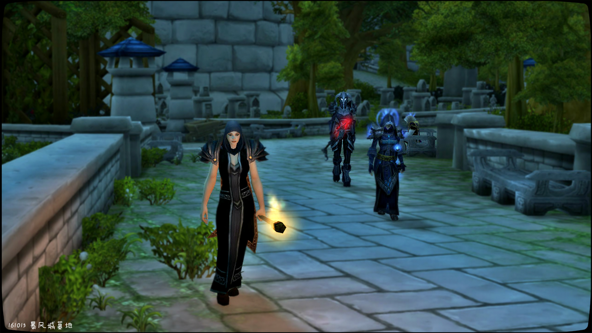

# 第四幕 灯塔海岸

## 第四幕 灯塔海岸

在索菲亚修女的告密下，宗主教贤者尼苛德摩、依搦斯院长和失语者·沨谷在暴风城灯塔海岸挖掘出炙热之心骑士团藏匿的证物：血色十字军盾牌、一颗被水泡烂的头颅。在依搦斯院长的调查下，尼苛德摩发现炙热之心骑士团是血色十字军的残部，而且还拥有一把名叫“命运”的圣剑。为了不让圣剑落入堕落者之手，尼苛德摩决定在宗教会议上谴责并将骑士团彻底定位为异端邪说。

灯塔海岸完整记录见《灯塔海岸的血色十字军遗物》

\[贤者尼苛德摩\]: 依搦斯院长，索菲亚修女

\[贤者尼苛德摩\]: 务必找到这把圣剑

\[贤者尼苛德摩\]: 我将在本周五召开宗教会议

\[依搦斯院长\]: 是的

\[贤者尼苛德摩\]: 谴责并将其彻底定位异端邪说

\[依搦斯院长\]: 必须审判他们

\[贤者尼苛德摩\]: 绝不能让圣剑落入堕落者之手

## 灯塔海岸的血色十字军遗物

扮演者名单

失语者丶沨谷：失语者

贤者尼苛德摩：贤者尼苛德摩

颂亡者雅兰：依搦斯院长

法瑞雅：索菲亚修女

圣光教会的宗教审判者们发现了炙热之心骑士团抛弃的血色遗物。

记录开始于 10/15/2016 的 13:44:25。

\[索菲亚修女\]: 尊敬的宗主教。

\[贤者尼苛德摩\]: 索菲亚修女

你向贤者尼苛德摩鞠躬。

\[贤者尼苛德摩\]: 愿上主赐予信理部智慧

\[索菲亚修女\]: 听闻宗主教正在调查骑士团。

\[贤者尼苛德摩\]: 是的

\[贤者尼苛德摩\]: 有何发现？\[贤者尼苛德摩\]: 请尽管开口

\[贤者尼苛德摩\]: 这里是教会管辖区域

\[索菲亚修女\]: 有一天夜晚，我看到了两个形色可疑的骑士。

\[贤者尼苛德摩\]: 骑士？

\[索菲亚修女\]: 他们拿着几个大麻袋。

\[贤者尼苛德摩\]: 哦？

\[索菲亚修女\]: 你知道，这很不寻常。

\[贤者尼苛德摩\]: 我也觉得不寻常

\[索菲亚修女\]: 所以，圣光保护我，我就跟上他们了。

\[贤者尼苛德摩\]: 依搦斯修女，你如何看待这个问题？

\[依搦斯院长\]: 嗯，我觉得

\[依搦斯院长\]: 麻袋里面一定有文章

\[贤者尼苛德摩\]: 和我想到一块了

\[贤者尼苛德摩\]: 索菲亚修女

\[贤者尼苛德摩\]: 请继续

\[索菲亚修女\]: 作为圣骑士，打着信仰圣光的标志，要是做一些……的事，会让整个教会蒙羞。

\[索菲亚修女\]: 我认为。

\[索菲亚修女\]: 我看见他们坐船去了灯塔。

\[索菲亚修女\]: 我无法跟上，因为这一定会被他们发现。

贤者尼苛德摩 摸了摸胡子

\[贤者尼苛德摩\]: 必须得前往调查

\[索菲亚修女\]: 我只好待在港口外查看，他们没有发现我。

\[贤者尼苛德摩\]: 不过

\[索菲亚修女\]: 待到他们回来后，就没有麻袋了。

\[索菲亚修女\]: 这听起来，渗人，不是吗。

\[贤者尼苛德摩\]: 是啊

\[索菲亚修女\]: 谁知道那些袋子里装了什么，连尸体都有可能。

\[贤者尼苛德摩\]: 依搦斯院长，你觉得该如何

\[依搦斯院长\]: 或者是分解的尸体

\[依搦斯院长\]: 必须截下这些袋子

\[依搦斯院长\]: 还有运袋子的人

\[贤者尼苛德摩\]: 事不迟疑，我们应该立刻前往

\[索菲亚修女\]: 他们身上没有穿戴骑士团的纹章。

\[贤者尼苛德摩\]: 请带路吧

\[索菲亚修女\]: 但是我认得那个红发骑士……

\[贤者尼苛德摩\]: 哪个红发骑士？

\[贤者尼苛德摩\]: 等等

\[贤者尼苛德摩\]: 我想起一个红发骑士

\[贤者尼苛德摩\]: 是个阿拉索人

\[贤者尼苛德摩\]: 是个大老粗

\[贤者尼苛德摩\]: 没文化

\[索菲亚修女\]: 唉，不是那个。

\[贤者尼苛德摩\]: 成天就知道喝伏特加

\[索菲亚修女\]: 这是个女的，红发骑士。

\[贤者尼苛德摩\]: 谁？

\[贤者尼苛德摩\]: 不记得

\[索菲亚修女\]: 炙热之心骑士团的那个招募官。

\[贤者尼苛德摩\]: 现在这里还是教堂管辖区域

\[贤者尼苛德摩\]: 但说无妨

贤者尼苛德摩指向远方。你指向远方。

\[贤者尼苛德摩\]: 下去后就离开教区

\[贤者尼苛德摩\]: 是这里吗？

\[索菲亚修女\]: 就是这！

\[贤者尼苛德摩\]: 这漆黑的土地让我感到恶心

索菲亚修女 显得很激动

\[贤者尼苛德摩\]: 你

贤者尼苛德摩指着失语者丶沨谷。

失语者丶沨谷向贤者尼苛德摩鞠躬。

\[贤者尼苛德摩\]: 去检查以下海下面有没有东西

失语者丶沨谷对贤者尼苛德摩点了点头。

\[贤者尼苛德摩\]: 依搦斯院长

\[贤者尼苛德摩\]: 你检查一下

\[贤者尼苛德摩\]: 那边的河湾

\[依搦斯院长\]: 好的

\[贤者尼苛德摩\]: 这里简直就是被诅咒了的土地

\[贤者尼苛德摩\]: 发现了什么？

失语者丶沨谷 抖了抖脸上的水

失语者丶沨谷优雅的鞠了一躬。

失语者丶沨谷 提起一颗被水泡烂的人头

\[失语者丶沨谷\]: 不知道泡了多少天了

\[贤者尼苛德摩\]: 放在这里

索菲亚修女 吓到差点晕过去

\[依搦斯院长\]: 什么也没有

\[贤者尼苛德摩\]: 等等

\[贤者尼苛德摩\]: 你踩着什么？

索菲亚修女 果然被吓到晕倒了

\[贤者尼苛德摩\]: 依搦斯院长

\[贤者尼苛德摩\]: 快让开

\[贤者尼苛德摩\]: 你的脚下

\[依搦斯院长\]: 我踩着？

\[贤者尼苛德摩\]: 有什么东西

\[依搦斯院长\]: 什么东西

\[贤者尼苛德摩\]: 你

\[贤者尼苛德摩\]: 挖出来

\[贤者尼苛德摩\]: 天哪

\[贤者尼苛德摩\]: 真是个大家伙

\[贤者尼苛德摩\]: 快起来

贤者尼苛德摩在你面前跪下。

\[贤者尼苛德摩\]: 你来打开

\[贤者尼苛德摩\]: 这是什么

索菲亚修女 从箱里拿出一块带着红色徽记的盾牌

\[贤者尼苛德摩\]: 依搦斯院长

\[贤者尼苛德摩\]: 这是什么

\[依搦斯院长\]: 盾牌

\[索菲亚修女\]: 我不认识这个标记。

\[依搦斯院长\]: 没错，是盾牌

\[贤者尼苛德摩\]: 我是问你上面的章纹

\[依搦斯院长\]: 洛丹伦

\[贤者尼苛德摩\]: 洛丹伦哪个领主的

\[依搦斯院长\]: 这个，我得回档案馆查一下

\[依搦斯院长\]: 这个纹章有点奇怪

索菲亚修女 看到盾上还有血迹，又有点眩晕。

索菲亚修女 马上将盾递给院长，只想远离它。

\[贤者尼苛德摩\]: 等等

\[贤者尼苛德摩\]: 我想想

\[贤者尼苛德摩\]: 这是….

\[贤者尼苛德摩\]: 达索汉的章纹!

索菲亚修女 不敢去看刚才挖出来的头颅，太可怕了这片黑色的海滩。

索菲亚修女 以后一定不会再来这。

\[贤者尼苛德摩\]: 果然

\[贤者尼苛德摩\]: 果然他们是异端邪说

\[贤者尼苛德摩\]: 不，不仅仅是异端邪说

\[索菲亚修女\]: 还是杀人凶手！

\[贤者尼苛德摩\]: 是的

\[贤者尼苛德摩\]: 把证物拿上

\[贤者尼苛德摩\]: 到教堂来见我

\[贤者尼苛德摩\]: 发现什么了吗

\[依搦斯院长\]: 洛丹伦的某位领主

索菲亚修女 耐心听，害怕周围的墓地

\[贤者尼苛德摩\]: 我知道

\[依搦斯院长\]: 似乎是某个骑士团的成员

\[贤者尼苛德摩\]: 那是达索汉的章纹

\[依搦斯院长\]: 没错

\[贤者尼苛德摩\]: 我们在大教堂之外，不用忌讳

\[依搦斯院长\]: 是的，那么他们应该和血色十字军有关

\[贤者尼苛德摩\]: 发现什么记录文献了吗

\[索菲亚修女\]: 血色十字军！

依搦斯院长 把一本厚厚的文献递给贤者尼苛德摩

索菲亚修女 倒吸一口冷气

贤者尼苛德摩 拿起卷轴

贤者尼苛德摩 读了出来

\[依搦斯院长\]: 炙热之心骑士团，不过上一次人们见到他们

\[依搦斯院长\]: 好几年前了吧

\[依搦斯院长\]: 那时候伊利丹还是活奔乱跳的

\[贤者尼苛德摩\]: 帕拉斯，血色十字军高级指挥官

\[贤者尼苛德摩\]: 传闻他有一把锋利无比的圣剑，名为命运之剑

\[贤者尼苛德摩\]: 此剑由圣光铸成

\[贤者尼苛德摩\]: 无坚不摧

\[贤者尼苛德摩\]: 持有者为血色十字军的帕拉斯

\[贤者尼苛德摩\]: 我认为

\[贤者尼苛德摩\]: 他们一定和这个人有关系

\[依搦斯院长\]: 那人死了吗

\[贤者尼苛德摩\]: 不清楚

\[贤者尼苛德摩\]: 我再看看

\[依搦斯院长\]: 会不会被玷污复活成不死生物？

\[依搦斯院长\]: 邪教徒最爱做这类事情了

\[贤者尼苛德摩\]: 帕拉斯部下成员

\[贤者尼苛德摩\]: ”黄金狮子“奥菲

\[贤者尼苛德摩\]: 尤瑞沃

\[贤者尼苛德摩\]: 斯达盼

\[贤者尼苛德摩\]: 法瑞….

\[贤者尼苛德摩\]: 法瑞!

\[贤者尼苛德摩\]: 那个骑士团的女人叫什么？

\[索菲亚修女\]: 就是她！就是她我想起来了。

\[索菲亚修女\]: 法瑞，那个红发骑士，一直在招募新兵。

\[索菲亚修女\]: 在城里招募新兵。

\[贤者尼苛德摩\]: 血色十字军的残部

\[贤者尼苛德摩\]: 我认为他们手里一定带着那把圣剑

\[贤者尼苛德摩\]: 肯定被藏在某个地方

\[贤者尼苛德摩\]: 依搦斯院长，索菲亚修女

\[贤者尼苛德摩\]: 务必找到这把圣剑

\[贤者尼苛德摩\]: 我将在本周五召开宗教会议

\[依搦斯院长\]: 是的

\[贤者尼苛德摩\]: 谴责并将其彻底定位异端邪说

\[依搦斯院长\]: 必须审判他们

\[贤者尼苛德摩\]: 绝不能让圣剑落入堕落者之手

\[依搦斯院长\]: 烧死他们

\[依搦斯院长\]: 净化他们

索菲亚修女 举起手中的火把

\[贤者尼苛德摩\]: 当然

\[贤者尼苛德摩\]: 那么

\[索菲亚修女\]: 烧死他们！

\[贤者尼苛德摩\]: 安静

\[索菲亚修女\]: 烧死异端！

\[贤者尼苛德摩\]: 这里是公墓

\[贤者尼苛德摩\]: 你想让所有人都知道吗？

\[贤者尼苛德摩\]: 现在

\[贤者尼苛德摩\]: 你们两位

\[贤者尼苛德摩\]: 开始调查圣剑之事

你向贤者尼苛德摩鞠躬。

\[贤者尼苛德摩\]: 一有发现立刻向我禀报

\[依搦斯院长\]: 明白

\[贤者尼苛德摩\]: 我会在这里待上一整晚的冥想

\[索菲亚修女\]: 我知道了，宗主教。愿圣光赐福于你。

\[贤者尼苛德摩\]: 你们离开吧

