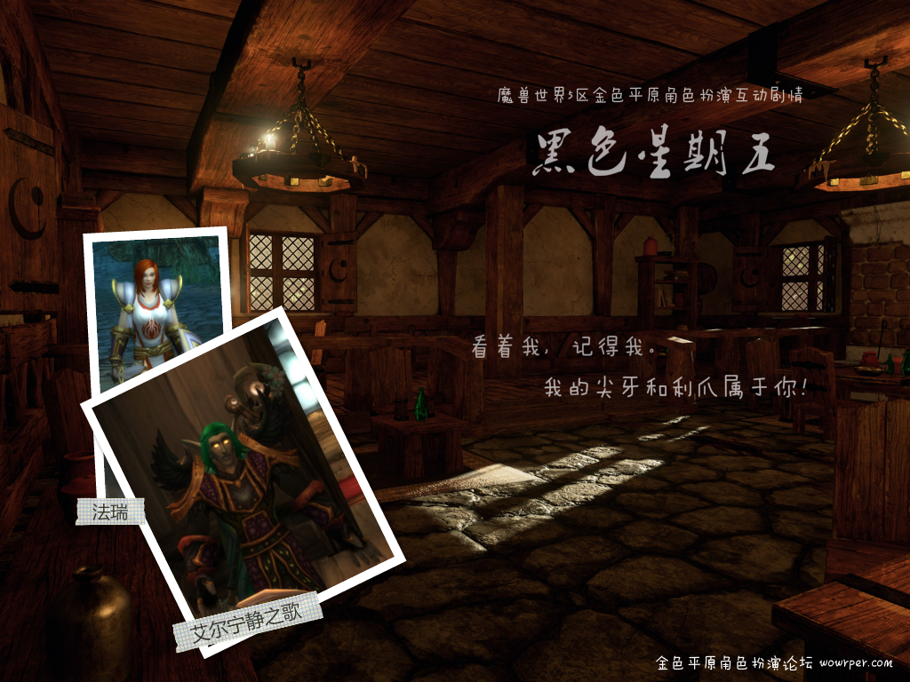
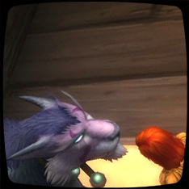
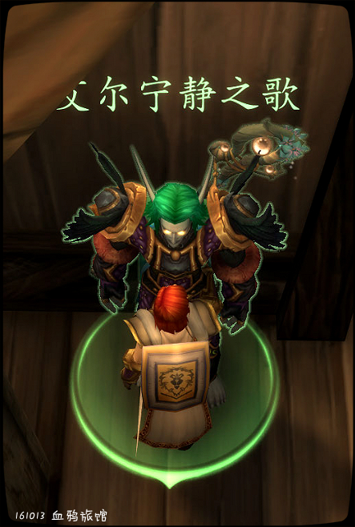
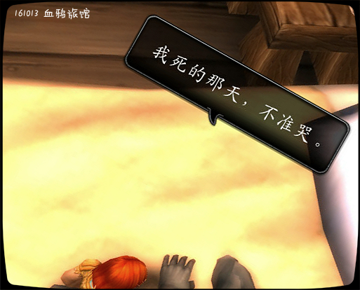

# 第五幕 血鸦旅店

## 第五幕 血鸦旅店

被传讯到宗教审判庭后，法瑞觉得自己已经没有明天了。她来到血鸦旅店，和德鲁伊艾尔宁静之歌确定了他们的爱情。

血鸦旅店完整扮演记录见《血鸦旅店之夜》

\[艾尔宁静之歌\]: 只有……只有我能伤害你……

\[法瑞雅\]: 只有你！

\[艾尔宁静之歌\]: 只有我！

\[法瑞雅\]: 我是你的……

## 血鸦旅店之夜

这是大型互动剧情《黑色星期五》的一部分。法瑞觉得自己没有明天了，和艾尔宁静之歌来到血鸦旅店。

记录开始于 10/12/2016 的 23:37:52。

法瑞雅 拉住艾尔宁静之歌的手

\[艾尔宁静之歌\]: 法瑞雅，是你吗，好久不见？

\[法瑞雅\]: 来……

\[艾尔宁静之歌\]: 怎么了，你看起来不太好~

法瑞雅 一言不发

\[艾尔宁静之歌\]: 你怎么了？

法瑞雅 关上门，锁好

\[艾尔宁静之歌\]: 我能帮你吗？

\[法瑞雅\]: 我……

艾尔宁静之歌 温柔地盯着法瑞雅看。

法瑞雅 把艾尔宁静之歌推到墙上，吻住了他

\[艾尔宁静之歌\]: 法瑞雅……

艾尔宁静之歌 默默闭上眼睛，享受法瑞雅的吻。

艾尔宁静之歌 抱住了法瑞雅。

\[艾尔宁静之歌\]: 法瑞雅，我……

法瑞雅 这个吻很深，他们的舌纠缠在一起。

艾尔宁静之歌 脸红了。

艾尔宁静之歌 双手从后面抱住法瑞雅。

法瑞雅 用防御骑士的力量将艾尔宁静之歌死死按在墙上

法瑞雅 不顾盔甲会扎到艾尔宁静之歌

艾尔宁静之歌 任由法瑞雅摆布。

艾尔宁静之歌 明显是感到有些痛了，脸上显露出痛苦的表情。

艾尔宁静之歌 的脸越发通红了！

法瑞雅 吻着艾尔宁静之歌的唇，然后是他的脖子，好像没有明天一样。

法瑞雅 的确没有明天了……

艾尔宁静之歌 亲吻了法瑞雅的额头。

艾尔宁静之歌 任由法瑞雅摆布。

\[艾尔宁静之歌\]: 法瑞雅，怎么了……

\[法瑞雅\]: 抱着我！

\[艾尔宁静之歌\]: 你，碰到什么无法解决的困难了吗？

法瑞雅 突然哭了出来

艾尔宁静之歌 死死抱住法瑞雅。

艾尔宁静之歌 抱住了法瑞雅亲吻她的额头。

\[法瑞雅\]: 我想我知道我会怎么死了。

\[艾尔宁静之歌\]: 什么？

\[艾尔宁静之歌\]: 谁要对付你？

\[法瑞雅\]: 火刑架，他们说。

艾尔宁静之歌 温柔地抱住法瑞雅，脸在她脸上磨蹭。

\[艾尔宁静之歌\]: 什么？这些该死的人类为什么要这么对你！

\[法瑞雅\]: 宗主教尼苛德摩对骑士团的调查被评议会拒绝后。他会在宗教大会上谴责我们是异端。

\[法瑞雅\]: 如今的骑士团根本没有力量与教会抗衡。

\[法瑞雅\]: 而我……

艾尔宁静之歌 抱住法瑞雅，一口吻上了她的嘴唇。

\[艾尔宁静之歌\]: 别说话…

\[艾尔宁静之歌\]: 我不会让你死的

法瑞雅 接住了这个吻，她想溺死在这个吻里，永不醒来

\[法瑞雅\]: 如果他们发现了我的过去。

艾尔宁静之歌 伸出了舌头，游荡在法瑞雅的口腔里。

\[法瑞雅\]: 我甚至没有告诉过你……对吧……

法瑞雅 转身走向床边

\[艾尔宁静之歌\]: 无论你有什么过去，

\[艾尔宁静之歌\]: 那都是过去

法瑞雅 脱去肩甲

\[艾尔宁静之歌\]: 我认识的法瑞雅是个正直的骑士

法瑞雅 看着盔甲落地，它发出哐当一声。

\[艾尔宁静之歌\]: 勇敢，坚强，正直，无私

\[法瑞雅\]: 正直？

你哭了。

\[艾尔宁静之歌\]: 是的

\[艾尔宁静之歌\]: 不…

\[艾尔宁静之歌\]: 法瑞雅，我在这里，他们伤害不了你

法瑞雅 将骑士团的战袍也扔到地上。

\[艾尔宁静之歌\]: 法瑞雅……

法瑞雅 接着丢开盾牌

艾尔宁静之歌 疑惑地看着法瑞雅。

\[艾尔宁静之歌\]: 法瑞雅，你还是如此美丽

\[法瑞雅\]: 我是一个血色十字军。

法瑞雅 抱住自己的膝盖。

\[艾尔宁静之歌\]: 我……没事……

\[艾尔宁静之歌\]: 你就是法瑞雅，我认识的那个法瑞雅

\[法瑞雅\]: 不只是一般的十字军战士。

\[法瑞雅\]: 我是审讯官詹姆·韦沙斯的副手。

法瑞雅 看进艾尔宁静之歌的眼睛

艾尔宁静之歌 脸上有点异样。

艾尔宁静之歌 感到有些吃惊。

\[法瑞雅\]: 现在……你知道火刑架实际上是公正的了吧。

艾尔宁静之歌 但是又马上平静下来了。

\[艾尔宁静之歌\]: 不，你只是过去是，你不是了

\[艾尔宁静之歌\]: 你那时候肯定是被愚弄的，没有人告诉你真相，是吗？

\[法瑞雅\]: 我可以现在就拗断你的手腕。

\[艾尔宁静之歌\]: 肯定是。

法瑞雅 抓住艾尔宁静之歌的左手。

\[艾尔宁静之歌\]: 如果那能让你感到好受一点的话

艾尔宁静之歌 啊……

艾尔宁静之歌 痛苦地叫了一声。

法瑞雅 马上松手，她并不想伤害德鲁伊。

艾尔宁静之歌 但是仍然一言不发地看着法瑞雅。

艾尔宁静之歌 从后面抱住法瑞雅。

法瑞雅 将铁手套扔掉。

艾尔宁静之歌 用下吧蹭了蹭法瑞雅的发丝。

\[艾尔宁静之歌\]: 法瑞雅，感受我的拥抱

\[艾尔宁静之歌\]: 那是过去了，我认识的法瑞雅一直都是个好骑士。

法瑞雅 不再发抖。

艾尔宁静之歌 低下头亲吻法瑞雅的耳朵。

法瑞雅 脱去靴子。这是仪式化的，尤其是脱掉靴子。

\[艾尔宁静之歌\]: 法瑞雅，你……

法瑞雅 知道，脱掉靴子时，爱情就开始了。并不是收到玫瑰的时候。

法瑞雅 低头吻住艾尔的耳朵。

\[艾尔宁静之歌\]: 法瑞雅……

\[法瑞雅\]: 我没有多少时间了。

\[艾尔宁静之歌\]: 你不用这样的，他们不能伤害你，有我在。

法瑞雅 脱去腿甲。

艾尔宁静之歌 脸色通红。

\[法瑞雅\]: 不，你保护不了我。

法瑞雅 用力撕下德鲁伊的肩甲。

\[艾尔宁静之歌\]: 法瑞雅，我……

艾尔宁静之歌 默不作声地默许法瑞雅做着一切。

法瑞雅 坐到德鲁伊身上，把精灵的手按在两边。

艾尔宁静之歌 脸色通红，但是没有反抗。

\[法瑞雅\]: 你反抗啊，就像对那些邪恶的人一样。

你哭了。

你扇了艾尔宁静之歌一耳光，啊！

\[艾尔宁静之歌\]: 你唯一的罪是你的美丽和正直。

\[艾尔宁静之歌\]: 啊

艾尔宁静之歌 脸被扇红了，但是仍然看着法瑞雅。

\[法瑞雅\]: 不要提到正直……也不要说圣光……

你扇了艾尔宁静之歌一耳光，啊！

艾尔宁静之歌 脸上又多了一道红印。

艾尔宁静之歌 露出痛苦的表情，但是仍然在盯着法瑞雅的眼睛。

\[艾尔宁静之歌\]: 法瑞雅，如果这能让你好受一点的话…

法瑞雅 双手按在艾尔宁静之歌的胸膛上，没有去掐精灵的脖子。

\[法瑞雅\]: 不，不，我很害怕。

\[艾尔宁静之歌\]: 没什么好害怕的，我在这里……

\[艾尔宁静之歌\]: 这里很安全

艾尔宁静之歌 双手仍然被法瑞雅按住，动弹不得。

\[法瑞雅\]: 他们会像我对亡灵做的事那样对我吗。

\[艾尔宁静之歌\]: 他们不能那样对你，有谁敢那样对你，他们会后悔的！

艾尔宁静之歌 有些激动。

法瑞雅 甚至想用圣光去割伤艾尔宁静之歌。

\[艾尔宁静之歌\]: 啊……

艾尔宁静之歌 咬住牙齿。

\[艾尔宁静之歌\]: 痛……

法瑞雅 看到艾尔锁骨处被光芒割开一道血痕。

\[艾尔宁静之歌\]: 法瑞雅，不，不要这样

法瑞雅 吻那个痕迹……然后用圣光愈合它。

艾尔宁静之歌 虽然这么说，但是并没有挣扎。

艾尔宁静之歌 只是默默深情地看着法瑞雅，默许她做着这一切。

法瑞雅 用右手捧住德鲁伊的脸，这一刻便是永恒。

艾尔宁静之歌 把头微微上扬，让法瑞雅好捧着他。

\[艾尔宁静之歌\]: 法瑞雅，不要这样……

\[艾尔宁静之歌\]: 不要……

法瑞雅 额头抵上艾尔宁静之歌的额头，轻吻他的脸，然后在他的脖子上留下一串吻。她更用力地按住了精灵的双手，不让他挣扎。

艾尔宁静之歌 双手手腕被压的通红，脸上露出些微痛苦的表情，努力不让自己喊出来。

\[艾尔宁静之歌\]: 法瑞雅……不要

\[法瑞雅\]: 我只是很害怕。

\[艾尔宁静之歌\]: 不用，我在这里，他们伤害不了你

艾尔宁静之歌 感到非常吃惊，努力克制自己的表情！

\[艾尔宁静之歌\]: 法瑞雅…不要……

法瑞雅 抬头

你扇了艾尔宁静之歌一耳光，啊！

\[艾尔宁静之歌\]: 啊……

艾尔宁静之歌 忍不住叫了出来。

艾尔宁静之歌 但是马上又闭上了嘴。

艾尔宁静之歌 眼角似乎流出了一点泪花。

\[法瑞雅\]: 不准哭。

\[法瑞雅\]: 我死的那天，不准哭。

\[艾尔宁静之歌\]: 你不会死的！

艾尔宁静之歌 显得有些激动。

艾尔宁静之歌 挣扎了几下。

法瑞雅 没有给精灵挣扎的机会。

\[法瑞雅\]: 啊！

艾尔宁静之歌 感到一阵难以描述的感觉。

\[艾尔宁静之歌\]: 法瑞雅……

法瑞雅 也感到难以描述。

\[艾尔宁静之歌\]: 我不会让他们冷血地杀死你，不管你以前是什么！

法瑞雅 露出一个哀伤的笑容。

\[艾尔宁静之歌\]: 我爱你，我爱你，我爱你！

\[艾尔宁静之歌\]: 从以前见到你的时候，我就爱上了你！

\[艾尔宁静之歌\]: 我一直在等你回来！

\[艾尔宁静之歌\]: 我不会让他们伤害你的……啊……

法瑞雅 忘情地吻着艾尔。

艾尔宁静之歌 一动不动地接受着法瑞雅的吻。

法瑞雅 咬破了精灵的嘴唇。

\[法瑞雅\]: 看着我，记得我。

\[法瑞雅\]: 我不觉得我从监狱里出来后还会是这个样子了。

\[法瑞雅\]: 如果我能活着出来的话。

艾尔宁静之歌 仔细盯着法瑞雅看。

\[艾尔宁静之歌\]: 是

\[法瑞雅\]: 记得圣光利刃！

艾尔宁静之歌 脸越发通红了。

\[艾尔宁静之歌\]: 是！

\[艾尔宁静之歌\]: 啊！

艾尔宁静之歌 咬紧了嘴唇。

法瑞雅 用圣光烧灼艾尔宁静之歌的胸膛。

\[艾尔宁静之歌\]: 啊

\[艾尔宁静之歌\]: 法瑞雅……

\[艾尔宁静之歌\]: 不……不要……

艾尔宁静之歌 痛苦地挣扎了几下。

\[法瑞雅\]: 记得我！

\[艾尔宁静之歌\]: 是！记得！

艾尔宁静之歌 脸上爆发出愤怒的神情。

法瑞雅 趴到德鲁伊的胸膛上。

艾尔宁静之歌 念出一个简短的咒语。

艾尔宁静之歌 变成猎豹形态，把法瑞雅推下去

艾尔宁静之歌 变了回来

\[艾尔宁静之歌\]: 什么都别说，我知道！

\[法瑞雅\]: 不，你不知道！

法瑞雅 无法阻止他。

\[艾尔宁静之歌\]: 只有我才能伤害你！

\[法瑞雅\]: 啊！

\[艾尔宁静之歌\]: 你是我的！法瑞雅！

法瑞雅 说不出话，事实上她的声音完全沙哑了。

\[艾尔宁静之歌\]: 我的尖牙和利爪为你而战！

艾尔宁静之歌 用爪子压住法瑞雅的手臂，爪尖割破了她的皮肤，流出了一点鲜血。

\[艾尔宁静之歌\]: 嗷！

法瑞雅 想要召唤圣光，但她没有。

\[艾尔宁静之歌\]: 我的尖牙和利爪属于你！

\[法瑞雅\]: 艾尔！

\[法瑞雅\]: 只有你……能伤害我……

\[艾尔宁静之歌\]: 啊……

\[艾尔宁静之歌\]: 只有……只有我能伤害你……

\[法瑞雅\]: 只有你！

\[艾尔宁静之歌\]: 只有我！

\[法瑞雅\]: 我是你的……

艾尔宁静之歌 使用法术治疗法瑞雅的伤口！

\[艾尔宁静之歌\]: 你是我的！

法瑞雅 虚弱地看着他，想要蜷缩在他怀里。

艾尔宁静之歌 深情地看了看法瑞雅，把她抱在怀里。

艾尔宁静之歌 抱住法瑞雅，吻了吻她的脸，又吻了吻她的耳朵。

艾尔宁静之歌 最后伸出头，吻了吻她的嘴唇。

法瑞雅 已经很久没有放开那些保护她的盔甲，没有人能接近炙热之心骑士团的大团长。

法瑞雅 用圣光还有盔甲保护自己。

\[艾尔宁静之歌\]: 从今天起，法瑞雅，图尔加斯，受艾尔的保护，谁想碰她，就要承受尖牙和利爪的愤怒！

