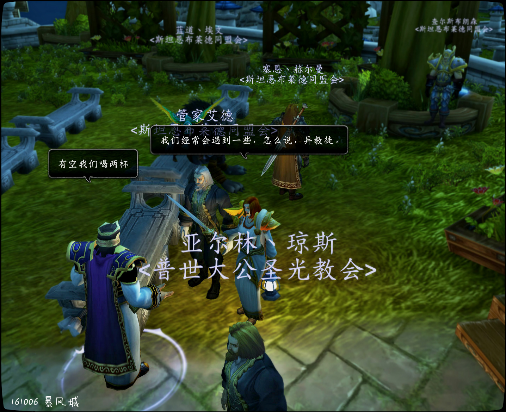

# 第一幕 骑士团的秘密

威廉的审判结束后炙热之心骑士团的法瑞上去和贤者尼苟德摩法官握手。贤者敏锐地……质疑了炙热之心骑士团的合法性。这个决定是如此突然。没有人，甚至连尼苛德摩本人都无法预知这个决定。

一天后高阶骑士评议会拒绝了这个调查。尼苛德摩扬言要在宗教会议上谴责骑士团。

威廉的审判完整故事见《威廉的审判》。

记录开始于 10/06/2016 的 11:05:32。 法瑞雅 犹豫 法瑞雅 出于一些……原因，并不能提交这份调查（她甚至感到有点焦虑，但她仍点头）

威廉的审判

暴风城贵族威廉·影在闪金镇中被抓获。然后被压往暴风城大教堂进行审判。法官为贤者尼苛德摩。至于罪名……

黑色星期五

> “圣光不悦，盖因王国滋生异端。”

圣光教会的宗主教贤者尼苛德摩下令对炙热之心骑士团进行长期调查。这猝不及防，毫无征兆，就像不详的黑色星期五。高阶骑士评议会对此的拒绝亦快如雷电，古老的骑士团里究竟藏有多少秘密？三位律师将会在审判庭上与尼苛德摩对决，然而格里高利修士的突然出现……揭示了一个更大的阴谋。

你可以在论坛上，游戏中参与这次剧情，加Q群459751392（这个是论坛群，要注册论坛）

这是一次公开的剧情互动。剧情不是封闭的，而是所有角色扮演者参与其中。它没有写好的剧本，你，或许会改变所有人的命运。

【本活动已完结】

第一幕 骑士团的秘密

威廉的审判结束后炙热之心骑士团的法瑞上去和贤者尼苟德摩法官握手。贤者敏锐地……质疑了炙热之心骑士团的合法性。这个决定是如此突然。没有人，甚至连尼苛德摩本人都无法预知这个决定。

一天后高阶骑士评议会拒绝了这个调查。尼苛德摩扬言要在宗教会议上谴责骑士团。

威廉的审判完整故事见《威廉的审判》。

记录开始于 10/06/2016 的 11:05:32。

\[贤者尼苛德摩]: 好让我们确定你们的合理性和安排随军主教

\[法瑞雅]: 我们并不完全效忠于暴风王国。

\[贤者尼苛德摩]: 请你们上交一份文件给我

\[贤者尼苛德摩]: 我会调查

法瑞雅 犹豫

\[贤者尼苛德摩]: 然后为你们册封合法性与通行证

法瑞雅 出于一些……原因，并不能提交这份调查（她甚至感到有点焦虑，但她仍点头）

威廉的审判

暴风城贵族威廉·影在闪金镇中被抓获。然后被压往暴风城大教堂进行审判。法官为贤者尼苛德摩。至于罪名……

记录开始于 10/06/2016 的 10:02:44。

\[阿尔托莉斯]: 人呢

\[法瑞雅]: 听说这次要审判的是一个贵族？

\[贤者尼苛德摩]: 现在允许你在此最后寻找一次律师辩护人

\[威廉丶影]: 我的天

\[法瑞雅]: 听说这次要审判的是一个贵族。

\[威廉丶影]: ..

\[法瑞雅]: 什么罪名？

\[贤者尼苛德摩]: 停下

\[阿尔托莉斯]: 调戏良家妇女？

\[法瑞雅]: 法官，安排入座吧。

\[贤者尼苛德摩]: 到后面花园去

\[奥莱德丶柏英]: 我喜欢这地方

\[法瑞雅]: 是的，他这次弄大了，根据他的话。

\[血色的玛尔兰]: 走吧，各位

\[阿尔托莉斯]: 那会烧毁植物的，我们要爱护环境

血色的玛尔兰向萨尔努修士鞠躬。

\[贤者尼苛德摩]: 所有人自己找位置坐下

\[贤者尼苛德摩]: 法官在水池边

\[血色的玛尔兰]: 我喜欢靠前的位置

\[蓝道丶埃文]: 哟，塞恩大人？

\[贤者尼苛德摩]: 两位法官

蓝道丶埃文向塞恩丶赫尔曼鞠躬。

\[贤者尼苛德摩]: 在这里等一下

\[血色的玛尔兰]: 介意吗，女士？

查尔斯布朗森 把剑插在了花圃中

\[管家艾德]: 是

\[塞恩丶赫尔曼]: 你是？

\[蓝道丶埃文]: 您也是来看热……啊，参加审判的吗？

\[血色的玛尔兰]: 您真慷慨

血色的玛尔兰对你表示感谢。

蓝道丶埃文 尴尬地摸了摸鼻子

\[贤者尼苛德摩]: 这俩人是来捣乱的啊？

\[蓝道丶埃文]: 我是……光头的部下。

\[塞恩丶赫尔曼]: 看热闹

\[法瑞雅]: 有捣乱者？

\[贤者尼苛德摩]: 二位等会要幸苦下

蓝道丶埃文 耸了耸肩

法瑞雅 拔剑

\[贤者尼苛德摩]: 看好这个被告人

\[法瑞雅]: 法庭尊严不容许质疑

\[贤者尼苛德摩]: 二位

管家艾德 脱下礼帽和披风

\[贤者尼苛德摩]: 今日是需要把你们的知识都拿出来

查尔斯布朗森向塞恩丶赫尔曼鞠躬。

塞恩丶赫尔曼 给威廉丶影带上镣铐

\[贤者尼苛德摩]: 审理贵族案件

\[管家艾德]: 一定遵循公正严明的原则

\[查尔斯布朗森]: 赫尔曼大人，布斯曼大人

\[贤者尼苛德摩]: 那么

\[贤者尼苛德摩]: 现在

\[查尔斯布朗森]: 您们也来参加对着罪恶之徒的审判了吗

\[贤者尼苛德摩]: 请二位进去吧

管家艾德 示意查尔斯布朗森待会再说

\[塞恩丶赫尔曼]: 我带这家伙上法庭

塞恩丶赫尔曼指着威廉丶影。

查尔斯布朗森指着威廉丶影。

\[查尔斯布朗森]: 为你的罪恶负责吧

\[查尔斯布朗森]: 混账

\[贤者尼苛德摩]: 请原告进场

\[塞恩丶赫尔曼]: 叫你呢

血色的玛尔兰 惊讶的发现居然是戴丽拉丶贝隆！

\[贤者尼苛德摩]: 站到椅子那边

\[血色的玛尔兰]: 啊，戴丽拉，居然是你！

\[法瑞雅]: 安静（提醒旁边的贵族）

\[贤者尼苛德摩]: 原告

缇莲娜 在想又有哪个倒霉蛋要人头落地了

\[贤者尼苛德摩]: 这次审判，因涉及贵族，因此请保证会场安静

塞恩丶赫尔曼 仔细检查威廉丶影身上的镣铐是否结实

\[贤者尼苛德摩]: 现在我宣读此次案件

\[威廉丶影]: 老头！

\[贤者尼苛德摩]: 掌嘴

\[阿尔托莉斯]: ..

塞恩丶赫尔曼扇了威廉丶影一耳光，啊！

\[血色的玛尔兰]: 这

圣女伊娃 无声地嘲笑着这些贵族，她认为这些活人都……………该掌嘴

\[贤者尼苛德摩]: 别打断我说话

缇莲娜大声喝彩。真棒！

\[魔雲]: 那么，肯瑞托的法师魔雲，愿意为这位先生辩护

\[威廉丶影]: 我只是想说我身边这位是我的辩护律师

\[贤者尼苛德摩]: 10月4日

\[贤者尼苛德摩]: 在闪金镇

\[贤者尼苛德摩]: 被告人威廉爵士在闪金镇

法瑞雅 挑了更靠前的座位，没人看见她

罪名是非法行使初夜权

\[贤者尼苛德摩]: 非法行使初夜权

法瑞雅 吸了一口气，这果然，闹大了

梅微丝丶空曳 心想：人类的法律好奇怪

\[贤者尼苛德摩]: 对原告一位修女造成侵犯

\[贤者尼苛德摩]: 初夜权在王国已经废除120年

\[贤者尼苛德摩]: 此次事关重大

梅微丝丶空曳 心想：那还行使什么……

\[贤者尼苛德摩]: 将在此审理该案件

\[贤者尼苛德摩]: 本次法庭出席法官有

阿尔托莉斯 心想：这话就不对啊，直接说侵犯不就得了吗

\[贤者尼苛德摩]: 艾德先生

\[戴丽拉丶贝隆]: 【恶魔语】 E34CT65  &#x20;

圣女伊娃 皱眉：直接说侵犯不就好了，或者是没给钱？

血色的玛尔兰 心想戴丽拉丶贝隆怎么了，疯言疯语的

\[贤者尼苛德摩]: 亚尔林·琼斯法官

\[管家艾德]: 我是艾德、布斯曼，来自奥特兰克，在此次审判中一定公正严明

查尔斯布朗森对管家艾德点了点头。

亚尔林丶琼斯 清清嗓子

法瑞雅 被案情深深吸引了……她很久没见过这么，有趣的案子了。

法瑞雅 认为以前的案子通常都是焚烧亡灵什么的，很少涉及……好吧，这个。

\[亚尔林丶琼斯]: 诸位，本人是此次庭审的法官——亚尔林丶琼斯

查尔斯布朗森对亚尔林丶琼斯点了点头。

奥莱德丶柏英 心想：我咋不太明白其中的逻辑

\[贤者尼苛德摩]: 还有老夫亲自审理此次案件

\[贤者尼苛德摩]: 现在

\[贤者尼苛德摩]: 开庭

\[阿尔托莉斯]: 威…武…

\[血色的玛尔兰]: 戴丽拉丶贝隆，你要坚强，教会的伙伴支持你（小声）

\[贤者尼苛德摩]: 现在有情原告陈述当天发生的事情

查尔斯布朗森正在专心地听戴丽拉丶贝隆讲话。

法瑞雅 认为贵族的风流韵事，是晚饭的最好佐料。

管家艾德看着戴丽拉丶贝隆。

圣女伊娃 觉得有些饿了

\[贤者尼苛德摩]: 请不要紧张

\[管家艾德]: 原告，这位女士，请陈述案发时的客观情况

查尔斯布朗森 等得不太耐烦了

法瑞雅 同情地看了圣女伊娃，她也饿了。

亚尔林丶琼斯 看向戴丽拉丶贝隆

\[威廉丶影]: .

圣女伊娃 想喝血，实在是饿坏了。

\[贤者尼苛德摩]: …

\[血色的玛尔兰]: 戴丽拉丶贝隆，别怕！

阿尔托莉斯 拿出了狂犬疫苗

\[血色的玛尔兰]: 勇敢点

\[管家艾德]: 请不要紧张，这位女士

\[贤者尼苛德摩]: 咳咳，各位安静

\[贤者尼苛德摩]: 这位女士因为紧张而导致失语

游学者清风 心想要不要卖点什么吃的。

法瑞雅 警觉死亡骑士的嗜血欲望

\[贤者尼苛德摩]: 所以，让我们直接审理被告吧

查尔斯布朗森 心想这是何等的心理阴影

奥莱德丶柏英 吃着手中的爆米花

梅微丝丶空曳 心想：这个人类少女究竟有什么样的背景，才能使一个贵族因这点小事被告上法庭

\[贤者尼苛德摩]: 大胆威廉!

塞恩丶赫尔曼 认为让一位女士阐述这样的事，实在是太残忍了

\[贤者尼苛德摩]: 你可知罪?

\[威廉丶影]: 啊？

贤者尼苛德摩指着威廉丶影。

\[威廉丶影]: 敢问我主教大人我犯了何罪

阿尔托莉斯 小声嘀咕：包…包公..？

法瑞雅 向奥莱德要了一把爆米花

\[贤者尼苛德摩]: 大胆!

查尔斯布朗森 认为威廉丶影的罪行已经到了无法被形容的地步

\[魔雲]: 看来原告并没有什么好说的。

\[贤者尼苛德摩]: 公堂之上居然敢不把我们三位放在眼里

\[贤者尼苛德摩]: 来人

\[贤者尼苛德摩]: 给他两嘴巴

\[梅微丝丶空曳]: ？！

法瑞雅 很好奇原告为什么什么都不说

贤者尼苛德摩指着塞恩丶赫尔曼。

蓝道丶埃文 举了举手

梅微丝丶空曳 震惊的看着法官

\[管家艾德]: 法官大人，我认为此举不妥

\[魔雲]: 尊敬的法官阁下

圣女伊娃 拿起阿尔托莉斯的手，在那手指上画了一刀放在嘴里吮吸，顿时好多了。

管家艾德看着贤者尼苛德摩。

法瑞雅 举手

塞恩丶赫尔曼 给了威廉丶影两个大嘴巴

\[魔雲]: 这可是在滥用私刑？

亚尔林丶琼斯 注意着管家艾德的举动

\[法瑞雅]: 等等，原告什么都没说。

\[管家艾德]: 既然原告没有发言，就应该先让被告的辩护人发言

\[威廉丶影]: 啊！

\[法瑞雅]: 他至少有为自己辩护的权利。

\[魔雲]: 庭上的民众可是都看着呢

\[贤者尼苛德摩]: 根据王国法律，侮辱法官者要接受鞭打

\[亚尔林丶琼斯]: 请回到原位,女士

查尔斯布朗森向威廉丶影大声喝彩。真棒！

阿尔托莉斯 从口袋里拿出了放了一个月的辣条

\[贤者尼苛德摩]: 情节恶劣者，将收监

游学者清风 想起来有人出4000金币悬赏威廉的头，很担心能不能抢到这颗头颅。

\[梅微丝丶空曳]: 人家……被告什么都没说呢吧……

奥莱德丶柏英 看着圣女伊娃，心想：大庭广众之下做这种事也太随便了吧

查尔斯布朗森 觉得让这家伙尝尝苦头很不错

蓝道丶埃文 再次举手

阿尔托莉斯 递给法瑞雅，想请她吃

\[蓝道丶埃文]: 审判长阁下，能允许我说一句话吗。

法瑞雅 的骑士准则让她回到座位上

\[贤者尼苛德摩]: 不能，回去

\[圣女伊娃]: 你敢给别人吃？你是不是想搞事？？

\[血色的玛尔兰]: 先生！昨天原告女士向我叙述了事情的经过

\[蓝道丶埃文]: 我只是想为被告进行辩护。

\[蓝道丶埃文]: 根据王国律法，一名被告可以同时委托一到两名辩护人为其出庭进行辩护。

\[阿尔托莉斯]: 你不是才吃完拉肚子么。。

梅微丝丶空曳 对圣女伊娃投去异样的眼光

法瑞雅 接过阿尔托莉斯的吃的，继续看戏。

\[血色的玛尔兰]: 我想，我可以简单描述下

\[贤者尼苛德摩]: 那好吧，等候原告

血色的玛尔兰 看着贤者尼苛德摩

\[蓝道丶埃文]: 我请求与第一位辩护人组成律师团。

圣女伊娃 哼哼了一声决定把他的手给吞了。

查尔斯布朗森 心想为威廉丶影辩护的都是同流合污的无耻之辈

\[贤者尼苛德摩]: 你，回去坐下

\[魔雲]: 先生不如先把武器放下吧。

贤者尼苛德摩指着蓝道丶埃文。

\[威廉丶影]: 我要求先行辩护！

阿尔托莉斯 看到法瑞雅不要辣条，决定拿回来给圣女伊娃吃

\[贤者尼苛德摩]: 允许

\[贤者尼苛德摩]: 上前

\[贤者尼苛德摩]: 为自己辩护

贤者尼苛德摩指着威廉丶影。

血色的玛尔兰向布伦希瑞尔挥手致意。

圣女伊娃 瞪了阿尔托莉斯一眼，决定把他另一只手喂给食尸鬼。

\[血色的玛尔兰]: 坐吧，布伦希瑞尔

\[管家艾德]: 被告，请上前来

\[圣女伊娃]: 你家威廉真受欢迎

\[法瑞雅]: 把他关起来，我建议！

阿尔托莉斯对你点了点头。

\[奥莱德丶柏英]: 反正这货又不是第一次

\[威廉丶影]: 你闭嘴！

\[梅微丝丶空曳]: 一个贵族怎么会被一个小小的修女告上法庭……真是荒谬……（小声）

\[圣女伊娃]: 差不多啦，当初还悄悄对我说要不要让我做他家“女仆”

\[贤者尼苛德摩]: 现在

\[贤者尼苛德摩]: 继续开庭

\[贤者尼苛德摩]: 保持安静

\[威廉丶影]: 我只是为哪位女士捡了衣服而已！

\[威廉丶影]: 为什么要判我罪！

\[贤者尼苛德摩]: 本案因为原告突然离场

\[奥莱德丶柏英]: 我记得我当时剑已经插墙上了

\[阿尔托莉斯]: 原来不是捡了砖头（小声）

法瑞雅 认为继续开庭是很有必要的，毕竟这涉及到其他修女的安全

\[贤者尼苛德摩]: 因此无发证实威廉是否有罪

阿尔托莉斯对你点了点头。

\[贤者尼苛德摩]: 因此经过陪审团决议

\[贤者尼苛德摩]: 暂定其无罪

\[血色的玛尔兰]: 什么？？

管家艾德对威廉丶影点了点头。

阿尔托莉斯坚决地声明，不。

\[贤者尼苛德摩]: 但是

\[奥莱德丶柏英]: 那是因为转头都碎了

法瑞雅 不解

血色的玛尔兰坚决地声明，不。

圣女伊娃坚决地声明，不。

\[贤者尼苛德摩]: 威廉因为侮辱法官，大闹公堂

塞恩丶赫尔曼 解开威廉丶影身上的镣铐

法瑞雅 认为这不妥

\[威廉丶影]: 我没有！

\[阿尔托莉斯]: 我懂了，这中场休息一定是塞钱给法官了

\[威廉丶影]: 我无罪！

\[血色的玛尔兰]: 这无罪的宣判太仓促了，拘押候审！

\[法瑞雅]: 他需要被关起来至少，拘押着。

\[梅微丝丶空曳]: 人类的社会规章……也不像我想想的那么有“调理”么……（小声

\[贤者尼苛德摩]: 因此陪审团决议

法瑞雅 开始思索其中是否有猫腻

\[贤者尼苛德摩]: 拘押候审

\[贤者尼苛德摩]: 但是

塞恩丶赫尔曼 再次给威廉丶影带上镣铐

\[威廉丶影]: 怎么又带上了（小声问）

\[贤者尼苛德摩]: 威廉有权提出5000个金币的保释权力直到第二次候审

\[萨莱纳丶死鹰]: （小声嘀咕）我还听说人类是靠决斗审判的呢

\[威廉丶影]: 5000金币！

\[阿尔托莉斯]: 果然是讹钱的。。。（小声）

\[奥莱德丶柏英]: 不错呦，贵族

\[圣女伊娃]: 唉，阉了算了嘛

\[威廉丶影]: 你是要讹我吗？！

\[贤者尼苛德摩]: 没钱你还玩初夜权

\[法瑞雅]: 难道钱能解决所有问题吗？

\[梅微丝丶空曳]: 呵呵……这就是人类的社会啊……（小声

罗丽莎 心想：威廉又100种方法让你在暴风城混不下去

\[法瑞雅]: 这样有罪和无罪又有什么区别？（法瑞用圣骑士那种说教的口吻说）

\[梅微丝丶空曳]: 这个贵族也太没意思了吧……（小声

\[威廉丶影]: 我会去告你的主教！

\[威廉丶影]: 你个老头！

\[贤者尼苛德摩]: 大家看见了吧

\[威廉丶影]: 竟然公然讹了贵族

\[贤者尼苛德摩]: 侮辱法官

\[阿尔托莉斯]: 目测又要掌嘴了（小声）

\[梅微丝丶空曳]: 啊哦……如果我是你，我可不会这么说话

\[贤者尼苛德摩]: 此项罪名

\[魔雲]: 法官阁下让大家看的意思，可是说明我的当事人之前并无这样的行为？

\[贤者尼苛德摩]: 掌嘴10次

\[管家艾德]: 消停点！

\[梅微丝丶空曳]: ……

\[圣女伊娃]: 哈哈

管家艾德看着威廉丶影。

\[血色的玛尔兰]: 哦，天啊

\[阿尔托莉斯]: 果然。。。（叹气）

\[查尔斯布朗森]: 才10次啊（小声）

\[贤者尼苛德摩]: 各位，是否赞成此项决议

阿尔托莉斯点了点头。

\[缇莲娜]: 可怜的人（低语

\[梅微丝丶空曳]: 不赞成

萨莱纳丶死鹰 抱起 \[夜之子小食拼盘]吃起来

\[魔雲]: 那么法官的判决是以何为依据呢？

\[奥莱德丶柏英]: 直接当场把他干掉多省事

血色的玛尔兰坚决地声明，不。

\[贤者尼苛德摩]: 他刚骂我

查尔斯布朗森对贤者尼苛德摩点了点头。

\[血色的玛尔兰]: 暴力不能解决问题

贤者尼苛德摩指着威廉丶影。

\[血色的玛尔兰]: 法官先生

\[圣女伊娃]: 不行，应该100次

罗丽莎 撕扯起 \[风干鲭鱼丝]来

\[血色的玛尔兰]: 正义！

\[威廉丶影]: 这是私刑！

\[血色的玛尔兰]: 公平！

\[阿尔托莉斯]: 富强！

\[血色的玛尔兰]: 我不赞成动刑

\[缇莲娜]: 民主！

\[梅微丝丶空曳]: 私人恩怨，很有意思……

\[亚尔林丶琼斯]: 于贵族，掌嘴尚不妥

\[阿尔托莉斯]: 文明！

\[圣女伊娃]: 团结！

蓝道丶埃文 无奈的举了举手

\[血色的玛尔兰]: 和谐

\[贤者尼苛德摩]: 好吧

\[缇莲娜]: 美好

\[阿尔托莉斯]: 公正！

\[梅微丝丶空曳]: 我说，他真的是贵族吗？

\[威廉丶影]: 我威廉怎么说也是贵族！

\[奥莱德丶柏英]: 法制！

\[亚尔林丶琼斯]: 且可采其他途径惩之

\[圣女伊娃]: 活死人！

法瑞雅 认为应该用圣光给他漱口

\[血色的玛尔兰]: 先生，并不因为你是贵族！

\[梅微丝丶空曳]: 贵族岂能容此侮辱？

\[血色的玛尔兰]: 贵族和平民都一样

\[威廉丶影]: 而且我只是给哪位小姐捡了衣服！

\[威廉丶影]: 我并没有做出出格的事！

塞恩丶赫尔曼 心想贵族应该有钱

\[管家艾德]: 别再说了（小声）

管家艾德看着威廉丶影。

\[贤者尼苛德摩]: 大胆

\[贤者尼苛德摩]: 我让你说话了吗

亚尔林丶琼斯指着威廉丶影。

\[圣女伊娃]: 掌嘴！

血色的玛尔兰 心想又要掌嘴了吗？

罗丽莎 用头蹭了蹭水语者小欣

查尔斯布朗森向贤者尼苛德摩大声喝彩。真棒！

\[梅微丝丶空曳]: 人类的规章中贵族与平民应该有着巨大的身份差距吧……？（小声

\[缇莲娜]: 唉

圣女伊娃大声喝彩。真棒！

\[亚尔林丶琼斯]: 不要以为你是贵族就可以肆无忌惮

法瑞雅 居然开始心疼要被掌嘴的被告

\[梅微丝丶空曳]: 是我还不够了解人类吗……（小声

\[亚尔林丶琼斯]: 我们已经给你最大限度的忍耐了

\[血色的玛尔兰]: 圣光之下，我们都是平等的，女士（小声）

\[贤者尼苛德摩]: 掌嘴!

\[贤者尼苛德摩]: 我亲自来

塞恩丶赫尔曼 将一卷地精造的胶带贴在威廉丶影嘴上，心想这下这家伙该闭嘴了吧

\[威廉丶影]: 你这是私刑

\[威廉丶影]: 是自己的私欲

血色的玛尔兰坚决地对贤者尼苛德摩说不。

\[圣女伊娃]: 好！公正！英明啊！

圣女伊娃大声喝彩。真棒！

\[威廉丶影]: 也是知道法律的

\[梅微丝丶空曳]: 哈哈

\[贤者尼苛德摩]: 好

\[血色的玛尔兰]: 这太有损形象了，先生

\[梅微丝丶空曳]: 公正！

\[威廉丶影]: 我可以反击的！

\[贤者尼苛德摩]: 那就民主表决

梅微丝丶空曳 跟着起哄

这个法庭，是越发疯狂了。

记录开始于 10/06/2016 的 10:43:36。

\[梅微丝丶空曳]: 不支持

\[圣女伊娃]: 支持！

\[管家艾德]: 法官大人，我认为此举不妥

\[威廉丶影]: 你这是滥用私权！

\[缇莲娜]: 支持

\[查尔斯布朗森]: 你问我支持不支持？

\[查尔斯布朗森]: 那我肯定是支持的

\[奥莱德丶柏英]: 无所谓

血色的玛尔兰 觉得这太无理取闹了！

\[法瑞雅]: 支持（故作正义）！

\[贤者尼苛德摩]: 算你命大

\[梅微丝丶空曳]: 哎呀……看来我的票数算上了？

查尔斯布朗森 心想该死的一票否决的陪审团制度

\[亚尔林丶琼斯]: 既免除掌嘴之刑，应以其他之罚替之

\[水语者小欣]: 他们什么时候弄死威廉啊

\[威廉丶影]: 老头我要求你宣布我无罪！

\[血色的玛尔兰]: 在真相显露之前，反对一切不必要的刑罚

\[贤者尼苛德摩]: 你们看见没

\[贤者尼苛德摩]: 他又骂我

梅微丝丶空曳 心想：真是无趣……

\[查尔斯布朗森]: 看见了。。。。。

贤者尼苛德摩指着威廉丶影。

\[圣女伊娃]: 听见了

\[缇莲娜]: 听见了

\[梅微丝丶空曳]: 如果我是你，我绝对不会这么说

\[查尔斯布朗森]: 这下可是明知故犯

\[梅微丝丶空曳]: 真是可笑……

管家艾德 无可奈何

\[贤者尼苛德摩]: 所以，打不打

\[圣女伊娃]: 你应该聪明点，贵族

\[梅微丝丶空曳]: 支持！

\[缇莲娜]: 打！

\[奥莱德丶柏英]: 所以，他不用死或者被阉了

法瑞雅 虽然认为掌嘴不妥，但是这种强行行使初夜权的行为，如果真的发生了……应该判10年监禁，她认为。

\[圣女伊娃]: 支持

查尔斯布朗森 叹了叹气

\[血色的玛尔兰]: 称呼并不重要，先生！

\[威廉丶影]: 那好！主教大人！我要求宣布我无罪！

\[阿尔托莉斯]: 拿开水烫！

\[法瑞雅]: 打，以示警戒。

\[血色的玛尔兰]: 请回到正题上来

\[贤者尼苛德摩]: 算你命大

\[奥莱德丶柏英]: 小妹

\[圣女伊娃]: 嗯？

\[贤者尼苛德摩]: 那么现在

\[奥莱德丶柏英]: 等下回家后告诉我结果

\[奥莱德丶柏英]: 我看不下去了

\[贤者尼苛德摩]: 请威廉描述当天发生的一切

\[圣女伊娃]: 哈哈，去吧去吧

罗丽莎 心想为什么不拔了威廉的贵族外套，换上囚服

\[贤者尼苛德摩]: 10月4日你在干嘛

\[威廉丶影]: 那天！我在酒馆二楼

\[贤者尼苛德摩]: 在二楼干嘛？做什么不可描述的事情吗？

\[魔雲]: 抗议！

\[威廉丶影]: 你！

\[贤者尼苛德摩]: 抗议什么

\[威廉丶影]: 污蔑贵族也是一项罪名！

\[魔雲]: 法官阁下你的倾向性太严重了

\[梅微丝丶空曳]: 连人家话都没说完，真的可以吗？

\[威廉丶影]: 主教大人你得注意你的发言了！

\[魔雲]: 请公正审判

\[威廉丶影]: 我不过路过她的房间见房门未锁

\[贤者尼苛德摩]: 你再打断我说话

血色的玛尔兰 觉得被告辩护人的思维反应有点慢了

阿尔托莉斯 心想：什么时候还有掌嘴看

\[贤者尼苛德摩]: 我不能打他耳光

\[贤者尼苛德摩]: 我能打你

\[威廉丶影]: 本想进去看看有没有人提醒一下！

\[贤者尼苛德摩]: 他说啥？

\[威廉丶影]: 结果看到那位小姐裸身在床衣服落地了

罗丽莎 心想：没事就进别人的客房这算啥

\[贤者尼苛德摩]: 你等会儿

\[贤者尼苛德摩]: 从新叙述

\[威廉丶影]: 我不过上前拾取衣物

\[圣女伊娃]: 没准人家刚脱下衣服准备睡觉呢……

\[萨莱纳丶死鹰]: 法官大人，既然威廉先生坚持他只是捡女士的衣服……那么为什么不让他穿一天试试呢？

\[贤者尼苛德摩]: 从新开庭

\[贤者尼苛德摩]: 被告人威廉，10月4日你在什么地方?

\[蓝道丶埃文]: 审判长阁下，我再次向您，以及被告威廉提出进行辩护的请求。请问是否能够得到允许？

\[贤者尼苛德摩]: 允许

管家艾德看着蓝道丶埃文。

\[蓝道丶埃文]: 那么，现在我能说两句吗？

\[贤者尼苛德摩]: 说

\[蓝道丶埃文]: 尊敬的审判长大人，首先，原告对被告所提出的罪名为“非法行使初夜权”，但这本身就是错误的。

\[管家艾德]: 这位先生，请收起武器

管家艾德看着蓝道丶埃文。

\[缇莲娜]: 狼人你先收好武器

\[蓝道丶埃文]: 因为根据王国律法，初夜权是仅限于领主对于自己下辖领地的平民妇女提出的一种要求。

亚尔林丶琼斯 看向蓝道丶埃文

魔雲对蓝道丶埃文点了点头。

\[贤者尼苛德摩]: 但是威廉并非领主

瑟琳娜丶塔克 看着亚尔林丶琼斯，嘴角上扬——一个熟悉的面孔啊

\[蓝道丶埃文]: 没错，威廉先生，他仅仅是一名贵族，并不是领主。

\[威廉丶影]: ==

血色的玛尔兰 看着这名狼人带着刀！！！

\[贤者尼苛德摩]: 对啊

\[贤者尼苛德摩]: 他不是领主

法瑞雅 认为蓝道丶埃文说得对，威廉没有权力行使初夜权

\[蓝道丶埃文]: 所以说，他的行为顶多构成强制猥亵以及侮辱妇女。

\[贤者尼苛德摩]: 侮辱妇女？

\[蓝道丶埃文]: 与亵渎王国律法，强行使用被废止的初夜权相比。

\[蓝道丶埃文]: 这两者差太多了。

法瑞雅 同样认为，即使他有这个权力，这被圣光所不容许！

\[贤者尼苛德摩]: 你的意见我们会考虑的

\[贤者尼苛德摩]: 现在休庭

\[贤者尼苛德摩]: 二位

\[贤者尼苛德摩]: 查查侮辱妇女是什么最

\[阿尔托莉斯]: 又要给钱了吗。。。（小声）

\[圣女伊娃]: 有些事情不要说出来

查尔斯布朗森进入了梦乡。Zzzzzzz…

\[管家艾德]: 是，法官大人

\[贤者尼苛德摩]: 继续开庭

\[贤者尼苛德摩]: 鉴于刚才这位先生的发言

最后的判决显然不能让众人满意。

记录开始于 10/06/2016 的 10:54:11。

\[瑟琳娜丶塔克]: 这就决定了？！（小声

\[魔雲]: 掌嘴

\[贤者尼苛德摩]: 允许威廉自由行动

\[贤者尼苛德摩]: 但是要受人监管

瑟琳娜丶塔克 点头表示赞许

血色的玛尔兰 觉得法官应该去图书馆多看看法律书籍 了

\[法瑞雅]: 我认为掌嘴是有必要的，以示警戒。

\[圣女伊娃]: 同意

\[管家艾德]: 法官大人，我可以接受这一神圣的职责

管家艾德看着贤者尼苛德摩。

\[血色的玛尔兰]: 反对私刑

查尔斯布朗森 进入了深度睡眠

\[魔雲]: 虽然是辩护律师，觉得掌嘴也是可行的。

塞恩丶赫尔曼 又一次解下威廉丶影身上的镣铐，心想这是第几次了？

\[瑟琳娜丶塔克]: 不同意，反对死刑。

\[贤者尼苛德摩]: 什么职责

\[瑟琳娜丶塔克]: 私刑

\[管家艾德]: 监视被告人

\[法瑞雅]: 对于贵族而言，这种当众的羞辱，已经很严重了，所以掌嘴吧。

\[贤者尼苛德摩]: 那么

\[贤者尼苛德摩]: 监管被告人，要24小时

\[贤者尼苛德摩]: 被告人一切行为必须被监视

\[贤者尼苛德摩]: 包括大小便时间

\[血色的玛尔兰]: 我觉得安度因陛下不会允许这种滥用私刑的行为的！

瑟琳娜丶塔克 皱着眉头，看着法官——是这个贵族太无能，还是原告的势力十分强大？

血色的玛尔兰 觉得还有点道理

\[贤者尼苛德摩]: 本次法庭结束

查尔斯布朗森 鼾声震天

\[贤者尼苛德摩]: 由于原告的并未到场

\[瑟琳娜丶塔克]: 不管怎么说也是个贵族啊……真是可笑……（小声

\[贤者尼苛德摩]: 因此本案暂定为无罪

\[圣女伊娃]: 没有但是了吗

\[管家艾德]: 明判（小声）

\[阿尔托莉斯]: 没掌嘴看了。。。（小声）

\[贤者尼苛德摩]: 退堂

血色的玛尔兰 起身离开庭审现场

\[阿尔托莉斯]: 威…武…

最后附上陪审团的奥术影像。

骑士团的秘密

审判结束后炙热之心骑士团的法瑞上去和贤者尼苟德摩法官握手。贤者敏锐地……质疑了炙热之心骑士团的合法性。

记录开始于 10/06/2016 的 11:05:32。

\[贤者尼苛德摩]: 好让我们确定你们的合理性和安排随军主教

\[法瑞雅]: 我们并不完全效忠于暴风王国。

\[贤者尼苛德摩]: 请你们上交一份文件给我

\[贤者尼苛德摩]: 我会调查

法瑞雅 犹豫

\[贤者尼苛德摩]: 然后为你们册封合法性与通行证

法瑞雅 出于一些……原因，并不能提交这份调查（她甚至感到有点焦虑，但她仍点头）
