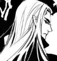

# 梅林的审判

本文作者：索拉

古怪。

帕拉斯圣剑：他甚至敢冒生命危险来到那里。

萨拉辛永夜：你发现了什么久风小姐？

米拉娅晨光（黄昏下的美羽）喊道：守住地窖！

塞斯克：你有没有警告过他，梅林？

古格火须：战争和冒险一样都是不公平的。

巴鲁沙：我想听听其他当时在场人的意见，那个精灵是否表现出敌意？

古格火须：别指望着你能打着拜访女王的名义安全走出幽暗城。

梅林：我有作出警告。我用最标准的通用语告诉他：如果再走近一步，我就会动手。

帕拉斯圣剑：其他骑士们，塞拉夫？

塞拉夫夜愿：在!

帕拉斯圣剑：还有暴风雪弗丁。

暴风雪弗丁：在！

古格火须：我认为刺客在地窖里。

帕拉斯圣剑：你们认为呢？

埃尔文晨曦：我当时不在现场。

古格火须：然后利用召唤术成功逃脱。

暴风雪弗丁：我当时并不在场。

巴鲁沙：评议会的作用就在于此。

暴风雪弗丁：我更倾向于这是个误会。

梅林：各位……各位……我斗胆发句言……

帕拉斯圣剑：请讲，梅林。

梅林：你们不觉得奇怪吗？

帕拉斯圣剑：请说。

梅林：这里只有我们联盟的四个盟友，唯独少了一位该来的同伴。

帕拉斯圣剑：我没有邀请他们来（喂喂……那可是重要证人……）

梅林：那些纳鲁的信徒呢……他们哪去了？

黄金狮子奥菲：该死的，我好像闻到血精灵的气息了。

帕拉斯圣剑：如果那些德莱尼通报了卫兵，他们会被允许进来。

黄金狮子奥菲：不见了，该死的。

帕拉斯圣剑：但是，你事实上确实违反了长官的命令。天威骑士塞拉夫，请不要站在门口了。

黄金狮子奥菲：报告！

帕拉斯圣剑：知道了，奥菲。

巴鲁沙：够了，这种小事等议会结束后再处理。我希望那只是个小插曲，而不是和评议会有什么关系。

古格火须：我感觉到有什么人潜伏在附近。

帕拉斯圣剑：塞斯克爵士。

塞斯克：在。

古格火须：作为一个潜行者的直觉，我得……

帕拉斯圣剑：对于一个违抗军令的骑士，根据规章该如何处理？

战争古树耶卡：我认为，血精灵不会诚信去哀悼一个他的敌人。他在追悼现场太久了，也许应该驱逐，也许……

塞斯克：评议会会根据具体情况讨论处罚，一般来说可以降阶。关于这个事情，我倒是有个提议。

帕拉斯圣剑：请讲。

巴鲁沙表现得很有兴趣。

塞斯克：梅林，你的剑应该为骑士团赢回荣誉，同样为自己。但是你现在用在了错误的地方。

帕拉斯圣剑非常赞同塞斯克的观点。

塞斯克：非荣誉的战斗令你的剑蒙羞。

梅林：我同意……

塞斯克：所以我建议你折断那把令骑士团蒙羞的剑，用新的武器重新赢回自己的荣耀。当然，骑士团也应该给与戴罪立功的机会。

战争古树耶卡：很棒的主意。

萨拉辛永夜表示赞同。

伊蕾娜羽歌赞同地点了点头

帕拉斯圣剑：既然各位都这么说……

塞斯克：在他能够挽回自己和骑士团的荣誉之前，我建议评议会剥夺他晋升的权利。

帕拉斯圣剑：侍从梅林

梅林：是，我的大人。

巴鲁沙：永久性的吗？

帕拉斯圣剑：你将继续背负着“负罪者”的称号，直到你用你的行为为你洗刷罪名。这个处罚决定，各位有什么意见没有？

战争古树耶卡：太棒了，梅林。

萨拉辛永夜：尊重你的裁决，圣剑骑士。

兰德摩尔：大家相信梅林会为骑士的称号争光。

帕拉斯圣剑：在最后的惩罚没有决定之前，负罪者梅林，你有个很重要的任务需要完成。

梅林：大人，我突然有个想法。

帕拉斯圣剑：请讲。

梅林：其实，我想让让您给我一个任务……让我去调查这次刺杀事件背后的主谋。

巴鲁沙瞥了帕拉斯圣剑一眼。

兰德摩尔：大人，这是个好建议。

帕拉斯圣剑：这个任务很适合你，这也是我希望的。

梅林：我的眼睛确确实实看到了一个长尾巴的……厄……一个生物……

帕拉斯圣剑：其他骑士的意见呢？

古格火须：那么给他个期限。

塞斯克：恩，作为当事人，无论从哪个方面来看，他都是合适的人选。

帕拉斯圣剑对梅林点点头。

梅林：一周……我只需要一周……我的大人……我以乌瑟尔的名义起誓。

古格火须：如果他能违背一个誓言，那么他很可能雇个佣兵来帮他解决这么个麻烦。

帕拉斯圣剑：巴鲁沙，你一贯是最冷静、最具头脑的骑士，你觉得呢？

梅林突然站起：见鬼！矮人，……你不明白你的立场吗？！

兰德摩尔：梅林！

古格火须：啊哈哈哈

战争古树耶卡：嗨，别激动！

帕拉斯圣剑：梅林！

梅林：放开我放开我！

萨拉辛永夜在安慰古格火须。

古格火须：冲动是冒险的大忌。

梅林跪了下来。

米拉呀晨光：冷静，先生。

塞斯克：不要被这个不明来历的矮人挑衅了。

巴鲁沙：控制你的情绪，梅林，你想再次让我们失望吗？

兰德摩尔：不要冲动，否则将前功尽弃。

帕拉斯圣剑：那么梅林

梅林：对不起……对不起……

塞拉夫夜愿：梅林，无论如何，你现在肩负着骑士团的荣誉。

帕拉斯圣剑：就按照你说的，一周的期限。

战争古树耶卡：看，这次控制住了，好的开始。

古格火须：冲我来吧，梅林。不过，这帮不了你什么。

帕拉斯圣剑：同时，这一周之内，你的处罚决定也会正式公布。

梅林：感谢您的慈悲，大人。

巴鲁沙：我想或许我们该再派一名光明骑士协助他一起调查，这样会更加妥当。

帕拉斯圣剑：那么，谁来承担这个责任？

梅林：厄……我不需要……这是我的任务……我是说……我要一个人\(很紧张\)

巴鲁沙：本来我是信任你的，但你刚才的表现……

古格火须：怕别人知道你暗地里的勾当么？

梅林：（小声地）矮人……

帕拉斯圣剑：我们觉得指派一名骑士协助你更合适。

巴鲁沙：我不希望你再作出什么有损骑士团名誉的事情。

梅林：……我……

塞拉夫夜愿：矮人，你是来观礼的，请你保持安静，如果是来捣乱的，我会把你请出去。

巴鲁沙：塞拉夫，你到现在还没发过言呢。

塞拉夫夜愿：这件事情我也有涉及，我不方便在当前场合发表个人的看法。我只希望给梅林侍从一个机会。

帕拉斯圣剑：Renaissence，艾尔文晨曦，你们谁愿意协助梅林？

艾尔文晨曦：我愿意。

梅林：女士……真的……也许……

帕拉斯圣剑：那么好，艾尔文晨曦，你必须协助他，并适当地对他的行为进行约束。你们得在一周内完成调查。塞拉夫，由于此事你也有责任，那么你得为他们的调查提供一切你能提供的协助。

塞拉夫夜愿优雅地鞠了一躬。

帕拉斯圣剑：梅林，你可以退下了。

梅林：是的，大人。（小声地）见鬼我得赶快把她甩掉……不然……

END

