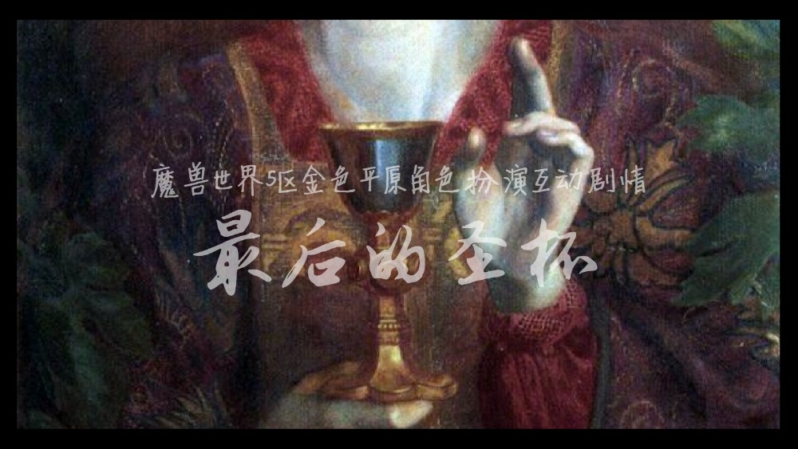

# 最后的圣杯

“这个圣杯是为谁准备的呢？”

夜幕之中，炙热之心骑士团在暴风城的墓地中，一个守墓人被发现用圣光神术杀死在墓前。墓碑均被破坏打开，好像有人在寻找什么。这是象征性的墓地，并没有真正埋葬骑士们。它埋葬的，是骑士团古老的秘密。圣杯，一件传说中的圣物……

剧情不是封闭的，而是所有角色扮演者参与其中。这是一次开放性剧情活动，你，或许会改变所有人的命运。希望参与此次剧情的，联系法瑞雅。

