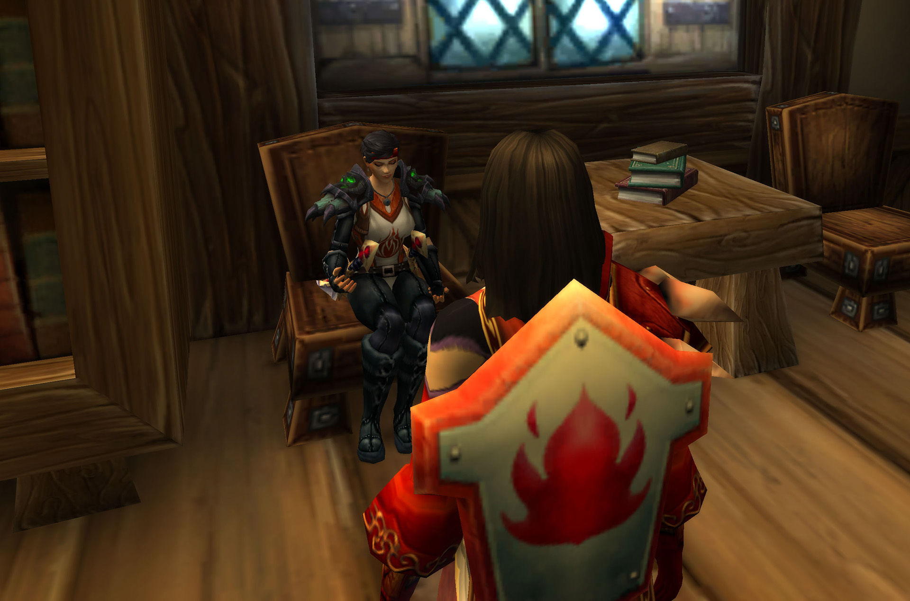
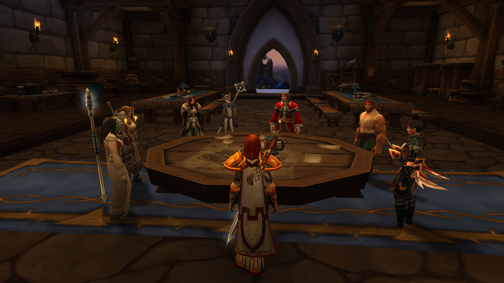
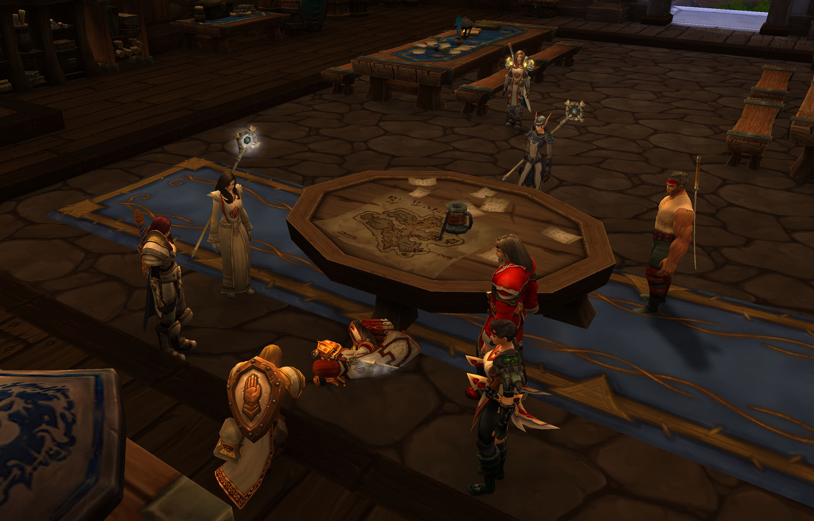
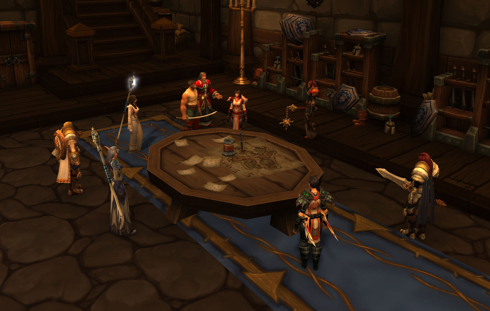
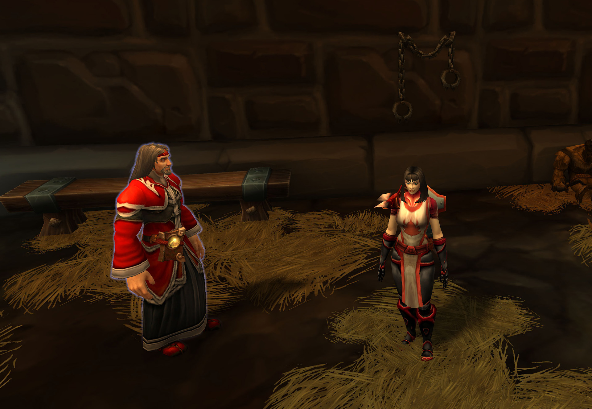
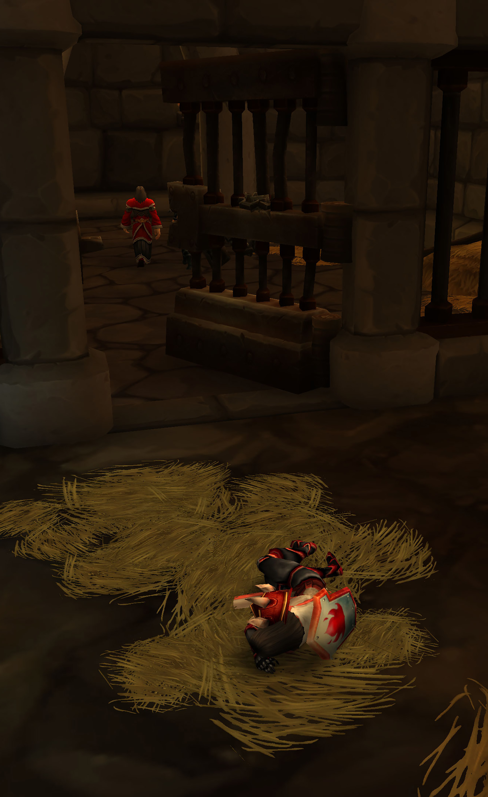
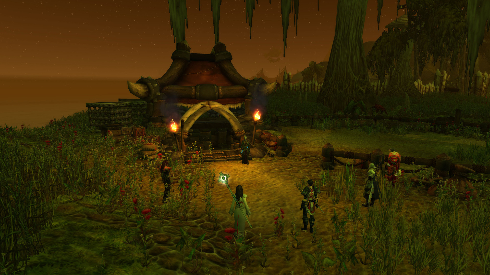
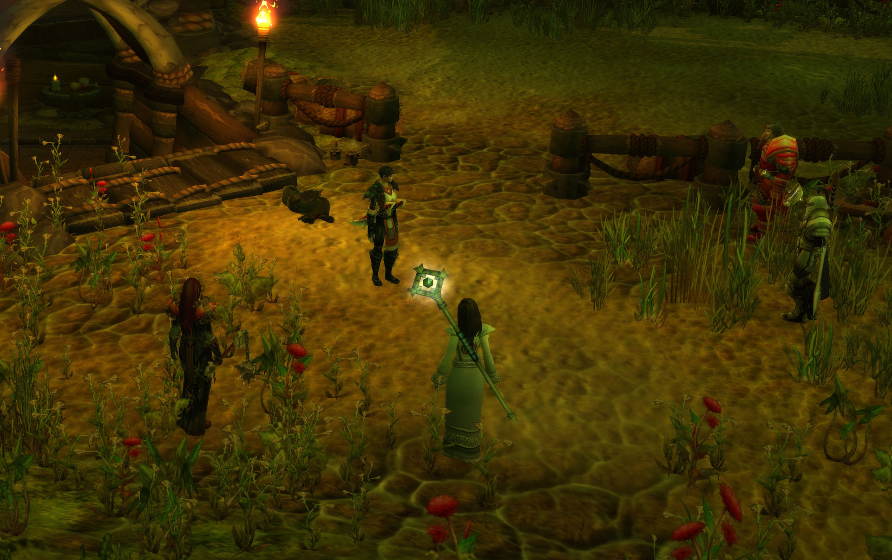
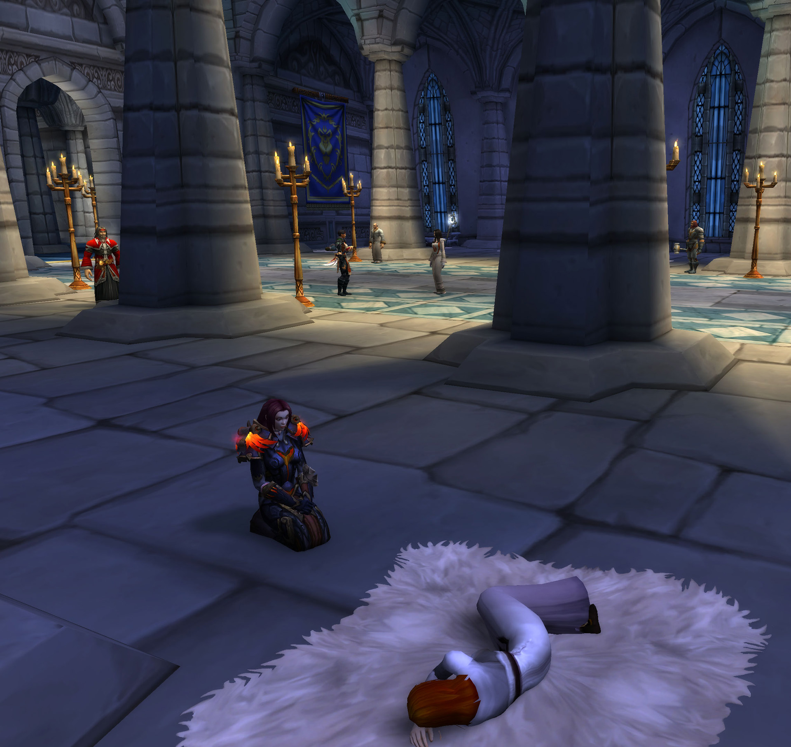

# 第二幕 圣杯传说

## 秘密会面

莉莉丶丹玛斯和阿亚莎·布伦特在艾尔文森林会面，没有人知道他们。

记录开始于 05/23/2021 的 20:09:44。

\[莉莉丶丹玛斯]: 来了

\[莉莉丶丹玛斯]: 进去说吧

\[莉莉丶丹玛斯]: 先坐吧

\[阿亚莎·布伦特]: 怎么了？

\[莉莉丶丹玛斯]: 我决定动手了

\[阿亚莎·布伦特]: 不！

\[莉莉丶丹玛斯]: 她已经堕落了

\[阿亚莎·布伦特]: 他们会发现是你。

\[阿亚莎·布伦特]: 你不能暴露了。

\[莉莉丶丹玛斯]: 放心 不会的

\[阿亚莎·布伦特]: 我会说是我们的人做的，如果你心意已决。

\[莉莉丶丹玛斯]: 你们不了解我们这种职业

\[莉莉丶丹玛斯]: 我跟你说 在这个时间段 她还有心情去参加宴会

\[莉莉丶丹玛斯]: 忘记了了仇恨

\[阿亚莎·布伦特]: 她认为这是外交活动。

\[莉莉丶丹玛斯]: 外交活动。。

\[莉莉丶丹玛斯]: 都是借口

\[莉莉丶丹玛斯]: 她已经被繁华腐化了

\[阿亚莎·布伦特]: 你千万不可以暴露自己。

\[莉莉丶丹玛斯]: 你放心

\[莉莉丶丹玛斯]: 今晚我们要开会 来了很多人

\[莉莉丶丹玛斯]: 正是动手的好时候

\[莉莉丶丹玛斯]: 圣杯的事情 我会慢慢调查的

\[阿亚莎·布伦特]: 我会保护你。

\[莉莉丶丹玛斯]: 我是说真的

\[莉莉丶丹玛斯]: 如果我出意外了， 剩下的就交给你了。。

\[阿亚莎·布伦特]: 为了洛丹伦。

莉莉丶丹玛斯 慢慢的站了起来

莉莉丶丹玛斯满怀敬意地向你致礼。

你满怀敬意地向莉莉丶丹玛斯致礼。

\[莉莉丶丹玛斯]: 一切为了洛丹伦

## 骑士评议会

骑士评议会在骑士团的暴风城驻地举行。

.jpg>)

记录开始于 05/23/2021 的 20:35:33。

\[朱丝缇雅]: 今天好像是我们的第一次正常会面

朱丝缇雅 吸了口气说道

\[法瑞雅]: 骑士们聚集在此，是的，骑士团重建后第一次骑士评议会。

莉莉丶丹玛斯 路过时，一片粉末飘入法瑞的杯子中。

佐伊一世 视线放到了雷曼丶库伯的身上，皱了皱眉。

朱斯提尼阿诺 注视着雷曼丶库伯的双眸，观察着眼前这个男人的神情，黝黑的皮肤、粗狂的肌肉

朱丝缇雅 丝毫没有注意到莉莉丶丹玛斯的小动作

\[朱斯提尼阿诺]: 你看起来不像是北方人

朱丝缇雅 也注意到了雷曼丶库伯

雷曼丶库伯 看了看周围骑士闪闪发光的铠甲 眼神中透露出一丝渴望

\[朱丝缇雅]: 确实

\[朱丝缇雅]: 更像是水手

\[法瑞雅]: 但是有一天，你会成为一个真正的骑士。

\[法瑞雅]: 我们都会在那，看着你晋升。

朱丝缇雅对你点了点头。

\[法瑞雅]: 骑士评议会原本的功能，是讨论一个骑士的品德和功绩。

\[法瑞雅]: 但是逐渐变成了议事的会议。

\[法瑞雅]: 上周发生的事，让我不得不召集骑士评议会。

朱斯提尼阿诺 看着法瑞雅

朱丝缇雅用目光压倒了你。

雷曼丶库伯看着你。

\[法瑞雅]: 守墓人安纳特·兰顿死在骑士团暴风城墓地里。

\[法瑞雅]: 然后我们得知那不是真的墓地。

朱丝缇雅 为死去的人默哀

朱斯提尼阿诺 的手指慢慢敲击着桌面

\[法瑞雅]: 去了图书馆查找古籍，发现骑士团真正的墓地在索多里尔河附近的墓穴里。

\[法瑞雅]: 但是待到我们赶到，已经太迟了。

雷曼丶库伯 捏紧了双拳

\[法瑞雅]: 圣杯，如果真的藏在那里，那么已经失窃。

\[朱斯提尼阿诺]: 所以呢，图尔加斯女士，我们是应该去洛丹伦消灭那里的亡灵，还是继续寻找这个愚蠢的杯子?

\[朱丝缇雅]: 注意你的言辞

\[法瑞雅]: 这就是骑士团共同的决定了。

朱丝缇雅用目光压倒了朱斯提尼阿诺。

\[法瑞雅]: 必须由每一位骑士投票，决定接下来的行动。

朱斯提尼阿诺 耸了耸肩

\[法瑞雅]: 关于圣杯，还有一件事。

\[法瑞雅]: 就是我们还不知道圣杯真正的作用。

\[法瑞雅]: 我们只是听说，听说她能净化亡灵。

\[法瑞雅]: 我这周查找骑士团的历史，发现很多古籍都是由骑士团的老学者——

\[法瑞雅]: 诺亚·格拉汉整理的，她可能知道圣杯真正的用途。

朱丝缇雅对弗蕾雅丶卡特点了点头。

\[朱斯提尼阿诺]: “净化亡灵”，如果是“净化”的话，我确信我已经净化过不少亡灵，应该不需要这个所谓的“圣杯”

\[法瑞雅]: 她隐居在悲伤沼泽东南端的芦苇农场里。

\[朱丝缇雅]: 你那种蛮力的净化可称不上是奇迹

\[法瑞雅]: 是的，我也在迟疑。

朱丝缇雅 看着朱斯提尼阿诺说道

\[法瑞雅]: 圣杯可能并不值得我们去寻找。

\[法瑞雅]: 但是我们上一周，已经选出了一位正义的骑士，坐上了骑士之座。

朱丝缇雅 稍有惊讶的看着法瑞雅

法瑞雅 看向佐伊。

\[朱斯提尼阿诺]: 圣光的感恩可不能称之为“蛮力”，小姐

朱丝缇雅 看向佐伊一世

\[佐伊一世]: 但……若是不值得……为什么我们的敌人……

\[法瑞雅]: 佐伊的勇气令人赞叹，因为骑士之座可能会带来厄运。

莉莉丶丹玛斯 看着众人。。

朱斯提尼阿诺 发言完后注意力集中在刚刚进来的弗蕾雅丶卡特身上

\[佐伊一世]: 会大费周章的去夺取它，甚至故意发信件让我们蒙羞?

\[朱斯提尼阿诺]: 既然进来了，为何要用头盔遮住自己的面容?

\[法瑞雅]: 是的，可能在他们眼里，圣杯是一件无可代替的物品。而且十分紧迫。

弗蕾雅丶卡特 透过头盔的声音有点变形

\[朱丝缇雅]: 原来如此

\[弗蕾雅丶卡特]: 我习惯保持全副武装

\[朱斯提尼阿诺]: 连诅咒教徒都不会愚蠢到用头盔或者面具来遮住自己的样子

朱丝缇雅对你点了点头。

\[法瑞雅]: 我们上周还在骑士团真正的墓地里发现一个卷轴，里面写着如果不守护圣杯，骑士团会遭到厄运。

弗蕾雅丶卡特 摘下头盔

\[法瑞雅]: 或许保护圣杯，是我们的责任。

朱斯提尼阿诺 收回了自己的目光

\[莉莉丶丹玛斯]: 法瑞

\[莉莉丶丹玛斯]: 你就没想过回去吗？

朱丝缇雅 看着莉莉丶丹玛斯

朱斯提尼阿诺 看着莉莉丶丹玛斯，老实说，刚刚从进门开始他的目光就没怎么离开过莉莉丶丹玛斯身上

\[法瑞雅]: 骑士团驻扎在暴风城已经很久了，我们随联盟的召唤。

\[莉莉丶丹玛斯]: 好吧 大团长 刚刚的话当我没说。。

朱丝缇雅对莉莉丶丹玛斯点了点头。

\[法瑞雅]: 我也认为寻找圣杯不一定是最紧迫的事。

莉莉丶丹玛斯 坚定了自己的想法

\[法瑞雅]: 我不相信什么厄运的预言。

\[法瑞雅]: 我相信命运掌握在我们手中。

朱斯提尼阿诺 点了点头表示赞同

雷曼丶库伯赞同你的观点。

朱丝缇雅对你点了点头。

\[朱斯提尼阿诺]: 所以，图尔加斯女士，我们还在等待什么?

\[法瑞雅]: 或许在等一个契机，或许在等一个人。

\[朱丝缇雅]: 我想...应该是等待一个人

\[朱丝缇雅]: 你忘了那个精灵女人了吗

雷曼丶库伯 咳嗽了一下 似乎有什么话想说

朱丝缇雅用目光压倒了朱斯提尼阿诺。

\[法瑞雅]: 请说。

\[朱斯提尼阿诺]: 哦，我没想到我们还需要等待一个来自奎尔萨拉斯的叛徒

朱斯提尼阿诺长长地叹了一口气。

雷曼丶库伯满怀敬意地向你致礼。

\[朱丝缇雅]: 你...

朱丝缇雅对着朱斯提尼阿诺叹了口气。

\[莉莉丶丹玛斯]: 奎尔萨拉斯已经背叛了。

\[雷曼丶库伯]: 大家好，我叫雷曼 库伯 来自西部荒野，并不是一位水手

\[朱斯提尼阿诺]: 我可没说错，他们的叛徒王子背叛了洛丹伦

\[佐伊一世]: 我们现在是一个阵线上的！

\[朱丝缇雅]: 对

\[莉莉丶丹玛斯]: 你说的没错

佐伊一世 敲了敲桌子后，望向雷曼丶库伯

\[朱丝缇雅]: 咳咳

\[莉莉丶丹玛斯]: 叛徒的叛徒

## 大团长中毒

\[朱丝缇雅]: 大家先停一下

\[朱丝缇雅]: 让水手做自我介绍

朱斯提尼阿诺 瞥了一眼米丝蒂，转身走到更远的地方去了

雷曼丶库伯 感激的看着朱丝缇雅

\[法瑞雅]: 那骑士评议会正式开始了。

法瑞雅 拿起桌面上的水杯喝了一口。

\[法瑞雅]: 骑士们……

法瑞雅 感觉有点不对劲。

朱丝缇雅 关心地看着…法瑞雅

\[法瑞雅]: 骑士们，我们今天……

法瑞雅 剧烈地咳嗽。

\[朱丝缇雅]: 你脸色不太对

法瑞雅 嗑出血，更多的鲜血。

朱丝缇雅 扶住法瑞雅

朱斯提尼阿诺 面无表情地看着法瑞雅

\[莉莉丶丹玛斯]: 怎么了？法瑞

佐伊一世被你惊呆了。

你躺了下来。

\[朱丝缇雅]: 什么情况...

弗蕾雅丶卡特感到非常惊讶！

\[雷曼丶库伯]: 怎么了？

\[莉莉丶丹玛斯]: 医生

\[莉莉丶丹玛斯]: 快去喊医生

朱丝缇雅在你面前跪下。

弗蕾雅丶卡特跪了下来。

\[法瑞雅]: 老学者诺亚·格拉汉……

莉莉丶丹玛斯在你面前跪下。

\[法瑞雅]: 找到她！

法瑞雅 陷入昏迷。

\[莉莉丶丹玛斯]: 医生

\[莉莉丶丹玛斯]: 都干什么那

\[朱斯提尼阿诺]: 我见过这种情况

\[摩蒂玛]: 发生什么了！？

\[莉莉丶丹玛斯]: 喊医生

\[朱丝缇雅]: \*重复着\*诺亚·格拉汉

\[朱斯提尼阿诺]: 诅咒教派干的好事

\[佐伊一世]: 该死的，这里可不是暴风城——

\[佐伊一世]: 我们得送团长离开这里。

\[莉莉丶丹玛斯]: 都愣着干什么

朱丝缇雅 看着弗蕾雅丶卡特，有头绪吗

\[摩蒂玛]: 她身体的情况……

摩蒂玛在你面前跪下。

弗蕾雅丶卡特 摇头

莉莉丶丹玛斯 内心非常伤痛。。

\[朱斯提尼阿诺]: 她或许是感染上了天灾瘟疫?

\[弗蕾雅丶卡特]: 先用治疗法术，暂时缓解一下

朱斯提尼阿诺 打开系在腰间的圣契，佶屈聱牙的祷词从他嘴里缓缓念出，圣光回应了他的祈求，缓缓注入法瑞雅体内

\[莉莉丶丹玛斯]: 闭上你的嘴 小心我手中的刀

\[佐伊一世]: 我去备马。

\[朱丝缇雅]: 在这里？瘟疫？不可能

\[莉莉丶丹玛斯]: 朱斯

\[摩蒂玛]: 我只能做到基础的……

\[朱丝缇雅]: 嗯？

朱斯提尼阿诺 无奈地摇了摇头

\[朱丝缇雅]: 谁叫我

\[莉莉丶丹玛斯]: 现在

\[莉莉丶丹玛斯]: 我决定

\[莉莉丶丹玛斯]: 封闭消息

朱斯提尼阿诺 将怀疑的目光转移到在座的唯一一个精灵身上

\[朱丝缇雅]: 为什么是你决定

朱丝缇雅 质疑了起来

法瑞雅 被佐伊扶起。

\[朱丝缇雅]: 应该由佐伊来...

\[莉莉丶丹玛斯]: 佐伊

佐伊一世 没注意到现场的气氛，只是试图吃力的抬起法瑞雅

\[莉莉丶丹玛斯]: 带团长会暴风城治疗

\[佐伊一世]: 我会的。

朱丝缇雅 帮忙搀扶

\[莉莉丶丹玛斯]: 、

\[莉莉丶丹玛斯]: 其他人不要离开现场

摩蒂玛长长地叹了一口气。

## 血色奸细

骑士团内部的血色十字军叛徒阿亚莎·布伦特旁若无人地走进会场。

记录开始于 05/23/2021 的 09:25:24。

阿亚莎布伦特 从门外走进。

\[佐伊一世]: 不——不用。

\[莉莉丶丹玛斯]: 等一下

莉莉丶丹玛斯 看着阿亚莎布伦特

\[莉莉丶丹玛斯]: 你说什么人

弗蕾雅丶卡特指着你。

莉莉丶丹玛斯 拿出了武器

阿亚莎布伦特 看着所有人，咧嘴一笑。

阿亚莎布伦特 身上明显穿戴着血色十字军的装备。

红发的凯瑟琳 环视一圈。

\[雷曼丶库伯]: 为什么骑士团会有潜行者？

\[阿亚莎布伦特]: 你们一定很诧异……但是……

\[莉莉丶丹玛斯]: 我是斥候

\[莉莉丶丹玛斯]: 等下再说我的事情

\[阿亚莎布伦特]: 这都是我们做的。

\[阿亚莎布伦特]: 我们！

雷曼丶库伯看着你。

红发的凯瑟琳 略微点点头，不再言语。

\[莉莉丶丹玛斯]: 你们。。

莉莉丶丹玛斯 防备的看着阿亚莎布伦特

红发的凯瑟琳 惊诧地抬起头。

\[弗蕾雅丶卡特]: 血色十字军？

\[阿亚莎布伦特]: 她活不了多久了。

\[莉莉丶丹玛斯]: 告

\[弗蕾雅丶卡特]: 我还以为你们早就退出历史舞台了

摩蒂玛 摩擦着双手。

\[莉莉丶丹玛斯]: 告诉我，怎么救他

\[红发的凯瑟琳]: 什么意思。

红发的凯瑟琳 盯着阿亚莎布伦特

阿亚莎布伦特 毫不畏惧。

莉莉丶丹玛斯 看着阿亚莎布伦特

\[莉莉丶丹玛斯]: 你是怎么来到这里的

\[阿亚莎布伦特]: 哦，没救了她。

莉莉丶丹玛斯 愤怒的喊道

\[朱丝缇雅]: 同胞们

\[朱丝缇雅]: 听我说

雷曼丶库伯 试图制服阿亚莎布伦特

朱丝缇雅 敲了敲桌子

朱斯提尼阿诺 的注意力集中在阿亚莎布伦特身后的盾牌上

阿亚莎布伦特 轻松地被制服。

阿亚莎布伦特 并不挣扎。

\[莉莉丶丹玛斯]: 温特女士

\[红发的凯瑟琳]: 我觉得……你会开口的。

红发的凯瑟琳 看向朱斯提尼阿诺

\[莉莉丶丹玛斯]: 我希望剩下的 你来主持

朱丝缇雅对莉莉丶丹玛斯点了点头。

\[朱丝缇雅]: 我们需要检查现场

朱斯提尼阿诺 正在试图弄清现场的情况

\[朱丝缇雅]: 看看有没有相关中毒的线索

\[摩蒂玛]: 是的……

\[朱丝缇雅]: 然后我们需要找到诺亚·格拉汉

\[朱斯提尼阿诺]: 这位是?\*看着阿亚莎布伦特\*

\[摩蒂玛]: 这是当下的……最重要的事情。

莉莉丶丹玛斯 看着阿亚莎布伦特

\[阿亚莎布伦特]: 这位就是你的血色十字军同僚，十字军！

\[朱丝缇雅]: 请大家帮忙检查现场吧

\[红发的凯瑟琳]: 是你过去的盟友。

\[阿亚莎布伦特]: 这一切都是我们做的……

\[红发的凯瑟琳]: 现在的敌人——或者，现在还是朋友？

红发的凯瑟琳 看向朱斯提尼阿诺

\[雷曼丶库伯]: 别动,女士，乖乖呆在这

\[阿亚莎布伦特]: 你们的大团长已经没救了，我们确保是圣杯里的毒。

朱斯提尼阿诺 看着阿亚莎布伦特，缓缓眯起眼睛

朱丝缇雅用目光压倒了你。

\[阿亚莎布伦特]: 然而你们连圣杯是什么都不知道。

\[朱丝缇雅]: 你说是你干的？

\[朱斯提尼阿诺]: 说出你的军队番号和属地，弟兄

\[阿亚莎布伦特]: 是的，是我，也是我们，也是你们这些被南方人腐化的骑士。

\[弗蕾雅丶卡特]: 论腐化，轮不到血色十字军来说

\[阿亚莎布伦特]: 我阿亚莎·布伦特，提尔之手的幸存者。

\[弗蕾雅丶卡特]: 你们可是允许死亡骑士的加入，血色十字军

\[雷曼丶库伯]: 说出解药，我们可以考虑不杀你

\[朱斯提尼阿诺]: 我是范德玛尔检察官，朱斯提尼阿诺，隶属于血色修道院

\[摩蒂玛]: 你怎么敢如此……嚣张。

摩蒂玛对着你叹了口气

\[红发的凯瑟琳]: 死亡对于血色来说算不上威胁——这点，我相信在场有人比我更清楚

\[阿亚莎布伦特]: 我什么都不会说的。

摩蒂玛 看向朱斯提尼阿诺。

\[朱丝缇雅]: 先打晕她....

雷曼丶库伯 尝试把刀架在阿亚莎布伦特的脖子上

\[莉莉丶丹玛斯]: 温特女士。先把她扣押吧

朱丝缇雅 看着红发的凯瑟琳

\[朱斯提尼阿诺]: 我希望你可以告诉我，你的目的和...\*眯起眼睛\*

红发的凯瑟琳 举起链锤毫不犹豫地砸向阿亚莎布伦特

\[莉莉丶丹玛斯]: 一定要从她口中问出怎么治疗大团长。

\[莉莉丶丹玛斯]: 现在还不能杀她

\[朱丝缇雅]: 是的

朱斯提尼阿诺 想到了第二种可能性...诅咒教派的卧底...

\[红发的凯瑟琳]: 她需要更专业的地方和更专业的人员来审问

\[雷曼丶库伯]: 那我们先押送她去暴风城据点？

朱丝缇雅点了点头。

\[朱斯提尼阿诺]: 这样吧

\[雷曼丶库伯]: 然后让她试试刑讯官的 “手段“

\[朱斯提尼阿诺]: 帮我搭把手，兄弟

\[雷曼丶库伯]: 好

\[雷曼丶库伯]: 拿上绳子

\[朱斯提尼阿诺]: 帮我把她送到附近的房间里

雷曼丶库伯 捆住阿亚莎布伦特

\[莉莉丶丹玛斯]: 带下去吧

\[莉莉丶丹玛斯]: 温特女士

\[莉莉丶丹玛斯]: 我想说的是

朱丝缇雅 看着莉莉丶丹玛斯

\[莉莉丶丹玛斯]: 现在大团长怎么样

摩蒂玛对着你叹了口气

\[朱丝缇雅]: 被佐伊带去治疗了

\[朱斯提尼阿诺]: 来吧，亲爱的，告诉我你的姓名

\[阿亚莎布伦特]: 阿亚莎，这是你能从我这得到的最多消息了。

\[朱斯提尼阿诺]: 好，安亚莎女士；是谁指使你在水杯里下毒的?

\[阿亚莎布伦特]: 我，我们，你们……

\[莉莉丶丹玛斯]: 好了

\[莉莉丶丹玛斯]: 咱们别争论了

朱斯提尼阿诺 从腰间取出一把锋利的匕首，用手擦拭着上面的锈迹

\[莉莉丶丹玛斯]: 温特女士

\[莉莉丶丹玛斯]: 我咱们现在不能慌乱

\[莉莉丶丹玛斯]: 凯瑟琳 你也不要抱怨

\[朱斯提尼阿诺]: 可以说清楚一点么\*对阿亚莎布伦特露出一个微笑\*

阿亚莎布伦特 突然感到一身寒意，眼前的人的说话声音令人战栗。

\[莉莉丶丹玛斯]: 这样吧 一部分人申请传送门

\[莉莉丶丹玛斯]: 是的

\[阿亚莎布伦特]: 不，我不会说的。

\[朱斯提尼阿诺]: 我想您应该知道血色十字军的规矩，叛徒是什么下场

\[阿亚莎布伦特]: 但你也是十字军的人，不是吗？

\[莉莉丶丹玛斯]: 温特女士

\[朱斯提尼阿诺]: 是的，没错，我也是检察官，是否定罪我说了算

\[莉莉丶丹玛斯]: 我希望你能现代一部分人，

\[莉莉丶丹玛斯]: 回到暴风城

雷曼丶库伯 警惕的看着门口

\[莉莉丶丹玛斯]: 查询老学者的信息 顺便看望下大团长

阿亚莎布伦特 叹气，她开始没这么镇定了。

\[朱斯提尼阿诺]: 来吧，希望您能告诉我您受到了谁的指使，还有图尔加斯女士晕倒前所说的那个叫诺亚的人是谁

\[莉莉丶丹玛斯]: 记住追重要的一点

\[莉莉丶丹玛斯]: 封闭大团长中毒的消息

\[莉莉丶丹玛斯]: 这样会造成骑士团的混乱

\[阿亚莎布伦特]: 那个，不过是骑士团的一个传说。

\[阿亚莎布伦特]: 至于你真正需要知道的事，我是不会说的。

\[朱斯提尼阿诺]: 我对弟兄远没有您印象中那么残忍\*抚摸着手中的匕首\*

\[莉莉丶丹玛斯]: 我想去审问下那个囚犯

\[莉莉丶丹玛斯]: 温特女士 你们就安排吧 我会追上你们的

\[莉莉丶丹玛斯]: 你们没有一个人比我懂得审讯

\[阿亚莎布伦特]: 我知道我们血色十字军的手段。

朱斯提尼阿诺 叹了一口气，拿出了腰间的圣契，繁琐的祷词从他口中念出，圣光之力慢慢注入到阿亚莎布伦特体内，接管了阿亚莎布伦特的思绪

\[朱丝缇雅]: 定不负所托

朱丝缇雅对莉莉丶丹玛斯点了点头。

阿亚莎布伦特 闭上眼睛，逐渐陷入思维窃取的陷阱。

\[朱丝缇雅]: 我和你同行

\[莉莉丶丹玛斯]: 他说了吗？

雷曼丶库伯满怀敬意地向莉莉丶丹玛斯致礼。

\[朱斯提尼阿诺]: 安亚莎女士，告诉我你所知道的吧\*轻声在阿亚莎布伦特耳边呢喃\*

朱丝缇雅 看向弗蕾雅丶卡特

\[莉莉丶丹玛斯]: 我进去看一下

\[雷曼丶库伯]: 审讯正在进行

\[朱丝缇雅]: 其他人现在有需要回暴风城的吗

\[莉莉丶丹玛斯]: 女士

\[莉莉丶丹玛斯]: 说吧

阿亚莎布伦特 张口正要说……

朱丝缇雅对摩蒂玛点了点头。

\[阿亚莎布伦特]: 渔夫之主……

朱丝缇雅 看向了米丝蒂

\[阿亚莎布伦特]: 血色十字军……

\[阿亚莎布伦特]: 一个问题，一个你们早就知道的问题……

\[朱丝缇雅]: 米丝蒂你呢

莉莉丶丹玛斯 朱斯提尼阿诺

\[朱斯提尼阿诺]: 渔夫之主，那是什么

\[朱丝缇雅]: 你愿意和我们一起去寻找那个老者吗？

朱丝缇雅 看向红发的凯瑟琳

\[莉莉丶丹玛斯]: 我来询问下吧，你们骑士的手段太简单了

\[朱丝缇雅]: 嗯...

\[阿亚莎布伦特]: 渔夫之主……一个问题……

朱斯提尼阿诺 冲着莉莉丶丹玛斯点点头

\[莉莉丶丹玛斯]: 好吧

\[莉莉丶丹玛斯]: 我不问你渔夫之主

\[莉莉丶丹玛斯]: 我先问你

阿亚莎布伦特 重复着这两句话。

\[摩蒂玛]: 祝你们好运。

摩蒂玛立正敬礼。

\[莉莉丶丹玛斯]: 你为什么会出现在这里。谁指使你的

\[莉莉丶丹玛斯]: 来来 坐下说，咱们都是洛丹伦人。

莉莉丶丹玛斯 坐了下来

\[阿亚莎布伦特]: 血色十字军，我的徽章还不够明显吗，我的意志还不够坚定吗？

\[莉莉丶丹玛斯]: 好吧，我的忍耐是有限度的

\[莉莉丶丹玛斯]: 我能好好跟你说话 是我看在我们都是洛丹伦人

\[阿亚莎布伦特]: 提……

\[莉莉丶丹玛斯]: 提什么

阿亚莎布伦特 然后迅速从思维控制中醒来。

\[莉莉丶丹玛斯]: 提尔？

\[莉莉丶丹玛斯]: 你已经说了，，招了吧

\[莉莉丶丹玛斯]: 走吧

\[莉莉丶丹玛斯]: 已经知道是什么人了

\[朱斯提尼阿诺]: 安亚莎女士，你做的够好了

朱斯提尼阿诺 悄悄走到阿亚莎布伦特身后

阿亚莎布伦特 突然痛哭。

朱斯提尼阿诺 用力拿起匕首柄向阿亚莎布伦特后脑勺重重一击，以求击晕阿亚莎布伦特

莉莉丶丹玛斯 狠狠的给了阿亚莎布伦特一拳

你躺了下来。

\[莉莉丶丹玛斯]: 走吧

朱斯提尼阿诺对着你叹了口气

\[朱斯提尼阿诺]: 愿圣光祝你有美好的未来，弟兄

莉莉丶丹玛斯 临走前看了一眼阿亚莎布伦特

## 老学者诺亚

骑士团的成员找到了老学者诺亚隐居之地。

记录开始于 05/23/2021 的 21:31:30。

\[诺亚丶格拉汉]: 好久没有客人了。

红发的凯瑟琳 往侧旁站了站。

\[弗蕾雅丶卡特]: 我们奉炙热之心骑士团的团长命令

\[弗蕾雅丶卡特]: 前来寻找一位叫诺亚的修士

\[诺亚丶格拉汉]: 我正是，但是我已经很久没有管骑士团的事了。

\[弗蕾雅丶卡特]: 团长现在情况危险

\[朱丝缇雅]: 团长被人下毒了

\[弗蕾雅丶卡特]: 血色十字军的间谍下毒

\[诺亚丶格拉汉]: 所有团长都会面临危险。下毒？

\[诺亚丶格拉汉]: 哪一种毒你们搞清楚了吗？

朱丝缇雅对你点了点头。

\[朱丝缇雅]: 审判组应该在审问

\[红发的凯瑟琳]: 我们需要知道血色十字军和圣杯有关的信息

\[红发的凯瑟琳]: 或者任何——

朱丝缇雅 看向了莉莉丶丹玛斯

\[莉莉丶丹玛斯]: 看到你留的信息 我马上赶过来了

\[朱丝缇雅]: 好快

\[诺亚丶格拉汉]: 圣杯啊，那可是一件……古老的东西。

\[莉莉丶丹玛斯]: 你知道我的手法

\[朱丝缇雅]: 这位老者想知道结果

红发的凯瑟琳 看了一眼莉莉丶丹玛斯

\[诺亚丶格拉汉]: 很久没人跟我聊过这些了，圣杯！骑士团的圣杯……

\[诺亚丶格拉汉]: 你们知道圣杯是什么吗？

\[红发的凯瑟琳]: 请尽量长话短说

\[诺亚丶格拉汉]: 知道它的作用吗？

\[红发的凯瑟琳]: 我们的时间很宝贵

\[莉莉丶丹玛斯]: 请问您

朱丝缇雅 深吸了一口气

朱斯提尼阿诺 看着诺亚丶格拉汉

\[莉莉丶丹玛斯]: 圣杯能 解毒吗？

\[诺亚丶格拉汉]: 圣杯是阿隆索斯·法奥用来给圣骑士们祝圣的杯子，打造于白银之手骑士团建立之时。它原本只是一个普通的仪式用杯，或许被圣化了，但并非重要的神器。

红发的凯瑟琳 并没有放松警惕

莉莉丶丹玛斯 若有所思

\[诺亚丶格拉汉]: 圣杯象征着圣骑士理想浪漫的一面，象征纯洁和正义的心。

朱丝缇雅 并未放松警惕

\[诺亚丶格拉汉]: 相传圣杯盛过乌瑟尔死后留下的鲜血。当然只有亡灵会渴望喝下他的鲜血，但因为装了鲜血，圣杯成为了一个圣物。

\[莉莉丶丹玛斯]: 又是圣骑士（小声）

\[诺亚丶格拉汉]: 由白银之手骑士团失落的骑士们所保存着。他们相信乌瑟尔的鲜血没有白流，骑士团的荣耀永存。

\[诺亚丶格拉汉]: 但是，你们提到了血色十字军。

\[诺亚丶格拉汉]: 圣杯的传说也跟他们有关。

\[诺亚丶格拉汉]: 后来洛丹伦连翻失守，圣杯就落到了血色十字军手中。其中一位血色十字军圣骑士维德尔·帕西戈特以生命诅咒了它。

\[诺亚丶格拉汉]: 他曾是一个圣骑士，但不幸感染了瘟疫，成为了一个亡灵。圣光不再带来救赎，而是灼烧他的皮肤和心灵。

\[诺亚丶格拉汉]: 得知自己感染瘟疫的帕西戈特在彻底变异之前，从血色修道院的大教堂里取走了圣杯，装上了索多里尔河的水，原本被天灾污染的河水，瞬间变得清澈。

\[诺亚丶格拉汉]: 帕西戈特喝下圣杯中的水，寻求圣光的宽恕，却被其中的剧毒毒死。

\[诺亚丶格拉汉]: 至于圣杯的剧毒，相传是一种能将人变成亡灵的毒。

\[诺亚丶格拉汉]: 所以我问你们，大团长中的是什么毒？

\[红发的凯瑟琳]: 亡灵？

\[莉莉丶丹玛斯]: 也就是说圣杯有毒？

红发的凯瑟琳 看向莉莉丶丹玛斯

\[诺亚丶格拉汉]: 从此圣杯成了一件检验人心的圣物。心怀正义者可以使接触到的液体变成圣水，反之则是毒液。

\[朱丝缇雅]: 怪不得....

\[红发的凯瑟琳]: 审讯结果如何？

\[诺亚丶格拉汉]: 血色十字军会在仪式中强迫人喝下圣杯中的水，如果此人不立即死去，那么他的灵魂是清白的。反之他可能已经被邪恶所感染。

\[莉莉丶丹玛斯]: 她说出了一个字 提

\[朱斯提尼阿诺]: 那么，“渔夫之主”是什么

\[诺亚丶格拉汉]: 相传炙热之心骑士团是被选中来保护这件圣物的，如果保护圣物失败，整个骑士团都会被诅咒，骑士们会一个接一个死于非命。除非有骑士能勇敢地喝下圣杯中的水。

\[诺亚丶格拉汉]: 啊，渔夫之主，这个我认得。

\[弗蕾雅丶卡特]: 渔夫之主。。。

\[诺亚丶格拉汉]: 也是一位老朋友了。

\[弗蕾雅丶卡特]: 难道是纳特帕格？

\[弗蕾雅丶卡特]: 钓鱼王？

\[诺亚丶格拉汉]: 他是圣杯守护者之一，他经常办宴会。

\[诺亚丶格拉汉]: 如果说谁知道圣杯的下落，就是他了。但是……

\[诺亚丶格拉汉]: 有一件事你们一定要记得。

\[诺亚丶格拉汉]: 在晚宴上，随便发问是不礼貌的。请务必记住，不要问问题。

\[诺亚丶格拉汉]: 不要·问·问题。

\[朱丝缇雅]: 我不太明....

莉莉丶丹玛斯 走上前去

朱斯提尼阿诺 耸耸肩，让自己的肩甲没那么容易硌到自己

莉莉丶丹玛斯 捅向了诺亚丶格拉汉

诺亚丶格拉汉 倒地。

\[莉莉丶丹玛斯]: 走吧

你躺了下来。

\[莉莉丶丹玛斯]: 大团长中毒的事情 不能让其他人知道

\[莉莉丶丹玛斯]: 该问的都问了

朱斯提尼阿诺 面无表情地看着眼前这个女人倒地，耸了耸肩表示自己无所谓

\[红发的凯瑟琳]: ……我们本可以让她多吐出点什么……

莉莉丶丹玛斯 看着红发的凯瑟琳

朱丝缇雅 觉得这有些背弃自己的信条

莉莉丶丹玛斯 摸了摸手中的刀

弗蕾雅丶卡特对着你叹了口气

\[朱丝缇雅]: 我们应该...抓住他

\[朱丝缇雅]: 杀了他是为什么

红发的凯瑟琳 并无畏惧地迎向莉莉丶丹玛斯的视线。

\[莉莉丶丹玛斯]: 你感觉我的做法错了吗？

\[朱丝缇雅]: 当然！

莉莉丶丹玛斯 看着红发的凯瑟琳

\[红发的凯瑟琳]: 至少不是“骑士”的做法

朱丝缇雅 防备的看着莉莉丶丹玛斯

\[弗蕾雅丶卡特]: 现在不是内斗的时候

\[朱斯提尼阿诺]: “因我众眼中有光，因他的眼中有恩。”

\[莉莉丶丹玛斯]: 我又不是骑士

\[弗蕾雅丶卡特]: 你们先走，我来善后

\[莉莉丶丹玛斯]: 我只是法瑞的护卫

\[红发的凯瑟琳]: 但你在为骑士团效力

朱斯提尼阿诺 对着诺亚丶格拉汉做了一个祈求圣光的动作

\[弗蕾雅丶卡特]: 我准备点能消灭证据的东西

\[莉莉丶丹玛斯]: 与我何干

\[朱丝缇雅]: 我不能认同

红发的凯瑟琳 握紧锤柄

\[弗蕾雅丶卡特]: 要打架别在这里打

\[弗蕾雅丶卡特]: 这里距离部落的据点很近

\[朱丝缇雅]: 那我们去那边

\[弗蕾雅丶卡特]: 如果引来部落，你们就死在这里！

\[朱丝缇雅]: 失落的神庙

朱斯提尼阿诺 冷眼旁观着眼前发生的事情，一言不发

红发的凯瑟琳 看了看弗蕾雅丶卡特，缓缓松手。

\[红发的凯瑟琳]: 她说的对。

\[弗蕾雅丶卡特]: 有冲突回去暴风城再解决！

\[朱丝缇雅]: 凯瑟琳..你

\[莉莉丶丹玛斯]: 我认同她的说法

\[红发的凯瑟琳]: 现在不是时候。

朱丝缇雅 沉住气

朱斯提尼阿诺在你面前跪下。

\[朱丝缇雅]: 好吧

\[弗蕾雅丶卡特]: 我来善后

\[莉莉丶丹玛斯]: 回去再说

\[红发的凯瑟琳]: 但并不意味着我不会再盯着你。

## 暴风城大教堂

法瑞躺在暴风城大教堂。

记录开始于 05/23/2021 的 21:55:20。

弗蕾雅丶卡特跪了下来。

红发的凯瑟琳 拿起旁边的药剂看了一眼。

红发的凯瑟琳 叹了口气，把药剂放回箱子里

\[莉莉丶丹玛斯]: 还好吗

\[莉莉丶丹玛斯]: 现在不是争论的时候

\[莉莉丶丹玛斯]: 温特

朱丝缇雅 摇了摇头

\[莉莉丶丹玛斯]: 你可以对我的做法质疑我

\[莉莉丶丹玛斯]: 但是现在说真的

\[莉莉丶丹玛斯]: 骑士团不能乱

朱丝缇雅 艰难的转过头

\[朱丝缇雅]: 是的...我非常理解你说的是对的

朱丝缇雅 暗自叹了口气

\[朱丝缇雅]: 等这件事结束再说吧

\[莉莉丶丹玛斯]: 可能我的做法极端了 毕竟我不是圣骑士，，

红发的凯瑟琳 看了一眼莉莉丶丹玛斯，哼了一声。

\[莉莉丶丹玛斯]: 我只能 。。。这么做

红发的凯瑟琳跪了下来。

朱丝缇雅 沉默的点了点头

\[莉莉丶丹玛斯]: 我去看看法瑞

朱丝缇雅对莉莉丶丹玛斯点了点头。

莉莉丶丹玛斯在你面前跪下。

莉莉丶丹玛斯 看了看周围， 没有人

\[莉莉丶丹玛斯]: 法瑞，你会什么会堕落。。去迎合南方人，你难道忘了仇恨吗（小声）

\[莉莉丶丹玛斯]: 对不起，我。。（低语）

\[莉莉丶丹玛斯]: 我们可以成为最好 的朋友（低语）

\[莉莉丶丹玛斯]: 对不起，（低语）

莉莉丶丹玛斯 擦掉眼中的泪水。

莉莉丶丹玛斯 看了一眼法瑞雅

莉莉丶丹玛斯 扭头走了出去

朱丝缇雅跪了下来。

\[朱丝缇雅]: 放心，我一定不会让骑士团垮掉，然后唤醒你\*低语\*

\[朱丝缇雅]: 莉莉是个狠角色\*低语\*

\[朱丝缇雅]: 我会注意她的\*低语\*

朱丝缇雅 坚定的看了看法瑞雅

朱丝缇雅 站起身走出了教堂

