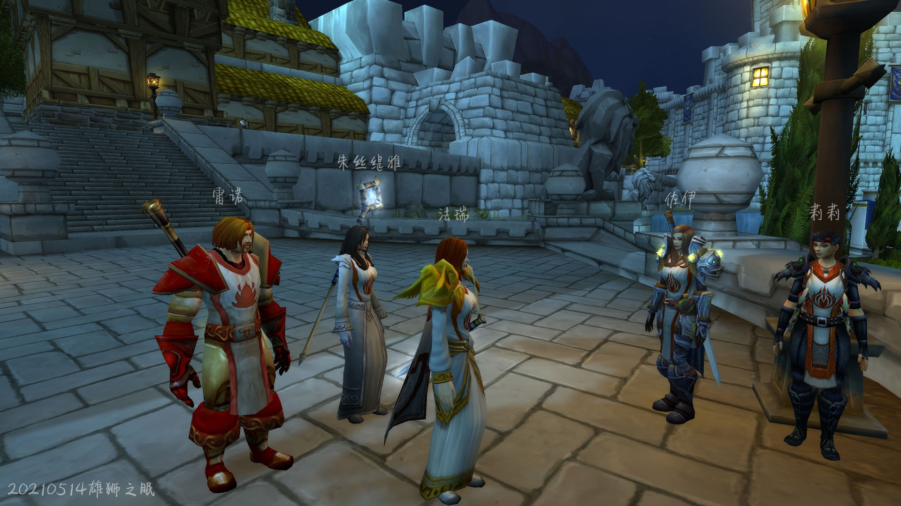
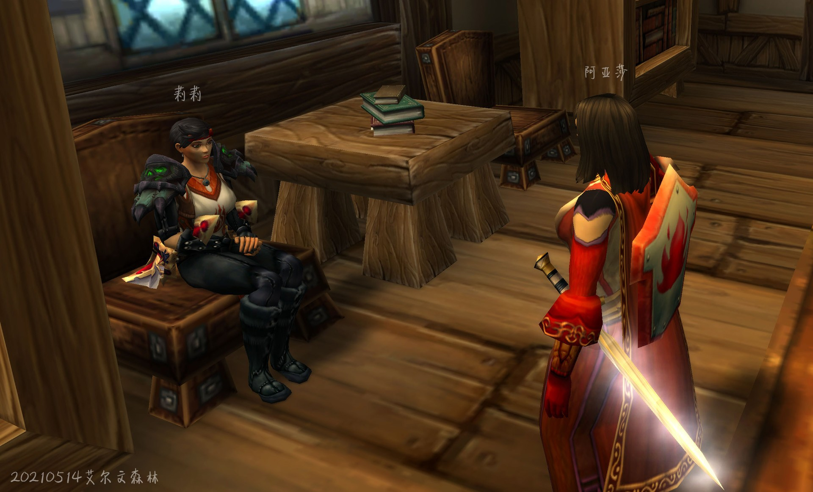

# 第零幕 一个机会

一个和煦的夜晚，炙热之心骑士团的骑士们在雄狮之眠外欣赏着夜色，关于北方的话题，让法瑞聊起了骑士团的圣物。

记录开始于 05/14/2021 的 20:08:44。

莉莉丶丹玛斯 随意的靠在了灯柱上

\[法瑞雅]: 骑士们，近来是否有北方的消息？

\[佐伊一世]: 北方?唔……我听说一些被遗忘者在蠢蠢欲动，不知道算不算?

\[莉莉丶丹玛斯]: 北方？

朱丝缇雅 皱了皱眉头

\[法瑞雅]: 是的，北方，我们总有一天会回去。但是那里看来还不容乐观，德鲁伊虽然正在净化洛丹伦的亡灵废土，但他们缺乏一种……真正的奇迹。

朱丝缇雅 赞同的点了点头

\[法瑞雅]: 我们缺乏一种真正的神迹。虽然我是团长，但是我对骑士团古老的历史，有时也记不清了。但是我从史官那听说……听说了骑士团有三大圣物。

\[雷諾莫格莱尼]: 圣光会消灭一切邪恶的东西

\[佐伊一世]: 圣物?三件?我们?

莉莉丶丹玛斯 若有所思

## 真理圣契

\[法瑞雅]: 第一个圣物，名叫真理圣契。上面记载了一个已经被所有圣骑士忘却了的神术，我听说，那个神术的名字，叫做神圣干涉。

\[朱丝缇雅]: 啊....

\[法瑞雅]: 牺牲自己的生命，用圣光短暂地保护一名战友不受伤害。使用这个神术会瞬间杀死使用者。

朱丝缇雅 听到了神圣干涉不由得吸了一口气

雷諾莫格莱尼 野心勃勃的倾听着，眼角仿佛闪过一道光。

\[法瑞雅]: 为了圣光，为了他人牺牲一切，甚至更多。这是骑士团的真理，所以叫真理圣契。

\[佐伊一世]: ……大无畏的牺牲精神。

\[佐伊一世]: 令人敬佩。

\[法瑞雅]: 真理圣契已经消失了，再也没有骑士懂得这种神术。我不知道，我不知道它的存在是否是必要的。这就是第一件圣物。

\[雷諾莫格莱尼]: 那件神器在哪？我们要尽快找到它！

\[朱丝缇雅]: 对，说得好

朱丝缇雅 紧跟着喊道

\[法瑞雅]: 恐怕我也不知道真理圣契在哪了。

\[法瑞雅]: 教会认为真理圣契是危险的，但我认为，骑士们可以掌握自己的死亡。

\[法瑞雅]: 圣光之中也有死亡。

## 命运之剑

\[法瑞雅]: 第二件圣物，我今天没有背着它。但是有时你们会看见我使用它。

\[法瑞雅]: 它叫命运之剑。在战争中，曾有一个兽人使用这把剑杀死了一个圣骑士，它因此得名。

雷諾莫格莱尼 思索如何得到这些圣物

\[法瑞雅]: 灰烬使者是专门杀亡灵的剑，而命运，是专门杀圣骑士的剑。

雷諾莫格莱尼对你点了点头。

莉莉丶丹玛斯 有些心不在焉。

\[朱丝缇雅]: 圣骑士吗....\*陷入了思索\*

\[法瑞雅]: 炙热之心骑士团的圣剑骑士曾经负责保管命运之剑，但是他失踪了，我就代为保管。

\[法瑞雅]: 专门杀圣骑士的剑！

\[法瑞雅]: 象征着骑士团的律法，任何堕落的圣骑士或者其他人，都会遭到命运之剑的审判。

雷諾莫格莱尼 后脊发凉

\[佐伊一世]: ......很合理，任何人都不能逃脱正义。

## 圣杯

\[法瑞雅]: 这就是第二件圣物，但是……我们还有……第三件圣物。这件圣物的传说我连我也不清楚。

\[法瑞雅]: 第三件圣物，叫做圣杯。

\[朱丝缇雅]: 连团长也...\*困惑地看着法瑞雅\*

\[法瑞雅]: 有一次机会，用圣杯净化所有亡灵。

莉莉丶丹玛斯 若有所思。

\[朱丝缇雅]: 净化亡灵....\*眼中燃起炽热的火光\*

\[法瑞雅]: 我听说，圣杯里的水是神圣的，可以用来治疗亡灵瘟疫。虽然我们都知道瘟疫是不治之症。

雷諾莫格莱尼 野心勃勃想要得到圣物。

\[法瑞雅]: 但是圣杯的力量或许超乎我们想象。我也不清楚，这是我最不了解的一件圣物。

\[法瑞雅]: 每次一想到洛丹伦，我就想到圣杯。或许……

\[朱丝缇雅]: 会伤害活着的人吗？

\[法瑞雅]: 或许它的重现，会改变一切。

朱丝缇雅 小心的问道

\[莉莉丶丹玛斯]: 圣杯？（低语）

\[法瑞雅]: 有的人认为圣杯是邪恶之物，我也不知道为什么，是的它有可能会伤害活着的人。

朱丝缇雅对你点了点头。

\[佐伊一世]: 所以，这次召集，是为了……祂?

\[法瑞雅]: 是的莉莉，就是圣杯，可能有治愈亡灵，净化一切的力量。

\[佐伊一世]: 等等，大团长——

\[佐伊一世]: 我——

佐伊一世 仔细想了想，斟酌用词

\[法瑞雅]: 怎么了？

\[佐伊一世]: 我收到一封信。

法瑞雅 扬起一边的眉毛。

\[法瑞雅]: 一封信？

\[佐伊一世]: 匿名信，一个卑劣小人所书写。

\[佐伊一世]: 一封恐吓信。

朱丝缇雅 好奇的看着佐伊一世

\[佐伊一世]: 她……

\[佐伊一世]: 我是说，它上面……

佐伊一世 神色复杂的看了一眼法瑞雅

\[佐伊一世]: 上面也提到了圣杯，我本以为是什么人的疯言疯语。

\[法瑞雅]: 提到了我吗？

朱丝缇雅 在冷静的思考着

\[佐伊一世]: 。。。\*沉默了一下·不能撒谎\*提到您了。

\[法瑞雅]: 看来圣杯的传说已经在骑士团中传播。

\[朱丝缇雅]: \*斟酌着用词\*大团长，这样会引发圣杯战争吗？

\[法瑞雅]: 这不一定是坏事。但是关于我的事……你们只需要知道我是第五任大团长，没什么好说的。

\[佐伊一世]: 可是——上面说——不，那些卑鄙的重伤的话语一定是污蔑！\*坚信\*

\[法瑞雅]: 圣杯战争，我只能说骑士团的使命是守护圣杯。

朱丝缇雅对你点了点头。

\[莉莉丶丹玛斯]: 怎么才能找到它那？ 有什么线索吗？

\[雷諾莫格莱尼]: 我可以保管圣杯，如果不介意的话......

\[法瑞雅]: 这些都是传说，我也不知道圣杯的具体下落。但它可能与骑士团的其他重要物品埋藏在一起。

\[朱丝缇雅]: 也就是说..墓地...

\[法瑞雅]: 是的，但是骑士团的律法禁止惊扰死者。

朱丝缇雅 为自己的脱口而出懊悔不已

\[法瑞雅]: 你们就当圣杯是一个传说吧，毕竟我其实也不相信净化亡灵的东西是存在的。连圣光都做不到。

朱丝缇雅对你点了点头。

\[法瑞雅]: 遇到亡灵，我们只能送他们安息。

莉莉丶丹玛斯 看着天上飞来的鸽子，

莉莉丶丹玛斯 从鸽子身上取下了一封信

\[法瑞雅]: 这次召集，其实我只是想跟你们一起欣赏这里的夜景。也是北方的事让我想起了圣杯，但不要在意。

\[莉莉丶丹玛斯]: 大团长

\[雷諾莫格莱尼]: 如果能拥有这些武器，我们的力量会大增

\[莉莉丶丹玛斯]: 北方斥候来报

\[法瑞雅]: 怎么了？

\[佐伊一世]: 这里的景色确实——\*中断\*

\[莉莉丶丹玛斯]: 提瑞斯法林地的亡灵又集结的现象

朱丝缇雅 内心激动了起来

\[法瑞雅]: 如果联盟召唤我们，我们就会前往。但在那之前，我们驻扎在暴风城。我知道这对于我们之中的北方人来说，比较不能接受。

朱丝缇雅 忍住了自己的复仇的怒火

\[莉莉丶丹玛斯]: 我会通知斥候密切观察

\[法瑞雅]: 好的。

法瑞雅 看向远方的星辰。

## 一个机会

当晚，在众人解散后，在艾尔文森林深处的房屋内。莉莉丶丹玛斯见了一个人。她穿着血色十字军的全副战甲。

记录开始于 05/14/2021 的 20:39:54。

\[阿亚莎·布伦特]: 啊，你总算来了。

\[莉莉丶丹玛斯]: 来了。路上没被人看到吧

\[莉莉丶丹玛斯]: 坐下说。

\[阿亚莎·布伦特]: 没有，我换了几条不同的路。再说那些骑士们根本不善隐藏。

\[阿亚莎·布伦特]: 我快受不了他们了。

\[阿亚莎·布伦特]: 讨论圣光却如此虚伪。

莉莉丶丹玛斯大笑。

\[莉莉丶丹玛斯]: 先别说其他的了

\[莉莉丶丹玛斯]: 我需要你帮我去做件事

\[阿亚莎·布伦特]: 什么事？

\[莉莉丶丹玛斯]: 我刚刚得到一个消息 能彻底消灭亡灵的消息

\[阿亚莎·布伦特]: 能消灭亡灵？这种东西不存在，不然我们早就……

\[阿亚莎·布伦特]: 那些事就不会发生。

\[莉莉丶丹玛斯]: 也许把 但是我们不能放过一丝希望

\[阿亚莎·布伦特]: 是的，哪怕只有一点希望。我也愿意去做。

\[莉莉丶丹玛斯]: 听说有一件神器 可以彻底净化亡灵

\[阿亚莎·布伦特]: 我们可不是骑士团，愿意在南方享受荣华富贵。

\[阿亚莎·布伦特]: 一件神器？

\[莉莉丶丹玛斯]: 对 你也知道我在谁的身边

\[阿亚莎·布伦特]: 我知道，她绝对相信你，呵。

\[莉莉丶丹玛斯]: 好像叫什么圣杯，

\[阿亚莎·布伦特]: 圣杯？听起来像是一件上古神器。

\[莉莉丶丹玛斯]: 具体在哪里无从得知， 从她的话语中能听出来 这件神器好像和其他东西埋在哪里

\[阿亚莎·布伦特]: 骑士团的墓地就在暴风城。

\[莉莉丶丹玛斯]: 这些都需要你们去调查。。

\[莉莉丶丹玛斯]: 如果有万分之一的希望， 我也不愿意放弃。。

\[阿亚莎·布伦特]: 我也是。我懂这种感受。

\[莉莉丶丹玛斯]: 但是 我无法从她嘴里在获得什么有用的情报，

\[莉莉丶丹玛斯]: 如果问多了 她可能会起疑心

\[阿亚莎·布伦特]: 我会去墓地彻底调查。如果这个圣杯埋藏在那，那么圣杯是我们的。她其实什么也不知道是吧？

\[莉莉丶丹玛斯]: 或许吧。

\[莉莉丶丹玛斯]: 如果真的影响我们的计划，我会动手的，，

\[阿亚莎·布伦特]: 你要小心，那个女骑士虽然表面上来起来无害，但她确实是一个老兵。

\[莉莉丶丹玛斯]: 放心吧，一切为了洛丹伦。

\[阿亚莎·布伦特]: 为了洛丹伦。

你满怀敬意地向莉莉丶丹玛斯致礼。

阿亚莎·布伦特当晚便来到炙热之心骑士团位于暴风城的墓地。

